# 2. Go 基础

Go 之所以成为一种易学的语言，是因为你需要了解的关于 Go 程序的一切都一目了然。无需记住任何语言规则，因为它们都在应用程序代码中。本章涵盖了 Go 编程语言的基础知识，例如接受输入、使用数学运算符和包、管理内存、使用不同的数据结构以及理解基于 Go 的应用程序的程序流程。本章还涵盖了使用函数并返回多个值，以及如何读写文件数据和如何处理 JSON 数据。

## Go 的起源

Go 基于多种不同的编程语言。它最初被设计为 C 语言的下一代。它能够完成用 C 语言可以做的一切，包括系统编程、应用程序开发等。

## Go 语法

Go 从 C 及其相关语言（如 C++、C#、Java 等）中借鉴了大量语法。与此同时，它还借鉴了 Pascal、Modula、Oberon 以及其他类似语言的语法。Go 最大的吸引力之一在于，由于其精确且全面的关键字与语法集，它的程序非常简洁。为了有效使用任何语言，你必须掌握该语言特定的基本语法规则。以下是 Go 编程语言设计者设定的一些最重要的语法规则列表。

1.  **大小写敏感**
    - 你必须严格按照官方文档（[`https://go.dev/doc/`](https://go.dev/doc/)）中所述的准确形式拼写标识符，如函数、变量和类型名称。
    - 包和变量的名称使用小写字母和大小写混合形式。
    - 类型的方法和字段首字母大写。
    - 在 Go 中，首字母大写字符表示特殊用途。
        - 在其他高级编程语言（如 C++、C#、Java 等）中相当于 `public` 关键字，在 Go 中，首字母大写字符表示该标识符是导出的。
    - 类似地，在 Go 中，小写首字母字符表示特定方法或变量未被导出，除了声明它的代码块之外，应用程序的其他部分不能访问它，这相当于 `private` 关键字。

2.  **分号可以省略**
    - 为了减少开发者的输入量，如清单 2-1 所示，Go 去掉了行尾的分号。这意味着换行即结束语句，不需要分号。

    ```
    var color [2] string
    colors[0] = "black"
    colors[1] = "white"
    清单 2-1
    不需要用分号作为行尾指示符
    ```

    即使语言规范要求使用分号，也不需要显式键入它们。得益于词法分析器（解析和分析代码的软件组件），分号会在编译过程中根据需要自动添加。

    **词法分析器添加分号的规则**

    当一条语句被确定是完整的，并且词法分析器遇到换行符时，这意味着该语句结束了而开发者没有显式添加分号，那么词法分析器就会自动添加。

    **注意：** 你不能像在其他语言中那样随意自由地添加换行符或使用额外的换行符来中断语句，因为在某些情况下，这会被词法分析器误解释。

3.  **带花括号的代码块**
    - 代码块，即旨在组合在一起的多行代码，被括在花括号内。参见清单 2-2。

    ```
    sum := 0
    for i :=0; i<10; i++{
        sum += i
    }
    fmt.Println(sum) // 打印 '45'
    清单 2-2
    使用花括号表示代码块
    ```

    在清单 2-2 中，声明了一个名为 `sum` 的变量，然后为其赋值 0。`for` 循环从 0 初始化到 10，用于将 `sum` 的值增加 `i`。循环结束后，使用一个名为 `Println` 或“打印行”的函数打印 `sum` 变量中存储的值。`Println` 是名为 `FMT` 的包的内置函数。你想要迭代的代码包裹在两个花括号之间。注意，确保左花括号与任何前一个语句在同一行是很重要的。

4.  **内置函数**
    - Go 支持一组内置函数，这些函数总是可以在代码中使用，无需导入任何内容。这些函数是一个名为 `Builtin` 的特殊包的成员。Go 编译器假定 `Builtin` 包始终被导入。示例函数包括：
        - `len(string)` 返回字符串的长度。
        - `panic(error)` 停止执行并显示错误消息。
        - `recover()` 管理 panic 状态下的 goroutine 的行为。

    有关更多信息，你可以访问 [`https://pkg.go.dev/builtin`](https://pkg.go.dev/builtin) 上 [builtin 包](https://pkg.go.dev/builtin)的官方文档。


## 安装 Go

要安装 Go 编译器，请访问 [`go.dev/dl/`](https://go.dev/dl/) 并下载适合您系统的二进制发行版。只需运行安装程序即可在系统上安装编译器。

为了验证安装，在 Windows 操作系统上，打开命令提示符并输入 `go version`，如图 2-1 所示。输出显示系统上安装的 Go 编译器的版本。

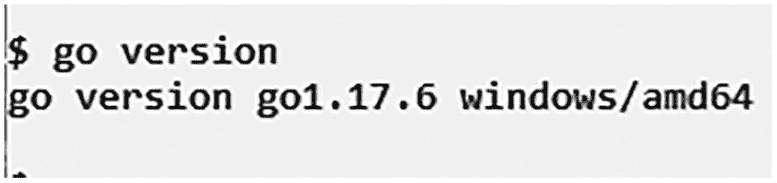

文本截图显示系统上安装的 Go 编译器的输出版本；它显示了 `go 1.17.6 windows/amd64`。

图 2-1 — 显示已安装 Go 版本的输出

如果在命令提示符下输入 `path` 命令，可以看到所有 Go 可执行命令的保存位置。如果能找到 Go 安装目录的路径，例如 `C:\Users\UserName\go\bin`，就可以开始用 Go 构建程序了。

要在 macOS 上找到 Go 的安装目录，请打开终端窗口并输入 `export $PATH`。成功执行后，将显示目录列表，指示 Go 安装到的 `bin` 文件夹的路径，例如 `/user/local/go/bin`。此外，除了将执行 Go 程序的命令添加到目录短语中之外，还会在根目录下的某个路径中添加一个文件。为确保可以从任何位置运行 Go 程序，请转到 `home` 目录并输入 `go version`。如果一切正常，应该会看到显示所使用的 Go 语言版本的输出，如图 2-2 所示。

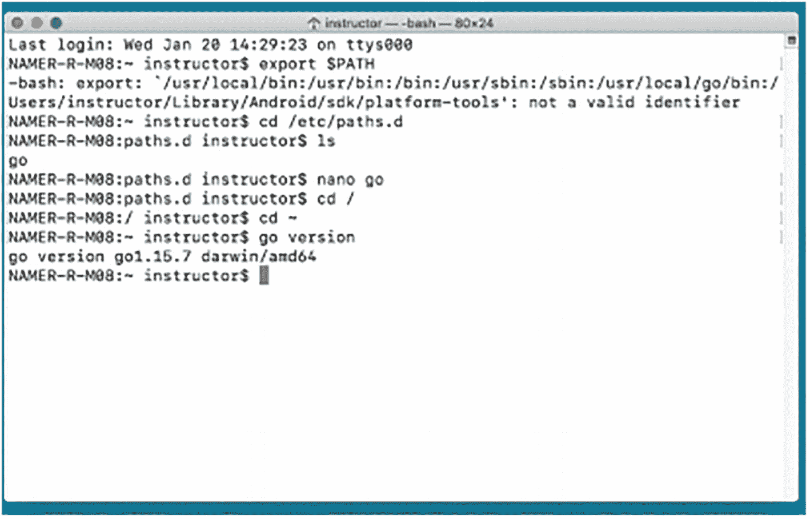

屏幕截图显示用于检查 `PATH` 变量的程序以及指示所使用的 Go 语言版本的输出。显示了登录信息、路径和版本。

图 2-2 — 检查 `PATH` 变量和版本以确保正确安装 Go 编译器

如果能看到版本信息，就可以开始使用 Go 语言进行编程了。您首先想要探索的是 Go Playground。

## Go Playground

开始编码和开发基于 Go 的程序的最快方法之一是使用 [Go Playground](https://go.dev/play/)，这是一个基于 Web 的 IDE。如图 2-3 所示，无需安装任何东西，Go Playground 允许用户编辑、运行和试验 Go 编程语言。单击“运行”按钮时，Go Playground 会在谷歌服务器上编译并执行 Go 代码，并输出执行结果。

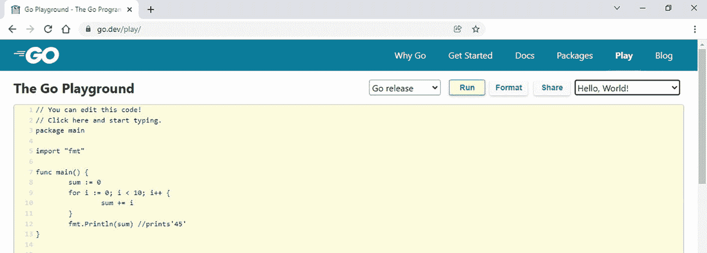

屏幕截图显示了一个程序，展示了使用基于 Web 的 IDE Go Playground 开始编码和开发基于 Go 的程序的最快方法之一。

图 2-3 — Go Playground IDE

Go Playground 是一个完全免费使用的服务，没有任何限制。无需用户注册或支付许可费。此外，它对您可以处理的源代码文件数量或运行代码的次数没有限制。这是一个无需创建或编译任何本地源文件即可测试 Go 代码的好方法。尽管如此，还有其他几个 IDE 可用于开发 Go 应用程序。

## 使用 IDE 开发 Go 应用程序

没有一个单一的集成开发环境（IDE）是由 Go 开发团队认可甚至开发的。但是，有许多适用于商业和开源 IDE 的插件是由 Go 社区或 IDE 供应商创建的，您选择哪种主要取决于您已经熟悉的开发环境。在本书中，我们将使用 Go Playground 和 Visual Studio Code 来编写和运行 Go 程序。让我们开始学习如何编写 Go 应用程序。

## 开始编写 Go 应用程序入门

一旦安装了 Go 开发工具，就可以根据需要创建任意数量的 Go 应用程序。通常，一个 Go 程序由以下部分组成：

- 声明包名
- 导入包
- 声明和定义函数
- 变量
- 表达式和语句
- 注释

### 让我们打印 Hello World！

在学习 Go 编程语言的基本构建块之前，了解 Go 程序的最小结构非常重要。清单 2-3 演示了如何将 `"Hello World!"` 消息作为输出打印到屏幕上。尽管该程序简洁且功能最少，但它足以理解 Go 的程序结构。

```
package main
import (
"fmt"
)
// 单行注释
/*
多
行
注释
*/
func main() {
fmt.Println("Hello, World !")
}
```

清单 2-3 — 说明 Go 程序不同部分的基本程序

**Go 程序的不同部分**

清单 2-3 解释了以下 Go 程序的不同部分：

- **包：** 在 Go 程序的第一行，总是提及包。在清单 2-3 中，语句 `package main` 指明了该程序所属的包名。此语句是强制性的，因为在 Go 中，所有程序都在包中组织和运行。对于任何程序，执行的起点都是 `main` 包。此外，每个包都关联了路径和名称。

- **导入：** `import` 关键字用于导入应用程序将使用的不同包。它是一个预处理器指令，指示 Go 编译器包含所提及包中的所有文件。在前面的例子中，我们导入了 `fmt`（格式）包，它提供了用于格式化输入和输出的不同函数。

- **注释：** 在 Go 中，双斜杠 `//` 用于表示代码中的单行注释。多行注释包含在 `/* */` 块中。

- **函数（Func）：** `func` 关键字用于声明函数；在这种情况下，是一个名为 `main` 的函数。将每个函数的主体包含在花括号 `{}` 内非常重要。这对于 Go 编译器知道每个函数的开始和结束位置是必要的。

- **主函数：** 执行从 `main` 包中的 `main` 函数开始，这使得 `main` 标识符非常重要。如果排除了 `main` 函数，编译器将抛出错误。

- `fmt` 包中可用的内建函数之一是 `Println(...)` 函数。通过导入 `fmt` 包，您也导出了 `Println` 方法。`Println` 函数用于在屏幕上显示输出。

- 在 Go 中，大写的标识符表示该特定标识符是导出的，例如，`Println` 方法的首字母是大写字母。在 Go 中，“导出”一词意味着该函数、常量或变量可以被该特定包的导入者访问。


#### 如何执行 Go 程序

要执行程序，请点击 Go Playground 上的 `Run` 按钮。你的代码将在谷歌服务器上编译并执行，输出结果会显示在屏幕上。

要在 Windows 上通过命令提示符执行程序，可以使用 `go run filename.go` 命令。例如，如图 2-4 所示，运行代码清单 2-3 的命令是 `go run main.go`。要构建应用程序，请运行 `go build filename.go` 命令。例如，构建示例程序时，你需要执行命令 `go build main.go`。要运行编译后的程序版本，你需要执行 `./filename` 命令，例如 `./main`。

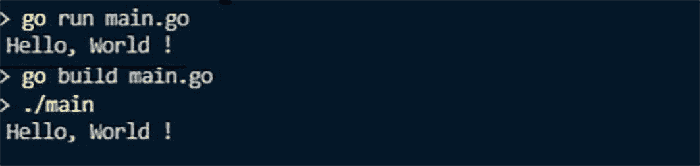

截图展示了用于运行代码清单的命令 `go run main.go`，以及用于构建应用程序的命令 `go build main.go`。

**图 2-4** 运行和构建 Go 程序的命令

有趣的是，编译后的应用程序运行速度比 `go run` 命令更快。构建源代码文件将产生一个编译后的二进制文件，该文件专门针对你当前的操作系统设计。尽管也可以为其他操作系统编译程序，但默认情况下，编译器会生成与你的操作系统兼容的二进制文件。

#### 关键字

与每种编程语言一样，Go 也有一套关键字（为特殊用途保留的词）。这些关键字不能用作内容、变量、函数或其他任何目的的标识符名称。表 2-1 列出了 Go 的关键字。

**表 2-1** Go 的关键字

| `chan` | `const` | `goto` | `interface` | `struct` |
| `defer` | `case` | `func` | `var` | `select` |
| `break` | `for` | `go` | `import` | `continue` |
| `default` | `fallthrough` | `switch` | `type` | `range` |
| `if` | `else` | `return` | `package` | `map` |

既然你已经了解了这些关键字，接下来就可以学习如何在 Go 中使用变量和其他数据结构了。

### 变量

与其他编程语言一样，Go 中使用变量在内存中存储数据。作为一种静态类型语言，Go 要求每个变量都必须分配一个类型。一旦分配了类型，就不能更改。为变量设置类型有两种方式——显式或隐式。显式是指在声明时指明类型名称。隐式是指编译器会根据变量的初始值来推断其类型。

在 Go 中，每个变量都应该有一个类型。该类型在确定变量内存的布局和大小、允许的取值范围以及适用于该变量的操作集合方面起着重要作用。

#### 变量数据类型

Go 允许用户定义类型，并内置了多种数据类型。以下是 Go 中一些基本的 built-in 数据类型：

*   **布尔型：** `bool` 以 `true`/`false` 的形式表示布尔数据。布尔数据类型只能被赋予 `true` 和 `false` 这两个值。
*   **字符串：** 在 Go 中，`string` 类型的变量包含一系列字符。
*   **数值数据类型：**
    *   **整数型：** 用于存储整数。
        *   **定长整数：** 包含的格式有 `uint8`、`uint16`、`uint32`、`int8`、`int16` 和 `int32`。这些用于声明无符号或有符号整数。格式名称中的数字是位数，它影响变量可被赋予的数值范围。
    *   **浮点型：** 用于存储浮点数。支持的格式包括 `float32` 和 `float64`。
    *   **复数型：** 复数包含两部分：实数和虚数。支持的格式有 `complex64` 和 `complex128`。
    *   **别名：** 这些可以用来代替完整的类型名称，例如 `byte`（等同于 `uint8`）、`uint`（32 或 64 位）、`rune`（等同于 `int32`）、`int`（等同于 `uint`）和 `uintptr`（一种用于存储指针值未解释位的无符号整数）。
*   **数据集合：** Go 也为不同的数据集合提供了内置类型。
    *   **数组和切片：** 用于管理有序数据集合。
    *   **映射和结构体：** 用于管理值的聚合。
    *   **枚举：** 用于存储一组命名的常量值。
*   **语言组织类型：**
    *   **函数：** Go 将函数视为一种类型。这允许将一个函数作为参数传递给另一个函数。
    *   **接口：** 用于指定一个或多个方法签名的集合。
    *   **通道：** 用于连接 goroutine。
*   **数据管理：**
    *   **指针：** 存储内存位置（变量）的直接地址。

除了内置类型之外，Go 还允许程序员创建用户定义的数据类型。

#### 变量命名约定

变量名可以由字母、数字和下划线组成。但是，变量名应以字母或下划线开头。由于 Go 语言是区分大小写的，因此小写和大写字母会被区别对待。


#### 声明变量

由于 Go 是静态类型语言，它要求您在编译过程中为程序中使用的每个变量设置类型（显式或隐式）。分配的类型在运行时无法更改。

清单 2-4 展示了在 Go 中声明和分配变量类型的不同方式。在变量的显式声明中，使用了 `var` 关键字，其后指定变量的名称和类型。例如，如第 8 行和第 12 行所示，分配初始值是可选的。第 10 行在 `print` 函数中使用了占位符来打印变量中存储的值以及一条消息。请注意，`Printf` 不会自动添加换行符，因此我们添加了 `\n` 来实现换行。

```
package main
import(
"fmt"
)
func main() {
//显式声明
var aStringVariable string = "我是一个字符串"
fmt.Println(aStringVariable)
fmt.Printf("打印变量及其文本: %s \n", aStringVariable)
var anotherStringVariable string
fmt.Println(anotherStringVariable)
fmt.Printf("打印变量及其文本: %s \n", anotherStringVariable)
var defaultInt int
fmt.Println(defaultInt)
//隐式声明
myString := "字符串的隐式声明"
fmt.Println(myString)
}
清单 2-4
在 Go 中声明变量的方式
```

在隐式声明的情况下，变量类型是根据分配给变量的初始值推断出来的。清单 2-4 中的第 20 行说明了隐式声明。请注意，`:=` 运算符仅适用于函数内部的变量声明。必须使用 `var` 关键字来声明函数外部的变量。

`var` 语句也可以用来声明变量列表，如图 2-5 所示。

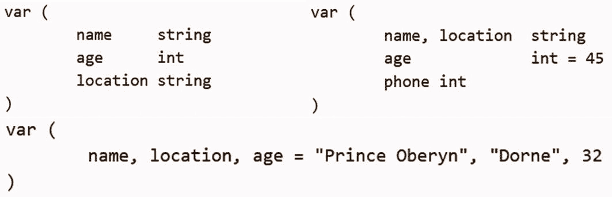

一个 `var` 语句的列表，该语句声明了 Go 中的一组变量 - chan、const、goto、interface、struct、defer、case、func、var、select、break、for、go、continue 和 default 等。

图 2-5

在 Go 中声明变量的不同方式

要声明常量，程序员必须使用 `const` 关键字。图 2-6 展示了如何在 Go 程序中声明常量。

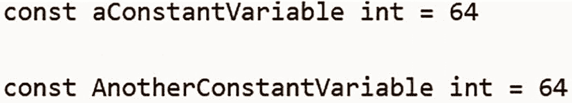

一张截图展示了 Go 程序中声明的常量。`aconstantvariable int` 等于 `64`，并且 `anotherconstantvariable int` 等于 `64`。

图 2-6

在 Go 中声明常量

常量总是在函数外部声明。如果常量变量的名称以小写字母开头，这意味着它仅可供程序的函数使用（类似于 `private` 关键字）。当变量名称以大写字母开头时，该变量是公共的。

### 获取用户输入

在上一节中，您了解了 `fmt` 包的用法，通过它可以在屏幕上输出不同的消息。本节演示如何从控制台读取用户输入，将其存储在变量中，或将其回显到屏幕上。请注意，标准输入（`stdin`）是用于读取输入数据的一个流。

关于 Go Playground 需要记住的重要一点是，它不支持交互式程序，因此无法从 `os.Stdin` 读取。因此，每当需要用户输入时，最好使用其他 IDE，例如 Visual Studio 或 Code，来测试本书中的代码。

在 Go 中，`OS` 和 `IO` 包包含了用于从控制台读取标准输入的不同函数。这些函数集用于扫描格式化文本并提取值。

*   `Scan`、`Scanf` 和 `Scanln` 可用于从 `os.Stdin` 读取输入。
*   `Fscan`、`Fscanf` 和 `Fscanln` 可用于从指定的 `io.Reader` 读取输入。
*   `Sscan`、`Sscanf` 和 `Sscanln` 可用于从参数字符串读取输入。

#### 使用 scanf

为了使用 `Scanf` 函数，您必须导入 `fmt` 包。它用于指定输入的读取方式。`Scanf` 函数从 `stdin` 扫描文本输入，并将空格分隔的值按字符串格式中定义的顺序存储到连续的参数中。`Scanf` 函数还会返回成功扫描的项数。如果返回的项数少于指定的参数，该函数将抛出错误。这是因为输入中的换行符必须与格式中指定的换行符匹配。清单 2-5 说明了使用 `Scanf` 函数获取用户输入的方法。

```
package main
import (
"fmt"
)
func main() {
var name string
var age int
fmt.Print("请输入您的姓名: ")
fmt.Scanf("%s", &name)
fmt.Println("你好 ", name)
fmt.Print("请输入您的年龄: ")
fmt.Scan(&age)
fmt.Println("您的年龄是 ", age)
}
清单 2-5
使用内置的 Scanf 函数获取用户输入
```

**输出：**

```
请输入您的姓名: Maryam
你好 Maryam
请输入您的年龄: 30
您的年龄是 30
```

#### 使用 Scanln

`Scanln` 从 `stdin` 扫描文本；但是，当遇到换行符时，它会停止扫描。因此，有必要在最后一个项之后放置一个换行符或 EOF 来指示输入的结束。清单 2-6 说明了 `Scanln` 的使用方法。

```
package main
import (
"fmt"
)
func main() {
var name string
var age int
fmt.Print("请输入您的姓名: ")
fmt.Scanln(&name)
fmt.Println("你好 ", name)
fmt.Print("请输入您的年龄: ")
fmt.Scanln(&age)
fmt.Println("您的年龄是 ", age)
var anInt int = 5
var aFloat float64 = 42
sum := float64(anInt) + aFloat
fmt.Printf("总和: %v, 类型: %T \n", sum, sum)
}
清单 2-6
在 Go 中使用 Scanln 内置函数获取用户输入
```

**输出：**

```
请输入您的姓名: Maryam
你好 Maryam
请输入您的年龄: 30
您的年龄是 30
```

**Scan 与 Reader 函数对比**

要拆分空格分隔的标记，您使用 `Scan` 函数；要读取完整的行，您使用 `reader` 函数。

#### 使用 bufio

缓冲 I/O 通过 `bufio` 包实现。`bufio` 包装了 `io.Writer` 或 `io.Reader` 对象，并返回一个新的 `Writer` 或 `Reader` 对象，该对象实现了实用方法所需的接口。这种包装还提供了文本 I/O 辅助和缓冲功能。

在清单 2-7 中，第 11 行声明了两个变量，一个用于存储输入。第二个是错误对象，用于存储任何错误消息。

```
1   package main
2   import(
3       "bufio"
4       "fmt"
5       "os"
6   )

8   func main(){
9         reader := bufio.NewReader(os.Stdin)
10         fmt.Print("输入一些文本: ")
11         input, _ := reader.ReadString('\n')
12         fmt.Println("您输入了: ", input)
13   }
清单 2-7
在 Go 中使用 bufio 内置函数获取用户输入
```

**输出：**

```
输入文本: 嗨！我是作者
您输入了: 嗨！我是作者
```

如图所示，如果您想在 Go 中忽略一个变量，可以将其命名为下划线。

现在您已经知道如何在 Go 程序中使用变量和获取用户输入，是时候学习如何使用 Go 中的不同数学运算符了。


## 数学运算符与包

Go 语言支持与其他 C 风格语言相同的数学运算符，包括常规算术运算符、所有位运算符、赋值运算符和关系运算符。表 2-2 至 2-6 列出了 Go 语言中的所有运算符。

**表 2-6** — Go 赋值运算符列表

| **赋值运算符** | 描述 |
|---|---|
| `=` | 简单赋值运算符。将右操作数的值赋给左操作数。例如，`Z = X + Y` 会将 `X + Y` 的计算结果赋给 `Z`。 |
| `+=` | 加并赋值运算符。将右操作数的值与左操作数的值相加，并将结果赋给左操作数。例如，`X += Y` 等价于 `X = X + Y`。 |
| `-=` | 减并赋值运算符。从左操作数的值中减去右操作数的值，并将结果赋给左操作数。例如，`X -= Y` 等价于 `X = X - Y`。 |
| `*=` | 乘并赋值运算符。将左操作数的值乘以右操作数的值，并将结果赋给左操作数。例如，`X *= Y` 等价于 `X = X * Y`。 |
| `/=` | 除并赋值运算符。将左操作数的值除以右操作数的值，并将结果赋给左操作数。例如，`X /= Y` 等价于 `X = X / Y`。 |
| `%=` | 取模并赋值运算符。将左操作数的值除以右操作数的值，并将余数赋给左操作数。例如，`X %= Y` 等价于 `X = X % Y`。 |
| `<<=` | 左移并赋值运算符。将左操作数的值向左移动右操作数指定的位数。例如，`X <<= 1` 等价于 `X = X << 1`。 |
| `>>=` | 右移并赋值运算符。将左操作数的值向右移动右操作数指定的位数。例如，`X >>= 1` 等价于 `X = X >> 1`。 |
| `&=` | 按位 `AND` 赋值运算符。例如，`Y &= 3` 等价于 `Y = Y & 3`。 |
| `^=` | 按位异或 `OR` 并赋值运算符。例如，`Y ^= 3` 等价于 `Y = Y ^ 3`。 |
| `&#124;=` | 按位或 `OR` 并赋值运算符。例如，`Y &#124;= 3` 等价于 `Y = Y &#124; 2`。 |

**表 2-5** — Go 逻辑运算符列表

| **逻辑运算符** | 描述 |
|---|---|
| `&&` | 逻辑 `AND` 运算符。如果两个操作数都为 `false`，则返回 `false`；如果两个操作数都为 `true`，则返回 `true`。 |
| `&#124;&#124;` | 逻辑 OR 运算符。如果任一操作数为 `true`，则返回 `true`。 |
| `!` | 逻辑 `NOT` 运算符。反转其操作数的逻辑状态，即将 `true` 变为 `false`，反之亦然。 |

**表 2-4** — Go 关系运算符列表

| **关系运算符** | 描述 |
|---|---|
| `==` | 检查两个操作数的值是否相等，如果相等则返回 `true`。 |
| `!=` | 检查两个操作数的值是否不相等，如果不相等则返回 `true`。 |
| `>` | 检查左操作数是否大于右操作数，如果是则返回 `true`。 |
| `<` | 检查左操作数是否小于右操作数，如果是则返回 `true`。 |
| `<=` | 检查左操作数是否小于或等于右操作数，如果是则返回 `true`。 |
| `>=` | 检查左操作数是否大于或等于右操作数，如果是则返回 `true`。 |

**表 2-3** — Go 位运算符列表

| **位运算符** | 描述 |
|---|---|
| `&` | 二进制 `AND` 运算符。如果相应位在两个操作数中都存在，则二进制 AND 运算符会将该位复制到结果中。 |
| `&#124;` | 二进制 `OR` 运算符。如果相应位在任一操作数中存在，则二进制 OR 运算符会将该位复制到结果中。 |
| `^` | 按位 `XOR` 运算符。如果相应位在任一操作数中被设置，则按位异或 `xor` 运算符会复制该位。 |
| `&^` | 位清除。 |
| `<<` | 左移运算符。将左操作数的值向左移动右操作数指定的位数。 |
| `>>` | 右移运算符。将左操作数的值向右移动右操作数指定的位数。 |

**表 2-2** — Go 算术运算符列表

| **算术运算符** | 描述 |
|---|---|
| `+` | 求和运算符，用于加法运算。 |
| `-` | 求差运算符，用于减法运算。 |
| `*` | 乘法运算符，用于求积。 |
| `/` | 求商运算符，用于求除法后的商。 |
| `%` | 求余运算符，用于求除法后的余数。 |
| `--` | 递减运算符，将操作数的值减一，并将结果存回操作数。 |
| `++` | 递增运算符，将操作数的值加一，并将结果存回操作数。 |

请注意，Go 语言不支持数值类型的隐式转换。这意味着，例如，你不能在不进行转换的情况下，将一个整数值与一个浮点数值相加。

代码清单 2-8 包含两个变量，一个是整数，另一个是浮点数。当你尝试将它们相加时，会导致 `"invalid operation"` 错误，并使应用程序崩溃。

```
var anInt int = 5
var aFloat float32 = 42
sum := anInt + aFloat  //invalid operation
fmt.Printf("Sum: %v, Type: %T \n", sum, sum)
```

代码清单 2-8 — 演示 Go 不支持数值类型隐式转换

**输出：**

一张显示“无效操作：类型不匹配的 `int` 和 `float64`”的编译器输出截图（类型不匹配）。

为了正确执行此操作，你必须将其中一个变量转换为与另一个变量匹配的类型。为了实现此目标，你需要将目标类型作为函数调用包裹住该值，如代码清单 2-9 所示。

```
var anInt int = 5
var aFloat float32 = 42
sum := float32(anInt) + aFloat
fmt.Printf("Sum: %v, Type: %T \n", sum, sum)
```

代码清单 2-9 — Go 中数值类型的显式转换

**输出：**

```
Sum: 47, Type: float32
```

### Math 包

要执行不同的数学运算，你可以使用 `math` 包。它包含不同的函数和常量，例如 `pi`。Go 语言为数学运算提供了许多工具，包括 `math` 包中的函数和常量等运算符和成员。代码清单 2-10 演示了如何使用 `math` 包中的函数和常量。有关 `math` 包的更多信息，请参考 `https://pkg.go.dev/math` 上的[官方文档](https://pkg.go.dev/math)。

```
package main
import (
"fmt"
"math"
)
func main() {
i1, i2, i3 := 12, 45, 68
intSum := i1 + i2 + i3
fmt.Println("Integer Sum: ", intSum)
f1, f2, f3 := 23.5, 65.1, 76.3
floatSum := f1 + f2 + f3
fmt.Println("Float Sum: ", floatSum)
floatSum = math.Round(floatSum)
fmt.Println("Rounded Sum is: ", floatSum)
floatSum = math.Round(floatSum*100) / 100
fmt.Println("Sum Rounded To Nearest 2 Decimals: ", floatSum)
circleRadius := 15.6
circumference := circleRadius * 2 * math.Pi
fmt.Printf("Circumference: %.2f\n", circumference)
}
```

代码清单 2-10 — 演示在 Go 中使用 Math 包的基本程序


#### 日期与时间

在 Go 语言中，`time`包用于管理`日期`和`时间`类型。使用`time`类型声明的变量封装了处理时间和日期类型数据所需的一切，包括时区管理、数学运算等。代码清单 2-11 展示了`time`包的用法。

```go
package main
import (
"fmt"
"time"
)
func main() {
now := time.Now()
fmt.Println("当前时间是：", now)
formatDate := time.Date(2009, time.November, 10, 23, 0, 0, 0, time.UTC)
fmt.Println("Go 语言发布于：", formatDate)
fmt.Println(formatDate.Format(time.ANSIC))
parsedTime, _ := time.Parse(time.ANSIC, "Tue Nov 10 23:00:00 2009")
fmt.Printf("parsedTime 的类型是 %T\n", parsedTime)
}
代码清单 2-11
展示 Go 语言中使用 time 包的基本程序
```

**输出：**

```
当前时间是： 2022-08-29 21:06:14.02792 +0500 PKT m=+0.003998301
Go 语言发布于： 2009-11-10 23:00:00 +0000 UTC
Tue Nov 10 23:00:00 2009
parsedTime 的类型是 time.Time
```

代码清单 2-11 展示了如何使用`time 包`来处理`日期`和`时间`类型。在示例中，第#10 行声明了一个名为`now`的变量。它将使用内置的`time.Now()`函数进行初始化，该函数返回一个包含当前日期、时间和时区的时间戳。在 Go 中，用户也可以创建自己的显式日期和时间值。第#14 行声明了一个名为`formatDate`的变量，它使用`time.Date()`函数进行初始化。`Date()`函数根据给定的位置，按照`yyyy-mm-dd hh:mm:ss + nsec nanoseconds`格式返回相应时区的时间。你还可以使用`daytime`值的格式化版本，如第#18 行所示。`Format()`函数返回时间值的文本表示，格式由参数定义的布局决定。此示例使用了 ANSIC 格式，但你可以参考[`https://pkg.go.dev/time#Time.Format`](https://pkg.go.dev/time%2523Time.Format)的官方文档，了解其他标准格式。

在代码清单 2-12 中，`Parse()`函数在解析字符串后返回其时间值表示。

```go
parsedTime, _ := time.Parse(time.ANSIC, "Tue Nov 10 23:00:00 2009")
fmt.Printf("parsedTime 的类型是 %T \n", parsedTime)
代码清单 2-12
使用 time 包中的 Parse 函数
```

**输出：**

```
parsedTime 的类型是 time.Time
```

由于`Parse()`函数可能返回一个错误对象，在此示例中，我们添加了下划线来忽略该对象。时间对象还有许多其他有用的函数。例如，你可以添加日期、执行特殊格式化等。还有一些模式可以让你在格式化`daytime`值时拥有完全的灵活性。`time`包中的函数和常量为你提供了存储和管理日期与时间值所需的所有工具。有关此主题的更多信息，请参考[time 包](https://pkg.go.dev/time)在[`https://pkg.go.dev/time`](https://pkg.go.dev/time)的官方文档。

#### Go 中的运算符优先级

运算符优先级是指确定表达式中各项分组的标准。它也会影响表达式求值的结果。与其他编程语言一样，Go 中有一个预定义的运算符优先级顺序，某些运算符的优先级高于其他运算符。例如，除法运算符`/`的优先级高于减法运算符`-`。

考虑语句`a = 56 + 4 * 8`。这里，变量`a`被赋值为 88，而不是 480。这是因为乘法运算符`*`的优先级高于加法运算符`+`。因此，首先计算 4`*`8，然后将得到的结果加到 56 上。

表 2-7 按从高到低的顺序列出了运算符优先级。在给定的表达式中，从左到右扫描后，会首先计算优先级较高的运算符。

**表 2-7**  
Go 语言运算符优先级列表

| 类别 | 运算符 | 结合性 |
| --- | --- | --- |
| 后缀 |`( ) [ ] -> . ++ - -`| 左到右 |
| 一元 |`+ - ! ~ ++ - - (type)* & sizeof`| 右到左 |
| 乘法 |`* / %`| 左到右 |
| 加法 |`+ -`| 左到右 |
| 移位 |`<< >>`| 左到右 |
| 关系 |`< <= > >=`| 左到右 |
| 相等 |`== !=`| 左到右 |
| 按位与 |`&`| 左到右 |
| 按位异或 |`^`| 左到右 |
| 按位或 |`&#124;`| 左到右 |
| 逻辑与 |`&&`| 左到右 |
| 逻辑或 |`&#124;&#124;`| 左到右 |
| 赋值 |`= += -= *= /= %=>>= <<= &= ^= &#124;=`| 右到左 |
| 逗号 |`,`| 左到右 |

## 内存管理与引用值

Go 运行时需要通过在你系统上使用`go run`命令来运行 Go 应用程序。运行时也包含在已编译和构建的 Go 二进制应用程序中。无论哪种方式，与 Java 和 C# 等任何托管语言一样，Go 应用程序都依赖于运行时，该运行时在后台静默运行，利用专用线程进行内存管理。运行时的优点是不需要在代码中显式地复制或分配内存。

### New 与 Make 的区别

确保诸如映射之类的复杂类型被正确初始化至关重要。在 Go 编程语言中，有两个内置函数用于初始化复杂对象——`make`和`new`。使用它们时需要小心，因为两者之间存在区别。

`new`函数仅为复杂对象分配内存，但不会初始化该内存。当使用`new`函数分配一个对象（例如一个映射）时，它只返回该映射所在的内存地址。但是，与该映射对象关联的内存存储为零。因此，当向映射添加键值对时，它会抛出错误。

与此相反，`make`函数不仅分配内存，还会为使用`make`函数创建的映射对象初始化内存。它返回内存地址（与`new`函数一样），并且存储被初始化为非零值。这意味着映射对象可以接受值而不会抛出错误。

### 错误的内存分配示例

代码清单 2-13 展示了映射对象的错误内存分配。一个名为`string_map`的映射对象在第#1 行使用`new`函数声明。该映射对象接受键为`strings`类型，关联值为`integers`类型。在第#2 行，将一个键值对作为条目添加到声明的映射对象中，其中键为`Marks`，关联值为`56`。

```go
string_Map := new(map[string]int)
string_Map["Marks"] = 56
fmt.Println(string_Map)
代码清单 2-13
映射对象错误内存分配的示例
```

在运行时，代码清单 2-13 将导致应用程序崩溃并抛出错误，如图 2-7 所示。引发此错误是因为你试图将数据放入一个尚未初始化任何内存存储的映射中。

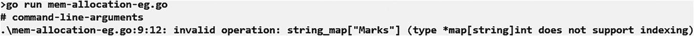

**图 2-7**  
由于映射对象内存分配错误而引发的错误


### 正确的内存分配示例

为像映射这样的复杂对象分配内存的正确方式是将声明包裹在`make`函数中，如代码清单 2-14 所示。`make`函数也会为该对象的非零存储内存进行初始化。

```
string_Map := make(map[string]int)
string_Map["Marks"] = 56
fmt.Println(string_Map)
代码清单 2-14
映射对象正确内存分配示意图
```

这次，当你使用`make`函数初始化对象，并尝试向映射对象添加新条目时，代码将成功编译并运行，不会报错，如图 2-8 的输出所示。请记住，在使用复杂对象时，如果需要立即向对象添加数据，使用`make`函数进行初始化至关重要。

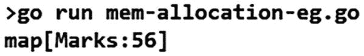

代码截图展示了向映射对象添加新条目后的结果。代码显示为 `go run mem-allocation-eg.go`。`map 左括号 marks:56 右括号`。

图 2-8

正确内存分配后的输出

### 内存释放

内存释放是由 Go 运行时自带的*垃圾回收器*（GC）以自主方式执行的。当垃圾回收器在后台工作时被触发，它会搜索那些超出作用域或被设置为`nil`的对象，从而清理内存并将其归还到内存池中。

在 Go 1.5 版本中，垃圾回收器被完全重构，具有极低的延迟，有效减少了运行 Go 应用程序时发生的暂停次数。在最新的 1.18.3 版本中，垃圾回收器在执行内存分配时的性能大大提升，即使在较慢的电脑上也几乎察觉不到。有关垃圾回收器的更多信息，请参考[`runtime`](https://pkg.go.dev/runtime)的官方文档（位于[`https://pkg.go.dev/runtime`](https://pkg.go.dev/runtime)），以及[垃圾回收器改进](https://talks.golang.org/2015/go-gc.pdf)的演讲发布稿（位于[`https://talks.golang.org/2015/go-gc.pdf`](https://talks.golang.org/2015/go-gc.pdf)）。

## 指针数据类型

每个变量本质上都是一个内存位置。同时请注意，每个内存位置都有一个明确的地址。在 Go 中，取地址符（`&`）表示一个内存地址，用于访问变量的地址。

### 什么是指针？

指针本质上是能够存储其他变量内存地址的变量。请注意，内存地址指的是变量的直接地址。指针可以用任何数据类型声明，但对其进行初始化（即存储另一个变量的地址）并非必须。与高级语言类似，Go 也支持指针。指针在 Go 中用于执行不同的任务，例如，不使用指针就无法进行引用调用。

### 在 Go 中声明指针

与任何其他变量或常量一样，在使用指针之前必须先声明。在 Go 中声明指针变量的通用语法是 `var variable_name *variable-type`。这里，`variable-type` 表示指针的基类型。请确保选择的基类型是有效的 Go 数据类型。`variable-name` 表示指针的名称。将指针声明与其他变量声明区分开来的最重要特征之一是星号（`*`）运算符。在此语句中，星号表示声明的变量是一个指针。代码清单 2-15 展示了一些有效的指针声明示例。

```
var intPointer  *int         /* 指向一个整型变量的指针 */
var floatPointer  *float32   /* 指向一个浮点变量的指针 */
var strPointer *string       /* 指向一个字符串变量的指针 */
代码清单 2-15
在 Go 中声明指针的不同方式
```

应注意，无论其类型如何，所有指针中存储的值的内在数据类型都是相同的，即一个长十六进制数。这代表了内存地址，因为所有地址都采用长十六进制格式。指针所指向的变量或常量的数据类型是区分不同数据类型指针的唯一依据。此外，指针的值也可以手动设置为`nil`（对于字符串），或者如果在声明时未初始化则会自动设置。

**示例**

让我们通过一个示例程序进一步了解指针，如代码清单 2-16 所示。

```
var intPointer  *int         /* 指向一个整型变量的指针 */
fmt.Println("intPointer 的值: ", *intPointer)
代码清单 2-16
声明指针
```

在代码清单 2-16 中，第一行声明了一个名为`intPointer`的`int`类型指针。这是一种正确的声明方式；然而，如果你尝试在第二行打印`intPointer`的内容，将会抛出一个运行时错误，导致应用程序崩溃，如图 2-9 所示。这是因为`intPointer`当前未被初始化指向任何东西，因此是`nil`。

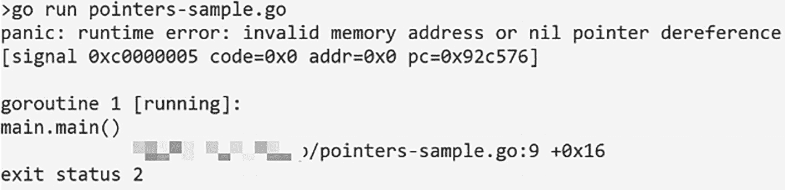

屏幕截图展示了程序的输出。第一行声明了一个名为`int pointer`的`int`类型指针。第二行中`int pointer`的内容显示了一个运行时错误，并且应用程序崩溃。

图 2-9

打印空指针的输出

让我们修改代码清单 2-16，以确保指针变量指向一个有效的变量。如代码清单 2-17 所示，我们使用`:=`运算符显式声明一个指针，并使用取地址符`&`运算符使其成为指向另一个变量的指针。

```
package main
import (
"fmt"
)
func main() {
value1 := 42
var pointer1 = &value1
fmt.Println("pointer1 的值: ", *pointer1)
value2 := 42.13
pointer2 := &value2
fmt.Println("Value1: ", *pointer2)
value3 := 32.5
pointer3 := &value3
*pointer3 = *pointer3 / 31
fmt.Println("Pointer3: ", *pointer3)
fmt.Println("Value3: ", value3)
}
代码清单 2-17
展示指针正确初始化的程序
```

**//输出：**

```
/*
Value of pointer1: 42
Value1: 42.13
Pointer3: 1.0483870967741935
Value3: 1.0483870967741935
*/
```


在`main`函数中，第 1 行声明了一个值为`42`的整数变量。第 2 行使用取地址运算符（`&`）将变量`value1`的直接内存地址赋值给变量`pointer1`。由于使用了取地址运算符`(&)`，Go 编译器会自动识别出`pointer1`是用于存储内存地址的指针变量。现在，若打印指针`pointer1`所指向的内存中存储的值，它将与`value1`中存储的值相同，即`42`。为了打印内存地址指向位置的值，需要使用星号（`*`）运算符，如`main`函数的第 3 行和第 8 行所示。同样，也可以使用指针指向浮点型变量。注意，`pointer1`是隐式声明并赋值的，而`pointer2`是显式声明了数据类型的。

还可以通过指针修改所指向变量的值，如清单 2-17 所示：

```
*pointer1 = *pointer1 / 31
fmt.Println("Pointer1: ",*pointer1)
fmt.Println("Value1: ", value1)
```

**输出：**

```
Pointer3:  1.0483870967741935
Value3:  1.0483870967741935
```

在第 1 行中，使用星号（`*`）运算符访问`pointer1`所指向的内存位置的值，将该值除以`31`，并将结果存储在同一位置。从输出中可以看到，`pointer1`和`value1`变量的值相同。

### 与 Java 及 C 风格语言的比较

在 Java 或 C#中，如果有一个原始变量和一个指向该变量的引用变量（指针），可以通过修改原始变量或修改指向它的变量来改变原始变量的值。但与 Java 不同的是，指针最初不必指向任何特定值，并且可以在运行时将其更改为指向另一个值。另一方面，Go 中的指针与 C、C#及其他类似语言中的指针非常相似且同样有价值。

## 数组和切片中的有序值

本节讨论数组数据结构以及作为数组抽象的切片。

### Go 中的数组

与其他 C 风格语言一样，Go 支持数组数据结构。Go 中的数组用于存储固定大小的顺序元素集合，且所有元素类型相同。尽管数组通常被称为存储项目集合的容器，但它也可以被视为具有相同类型的变量的集合。此外，数组是连续的内存位置，其中数组的第一个元素对应最低地址，最后一个元素对应最高地址。还可以通过索引号访问数组的任意特定元素。数组的索引号范围从`0`到`size-1`，如图 2-10 所示。根据该图，要访问第二个索引（即第三个元素）处的元素，可以使用`array_name[2]`，这将得到值`11`。

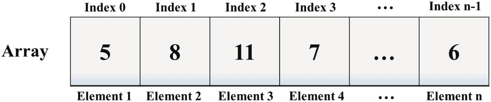

一个表格表示展示了 Go 中的数组。它可以访问元素 1、2、3、4 到 n 以及索引 0、1、2、3 到 n。

**图 2-10** Go 中的数组

#### 声明数组

Go 中数组声明的一般格式是`var array_name [SIZE] data_type`。注意，必须指定`data_type`，因为它指明了数组将要持有的元素类型。同时，元素总数（`SIZE`）也是必需的，因为它指明了数组的大小。以此格式声明的数组被称为*单维*数组。注意，`Size`必须是一个大于零的整数常量值。此外，任何有效的 Go 类型都可以用于指定`data_type`，即数组可以持有的元素类型。例如，语句`var floatArray [10] float32`声明了一个包含十个元素的数组，名为`floatArray`，`data_type`为`float32`。

#### 初始化数组

Go 中的数组可以逐个元素初始化，也可以使用单个语句初始化，如清单 2-18 所示。请记住，花括号`{ }`中指定的项数不应超过方括号`[ ]`中指定的数组大小，如清单 2-18 所示。

```
var floatArray = [5]float32{10.0, 200.0, 35.64, 78.0, 540.60}
清单 2-18
在 Go 中初始化指定大小的数组
```

如果省略了数组的大小，Go 编译器会自动将数组大小设置为初始化语句中指定的项数。例如，清单 2-19 将创建一个大小为`5`的数组，因为该数组用五个值进行了初始化。

```
var floatArray = []float32{10.0, 200.0, 35.64, 78.0, 540.60}
清单 2-19
在 Go 中初始化未指定大小的数组
```

#### 访问数组元素

数组的单个元素可以通过数组名加索引的方式访问。具体做法是将所需元素的索引号放在紧跟数组名后的方括号`[]`中。例如，为数组的单个元素赋值，可以使用以下语句：

```
balance[4] = 50.0
```

该语句将赋值运算符右侧的值赋值给名为`balance`的数组中索引为 4 的元素。由于数组的索引号从`0`开始，该语句将值`50.0`赋值给了数组中的第五个元素。注意，数组的第一个索引也称为*基索引*，而最后一个索引总是`arraySize-1`。还要注意，赋值使用`=`运算符而不是`:=`运算符，因为数组的数据类型已经定义。图 2-11 是对此处讨论概念的图示。

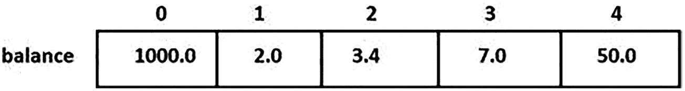

一个表格表示展示了数组中的数据存储概念。索引 0 到 4 的`balance`元素分别为`1000.0`、`2.0`、`3.4`、`7.0`和`50.0`。

**图 2-11** 数组中的数据存储

**示例**

清单 2-20 展示了一个包含到目前为止所讨论所有概念的示例。

```
package main
import (
"fmt"
)
func main(){
/*声明并初始化一个名为"array1"的数组，大小为 3，类型为浮点数*/
var array1 = []float32{10.5, 5.2, 2.88}
var array2 [10]int
var i, j int
//初始化数组元素
for i =0; i < 10; i++{
array2[i] = i + 50 //将位置 i 处的元素设置为 i+50
}
//打印 array1 每个元素的值
fmt.Println("Elements stored in Array1")
for j =0; j <3; j++{
fmt.Printf("Element[%d] = %f \n", j, array1[j])
}
//打印 array2 每个元素的值
fmt.Println("Elements stored in Array2)
for j =0; j <10; j++{
fmt.Printf("Element[%d] = %d \n", j, array2[j])
}
fmt.Println("Size of array1: ", len(array1))
fmt.Println("Size of array2: ", len(array2))
}
清单 2-20
演示 Go 中数组使用的基本程序
```

**/*输出：**

```
$ go run array-1.go
Elements stored in Array1
Element[0] = 10.500000
Element[1] = 5.200000
Element[2] = 2.880000
Elements stored in Array1
Element[0] = 50
Element[1] = 100
Element[2] = 150
Element[3] = 200
Element[4] = 250
Element[5] = 300
Element[6] = 350
Element[7] = 400
Element[8] = 450
Element[9] = 500 */
```


#### 查询数组的大小

你可以通过内置函数 `len` （length 的缩写）来获取数组可以容纳的项数（即其大小）。将数组标识符包裹在 `len` 函数中，就像 `len(array_name)` 这样。清单 2-21 演示了 `len` 函数的用法。

```
fmt.Println("Size of array1: ", len(array1))
fmt.Println("Size of array2: ", len(array2))
清单 2-21
在 Go 中使用 len 函数处理数组
```

**输出：**

```
Size of array1:  3
Size of array2:  10
```

请记住，在 Go 中，数组是一个对象，并且像所有对象一样，如果你将其传递给函数，将会创建该数组的一个副本。然而，使用数组基本上只能存储数据，并且在运行时进行排序或添加/删除项并不容易。为了获得这些功能以及执行其他操作，你应该将有序数据打包到切片中，而不是数组中。

### Go 中的切片

在 Go 中，*切片* 是建立在数组数据结构之上的一层抽象。当你定义切片时，运行时会在后台分配必要的内存并构建数组，但只返回切片。此外，与数组类似，切片的所有元素都是同一类型。尽管数组可以同时容纳多个相同类型的数据项，但无法使用任何内置函数动态增加其大小或从中提取子数组。切片克服了这些缺点。切片在 Go 中被广泛使用，并且提供了数组所需的多种实用方法。

#### 定义切片

切片的声明方式与数组相同，区别在于你不需要指定其大小，如清单 2-22 所示。另外，也可以使用 `make` 函数来创建切片。

```
var colors = []string{"ed", "Green", "Blue"}
var marks []float32          /* 未指定大小的切片 */
var marks = make([]int,5,5)  /* 长度和容量均为 5 的切片 */
清单 2-22
在 Go 中定义切片
```

#### `len()` 和 `cap()` 函数

作为建立在数组之上的抽象，切片底层结构是数组。要查询切片中当前存在的元素总数，使用 `len()` 函数。要查询切片中可以存储的元素总数，使用 `cap()` 函数。这本质上返回的是切片的大小。清单 2-23 说明了切片在 Go 中的使用。

```
package main
import (
"fmt"
)
func main() {
var marks = make([]float64, 3, 5) // 声明长度为 3、容量为 5 的切片
printItemsOfSlice(marks)          // 将切片传递给函数
}
// 接受切片并打印其详情的函数
func printItemsOfSlice(x []float64) {
fmt.Printf("Length=%d Capacity=%d Slice=%v\n", len(x), cap(x), x)
}
清单 2-23
演示 len() 和 cap() 函数用法的示例
```

**输出：**

```
Length=0 Capacity=0 Slice=[]
```

#### nil 切片

如果声明切片时没有提供输入，那么它会被默认初始化为 `nil`。同时，这种切片的长度和容量均为零。清单 2-24 演示了 Go 中 `nil` 切片的概念。

```
package main
import "fmt"
func main() {
var marks []float64       // 声明 float 类型的切片
printItemsOfSlice(marks)  // 将切片传递给函数
if marks == nil {
fmt.Printf("Slice is Nil")
}
}
// 接受切片并打印其详情的函数
func printSliceDetails(x []float64) {
fmt.Printf("Length=%d Capacity=%d Slice=%v\n", len(x), cap(x), x)
}
清单 2-24
Go 中的 nil 切片
```

**输出：**

```
Length=0 Capacity=0 Slice=[]
Slice is Nil
```

#### Go 中的子切片操作

在 Go 中，你可以使用 `[下限:上限]` 指定所需的下限和上限，从而提取数组的一个子切片。清单 2-25 说明了 Go 中的子切片概念。

```
package main
import "fmt"
func main() {
/* 声明并初始化一个 float 类型的切片 */
marks := []float32{10, 12.6, 20.0, 37.56, 48.74, 50.0, 64.15, 79.63, 8.75}
/* 将切片传递给用户自定义函数以打印其详情 */
printSliceDetails(marks)
/* 打印原始切片的元素 */
fmt.Println("Original Slice =", marks)
/* 打印 marks 切片中从索引 1(含)到索引 5(不含)的子切片 */
fmt.Println("Marks[1:5] = ", marks[1:5])
/* 不指定下限，则默认为 0 */
fmt.Println("Marks[:4] =", marks[:4])
/* 不指定上限，则默认为 len(slice) */
fmt.Println("Marks[3:] =", marks[3:])
marks1 := make([]float32, 0, 5)
/* 将切片传递给用户自定义函数以打印其详情 */
printSliceDetails(marks1)
/* 打印 marks 中从索引 0(含)到索引 3(不含)的子切片 */
marks2 := marks[:3] // 将子切片存储在名为 marks2 的切片中
/* 将切片传递给用户自定义函数以打印其详情 */
printSliceDetails(marks2)
/* 打印 marks 中从索引 4(含)到索引 5(不含)的子切片 */
marks3 := marks[4:5]
/* 将切片传递给用户自定义函数以打印其详情 */
printSliceDetails(marks3)
}
func printSliceDetails(x []float32) {
fmt.Printf("Length=%d Capacity=%d Slice=%v\n", len(x), cap(x), x)
}
清单 2-25
Go 中的子切片操作
```

**输出：**

```
Length=9 Capacity=9 Slice=[10 12.6 20 37.56 48.74 50 64.15 79.63 8.75]
Original Slice = [10 12.6 20 37.56 48.74 50 64.15 79.63 8.75]
Marks[1:5] = [12.6 20 37.56 48.74]
Marks[:4] = [10 12.6 20 37.56]
Marks[3:] = [37.56 48.74 50 64.15 79.63 8.75]
Length=0 Capacity=5 Slice=[]
Length=3 Capacity=9 Slice=[10 12.6 20]
Length=1 Capacity=5 Slice=[48.74]
```


好的，作为一名高级文档工程师和翻译员，我将遵循您的注意事项，将给定的英文文本翻译成中文。


#### `append()` 和 `copy()` 函数

在 Go 语言中，`append()` 函数用于增加切片的容量。`copy()` 函数用于将源切片的内容复制到目标切片中。清单 2-26 展示了这两个函数在 Go 中的使用。

```
package main
import "fmt"
func main() {
/* 声明一个 int 类型的切片 */
var nums []int
/* 将切片传递给自定义函数以打印详情 */
printSliceDetails(nums)
/* 空切片可以与 Append 一起使用 */
nums = append(nums, 10)
printSliceDetails(nums)
/* 向切片中添加一个元素 */
nums = append(nums, 100)
printSliceDetails(nums)
/* 一次向切片中添加多个元素 */
nums = append(nums, 1000, 10000, 100000)
printSliceDetails(nums)
/* 创建一个切片 nums1，其容量是 nums 切片的两倍 */
nums1 := make([]int, len(nums), (cap(nums))*2)
/* 将 nums 中存储的元素复制到 nums1 中 */
copy(nums1, nums)
/* 将切片传递给自定义函数以打印详情 */
printSliceDetails(nums1)
var colors = []string{"Red", "Green", "Blue"}
fmt.Println("Before: ", colors)
colors = append(colors[1:len(colors)])
fmt.Println("Items after removig 1st element:", colors)
}
func printSliceDetails(x []int) {
fmt.Printf("Length=%d Capacity=%d Slice=%v\n", len(x), cap(x), x)
}
清单 2-26
在 Go 中使用 Append 和 Copy 函数
```

**输出：**

```
Length=0 Capacity=0 Slice=[]
Length=1 Capacity=1 Slice=[10]
Length=2 Capacity=2 Slice=[10 100]
Length=5 Capacity=6 Slice=[10 100 1000 10000 100000]
Length=5 Capacity=12 Slice=[10 100 1000 10000 100000]
```

要从切片中移除元素，你也可以使用 `append()` 函数，但这次需要以括号包裹、冒号分隔的两个数字格式指定范围，如清单 2-27 所示。

```
var colors = []string{"Red", "Green", "Blue"}
fmt.Println("Before: ", colors)
colors =  append(colors[1:len(colors)])
fmt.Println("Items after removing 1st element: ", colors)
清单 2-27
使用 Append 函数从切片中移除元素
```

**输出：**

```
Before:  [Red Green Blue]
Items after removing 1st element: [Green Blue]
```

在清单 2-27 中，第一个元素被移除了，因为该范围指示从数组中索引为 1 的元素（即第二个元素）开始。

然而，在 `colors = append(colors[:len(colors)-1])` 语句中，如果省略了范围中的起始索引，而是传入 `colors[:len(colors)-1]`，则最后一个元素会从切片中移除。

#### 排序切片

如清单 2-28 所示，你还可以使用 Go 中的 `sort` 包对切片进行排序。`sort` 函数包含多个用于对不同数据类型进行排序的函数。默认情况下，使用 `sort()` 函数会将切片按数字升序排列。更多信息，请参考 `https://pkg.go.dev/sort` 上的 [sort 包](https://pkg.go.dev/sort) 的官方开发者文档。注意，使用 `sort()` 函数，你还可以对用户自定义的数据集合进行排序。

```
package main
import (
"fmt"
"sort"
)
func main() {
intSlice := make([]int, 5)
intSlice[0] = 6
intSlice[1] = 99
intSlice[2] = 45
intSlice[3] = 34
intSlice[4] = 1
fmt.Println("Original Slice: ", intSlice)
sort.Ints(intSlice)
fmt.Println("Sorted Slice: ", intSlice)
}
清单 2-28
使用 Sort 函数对切片进行排序
```

**输出：**

```
Original Slice:  [6 99 45 34 1]
Sorted Slice:  [1 6 34 45 99]
```

## 映射

在 Go 语言中，映射可以被视为一个无序的键值对集合。换句话说，映射可以看作是一个哈希表，它允许存储数据集合，然后可以根据键任意检索这些值。

注意，由于键是用于排序比较的，映射的键应该是任何可比较的类型。然而，通常的做法是使用字符串类型作为键，并使用任何其他有效类型作为关联的值。

### 定义映射

当用于声明复杂数据类型时，`make()` 函数会分配并初始化一个非零的存储空间。因此，使用 `make()` 函数来声明一个映射对象是必须的。声明映射的一般格式如下：

`map_variable := make(map[key_data_type]value_data_type)`

### 向映射对象添加条目

要向映射对象中添加条目，请使用以下一般格式：`map_variable_name[key] = value`。注意，由于 `map` 是一个无序的条目集合，条目的显示顺序并不总是有保证的。

### 从映射对象中删除条目

在 Go 中，要删除一个映射的条目（即存储在映射中的键值对），可以使用一个名为 `delete()` 的内置函数。`delete()` 函数接受两个参数——要删除条目的映射和要删除的键。实现此操作的一般格式是 `delete(map_variable, key)`。


### 遍历映射对象中存储的值

要遍历映射中存储的键值对，可以使用 `For` 循环语句，如代码清单 2-29 所示。其中，`key` 是用于存储键的变量，`value` 是用于存储对应值的另一个变量。在每次迭代中，`key` 变量将只持有映射中存储的一个键，而 `value` 变量则持有其对应的值。请注意，`key` 和 `value` 均为用户定义的变量名。

```
for key, value := range map_variable_name{
/* 执行所需操作 - 例如，打印所有存储的键值对 */
fmt.printf("%v: %v \n", key, value)
}
代码清单 2-29
使用 For 循环遍历映射
```

与映射的显示顺序一样，其迭代顺序也是不保证的。如果需要保证顺序，则由用户自行管理。用户必须使用切片将所有条目按字母顺序列出。这可以通过从映射中提取键作为字符串数组的切片来实现，如代码清单 2-30 所示。

```
package main
import (
"fmt"
"sort"
)
func main() {
states := make(map[string]string)
states["WA"] = "Washington"
states["NY"] = "New York"
states["CA"] = "California"
keys := make([]string, len(states))
i := 0
for key := range states {
keys[i] = key
i++
}
fmt.Println("排序前键的顺序: ", keys)
sort.Strings(keys)
fmt.Println("排序后键的顺序: ", keys)
}
代码清单 2-30
显示映射的条目
```

**/*输出:**

```
排序前键的顺序: [WA NY CA]// 显示顺序不保证
排序后键的顺序: [CA NY WA]// 显示顺序已保证
*/
```

第一行声明了一个名为 `keys` 的字符串类型切片，其大小与名为 `states` 的映射对象相同。然后使用 `for` 循环遍历映射对象中存储的键，并将其存储到 `keys` 切片中。之后，要排序 `keys` 切片，可以使用 `sort` 包中提供的 `sort()` 函数。在此示例中，`states` 映射中初始存储的键值对为 `[CA:California NY:New York WA:Washington]`

使用代码清单 2-30 中所示的技术，可以确保顺序保持一致。每次使用 `range` 关键字遍历切片时，都会得到一个表示切片当前索引的整数。现在，你可以改用整数来遍历 `keys` 切片，如代码清单 2-31 所示。

```
for i := range keys {
fmt.Println(states[keys[i]])
// 输出在 states 映射中传入键所对应的值
}
代码清单 2-31
使用 For Range 遍历映射
```

**输出:**

```
California
New York
Washington
```

**示例**

代码清单 2-32 包含了前述所有关于如何在 Go 中使用映射在内存中存储无序数据集合，然后通过键任意访问条目的概念。它还展示了如何同时使用切片和映射来按所需顺序处理存储的数据。

```
package main
import (
"fmt"
"sort"
)
func main() {
states := make(map[string]string)
fmt.Println(states)
states["WA"] = "Washington"
states["OR"] = "Oregon"
states["CA"] = "California"
fmt.Println(states)
california := states["CA"]
fmt.Println(california)
delete(states, "OR")
states["NY"] = "New York"
fmt.Println(states)
for key, value := range states {
fmt.Printf("%v: %v \n", key, value)
}
keys := make([]string, len(states))
i := 0
for key := range states {
keys[i] = key
i++
}
fmt.Println(keys)
sort.Strings(keys)
fmt.Println(keys)
for i := range keys {
fmt.Println(states[keys[i]])
}
}
代码清单 2-32
演示在 Go 中使用映射的示例
```

**/*输出:**

```
map[]
map[CA:California OR:Oregon WA:Washington]
California
map[CA:California NY:New York WA:Washington]
WA: Washington
NY: New York
CA: California
[WA NY CA]
[CA NY WA]
California
New York
Washington
*/
```

## 结构体数据类型

如前所述，Go 中的数组本质上是可以存储多个*相同*类型数据项的变量。为了克服这个限制，Go 提供了*结构体*，这是一种用户定义的类型，可用于存储*不同*类型的数据项。结构体本质上代表了一个数据的*记录*。例如，如果需要追踪图书馆中图书的不同信息，结构体是存储图书不同属性（如 `BookID`、`Title`、`Subject`、`Author` 等）最有用的方式。

### 定义结构体

要定义结构体，必须使用 `type` 和 `struct` 语句。`struct` 语句定义了一个包含多个成员的新数据类型。`type` 语句为结构体绑定了一个名称。使用 `type` 和 `struct` 语句声明结构体的通用格式如代码清单 2-33 所示。

```
type struct_variable_type struct {
成员定义;
成员定义;
...
成员定义;
}
代码清单 2-33
在 Go 中声明结构体的通用格式
```

在代码中定义了结构体类型后，可以声明该结构体类型的多个变量。这样做的通用格式是 `variable_name := structure_variable_type {value1, value2...value n}`

### 访问结构体的成员

要访问 `struct` 的任何成员字段，请使用成员访问运算符（`.`）。请记住，`struct` 关键字对于定义已定义的 `struct` 类型的变量是必需的。代码清单 2-34 演示了 Go 中 `struct` 类型的使用方法，并展示了如何访问其成员字段。

```
package main
import "fmt"
type Books struct {
bTitle      string
bAuthorName string
bSubject    string
book_id     int
}
func main() {
var Book1 Books /* 声明 Book 类型的变量 */
var Book2 Books /* 声明 Book 类型的变量 */
/* 访问 Book 结构体的成员字段来定义 Book1 */
Book1.bTitle = "The Go Programming Language"
Book1.bAuthorName = "Alan A. A. Donovan and Brian W. Kernighan"
Book1.bSubject = "A complete guide to Go programming"
Book1.book_id = 6495
/* 访问 Book 结构体的成员字段来定义 Book2 */
Book2.bTitle = "The Complete Book of Arts & Crafts"
Book2.bAuthorName = "Dawn Purney"
Book2.bSubject = "The Complete Book of Arts and Crafts of fun activities for children"
Book2.book_id = 6496
/* 打印 Book1 的详细信息 */
fmt.Printf("Book1 bTitle : %s\n", Book1.bTitle)
fmt.Printf("Book1 bAuthorName : %s\n", Book1.bAuthorName)
fmt.Printf("Book1 bSubject : %s\n", Book1.bSubject)
fmt.Printf("Book1 book_id : %d\n", Book1.book_id)
/* 打印 Book1 的详细信息 */
fmt.Printf("Book2 bTitle : %s\n", Book2.bTitle)
fmt.Printf("Book2 bAuthorName : %s\n", Book2.bAuthorName)
fmt.Printf("Book2 bSubject : %s\n", Book2.bSubject)
fmt.Printf("Book2 book_id : %d\n", Book2.book_id)
}
代码清单 2-34
在 Go 中使用结构体
```

**/*输出:**

```
Book1 bTitle      : The Go Programming Language
Book1 bAuthorName : Alan A. A. Donovan and Brian W. Kernighan
Book1 bSubject    : A complete guide to Go programming
Book1 book_id     : 6495
Book2 bTitle      : The Complete Book of Arts & Crafts
Book2 bAuthorName : Dawn Purney
Book2 bSubject    : The Complete Book of Arts and Crafts of fun activities for children
Book2 book_id     : 6496
*/
```


### 将结构体作为函数参数传递

在 Go 语言中，与任何其他变量或指针一样，你也可以将结构体作为函数参数传递。清单 2-35 演示了如何将结构体作为函数参数传递。

```
package main
import "fmt"
type Books struct {
bTitle      string
bAuthorName string
bSubject    string
book_id     int
}
func main() {
var Book1 Books /* 声明 Book 类型的变量 */
var Book2 Books /* 声明 Book 类型的变量 */
/* 访问 Book 结构体的成员字段以定义 Book1 */
Book1.bTitle = "The Go Programming Language"
Book1.bAuthorName = "Alan A. A. Donovan and Brian W. Kernighan"
Book1.bSubject = "A complete guide to Go programming"
Book1.book_id = 6495
/* 访问 Book 结构体的成员字段以定义 Book2 */
Book2.bTitle = "The Complete Book of Arts & Crafts"
Book2.bAuthorName = "Dawn Purney"
Book2.bSubject = "The Complete Book of Arts and Crafts of fun activities for children"
Book2.book_id = 6496
/* 通过将 Book1 作为参数传递给函数来打印其详细信息 */
printBookDetails(Book1)
/* 通过将 Book2 作为参数传递给函数来打印其详细信息 */
printBookDetails(Book2)
}
func printBookDetails(book Books) {
fmt.Printf("\nTitle : %s\n", book.bTitle)
fmt.Printf("Authors : %s\n", book.bAuthorName)
fmt.Printf("Subject : %s\n", book.bSubject)
fmt.Printf("Book ID : %d\n", book.book_id)
}
清单 2-35
在 Go 中将结构体作为函数参数传递
```

**/*输出：**

```
Title   : The Go Programming Language
Authors : Alan A. A. Donovan and Brian W. Kernighan
Subject : A complete guide to Go programming
Book ID : 6495
Title   : The Complete Book of Arts & Crafts
Authors : Dawn Purney
Subject : The Complete Book of Arts and Crafts of fun activities for children
Book ID : 6496
*/
```

### 指向结构体的指针

正如你可以定义用于指向（存储）其他常量或变量的指针一样，你也可以在 Go 中定义指向结构体的指针。例如，可以使用 `var struct_pointer *Books` 语句声明一个名为 `struct_pointer`、类型为 `Books` 的指针变量。然后可以使用 `struct_pointer` 变量来存储结构体变量的地址。取地址符（`&`）用于获取结构体变量的直接地址，例如 `struct_pointer = &Book1`。此外，成员访问运算符（`.`）用于访问指针所指向的结构体的成员，例如 `struct_pointer.title`。

**示例**

让我们重写清单 2-35 来演示 Go 中结构体指针的用法。结果如清单 2-36 所示。

```
package main
import "fmt"
type Books struct {
bTitle      string
bAuthorName string
bSubject    string
book_id     int
}
func main() {
var Book1 Books /* 声明 Book 类型的变量 */
var Book2 Books /* 声明 Book 类型的变量 */
/* 访问 Book 结构体的成员字段以定义 Book1 */
Book1.bTitle = "The Go Programming Language"
Book1.bAuthorName = "Alan A. A. Donovan and Brian W. Kernighan"
Book1.bSubject = "A complete guide to Go programming"
Book1.book_id = 6495
/* 访问 Book 结构体的成员字段以定义 Book2 */
Book2.bTitle = "The Complete Book of Arts & Crafts"
Book2.bAuthorName = "Dawn Purney"
Book2.bSubject = "The Complete Book of Arts and Crafts of fun activities for children"
Book2.book_id = 6496
/* 通过将 Book1 作为指针传递给函数来打印其详细信息 */
printBookDetails(&Book1)
/* 通过将 Book2 作为指针传递给函数来打印其详细信息 */
printBookDetails(&Book2)
}
func printBookDetails(book *Books) {
fmt.Printf("\nTitle : %s\n", book.bTitle)
fmt.Printf("Authors : %s\n", book.bAuthorName)
fmt.Printf("Subject : %s\n", book.bSubject)
fmt.Printf("Book ID : %d\n", book.book_id)
}
清单 2-36
用于演示 Go 中结构体指针的程序
```

**/*输出：**

```
Title   : The Go Programming Language
Authors : Alan A. A. Donovan and Brian W. Kernighan
Subject : A complete guide to Go programming
Book ID : 6495
Title   : The Complete Book of Arts & Crafts
Authors : Dawn Purney
Subject : The Complete Book of Arts and Crafts of fun activities for children
Book ID : 6496
*/
```

Go 语言中的 `struct` 类型是一种数据结构，其目的和功能与 C 语言中的 `struct` 类型以及 Java 中的 `class` 类似。结构体可以封装数据和方法。然而，与 Java 不同，Go 没有继承模型，也就是说，没有 `super()` 函数或子结构体的概念。每个结构体都是独立的，拥有自己的字段用于数据管理，也可以选择性地拥有自己的方法。请记住，Go 中的 `struct` 是一种自定义类型。请注意，结构体名称以大写字母开头，例如 `Book`，以确保它可以在应用程序的其他部分使用，即被导出，这类似于 C 风格语言中的公有访问说明符。另一方面，如果使用小写字母开头，结构体类型将是私有的，并且不能被导出以供应用程序的其他部分使用。

## 程序流程

条件逻辑可用于改变程序流程。与其他 C 风格语言一样，Go 也提供了条件语句，例如 `if`、`if…else`、`嵌套 if`、`switch` 和 `select`。不过，在使用方式上存在细微的语法差异。

### If 语句

在大多数情况下，Go 中的 `if` 语句看起来与 C 或 Java 中的相同；但是，它不需要在布尔条件周围加上括号。另一个重要方面是如何格式化条件代码块。在其他 C 风格语言中，可以选择将代码块的起始大括号放在下一行。Go 不允许这样做，这样做会引发错误。起始大括号必须与前面的语句在同一行。清单 2-37 是在 Go 中使用 `if-else` 语句的示例。

```
package main
import (
"fmt"
)
func main() {
theAnswer := 42
var result string
if theAnswer < 0 {
result = "Less than Zero"
} else if theAnswer == 0 {
result = "Equal to Zero"
} else {
result = "Greater than Zero"
}
fmt.Println(result)
}
清单 2-37
Go 中 if-else 语句的示例
```

**/*输出：**

```
Greater than Zero
*/
```

Go 的 `if` 语法中另一个有趣且有时很有用的变体是，你可以包含一个作为 `if` 语句一部分的初始语句。例如，你可以在根据变量值执行条件逻辑之前初始化它。清单 2-38 是一个实现此功能的示例。

```
if x:= 50; if x < 0 {
result = "Less than Zero"
} else if x == 0 {
result = "Equal to Zero"
} else {
result = "Greater than Zero"
}
fmt.Println(result)
清单 2-38
带有初始化的 if 语句
```

**输出：**

```
Greater than Zero
```


## Switch 语句

与其他 C 风格语言类似，Go 语言也提供了功能相同的 `switch` 语句；但其语法在这些语言的基础上有所扩展。`switch` 语句可用于一个变量，以测试该变量是否与一系列值相等。列表 2-39 使用了 `rand` 包中的 `Math.Rand` 包；我们将使用 `seed()` 函数，并通过语句 `rand.seed(time.Now().Unix())` 向其传入当前时间的 UNIX 格式。接着，`rand` 包中的 `Intn()` 函数会返回一个非负的伪随机整数。`Intn()` 函数要求你指定一个区间范围 `0,n)`。务必确保 `n <= 0`。在本例中，我们提供了一个上限值 `7+1`，即该函数将使用区间 `[0, 7) + 1`。这样一来，该函数会返回一个介于 1 到 7 之间的数字。每次运行此应用程序时，它会根据你计算机当前时间的毫秒数生成不同的数字。（你有可能反复看到同一个数字，但这只是巧合。）每次运行列表 [2-39 中的代码时，你可能会得到不同的输出。

```
package main
import (
"fmt"
"math/rand"
"time"
)
func main() {
rand.Seed(time.Now().Unix())
dow := rand.Intn(7) + 1
fmt.Println("Day: ", dow)
var result string
switch dow {
case 1:
result = "It's Sunday"
case 2:
result = "It's Monday"
default:
result = "It's some other day"
}
fmt.Println(result)
}
列表 2-39
在 Go 中使用 switch 语句
```

**输出：**

```
Day:  2
It's Monday
```

请注意，在 `switch` 语句中，被评估的表达式周围不需要括号。与 C 和 Java 的另一个区别是，Go 中的 `switch` 语句不需要 `break` 语句。在 Go 中，只要其中一个 `case` 被评估为 `true`，该 `case` 内的语句就会被执行，并且控制权会转移到 `switch` 语句的末尾。此外，就像 `if` 语句一样，你还可以在 `switch` 语句中对变量进行评估之前包含一个短语句，如列表 2-40 所示。请记住，在 `switch` 语句中声明的任何变量都将属于该 `switch` 语句的局部变量。

```
package main
import (
"fmt"
"math/rand"
"time"
)
func main() {
rand.Seed(time.Now().Unix())
var result string
switch dow := rand.Intn(7) + 1; dow {
case 1:
result = "It's Sunday"
case 2:
result = "It's Monday"
default:
result = "It's some other day"
}
fmt.Println(result)
}
列表 2-40
使用带有评估语句的 switch 语句
```

在 Go 中，`fallthrough` 关键字用于 `switch` 语句的 `case` 块中。如果任何 `case` 块中存在 `fallthrough` 关键字，无论当前 `case` 是否被评估为 `true`，它都会将程序的控制流转移到下一个 `case`。

## For 语句

与其他高级编程语言不同，Go 只提供一种循环结构，即 `for` 循环。`for` 循环可用于重复性任务，例如遍历值的集合。`for` 循环的基本语法与 Java 或 C 风格语言相同，不同之处在于 `for` 语句中不需要括号 `( )`。此外，就像 C 风格语言或 Java 一样，`for` 循环语句中的前置和后置语句不是必需的，可以留空。另外，在 Go 中，`for` 循环有四种变体用法，如下所述：

1.  **带有步长变量、条件和范围的** `for` **循环。**

    `range` 关键字在 Go 中用于遍历存储在各种数据结构中的元素。当与数组和切片一起使用时，`range` 关键字还会返回每个条目的索引和值。在列表 2-41 的第二个 `for` 循环中，我们使用了空白标识符（`_`）来忽略索引。然而，如同第三个 `for` 循环所示，有时也需要索引。在第四个 `for` 循环中，`range` 会从一个逗号分隔的列表中将值赋给变量 `i`。第一个变量将是索引，第二个变量将是关联的值。

    ```
    package main
    import "fmt"
    func main() {
    total := 0
    for k := 0; k < 5; k++ {
    total += k
    }
    nums := []int{2, 3, 4}
    total = 0
    for _, num := range nums {
    total += num
    }
    fmt.Println("Total:", total)
    for j, num := range nums {
    if num == 2 {
    fmt.Println("Index:", j)
    }
    }
    for i := range nums {
    fmt.Println(nums[i])
    }
    }
    列表 2-41
    带有步长变量、条件和范围的 for 循环
    ```

    **输出：**

    ```
    Total: 9
    Index: 0

    ```

2.  **带有空白前置/后置语句的** `for` **循环**

    列表 2-42 展示了使用带有空白前置/后置语句的 `for` 循环。

    ```
    total := 1
    for ; total < 10; {
    total += total
    }
    列表 2-42
    带有空白前置/后置语句的 for 循环
    ```

3.  **作为 `while` 循环使用的** `for` **循环**

    许多语言都有一个 `while` 关键字，它允许你只要布尔表达式为真就可以循环执行一组语句。Go 使用 `for` 关键字实现了这种类型的循环。你只需声明一个布尔条件，而不是一个计数器变量或范围。列表 2-43 说明了这一概念。

    ```
    total := 1
    for < 10 {
    total += total
    }
    列表 2-43
    将 for 循环用作 while 循环
    ```

4.  **无限循环**

    通常，如果循环指定的条件语句永远不会变为假，那么循环就变成了无限循环。通常，`for` 循环用于创建无限循环。当 `for` 语句中的这三个表达式都没有指定时，这会使得条件语句永远保持为真，从而将 `for` 循环变成无限循环。列表 2-44 说明了这一概念。

    ```
    for {
    // 你想要无限循环的任何任务
    }
    列表 2-44
    将 for 循环用作无限循环
    ```

## goto 语句

Go 也支持 `goto` 语句，它可以将控制权转移到代码中的一个标签。列表 2-45 说明了如何将标签与 `goto` 语句结合使用以改变程序控制流。在此代码片段中，当 `if` 语句变为真时，`goto` 语句将被执行，控制权将转移到 `theEnd` 标签，然后执行此标签之后的语句。列表 2-45 展示了一个基本程序，描述了在 Go 中使用 `goto` 语句的方法。

```
package main
import (
"fmt"
)
func main() {
total := 1
for total < 5 {
total += total
fmt.Println("Total: ", total)
if total == 5 {
goto theEnd
}
}
theEnd:
fmt.Println("End of Program")
}
列表 2-45
在 Go 中使用 goto 语句
```

**输出：**

```
Total:  2
Total:  4
Total:  8
End of Program
```

总之，Go 支持 `continue`、`break` 和 `goto` 语句的使用。Go 也支持多种编码模式的循环，并为 `for` 语句添加了特性，使其简洁易读。


## 函数

Go 语言由包组成，而包中包含函数。每个 Go 应用程序都有一个名为`main`的包，并且至少有一个同样名为`main`的函数。当应用程序启动时，`main`函数会被运行时自动调用。与其他编程语言一样，在 Go 中，你也可以创建自定义函数，并将它们组织到自己的自定义包中。

函数声明告诉 Go 编译器函数的名称、返回类型以及输入参数。另一方面，函数定义是函数的实际主体，由一组执行预期任务的语句组成。

Go 标准库提供了几个内置函数，你可以在 Go 程序中调用和使用它们。例如，`len()`函数接收各种类型的参数作为输入，并返回它们的长度。函数也被称为方法、子例程或过程。

### 定义函数

Go 中的函数定义由两部分组成——函数头部和函数体。在 Go 中定义函数的一般格式如代码清单 2-46 所示。

```
func function_name( [parameter list] ) [return_types]
{
body of the function
}
代码清单 2-46
Go 中函数的一般格式
```

在这里，`func`关键字告诉编译器函数声明的开始，而`function_name`代表函数的名称。函数签名指的是函数名称和输入参数列表的组合。另外，`parameters`用作占位符。函数被调用时传递给它的值被称为函数实参，而这些形参也被称为形式参数。函数的参数列表定义了它将接收的输入参数的类型、顺序和总数。函数可能没有参数，因此参数是可选的。`return_type`用于定义函数可能返回的值的类型。同样，如果函数不返回任何内容，则`return_type`是可选的。函数体包含多个语句，这些语句共同定义了它要执行的任务。

代码清单 2-47 说明了 Go 中自定义函数的使用。在这里，`findMaximum()`是一个用户定义的函数，它接受两个参数`n1`和`n2`。作为输出，它返回这两个传入值中的最大值。此外，由于两个参数的类型相同，因此不必为每个变量指定类型。

```
/* 用于找出两个数中最大值的函数 */
func findMaximum(n1, n2 int) int {
/* 声明局部变量 */
var maxVal int
if (n1 > n2) {
maxVal = n1
} else {
maxVal = n2
}
return maxVal
}
代码清单 2-47
说明 Go 中自定义函数的基本程序
```

与其他语言类似，Go 函数也可以接受同一类型的任意数量的值。为此，如代码清单 2-48 所示，你声明参数名称，然后添加三个点，接着指定数据类型。由于`values`将充当数组，因此可以使用`range`关键字来遍历其中存储的值。

```
package main
import (
"fmt"
)
func main() {
total := addValues(40, 50, 60)
fmt.Println("传入值的总和: ", total)
}
func addValues(values ... int) int{
sum := 0
for _, val := range values{
sum += val
}
return sum
}
代码清单 2-48
接受任意数量值的函数
```

**/*输出:**

```
传入值的总和:  150
*/
```

### 在 Go 中执行函数调用

为了在 Go 中创建一个函数，还需要提供它的定义，该定义指定了函数应该执行的任务。要使用一个函数，必须从程序中调用它。当从程序中进行函数调用时，控制流会转移到该函数。当被调用的函数完成定义的任务，或遇到`return`语句，或到达函数的结束花括号时，控制流返回到最初发起调用的程序。

要进行函数调用，你只需传递所需的参数，这些参数被包裹在函数名旁边的圆括号`()`内。如果有值需要从函数返回，返回的值可以直接使用（例如与`Println()`一起使用），或者可以存储起来，以便稍后用于执行不同的操作。代码清单 2-49 说明了在 Go 中执行函数调用的概念。

```
package main
import "fmt"
func main() {
/* 定义局部变量 */
var val1 int = 50
var val2 int = 80
var retVal int
/* 调用 findMaximum() 函数 */
retVal = findMaximum(val1, val2)
fmt.Printf("最大值: %d\n", retVal)
}
/* 用于找出两个数之间最大值的函数 */
func findMaximum(num1, num2 int) int {
/* 声明局部变量 */
var maxVal int
if (num1 > num2) {
maxVal = num1
} else {
maxVal = num2
}
return maxVal
}
代码清单 2-49
说明 Go 中函数调用的基本程序
```

**输出:**

```
最大值: 80
```

### 从函数返回多个值

与其他 C 风格的语言不同，Go 函数被设计为一次可以返回多个值。下面的示例说明了如何从函数中返回值。请参考[官方文档](https://golangdocs.com/functions-in-golang) at[`https://golangdocs.com/functions-in-golang`](https://golangdocs.com/functions-in-golang)了解在 Go 中返回值及语法变化的更多方式。代码清单 2-50 说明了这一概念。

```
package main
import (
"fmt"
)
func swapValues(str1, str2 string) (string, string) {
return str2, str1
}
func main() {
val1, val2 := swapValues("阿卜杜拉", "哈桑")
fmt.Println("交换后的值: ", val1, val2)
}
代码清单 2-50
说明如何从函数返回多个值的 Go 程序
```

**输出:**

```
交换后的值: 哈桑 阿卜杜拉
```

### 向函数传递参数

你必须声明所有将接收作为参数传递给函数的值的变量。这组变量也称为函数的形式参数。请注意，函数的所有形式参数的作用域仅局限于该函数本身，即它们只能在该特定函数的作用域内被访问。此外，形式参数只在进入函数时创建，并在退出时销毁。

向函数传递参数有两种方式——*按值调用*和*按引用调用*。当使用按值调用的方式传递参数时，它本质上是将传入参数的值复制到被调用函数的形式参数中。在相应函数内部对形式参数所做的任何更改都不会影响通过函数调用传递的原始参数的值。

另一方面，按引用调用的技术将传入参数的直接地址复制到被调用函数的形式参数中。由于直接地址被复制并用于访问实际参数，因此在相应函数内部对形式参数所做的任何更改也会反映在通过函数调用传递的参数上。为了确保函数不能更改传递给它的参数的值，默认情况下，Go 编程语言使用按值调用来向函数传递参数。


#### 传值示例

清单 2-51 展示了 Go 语言中传值的概念。

```go
package main

import (
    "fmt"
)

func modifyInt(val int) int {
    return val + 5
}

func main() {
    num := 500
    fmt.Println("函数调用前传入参数的值：", num)
    fmt.Println("函数调用返回的值：", modifyInt(num))
    fmt.Println("函数调用后传入参数的值：", num)
}
清单 2-51
Go 语言传值演示程序
```

**输出：**

```
函数调用前传入参数的值： 500
函数调用返回的值： 505
函数调用后传入参数的值： 500
```

#### 传引用示例

清单 2-52 展示了 Go 语言中传引用的概念。

```go
package main

import (
    "fmt"
)

func myMap(mapObject map[int]int) {
    // make() 声明并初始化 map 为 0
    mapObject = make(map[int]int)
}

func myInt(values []int) {
    // make() 声明并初始化 slice 为 0
    values = make([]int, 5)
}

func main() {
    // mapObject 已声明但未初始化，即其值为 nil
    var mapObject map[int]int
    myMap(mapObject)
    fmt.Println("map 是否等于 nil？", mapObject == nil)
    // Slice 已声明但未初始化，即其值为 nil
    var intSlice []int
    myInt(intSlice)
    fmt.Println("slice 是否等于 nil？", intSlice == nil)
}
清单 2-52
Go 语言传引用演示程序
```

**输出：**

```
map 是否等于 nil？ true
slice 是否等于 nil？ true
```

### 方法

在 Go 语言中，如果函数依附于用户定义的自定义类型，则这些函数被称为方法。在面向对象语言（如 Java）中，每个方法都是类的成员。而在 Go 中，方法则是类型的成员。清单 2-53 演示了如何为结构体附加方法。

```go
package main

import (
    "fmt"
)

func main() {
    poodle := Dog{"贵宾犬", 10, "汪！"}
    fmt.Println(poodle)
    fmt.Printf("%+v\n", poodle)
    fmt.Printf("品种：%v\n 体重：%v \n", poodle.Breed, poodle.Weight)
    poodle.Speak()
}

// Dog 是一个结构体
type Dog struct {
    Breed  string
    Weight int
    Sound  string
}

func (d Dog) Speak() {
    fmt.Println(d.Sound)
}
清单 2-53
Go 语言方法使用示例
```

**输出：**

```
{贵宾犬 10 汪！}
{Breed:贵宾犬 Weight:10 Sound:汪！}
品种：贵宾犬
体重：10
汪！
```

Go 不支持方法重写；每个方法必须拥有唯一名称。但与所有函数一样，方法也可以返回值，仅用于明确该方法所赋值的类型，如清单 2-54 所示。

```go
package main

import (
    "fmt"
)

func main() {
    poodle := Dog{"贵宾犬", 10, "汪！"}
    fmt.Println(poodle)
    fmt.Printf("%+v\n", poodle)
    fmt.Printf("品种：%v\n 体重：%v \n", poodle.Breed, poodle.Weight)
    poodle.Speak()
    poodle.Sound = "嗷！"
    poodle.Speak()
    poodle.SpeakThreeTimes()
}

// Dog 是一个结构体
type Dog struct {
    Breed  string
    Weight int
    Sound  string
}

func (d Dog) Speak() {
    fmt.Println(d.Sound)
}

func (d Dog) SpeakThreeTimes() {
    d.Sound = fmt.Sprintf("%v %v %v", d.Sound, d.Sound, d.Sound)
    fmt.Println(d.Sound)
}
清单 2-54
带有返回值的方法
```

**输出：**

```
{贵宾犬 10 汪！}
{Breed:贵宾犬 Weight:10 Sound:汪！}
品种：贵宾犬
体重：10
汪！
嗷！
嗷！嗷！嗷！
```

请注意，当你将 `dog` 对象作为接收者传递给函数时，会创建该对象的一个副本，即这是传值而非传引用。如果你希望按引用传递，可以使用指针。但在函数内部，这是该对象的一个全新副本。因此，当你修改 `sound` 字段时，你并没有修改在 `main` 函数中创建的原始版本。能够为自定义类型创建方法，使得 Go 编程语言的行为更接近完整的面向对象语言。即使没有 C++ 和 Java 中的那种类型继承机制，结构体也可以拥有任意数量的不同方法，以满足应用的需求。

## 读写文本文件

在 Go 中创建文件有多种方式。这些方式是对所需底层操作的高层抽象。

### 写入文本文件

清单 2-55 中的示例演示了如何在 Go 中向文件写入内容。`checkError()` 函数将在整个程序中用于错误检查。该函数会检查传递给它的对象，如果对象不为 `nil`（即主程序中执行某些操作时发生错误），则函数将使应用崩溃并显示错误消息。

在 `main()` 函数中，`content` 变量保存要写入 `fromString.txt` 文件的字符串值。在 `main()` 函数的第 2 行，我们创建了一个名为 `file` 的文件引用，它本质上是一个用作文件引用的变量。与此同时，我们还指定了一个名为 `err` 的变量，用于存储 `os.Create()` 函数返回的错误消息。`Create()` 函数接受数据应写入的文件位置作为参数。此外，如果指定文件不存在，它会创建该文件；如果文件已存在，则会清空文件内容。这里的 `./` 表示该文件与应用程序位于同一目录。

在 `main()` 函数的第 4 行，`length` 变量存储了 `WriteString()` 函数返回的写入文件的字节数。`WriteString()` 函数需要一个写入器对象和一个字符串，这里我们将 `file` 作为写入器，并将 `content` 变量作为要写入文件的字符串传入。在处理文件时，操作完成后关闭打开的文件至关重要。`defer` 关键字会等待其他所有操作完成后再执行此命令。我们使用 `defer` 关键字编写了 `file.Close()` 命令，以确保所有操作完成后，`file` 引用对象所引用的文件被关闭。

```go
package main

import (
    "fmt"
    "io"
    "io/ioutil"
)

func main() {
    content := "来自 Go 的问候！"
    file, err := os.Create("./fromString.txt")
    checkError(err)
    defer file.Close()
    length, err := io.WriteString(file, content)
    checkError(err)
    fmt.Printf("已写入一个包含 %v 个字符的文件\n", length)
}

/* checkError 是用于错误检查的函数 */
func checkError(err error) {
    if err != nil {
        panic(err)
    }
}
清单 2-55
演示如何在 Go 中写入文本文件的程序
```

**输出：**

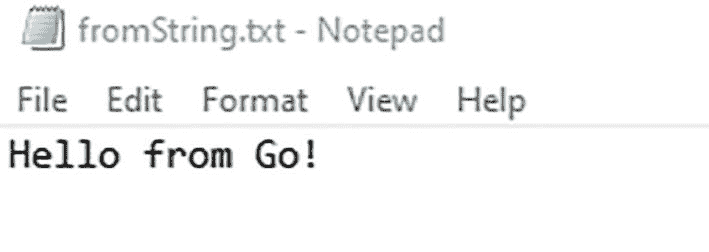

程序输出的屏幕截图显示“来自 Go 的问候。”。

```
已写入一个包含 14 个字符的文件
```


### 读取文本文件

在本节中，为了说明如何在 Go 中实现从文本文件读取数据，如代码清单 2-56 所示，我们在代码清单 2-55 的示例基础上进行了修改，添加了一个名为 `readFile()` 的自定义函数，该函数将文件名作为输入。每当读取文件时，它总是以字节数组的形式返回。代码清单 2-56 中的 `data` 变量将保存返回的字节。同样，`err` 对象会检查是否抛出了错误。`ReadFile()` 函数是 `ioutil` 包中的一个内置函数，可用于读取作为参数传递的文件名所指定的任何文件。作为输出，它返回读取到的文件内容。成功执行 `ReadFile()` 后，错误值会返回 `nil` 而不是 `EOF`。这是因为 `ReadFile()` 函数会将整个文件作为输入读取，并且不会将从 `Read()` 函数返回的 `EOF` 视为错误。在 `readFile()` 函数的最后一行，使用 `string(data)` 语句将作为字节接收到的文件内容类型转换为字符串，以便在屏幕上显示。在 `main()` 函数中，我们再次使用了 `defer` 关键字，然后调用了 `readFile()` 函数，并将我们要读取的文件传递给它。在处理任何可能不会在当前线程中自动运行的内容时，使用 `defer` 关键字非常重要。此外，如果你想等到文件完全关闭后再尝试读取它，`defer` 关键字可以帮你实现这一点。

```
package main
import (
"fmt"
"io"
"io/ioutil"
"os"
)
func main() {
content := "Hello from Go!"
file, err := os.Create("./fromString.txt")
checkError(err)
length, err := io.WriteString(file, content)
checkError(err)
fmt.Printf("Wrote a file with %v characters\n", length)
readFile(file.Name())
defer file.Close()
}
// readFile 是一个用于读取文本文件内容的函数
func readFile(fileName string) {
data, err := ioutil.ReadFile(fileName)
checkError(err)
fmt.Println("Text read from file: ", string(data))
}
// checkError 是一个用于错误检查的函数
func checkError(err error) {
if err != nil {
panic(err)
}
}
代码清单 2-56
在 Go 中从文本文件读取内容
```

**输出：**

```
Wrote a file with 14 characters
Hello from Go!
```

## HTTP 包

为了帮助程序员构建能够有效与不同 Web 应用和服务进行通信的应用程序，Go 编程语言提供了大量不同的工具，其中之一就是 `http` 包。`http` 包允许你通过创建请求和发送数据来轻松地与远程主机通信。它还有助于创建能够监听并响应接收到的请求的 HTTP 服务器应用程序。代码清单 2-57 中的示例演示了 `http` 包的用法。

在代码清单 2-57 中，向远程主机发送了一个请求以获取一些数据。这里，我们希望将名为 `url` 的变量所指定页面的 JSON 内容下载到本地开发机器上。为此，第一步是导入 `net/http` 和 `ioutil` 包。要下载内容，请使用 `http` 包中的 `get()` 函数。`get()` 函数会返回一个响应对象以及一个 `error` 对象。`resp` 变量用于存储返回的响应对象。当你打印 `resp` 变量的内容时，会得到一个指向名为 `response` 的对象的指针。请注意，它是 `http` 包的成员。`response` 对象有一个名为 `body` 的公共字段，其中包含了你打算下载的 JSON 数据包。与处理文件类似，在读取完 body 的内容后，应使用 `defer` 关键字配合 `resp.Body.Close()` 命令来关闭 body。

接收到的内容以字节数组的形式提供。为了存储它，请使用 `bytes` 变量。`ioutil.ReadAll(resp.Body)` 读取 `resp.Body` 的内容。由于返回的内容是字节数组，你需要将其类型转换为 `string` 才能打印到屏幕上，方法是通过 `string(bytes)` 命令将 `bytes` 变量包裹在 string 类型中。

```
package main
import (
"fmt"
"io/ioutil"
"net/http"
)
const url = "http://services.explorecalifornia.org/json/tours.php"
func main() {
fmt.Println("Network Requests Demo")
response, err := http.Get(url)
if err != nil {
panic(err)
}
fmt.Printf("Response Type: %T\n", response)
defer response.Body.Close()
bytes, err := ioutil.ReadAll(response.Body)
if err != nil {
panic(err)
}
content := string(bytes)
fmt.Print(content)
}
代码清单 2-57
展示在 Go 中使用 HTTP 包的基础程序
```

**输出：**

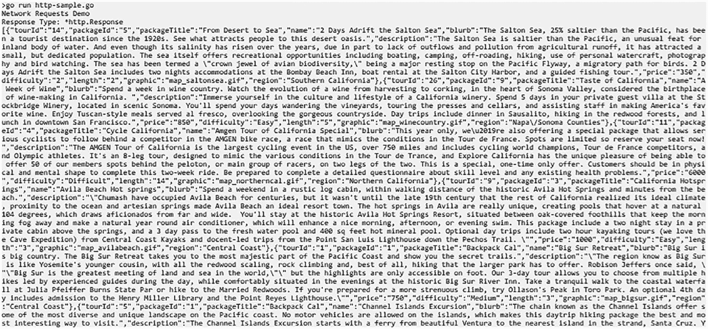

Go 程序输出的截图。


## JSON

对网络服务发起请求时，响应返回的数据通常以 JSON 格式编码。为方便处理网络服务与 API，Go 通过 `json` 包提供了对 JSON 格式数据的支持。`json` 包让你能轻松创建和读取 JSON 格式的文本。上一节中，你已学习如何从网络服务获取 JSON 数据。本节将学习如何解析 JSON 数据，并将其格式化为 Go 应用程序可用的结构化数据。清单 2-58 演示了如何解析 JSON 数据并格式化为结构化数据，它从接收的 JSON 数据中解析了旅游线路名称和价格。

在清单 2-58 中，首先创建了一个名为 `Tour` 的新自定义类型，它是一个包含两个 `string` 类型成员字段 `Name` 和 `Price` 的结构体。注意，为了使这些字段名称公开，它们以大写字母开头。另外请注意，JSON 内容中的标签均使用小写。但 JSON 解码器不受此影响，因为它能轻松将这些标签与结构体成员匹配。本示例中，我们导入了 [`encoding/json`](https://pkg.go.dev/encoding/json) (https://pkg.go.dev/encoding/json)、[`io/ioutil`](https://pkg.go.dev/io/ioutil) (https://pkg.go.dev/io/ioutil)、[`net/http`](https://pkg.go.dev/net/http) (https://pkg.go.dev/net/http) 和 [`strings`](https://pkg.go.dev/strings) (https://pkg.go.dev/strings) 等包。

`toursFromJson()` 函数是一个自定义函数，用于解码 HTTP 响应中 JSON 格式的正文内容。它接受一个参数，即从网站获取的 JSON 格式字符串。该函数将以结构化数据的形式返回这些值，具体来说，是一个包含 `tour` 对象实例的切片。

在 `toursFromJson()` 函数内部，第一步是创建一个 `tour` 对象切片 `tour`。`tour` 切片初始大小设为 0，初始容量为 20。注意，20 仅为推测值，并非可能获取的对象精确数量。由于切片可以动态调整大小，无需预先分配过大的初始容量。内置函数 `NewDecoder()` 返回一个解码器，它将从传入的读取器对象中读取数据。`NewReader()` 返回一个读取器，从传入的字符串中读取数据。`Token()` 函数返回输入流中的下一个 JSON 令牌。

为了将 JSON 格式文本转换为 `tour` 对象切片，声明一个名为 `tours` 的变量，并将其类型设置为 `Tour`。接着使用一个 `while` 风格的 `for` 循环；`decoder.More()` 函数报告当前数组中是否还有其他元素，或是否有其他对象正在被解析。在 `for` 循环内，解码器对象的 `Decode()` 函数从其输入中读取下一个 JSON 编码值，并将其存储到传入参数所指向的值中。此处传入 `tour` 对象的内存地址。然后，通过 `append()` 函数将 `tour` 对象添加到 `tours` 切片。最后，函数返回 `tours` 对象。

```
package main
import (
"encoding/json"
"fmt"
"io/ioutil"
"net/http"
"strings"
)
const url = "http://services.explorecalifornia.org/json/tours.php"
func main() {
resp, err := http.Get(url)
if err != nil {
panic(err)
}
fmt.Printf("Response Type: %T\n", resp)
defer resp.Body.Close()
bytes, err := ioutil.ReadAll(resp.Body)
if err != nil {
panic(err)
}
content := string(bytes)
tours := toursFromJson(content)
for _, tour := range tours {
fmt.Println(tour.Name, "  ", tour.Price)
}
}
func toursFromJson(content string) []Tour {
tours := make([]Tour, 0, 20) //slice of Tour array with initial size 0 and capacity 20
decoder := json.NewDecoder(strings.NewReader(content))
_, err := decoder.Token()
if err != nil {
panic(err)
}
var tour Tour
for decoder.More() {
err := decoder.Decode(&tour)
if err != nil {
panic(err)
}
tours = append(tours, tour)
}
return tours
}
type Tour struct {
Name, Price string
}
清单 2-58
Go 中处理 JSON 数据的基础程序示例
```

**输出：**

```
2 Days Adrift the Salton Sea    350
A Week of Wine    850
Amgen Tour of California Special    6000
Avila Beach Hot springs    1000
Big Sur Retreat    750
Channel Islands Excursion    150
Coastal Experience    1500
Cycle California: My Way    1200
Day Spa Package    550
Endangered Species Expedition    600
Fossil Tour    500
Hot Salsa Tour    400
Huntington Library and Pasadena Retreat Tour    225
In the Steps of John Muir    600
Joshua Tree: Best of the West Tour    150
Kids L.A. Tour    200
Mammoth Mountain Adventure    800
Matilija Hot springs    1000
Mojave to Malibu    200
Monterey to Santa Barbara Tour    2500
Mountain High Lift-off    800
Olive Garden Tour    75
Oranges & Apples Tour    350
Restoration Package    900
The Death Valley Survivor's Trek    250
The Mt. Whitney Climbers Tour    650
```

## 总结

本章涵盖了入门 Go 编程所需的基础编程知识，内容包括如何安装 Go 编译器与各种可用的 IDE、Go 的程序结构，直至编程概念。你还深入学习了如何使用不同的数据结构与编程特性，例如变量、用户输入处理、可用的数学运算符与包、内存管理与值引用，以及指针的使用。你掌握了如何使用数组与切片管理有序的值，如何利用映射存储键值对，以及如何通过结构体定义自定义类型。

程序流程管理是编程的关键点，本章还指导你如何使用不同的条件语句（如 `if`、`if..else`、`switch` 和 `goto`）控制流程。你还学习了 Go 中唯一可用的循环类型，并了解如何灵活运用它来实现预期结果。

函数是模块化编程的重要组成部分。本章还介绍了如何在 Go 中使用自定义函数，以及如何为切片附加方法。程序的另一项重要能力是读写文件，本章也提供了相关详细说明。此外，还讲解了如何使用 HTTP 包和处理 JSON 数据，这有助于程序员构建能有效与不同网络应用和服务通信的应用程序。

在接下来的章节中，你将基于实际场景学习 Go 实战方案，以便更深入地理解本章涵盖的概念。

