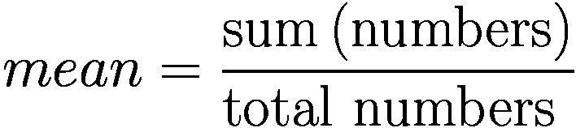

# Go 实战方案：编程基础与入门

Go 是一门出色的语言。它紧凑、高效，并对并发有良好的支持。本章涵盖常见的编程任务，并展示完成这些任务的解决方案。内容包括语言基础、日期/时间类型、如何高效处理文本文件、如何使用结构体，以及如何处理并发。


## Go 中的数字与切片

清单 3-1 展示了一个用于计算一组数字平均值的 Go 配方。平均值的定义为数字之和除以数字总数。计算平均值的公式如下：



```
package main
import (
"fmt"
)
func main() {
ffmt.Println("Mean of {1,2,3} is: ", mean([]int{1, 2, 3}))        //mean=2
fmt.Println("Mean of {1,2,3,4,5} is: ", mean([]int{1, 2, 3, 4, 5}))  //mean=3
}
func mean(nums []int) float64 {
s := sum(nums)
return (float64(s) / float64(len(nums)))
}
func sum(nums []int) int {
total := 0
for _, n := range nums {
total += n
}
return total
}
清单 3-1
用于计算平均值的 Go 配方
```

**输出：**

```
Mean of {1,2,3} is:  2
Mean of {1,2,3,4,5} is:  3
```

让我们看另一个示例，我们需要编写一个函数来计算类型为 `float32` 的切片的中位数。计算中位数时，首先需要将数值按数字顺序排序。如果项目总数为奇数，则中间值即为中位数。如果数量为偶数，则中间两个值的平均值被视为中位数。清单 3-2 说明了这一概念。

```
package main
import (
"fmt"
"sort"
)
func main() {
fmt.Println("Median of {56, 85, 92} is: ", median([]float64{56, 85, 92}))         //median= 85
fmt.Println("Median of {56, 85, 92, 99} is: ", median([]float64{56, 85, 92, 99}))     //median= 88.5
}
func median(nums []float64) float64 {
// Pass by Value: work on a copy, don't change the input slice
vals := make([]float64, len(nums))
copy(vals, nums)
sort.Float64s(vals)
i := len(vals) / 2
if len(vals)%2 == 1 { //in case the slice has odd number of items
return vals[i]
}
//in case the slice has even number of items
return (vals[i-1] + vals[i]) / 2
}
清单 3-2
用于计算中位数的 Go 配方
```

**输出：**

```
Median of {56, 85, 92} is:  85
Median of {56, 85, 92, 99} is:  88.5
```

## Go 中的映射操作

在本节中，我们将编写一个程序来统计文本中单词出现的次数。这被称为词频统计，是文本处理中的常见任务。例如，在句子“to be or not to be”中，“to”的频率为 2，“be”的频率为 2，“not”的频率为 1，“or”的频率为 1。对于此任务，我们使用映射来存储单词及其计数，作为键值对。Go 映射在尝试访问不存在的键时不会引发恐慌。相反，它们会为不存在的键返回零值。在此示例中，映射值为整数，零值意味着单词计数为零。清单 3-3 展示了实现此功能的配方。

```
package main
import (
"fmt"
)
var moby = []string{
"shall", "pass", "shall", "away", "too"}
func main() {
fmt.Println(frequency(moby))
}
func frequency(words []string) map[string]int {
freq := make(map[string]int)
for _, w := range words {
freq[w]++
}
return freq
}
清单 3-3
用于操作映射的 Go 配方
```

**输出：**

```
map[away:1 pass:1 shall:2 too:1]
```

## Go 的错误处理方式

在 Go 中，错误作为显式提到的单独返回值进行传递。Go 的错误处理机制旨在让程序轻松推断返回错误的函数。它还被设计为使用与无错误任务相同的语言结构来处理错误。

Go 中的所有错误都是 `error` 类型，它有一个用于错误处理的内置接口。按照惯例和 Go 中的常见做法，错误通常是函数返回的最后一个值。但是，通过使用 `errors.New()` 函数，你可以构造一个自定义错误值，并将关联的错误消息作为输入传递给该函数。此外，`nil` 值表示未发生错误。使用 `Error()` 方法意味着你可以将自定义类型用作错误。

在清单 3-4 所示的 Go 配方中，我们演示了如何使用自定义类型引发一个表示“参数错误”的错误，该错误基本上是指不可接受的整数值，无法作为函数输入。在此配方中，我们使用 `&argError` 语法来构造一个类型为 `argError` 的新结构体，这是一个自定义类型。`&argError` 传递了两个参数来初始化成员字段——`argument` 和 `problem`。此外，在 `main()` 函数中，使用了两个循环来测试我们的自定义错误返回函数的功能。请记住，在 Go 中对 `if` 语句使用内联错误检查是一种良好且常见的做法。

此外，要以编程方式利用自定义错误的数据，你需要通过类型断言将错误作为自定义错误类型的实例获取。Go 中的 `ok` 惯用语法用于测试键值对是否存在。

```
package main
import (
"errors"
"fmt"
)
func function1(argument int) (int, error) {
if argument == 12 {
return -1, errors.New("12 is not an acceptable argument")
}
return argument + 3, nil
}
type argError struct {
argument int
problem  string
}
func (e *argError) Error() string {
return fmt.Sprintf("%d - %s", e.argument, e.problem)
}
func function2(argument int) (int, error) {
if argument == 12 {
return -1, &argError{argument, "Unacceptable Argument"}
}
return argument + 3, nil
}
func main() {
for _, i := range []int{7, 12} {
if r, e := function1(i); e != nil {
fmt.Println("function1 Failed to Execute Successfully \nError:", e)
} else {
fmt.Println("function1 Executed Successfully:", r)
}
}
for _, i := range []int{70, 12} {
if r, e := function2(i); e != nil {
fmt.Println("function2 Failed to Execute Successfully \nError:", e)
} else {
fmt.Println("function1 Executed Successfully:", r)
}
}
_, e := function2(42)
if ae, ok := e.(*argError); ok {
fmt.Println(ae.argument)
fmt.Println(ae.problem)
}
}
清单 3-4
用于演示错误处理的 Go 配方
```

**/*输出：**

```
function1 Executed Successfully: 10
function1 Failed to Execute Successfully
Error: 12 is not an acceptable argument
function1 Executed Successfully: 73
function2 Failed to Execute Successfully
Error: 12 - Unacceptable Argument
*/
```


## 延迟与恐慌恢复

有时你会使用一些资源，这些资源在使用完毕后需要被释放。编程中最重要的资源之一就是内存。内存由垃圾回收器自动管理。然而，还有其他资源，比如文件，需要显式关闭。

操作系统通常会对一个进程能打开的文件数量设有限制。如果达到这个限制，可能是因为你的服务器已经运行了数天，那么服务器将开始显示各种错误。在 Go 中，内置关键字 `defer` 正是为这些情况设计的。

在 Go 中，`defer` 关键字确保一个函数调用被延迟，并在程序执行过程中的稍后时间执行。它也用于清理工作。与其他编程语言相比，`defer` 关键字类似于 `ensure` 和 `finally` 关键字。

在清单 3-5 所示的 Go 示例中，我们通过创建文件并向其中写入数据来使用 `defer` 关键字。为此，我们创建一个文件，往里面写入数据，最后在所需任务完成时关闭文件。请注意，我们在使用 `createFile()` 获取文件对象后并没有立即关闭文件。相反，`defer` 关键字延迟了文件的关闭。在 Go 中，`closeFile()` 函数用于关闭一个打开的文件。延迟的命令会在包围它的函数结束时执行。在这个例子中，延迟函数的执行将在 `main()` 和 `writeFile()` 执行完毕后发生。请记住，即使使用了延迟函数，在关闭文件时检查是否有错误依然很重要。

```
package main
import (
"fmt"
"os"
)
func main() {
f := createFile("defer-eg.txt")
defer closeFile(f)
writeFile(f)
}
func createFile(fileName string) *os.File {
fmt.Println("创建文件，名为 ", fileName)
file, err := os.Create(fileName)
if err != nil {
panic(err)
}
return file
}
func writeFile(fileName *os.File) {
fmt.Println("向名为 ", fileName.Name(), " 的文件写入数据")
fmt.Fprintln(fileName, "你好，我的名字是 Maryam。")
}
func closeFile(file *os.File) {
fmt.Println("关闭名为 ", file.Name(), " 的文件")
err := file.Close()
if err != nil {
fmt.Fprintf(os.Stderr, "错误: %v\n", err)
os.Exit(1)
}
}
清单 3-5
Go 延迟与恐慌恢复示例
```

**输出：**

```
创建文件，名为  defer-eg.txt
向名为  defer-eg.txt 的文件写入数据
关闭名为  defer-eg.txt 的文件
```

在 Go 中，`panic` 惯用法用于返回错误。然而，在某些情况下，Go 程序可能会恐慌，这类似于异常，有时我们需要防范这些恐慌。*恐慌* 通常指发生了意外的错误。它通常用于在程序正常执行期间不会出现的错误上快速失败，或者用于无法优雅处理的错误。

在本书的示例中，我们展示了如何使用 `panic` 来确保我们的 Go 程序能够应对任何意外错误。中止程序是 `panic` 最常见的用例之一。例如，如果一个函数返回了你不知道如何处理或不想处理的错误，程序可能会中止。

清单 3-6 所示的 Go 示例说明了在创建新文件时发生意外错误时如何使用 `panic`。运行此 Go 示例将导致应用程序恐慌。它还会打印一条指示错误的消息，以及相关的 `goroutine` 追踪信息。此外，应用程序将以非零状态退出。当 main 函数的第一行运行时，恐慌就会被触发。在这种情况下，程序将在不执行其余代码的情况下退出。请注意，与其他尽可能使用异常执行错误处理的编程语言不同，Go 使用指示错误的返回值来获得相同的结果。

```
package main
import "os"
func main() {
//使用自定义错误消息触发恐慌
panic("问题！")
_, err := os.Create("/tmp/file")
if err != nil {
panic(err)
}
}
清单 3-6
Go 在意外错误中使用恐慌的示例
```

**输出：**

```
panic: 问题！
goroutine 1 [running]:
main.main()
../.../code-3.6.go:8 +0x27
exit status 2
```

### 动手挑战

假设你需要编写一个名为 `filter` 的函数。该函数必须接受两个参数作为输入。第一个参数是一个名为 `isOdd` 的谓词函数，第二个参数是一个包含八个非负整数的 `int` 类型切片。通常，一个可以为真或假的陈述被称为*谓词*。编程中的谓词指的是接受单个参数作为输入并返回 `bool` 值作为输出的函数。`isOdd` 函数应接受一个整数作为输入参数，如果数字是奇数则返回 `true`，否则返回 `false`。`filter` 函数必须从传入的切片中返回谓词函数返回 `true` 的值。程序的输出应该是传入输入切片中的奇数。

### 解决方案

清单 3-7 展示了此动手挑战的一个可能解决方案。

```
package main
import (
"fmt"
)
func main() {
values := []int{22, 85, 36, 94, 50, 67, 17, 18}
fmt.Println("过滤前: ", values)
fmt.Println("过滤后: ", filter(isOdd, values))
}
//filter 返回一个切片，其中只包含 pred(val) 返回 true 的值
func filter(pred func(int) bool, values []int) []int {
var out []int
for _, val := range values {
if pred(val) {
out = append(out, val)
}
}
return out
}
func isOdd(n int) bool {
return n%2 == 1
}
清单 3-7
动手挑战的解决方案
```

**输出：**

```
[85 67 17]
```

## 总结

本章提供了一些示例，说明了 Go 语言的基础编程知识。通过这些示例的练习，你可以获得 Go 的实践经验。本章涵盖的示例包括基本的 Go 程序，例如计算平均值和中位数，它们能帮助你更有效地理解映射、切片和数组。这些示例还涵盖了 Go 中如何进行错误处理以及 `defer` 和恐慌恢复的使用。

在下一章中，我们将提供在 Go 中处理文本的示例。

