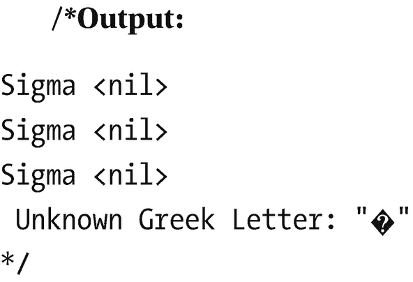
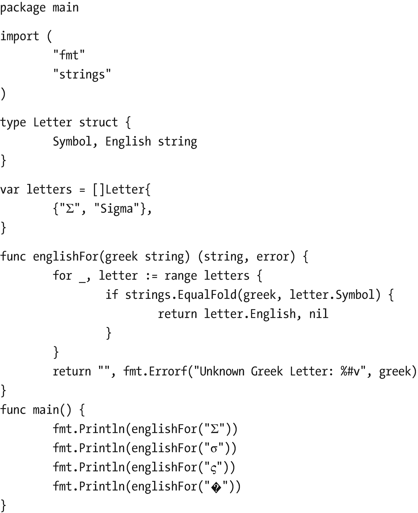

# 4. 处理文本

现实世界中的应用程序会处理大量文本数据。与 C++ 和 Java 等语言不同，在 Go 中，字符串表现为只读的字节切片。此外，使用 UTF-8 编码的 Unicode 文本用于表示字符串的字节。Go 提供了多个用于字符串操作的库，例如 `strings`、`unicode` 和 `regexp` 等包。请注意，在 Go 中，字符串是*不可变的*或只读的，这意味着它们在被创建后其值不能被改变。尝试修改它们会引发错误。本章讨论如何在 Go 语言中处理文本。具体来说，它涵盖了字符串格式化、Unicode 数据处理以及在 Go 语言中使用正则表达式。


## Go 字符串格式化与 Unicode 处理

计算机最初是为英国和美国等英语国家开发的。当时，单个字节的容量最多为 255 个数字，足以使用 ASCII 格式表示英文字母表。然而，当其他国家开始使用计算机时，便需要用多个字节来编码字母。因此，Unicode 应运而生。在 Unicode 中，字符或码点被编码为特定的数字。这些数字又根据编码方案被编码为字节。例如，UTF-8 用于编码代码字符串。在 Go 中，Unicode 码点被称为 *rune*。此外，Unicode 被设计为 ASCII 格式的超集。而且，Unicode 旨在涵盖世界上所有书写系统中的字符，包括多种变音符号、不同的重音符号以及控制码（如回车符、制表符等）。

清单 4-1 中展示的 Go 代码片段演示了一个函数，该函数返回给定句子中的字符总数。给定的输入也可以包含 Unicode 格式的字符。一个句子作为输入参数传递给 `lineLength()` 函数。该输入本质上是一个名为 `word` 的字符串切片。你必须计算以字符为单位的单词长度。请记住，这与以字节为单位计算长度不同。如果使用内置函数 `len()`，它将返回字节长度。另一方面，如果使用 `unicode/utf` 包中的 `RuneCountInString()` 函数，它会返回字符串中的 rune 总数。由于 `for` 循环只会遍历每个单词，为了记录空格的数量，你可以使用公式 `(单词长度)-1`。在函数末尾，返回总数与空格数之和。请注意，作为输入传递的字符串中的尖括号是 Unicode 编码的。

```
package main
import (
"fmt"
"unicode/utf8"
)
func lineLength(words []string) int {
total := 0
for _, word := range words {
total += utf8.RuneCountInString(word)
}
numSpaces := len(words) - 1
return total + numSpaces
}
func main() {
words := []string{"«", "Don't", "Panic", "»"} //UTF-8 尖括号
fmt.Println("Length: ", lineLength(words))
}
清单 4-1
Go 字符串格式化与 Unicode 处理代码片段
```

**输出：**

```
Length: 15
```

### Go 中的不区分大小写比较

在 Go 中，字符串是 UTF-8 编码的。Go 的 `strings` 包提供了一个 `EqualFold` 方法，用于对两个字符串进行不区分大小写的比较。

清单 4-2 中的示例演示了一个返回希腊字母英文名称的函数。在英语中，有大写和小写字母。通常，要对字符串进行不区分大小写的比较，必须将字符串中的字母转换为其中一种大小写形式以进行比较。然而，并非所有语言都如此。例如，在希腊语中，字母 sigma 有三种形式（`Σ`、`σ` 和 `ς`）。在这里，`string.toUpper()` 函数将不起作用。相反，`string.EqualFold()` 函数会很有用。

清单 4-2 定义了结构体 `letters`，其成员字段 `Symbol` 用于存储希腊符号，`English` 字段用于存储对应的英文名称。`letters` 切片将为你保存符号和名称。如果传递的字母未找到，程序将返回一条错误消息。请注意，由于 `Σ`、`σ` 和 `ς` 都是 sigma 的形式，代码将为每个字母打印 `"Sigma"`。



希腊字母输出的伪代码。



希腊符号和英文名称不区分大小写比较的伪代码。

### 使用 Go 进行正则表达式和读取文本文件

Go 内置了对 `regexp` 包的支持。清单 4-3 中的代码片段演示了 `regexp` 包在 Go 中的一些常见用例。在此代码中，在第 12 行，`regexp.MatchString()` 函数直接检查正则表达式和字符串是否匹配。`regexp.MatchString()` 函数在检查后返回 `true` 或 `false`。在第 17 行，使用 `Compile()` 函数生成一个可用于匹配文本的 `regex` 对象，而不是直接指定正则表达式。如第 58 行所示，应改用 `Compile()` 的 `MustCompile()` 版本。这是因为 `MustCompile()` 版本不会返回错误，而是会导致 panic，这对于全局变量来说是更安全的做法。

第 21 到 48 行演示了各种内置函数，用于使用正则表达式和作为参数传递的字符串来查找匹配项、子匹配项、匹配项或子匹配项的起始和结束索引等。你还可以通过传递一个非负整数作为参数来限制返回的匹配项数量，如第 53 行所示。如第 64 行所示，`ReplaceAllString()` 函数可用于将字符串的子集替换为所需的值。有关 `regex` 包的更多信息，请参考[官方文档](https://pkg.go.dev/regexp)（`https://pkg.go.dev/regexp`）。

```
package main
import (
"bytes"
"fmt"
"regexp"
)
func main() {
/* 直接检查正则表达式模式是否匹配字符串 */
match, _ := regexp.MatchString("p([a-z]+)ch", "preach")
fmt.Println(match)
/* 编译一个优化的 Regexp 结构体，得到一个
可用于匹配文本的 Regexp 对象 */
r, _ := regexp.Compile("p([a-z]+)ch")
/* MatchString 检查传递的字符串是否包含正则表达式的任何匹配项 */
fmt.Println(r.MatchString("preach"))
/* FindString 检查传递的字符串是否包含与正则表达式最左边文本匹配的文本 */
fmt.Println(r.FindString("preach patch"))
/* FindStringIndex 在传递的字符串中查找第一个与正则表达式匹配的项，
并返回匹配的起始和结束索引（而非文本） */
fmt.Println("匹配的起始和结束索引:",
r.FindStringIndex("pinch pouch"))
/* FindStringSubmatch 在传递的字符串中查找最左边与正则表达式匹配的项以及子匹配项 */
fmt.Println(r.FindStringSubmatch("poach pitch"))
/* FindStringSubmatchIndex 在传递的字符串中查找最左边与正则表达式匹配的项
以及子匹配项，并返回起始和结束索引
（而非文本）。此处，匹配的结束索引是排他的。 */
fmt.Println(r.FindStringSubmatchIndex("punch"))
/* All 变体查找传递字符串中的所有匹配项 */
/* 在给定输入中查找正则表达式的所有匹配项 */
fmt.Println(r.FindAllString("parch patch pitch", -1))
/* FindAllStringSubmatchIndex 返回一个切片，
包含正则表达式的所有匹配项 */
fmt.Println("所有匹配项和子匹配项的索引:", r.FindAllStringSubmatchIndex(
"potch pooch porch", -1))
/* 通过传递一个非负整数作为参数来限制返回的匹配项数量 */
fmt.Println(r.FindAllString("prelaunch postlaunch pitch", 2))
/* 检查字节切片是否包含与正则表达式匹配的文本 */
fmt.Println(r.Match([]byte("pinch")))
/* 对全局变量使用 MustCompile */
r = regexp.MustCompile("p([a-z]+)ch")
fmt.Println("regexp:", r)
/* 将字符串子集替换为其他值 */
fmt.Println(r.ReplaceAllString("pinch it!", "hurt"))
/* 使用指定函数转换匹配的文本。 */
in := []byte("The prelaunch")
out := r.ReplaceAllFunc(in, bytes.ToUpper)
fmt.Println(string(out))
}
清单 4-3
使用正则表达式的 Go 代码片段
```

**/*输出：*/


```text
true
true
preach
Start and End Indexes of Match: [0 5]
[poach oa]
[0 5 1 3]
[parch pitch patch]
Indexes of All Matches and Submatches: [[0 5 1 3] [6 11 7 9]
[12 17 13 15]]
[prelaunch postlaunch]
true
regexp: p([a-z]+)ch
hurt it!
The PRELAUNCH
*/
```

假设你的系统上有一个以文本格式保存的股票分类账本。其中有 12 股微软股票，价格为 234.57 美元，以及 10 股特斯拉股票，价格为 692.40 美元。假设在自动解析分类账本后，文本必须被传输到一个结构体类型 `transaction` 的切片中。

为此，首先编写一个函数，用于每次解析分类账本的一行。此外，该分类账本并非采用 YAML、CSV、XML 或 JSON 等结构化格式。因此，有必要使用正则表达式来执行解析。在 Go 语言中，`regexp` 包提供了程序员可以使用的多个正则表达式。要了解使用正则表达式的语法，请参考 [`regexp/syntax`](https://pkg.go.dev/regexp/syntax) 包的官方文档（`https://pkg.go.dev/regexp/syntax`）。

清单 4-4 是解决此场景的一个示例方案。在清单 4-4 中，你必须首先定义用于解析单行的正则表达式。请记住，通常的最佳实践是以注释代码的形式给出正则表达式的示例，以便更好地理解。此处，如果正则表达式无效，`MustCompile()` 函数将触发 panic。

请注意，该程序将保存正则表达式的变量声明在全局级别，以便整个程序都能访问它，并且 `panic` 将导致整个程序崩溃。在正则表达式中，`\d+` 是数字的占位符。`+` 号表示允许一个或多个字符。表达式 `([A-Z]+)` 表示可以接受大写字符。`\$` 用于表示美元符号。表达式 `(\d+(\.\d+)?)` 用于打印价格。它接受美元符号后的一个或多个数字，后跟一个点（`.`），然后再跟一个或多个数字。这样你就声明了 `Transaction` 结构体。

`parseLine()` 函数将一个字符串作为输入参数，并返回一个 `Transaction` 类型的对象以及一个错误。在该函数内部，我们首先使用 `FindStringSubmatch()` 函数检查传入的字符串是否与正则表达式匹配。它返回一个匹配项的切片。如果没有匹配项，则返回一个错误和一个空的事务对象。当存在匹配项时，它将值分配给 `transaction` 类型对象 `trans` 的相应成员字段。由于正则表达式处理的是文本，匹配项将是字符串。你需要将它们转换为整数（对于交易量）和浮点数（对于价格）。你可以分别使用 `strconv.Atoi()` 和 `strconv.ParseFloat()` 函数来实现这一点。在此过程中，你可以忽略返回的错误，因为你知道正则表达式匹配的字符串是合法的，可以安全地转换为数字。

```go
package main
import (
"fmt"
"log"
"regexp"
"strconv"
)
/*
12 shares of MSFT for $234.57
10 shares of TSLA for $692.4
*/
var transRe = regexp.MustCompile(`(\d+) shares of ([A-Z]+) for \$(\d+(\.\d+)?)`)
type Transaction struct {
Symbol string
Volume int
Price  float64
}
func parseLine(line string) (Transaction, error) {
matches := transRe.FindStringSubmatch(line)
if matches == nil {
return Transaction{}, fmt.Errorf("Bad Line: %q", line)
}
var trans Transaction
trans.Symbol = matches[2]
trans.Volume, _ = strconv.Atoi(matches[1])
trans.Price, _ = strconv.ParseFloat(matches[3], 64)
return trans, nil
}
func main() {
line := "12 shares of MSFT for $234.57"
t, err := parseLine(line)
if err != nil {
log.Fatal(err)
}
fmt.Printf("%+v\n", t)
}
```

**输出：**
```
{Symbol:MSFT Volume:12 Price:234.57}
```

假设你正在运行一台 Linux 机器，并且想知道系统重启了多少次。此信息可以从 `sys.log` 文件中获取。使用 `grep` 工具，你可以在这个文件中搜索“System is rebooting”这句话。在下面的例子中，你将编写一个像 `grep` 工具一样工作的函数，并显示包含搜索词的行。

如清单 4-5 所示，`grep()` 函数接收两个输入——一个用于读取文本的 `io.Reader` 对象，以及你要搜索的术语。此外，它返回一个与所需术语匹配的字符串切片。`NewScanner()` 返回一个新的扫描器，用于从 `io.Reader` 中读取。`strings.Contains()` 确定当前文本是否包含所需的术语。如果包含，则将当前行追加到 `matches` 切片中。你需要检查扫描时是否出错。如果没有，则返回 `matches`。

```go
package main
import (
"bufio"
"fmt"
"io"
"log"
"strings"
)
func main() {
r := strings.NewReader("This is a sample code. Learn to code properly")
term := "code"
matches, err := (grep(r, term))
if err != nil {
log.Fatalln(err.Error())
}
if matches != nil {
fmt.Println("Lines containing \"", term, "\" are :")
fmt.Println(matches)
} else {
fmt.Println("Query term is not present")
}
}
//grep 返回 r 中包含术语 term 的行
func grep(r io.Reader, term string) ([]string, error) {
var matches []string
s := bufio.NewScanner(r)
for s.Scan() {
if strings.Contains(s.Text(), term) {
matches = append(matches, s.Text())
}
}
if err := s.Err(); err != nil {
return nil, err
}
return matches, nil
}
```

**输出：**
```
Lines containing " code " are :
[This is a sample code. Learn to code properly]
```

### 动手挑战

编写一个 Go 程序，从给定文件中返回 Go 子命令出现的次数。该文件包含以下格式的文本。

```
1542784314:0;git push
1542784378:0;ls
1542784308:0;go test
1542784310:0;go test -v
```

### 解决方案

清单 4-6 展示了此动手挑战的一种可能解决方案。

```go
package main
import (
"bufio"
"fmt"
"os"
"regexp"
)
/* 要读取的文件中的示例数据
1542784314:0;git push
1542784378:0;ls
1542784308:0;go test
1542784310:0;go run -v
1542784311:0;go test -v
*/
var cmdRe = regexp.MustCompile(`;go ([a-z]+)`)
//cmdFreq 从给定文件中返回 go 子命令的频率
func cmdFreq(fileName string) (map[string]int, error) {
file, err := os.Open(fileName)
if err != nil {
return nil, err
}
defer file.Close()
freqs := make(map[string]int)
s := bufio.NewScanner(file)
for s.Scan() {
matches := cmdRe.FindStringSubmatch(s.Text())
if len(matches) == 0 {
continue
}
cmd := matches[1]
freqs[cmd]++
}
if err := s.Err(); err != nil {
return nil, err
}
return freqs, nil
}
func main() {
result, _ := cmdFreq("./sample.txt")
for key, _ := range result {
fmt.Println("Subcommand: ", key, " Count: ", result[key])
}
}
```

**输出：**
```
Subcommand:  test  Count:  2
Subcommand:  run  Count:  1
```

### 小结

本章包含了基于不同场景的 Go 语言食谱，旨在为用户提供字符串格式化、读取文本文件、执行大小写敏感比较以及使用正则表达式等高级主题的实践体验。

能够定义数据类型至关重要，因此在下一章中，我们将提供关于结构体、方法和接口的食谱。


