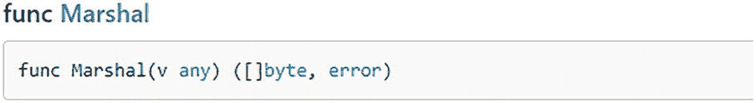
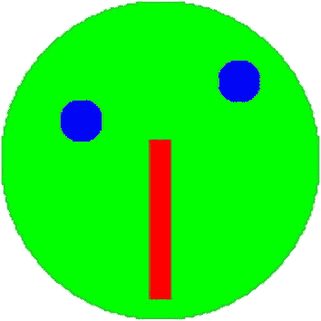

# 5. 结构体、方法与接口

Go 语言支持 `structs`（*结构体*的简称），允许程序员定义用户自定义类型。具有“组成”关系的相关数据可以使用 `structs` 分组到一个逻辑单元中。Go 语言中的方法是可与用户自定义类型绑定以定义其行为的函数。Go 语言的另一个重要特性是接口的概念。在 Go 语言中，`structs` 和接口协同工作，用于组织方法和数据处理。接口可以定义为可由任何其他类型实现的方法签名集合。在 Go 语言中实现一个接口仅需实现该接口定义的方法。此外，接口只定义但不声明对象的行为。简而言之，`struct` 定义了对象的字段，例如，形状的类型和颜色；而 `interface` 则定义了可用于该对象的方法，例如，设置和返回形状的颜色。本章提供与 `structs`、方法和接口使用相关的 Go 语言实践指南。

## Go 语言中的结构体、方法与接口

在本节中，我们提供实践指南来说明如何使用 `structs` 定义用户自定义数据类型、定义与 `structs` 关联的方法，以及使用包含一组方法与 `structs` 关联的接口。我们以一个家庭自动化系统为例，该系统使用传感器将事件详情发送到服务器，例如，门或恒温器发送事件。

### 结构体

在 Go 语言中，每当需要定义用户自定义数据类型时，就会使用 `structs`。它们允许程序员将逻辑上相关的数据分组在一起。例如，一个名为 `Person` 的结构体可用于将姓名、姓氏、年龄等相关信息分组，以创建一条数据记录。换句话说，`structs` 可用于存储项目集合。`Structs` 可用于分组用户自定义数据类型以及 Go 的内置数据类型。它们还能提高代码的模块化程度，并有助于创建和传递复杂的数据结构。

#### 在 Go 语言中声明结构体

代码清单 5-1 演示了在 Go 语言中声明 `struct` 的方法。声明以 `type` 关键字开头，后跟用户自定义的结构体名称。这可以是您选择的任何名称，最后，`struct` 关键字表示正在声明一个新的结构体。在大括号内，您可以指定任意数量的、您想要分组的数据字段。对于每个数据字段，指定名称和数据类型非常重要。

```
type 标识符 struct{
字段 1 数据类型
字段 2 数据类型
字段 3 数据类型
}
代码清单 5-1
在 Go 语言中声明结构体的通用格式
```

在命名 `struct` 时，请始终记住：如果 `struct` 及其字段的标识符以小写字母开头，则 `struct` 及其字段都不会被导出到其他包。在 Go 语言中，要导出标识符（即允许其他包访问），必须确保名称以大写字母开头。

#### 创建结构体类型的实例

有多种方法可以实例化 `struct` 类型的新实例。考虑代码清单 5-2，其中声明了一个包含三个数据字段（`length`、`breadth` 和 `color`）的 `circle` 结构体。第 15 行演示了如何在不显式实例化该 `struct` 类型新实例的情况下使用 `struct`。`var` 关键字初始化了一个 `circle` 类型的变量 `circle1`。点符号（`.`）为 `struct` 实例的字段赋值，如第 19 行所示。第 26 行演示了如何使用结构体字面量创建 `struct` 实例，这样您可以跳过某些数据字段的值。第 32 行和第 39 行使用 `new` 关键字实例化 `circle` 结构体的新实例。`circle3` 和 `circle4` 的区别在于：`circle3` 是指向 `circle` 实例的指针，而 `circle4` 是 `circle` 的一个实例。类似地，您可以使用指针地址运算符（`&`）实例化 `struct` 类型的新实例，如第 46、49 和 54 行所示。

```
package main
import (
"fmt"
)
type circle struct {
length  float32
breadth float32
color   string
}
func main() {
// 不实例化新实例直接使用结构体
fmt.Println("不实例化: ", circle{10.5, 25.10, "red"})
// 创建结构体类型的实例
var circle1 circle
circle1.length = 20 // 使用点符号赋值
circle1.breadth = 30
circle1.color = "Yellow"
fmt.Println("Circle1: ", circle1)
// 使用结构体字面量创建结构体实例
var circle2 = circle{length: 10, color: "Green"} /* bread
字段值被省略 */
fmt.Println("Circle2: ", circle2)
// 使用 new 关键字实例化结构体
circle3 := new(circle) /* circle3 是指向 circle 实例的指针 */
circle3.length = 10
circle3.breadth = 20
circle3.color = "Red"
fmt.Println("Circle3: ", circle3)
var circle4 = new(circle) //circle4 是 circle 的一个实例
circle4.length = 40
circle4.color = "Blue"
fmt.Println("Circle4: ", circle4)
// 使用指针地址运算符实例化结构体
var circle5 = &circle{10, 20, "Green"} //不能省略任何值！
fmt.Println(circle5)
var circle6 = &circle{}
circle6.length = 10
circle6.color = "Red"
fmt.Println(circle6) // breadth 的值被省略
var circle7 = &circle{}
(*circle7).breadth = 10
(*circle7).color = "Blue"
fmt.Println(circle7) // length 的值被省略
}
代码清单 5-2
在 Go 语言中创建结构体类型实例的实践指南
```

**输出：**

```
Without Instantiating:  {10.5 25.1 red}
Circle1:  {20 30 Yellow}
Circle2:  {10 0 Green}
Circle3:  &{10 20 Red}
Circle4:  &{40 0 Blue}
Circle5:  &{10 20 Green}
Circle6:  &{10 0 Red}
Circle7:  &{0 10 Blue}
```


### 结构体实战解析

清单 5-3 通过一个家庭自动化系统的示例，演示了结构体的使用。该系统使用传感器发送不同的事件详情。由于可能存在多个不同的传感器，为了存储它们产生的不同事件信息，首先定义了一个名为 `event` 的结构体。`event` 结构体的成员字段用于标识产生事件的设备（本例中为门或恒温器）以及事件发生的时间。

该示例还定义了特定于设备的事件，即 `DoorEvent` 和 `TemperatureEvent`，以说明 Go 语言中*类型嵌入*的概念。类型嵌入是一种将一个类型包含到另一个类型中，但将其作为无名称参数的技术。通过类型嵌入，嵌入类型中所有导出的参数和方法，对于嵌入该类型的类型来说也是可访问的。`DoorEvent` 和 `TemperatureEvent` 结构体都嵌入了 `Event` 类型。除了 `Event` 结构体的成员字段外，每个结构体也拥有各自特定的成员字段。`NewDoorEvent()` 函数接收用于创建 `DoorEvent` 结构体对象的输入参数。进入函数后，执行一些验证以确保 `ID` 不为空。接着，创建一个嵌入类型 `Event` 的变量 `evt`。在函数末尾，返回指向包含事件详情的 `evt` 变量的指针。如果你熟悉 C 或 C++，返回一个指向栈上分配内容的指针可能看起来很奇怪。Go 编译器会执行逃逸分析，并将函数中使用到的事件详情从栈移动到堆上。

```
package main
import (
"fmt"
"log"
"time"
)
type Event struct {
ID   string
Time time.Time
}
type DoorEvent struct {
Event
Action string //open, close
}
type TemperatureEvent struct {
Event
Value float32
}
func NewDoorEvent(id string, time time.Time, action string) (*DoorEvent, error) {
if id == "" {
return nil, fmt.Errorf("empty id")
}
evt := DoorEvent{
Event:  Event{id, time},
Action: action,
}
return &evt, nil
}
func main() {
evt, err := NewDoorEvent("front door", time.Now(), "open")
if err != nil {
log.Fatal(err)
}
fmt.Printf("%+v\n", evt)
}
清单 5-3
Go 结构体使用示例
```

**输出：**

```
&{Event:{ID:front door Time:2022-02-14 17:45:54.9964674 +0500 PKT m=+0.003330501} Action:open}
```

### 方法

可以为用户定义的数据类型定义并附加方法。Go 的方法和函数彼此相似，不同之处在于方法有一个额外的接收者参数。方法使用这个接收者参数来访问与接收者对象相关的不同属性。然而，接收者可以是结构体类型或非结构体类型。需要注意的重要一点是，方法使用的接收者和接收者类型必须位于同一个包中。此外，如果接收者类型已在另一个包中定义，则不能为其创建方法。这包括诸如 `string`、`float`、`int` 等内置类型。尝试这样做会在编译时报错。

#### 在 Go 中声明方法

在 Go 中声明方法的语法如清单 5-4 所示。`func` 关键字后跟接收者名称及其类型，然后是方法名称，接着是输入参数列表，最后显示返回类型（如果方法有返回值的话）。

```
func(reciver_name Type) method_name(parameter_list)(return_type){
// Code
}
清单 5-4
Go 中声明方法的一般格式
```

#### 方法实战解析

查看清单 5-5 中的 Go 示例，该示例演示了恒温器的工作原理。恒温器是一种用于控制和测量温度的设备。首先，定义了一个名为 `thermostat` 的结构体。它有两个成员字段：`ID`（`string` 类型）和 `value`（`float32` 类型）。注意，`ID` 字段是导出的（公开的），因此其名称以大写字母开头。由于 `value` 字段未导出，它是私有的，因此其名称以小写字母开头。`Value()` 函数获取一个接收者键，该键是指向 `thermostat` 的指针类型。它返回一个 `float32` 类型的内部值。`Set()` 函数根据其参数指定的值设置恒温器的值。请记住，指针接收者用于修改结构体的方法。方法也可以没有接收者。例如，清单 5-5 中的 `Kind()` 函数就是这样一个方法。

```
package main
import (
"fmt"
)
//A thermostat measures and controls the temperature
type Thermostat struct {
ID    string
value float64
}
//Value return the current temperature in Celsius
func (t *Thermostat) Value() float64 {
return t.value
}
//Set tells the thermostat to set the temperature
func (t *Thermostat) Set(value float64) {
t.value = value
}
//Kind returns the device kind
func (t *Thermostat) Kind() string {
return "thermostat"
}
func main() {
t := Thermostat{"Living Room", 16.2}
fmt.Printf("%s Before: %.2f\n", t.ID, t.Value())
t.Set(18)
fmt.Printf("%s After: %.2f\n", t.ID, t.Value())
}
清单 5-5
Go 方法使用示例
```

**输出：**

```
Living Room Before: 16.20
Living Room After: 18.00
```

### 接口

Go 是一种多范型语言，它兼具函数式、命令式和面向对象编程的特点。尽管看起来 Go 从 OOP 范型中借鉴了很多，但有一个例外。Go 不支持使用类进行继承；相反，它选择组合而非继承，并使用结构体和接口来实现这一目标。

#### 在 Go 中声明接口

在 Go 中，*接口*是一种抽象类型，即它用于描述一个类型可以实现的所有方法。然而，接口仅限于提供方法签名，而不提供其实现。方法的实现完全由实现接口的类型决定。因此，可以说接口只定义（而不声明）特定类型对象的行为。

清单 5-6 演示了在 Go 中创建接口。首先是 `type` 关键字，后跟接口名称，接口名称可由程序员选择（Go 语言保留关键字除外）。最后是 `interface` 关键字。相关的方法签名包含在花括号内，如清单 5-6 所示。

```
type interface_name interface{
// Method signatures
}
清单 5-6
Go 中声明接口的一般格式
```

#### 在 Go 中实现接口

在 Go 中，实现接口时必须实现接口中声明的所有方法。此外，与其他需要 `implement` 关键字来实现接口的语言不同，Go 是隐式实现接口的。清单 5-7 演示了如何在 Go 中声明和实现接口。

```
package main
import (
"fmt"
)
// Creating an Interface
type Shape interface {
// Method Signatures
Area() float64
Perimeter() float64
}
type Rectangle struct {
length  float64
breadth float64
}
// Implementing Methods of the Shape Interface
func (r Rectangle) Area() float64 {
return r.length * r.breadth
}
func (r Rectangle) Perimeter() float64 {
return 2 * (r.length + r.breadth)
}
// Main Method
func main() {
// Accessing Elements of the Shape Interface
var s Shape
s = Rectangle{10, 14}
fmt.Println("Area of Shape :", s.Area())
fmt.Println("Perimeter of Shape:", s.Perimeter())
}
清单 5-7
Go 接口实现示例
```

**输出：**

```
Area of Shape : 140
Perimeter of Shape: 48
```


#### 接口实战示例

让我们通过一个 Go 语言示例来学习如何使用接口。假设你有多个传感器，并希望将它们全部打印出来。在这种情况下，首先需要定义一个自定义类型 `Sensor`，用于存储传感器相关信息。由于所有传感器都需要类似的功能，你可以使用接口来实现这一目的。

代码清单 5-8 展示了 Go 语言中接口的使用方式。这里定义了一个包含三个关联方法的 `thermostat` 结构体。另一个结构体是 `camera`，它具有与 `thermostat` 相同的方法。`printAll()` 函数用于打印任意传感器的 ID。你可以使用接口来实现打印功能。该函数接收一个传感器切片，并针对每个传感器打印其 ID 和类型。在 `main()` 函数中，你创建了一个 `Sensors` 类型的切片，其中包含 `Thermostat` 和 `Camera` 结构体，并打印它们的详细信息。

```
package main
import (
"fmt"
)
//thermostat（恒温器）用于测量和控制温度
type Thermostat struct {
id    string
value float64
}
//Value 返回当前摄氏温度
func (t *Thermostat) Value() float64 {
return t.value
}
//ID 返回恒温器 ID
func (t *Thermostat) ID() string {
return t.id
}
//Set 用于设置恒温器温度
func (t *Thermostat) Set(value float64) {
t.value = value
}
//Kind 返回设备类型
func (t *Thermostat) Kind() string {
return "thermostat"
}
//Camera 是安防摄像头
type Camera struct {
id string
}
//ID 返回摄像头 ID
func (c *Camera) ID() string {
return c.id
}
func (*Camera) Kind() string {
return "camera"
}
type Sensor interface {
ID() string
Kind() string
}
func printAll(sensors []Sensor) {
for _, s := range sensors {
fmt.Printf("%s \n", s.ID(), s.Kind())
}
}
func main() {
t := Thermostat{"Living Room", 16.2}
c := Camera{"Baby Room"}
sensors := []Sensor{&t, &c}
printAll(sensors)
/*fmt.Printf("%s Before: %.2f\n", t.ID, t.Value())
t.Set(18)
fmt.Printf("%s After: %.2f\n", t.ID, t.Value())*/
}
代码清单 5-8
Go 语言中使用接口的示例
```

**/*输出结果:***

```
Living Room 
Baby Room 
*/
```

## 空接口与 Go 语言中的 IOTA 使用

当接口类型未指定任何方法时，它被称为空接口。在 Go 语言中，空接口用于处理未知类型的值。空接口也可以容纳任意类型的值。Go 语言中另一个需要了解的概念是 `IOTA`。`IOTA` 是一个标识符，用于与使用自增数字的常量配合使用。简单来说，`IOTA` 本质上是一个从零开始、每次递增 1 的计数器。它可以用来高效地创建 Go 语言中的常量和枚举。本节将通过示例讨论 Go 语言中空接口和 `IOTA` 的使用。

### JSON 编码/解码

Go 语言内置支持 JSON 编码和解码，包括与内置和自定义数据类型之间的相互转换。`encoding/json` 包允许你按照 RFC 7159 标准对 JSON 数据进行编码。处理数据时，你通常希望将某个 Go 结构体编码为 `json` 字符串。让我们看看官方文档（[`https://pkg.go.dev/encoding/json#Manual`](https://pkg.go.dev/encoding/json%2523Manual)）中定义的 JSON Marshal 函数。

如图 5-1 所示，`Marshal()` 函数接收一个 `any` 类型的对象（`any` 是空接口 `interface{}` 的别名），并返回一个包含传入参数 JSON 编码结果的 `byte` 数组。JSON 的 `Marshal()` 函数可以处理多种类型，例如 `integers`、`strings`、`time.Time` 等。这些类型没有共享的公共方法，因此唯一能同时满足它们所有类型的接口就是空接口。空接口不作出任何声明。它是一种绕过 Go 语言类型系统的方法。不过，空接口应作为最后手段使用。



截图显示了 Marshal 函数的格式。

图 5-1

JSON 包中 Marshal 函数的格式

让我们看一个示例来加深理解。在代码清单 5-9 中，假设你有多种事件类型，例如 `ClickEvent` 和 `HoverEvent`。还有一个计数器用于记录每个事件被触发的次数。`recordEvent()` 函数用于记录计数。它接收一个空接口类型的参数，因为这两个事件以及系统中任何其他事件都没有共同点。在该函数中，你使用 `switch` 语句来检查当前事件的类型。如果是 `ClickEvent`，则点击事件计数器递增；如果是 `HoverEvent`，则其对应计数器递增；否则，应发出警告。你还可以通过 `value.(typeName)` 进行类型断言，将空接口转换为底层类型。但如果类型错误，这会导致程序崩溃。另一种更安全的方法是使用 `comma,ok` 惯用法。`comma,ok` 惯用法的工作方式类似于 `if-else` 语句。如果在映射中找到传入的键，则返回对应的值；否则返回零值。

```
package main
import (
"fmt"
"log"
)
type ClickEvent struct {
// ...
}
type HoverEvent struct {
// ...
}
var eventCounts = make(map[string]int) //type->count
func recordEvent(evt interface{}) {
switch evt.(type) {
case *ClickEvent:
eventCounts["click"]++
case *HoverEvent:
eventCounts["hover"]++
default:
log.Printf("warning: unknown event: %#v of type %T\n", evt, evt)
}
}
func main() {
recordEvent(&ClickEvent{})
recordEvent(&HoverEvent{})
recordEvent(&ClickEvent{})
recordEvent(3)
fmt.Println("event counts", eventCounts)
}
代码清单 5-9
Go 语言中使用 Marshal 函数的示例
```

**/*输出结果:***

```
2022/02/15 00:08:22 warning: unknown event: 3 of type int
event counts map[click:2 hover:1]
*/
```


### 泛型

泛型是一种与具体使用类型无关的代码，已在 Go 1.18 版本中加入。泛型允许函数或类型接受其泛型形式中定义的多种类型。

假设你想编写自己的日志系统。如代码清单 5-10 所示，首先使用 `LogLevel` 类型定义系统中可能的日志级别——调试、警告和错误。在其他语言中，你可能会使用 `enum`；但在 Go 中，使用的是 `IOTA`。`IOTA` 是一个与常量一起使用的标识符，用于简化使用自动递增的常量定义。`IOTA` 关键字代表一个从零开始的整数常量。在下面的代码中，你定义了一个用户自定义类型 `LogLevel`，它是一个八位无符号整数，即 `uint8`。

使用 `const` 子句，你可以定义所需的三个级别——`DebugLevel`、`WarningLevel` 和 `ErrorLevel`。这里，由于使用了 `iota`，你想要从零开始，因此 `DebugLevel` 将是 1。同一个 `const` 子句中的其他值会获得递增的 `iota` 值。所以 `WarningLevel` 是 `iota + 2`，`ErrorLevel` 将是 `iota + 3`。你还需要一个良好的字符串表示形式。为此，`String()` 函数将实现 `fmt.Stringer` 接口。`String()` 函数返回一个 `string`。这里，`switch` 语句检查日志级别。注意，示例中使用了 `%d` 而不是 `%s`，因为如果使用 `%s` 会导致无限递归。

```go
package main
import "fmt"
//LogLevel 是一个日志级别
type LogLevel uint8
//可能的日志级别
const (
DebugLevel LogLevel = iota + 1
WarningLevel
ErrorLevel
)
//string 实现了 fmt.Stringer 接口
func (l LogLevel) String() string {
switch l {
case DebugLevel:
return "debug"
case WarningLevel:
return "warning"
case ErrorLevel:
return "error"
}
return fmt.Sprintf("unknown log level: %d", l)
}
func main() {
fmt.Println(WarningLevel)
lvl := LogLevel(19)
fmt.Println(lvl)
}
代码清单 5-10
在 Go 中使用泛型的 Go 方案
```

**输出：**

```
warning
unknown log level: 19
```

### 动手挑战

实现一个支持以下功能的绘画程序：

- 具有位置 (X, Y)、颜色和半径的圆形
- 具有位置 (X, Y)、宽度、高度和颜色的矩形

每种类型都应实现一个绘制方法 `Draw(d Device)`，该方法在设备上工作，并实现一个 `ImageCanvas`。它是一个包含可绘制项切片的结构体，并有一个绘制方法 `Draw(w io.Writer)`，该方法使用 `image/png` 包将 PNG 写入 `w`。

### 解决方案

代码清单 5-11 是该动手挑战的一种解决方案。首先，定义颜色 `Red`、`Green` 和 `Blue`。然后声明一个 `Shape` 结构体，该结构体将被嵌入到 `Circle` 和 `Rectangle` 结构体中。`Device` 接口将像素设置为指定颜色。

```go
package main
import (
"fmt"
"image"
"image/color"
"image/png"
"io"
"log"
"math"
"os"
)
var (
Red   = color.RGBA{0xFF, 0, 0, 0xFF}
Green = color.RGBA{0, 0xFF, 0, 0xFF}
Blue  = color.RGBA{0, 0, 0xFF, 0xFF}
)
type Shape struct {
//包含所有可绘制项共有的特性
X     int
Y     int
Color color.Color
}
type Circle struct {
Shape
Radius int
}
func NewCircle(x, y, r int, c color.Color) *Circle {
cr := Circle{
Shape:  Shape{x, y, c},
Radius: r,
}
return &cr
}
func (c *Circle) Draw(d Device) {
//计算边界矩形
minX, minY := c.X-c.Radius, c.Y-c.Radius
maxX, maxY := c.X+c.Radius, c.Y+c.Radius
//在边界矩形内绘制像素
for x := minX; x <= maxX; x++ {
for y := minY; y <= maxY; y++ {
dx, dy := x-c.X, y-c.Y
//检查该点是否在圆内
if int(math.Sqrt(float64(dx*dx+dy*dy))) <= c.Radius {
//将像素设置为该颜色
d.Set(x, y, c.Color)
}
}
}
}
type Rectangle struct {
Shape
Height int
Width  int
}
func NewRectangle(x, y, h, w int, c color.Color) *Rectangle {
r := Rectangle{
Shape:  Shape{x, y, c},
Height: h,
Width:  w,
}
return &r
}
func (r *Rectangle) Draw(d Device) {
minX, minY := r.X-r.Width/2, r.Y-r.Height/2
maxX, maxY := r.X+r.Width/2, r.Y+r.Height/2
for x := minX; x <= maxX; x++ {
for y := minY; y <= maxY; y++ {
d.Set(x, y, r.Color)
}
}
}
type Device interface {
Set(int, int, color.Color)
}
type ImageCanvas struct {
width  int
height int
shapes []Drawer
}
func NewImageCanvas(width, height int) (*ImageCanvas, error) {
if width <= 0 || height <= 0 {
return nil, fmt.Errorf("negative size: width=%d, height=%d", width, height)
}
c := ImageCanvas{
width:  width,
height: height,
}
return &c, nil
}
type Drawer interface {
Draw(d Device)
}
func (ic *ImageCanvas) Add(d Drawer) {
ic.shapes = append(ic.shapes, d)
}
func (ic *ImageCanvas) Draw(w io.Writer) error {
img := image.NewRGBA(image.Rect(0, 0, ic.width, ic.height))
for _, s := range ic.shapes {
s.Draw(img)
}
return png.Encode(w, img)
}
func main() {
ic, err := NewImageCanvas(200, 200)
if err != nil {
log.Fatal(err)
}
ic.Add(NewCircle(100, 100, 80, Green))
ic.Add(NewCircle(60, 80, 10, Blue))
ic.Add(NewCircle(140, 60, 10, Blue))
ic.Add(NewRectangle(100, 130, 80, 10, Red))
f, err := os.Create("face.png")
if err != nil {
log.Fatal(err)
}
defer f.Close()
if err := ic.Draw(f); err != nil {
log.Fatal(err)
}
}
代码清单 5-11
展示动手挑战一种解决方案的 Go 方案
```

**输出：**



图表展示了代码的输出。它显示了一个大圆内部的两个小圆和一个垂直矩形。

## 总结

本章包含了 Go 方案，为读者提供处理结构体以及使用方法与接口的实践体验。此外，还涵盖了空接口以及如何处理 Go 中 `IOTA` 类型等进阶主题。

下一章将提供用于处理 Web 应用程序之间交换的 JSON 格式数据的 Go 方案。

