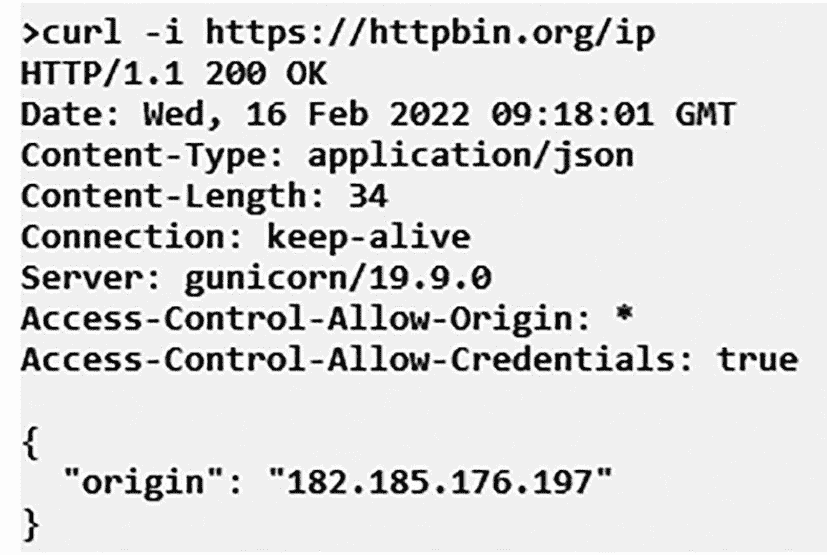
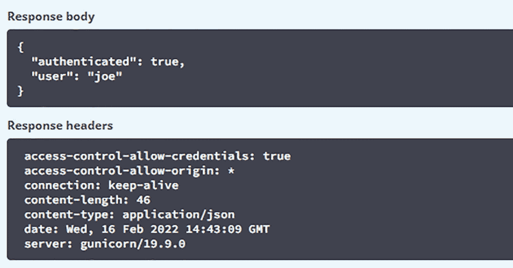
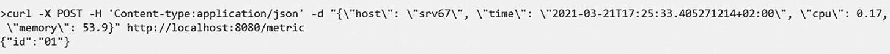
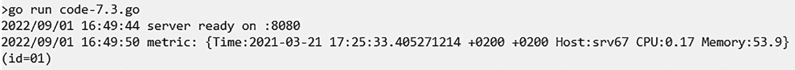
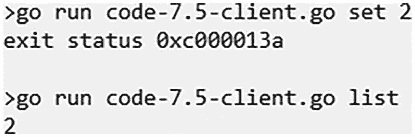

# 7. HTTP

现在您已经掌握了 Go 编程语言的基础知识，是时候付诸实践了！最简单的方式是通过 Web 应用程序编程接口（API）来实现。API 是一组用于在两个程序之间进行通信的规范。API 利用 Web 技术，尤其是超文本传输协议（HTTP），在客户端和服务器之间交换信息。Go 为 HTTP 提供了广泛的支持。本章包含了使用 `net/http` 包的 Go 实践方案，该包包含了 HTTP 客户端和服务器的实现。


好的，作为一名高级文档工程师和翻译员，我将严格遵循您的注意事项和示例格式，将给定的英文文本翻译成中文。


## Go 与 HTTP 调用

本章通过一个示例来探讨如何在 Go 中执行 HTTP 调用。假设您想将应用程序的一些指标（包括时间戳、CPU 负载和内存）发布到服务器。在深入讲解实现此目标的 Go 代码之前，我们先来看一下 HTTP 响应是什么样子。最简单的方法是使用命令提示符中的 `curl` 命令后跟一个 URL，如图 7-1 所示。



HTTP 响应的结构。它包含 `curl` 命令、`Date`、`Content-Type`、`Content-Length`、`Connection`、`Server` 和 `Origin`。来源是 “182.185.176.197”。

**图 7-1** HTTP 响应的结构

针对 `curl` 命令的 HTTP 响应包含信息。第一行是状态行，指示服务器运行的 HTTP 协议、状态代码以及可选的状态说明。接下来是一系列标头，例如 `Date`、`Content-Type` 等。响应的正文包含在花括号 `{}` 中。

HTTP 请求看起来相同，只是第一行不同。在第一行中，您有 `GET /path`，然后是协议。例如，`GET /ip HTTP/1.1 HOST:httpbin.org`，然后是标头、空行和请求正文。您将使用 `httpbin.org` 来模拟向服务器发送请求和接收响应。

现在您了解了 HTTP 请求和响应的样子，让我们深入了解本示例中关于将应用程序指标发布到服务器的具体方案。

在清单 7-1 中，`postMetric()` 函数接收一个 `Metric` 类型变量作为输入，并返回任何错误。在函数中，您使用 `json.Marshal()` 将 `metric` 编组为 `byte` 切片。然后，您创建一个名为 `ctx` 的 `Context` 变量来为请求设置超时时间。在此示例中，我们设置了 3 秒的超时时间，并推迟了请求的 `cancel()`。一个常量存储了您要为其生成 HTTP 请求的网站的 URL。内置的 `NewRequestWithContext()` 函数创建一个带有上下文的新 HTTP 请求。`NewRequestWithContext()` 函数接受四个参数：`context`、`method`（本例中为 `POST`）、`URL` 和 `request body`。请注意，正文必须是 `io.Reader`。这就是为什么您将数据包装在 `bytes.NewReader()` 函数中。

在数据之上，您将 `Content-Type` 的标头设置为 `application/JSON`。`http.DefaultClient.Do()` 函数调用服务器并检查是否返回任何错误。除了错误之外，您还检查请求的 `StatusCode` 以确保其状态为 `OK`。通过验证后，您可以解析 HTTP 响应。`defer` 关键字确保在函数退出时关闭响应的正文。您永远不应盲目地从网络读取所有内容，因此您应该定义一个最大大小，本例中为 1MB。然后，您在正文上使用 `io.LimitReader()` 来确保只读取定义的大小。您定义了一个名为 `reply` 的匿名结构来存储 `JSON` 回复，即 `metric`。在 Go 中，匿名结构是没有名称的结构。它们对于创建一次性使用的结构很有用。为了解码回复，使用了 `json.NewDecoder()`。最后，您记录回复。

```
package main

import (
    "bytes"
    "context"
    "encoding/json"
    "fmt"
    "io"
    "log"
    "net/http"
    "time"
)

// Metric 是一个应用程序指标
type Metric struct {
    Time   time.Time `json:"time"`
    CPU    float64   `json:"cpu"`    // CPU 负载
    Memory float64   `json:"memory"` // MB
}

func postMetric(m Metric) error {
    data, err := json.Marshal(m)
    if err != nil {
        return err
    }

    ctx, cancel := context.WithTimeout(context.Background(), 3*time.Second)
    defer cancel()

    const url = "https://httpbin.org/post"
    req, err := http.NewRequestWithContext(ctx, "POST", url, bytes.NewReader(data))
    if err != nil {
        return err
    }

    req.Header.Set("Content-Type", "application/json")

    resp, err := http.DefaultClient.Do(req)
    if err != nil {
        return err
    }
    if resp.StatusCode != http.StatusOK {
        return fmt.Errorf("错误状态: %d %s", resp.StatusCode, resp.Status)
    }
    defer resp.Body.Close()

    const maxSize = 1 << 20 // 1 MB
    r := io.LimitReader(resp.Body, maxSize)

    var reply struct {
        JSON Metric
    }
    if err := json.NewDecoder(r).Decode(&reply); err != nil {
        return err
    }

    log.Printf("收到回复: %+v\n", reply.JSON)
    return nil
}

func main() {
    m := Metric{
        Time:   time.Now(),
        CPU:    0.23,
        Memory: 87.32,
    }
    if err := postMetric(m); err != nil {
        log.Fatal(err)
    }
}
```

**清单 7-1** 在 Go 中处理 HTTP 调用的 Go 方案

**输出：**

```
2022/02/16 17:14:31 收到回复: {Time:2022-02-16 17:14:29.9096948 +0500 PKT CPU:0.23 Memory:87.32}
```


## 在 Go 语言中编写 HTTP 服务器与身份验证

某些网站要求在 HTTP 协议中进行身份验证。身份验证有多种方法，例如 Basic、Bearer、Digest 等。同时也有多种认证格式，例如 Auth2、SAML、OICD 等。Go 语言支持 Basic 身份验证；对于其他认证方式，如 `Auth0`，你需要获取一个令牌，然后必须设置 HTTP 授权标头。

在清单 7-2 所示的 Go 示例中，你将使用 `httpbin.org` 网站来演示 Basic 身份验证。`authRequest()` 函数将 URL、用户名和密码作为输入。然后使用这些参数通过 `http.NewRequest()` 函数创建一个新的 HTTP 请求。由于这是一个 `GET` 请求，因此你将 `nil` 作为请求体传入。内置函数 `SetBasicAuth()` 使用提供给函数的用户名和密码设置基本身份验证。要调用服务器，请使用 `http.DefaultClient.Do()` 函数。然后执行验证，检查返回的响应是否具有 `OK` 状态。

```go
package main
import (
"fmt"
"log"
"net/http"
)
func authRequest(user, url, passwd string) error {
req, err := http.NewRequest("GET", url, nil)
if err != nil {
return err
}
req.SetBasicAuth(user, passwd)
resp, err := http.DefaultClient.Do(req)
if err != nil {
return err
}
if resp.StatusCode != http.StatusOK {
return fmt.Errorf("bad status: %d %s", resp.StatusCode, resp.Status)
}
return nil
}
func main() {
user, passwd := "joe", "baz00ka"
url := fmt.Sprintf("https://httpbin.org/basic-auth/%s/%s", user, passwd)
if err := authRequest(user, url, passwd); err != nil {
log.Fatal(err)
}
fmt.Println("OK")
}
```

*输出：*

```go
OK
```

如果你使用 `httpbin.org` 网站生成 HTTP 请求和响应，你将得到如图 7-2 所示的结果。



HTTP 响应的结构包括响应体和响应标头。响应体包含经过身份验证的用户。响应标头包含日期、内容类型和长度、连接及服务器信息。

**图 7-2** 使用 `httpbin.org` 时的 HTTP 响应结构

让我们再看另一个示例，如清单 7-3 所示，这次是一个接收指标的 HTTP 服务器。在这里，指标是一个 JSON 对象，包含主机时间、CPU 和内存。在这个 Go 示例中，你定义了一个名为 `Metric` 的结构体，以匹配 JSON 对象中的定义，即该结构体包含名为 `time`、`host`、`CPU` 和 `memory` 的成员字段。`handleMetrics()` 函数负责处理 HTTP 请求。它接收输入变量 `w`（类型为 `http.ResponseWriter`，用于将响应发送回客户端）和 `r`（类型为 `http.Request`）。在该函数内部，你首先检查请求是否为 `POST` 请求。如果不是，则返回一个错误。为了限制要读取的数据量，你设置了一个最大大小 `maxSize`，以兆字节为单位；本例中为 1MB。你将指标添加到数据库，并打印输出指标已添加。为了将响应发送回用户，你首先设置响应的 `Header`。现在创建一个响应，本例中是一个从字符串到空接口的映射，包含从服务器获得的 `id`。你使用 `json.NewEncoder` 将响应编码到 `W` 中，如果出现错误则发送回客户端。你无法更改 `HTTP 状态码`，因此只记录错误。

```go
package main
import (
"encoding/json"
"gorilla/mux"
"io"
"log"
"net/http"
"time"
)
// DB 是一个数据库
type DataBase struct{}
// Add 向数据库添加一个指标
func (db *DataBase) Add(m Metric) string {
return "success"
}
type Metric struct {
Time   time.Time `json:"time"`
Host   string    `json:"host"`
CPU    float64   `json:"cpu"`    //CPU 负载
Memory float64   `json:"memory"` //MB
}
func handleMetric(w http.ResponseWriter, r *http.Request) {
if r.Method != "POST" {
http.Error(w, "This Method is Not Allowed", http.StatusMethodNotAllowed)
return
}
var db *DataBase
defer r.Body.Close()
var m Metric
const maxSize = 1 << 20 //MB
dec := json.NewDecoder(io.LimitReader(r.Body, maxSize))
if err := dec.Decode(&m); err != nil {
log.Printf("Error Decoding: %s", err)
http.Error(w, err.Error(), http.StatusBadRequest)
return
}
id := db.Add(m)
log.Printf("metric: %+v (id=%s)", m, id)
w.Header().Set("Content-Type", "application/json")
resp := map[string]interface{}{
"id": id,
}
if err := json.NewEncoder(w).Encode(resp); err != nil {
log.Printf("error reply: %s", err)
}
}
func main() {
r := mux.NewRouter()
r.HandleFunc("/metrics.json", handleMetric).Methods("POST")
http.Handle("/", r)
if err := http.ListenAndServe(":8080", nil); err != nil {
log.Fatal(err)
}
}
```

**输出：**

1. 在源代码所在文件夹中打开一个终端，并使用 `go run filename.go` 命令运行该文件。

2. 打开另一个终端并运行以下命令，将指标发送到服务器：

   

   代码显示了一个 `curl` 命令。

3. 成功后，你将在运行服务器的第一个终端上看到以下输出：

   

   代码展示了一个 `go run` 的输出。


## 使用 `gorilla/mux` 实现 REST

`net/http` 包内置的 `HTTP` 服务器功能强大，但也非常简单。有时仅使用内置 HTTP 服务器就能满足需求；然而，为项目添加外部依赖的风险比你想象的更大。建议阅读 [`https://research.swtch.com/deps`](https://research.swtch.com/deps) 上的研究论文，这是一篇关于软件依赖问题的推荐读物。它解释了为什么依赖存在风险，以及为何应尽可能避免使用依赖。尽管 `net/http` 包提供了多项功能来完成与 HTTP 协议相关的不同任务，但在某些情况下（尤其是编写复杂 API 时），拥有功能更丰富的 `routers` 会非常方便。`net/http` 包在处理复杂的请求路由（例如将请求 URL 拆分为单个参数）时表现欠佳。`gorilla/mux` 包在这种情况下就能派上用场，因为它能够创建带有命名参数、域名限制和 `GET/POST` 处理器的路由。

`gorilla/mux` 包包含请求路由器和分发器的实现，可用于将传入请求匹配到各自对应的处理器。这里的 `mux` 是 `HTTP 请求多路复用器` 的缩写。`gorilla/mux` 包中的 `mux.Router` 能够将任何传入请求与已注册的路由列表进行匹配，然后根据匹配的 URL 或其他条件，调用相应路由对应的处理器函数。本节包含一个基于使用 `mux 路由器` 的示例。

假设你经营一家书店，用户正在请求一本图书。作为响应，用户会收到包含书名、作者和 ISBN 的图书信息。用户发起请求时，会使用 `/books/author/ISBN` 的格式。首先，你需要定义一个名为 `Book` 的结构体，用于存储图书信息。处理器函数 `handleGetBook()` 接收一个 `ResponseWriter` 和 `request` 作为参数。`gorilla/mux` 包中的 `mux.Vars(r)` 函数，以 `http.Request` 对象作为输入参数，并返回一个包含路径段落的 `map`。通过对请求使用 `mux.Vars()` 提取变量，并从路径中获取 `ISBN`，然后 `getBook()` 函数从数据库中获取图书信息。如果数据库中不存在该图书，则记录日志并向客户端返回错误信息。如果图书存在，你可以将 `content-type` 设置为 `application/json`，并使用 `json.Encoder` 将数据编码后返回给客户端。

```
package main
import (
"encoding/json"
"fmt"
"log"
"net/http"
"github.com/gorilla/mux"
)
//Book 存储图书信息
type Book struct {
Title  string `json:"title"`
Author string `json:"author"`
ISBN   string `json:"isbn"`
}
// isbn -> book
var booksDB = map[string]Book{
"0062225677": {
Title:  "The Colour of Magic",
Author: "Terry Pratchett",
ISBN:   "0062225677",
},
"0765394855": {
Title:  "Old Mans War",
Author: "John Scalzi",
ISBN:   "0765394855",
},
}
func getBook(isbn string) (Book, error) {
book, ok := booksDB[isbn]
if !ok {
return Book{}, fmt.Errorf("未知的 ISBN: %q", isbn)
}
return book, nil
}
func handleGetBook(w http.ResponseWriter, r *http.Request) {
vars := mux.Vars(r)
isbn := vars["isbn"]
book, err := getBook(isbn)
if err != nil {
log.Printf("错误 - 获取: 未知的 ISBN - %q", isbn)
http.Error(w, err.Error(), http.StatusNotFound)
return
}
w.Header().Set("Content-Type", "application/json")
if err := json.NewEncoder(w).Encode(book); err != nil {
log.Printf("错误 - json: %s", err)
}
fmt.Println(w.Write(book))
}
func main() {
r := mux.NewRouter()
r.HandleFunc("/books/{isbn}", handleGetBook).Methods("GET")
http.Handle("/", r)
if err := http.ListenAndServe(":8080", nil); err != nil {
log.Fatal(err)
}
}
清单 7-4
使用 gorilla/mux 包的 Go REST 示例
```

**输出:**

1.  打开终端，使用 `go run` 命令运行包含此清单的文件。例如，如果你的文件名为 `code-7.4.go`，则运行 `go run code-7.4.go`。

2.  打开另一个终端，运行以下命令从服务器获取图书详细信息：


一个代码示例展示了 `curl localhost`。

请注意，为了成功运行代码片段，如果遇到与导入包相关的错误，请打开终端并运行以下命令：

- `cd [你的源代码目录]`
- `go mod init`
- `go get github.com/gorilla/mux`

之后，重启你的 IDE。如需更多信息，请运行 `go help mod`。

### 动手挑战

此挑战要求你在 HTTP 数据库及其客户端的内存中编写键值对。为此，支持的功能列表包括：

- `Get()` 从内存中获取键值
- `Set()` 将从标准输入接收的数据设置为键值
- `List()` 列出所有已存储的键

你需要为客户端和服务端分别实现代码。

对于客户端，你应该使用 `flag` 包执行命令行参数解析。同时，使用 `switch` 语句根据接收到的输入执行相应的功能。对于服务端代码，请使用 `gorilla/mux` 包；`db` 变量数据库将是一个内存中的 `map`。同时，使用 `sync.RWMutex` 类型的 `dbLock` 来保护数据库免受死锁影响。你还需要为 `Get`、`Set` 和 `List` 键请求编写处理器函数。为了执行服务端代码的路由，你必须在 `main()` 中创建一个路由器，并使用 `http.Handle()` 处理路由。


### 解决方案

代码清单 7-5 和 7-6 展示了本动手挑战的一种可行解法。下面我们来探讨代码中的重点部分。

```
package main

import (
	"encoding/json"
	"flag"
	"fmt"
	"io"
	"io/ioutil"
	"log"
	"net/http"
	"os"
	"sync"

	"github.com/gorilla/mux"
)

var (
	db     = make(map[string][]byte)
	dbLock sync.RWMutex
)

const maxSize = 1 << 20 //MB

//客户端侧
const apiBase = "http://localhost:8080/kv"

func list() error {
	resp, err := http.Get(apiBase)
	if err != nil {
		return err
	}
	if resp.StatusCode != http.StatusOK {
		return fmt.Errorf("bad status: %d %s", resp.StatusCode, resp.Status)
	}
	defer resp.Body.Close()
	var keys []string
	if json.NewDecoder(resp.Body).Decode(&keys); err != nil {
		return err
	}
	for _, key := range keys {
		fmt.Println(key)
	}
	return nil
}

func set(key string) error {
	url := fmt.Sprintf("%s/%s", apiBase, key)
	resp, err := http.Post(url, "application/octet-stream", os.Stdin)
	if err != nil {
		return err
	}
	if resp.StatusCode != http.StatusOK {
		return fmt.Errorf("Bad Status: %d %s", resp.StatusCode, resp.Status)
	}
	var reply struct {
		Key  string
		Size int
	}
	defer resp.Body.Close()
	if err := json.NewDecoder(resp.Body).Decode(&reply); err != nil {
		return err
	}
	fmt.Printf("%s: %d bytes\n", reply.Key, reply.Size)
	return nil
}

func get(key string) error {
	url := fmt.Sprintf("%s/%s", apiBase, key)
	resp, err := http.Get(url)
	if err != nil {
		return err
	}
	if resp.StatusCode != http.StatusOK {
		return fmt.Errorf("Bad Status: %d %s", resp.StatusCode, resp.Status)
	}
	_, err = io.Copy(os.Stdout, resp.Body)
	return err
}

//服务端侧
func handleSet(w http.ResponseWriter, r *http.Request) {
	vars := mux.Vars(r)
	key := vars["key"]
	defer r.Body.Close()
	rdr := io.LimitReader(r.Body, maxSize)
	data, err := ioutil.ReadAll(rdr)
	if err != nil {
		log.Printf("read error: %s", err)
		http.Error(w, err.Error(), http.StatusBadRequest)
		return
	}
	dbLock.Lock()
	defer dbLock.Unlock()
	db[key] = data
	resp := map[string]interface{}{
		"key":  key,
		"size": len(data),
	}
	w.Header().Set("Content-Type", "application/json")
	if err := json.NewEncoder(w).Encode(resp); err != nil {
		log.Printf("error sending: %s", err)
	}
}

func handleGet(w http.ResponseWriter, r *http.Request) {
	vars := mux.Vars(r)
	key := vars["key"]
	dbLock.RLock()
	defer dbLock.RUnlock()
	data, ok := db[key]
	if !ok {
		log.Printf("error get - unknown key: %q", key)
		http.Error(w, fmt.Sprintf("%q not found", key), http.StatusNotFound)
		return
	}
	if _, err := w.Write(data); err != nil {
		log.Printf("error sending: %s", err)
	}
}

func handleList(w http.ResponseWriter, r *http.Request) {
	dbLock.RLock()
	defer dbLock.RUnlock()
	keys := make([]string, 0, len(db))
	for key := range db {
		keys = append(keys, key)
	}
	w.Header().Set("Content-Type", "application/json")
	if err := json.NewEncoder(w).Encode(keys); err != nil {
		log.Printf("error sending: %s", err)
	}
}

func main() {
	flag.Usage = func() {
		fmt.Fprintf(os.Stderr, "usage: kv get|set|list [key]")
		flag.PrintDefaults()
	}
	flag.Parse()
	if flag.NArg() == 0 {
		log.Fatalf("error: wrong  number of arguments")
	}
	switch flag.Arg(0) {
	case "get":
		key := flag.Arg(1)
		if key == "" {
			log.Fatal("error: missing key")
		}
		if err := get(key); err != nil {
			log.Fatal(err)
		}
	case "set":
		key := flag.Arg(1)
		if key == "" {
			log.Fatal("error: missing key")
		}
		if err := set(key); err != nil {
			log.Fatal(err)
		}
	case "list":
		key := flag.Arg(1)
		if key == "" {
			log.Fatal("error: missing key")
		}
		if err := list(); err != nil {
			log.Fatal(err)
		}
	default:
		log.Fatal("error: unknown command: %q", flag.Arg(0))
	}
	r := mux.NewRouter()
	r.HandleFunc("/kv/{key}", handleSet).Methods("POST")
	r.HandleFunc("/kv/{key}", handleGet).Methods("GET")
	r.HandleFunc("/kv", handleList).Methods("GET")
	http.Handle("/", r)
	addr := ":8080"
	log.Printf("Server Ready On %s", addr)
	if err := http.ListenAndServe(addr, nil); err != nil {
		log.Fatal(err)
	}
}
清单 7-5
动手挑战的服务端代码
```

如代码清单 7-5 所示，在`handleSet()`函数中，首先从`vars`中获取键，并延迟关闭响应体。然后使用`LimitReader`来限制写入的数据量。通过`ioutil.ReadAll()`读取数据直到达到限制。如果出现错误，则记录日志。使用内置的`Lock()`函数锁定数据库，并延迟解锁直到函数退出。通过`db[key] = data`设置键。响应随后存储在`resp`变量中，其中包含键以及发送数据的大小。设置`content-type`头为`application-json`。

`handleGet()`函数也类似。当使用`Lock()`函数锁定资源时，通过获取锁，同一时间只有一个 goroutine 可以进行读/写操作。而使用`RLock()`时，通过获取锁，同一时间可以有多个 goroutine 进行读操作（但不能写）。在此处理程序中，通过`comma,ok`惯用法检查数据库中是否存在指定的键。

在`handleList()`函数中，首先获取数据库的锁。然后创建一个用于存放键名的切片，遍历数据库（即映射），追加键，并将它们以 JSON 格式写出。

```
package main

import (
	"encoding/json"
	"flag"
	"fmt"
	"io"
	"log"
	"net/http"
	"os"
)

const apiBase = "http://localhost:8080/kv"

func list() error {
	resp, err := http.Get(apiBase)
	if err != nil {
		return err
	}
	if resp.StatusCode != http.StatusOK {
		return fmt.Errorf("bad status: %d %s", resp.StatusCode, resp.Status)
	}
	defer resp.Body.Close()
	var keys []string
	if json.NewDecoder(resp.Body).Decode(&keys); err != nil {
		return err
	}
	for _, key := range keys {
		fmt.Println(key)
	}
	return nil
}

func set(key string) error {
	url := fmt.Sprintf("%s/%s", apiBase, key)
	resp, err := http.Post(url, "application/octet-stream", os.Stdin)
	if err != nil {
		return err
	}
	if resp.StatusCode != http.StatusOK {
		return fmt.Errorf("bad status: %d %s", resp.StatusCode, resp.Status)
	}
	var reply struct {
		Key  string
		Size int
	}
	defer resp.Body.Close()
	if err := json.NewDecoder(resp.Body).Decode(&reply); err != nil {
		return err
	}
	fmt.Printf("%s: %d bytes\n", reply.Key, reply.Size)
	return nil
}

func get(key string) error {
	url := fmt.Sprintf("%s/%s", apiBase, key)
	resp, err := http.Get(url)
	if err != nil {
		return err
	}
	if resp.StatusCode != http.StatusOK {
		return fmt.Errorf("bad status: %d %s", resp.StatusCode, resp.Status)
	}
	_, err = io.Copy(os.Stdout, resp.Body)
	return err
}

func main() {
	flag.Usage = func() {
		fmt.Fprintf(os.Stderr, "usage: kv get|set|list [key]")
		flag.PrintDefaults()
	}
	flag.Parse()
	if flag.NArg() == 0 {
		log.Fatalf("error: wrong number of arguments")
	}
	switch flag.Arg(0) {
	case "get":
		key := flag.Arg(1)
		if key == "" {
			log.Fatalf("error: missing key")
		}
		if err := get(key); err != nil {
			log.Fatal(err)
		}
	case "set":
		key := flag.Arg(1)
		if key == "" {
			log.Fatalf("error: missing key")
		}
		if err := set(key); err != nil {
			log.Fatal(err)
		}
	case "list":
		if err := list(); err != nil {
			log.Fatal(err)
		}
	default:
		log.Fatalf("error: unknown command: %q", flag.Arg(0))
	}
}
清单 7-6
动手挑战的客户端代码
```

代码清单 7-6 定义了一个保存`apiBase`的常量。它还定义了`list()`、`set()`和`get()`函数。`list()`函数读取键并逐个打印。`set()`函数设置值。`get()`函数从数据库中检索特定键。

在`main()`中，创建一个新的路由器并配置路由。这里，`Get`和`Set`函数在路径中通过`vars`包含`key`，而`List`的路由仅是`/kv`。

**输出：**


一段说明 `go run code-7.5` 的代码。

图 7-3
运行动手解决方案的输出


## 格式化结果

1. 打开终端，使用 `go run filename.go` 命令运行服务端代码。例如，如果你的文件名是 `code-7.5-server.go`，则应执行 `go run code-7.5-server.go`。

2. 打开另一个终端并运行以下命令。请记住，发送请求后至少等待一分钟。发送 `set` 请求并等待一分钟后，按 `Ctrl+C`。然后发送 `list` 请求以确认你的键值已设置，如图 7-3 所示。

## 总结

本章提供了 Go 语言的相关实例，帮助你实践在 Go 中处理 HTTP 调用。Go 提供了名为 `net/http` 的内置包用于处理 HTTP 调用。本章包含的实例涉及如何使用 `net/http` 包发送和接收 HTTP 请求与响应、进行身份验证、构建 HTTP 服务器，以及如何使用 `gorilla/mux` 包处理 REST 请求。

Go 语言有别于其他语言的一个杀手级特性是其对并发的内置支持。这种内置支持使 Go 成为编程多种类型应用时的最佳选择。下一章将解释如何使用 Go 编程语言构建并发程序。

