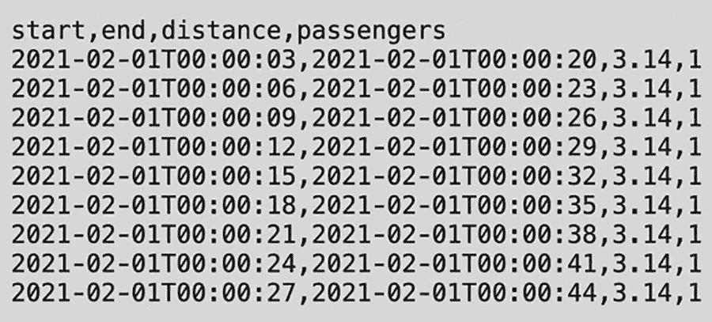

# 8. 并发

在模块化编程中，大型程序通常由若干较小的子程序组成。例如，一个 Web 服务器会同时处理来自多个浏览器的请求，并向它们提供 HTML 网页。每个请求都被视为一个小的程序。在大型程序中同时运行并推进多个较小组件的能力被称为*并发*。并发编程通常需要使用不同的结构，如线程和锁，来执行复杂的同步和死锁预防任务。

Go 为并发提供了丰富的支持。Go 程序可以包含多个同时运行的独立任务，这些任务各司其职，同时相互通信以实现共同目标。在 Go 编程语言中，独立运行的任务被称为*goroutine*。使用 goroutine 能使你的程序响应更迅速。与其他编程语言（如 Java）相比，goroutine 可以被视为轻量级线程。本章包含了覆盖 Go 语言最强大特性——并发的 Go 实例。它还解释了 goroutine 的基础知识、如何同步 goroutine 以及如何在 goroutine 之间安全地共享资源。

## 理解 Goroutines

在 Go 中，goroutine 和 channel 被用于实现并发。goroutine 是能够与 Go 程序中可能存在的任何其他 goroutine 同时且独立执行的最小实体。简而言之，在 Go 中每个并发运行的任务都被称为 *goroutine*。Channel 用于以高效且并发的方式从 goroutine 获取数据。Channel 还为 goroutine 提供了参考点，并帮助不同的 goroutine 进行通信。

可以将 goroutine 视为轻量级线程。然而，创建 goroutine 的成本远低于线程。此外，每个 Go 程序至少包含一个 goroutine，即 *主 goroutine*，它负责执行程序。程序启动的所有 goroutine 都在主 goroutine 下工作。因此，当主 goroutine 终止时，关联 Go 程序中存在的 goroutine 也会终止。此外，goroutine 总是在后台运行。

与使用线程进行多任务处理的其他高级编程语言相比，goroutine 有几个优点。复杂性和脆弱性是使用线程实现高并发的一些最大缺点。此外，线程还可能导致隐藏的死锁和竞态条件，其起因几乎无法找到。以下是 goroutine 相对于线程的一些主要优势：

- **资源方面极其廉价：** Goroutine 在栈上仅需几 KB 的空间。此外，与栈大小固定的线程不同，goroutine 的栈可以根据应用程序的需求增长或收缩。

- **多路复用所需的 OS 线程更少：** Goroutine 进行多路复用所需的 OS 线程数量更少。一个程序可以只存在一个线程，而其中运行着多个 goroutine。如果线程中的某个 goroutine 进入阻塞状态（例如，等待用户输入），则会衍生出一个新的 OS 线程，并将剩余的 goroutine 移动到该线程。所有这些细节都由 Go 运行时处理，并通过 API 对程序员进行抽象。

- **用于通信的通道：** Channel 用于在不同的 goroutine 之间进行通信。Channel 旨在防止 goroutine 访问共享内存时出现竞态条件。可以将 Channel 视为 goroutine 用于通信的管道。

### 将顺序代码转换为并发代码

在开始编写并发代码之前，先从编写顺序代码开始。顺序代码更简单，更容易理解和维护。只有在需要额外性能时，才转向并发代码。

假设你有一个 Web 服务器，它每天返回一个包含出租车行程信息的 CSV 文件。CSV 文件包含如图 8-1 所示的数据。它包含行程开始时间、行程结束时间、行驶距离和乘客人数等信息。你想计算整个月的行驶距离，因此需要每天调用 API。



*图 8-1* – 出租车行程 CSV 文件中的数据格式

**HTTP 服务器代码**

清单 8-1 展示了运行此示例的 HTTP 服务器的 Go 实例。

```go
package main
import (
"encoding/csv"
"fmt"
"io"
"log"
"net/http"
"strconv"
"time"
)
func dayDistance(r io.Reader) (float64, error) {
rdr := csv.NewReader(r)
total, lNum := 0.0, 0
for {
//2021-01-02T23:58:36,2021-01-02T23:58:40,3.41,1
fields, err := rdr.Read()
if err == io.EOF {
break
}
if err != nil {
return 0, err
}
lNum++
if lNum == 1 {
continue // 跳过标题行
}
dist, err := strconv.ParseFloat(fields[2], 64)
if err != nil {
return 0, err
}
total += dist
}
return total, nil
}
func monthDistance(month time.Time) (float64, error) {
totalDistance := 0.0
date := month
for date.Month() == month.Month() {
url := fmt.Sprintf("http://localhost:8080/%s", date.Format("2006-01-02"))
resp, err := http.Get(url)
if err != nil {
return 0, err
}
if resp.StatusCode != http.StatusOK {
return 0, fmt.Errorf("bad status: %d %s", resp.Request.Response.StatusCode, resp.Status)
}
defer resp.Body.Close()
dist, err := dayDistance(resp.Body)
if err != nil {
return 0, err
}
totalDistance += dist
date = date.Add(24 * time.Hour)
}
return totalDistance, nil
}
func main() {
month := time.Date(2021, 2, 1, 0, 0, 0, 0, time.UTC)
start := time.Now()
dist, err := monthDistance(month)
if err != nil {
log.Fatal(err)
}
duration := time.Since(start)
fmt.Printf("distance=%.2f, duration=%v\n", dist, duration)
}
```

**顺序代码**

让我们从顺序代码开始，如清单 8-2 所示。


```go
package main

import (
	"encoding/csv"
	"fmt"
	"io"
	"log"
	"net/http"
	"strconv"
	"time"
)

func dayDistance(r io.Reader) (float64, error) {
	rdr := csv.NewReader(r)
	total, lNum := 0.0, 0
	for {
		//2021-01-02T23:58:36,2021-01-02T23:58:40,3.41,1
		fields, err := rdr.Read()
		if err == io.EOF {
			break
		}
		if err != nil {
			return 0, err
		}
		lNum++
		if lNum == 1 {
			continue // 跳过表头
		}
		dist, err := strconv.ParseFloat(fields[2], 64)
		if err != nil {
			return 0, err
		}
		total += dist
	}
	return total, nil
}

type result struct {
	date time.Time
	dist float64
	err  error
}

func dateWorker(date time.Time, ch chan<- result) {
	res := result{date: date}
	defer func() {
		ch <- res
	}()
	url := fmt.Sprintf("http://localhost:8080/%s", date.Format("2006-01-02"))
	resp, err := http.Get(url)
	if err != nil {
		res.err = err
		return
	}
	if resp.StatusCode != http.StatusOK {
		res.err = fmt.Errorf("错误状态码: %d %s", resp.Request.Response.StatusCode, resp.Status)
		return
	}
	defer resp.Body.Close()
	res.dist, res.err = dayDistance(resp.Body)
}

func monthDistance(month time.Time) (float64, error) {
	numWorkers, ch := 0, make(chan result)
	date := month
	for date.Month() == month.Month() {
		go dateWorker(date, ch)
		numWorkers++
		date = date.Add(24 * time.Hour)
	}
	totalDistance := 0.0
	for i := 0; i < numWorkers; i++ {
		res := <-ch
		if res.err != nil {
			return 0, res.err
		}
		totalDistance += res.dist
	}
	return totalDistance, nil
}

func main() {
	month := time.Date(2021, 2, 1, 0, 0, 0, 0, time.UTC)
	start := time.Now()
	dist, err := monthDistance(month)
	if err != nil {
		log.Fatal(err)
	}
	duration := time.Since(start)
	fmt.Printf("distance=%.2f, duration=%v\n", dist, duration)
}
```

**清单 8-2** 未使用 Goroutine 的顺序代码

**输出:**

```
distance=2532096.00, duration=1.7266259s
```

在清单 8-2 中，`monthDistance()`函数计算并返回指定月份（作为函数输入参数）的总骑行距离。在该函数内部，使用`for`循环遍历同月的每一天，并构建当天的 URL。然后，使用`http.Get()`函数生成请求以获取数据。此外，还执行了一些错误检查，以判断收到的响应是否正常。如果一切正常，则计算`totalDistance`并进入下一天。`for`循环会持续进行，直到月末。

清单 8-2 中的代码非常简单，大约在两秒内完成。但是，如果两秒不够快，你可以修改代码使其并发执行。让我们将这个顺序执行的代码转换为并发版本，如清单 8-2 所示。为了实现并发，我们计划每天运行一个`goroutine`。这是通过将顺序算法拆分为两部分来实现的：第一部分是生成工作或启动工作者（worker）；第二部分是收集结果。

```go
package main

import (
	"fmt"
	"log"
	"net/http"
	"time"
)

const timeFmt = "2006-01-02T15:04:05"

func handler(w http.ResponseWriter, r *http.Request) {
	s := r.URL.Path[1:] // 去掉前导斜杠 /
	day, err := time.Parse("2006-01-02", s)
	if err != nil {
		msg := fmt.Sprintf("错误日期格式: %q", s)
		log.Printf("error: %s", msg)
		http.Error(w, msg, http.StatusBadRequest)
		return
	}
	fmt.Fprintf(w, "start,end,distance,passengers\n")
	start := day
	nextDay := day.Add(24 * time.Hour)
	for start.Before(nextDay) {
		start = start.Add(3 * time.Second)
		end := start.Add(17 * time.Second)
		distance := 3.14
		passengers := 1
		fmt.Fprintf(w, "%s,%s,%.2f,%d\n", start.Format(timeFmt), end.Format(timeFmt), distance, passengers)
	}
}

func main() {
	http.HandleFunc("/", handler)
	if err := http.ListenAndServe(":8080", nil); err != nil {
		log.Fatal(err)
	}
}
```

**清单 8-3** 使用 Goroutine 的并发代码

**输出:**

```
distance=2532096.00, duration=1.0311312s
```

在`monthDistance()`函数内部，第一条语句用于启动工作者。你需要指定要创建的工作者数量以及一个用于获取结果的通道（channel）。关键字`chan`用于创建通道。对于每一天，你启动一个工作者，递增工作者计数，然后进入下一天。`dateWorker()`函数会返回一个结果，指示发生了什么。由于结果返回的顺序是不确定的，你需要在结果中返回尽可能多的信息。因此，与之前的顺序代码不同，现在你使用`result`结构体返回日期、距离以及任何错误。

`result{date: date}`语句使用指定的日期初始化一个结果。`defer`函数会将结果发送回通道。请注意，通道是一种类型化的管道，你可以通过通道操作符`<-`发送和接收值。然后，你创建 URL，检查错误，最后将日期和错误添加到结果中。

回到并发算法的第二部分，在`monthDistance()`函数中，你需要收集结果。首先，将总距离初始化为 0，并遍历所有工作者（数量）。然后，使用通道操作符（`<-`）从通道读取结果。如果出现任何错误，则返回错误；否则更新距离。最后，返回`totalDistance`。

运行这段并发代码后，你会注意到运行时间显著缩短；例如，从 1.7 秒降至 1 秒。这相当于性能提升了 58.8%。请注意，不同机器上的运行时间会有所不同。

## 使用带有共享资源的 Goroutines

尽管`goroutine`让你能够轻松执行并发操作，但在使用访问共享资源（如变量）的`goroutine`时必须非常小心。例如，两个不同的`goroutine`可能同时访问同一个变量，其中一个可能向该变量的值做加法，而另一个做减法。确保当一个`goroutine`正在修改变量时，另一个`goroutine`无法访问该变量，直到第一个`goroutine`完成修改，这一点至关重要。本节将涵盖当多个`goroutine`试图同时访问共享资源时出现的各种问题，并介绍用于解决这些问题的不同技术。


### 查看共享资源对协程的影响

为了查看共享资源对协程的影响，请参考清单 8-4 中的程序。在此示例程序中，有一个名为 `balanceAmount` 的全局变量，以及两个函数 `creditToBalance` 和 `debitFromBalance`，它们会同时作为协程被调用。`creditToBalance` 函数向 `balanceAmount` 加 1000，而 `debitFromBalance` 函数则从中减 1000。

```go
package main
import (
"fmt"
"math/rand"
"time"
)
var balanceAmount int
func creditToBalance() {
for i := 0; i < 5; i++ {
balanceAmount += 1000
time.Sleep(time.Duration(rand.Intn(100)) *
time.Millisecond)
fmt.Println("余额增加后： ", balanceAmount)
}
}
func debitFromBalance() {
for i := 0; i < 5; i++ {
balanceAmount -= 1000
time.Sleep(time.Duration(rand.Intn(100)) *
time.Millisecond)
fmt.Println("余额减少后： ", balanceAmount)
}
}
func main() {
balanceAmount = 3000
fmt.Println("初始余额： ", balanceAmount)
go creditToBalance()
go debitFromBalance()
fmt.Scanln()
}
清单 8-4
演示共享资源对协程影响的 Go 示例
```

**输出：**

```
初始余额：  3000
余额增加后：  3000
余额减少后：  3000
余额增加后：  3000
余额减少后：  4000
余额减少后：  3000
余额减少后：  2000
余额增加后：  1000
余额减少后：  2000
余额增加后：  2000
余额增加后：  3000
```

当你执行清单 8-4 时，你会发现输出结果并不符合预期，并且存在错误。第一个明显的错误出现在输出结果的第二行。仔细一看，你会发现第一行显示的初始余额是 3000，这是正确的。但第二行的余额本应是 4000，却显示了 3000，这是错误的。这是因为在 `creditToBalance()` 函数中，当 1000 被加到 `balanceAmount`（即更新为 4000）后，在将更新后的 `balanceAmount` 值显示到控制台之前，会有一段随机的时间延迟。这个延迟是由以下语句导致的：

```go
time.Sleep(time.Duration(rand.Intn(100))*time.Millisecond)
```

`debitFromBalance()` 函数利用这个延迟从 `balanceAmount` 中减去了 1000，将其值更新为 3000。当 `creditToBalance()` 恢复任务去打印 `balanceAmount` 中存储的值时，显示的便是 3000 而非 4000。尽管最后打印的 `balanceAmount` 值是 3000，但这个程序仍然不能被认为是安全的，因为执行过程中打印的值是错误的。此外，由于对同一资源的访问，`balanceAmount` 变量会进入不一致的状态。

### 使用互斥锁访问共享资源

如前所述，只要多个协程同时访问同一个共享资源，确保一次只有一个协程能访问该资源就至关重要。为了避免资源进入不一致状态和出现竞态条件，互斥（也称为 *mutex*）的概念便应运而生。

Go 语言通过 `sync` 包中的 `mutex` 类型来支持互斥。在 Go 中，`mutex` 提供了必要的锁机制，以确保不会发生竞态条件。它确保在任何时间点，只有一个协程在代码的临界区中运行。所谓临界区，是指代码中两个或多个协程不能同时执行的任何部分。当一个协程获得了互斥锁时，其他协程必须等待，直到该锁被释放才能访问共享资源。让我们修改上一小节的程序，通过使用 `mutex` 类型来演示互斥的概念。

清单 8-5 演示了如何使用 `mutex` 对象来封装代码的临界区。这确保当一个协程正在执行一个代码块时，没有其他代码块可以执行。

```go
package main
import (
"fmt"
"math/rand"
"sync"
"time"
)
var balanceAmount int
var mutex = &sync.Mutex{}
func creditToBalance() {
for i := 0; i < 5; i++ {
mutex.Lock()
balanceAmount += 1000
time.Sleep(time.Duration(rand.Intn(100)) * time.Millisecond)
fmt.Println("余额增加后： ", balanceAmount)
mutex.Unlock()
}
}
func debitFromBalance() {
for i := 0; i < 5; i++ {
mutex.Lock()
balanceAmount -= 1000
time.Sleep(time.Duration(rand.Intn(100)) * time.Millisecond)
fmt.Println("余额减少后： ", balanceAmount)
mutex.Unlock()
}
}
func main() {
balanceAmount = 3000
fmt.Println("初始余额： ", balanceAmount)
go creditToBalance()
go debitFromBalance()
fmt.Scanln()
}
清单 8-5
使用互斥锁访问共享资源的 Go 示例
```

**输出：**

```
初始余额：  3000
余额增加后：  4000
余额增加后：  5000
余额减少后：  4000
余额减少后：  3000
余额增加后：  4000
余额增加后：  5000
余额减少后：  4000
余额减少后：  3000
余额增加后：  4000
余额减少后：  3000
```

在这段代码中，`Lock()` 和 `Unlock()` 是内置函数，可以与 `mutex` 类型的对象一起使用，并标记程序临界区的开始和结束。当一个协程获取了 `mutex` 锁后，所有其他协程都被禁止执行任何受该 `mutex` 保护的代码。因此，它们被迫等待，直到该锁被释放。所以，这个程序的输出正如你所预期的那样。


### 使用原子计数器修改共享资源

除了使用 `mutex` 类型标记程序的临界区之外，Go 还提供了一些机制，使你能够以线程安全的方式修改共享变量。这些机制被称为*原子计数器*。原子计数器是一种例程，允许你一次在一个线程上对变量执行数学运算。Go 提供了 `sync/atomic` 包，其中包含不同的低级原子内存原语，在实现同步算法时非常有用。然而，需要非常小心才能确保这些函数被正确使用。除了一些特定的低级应用程序外，通常建议使用通道或 `sync` 包提供的功能来编写同步算法。

让我们看一个示例，学习如何在 Go 程序中使用 `atomic` 包。假设你托管了一个 Web 服务器，供多人上传文件。假设你想跟踪上传到服务器的数据量。为了完成这个任务，可以使用 `sync/atomic` 包。与 `sync.Mutex` 相比，`sync/atomic` 包含不同的低级原语，其在性能和使用上都更快。

如 8-6 所示，此程序首先声明了 `uint64` 类型的变量 `totalSize`。这用于存储总上传大小。注意，当使用 `sync/atomic` 包时，你必须非常明确类型的大小。不能使用通用类型，例如这里的 `int` 或 `uint`。在 `uploadHandler()` 处理函数内部，你推迟关闭响应对象主体的操作，然后读取数据，再发出错误信号。为了更新 `totalSize`，调用了 `atomic.AddUint64()`。它接受指向 `totalSize` 的指针作为输入，并将数据长度转换为 `uint64`。在此转换过程中不需要加锁，因为它非常快，并且由 `sync/atomic` 自动完成。在 `main()` 中，你设置处理函数，并使用 `http.ListenAndServe()` 启动一个具有给定地址和处理函数的 HTTP 服务器。如果你要暴露指标，请考虑使用 `expvar` 包。它不仅允许你自动递增计数器，还可以将它们暴露给 Web。

```
package main
import (
"fmt"
"io/ioutil"
"log"
"net/http"
"sync/atomic"
)
var totalSize uint64
func uploadHandler(w http.ResponseWriter, r *http.Request) {
defer r.Body.Close()
data, err := ioutil.ReadAll(r.Body)
if err != nil {
http.Error(w, err.Error(), http.StatusBadRequest)
return
}
size := atomic.AddUint64(&totalSize, uint64(len(data)))
//TODO: work with data
fmt.Fprintf(w, "size=%d\n", size)
}
func main() {
http.HandleFunc("/upload", uploadHandler)
if err := http.ListenAndServe(":8080", nil); err != nil {
log.Fatal(err)
}
}
```

**清单 8-6** 使用原子计数器修改共享资源的 Go 方案

## 同步协程

当多个协程同时运行时，同步这些协程以确保程序执行被协调非常重要。例如，程序中可能有两个协程负责从不同的 Web 服务获取数据，你必须确保这两个协程在执行下一个代码块之前都完成执行。在这种情况下，必须有一些机制来指示这些协程何时完成执行。

如果你查看 8-6 中的以下代码片段，你会注意到 `main()` 函数末尾的 `fmt.Scanln()` 语句。

```
func main() {
balanceAmount = 3000
fmt.Println("Initial balance: ", balanceAmount)
go creditToBalance()
go debitFromBalance()
fmt.Scanln()
}
```

如果将 `fmt.Scanln()` 语句从 8-6 中移除，那么在调用两个协程之后，`main()` 函数会立即退出，打印出的余额并非正确的最终结果，如图 8-2 所示。


一幅插图展示了代码，其显示了在代码末尾不添加 Scanln 的效果。代码显示为：dollar go run mutex-1.go，初始余额：3000。

**图 8-2** 不在代码末尾添加 `Scanln` 的效果

当多个协程同时运行，并且需要知道它们何时完成执行时，这被称为*等待组*，将在下一节中解释。


### `sync.WaitGroup` 与 `sync.Once`

基本的同步原语，例如互斥锁（mutex），由`sync`包提供。请注意，除了`Once`和`WaitGroup`之外，大多数同步原语类型都旨在供底层库例程使用。更高级别的同步则通过通信和通道来实现。

`Once`类型对象定义在`sync`包中，旨在确保某个操作**只执行一次**。另一方面，`WaitGroup`用于等待一组 goroutine 完成执行。内置的`Add()`函数用于设置需要等待的 goroutine 数量。属于某个等待组的每个 goroutine 都会调用`Done()`函数来表明它们已执行完毕。当等待组中的 goroutine 正在运行时，`Wait()`函数可用于阻塞，直到所有 goroutine 都执行完毕。请注意，`WaitGroup`和`Once`在首次使用后不应被复制。

让我们来看一个在 Go 程序中使用这两种类型的示例。假设你有一段代码，可以将服务器更新到应用程序的新版本。你不想逐个更新服务器，而是希望并发地更新所有服务器，并等待所有更新完成。代码清单 8-7 展示了`updateAll()`函数，它接收一个版本字符串，并通过通道获取主机列表。假设你事先不知道需要更新多少个主机。在函数内部，首先创建一个`WaitGroup`。然后，对于通道中的每个主机，递增`WaitGroup`中的计数器（即`waitgroup1`），并启动一个 goroutine，该 goroutine 将通过调用`waitgroup1.Done()`来递减计数器。接着，调用`update()`函数来运行更新服务器的代码。请记住，`defer`会在函数退出时被调用，因此会先调用对象，然后调用`defer`。`waitgroup1.Wait()`函数意味着你将一直等待，直到`WaitGroup`中定义的所有 goroutine 都执行完毕。

```
func updateAll(version string, hosts <-chan string) {
var waitgroup1 sync.WaitGroup
for host:=range hosts{
waitgroup1.Add(1)
go func(host, version string){
defer waitgroup1.Done()
update(host, version)
}(host, version)
}
waitgroup1.Wait()
}
代码清单 8-7
使用 WaitGroup 的 Go 方案
```

单个`WaitGroup`不会返回错误；如果你必须从 goroutine 中获取错误值，可以使用外部的`errGroup`包来克服这一限制。当多个 goroutine 组正在执行一个共同任务的子任务时，`errgroup`包会非常有用。它提供了诸如`Context`取消、错误传播和同步等功能。

让我们来看一个在 Go 程序中使用`errgroup`包的示例。假设你托管了一个系统，允许多个用户相互发送消息。有时他们需要计算与消息关联的数字签名，但这种情况非常罕见，因为计算可能很耗时，所以只需要计算一次。代码清单 8-8 展示了一个实现此目标的示例 Go 程序。

在代码清单 8-8 中，首先定义了一个名为`Message`的结构体，它包含三个成员字段：`Content`（`string`类型）、`once`（`sync.Once`类型变量）以及`sig`（`string`类型，用于缓存签名，初始为空）。

当调用`Signature()`函数时，它接收一个指向消息的指针作为输入，并返回该消息的数字签名。由于你只想计算一次签名，因此调用消息的成员字段，然后调用内置的`Do()`函数来调用`calcSig()`函数以计算签名。`m.once.Do(m.calcSig)`语句将只调用`calcSig()`函数一次。之后再调用它则不会执行任何操作。这个特性也被称为*幂等性*。在`calcSig()`函数中，使用`sha1.New()`函数创建一个新的哈希。接着，将内容复制到包含`sha1`哈希的变量中，最后将消息的`sig`字段设置为缓存的签名。会打印出`"Calculating Signature"`消息，然后打印签名。当你第二次调用时，只会看到输出结果。

```
package main
import (
"crypto/sha1"
"fmt"
"io"
"log"
"strings"
"sync"
)
type Message struct {
Content string
once sync.Once
sig  string //cached signature
}
//Signature returns the digital signature of the message
func (m *Message) Signature() string {
m.once.Do(m.calcSig)
return m.sig
}
func (m *Message) calcSig() {
log.Printf("Calculating signature")
h := sha1.New()
io.Copy(h, strings.NewReader(m.Content))
m.sig = fmt.Sprintf("%x", h.Sum(nil))
}
func main() {
m := Message{
Content: "There is nothing more deceptive than an obvious fact.",
}
fmt.Println(m.Signature())
fmt.Println(m.Signature())
}
代码清单 8-8
使用 errgroup 的 Go 方案
```

**/*输出：**

```
2022/02/21 19:59:34 Calculating signature
93c80b92baa010458540914c7324adb9e86f0eca
93c80b92baa010458540914c7324adb9e86f0eca
*/
```


## Go 语言中的超时处理

当程序连接到外部资源，或者需要限制执行时间时，超时处理扮演着非常重要的角色。得益于通道（channel）和 `select` 语句，在 Go 中实现超时非常容易。本节将介绍在 Go 程序中实现超时的方案。

假设你需要编写一个用于参与实时竞价（RTB）的软件。假设你需要在 10 毫秒内对随时可能到达的出价请求做出回应。假设你的团队已经编写了一个算法，可以为给定的 URL 找到最优出价。然而，该算法有时会在寻找最优出价上花费过多时间。当算法未能及时完成时，将返回一个默认出价。

```
package main

import (
    "context"
    "fmt"
    "log"
    "time"
)

type Bid struct {
    Price float64
    URL   string
}

var (
    defaultBid = Bid{
        Price: 0.02,
        URL:   "https://j.mp/3cbDsIY",
    }
    bidTimeout = 10 * time.Millisecond
)

func bidOn(ctx context.Context, url string) Bid {
    ch := make(chan Bid, 1)
    go func() {
        ch <- bestBid(url)
    }()
    select {
    case bid := <-ch:
        return bid
    case <-ctx.Done():
        log.Printf("对 %q 的出价已超时，返回默认值", url)
        return defaultBid
    }
}

func main() {
    ctx, cancel := context.WithTimeout(context.Background(), bidTimeout)
    defer cancel()
    bid := bidOn(ctx, "https://353solution.com")
    fmt.Println(bid)
    ctx, cancel = context.WithTimeout(context.Background(), bidTimeout)
    defer cancel()
    bid = bidOn(ctx, "https://google.com")
    fmt.Println(bid)
}
```

清单 8-9：Go 超时处理方案

**输出：**

```
{0.35 https://j.mp/3f3Dpkb}
2022/02/22 15:46:00 对 "https://example.com" 的出价已超时，返回默认值
{0.02 https://j.mp/3f3Dpkb}
```

**注意：** `bestBid()` 函数的代码未提供，因为它超出了本书的范围。

在清单 8-9 中，你首先声明了一个名为 `Bid` 的结构体，其成员字段为 `Price` 和 `URL`。你还定义了一个要返回的默认出价值和默认的出价超时时间。`bidOn()` 函数接收一个包含出价超时信息的上下文对象（context）和一个字符串类型的 URL 作为输入。`bidOn()` 函数的第一步是创建一个通道。为了确保没有 goroutine 泄漏，这个通道是带缓冲的。之后，启动一个负责调用 `bestBid()` 函数的 goroutine。`select` 语句允许一个 goroutine 在多个不同的通信操作上等待，它会阻塞直到其中一个关联的 case 可以运行，然后执行该特定的 case。当多个 case 都准备好运行时，`select` 语句会随机选择一个执行。这段代码使用 `select` 语句指定了两个 case。第一个 case 在 `bestBid()` 及时完成时执行，并返回出价。否则，如果在获得结果之前上下文已完成，则会记录错误并返回默认值。

在 `main()` 函数中，有两个示例。你首先使用 `WithTimeout()` 创建上下文，使用 `context.Background()` 作为初始上下文，并使用默认的 `bidTimeout` 作为超时时间。`defer` 关键字与 `cancel()` 一起使用，以确保在函数退出时取消上下文。第一个调用成功，但第二个失败了，因为该 URL 不是真实的。它超时并返回了默认值。

## Goroutine 池化

有些任务是 CPU 密集型的，即更多时间花费在使用 CPU 上，而非等待网络。对于 CPU 密集型任务，运行比机器核心数更多的 goroutine 是徒劳的。当资源有限时，最好不为每个任务都启动一个独立的 goroutine，而是使用一个固定的 goroutine 池。本节将介绍在 Go 中处理工作者池（也称为线程池）的方案。

让我们通过一个例子来看看 goroutine 池。假设你想计算多个向量的中位数。这可以通过使用 goroutine 池来实现。在清单 8-10 中，`multiMedian()` 函数计算了多个向量的中位数。在 `multiMedian()` 函数中，第一步是创建 `WaitGroup`。在本例中，需要完成的任务数量就是向量的数量，因此你将这个值添加到 `WaitGroup` 中。然后创建一个通道，用于向工作者发送数据。为了查询当前进程可以使用的逻辑 CPU 数量，程序使用了 `runtime.NumCPU()` 函数。接着在 `for` 循环中启动 `poolWorker()`。数据通过该通道发送给工作者池；它会等待直到所有任务完成。最后，当没有更多工作需要处理时，关闭该通道。

`poolWorker()` 函数接收一个 `float32` 切片类型的通道和一个 `WaitGroup` 作为输入。通过使用 `for` 循环，`poolWorker()` 函数遍历给定通道中的值。当通道关闭时，这个 `for` 循环将终止。它计算中位数，将其打印出来，然后通过调用 `Done()` 函数来标记该特定任务已完成。一旦通道中没有更多值，程序会打印“`shutting down`”消息，以指示该工作者正在关闭。

```
package main

import (
    "fmt"
    "log"
    "runtime"
    "sync"
    "time"

    "github.com/montanaflynn/stats"
)

func multiMedian(vectors [][]float64) {
    var wg sync.WaitGroup
    wg.Add(len(vectors))
    ch := make(chan []float64)

    for i := 0; i < runtime.NumCPU(); i++ {
        go poolWorker(ch, &wg)
    }

    for _, v := range vectors {
        ch <- v
    }
    close(ch)
    wg.Wait()
}

func poolWorker(ch chan []float64, wg *sync.WaitGroup) {
    for values := range ch {
        m, _ := stats.Median(values)
        fmt.Printf("中位数 %v -> %f", values, m)
        wg.Done()
    }
    log.Printf("正在关闭")
}

func main() {
    vectors := [][]float64{
        {1.1, 2.2, 3.3},
        {2.2, 3.3, 4.4},
        {3.3, 4.4, 5.5},
        {4.4, 5.5, 6.6},
        {5.5, 6.6, 7.7},
    }
    multiMedian(vectors)
    time.Sleep(10 * time.Millisecond) // 让工作者终止
    fmt.Println("完成")
}
```

清单 8-10：Go Goroutine 池化方案

**输出：**

```
中位数 [1.1 2.2 3.3] -> 2.200000
中位数 [5.5 6.6 7.7] -> 6.600000
中位数 [2.2 3.3 4.4] -> 3.300000
中位数 [3.3 4.4 5.5] -> 4.400000
中位数 [4.4 5.5 6.6] -> 5.500000
正在关闭
正在关闭
正在关闭
正在关闭
正在关闭
正在关闭
正在关闭
正在关闭
完成
```

### 动手挑战

对于本次挑战，假设你想通过 HTTP 下载多个文件。但是，在下载文件之前，你需要检查将要下载的数据总量。你必须编写一个函数，用于计算单个文件、单个 URL 和多个 URL 的下载大小。


好的，作为一名高级文档工程师和翻译员，我将严格遵循您提供的注意事项和示例，将给定的英文文本翻译成中文。


### 解决方案

代码清单 8-11 是该问题的一个示例解决方案。`downloadSize()` 函数将从 HTTP 头部返回 `Content-Length`。`downloadsSize()` 函数接收多个 URL 作为输入，并同时计算总下载大小。为了测试此代码，我们使用了[纽约市 TLC 出行数据集](https://www1.nyc.gov/site/tlc/about/tlc-trip-record-data.page) (`https://www1.nyc.gov/site/tlc/about/tlc-trip-record-data.page`)。`gen2020url()` 函数用于计算 2020 年的 URL。

在 `downloadsSize()` 函数内部，定义了一个 `int64` 类型的变量 `dlSize`，用于返回下载大小。一个名为 `g` 的错误组用于指示任务何时完成。你遍历 URLs 并构造一个新变量以避免闭包捕获。然后，你使用 `errgroup` 的 Go 函数来启动 goroutine。Goroutine 记录 URL，调用 `downloadSize()`，如果没有错误，则使用 `sync/atomic` 原子地增加下载大小 `dlSize`。接着，你等待错误组完成。这将阻塞，直到所有任务完成。如果其中一个返回错误，你将获得一个错误。最后，你将 `dlSize` 从 `int64` 转换为 `int`，并返回 `nil` 表示没有错误。

在 `main()` 函数中，计算 URL，然后调用 `downloadsSize()` 函数。如果执行成功且没有错误，程序将输出一条消息，指示下载大小为 2.27 GB。

```go
package main
import (
"fmt"
"log"
"net/http"
"strconv"
"sync/atomic"
"golang.org/x/sync/errgroup"
)
func downloadSize(url string) (int, error) {
resp, err := http.Head(url)
if err != nil {
return 0, err
}
if resp.StatusCode != http.StatusOK {
return 0, fmt.Errorf("Bad Status: %d %s", resp.StatusCode, resp.Status)
}
return strconv.Atoi(resp.Header.Get("Content-Length"))
}
func downloadsSize(urls []string) (int, error) {
var dlSize int64
var g errgroup.Group
for _, url := range urls {
url := url // https://golang.org/doc/faq#closures_and_goroutines
g.Go(func() error {
log.Print(url)
size, err := downloadSize(url)
if err != nil {
return err
}
atomic.AddInt64(&dlSize, int64(size))
return nil
})
}
if err := g.Wait(); err != nil {
return 0, err
}
return int(dlSize), nil
}
func gen2020URLs() []string {
var urls []string
urlTemplate := "https://www1.nyc.gov/site/tlc/about/tlc-trip-record-data.page"
for _, vendor := range []string{"yellow", "green"} {
for month := 1; month <= 12; month++ {
url := fmt.Sprintf(urlTemplate, vendor, month)
urls = append(urls, url)
}
}
return urls
}
func main() {
urls := gen2020URLs()
size, err := downloadsSize(urls)
if err != nil {
log.Fatal(err)
}
sizeGB := float64(size) / (1 << 30)
fmt.Printf("size = %.2fGB\n", sizeGB)
}
代码清单 8-11
实战挑战的 Go 方案
```

**/*输出：**

```
size = 2.27GB
*/
```

## 总结

本章提供了 Go 方案，让您获得在 Go 中构建并发程序的实践经验。Go 通过 goroutine 和 channel 为并发提供了内建支持。本章中的方案涵盖了通过使用 goroutine 将顺序代码转换为并发代码。此外，还提供了深入探讨 goroutine 间共享资源影响的 Go 方案，并解释了互斥锁如何克服这些副作用。它还提供了一个使用原子计数器在 goroutine 之间修改共享资源的 Go 方案，以克服可能因共享资源导致的死锁或读/写不一致问题，以及使用 `sync.WaitGroup` 和 `sync.Once`、超时和 goroutine 池在 goroutine 之间实现同步的方案。

下一章包含更高效、更有效地使用 Go 语言的实用技巧与窍门。

