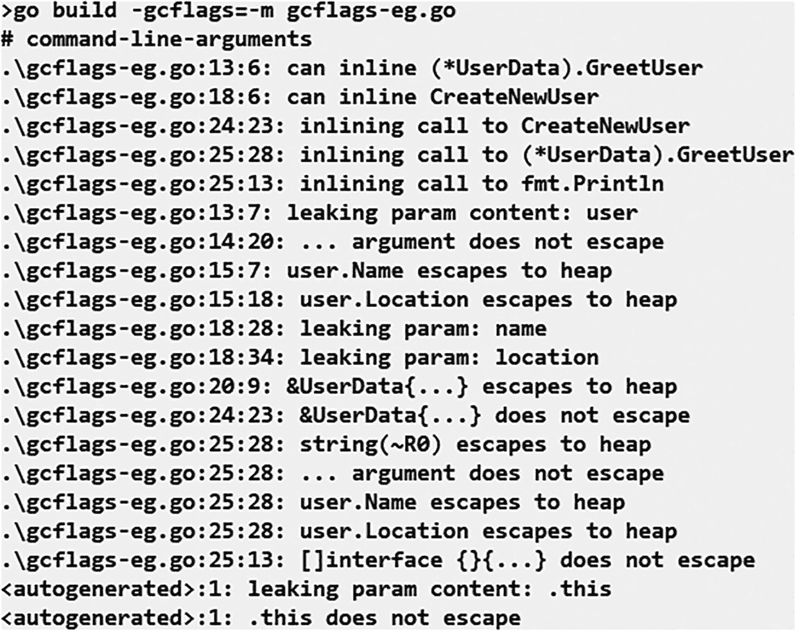

# 9. 技巧与实用窍门

本章提供了一些黑客技巧和快捷方式，可以帮助您更有效、更轻松地掌握 Go 编程语言。这些技巧和窍门涉及 Go 编程语言的不同方面，包括包、导入、数据类型等。

## 导入包

除了将包导入到 Go 程序中的常规方法外，还有一些其他替代方法可以实现此目的。以下示例使用 `regexp` 包说明了这些不同的方式。

- `import alias_name "package_name"` — 使用此语法导入包将为指定的包名（本例中为 `regexp`）创建一个别名。然后，您可以使用此别名，通过成员访问运算符（即点运算符 `.`）来访问 `regexp` 包中的所有内容。例如，`RegularExpression`。
- `import . "package_name"` — 以这种方式导入任何包，允许您访问特定包的内容，而无需在导出内容前添加包名前缀。例如，您可以使用 `regexp.MatchString("m([a-z]+)rs", "mars")` 语句，而不是输入 `regexp.MatchString("m([a-z]+)rs", "mars")`。
- `import _ "package_name"` — 以这种方式导入包会告诉编译器不要引发任何与导入但未使用的包相关的警告。但是，任何初始化函数仍将被执行。不过，包的其他内容不会被导出和访问。

## 检查应用程序导入了哪些包

检查应用程序正在导入哪些包是一种有用且实际的方法。然而，并没有简单的方法可以做到这一点。尽管如此，仍可以使用 `go list` 工具和 `templates` 来做到这一点。在应用程序的根目录下运行以下命令。

```sh
$ go list -f '{{join .Deps "\n"}}' |
xargs go list -f '{{if not .Standard}}{{.ImportPath}}{{end}}'
```

如果您希望列表也包含标准包，可以编辑此模板：

```sh
$ go list -f '{{join .Deps "\n"}}' |  xargs go list -f '{{.ImportPath}}'
```

## 使用 `goimports` 代替 `gofmt`

Go 提供了两种工具可以自动按照 Go 编码标准格式化您的源代码，分别是 `gofmt` 和 `goimports`。前者随 Go 编译器的标准安装包一起提供。而 `goimports` 工具需要单独安装。此外，`goimports` 工具还能修复包导入问题。

## 代码组织

尽管 Go 编程语言相对更容易学习，但对于初学者来说，Go 代码组织的标准方式可能是最难理解的事情之一。Go 提供了关于代码组织、放置源代码的不同位置以及需要遵循的不同惯用法的清晰指导。此外，像 `gofmt` 这样的工具随 Go 编译器打包在一起，它制定了严格的规则：如果代码包含任何未使用的导入包、变量等，则不会允许成功编译。有关更多信息，请参考官方演讲 [`https://talks.golang.org/2014/organizeio.slide#1`](https://talks.golang.org/2014/organizeio.slide%25231) 或官方文档 [`https://tinyurl.com/3x3hapub`](https://tinyurl.com/3x3hapub)。


## 使用还是不用：自定义构造函数

通常不需要使用自定义构造函数。但有时却不得不使用它们；例如，在初始化时设置值的同时，还必须对默认值进行排序。为了说明自定义构造函数的用法，我们以一个日志记录器为例，在该示例中需要设置一个默认的日志记录器，如代码清单 9-1 所示。

```go
package main
import (
"log"
"os"
)
type Jobs struct {
Cmd string
*log.Logger
}
func CreateJob(cmd string) *Jobs {
return &Jobs{cmd, log.New(os.Stderr, "New Job ", log.Ldate)}
}
func main() {
CreateJob("SampleRun").Print("Initiating . . .")
}
代码清单 9-1
Go 语言自定义构造函数示例
```

**输出：**

```
New Job 2022/06/24 Initiating . . .
```

## 将代码模块化并组织成包

在决定项目的文件夹结构时，请务必牢记可扩展性和复杂性。在 Go 语言中，每个源文件都属于某个特定的包。因此，每个程序都以 `package` 语句开头，该语句指明了源文件所属包的名称。对于非常小的程序，唯一需要的包就是 `main` 包。最佳实践是确保包名不要太长。当一个包包含多个文件时，应维护一个包含包文档的 `doc.go` 文件。有关包的最佳实践更多信息，请参阅 [`https://talks.golang.org/2014/organizeio.slide#2`](https://talks.golang.org/2014/organizeio.slide%25232)。

## 依赖包管理

遗憾的是，Go 语言没有自己的依赖包管理系统。这在持续集成（CI）环境或多个开发人员共同开发一个项目时可能会成为挑战。尽管如此，Go 社区已经提出了几种解决方案来克服这一缺陷。Go 包管理器（`gpm`）（[`https://github.com/pote/gpm`](https://github.com/pote/gpm)）被认为是最简单可行的解决方案之一。它本质上是一个简单的 bash 脚本，可以进行修改，因此被复制到每个需要的仓库中（[`https://gist.github.com/mattetti/9334318`](https://gist.github.com/mattetti/9334318)）。它使用一个名为 `Godeps` 的自定义文件，该文件列出了需要安装的包名，以避免依赖问题。有关如何在代码中管理依赖项的更多信息，请参阅 [`https://go.dev/doc/modules/managing-dependencies`](https://go.dev/doc/modules/managing-dependencies)。

## 编译器优化

开发者通常会在构建时使用不同的标志，称为 `gcflags`，以了解编译器正在应用哪些优化和内存管理技术。代码清单 9-2 演示了如何使用编译器标志。

```go
package main
import (
"fmt"
)
type UserData struct {
ID       int
Name     string
Location string
}
func (user *UserData) GreetUser() string {
return fmt.Sprintf("Hello %s from %s",
user.Name, user.Location)
}
func CreateNewUser(id int, name, location string) *UserData {
id++
return &UserData{id, name, location}
}
func main() {
user := CreateNewUser(10, "Maryam", "PK")
fmt.Println(user.GreetUser())
}
代码清单 9-2
展示编译器标志使用的基础程序
```

假设这个文件名为 `gcflags-eg.go`。你可以在构建该文件的同时，将 `gcflags` 与 `build` 命令一起传入，如图 9-1 所示。



一组包含 18 个命令行参数的代码，以 `gcflags` 开头。

图 9-1  
使用 `gcflags` 编译文件的示例输出

从此处显示的输出中可以注意到的一种优化是[函数内联](https://dave.cheney.net/2020/04/25/inlining-optimisations-in-go)（[`https://dave.cheney.net/2020/04/25/inlining-optimisations-in-go`](https://dave.cheney.net/2020/04/25/inlining-optimisations-in-go)）。函数内联用于减少函数调用开销，通过将函数体移动到函数调用处来实现。例如，`GreetUser()` 函数在第 13 行定义，并在第 25 行被内联。有关内联如何提升 Go 程序性能的更多信息，请参阅 [`http://dave.cheney.net/2014/06/07/five-things-that-make-go-fast`](http://dave.cheney.net/2014/06/07/five-things-that-make-go-fast)。本质上，编译器会创建与以下代码清单等效的代码。

```go
func main() {
id := 12 + 1
user := &UserData{id, "Maryam", "PK"}
fmt.Println(user.Greetings())
}
```

## 使用 Git 的 SHA 设置构建 ID

将构建 ID 烧录到二进制文件中通常非常有用。使用 Git 命令的 SHA1 是实现此目的的一种方法。第一步是使用 Git 命令从你的仓库中获取最新提交的 SHA1 短版本：`git rev-parse --short HEAD`。之后，如下面的代码清单所示，你需要设置一个导出的变量，在此例中为 `Build`，其值将通过 `-ldflags` 标志在编译时设置。

```go
package main
import "fmt"
var Build string
func main() {
fmt.Printf("Build ID: %s\n", Build)
}
```

将前面的代码清单保存到名为 `buildId-eg.go` 的文件中。仅编译代码不会设置构建 ID；你需要使用以下 Go 命令来设置构建值：

```
$ go build -ldflags "-X main.Build m9163zh" buildId-eg.go
```

为了确保你的构建 ID 已设置，运行并检查你的构建。然后可以在应用程序的部署编译过程中使用该构建 ID。

```
Build ID: m9163zh
```

## 优雅常量的案例，即 IOTA

有时，概念的名称非常重要，尤其是在代码中，如代码清单 9-3 所示。

```go
const (
CCRamada    = "Ramada"
CCMarriot   = "Marriot"
CCHilton    = "Hilton"
)
代码清单 9-3
为概念赋予恰当名称以区分它们
```

然而，在其他时候，你只需要区分不同事物，而名称并不重要。例如，在数据库中存储产品类别信息时，可能希望使用整数值来区分它们，而不是按名称存储为字符串值，因为产品类别会随时间变化。实现此目的的一种方法如代码清单 9-4 所示。

```go
const (
CatElectronics  = 0
CatAppliances   = 1
CatHardware     = 2
)
代码清单 9-4
使用整数值来区分概念
```

请注意，在此示例中，我们使用 0、1 和 2 作为常量的值。但这些是任意值，由程序员自行选择。

尽管常量被认为很重要，但有时它们可能难以解释和维护。由于这些原因，Ruby 等某些语言的开发者会避免使用常量。然而，Go 语言中的常量具有某些微妙特性，当谨慎使用得当时，可以使代码保持可维护性和优雅性。

### 自动递增

在 Go 中实现自动递增的一个便捷技巧是使用 `IOTA` 标识符。使用 `IOTA` 本质上简化了常量定义。如代码清单 9-5 所示，你可以使用 `IOTA` 来分配与上一节示例中相同的值。

```go
const (
CatElectronics  = iota    //0
CatAppliances             //1
CatHardware               //2
)
代码清单 9-5
使用 IOTA 标识符实现自动递增
```


### 自定义类型

自定义类型通常与自动递增常量结合使用，以便程序员可以依赖编译器进行处理，如代码清单 9-6 所示。

```go
type Months int
const (
January    Months = iota // 0
February                 // 1
March                    // 2
April                    // 3
May                      // 4
June                     // 5
July                     // 6
)
代码清单 9-6
使用 IOTA 的自定义类型
```

如代码清单 9-7 所示，如果将 `Months` 类型参数传递给一个定义为只接受 `int` 类型参数的函数，这将无法正常工作。程序将在编译时抛出错误。

```go
func Counter(k int) {
fmt.Printf("物品数量: %d", k)
}
func main() {
m1 := January
fmt.Println(Counter(m1))
}
代码清单 9-7
因类型不匹配导致的编译时错误
```

**输出：**


错误信息显示："cannot use m1 (variable of type `Months`) as `int` value in argument to `Counter`"（不能将类型为 `Months` 的变量 m1 作为 `int` 值传递给 `Counter` 函数）。

反之亦然。如代码清单 9-8 所示，不能将 `int` 类型参数传递给一个定义为接受 `Months` 类型参数的函数。

```go
type Months int
const (
January  Months = iota // 0
February               // 1
March                  // 2
April                  // 3
May                    // 4
June                   // 5
July                   // 6
)
func Counter(k Months) {
fmt.Printf("物品数量: %d", k)
}
func main() {
m2 := 2
fmt.Println(Counter2(m2))
}
代码清单 9-8
因类型不匹配导致的编译时错误
```

**输出：**


错误信息显示："cannot use m2 (variable of type `int`) as `Months` value in argument to `Counter-2`"（不能将类型为 `int` 的变量 m2 作为 `Months` 值传递给 `Counter-2` 函数）。

然而，这种情况也有一个例外。当数值常量作为参数传递时，代码会编译并通过，如代码清单 9-9 所示。这是因为在 Go 语言中，常量是松散类型的，除非在严格的上下文中使用。

```go
func GetMonth(character Months) string {
var str string
switch character {
case January:
str = "这是一月。"
case February:
str = "这是二月。"
case Tuesday:
str = "这是三月。"
}
return str
}
func main() {
fmt.Println(GetMonth(0))
}
代码清单 9-9
演示 Go 语言中常量松散类型特性的程序
```

**输出：**

`这是一月。`

### 跳过值

在某些场景下，你可能希望使用 IOTA 为常量赋值，但又不希望值按顺序连续排列，而是想跳过某些值。如代码清单 9-10 所示，可以使用下划线来跳过不需要的值。

```go
const (
CatElectronics  = iota   //0
CatAppliances            //1
CatHardware              //2
_
_
CatComputer              //5
)
代码清单 9-10
使用 IOTA 时跳过值
```

### 表达式

除了自动递增之外，IOTA 还可用于其他多种用途。其中一种用途是在表达式中使用。其结果可以存储在常量中。代码清单 9-11 展示了一个说明此功能的示例。在此示例中，`<<` 是位掩码操作符。这个技巧之所以有效，是因为在 const 组中，每一行只有一个标识符，所以前一个表达式会被取出并重新应用于该标识符，但会使用递增后的 IOTA 值。这个过程也称为最后非空表达式列表的隐式重复。

```go
type AllergyMagnitude float32
const (
PeanutAllergy = 1 << iota //00000001
ChocolateAllerg           // 1 << 1 即 00000010
DustAllergy               // 1 << 2 即 00000100
MilkAllergy               // 1 << 3 即 00001000
)
代码清单 9-11
将 IOTA 标识符与表达式结合使用
```

### 易混淆的常量

你可能会好奇在 const 组中，一行内定义两个常量的输出结果是什么。例如，在代码清单 9-12 中，常量 `Value2` 或 `Value6` 的值会是多少？

```go
const (
Value1, Value2 = iota + 1, iota + 2
Value3, Value4
Value5, Value6
)
代码清单 9-12
在 const 组中使用 IOTA 在一行内错误声明多个常量
```

在这种情况下，IOTA 的值是在下一行递增，而不是在它被引用时。这会导致代码混乱，因为你现在会得到具有相同值的常量，如代码清单 9-13 所示。

```
// ValA: 1
// ValB: 2
// ValC: 2
// ValD: 3
// ValE: 3
// ValF: 4
代码清单 9-13
在 const 组中使用 IOTA 在一行内定义两个常量的输出结果
```

## 总结

本章提供了关于如何更有效、更高效地使用 Go 的各种技巧和诀窍。这些实用技巧涵盖了几个主题，包括导入包、检查程序中导入了哪些包、使用 `goimports` 格式化代码、高效组织代码、使用自定义构造函数、依赖包管理、优化编译、通过 Git 设置项目的构建 ID，以及关于 IOTA 标识符的几个技巧。


