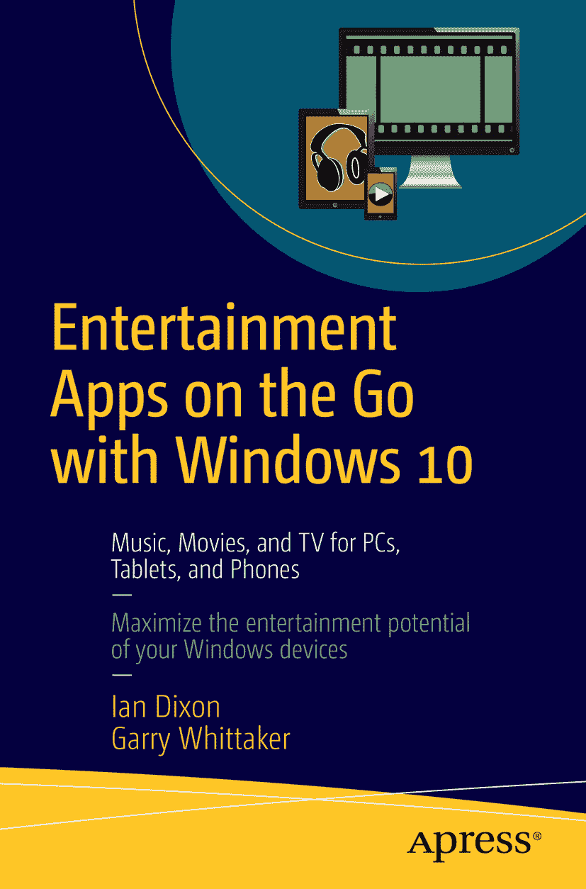

伊恩·迪克森（Ian Dixon）与加里·惠特克（Garry Whittaker）  
《Windows 10 随行娱乐应用：PC、平板与手机上的音乐、电影与电视》

作者在本文中提及的任何源代码或其他补充材料，读者可在[`www.apress.com`](http://www.apress.com/)获取。关于如何找到本书源代码的详细信息，请访问[`www.apress.com/source-code/`](http://www.apress.com/source-code/)。  
ISBN 978-1-4842-1474-9  
电子版 ISBN 978-1-4842-1473-2  
DOI 10.1007/978-1-4842-1473-2  
© 阿普雷斯出版社（Apress）2015

《Windows 10 随行娱乐应用：PC、平板与手机上的音乐、电影与电视》

常务董事：韦尔莫德·斯帕尔（Welmoed Spahr）  
主编：格温南·斯皮林（Gwenan Spearing）  
技术审稿人：格雷格·凯特尔（Greg Kettell）  
编委会：史蒂夫·安格林（Steve Anglin）、路易丝·科里根（Louise Corrigan）、詹姆斯·T·德沃尔夫（James T. DeWolf）、乔纳森·詹尼克（Jonathan Gennick）、罗伯特·哈钦森（Robert Hutchinson）、米歇尔·洛曼（Michelle Lowman）、詹姆斯·马卡姆（James Markham）、苏珊·麦克德莫特（Susan McDermott）、马修·穆迪（Matthew Moodie）、杰弗里·佩珀（Jeffrey Pepper）、道格拉斯·庞迪克（Douglas Pundick）、本·雷诺-克拉克（Ben Renow-Clarke）、格温南·斯皮林（Gwenan Spearing）  
协调编辑：梅丽莎·马尔多纳多（Melissa Maldonado）  
文字编辑：金·温普塞特（Kim Wimpsett）  
排版：SPi Global  
索引编制：SPi Global  
插图绘制：SPi Global

如需了解翻译事宜，请发送电子邮件至`rights@apress.com`，或访问[`www.apress.com`](http://www.apress.com/)。  
Apress 及 friends of ED 图书可批量购买用于学术、企业或推广用途。大部分图书也提供电子版及授权。如需更多信息，请参考我们的特别批量销售——电子书授权网页：[`www.apress.com/bulk-sales`](http://www.apress.com/bulk-sales)。

本作品受版权保护。出版方保留所有权利，涉及全部或部分材料，具体包括翻译权、重印权、插图复用权、朗诵权、广播权、缩微胶片或其他物理形式复制权、传输或信息存储与检索权、电子改编权、计算机软件权，以及目前已知或今后开发的类似或不同方法的使用权。法律保留的例外情况包括：与评论或学术分析相关的简短摘录，或专门为输入并执行于计算机系统而提供的材料，仅供作品购买者专用。本出版物或其部分的复制仅允许在出版方所在地现行版权法条款下进行，且使用许可须始终从斯普林格（Springer）获取。使用权可通过版权清算中心的 RightsLink 获取。违反相关版权法将面临起诉。

书中可能出现商标名称、标识和图像。我们在使用商标名称、标识或图像时，仅出于编辑目的并维护商标所有者权益，无意侵犯商标权，因此不会在每个出现处附加商标符号。本出版物中使用的商品名称、商标、服务标志及类似术语，即使未明确标明，也不应被视为对其是否受所有权保护的意见表达。

尽管本书中的建议和信息在出版时被认为是真实准确的，但作者、编辑及出版方均不对可能出现的任何错误或疏漏承担法律责任。出版方不对本书所含内容做出任何明示或暗示的保证。

本书全球发行由纽约斯普林格科学与商业媒体公司（Springer Science+Business Media New York）负责，地址：233 Spring Street, 6th Floor, New York, NY 10013。电话：1-800-SPRINGER，传真：(201) 348-4505，电子邮件：`orders-ny@springer-sbm.com`，或访问 `www.springer.com`。Apress Media, LLC 是一家加利福尼亚有限责任公司，其唯一成员（所有者）是斯普林格科学与商业媒体金融公司（SSBM Finance Inc）。SSBM Finance Inc 是一家特拉华州公司。

感谢金姆（Kim）和露丝（Ruth）在我们撰写本书期间给予的支持与理解，感谢阿普雷斯出版社的杰出同仁们给予的帮助，以及所有启发我们的读者和听众。

## 引言

在主持《数字生活秀》周刊的十多年里，我们见证了存储和播放媒体（无论是音乐、视频还是照片）的多种方法的兴衰更替。

最初，大多数听众如果存储媒体的话，通常是存放在 Windows 台式机上，并通常在同一台电脑上使用。他们可能拥有某种 MP3 播放器，而 iPod 也开始崭露头角，但这显然不像现在这样是一个多元化的市场。

我们见证了苹果 iOS 和谷歌 Android 平台的崛起、可下载媒体的诞生，以及近年来 Netflix 等流媒体服务的蓬勃发展。

尽管在早期，我们曾梦想拥有一个集成的系统，可以在台式机、手机甚至游戏平台上收听和观看媒体，但这个梦想已化为泡影，取而代之的是一个媒体通常与你最常使用的技术家族（无论是微软、苹果还是谷歌）绑定的世界。

即便在微软的平台内部，要找到一个统一的解决方案来共享媒体也变得越来越困难。

正因如此，我们对 Windows 10 带来的机遇感到无比兴奋。它承诺提供一个通用的 Windows 平台，使应用程序能够在其支持的任何平台上的任何 Windows 10 变体上运行。Windows 10 支持众多平台，从台式机、笔记本电脑到平板电脑和手机，甚至包括 Xbox One 和树莓派 2。

微软还巧妙地将其 Windows 10 中的一些核心媒体应用开放至其他平台，包括苹果和谷歌。

你的媒体来源及其存储方式仍将取决于你骨子里是微软、苹果还是谷歌的忠实用户，但 Windows 10 带来了在任何地方都能消费这些媒体的希望。

本书将帮助你实现这一愿景。

