# 1. 移动音乐服务

假如音乐是爱情的食粮，那么奏下去吧，莎士比亚《第十二夜》中的奥西诺公爵曾这样说。如今，我们对音乐的热爱依然如往昔般强烈。然而，我们常常难以在想要的地方播放音乐。Windows 10，结合在 Android 和苹果设备上使用微软音乐应用的能力，旨在解决这一困境。现在，你可以随身携带音乐到任何地方。

借助 Windows 10，你可以通过一系列服务在 PC、笔记本电脑、平板电脑或手机上享受音乐。

在本章中，你将了解如何使用 Microsoft Groove 和第三方服务在 Android、iOS 或 Windows 手机、平板电脑或笔记本电脑上下载、流式传输和购买音乐。你还将了解如何在移动中收听广播电台和播客。

## 使用 Groove 聆听音乐

> **信息**  
> 微软在 Windows 10 中将其音乐应用的名称从 Windows 8 时期的 Xbox Music 更改为 Groove。你可能会发现在某些旧版本平台上，它仍被称为 Xbox Music。

Groove 是微软的音乐服务，它将多项功能整合到一个服务于 Windows 10、Xbox One、iPad 和 Android 设备的服务中。

通过这些服务，你可以聆听存储在 PC 或手机上的个人音乐，从云端流式传输音乐，并直接从设备购买音乐。

Groove 分为四个功能领域：聆听设备上存储的音乐，从微软服务器上的个人收藏中流式传输音乐，从微软购买专辑和歌曲，以及使用微软的音乐订阅服务。

### 在 PC 或笔记本电脑上使用 Groove

当想到随身听音乐时，你可能只局限于手机或 iPod Touch 这样的便携式媒体播放器。这可就错了。我们每周播出的《数字生活方式》节目收到的听众反馈显示，仍有相当数量的移动音乐播放是在 Windows 设备上进行的，比如 Surface 系列和笔记本电脑。这些设备运行的是 Windows 10 的桌面版或 PC 版，在本节中，你将了解在播放音乐方面，它为你提供了哪些功能。

打开该应用后，你会看到存储在 PC 上的音乐收藏视图（图 1-1）。

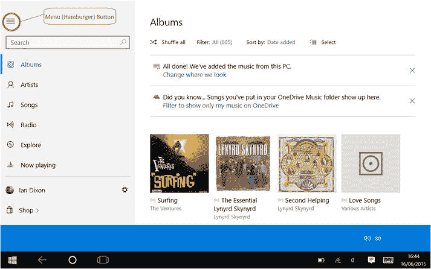

图 1-1. Windows 10 PC 上的 Groove。左上方高亮显示的是菜单按钮

默认情况下，该应用会在你 PC 的 `This PC\music` 文件夹中查找音乐，但你可以根据需要更改该位置。你可以通过进入“设置”并选择“选择我们查找音乐的位置”来更改位置。点击该链接后，会弹出一个窗口，显示应用当前查找音乐的位置（图 1-2），并让你可以选择向应用添加新位置。只需选择“添加”（显示为圆圈中的加号）按钮，就会弹出一个对话框，你可以在其中选择一个供应用查找的文件夹。完成此操作后，音乐应用会自动将所选文件夹及其子文件夹中的所有音乐添加进来。点击 `Done` 关闭对话框。

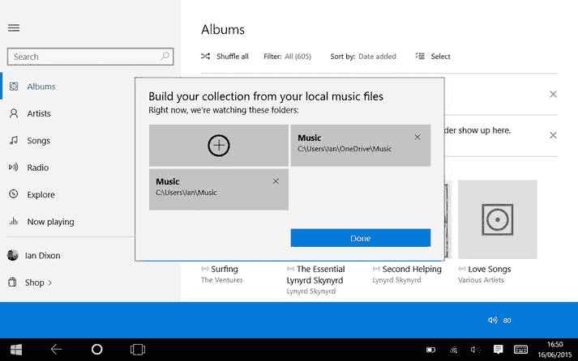

图 1-2. 在 Groove 中选择从哪里选取音乐

如果你的收藏中没有任何音乐，也不必担心。本章稍后你将学习如何从 iTunes 和其他来源添加音乐。你也可以从 Windows 商店添加音乐，如图 1-3 所示。

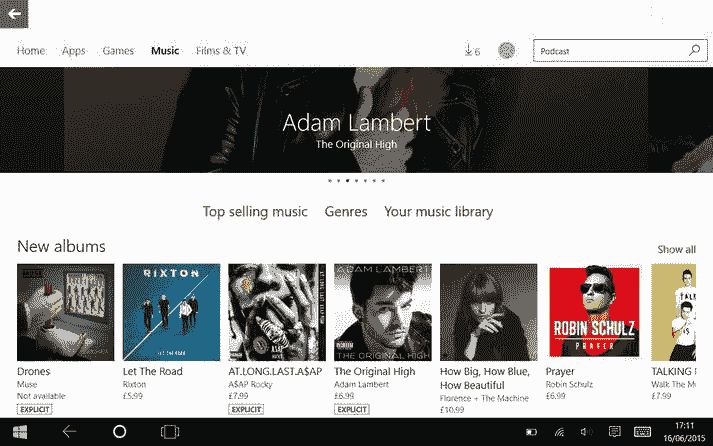

图 1-3. 你也可以从 Windows 商店获取音乐

在本节中，你了解了如何选择你想要添加到 Groove 收藏中的音乐。在下一节中，你将了解如何播放这些音乐。

#### 播放音乐

音乐应用可以以不同的视图显示你的收藏，包括按专辑、艺术家、歌曲或播放列表。你可以通过选择应用左侧的相关图标来选择你偏好的视图。如果菜单不可见，你可以使用窗口左上角的菜单按钮将其切换打开。

**信息：** 菜单按钮看起来像三条水平线叠在一起。有些人觉得这看起来像一个汉堡包，因此这种类型的菜单通常被称为汉堡菜单（前面在图 1-1 中显示过）。

在 `Artists` 视图中，艺术家按字母顺序排序，选择一个字母会弹出字母表，然后你可以跳转到另一个字母，如果收藏量很大，这样可以方便地快速找到你的艺术家。当你选择一位艺术家时，应用会显示该艺术家在你的收藏中的专辑和歌曲。你可以选择 `Play`（一个指向右方的三角形）来播放该艺术家的歌曲，或者选择加号将歌曲添加到播放列表（稍后会详细介绍）。

在 `Albums` 视图中（图 1-4 和 1-5），每张专辑都由一个专辑封面缩略图表示。点击封面会显示专辑详情和曲目列表。按下 `Play` 图标（一个指向右方的三角形）将播放整张专辑，或者你可以点击选择单首曲目，然后按下 `Play` 按钮。

图 1-5. 专辑视图在手机或小平板上看起来不同

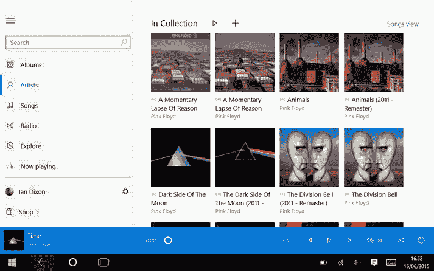

图 1-4. 艺术家的专辑视图，桌面版

你也可以通过点击加号图标将某首歌曲或整张专辑添加到播放列表。

**信息：** 播放列表是你稍后可以播放的歌曲集合。例如，你可以创建一个用于锻炼时听的歌曲列表，或者你喜欢开车时听的歌曲列表。它们可以是你喜欢的任何音乐组合。要创建新播放列表，你点击右侧图标列表中的加号图标。

接着，你可以为播放列表输入一个名称，然后点击 `Save`。这将创建一个新播放列表，然后带你返回你的音乐收藏。

当你点击某首歌曲时，你会看到一个加号，它会显示你的播放列表列表；你可以选择要将歌曲添加到的播放列表。

如果你想将选定的歌曲、专辑或艺术家添加到播放列表或下载一组歌曲，有一个简单的方法。从左侧菜单中选择 `Albums`、`Artists` 或 `Songs` 视图切换到所需的板块。然后，你可以点击上方的 `Select` 按钮。

**注意：** Windows 10 中的 `Select` 按钮通常显示为四条水平线叠在一起，旁边有两个复选标记。你可以在图 1-5 的右上方看到它。

然后，点击你想要选择的歌曲/专辑（复选标记表示已选中的文件）。当你选择内容时，屏幕底部会出现一个菜单栏。你也可以按住 `Ctrl` 键并点击所需项目（仅限在 PC 上），来选择多个曲目。

在菜单栏上，你会看到一个 `Play` 按钮，它将播放选中的歌曲。有一个加号图标，你可以将选中的歌曲添加到播放列表。还有一个 `Download` 按钮，用于将选中的歌曲从云端下载到你的本地设备（稍后会详细介绍）。你也可以使用选择按钮来删除一组歌曲。

在大多数屏幕的顶部，你都会注意到有一个用于筛选的选项。

使用 `Filter` 按钮，你可以选择显示你的整个音乐收藏，或将其缩小到存储在你本地设备上的音乐、流媒体音乐或 `OneDrive` 上的音乐（见图 1-6）。

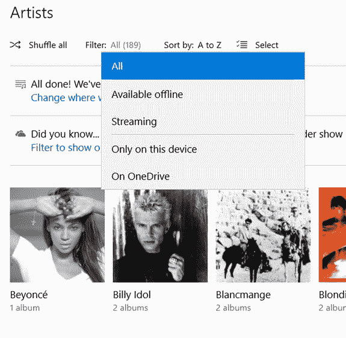

图 1-6. 筛选

#### “全部”选项与音乐管理

“全部”选项的功能正如其名，会显示你的整个音乐库。“可供离线使用”选项则仅显示存储在电脑上的音乐（无需联网即可收听），这包括你设备中存储的音乐，以及之前从云端流式传输并缓存在设备上的歌曲。

“流式传输”选项会显示存储在 `OneDrive` 上或作为 Groove 订阅一部分的音乐。“仅在此设备上”选项则会对列表进行筛选，仅显示当前设备上的音乐。

关于 `On OneDrive` 存储选项，你将在第 2 章中了解。它基本上是微软提供的免费云存储服务，你可以将音乐集存储在微软的服务器上，并通过你的任何设备或网页访问这些内容。

你还可以选择应用如何对音乐进行排序和整理。界面中有一个“排序方式”链接，你可以从中选择以下选项：`添加日期`、`A 到 Z`、`发行年份`、`流派`（音乐类型）、`艺术家`或`专辑`。

左上角有一个“随机播放所有”按钮。选择“随机播放所有”将以随机顺序播放当前视图中的音乐。当你不确定自己想听什么类型的音乐时，这项功能非常棒。

当你播放一首歌曲时，应用底部的“正在播放”栏（图 1-7）会显示当前歌曲的进度，并且按顺序包含`上一曲`、`播放/暂停`、`下一曲`、`音量`、`随机播放`和`重复播放`按钮。

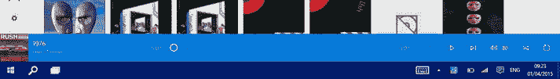

图 1-7.

屏幕底部的“正在播放”栏

> **注意：** 由于“正在播放”栏空间有限，控制播放的按钮使用图标而非文字（参见图 1-7），但它们按照上述顺序排列。

“随机播放”按钮会以随机顺序播放你当前选定的歌曲；例如，如果你在播放一张专辑，随机模式会以随机顺序播放其中的歌曲。“重复播放”按钮则指示应用在当前播放列表（或专辑）播放完毕后，重新开始播放当前歌曲列表，而不是在末尾停止。

另一个选项是“正在播放”视图，可通过左侧菜单访问。此视图以列表形式显示当前选定的歌曲，并附带专辑封面。在此视图中，还有一个按钮（参见图 1-8）用于全屏显示“正在播放”视图。全屏视图会展示艺术家作品的幻灯片，在平板电脑上效果尤其出色。

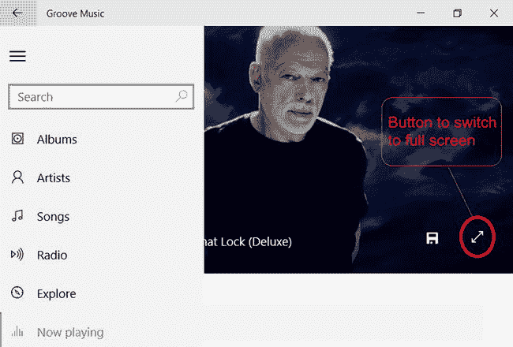

图 1-8.

高亮显示“切换到全屏”按钮的“正在播放”视图

> **信息：** “正在播放”全屏视图在用于大屏幕阴极射线管（CRT）和等离子屏幕时效果也很好，因为它有助于防止屏幕烧屏。

当音乐曲目切换或你调节音量时，应用会显示一个通知，提示当前音量及当前曲目信息。

在本节中，你学习了如何播放音乐以及播放时显示的有用选项。在下一节中，你将了解一种快速访问特定音乐的绝佳方法。

#### 将内容固定到“开始”菜单

Groove 的另一项出色功能是能够将艺术家、播放列表和歌曲固定到 Windows 10 的“开始”菜单。这使得你可以直接从“开始”菜单轻松开始播放你喜爱的曲目。

要将专辑、艺术家或播放列表添加到“开始”菜单，请按以下步骤操作：

1.  在 Groove 应用中，通过点击专辑、艺术家或播放列表的名称，找到你想要添加的内容。
2.  点击“更多”按钮。
3.  这会弹出一个菜单，你可以在其中看到“固定到‘开始’屏幕”选项。选择此项即可将专辑添加到“开始”菜单，方便日后快速访问。

现在你已经了解了如何将音乐添加到你的库中、播放这些音乐以及快速访问它们。但是，如果你想访问当前库中没有的音乐，该怎么办呢？在接下来的几节中，你将了解 Windows 10 中的 Groove 如何让你轻松地获取音乐。

#### 购买歌曲与音乐订阅

除了播放存储在平板电脑、电脑或云端的音乐外，Groove 还拥有一个可供你购买的歌曲库。你可以购买单首歌曲或一张专辑。如果你希望无限制地访问音乐，还有一种称为`Groove Music Pass`订阅的服务。

##### Groove Music Pass

`Music Pass`订阅是一项按月付费的服务。订阅后，你可以收听或下载 Groove 音乐库中提供的任何歌曲和专辑。你可以在 Windows 商店中浏览 Groove 音乐集（如图 1-3 所示），寻找歌曲、艺术家和专辑，并在你的手机或平板电脑上播放。

订阅时，你通常每月支付约 10 美元（7 英镑），并且可以在你的任何设备上使用该订阅。因此，你只需订阅一次，便可在你的 Android、iPhone 或 Windows 手机、平板电脑和电脑上收听音乐。如果你购买大量音乐，这项服务值得考虑。此外，还有 30 天免费试用；你可以访问 [`https://www.microsoft.com/en-us/groove-music`](https://www.microsoft.com/en-us/groove-music) 了解更多信息。

> **提示：** 在某些国家/地区，微软商店通常会提供包含 Office 365 和 Groove Music Pass 订阅的捆绑优惠，价格有折扣。这些优惠值得留意。

##### 管理你的设备

如果你拥有 Groove Music Pass 订阅，你可以在任何 Windows 10 设备以及 iOS、Android 和 Xbox 上流式传输音乐。

正如你在本章前面看到的，你也可以下载音乐以便离线播放。但是，Groove 存在四台设备的上限限制，因此你只能从四台设备（包括 iOS、Android 和 Windows 设备）下载曲目。

当你首次从某台设备下载歌曲时，该设备会向 Groove 注册；每次你在新设备上下载歌曲时，该设备也会向 Groove 注册。一旦你注册了四台设备，就无法再从其他设备下载；你仍然可以流式传输音乐，但不能下载。

如果你淘汰了一台手机或电脑，希望用新设备替换它，你可以从设备列表中移除旧设备。你可以通过访问 Groove 设备页面来执行此操作，该页面可从 Groove 应用的`设置`中启动。

`设备`页面（图 1-9）列出了已向 Groove 注册的电脑、手机和平板电脑及其注册日期。

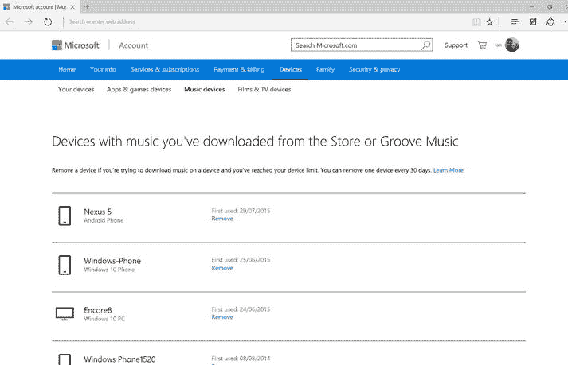

图 1-9.

管理你的 Groove 设备

你可以单击/点击`移除`按钮，系统会要求你确认选择。确认后，设备将被注销，你仍然可以在这台设备上流式传输音乐，但无法下载音乐。

> **注意：** 每 30 天只能移除一台设备。

至此，你已经了解了如何注册 Groove 订阅以及如何管理可以使用该订阅的设备。在下一节中，你将了解该订阅如何提升你的 Groove 体验。

###### 探索音乐

**注：** `探索音乐`选项目前在`Windows 10 Mobile`中不可用。

**信息：** `Windows 10 Mobile`是用于手机和小型平板电脑的`Windows 10`版本。微软将屏幕对角线长度小于 8 英寸的平板电脑定义为小型平板电脑。

如果你拥有`Groove Music Pass`，`Groove`应用中会有一个名为`探索`的版块。在此版块中，你可以探索（因此得名）`Groove Music`商店中的最新音乐。打开此版块时，它会呈现一系列新音乐、当前热门歌曲、热门艺术家以及热门专辑。

你可以选择一张专辑并开始播放，就像播放你自己的专辑一样。你可以将其添加到播放列表、创建电台以及下载曲目。

**信息：** `Groove`及许多其他流媒体服务中的电台并非传统的广播电台。相反，它们是一种从流媒体服务中所有可用音乐中随机生成播放列表的方式。这些播放列表通常围绕一位艺术家或一种音乐流派设定主题。例如，可能包括恐怖海峡（Dire Straits）这样的艺术家，或者 20 世纪 70 年代的音乐。

如果你选择一位艺术家，可以查看该艺术家的专辑，就像在收藏中查看艺术家一样，你可以播放和下载该艺术家的专辑和歌曲。

###### 购买音乐

你已经了解了`Groove`订阅，但如果你不想按月付费且没有`Groove Music Pass`，你仍然可以浏览商店并购买你想要的歌曲和专辑。

在`Windows 商店`应用（图 1-10）中，你可以点击/轻触`音乐`链接，然后浏览微软的音乐收藏。

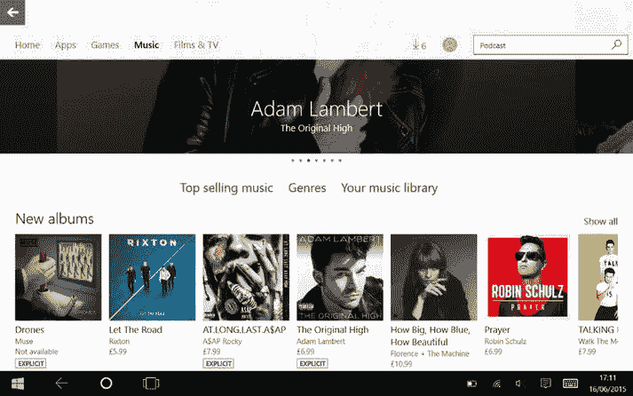

图 1-10. Windows 商店

当你看到感兴趣的某首歌曲或某张专辑时，点击/轻触`购买`图标，即可购买该内容。费用将计入你的 Microsoft 帐户，与购买应用的方式相同。如果你有`Music Pass`订阅，你会看到`下载`按钮而不是`购买`按钮。选择`下载`会将所选内容下载到你的电脑上。

一旦你购买了歌曲或专辑，它会自动添加到你的收藏中，并可通过互联网流式传输到你的其他设备上播放。你也可以将购买的内容下载到其他设备上，以便在没有连接互联网时收听。

**注：** 如果你有 iOS 设备、Android 设备或 Windows 手机，你仍然可以从这些设备访问你的音乐收藏。本章后面将介绍如何在 Android 设备、iPhone 以及`Windows 10`手机上访问你的收藏。

###### Groove 电台

**注：** 你必须拥有有效的`Groove Music Pass`订阅，才能使用电台功能。

`Groove`提供了一项音乐发现服务，可以根据一位艺术家创建自定义电台。要启动电台，请按照以下步骤操作：

- 通过`艺术家`视图在音乐应用中选择一位艺术家。
- 点击/轻触出现的`启动电台`按钮。

`Groove`会基于你选择的艺术家创建一个播放列表。你将听到所选艺术家的一些歌曲，以及`Groove`认为风格相似的其他艺术家的曲目；你可以通过进入`Groove`应用中的“正在播放”视图来查看播放列表。在你听歌时，应用会向播放列表中添加更多歌曲。

当你创建一个电台后，它会添加到应用的`电台`版块中。如果你进入`电台`版块，可以查看你已创建的电台。如果你选择“启动一个电台”，可以输入一位艺术家的名字，或从热门艺术家中选择，以创建一个新电台。

###### 搜索音乐

使用`Groove`，你可以通过搜索框搜索歌曲、艺术家或专辑。只需在搜索框中输入搜索条件，`Groove`便会开始显示搜索建议。选择其中一个结果将打开搜索结果页面。在此页面上，会列出匹配的艺术家、专辑和歌曲。

如果你拥有`Groove Music Pass`，你会看到两个选项卡（图 1-11）：`收藏中`和`完整目录`。`收藏中`选项卡显示你个人音乐收藏中匹配的内容，这些内容可能存储在设备上或`OneDrive`的云端。

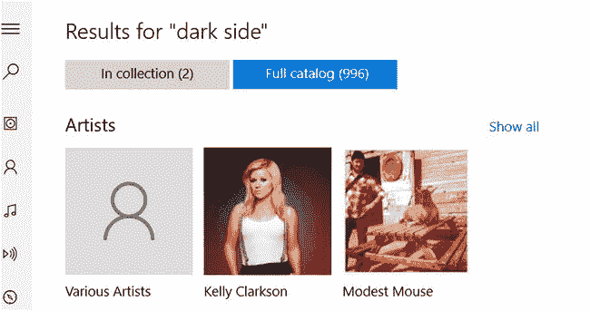

图 1-11. 搜索结果

`完整目录`选项卡显示`Groove`商店中可用的内容。如果你拥有`Groove Music Pass`订阅，你可以下载或收听结果中显示的任何音乐。

如果你没有`Groove Music Pass`，应用将搜索你自己的音乐收藏；如果没有找到匹配你搜索条件的内容，你会看到一个链接，点击该链接将打开商店应用并搜索`Windows 商店`。

### 设置

在电脑上，`Groove`提供了一些设置选项，你可以用来自定义使用体验。应用的`设置`版块分为`Music Pass 设置`和`你的音乐设置`。

####### Music Pass

在这里，你可以管理你与`Groove`一起使用的设备。选择此选项将带你进入之前在图 1-9 中看到的用于管理设备的网页。

####### 你的音乐

在这里，你可以管理电脑上的音乐文件。第一个选项是“选择我们查找音乐的位置”。选择此选项将弹出一个对话框，你可以在本章前面的图 1-2 中看到该对话框，在此你可以告诉应用你的设备上存储音乐的位置。

以下是其他选项：

- **自动下载你从 Groove 添加的歌曲：** 选中此选项后，电脑将自动下载你购买（或通过你的`Groove Music Pass`订阅添加）的歌曲。
- **自动检索和更新缺失的专辑封面及元数据：** 启用此选项后，当你向收藏中添加音乐时，应用将自动下载专辑封面、艺术家信息及其他元数据。
- **当我把歌曲添加到 OneDrive 时，删除来自 Groove Music Pass 的任何版本：** 此选项将删除你`Groove Music Pass`订阅中的重复曲目。
- **在完成购买或管理我的帐户前要求我登录：** 此选项意味着当你购买新音乐时，应用会提示你输入密码。

还有一个选项是“删除你的播放列表以及你从音乐目录中添加或下载的任何音乐”。选择此选项将使应用删除你从`Groove`和`音乐商店`购买或添加的内容。

最后一个选项是`深色`或`浅色`主题设置。`浅色`主题提供白底黑字，`深色`主题提供黑底白字。

在前面的几节中，你已经了解了如何在`Windows 10`电脑上使用`Groove`。如果你想在移动设备上使用它呢？在下一节中，你将首先了解如何在`Windows 10 Mobile`设备上使用它。

### 在 Windows 10 Mobile 设备上使用 Groove

**信息：** 在`Windows 10`之前，手机上的 Windows 操作系统被称为`Windows Phone`。微软已将其更名为`Windows 10 Mobile`。`Windows 10 Mobile`设备可以是手机，也可以是小型（小于 8 英寸）平板电脑。为方便起见，本书通常将这些设备称为手机。

在手机或小型平板电脑上使用`Windows 10`时，`Groove`的工作方式与电脑版非常相似，仅有一些细微差别。在本节中，你将学习如何在`Windows 10`移动设备上收听自己的音乐，以及如何使用`Groove Music Pass`订阅收听音乐。

你可以在手机的开始屏幕上找到`Groove`应用；如果找不到，可以在“所有应用”列表中找到它。

#### 播放音乐

打开音乐应用后，它会按专辑显示你的音乐收藏（图 1-12）。你可以更改视图，让应用按艺术家、歌曲或播放列表显示音乐。

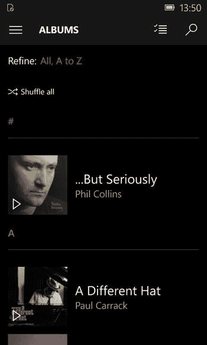

图 1-12。Windows Mobile 专辑视图

若要切换到不同视图，请点击应用左上角的菜单图标。点击菜单图标后，会滑出一个列表，你会在其中看到以下按钮：`Recent Plays`（最近播放）、`Albums`（专辑）、`Artist`（艺术家）、`Songs`（歌曲）、`Playlist`（播放列表）、`Radio`（广播）和`Explorer`（资源管理器）。你将在本节稍后部分了解`Radio`（广播）和`Explorer`（资源管理器）；现在，点击`Albums`（专辑）视图，它将按字母顺序列出你的收藏。

要播放专辑，请点击位于专辑封面图像上的`Play`（播放）按钮。应用将开始播放专辑中的第一首歌曲。

如果你点击专辑，它将带你进入专辑页面。要播放整张专辑，请点击`Play All`（全部播放）按钮。要播放单首曲目，请点击歌曲名称。

此视图中的其他选项是`Add To`（添加到）和`More`（更多）。`Add To`（添加到）按钮可将专辑添加到播放列表或`Now Playing`（正在播放）栏（即当前歌曲选择列表）中。添加到此处会将歌曲添加到`Now Playing`（正在播放）栏的末尾。

要添加到播放列表，请点击要添加到的播放列表（有关播放列表的信息，请参阅本章前面的“播放音乐”部分）。

`More`（更多）按钮会显示以下附加菜单选项：`Delete`（删除）、`See Artist`（查看艺术家）和`Download`（下载）。

- `Delete`（删除）选项可从你的收藏中删除此专辑。
- `See Artist`（查看艺术家）将带你进入艺术家页面（与从`Artists`（艺术家）视图中选择艺术家相同）。
- `Download`（下载）选项仅在所选专辑存储在云端时显示。选择此选项可将专辑下载到手机以供离线播放。你将在本章后面了解离线播放和云端存储的文件。

当你开始播放专辑或歌曲时，它将带你进入“Now playing”（正在播放）视图。在此视图中，有返回上一曲目、暂停播放和跳到下一曲目的按钮。还有一个`Repeat`（重复）按钮，选中后将在当前歌曲或播放列表播放完毕后重新播放。`Shuffle`（随机播放）按钮可使应用随机顺序播放你的内容。此列表中的最后一个按钮是`More`（更多）按钮，它为你提供将当前歌曲添加到播放列表的选项。

在“Now playing”（正在播放）视图中，你还会看到一个向下的小箭头。点击此按钮可调出当前播放列表。

#### 筛选与排序

当你从视图菜单按钮中选择`Artists`（艺术家）、`Albums`（专辑）或`Songs`（歌曲）时，你会在屏幕顶部看到一个`Refine`（优化）选项。此选项让你能够筛选和排序收藏，从而更轻松地找到音乐。

`Refine`（优化）选项分为两部分：`Filter`（筛选）和`Sort`（排序）。

`Filter`（筛选）部分分为`All`（全部）、`Available Offline`（可离线使用）和`Streaming`（流媒体）。当你选择`All`（全部）时，它会显示你所有的音乐收藏，无论是在手机上、存储在`OneDrive`中，还是作为`Groove Music Pass`（Groove 音乐通行证）订阅的一部分。

注意：`OneDrive`是微软的云存储解决方案，你将在第 2 章中了解它。请在本章前面部分阅读关于`Groove Music Pass`（Groove 音乐通行证）订阅的更多信息。

要仅显示存储在手机上且无需网络连接即可播放的音乐，请选择`Available offline`（可离线使用）选项。如果你只想查看来自`OneDrive`或你的`Groove Music Pass`（Groove 音乐通行证）订阅的音乐，请选择`Streaming`（流媒体）。

在`Sort`（排序）部分，你可以让音乐按字母顺序排序，如果你处于`Albums`（专辑）视图中，还会看到一个`Artist`（艺术家）选项。

注意：在`Albums`（专辑）、`Artists`（艺术家）和`Songs`（歌曲）视图中的任何一个里，都有一个`Shuffle all`（全部随机播放）按钮，可以随机顺序播放你的音乐。

到目前为止，你一直在 Windows 10 设备（无论是 PC、平板电脑、笔记本电脑还是手机）上了解`Groove`。如果你有 Android 手机或 iPhone 怎么办？幸运的是，微软最近在将这些应用推向竞争平台方面做得相当出色。这包括 Groove 应用，在下一节中，你将了解如何在 Android 和 iOS 设备上使用此应用。

### 在 Android 设备和 iPhone 上使用 Groove

微软 Groove 音乐服务的优点之一是，除了能在 Windows PC、手机和平板电脑上运行外，它还能在 Android 设备和 iPhone 上运行。该应用的 iOS 和 Android 版本并非设计为手机或平板电脑上存储的音乐的播放器，而是用于播放存储在`OneDrive`或来自`Groove Music Pass`（Groove 音乐通行证）订阅的音乐。请参阅第 2 章了解如何将音乐收藏存储在`OneDrive`中。

#### Android 设备

要在 Android 上使用 Groove，请前往 Google Play 商店并搜索`Groove Music`。安装完成后，运行该应用，它会要求你登录 Microsoft 帐户。这是你用来在 Windows 上将收藏上传到`OneDrive`，或订阅 Groove 时使用的帐户。

登录到应用后，你会看到自己的音乐收藏。你可以按艺术家、专辑、歌曲和流派查看收藏。要按艺术家查看收藏，请点击`Artists`（艺术家）选项卡（图 1-13）。

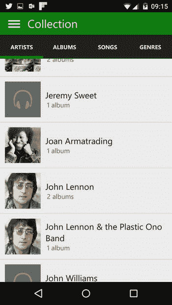

图 1-13。Android 上的艺术家视图

当你选择一位艺术家时，应用会在`My Albums`（我的专辑）部分显示你收藏中的专辑，如果你有`Groove Music Pass`（Groove 音乐通行证）订阅，你还会看到一个`All Albums`（所有专辑）部分，其中包含该艺术家不在你收藏中的专辑。

要播放专辑，请点击专辑图像。要查看专辑中的曲目，请点击专辑标题，你会看到专辑中的所有歌曲。点击一首歌曲即可播放。

还有一个`Bio`（简介）部分。当查看艺术家时，这里会提供关于该艺术家的背景信息。

使用该应用，你还可以搜索歌曲、艺术家或专辑。要执行搜索，请点击菜单按钮，然后在搜索框中输入你要查找的内容。应用将列出匹配的结果，以艺术家开头，然后是专辑，再下面是歌曲。

### 离线播放

使用音乐应用，你可以下载歌曲，以便在没有网络连接的情况下离线播放。

在`Collections`（收藏）视图中，向上滚动到列表顶部，你会看到一个下拉菜单，默认显示`All music`（所有音乐）。此选项表示显示你收藏中的所有音乐。要仅查看已下载的音乐，请将其更改为`Available offline`（可离线使用）。要仅查看存储在云端的音乐，请将其更改为`Available online only`（仅在线可用）。

要将音乐下载到你的 Android 设备，请长按一首歌曲、一位艺术家或一张专辑，然后选择`Make available offline`（设为可离线使用）。这将把所选内容下载到设备上，以备离线播放。

注意：下载的音乐只能通过 Groove 应用播放。你不能使用第三方 Android 应用来播放来自 Groove 的音乐。

#### 广播

与 Windows PC 版 Groove 一样，如果你拥有`Groove Music Pass`（Groove 音乐通行证）订阅，你可以基于一位艺术家创建自定义广播电台。首先，点击应用左上角的菜单按钮，然后选择`Radio`（广播）选项。接下来，输入一位艺术家的名称或从推荐的艺术家中选择。应用将根据你选择的艺术家创建一个自定义播放列表，并将其存储在`Recent`（最近）部分中，以便稍后访问。

### 设置

在应用的“设置”部分（图 1-14）中，有一些实用的配置选项。

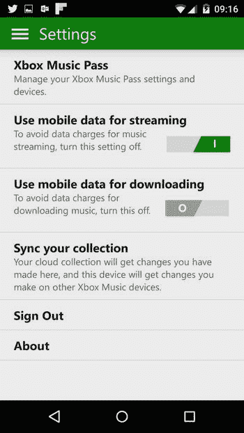

**图 1-14.** Android 中的设置（在撰写本文时，此处仍显示 Xbox Music 品牌，这是因为已变更为 Groove）。

`Groove Music Pass` 按钮会带你进入 Groove Music Pass 管理页面；有关管理音乐订阅的详细信息，请参阅本章前面的内容。

有一个选项允许使用移动数据进行流式传输。选中此选项后，应用将使用你手机的数据连接来流式传输音乐。如果你想阻止应用使用移动数据（3G/4G），请关闭此选项。

> **注意：** Wi-Fi 流式传输不受此选项影响。

有一个选项允许使用移动数据进行下载。开启此选项后，应用将能够使用你的移动数据连接下载歌曲以供离线播放。关闭此选项可阻止应用使用你的数据连接。

> **注意：** Wi-Fi 下载不受此设置影响。

此页面上的另一个选项是同步你的音乐收藏。这会将你在其他设备上对收藏所做的更改应用过来，同时也会将你在 Android 设备上所做的更改发送回云端。应用在加载时会自动同步你的收藏；因此，除非你进行了更改并希望立即同步，否则无需手动同步。

在 Android 上使用 Groove 非常简单，但在 iPhone 上呢？在下一节中，你将看到同样简单。

### 在 iPhone 或 iPad 上使用 Groove

Groove 的 iPhone 版本与 Windows 10 Mobile 和 Android 版本的应用非常相似。首先，前往你手机上的 App Store，搜索 Groove Music。安装后，加载应用，它会要求你登录 Microsoft 帐户。这是你之前在 Windows 上用于将收藏上传到 OneDrive 的帐户，或是你订阅 Groove 时使用的帐户。

登录应用后，你会看到你的音乐收藏。应用顶部有四个用于查看收藏的按钮：艺术家、专辑、歌曲和流派。

当你按艺术家或专辑（图 1-15）查看音乐时，你会看到在艺术家或专辑图片上覆盖有一个播放图标。点击该图标，应用将开始播放该艺术家或专辑中的歌曲。

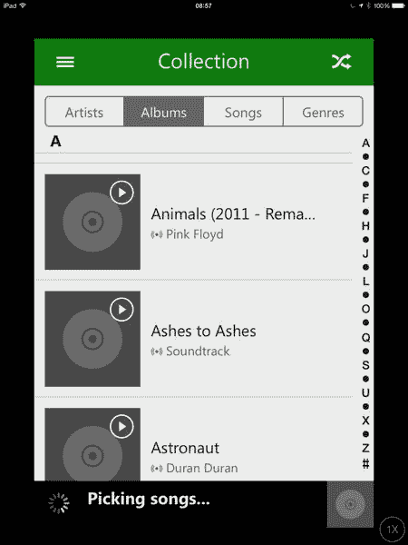

**图 1-15.** iOS 上的专辑视图。

如果你点击某位艺术家，应用会在“我的专辑”部分显示你收藏中的专辑；如果你拥有 Groove Music Pass 订阅，你还会看到一个“所有专辑”部分，其中包含该艺术家未收录在你收藏中的专辑。要播放专辑，请点击专辑图片。要查看专辑中的曲目，请点击专辑标题，你将看到该专辑中的所有歌曲；点击一首歌曲即可播放。

你还可以使用应用搜索歌曲、艺术家或专辑。要执行搜索，请点击菜单按钮，然后在搜索框中输入你要查找的内容。应用将列出匹配的结果，首先显示艺术家，然后是专辑，最后是歌曲。

在查看艺术家时，还会显示一段简介，为你提供关于该艺术家的背景信息。

### 离线播放

与 Android 和 Windows 版本的应用一样，你可以下载音乐文件，以便在没有网络连接的情况下离线播放。

在收藏视图中，向上滚动到列表顶部，你会看到一个下拉菜单，默认显示“所有音乐”。此选项表示显示你所有的音乐收藏。要仅显示已下载的音乐，请将其更改为“可供离线使用”。要仅显示存储在云端的音乐，请将其更改为“仅在线可用”。

要将音乐下载到你的 iPhone，请长按一首歌曲、一位艺术家或一张专辑，然后从菜单中选择“设为可供离线使用”选项。这会将所选项目下载到 iPhone，为离线播放做好准备。

> **注意：** 下载的音乐只能使用 Groove 应用播放；你不能使用第三方 Android 应用播放来自 Groove 的音乐。

#### 广播

与 Groove 的 Windows 版本一样，如果你有 Groove Music Pass 订阅，你可以基于某位艺术家创建自定义广播电台（图 1-16）。

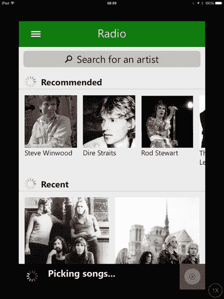

**图 1-16.** iOS 上的广播选项。

首先，点击应用左上角的菜单按钮，选择“广播”选项。然后输入艺术家姓名，或从推荐的艺术家中选择。应用将根据你选择的艺术家创建一个自定义播放列表，并将其存储在“最近”部分，以便日后访问。

### 设置

你可以通过点击菜单按钮找到应用设置。在“设置”部分，有一个启用蜂窝数据的按钮。这意味着选中该选项后，你可以通过手机的数据连接进行流式传输和下载音乐。如果你想避免使用数据流量，请关闭此选项。

此页面上的另一个选项是同步你的音乐收藏。这会将你在其他设备上对收藏所做的更改应用过来，同时也会将你在 iPhone 设备上所做的更改发送回云端。应用在加载时会自动同步你的收藏；因此，除非你进行了更改并希望立即同步，否则无需手动同步。

你已经了解了如何使用 Groove 访问你的音乐收藏，以及通过订阅获取音乐。你还看到了如何在 Windows 桌面、平板电脑、笔记本电脑和手机，以及 Android 和 iPhone 上播放这些音乐。如果你已经在其他音乐源（如 Google 的服务）上投入了大量精力，该怎么办？在接下来的几节中，你将了解如何在 Windows 10 中播放来自其他服务的音乐，首先从 Google 音乐开始。

