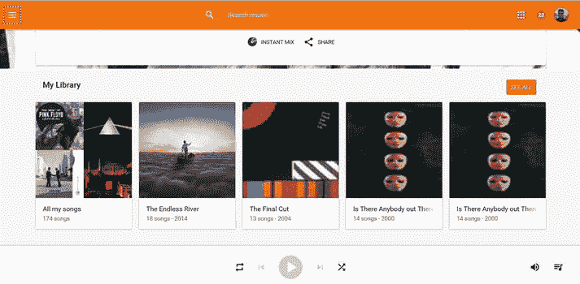

# 在 Windows 10 上使用 Google Music

**注意**

Google Music 目前无法在 Windows 10 Mobile 上使用。过去曾有第三方应用填补这一空白，但不幸的是，谷歌移除了这些应用所依赖的应用程序编程接口（`API`），目前尚无替代方案。

如果你已经在 Android 手机或平板电脑上使用谷歌的音乐服务，好消息是你也可以在 Windows 10 上访问这些内容。谷歌并不支持 Windows 10，但直到最近，第三方开发者一直在弥补谷歌留下的空缺。不幸的是，如前所述，这些应用所依赖的接口已被谷歌移除。不过，仍然有一种方法可以在 Windows 10 桌面上访问你的订阅服务。

对于 Windows 10，你可以使用 `Edge` 浏览器访问 Google Play Music。谷歌提供了基于网页的 Google Play Music 版本；只需在浏览器中打开 [`http://music.google.com`](http://music.google.com/)，并使用你的谷歌用户名和密码登录即可。

**注意**

使用 Google Play Music 网页版时，无法离线播放，因此你需要连接互联网才能使用。

当你加载音乐页面时，会看到存储在 Google Play Music 中的音乐库。在第 2 章中，你将了解如何将音乐存储到谷歌云中，以便其在浏览器中显示（图 1-17）。

**图 1-17.** Google Play Music

正如微软有音乐订阅服务一样，谷歌也有自己的音乐套餐。谷歌每月收费约 9.99 美元（9.99 英镑），即可访问谷歌的音乐库。一旦订阅了该服务，你就可以收听谷歌曲库中的任何音乐。如果你没有订阅音乐套餐，则只能访问自己上传的音乐（参见第 2 章）或从 Google Play Music 购买的音乐。

**信息**

仅在美国，谷歌还提供一项免费的广告支持型流媒体服务，允许你免费收听谷歌音乐库中的任何歌曲。使用免费服务时，你无法下载歌曲进行离线播放，并且在播放过程中会不定期插入广告。

无论你的音乐来自何处，都可以通过在搜索框中输入内容来搜索你的音乐库，搜索结果将显示在屏幕下半部分。如果将鼠标悬停在一张专辑上，你会在专辑封面上看到一个播放图标，点击即可播放该专辑。

你可以通过点击/轻触来选择某个专辑或歌手，这将列出所有曲目。页面底部有一个播放图标，点击即可开始播放该专辑或该歌手的所有歌曲。你还可以从播放列表中选择单曲进行播放。

播放音乐时，屏幕底部会显示歌曲封面，并提供上一曲、暂停、下一曲、随机播放和重复播放按钮。

还有一个音量图标，你可以点击/轻触以控制播放音量。

尽管 Google Play Music 是一个网页，但你仍然可以像使用应用一样将其固定到“开始”菜单。在 `Edge` 浏览器中，点击菜单按钮（三个点），然后点击“固定到‘开始’屏幕”。这将在“开始”菜单上创建一个磁贴，点击即可直接进入音乐页面。

