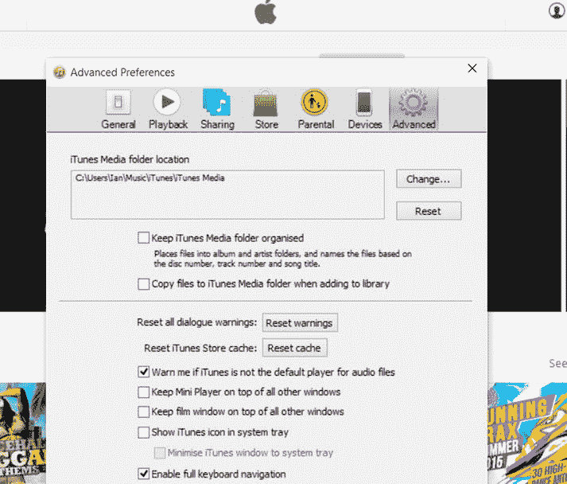

# 在平板电脑和笔记本电脑上使用 iTunes Music

如果你使用 `iTunes` 来管理音乐收藏，将其与 Windows 10 集成非常简单。你无需在 `iTunes` 中进行任何更改；只需告诉 `Groove` 应用你的 `iTunes` 音乐收藏存储位置即可。默认情况下，`iTunes` 将其音乐存储在 `此电脑\音乐` 文件夹中（图 1-18），而 `Groove` 会监控此文件夹以获取新音乐。

**图 1-18.** `iTunes` 中的音乐位置

如果你更改了 `iTunes` 音乐文件夹的位置，可以按照本章第一节的详细说明，通过 `Groove` 应用告知 `Groove` 你所存放音乐的文件夹。

**信息**

在第 2 章中，你将看到如何更改 `iTunes` 的音乐文件夹，以便通过 `iTunes` 抓取或购买的音乐自动存储在 `OneDrive` 上。

