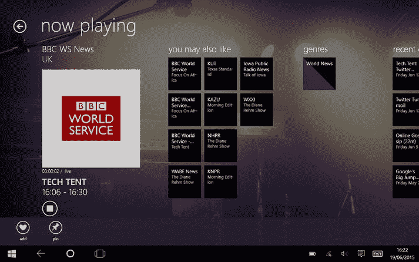
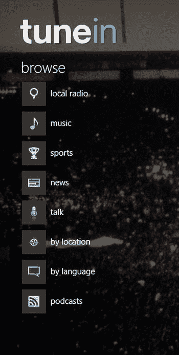

# 使用 TuneIn Radio 收听网络电台

互联网上有成千上万（甚至数百万）个广播电台，几乎涵盖了所有兴趣、主题和流派。你可以通过一款名为 `TuneIn Radio` 的应用（图 1-19）从手机、平板电脑或电脑访问这些电台。

**图 1-19.** Windows 10 中的 `TuneIn Radio`

从 Windows 应用商店安装该应用（只需搜索 `TuneIn`）。

在该应用中，你可以按名称搜索广播电台，也可以按流派浏览，包括本地广播、音乐、体育、新闻、谈话、位置、语言或播客（图 1-20）。

**图 1-20.** 在 `TuneIn Radio` 中按流派浏览

要按名称查找电台，你需要调出应用内的搜索框。从应用菜单（左上角）中选择“搜索”以调出搜索框，你可以在其中输入所需电台的名称。在手机版上，你可以直接在应用内的搜索框中输入搜索内容。

如果你不知道电台名称，可以从左侧列表中选择一个类别进行浏览。例如，如果你想找一个新闻台，从浏览列表中选择“新闻”，应用就会列出新闻广播电台。要开始播放电台，只需从搜索结果中选择它，应用便会调出该电台并开始播放。

找到喜欢的电台后，你可以将其添加到收藏夹列表，以便日后轻松找到；只需选择“添加到收藏夹”。你也可以通过选择“固定”按钮，将某个广播电台固定到“开始”菜单，以便随时快速访问。该电台随即会被添加到“开始”菜单。

**信息**

`TuneIn Radio` 实际上并非通过 FM 或 AM 无线电接收信号。它通过互联网流式传输内容，因此你可以收听来自世界各地的广播电台。

**注意** 请注意，如果你通过按流量计费的网络连接（如 `3G`）流式收听广播，可能会产生数据费用。有关如何衡量使用量，请参阅第 3 章。

`TuneIn Radio` 主要致力于让传统广播电台在互联网上发声，但那些不太传统的内容获取方式，比如播客呢？在下一节中，你将了解什么是播客以及如何在 Windows 10 中轻松收听它们。

