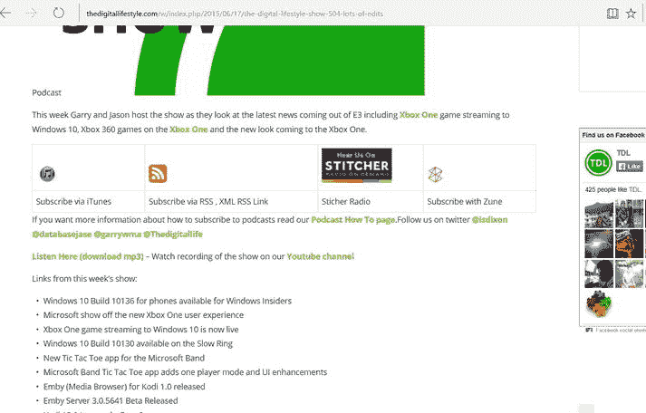
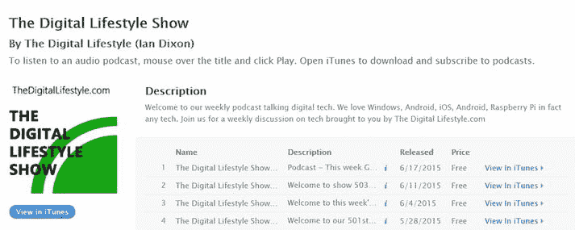

# 如何订阅播客

播客是一种基于互联网的广播节目，你可以下载到手机、平板或电脑上收听。例如我们每周录制的《数字生活方式秀》就是一档播客节目。

播客的妙处在于，你订阅一个节目后，当制作人发布新一期时，你使用的播客应用会自动将其下载到设备中，供你收听（如果是视频播客则可观看），无需你进行任何操作。

Windows 10 内置了收听播客的工具，同时也有大量第三方应用可供选择。

首先，让我们看看手机内置的播客应用——Podcasts。

### 在 Windows Phone 上

微软维护着一个可供搜索的播客库。

开始使用时，你只需在搜索框中输入要查找的播客名称，应用就会列出匹配的节目。例如，在搜索框输入`digital lifestyle show`，应用便会列出名为《The Digital Lifestyle Show》的播客。

你可以点击节目名称查看详情，然后点击加号图标订阅该播客，这样你的设备就会自动下载未来的节目。

如果你想要的播客未出现在搜索结果中，你仍可通过节目的 RSS feed 进行订阅（RSS 代表简易信息聚合，每个播客都有唯一的 RSS feed 链接，例如`http://thedigitallifestyle.com/podcast.xml`）。

这是一个特殊的网页，播客应用通过它下载节目。通常每个播客制作人都会在其网站上提供 RSS feed 链接。要使用该链接配合手机播客应用，请按以下步骤操作：

- 长按播客链接。
- 选择`复制链接`，将 URL 复制到剪贴板。
- 切换到`Podcasts`应用，点击搜索框。
- 选择`粘贴`按钮，将播客 feed 粘贴到搜索框中。
- 点击搜索按钮，调出播客信息页面。然后你可以点击`订阅`按钮，播放播客，或查看单集内容。

**信息**

订阅播客后，应用会在后台自动下载节目，随时可供播放。

为避免消耗移动数据流量，你可以在`Podcasts`应用设置中，将应用设置为仅在 Wi-Fi 环境下下载播客。

现在你已了解在 Windows Phone 上订阅播客非常容易，但当前没有播客应用的电脑上该如何操作呢？下一节将为你介绍一个技巧。

### 在 Windows PC 上

目前，微软播客应用仅适用于 Windows Mobile，但别灰心。在电脑上，你可以通过 Apple 的`iTunes`应用订阅播客，只需点击播客提供商网站上的`iTunes`链接即可（图 1-21）。

图 1-21. 添加播客

点击链接后（图 1-22），它会打开`iTunes`，你将在其中看到播客信息页面，并可以选择订阅该节目。订阅后，每期节目都会自动下载。

图 1-22. 在 iTunes 中添加播客的链接

**信息**

尽管目前微软官方播客应用仅随 Windows Mobile 提供，但 Windows 应用商店中也有不少优秀的播客应用可供选择。虽然我们不特别推荐某一款，但建议你自行搜索并看看能找到什么。

## 总结

在本章中，你了解了如何在 PC、Windows/Apple/Android 手机、平板以及笔记本电脑上，通过微软的 Groove 音乐服务下载、流式播放和购买音乐。你还学习了第三方服务，如 Google Music、iTunes 和 TuneIn Radio，并掌握了如何订阅播客。下一章，你将开始了解如何将你的内容上传到这些服务中。

