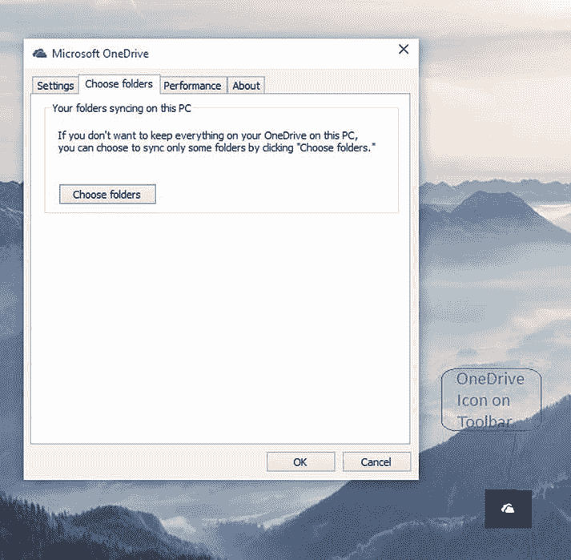
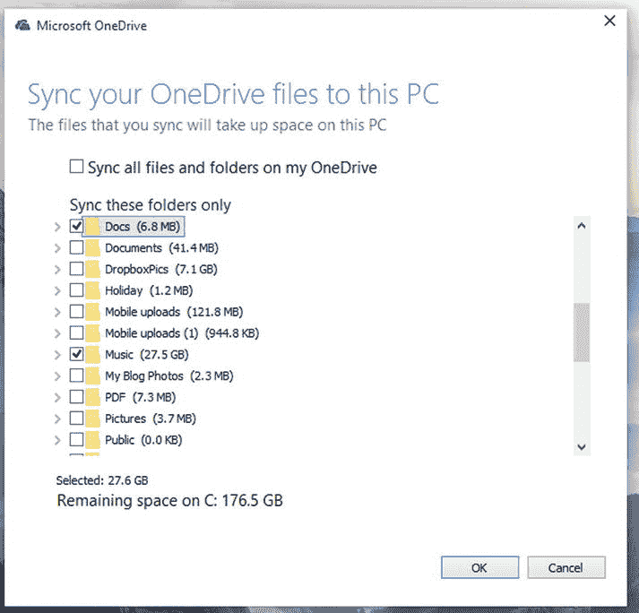
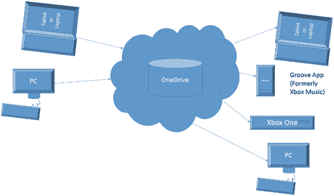
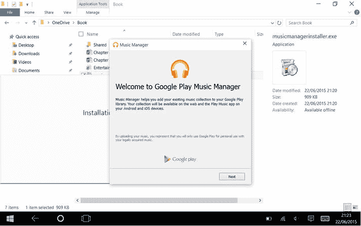
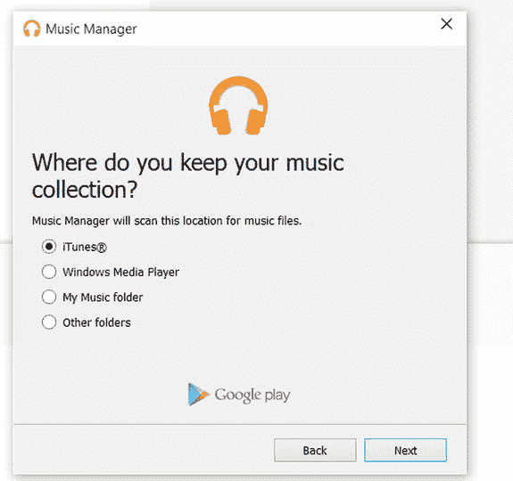
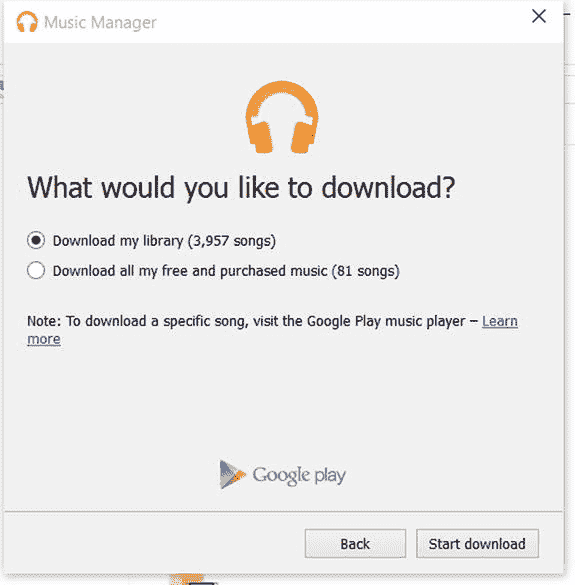

# 使用 OneDrive 存储你的音乐

OneDrive 是微软的云存储解决方案，可用于存储文档、照片和媒体文件等各种文件。然后，你可以通过 Web 和微软提供的 iOS、Android 和 Windows 版 OneDrive 应用来访问你的内容。创建 Microsoft 帐户时，微软会免费提供 15GB 的存储空间，你也可以在 `OneDrive.com` 购买更多存储空间。如果你订阅了 Office 365，将自动获得 1TB 的 OneDrive 存储空间。

OneDrive 和 Groove 音乐的一大优点是，两者可以协同工作，使你存储在 OneDrive 中的音乐可以在其他设备上使用。

使用 OneDrive 将音乐复制到云端非常简单；你只需将音乐存储在电脑上 OneDrive 的 `Music` 文件夹中即可。OneDrive 已内置于 Windows 10 中，因此无需下载任何额外的软件即可使用。

首次在 Windows 10 电脑上设置 OneDrive 时，你可以选择同步整个 OneDrive 存储或选择单独的文件夹同步。如果你选择了整个集合，就可以开始使用了；但如果你没有同步整个集合或尚未设置 OneDrive，则需要告诉 OneDrive 同步你的 `Music` 文件夹。

为此，请右键单击任务栏中的 OneDrive 图标（图 2-1），选择“设置”，然后单击“选择文件夹”选项卡，如图 2-1 所示。

图 2-1. 在 OneDrive 中选择文件夹；同时显示了 OneDrive 图标

单击 `选择文件夹` 按钮，你将看到 OneDrive 的文件夹列表。选择 `Music` 文件夹（图 2-2），点击确认选择，然后点击“确定”关闭对话框。

图 2-2. 在 OneDrive 中选择音乐文件夹

然后，OneDrive 会将你的 `Music` 文件夹同步到电脑。如果该文件夹中已有音乐，这些音乐将被复制到电脑上。

一旦 OneDrive 中有了 `Music` 文件夹，你放入此文件夹的任何音乐都可以在其他设备上的 Groove 音乐应用中使用。因此，将音乐放入 OneDrive 文件夹后，它不仅可以存储在你的本地电脑上，还可以存储在云端，以便在手机、平板电脑或其他电脑上访问（图 2-3）。

图 2-3. OneDrive 如何连接你的设备

正如你在第 1 章中看到的，微软的 Groove 音乐已被设置为可以播放存储在 OneDrive 中的音乐，因此一旦音乐上传到云端，它就会出现在 Groove 音乐应用中。

你已经了解了使用微软的 OneDrive 云解决方案有多么简单，但如果你更喜欢使用其他供应商的解决方案呢？在接下来的几节中，你将看到一些替代方案，首先是结合 Windows 10 使用谷歌的云解决方案。

## 使用 Google Play 存储音乐

谷歌提供了一项免费的音乐存储服务，你可以将音乐从电脑上传到谷歌云端，然后从其他设备（包括浏览器和 iOS 及 Android 应用）访问这些音乐。

你可以免费存储多达 50,000 首歌曲。要开始使用，你需要下载 Google 的音乐管理器。转到 Google Play 菜单，点击 `上传音乐` 按钮，然后点击 `下载音乐管理器` 按钮。

点击该按钮会将 Music Manager 安装程序（图 2-4）下载到你的电脑；下载完成后，运行安装程序。安装程序将下载并运行安装向导，你需要在此使用你的 Google 用户名和密码登录（如果你没有 Google 帐户，请访问 Google 音乐网站创建一个）。

图 2-4. 安装 Google Play 音乐管理器

如果你已经在 Google Play 中存储了音乐，登录 Music Manager 后，安装程序会询问你是要将歌曲上传到 Google Play，还是从 Google Play 下载歌曲。否则，它将直接为你提供上传音乐的选项。本章稍后将介绍下载选项。现在，我们将专注于上传。

### 使用 Google 音乐管理器上传音乐

点击“上传”选项；安装程序会询问程序应在电脑的哪个位置查找你的音乐，如图 2-5 所示。

图 2-5. 在 Google Play 音乐管理器中选择上传位置

选项如下：

-   iTunes：如果你使用 iTunes 管理电脑上的音乐，请使用此选项。
-   Windows Media Player：如果你将 Windows Media Player 作为主要音乐播放程序，请使用此选项。
-   我的音乐文件夹：如果你的音乐位于 Windows 10 的 `Music` 文件夹中，请使用此选项；这是 Windows 中的默认位置。
-   其他文件夹：使用此选项，你可以手动定位电脑上的音乐。因此，如果你的音乐存放在你创建的某个特定文件夹中，你可以告诉 Google 音乐管理器从该文件夹上传音乐。该应用可以监控多个文件夹。

安装完成后，它会询问你是否希望自动将新音乐上传到 Google 音乐。如果你这样做，Google 音乐管理器将监控你选择的文件夹，如果你添加了新音乐，它将自动将音乐复制到 Google 音乐。

完成设置后，Google 音乐管理器程序将在 Windows 的任务栏区域运行。

**提示：** 如果安装后需要调整任何设置，你可以在 Windows 10 的“所有应用”列表中找到该程序。

### 使用 Google 音乐管理器下载音乐

Google Play 音乐允许你一次将整个音乐收藏下载到电脑上。为此，你使用的应用与上传音乐的应用相同。

然后，你可以点击/单击 `下载音乐管理器` 按钮。运行安装程序，并使用你的 Google Play 音乐帐户登录后，程序会询问你是想上传还是下载音乐。

选择“下载”选项。然后它会询问你想要将音乐下载到哪个文件夹。接着，你将可以选择下载已上传到 Google Play 音乐的音乐库，或者仅下载从 Google 购买的音乐（图 2-6）。“下载我的音乐库”选项会下载你已上传到 Google Play 音乐的所有歌曲，而“下载我所有的免费和已购买音乐”选项则仅下载你从 Google Play 音乐商店获取的歌曲。

图 2-6. Google 音乐管理器中的下载选项

**提示：** “下载”选项是在新电脑上设置音乐以便离线播放的好方法。

