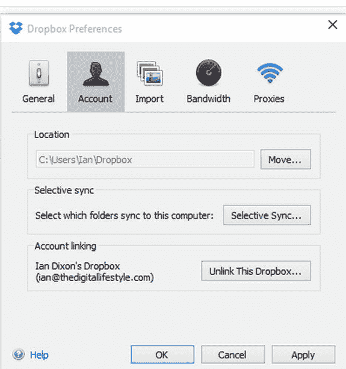

# 使用 Dropbox 存储你的音乐收藏

将音乐存储在云端的另一种选择是使用名为 Dropbox 的服务。

Dropbox 是一款云存储服务，提供免费和付费方案。在撰写本文时，Dropbox 的免费方案提供 2GB 空间；如有需要，你可以购买额外空间。

Dropbox 通过在云端与你的设备（及个人电脑）之间同步文件夹来工作。它不像 OneDrive 那样与 Groove 音乐集成，但你仍然可以用它来确保音乐在你的所有 Windows 10 个人电脑上可用。

要开始使用 Dropbox，你需要一个账户。如果你还没有账户，请前往 `Dropbox.com` 创建一个。

Dropbox 也为所有主流移动平台（包括苹果 Mac）提供客户端，不过如何使用它们已超出本书的讨论范围。

接着，你需要下载适用于 Windows 的 Dropbox 加载项。为此，请前往 `Dropbox.com` 并登录。点击你的用户名，点击“安装”链接，然后点击“下载”按钮开始下载。

下载完成后，运行安装程序。系统会要求你登录到该程序；登录后，Dropbox 将开始同步你的个人电脑。

默认情况下，Dropbox 会将你所有的内容同步到一个基于你用户名的新文件夹中，例如 `Ian\Dropbox`（图 2-7）。在此文件夹中，你可以创建一个 `Music` 文件夹并将音乐复制进去，Dropbox 随后会开始上传。

图 2-7.

如果你希望 Groove 播放存储在 Dropbox `Music` 文件夹中的音乐，应通过文件资源管理器右键点击 Dropbox 中的 `Music` 文件夹，选择“包含到库中”，然后选择“音乐”。

如果你不希望 Dropbox 将整个内容同步到你的个人电脑，可以按照以下步骤切换为选择性同步：

-   右键点击任务栏中的 Dropbox 图标。
-   点击“设置”图标。
-   选择“偏好设置”。
-   在“账户”选项卡中，点击“选择性同步”（图 2-7）。
-   选择你想与此台电脑同步的文件夹，然后点击“确定”完成。

至此，你已经了解了如何将音乐存储在三大主流云服务上，以及在个人电脑和其他设备上访问这些音乐是多么简单。还有一个 Windows 10 设备你尚未了解：Xbox One。作为 Windows 10 发布的一部分，Xbox One 将更新以运行该操作系统的一个版本。Xbox One 被设计为娱乐设备，但你如何在上面收听音乐呢？在下一节中，你将看到具体方法。如果你已将音乐收藏存储在 OneDrive 上，那会相当简单。

