# 通过 Xbox One 访问音乐

将音乐存储在微软 OneDrive 上的最大好处是，你的音乐不仅在 Windows 10 个人电脑、平板电脑和手机上可用，在 Xbox One 上同样可用。一旦你将音乐存储在 OneDrive 中，只需前往你的 Xbox One 并打开 Groove 应用即可。

如前所述，Groove 音乐服务此前被称为 Xbox 音乐，在你的 Xbox 上可能仍沿用此名称。

Groove（图 2-8）分为四个部分：主页、电台、精选和热门音乐。

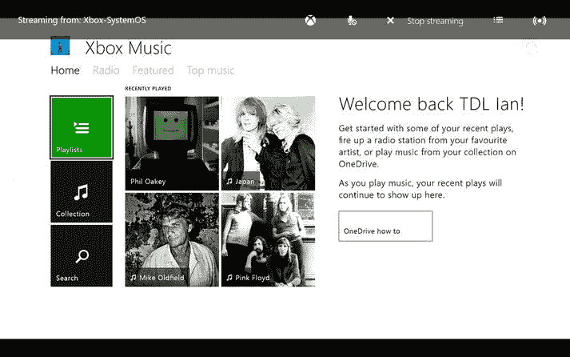

图 2-8.

在“主页”部分，你会看到“播放列表”、“收藏”和“搜索”磁贴，以及最近播放的音乐。

要浏览你的音乐，只需选择“收藏”磁贴；你将看到存储在 OneDrive 中的所有艺术家。

在 Groove 应用的许多位置，你都能看到来自 Groove 音乐服务在线收藏的音乐，例如“艺术家”视图或“电台”视图。你需要订阅 Groove 音乐通行证（参见第 1 章）才能播放这些音乐。如果你没有订阅 Groove 音乐通行证，则拥有十次免费播放机会，因此你可以在订阅前先试用该服务。

你可以通过选择应用左上角的“播放”按钮立即开始播放音乐。这将按随机顺序开始播放你的所有音乐。如果你想听音乐但不确定自己当下想听什么类型，这非常方便。

在“收藏”视图中，你可以通过选择“搜索”按钮来搜索歌曲、专辑或艺术家（图 2-9）。使用屏幕键盘输入你要搜索的内容，应用会建议匹配的项目供你从列表中选择，或者你可以完整输入搜索词并选择“搜索”。

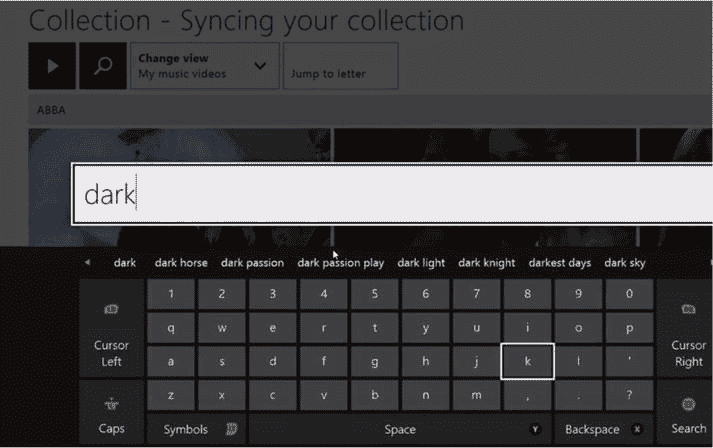

图 2-9.

搜索结果（图 2-10）将显示在屏幕上，你可以使用 Xbox 控制器上的左右控制键浏览列表。找到所需项目后，按下控制器上的 A 键进行选择。

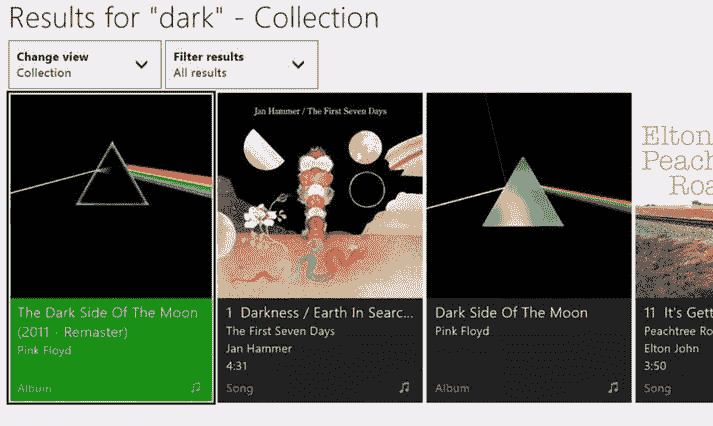

图 2-10.

如果你选择的项目是一张专辑（图 2-11），则可以选择“播放专辑”，顾名思义，它会播放该专辑。

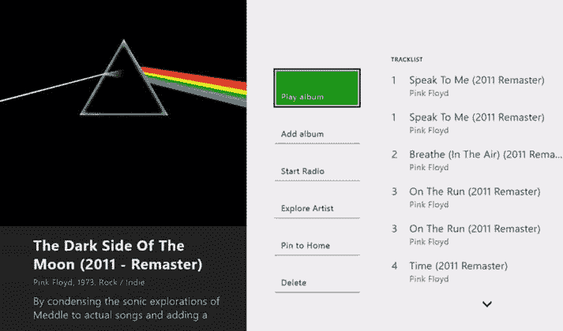

图 2-11.

“添加专辑”按钮允许你将专辑添加到当前的“正在播放”栏、新播放列表或现有播放列表中。

“启动电台”按钮会根据专辑的艺术家创建一个自定义电台。该自定义电台包含该艺术家的歌曲，以及与原创艺术家风格相似的专辑中的歌曲。这是发现新音乐的好方法。

要使用“启动电台”功能，你需要订阅 Groove 音乐通行证。关于订阅的更多信息，请参见第 1 章。

“探索艺术家”按钮允许你播放该艺术家的音乐、基于该艺术家启动电台、将歌曲添加到播放列表或“正在播放”栏，以及将专辑固定到主屏幕。

`固定到主页`会将专辑添加到 Xbox One 的主屏幕，以便你可以快速开始播放该艺术家的歌曲。你也可以在此屏幕浏览你收藏中该艺术家的音乐。此外，你还可以在此屏幕选择从收藏中删除该专辑。

选项按钮的右侧是专辑中的各个曲目；选择一个曲目即可开始播放。

返回搜索结果屏幕后，你可以使用以下选项筛选结果：`All Music`、`Artist`、`Albums`、`Songs`、`Playlist` 或 `Music Videos`。

选择筛选类型后，搜索结果将仅显示与你筛选条件匹配的结果。例如，如果选择 `Playlists`，则仅显示与搜索文本匹配的播放列表。如果选择 `Albums`，则仅显示与搜索文本匹配的专辑。

**注意**：你将在本章稍后部分了解音乐视频选项。

搜索屏幕上的另一个选项是更改视图。你可以在自己的收藏和`Groove Music Service`的目录之间切换。你的收藏由你购买的音乐和你上传到`OneDrive`的音乐组成。`Music Collection`视图包含来自`Groove Music Service`库的音乐。要收听这些音乐，你需要拥有`Groove Music Pass`订阅。

**提示**：即使没有`Groove Music Pass`订阅，你也可以免费收听十首歌曲。

回到`Music Collection`视图，你可以更改音乐显示的顺序。你可以选择`Change View`按钮，然后从`Recently added`、`Music video`或`My albums`中进行选择。`Recently added`按音乐添加到`OneDrive`或购买的顺序显示。`My music videos`显示你收藏中`Groove Music`拥有原版艺术家视频的歌曲。`My Albums`按专辑分组显示你的收藏，而`My artists`按艺术家姓名分组显示你的收藏。

在`Artists`视图中，选择一位艺术家会打开艺术家信息页面，并提供以下选项：`Play my songs`、`Start Radio`、`Add my songs`和`Pin to Home`。`Play my songs`开始播放该艺术家的歌曲，`Start Radio`基于该艺术家启动自定义电台，`Add my songs`将歌曲添加到播放列表，`Pin to Home`将该艺术家固定到`Xbox One`仪表盘的`Home`屏幕。

你还可以向右滚动查看你收藏中该艺术家的歌曲，再次向右滚动查看`Groove Music`目录中该艺术家的歌曲、该艺术家的音乐视频，以及相似和受其影响的艺术家。

**注意**：与应用中其他区域一样，如果显示的音乐不在你的收藏中，你需要拥有`Groove Music Pass`订阅才能收听。

在`Albums`视图中，选择一个专辑会打开专辑页面（图 2-12），你可以在其中播放专辑、将专辑添加到`Now Playing`栏，或将其添加到新的或现有的播放列表。

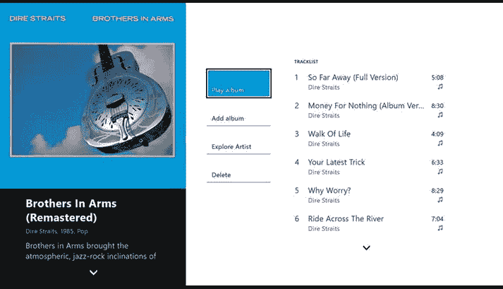

图 2-12. Xbox One 上的专辑页面

如果你的音乐收藏很大，并且想快速找到某首歌曲、某位艺术家或某个专辑，`Jump to a letter`按钮非常实用。只需选择`Jump to a letter`按钮，然后选择一个字母；它会立即跳转到该字母的第一个项目。

如果你想跳转到以 D 开头的专辑（例如 *Dark Side of the Moon*），你应该选择`Change View`按钮，选择`Albums`视图，选择`Jump to a letter`，然后选择字母 D。它会跳转到你收藏中第一个以 D 开头的专辑；然后你可以使用`Xbox One`控制器浏览以找到所需的专辑。

### Now Playing

当你在听音乐时，你处于`Now playing`视图。音乐播放时会显示艺术家的艺术作品。当曲目开始播放以及曲目结束时，它会显示歌曲名称和艺术家姓名。

如果在播放音乐时移动`Xbox One`控制器上的左摇杆，将会调出音乐传输控制，你可以在此执行暂停播放、跳至下一曲目、返回上一曲目等操作。有一个按钮可以打开或关闭`Shuffle`模式（随机顺序播放）。

在此菜单中，你还可以打开或关闭`Repeat`模式。

**信息**：在`Repeat`模式关闭的情况下，`Groove`会确保已播放的歌曲在您选择新的播放列表、专辑或歌曲之前不会再次播放。

此菜单中的另一个选项是调出`Show Song list`。此列表是当前歌曲选择列表，你可以从中查看将要播放哪些曲目。你还可以浏览列表，如果选择一首歌曲，它将停止当前曲目并播放你刚刚选择的曲目。

你可以将歌曲添加到新的播放列表或现有的播放列表。此菜单上的其他选项（通过`More Actions`按钮）包括：探索当前正在播放的艺术家、保存播放列表、基于艺术家启动电台、以及从播放列表中删除歌曲。

回到主音乐菜单以及收藏视图，你有以下选项：`Radio`、`Featured`和`Top music`。

`Radio`部分（图 2-13）显示最近创建的电台以及基于你的音乐库建议的电台。当你选择一个电台时，应用会基于该艺术家及相关艺术家创建一个播放列表。

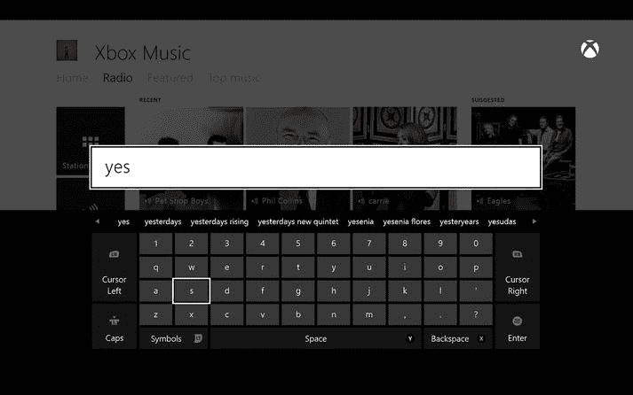

图 2-13. Xbox One 上的`Radio`视图和搜索

另一个选项是创建新电台。选择该选项后，应用会要求输入艺术家姓名。输入姓名后，应用会基于你输入的内容创建一个电台。

`Featured`部分（图 2-14）显示了一组精选音乐，如果你拥有`Groove Music Pass`订阅，则可以收听。这里有新专辑、新视频和搜索按钮。

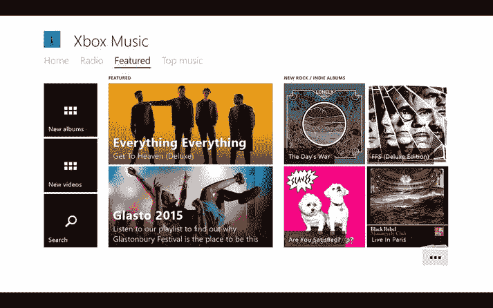

图 2-14. Xbox One 上的`Featured`视图

`Top music`部分（图 2-15）包含了`Xbox Store`中最热门音乐的精选。有一个按钮用于显示热门歌曲，还有一个按钮用于显示收藏中的热门视频。你还可以通过搜索按钮搜索热门音乐。与`Featured`部分一样，你需要拥有`Groove Music Pass`订阅才能收听这些音乐。

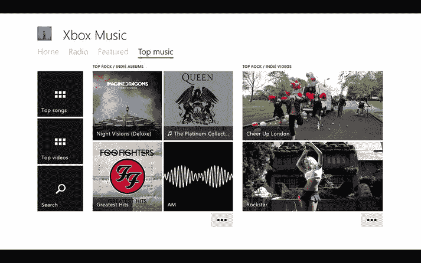

图 2-15. Xbox One 上的`Top music`视图

### Groove Videos

`My Music videos`是`Xbox One`上`Groove Music`的一个出色功能；它通过将你收藏中的歌曲与`Groove Music`目录中的音乐视频进行匹配来工作。每当你在播放音乐时，如果`Groove Music`有匹配的视频，它会播放该视频，而不是像应用通常播放音乐时那样显示艺术家图片。在`Groove Music`的各个位置，你会在歌曲上看到一个小视频图标，表示该歌曲配有视频。

这是一个在其他版本的`Groove`上会很出色的功能，但暂时仅限于`Xbox One`。

## 总结

在本章中，你了解了如何将音乐存储在云端，以便通过微软的`Groove Music`应用和`OneDrive`服务，在手机、平板、笔记本电脑甚至`Xbox One`上随时随地轻松访问。本章还介绍了第三方服务，例如`Google Play Music`和`Dropbox`。在下一章中，你将把注意力转向在`Windows 10`上如何处理视频。

### 3.  观看视频、电影和电视节目

到目前为止，本书主要侧重于如何播放音乐，但根据我们主持每周播客的经验，许多听众的问题都围绕着播放视频及其各种令人困惑的来源、格式和容器。人们通常不明白为什么他们从互联网下载的文件无法播放。

> **信息**
> 来源包括 Netflix 等视频流服务、YouTube 等视频托管服务，以及本地或网络存储设备中的媒体。
> 格式是视频为存储而进行编码的方式。这些通常被称为编解码器（编解码器的简称）。编解码器的例子有 MPEG、WMV 和 MP4，但还有很多其他类型。
> 容器是造成许多困惑的原因。它们本质上是一种将一个或多个媒体文件打包以便播放的方式。

例如，你可以将 DVD 视为一个容器，而且实际上 DVD 可以转换为 ISO 文件以便在 PC 上播放，但一个 DVD 可能包含多种不同类型的媒体，包括音频和视频。

其他媒体容器也是如此，包括流行的 MKV 容器。一个问题是，包括 Windows 10 在内的软件可能声称能播放 MKV 文件，但只有当这些容器包含它们能理解的格式的媒体时，它们才会播放。

Windows 10 在解决这种困惑方面已经做出了很大努力，并且我们发现它在播放一些更冷门的文件类型方面表现更好。我们发现我们下载的大多数文件都能正常播放。一个例外是 DVD 的播放功能已被移除。然而，微软现已发布了一款 Windows DVD 播放器应用（可通过 [`https://www.microsoft.com/en-us/store/apps/windows-dvd-player/9nblggh2j19w`](https://www.microsoft.com/en-us/store/apps/windows-dvd-player/9nblggh2j19w) 付费获取）。第三方应用程序如 VLC（我们将在本章后面介绍）也可以帮助解决这个问题。

Windows 10 还真正有助于控制观看视频流可能产生的费用，尤其是在使用按流量计费的连接（例如移动电话网络）时。

在本章中，你将了解使用 Windows 10 从你自己的收藏、Windows 商店、Netflix 和 YouTube 观看视频的所有不同方式。

你还将了解包括 VLC 在内的其他视频应用如何帮助你观看所有不同格式的视频。

最后，你将了解如何使用 Windows 10 的数据感知应用来监控和控制你在流式传输视频时使用的数据量。

### 电影和电视应用

在本节中，我们将介绍微软在 Windows 10 中的自有视频应用。你将看到如何使用它来播放你自己的视频，以及从 Windows 商店下载的电影和电视节目。

> **信息**
> 微软将 Windows 10 中的视频应用名称从 Windows 8 中的 Xbox 视频更改为电影和电视（或电影和电视，取决于你的区域设置）。例如，在我们所在的英国，它被称为电影和电视，因此我们将以此称呼。只需记住在你的区域它可能被命名为电影和电视。

### 观看已购买的电影和电视节目

你从 Windows 商店购买的电影和电视节目会出现在电影和电视应用的“电影”和“电视”部分（见图 3-1）。因此，如果你进入“电影”部分，你将看到你的电影收藏；如果进入“电视”部分，你将看到你的电视节目。即使你尚未将这些节目下载到你的设备上，电影和电视节目也会显示出来。

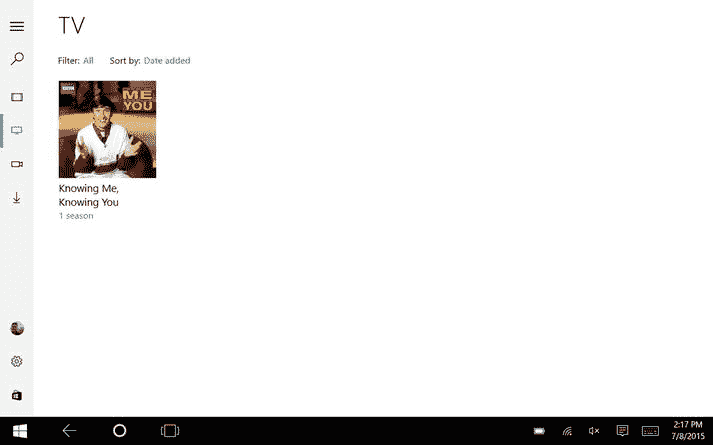

**图 3-1.** 电影和电视应用中的“电视”部分

> **注意**
> 电影和电视应用中“电影”部分的名称也会因区域而异。因此，如果你所在的区域该应用被称为“电影和电视”，那么该部分将被命名为“电影”。

你可以筛选你的收藏，以显示所有视频、仅存储在设备上的视频或仅存储在云端的视频。选择“筛选”选项会弹出一个弹出菜单，你可以在其中选择偏好的选项。

“所有视频”选项顾名思义，显示你所有的视频。“可离线使用”选项仅显示你已下载到设备上的视频。“流媒体”选项仅显示你已购买或租借但不在本地设备上的视频。

你还可以选择按添加日期或按字母顺序（A 到 Z）对收藏进行排序。

点击/轻触某个项目，你将进入电影或电视节目页面（见图 3-2），在那里你可以获取有关该电影或节目的信息。如果你尚未下载该电影或节目，你可以选择播放它或下载它。如果你已经部分播放过该视频，“播放”选项将变为“继续播放”。

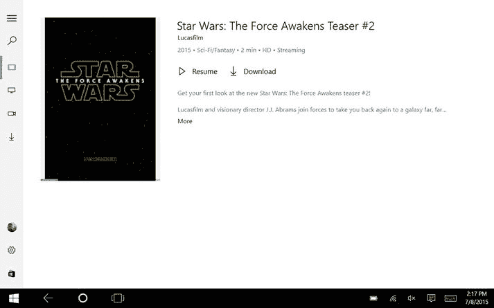

**图 3-2.** 电影信息

如果你播放视频，它将从微软流式传输，视频不会下载到你的设备上。

> **注意**
> 这有时会让用户感到困惑，他们认为从商店购买的任何视频都将始终可以从其设备播放。除非你下载了视频，否则只有在你拥有互联网连接时才能观看。

下载文件会将电影或节目的副本复制到你的设备上，以便随时观看。如果你想在没有网络连接或连接速度较慢时观看电影或节目，这会很方便。例如，如果你要进行长途飞行并想在平板电脑上观看电影，你应该先下载它，这样你就可以在没有网络连接的情况下观看。

当你开始下载电影或电视节目时，你可以通过选择应用中的“下载”部分，然后点击/轻触左上角的“菜单”控件查看下载队列来检查下载进度。你可以从此屏幕暂停、继续或取消下载。

### 设置

该应用提供若干有用的设置，可通过点击应用左侧的 `Settings` 按钮找到。通过 `Download Quality` 选项，您可以设置新下载内容的默认画质。默认情况下，该选项设置为“每次都问”，这意味着每次下载文件时，它都会询问您想要高清还是标清画质。您可以在选项列表中选择标清或高清来覆盖默认设置（见图 3-3 和 3-4）。

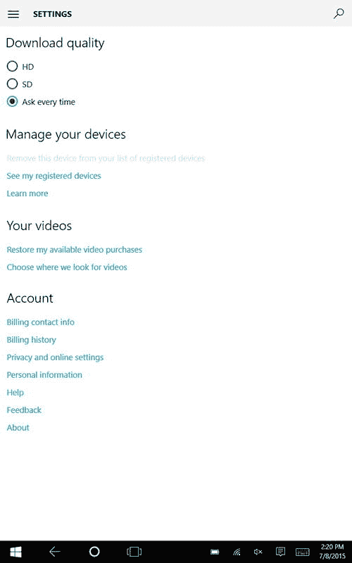

图 3-4. 手机上的影视应用设置

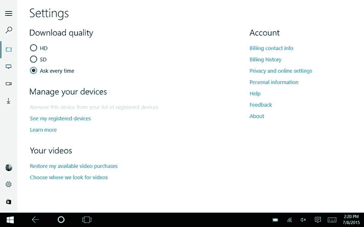

图 3-3. 电脑上的影视应用设置界面

点击“显示我已下载的设备”按钮，会列出已注册为可从您的帐户下载视频的设备。您可以通过前往要移除的设备，在设置中点击“移除此设备”来将其从列表中删除。

电脑版应用（图 3-3）的另一个选项是“选择我们查找视频的位置”。在这里，您可以告诉影视应用您将视频存储在电脑上的位置。默认情况下，应用会查找 `This PC\Videos` 文件夹，您可以通过选择 `+` 按钮来添加其他文件夹。这会打开一个文件夹对话框，您可以在其中浏览文件系统并选择一个文件夹。

**注意**：请记住，当我们提到电脑版时，指的是用于台式电脑以及 8 英寸及以上尺寸的一体机、笔记本电脑和平板电脑的 Windows 10 版本。小于 8 英寸的平板电脑和任何 Windows 手机均使用 Windows 10 移动版。

例如，如果您的电脑上有一个存有视频的第二个硬盘驱动器（在此示例中为 `D:\videos`），您可以执行以下操作：

-   选择 `+` 按钮。
-   从文件夹框中选择 `This PC`。
-   选择 `D:` 驱动器。
-   选择 `Video` 文件夹。
-   点击/轻触“将此文件夹添加到视频”。该文件夹的内容将添加到应用中。

您可以通过点击“选择我们查找视频的位置”对话框中的小 X 将文件夹从应用中移除。

**信息**：如果您从应用中移除一个文件夹，存储在该文件夹中的视频将不再显示在影视应用中。但是，这些视频不会从系统中删除，并且可以随时重新添加回来。

本节中的最后一个选项是“恢复我的视频购买记录”。此选项会将您之前从 Windows 商店购买的任何视频添加到应用的影视部分；它不会下载文件，但您可以将这些视频用于流式播放或下载。

**注意**：只有使用与您当前登录的同一 Windows 帐户进行的购买才会被恢复。不过，这些购买记录可能是在任何其他 Windows 10 设备上进行的，甚至可能是在 Windows 8 或 Xbox 设备上使用 Xbox Video 应用购买的。

### 购买和租赁电影

在 Windows 8 中，Xbox Video 应用包含一个直接在应用内购买或租赁电影的选项。在 Windows 10 中，此功能已移至独立的 Windows 商店应用。

如果您几年前在 Xbox 360 上使用过 Xbox Video，您可能还记得使用 Microsoft Points 作为视频的支付方式。微软已不再使用这些点数，但您需要将支付卡关联到您的 Microsoft 帐户。然后，该卡可用于从 Windows 商店购买任何内容，包括应用、音乐和视频。

**信息**：不必担心；如果您的帐户中还有 Microsoft Points 余额，当微软终止点数服务时，它们会自动转换为本地货币。

当您选择一部视频（无论是电影还是电视节目）时，通常会出现购买或租赁的选项（见图 3-5）。您可能还可以选择标清或高清画质。这些选择取决于节目或电影版权所有者对其的许可方式。

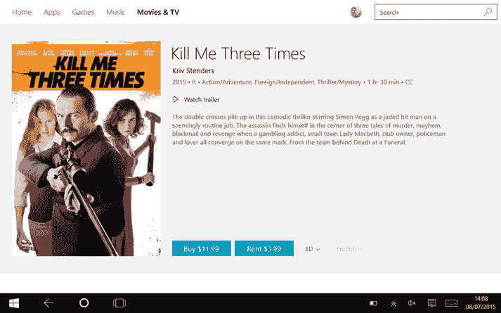

图 3-5. Windows 商店，购买或租赁电影

如果您选择租赁视频，系统会告知您视频可供播放的时长以及您必须开始观看的截止时间。如果您想保留这部电影，您应该选择购买。

我们已经介绍了如何使用微软自己的应用播放和购买电影及电视节目，现在让我们来看看一些第三方观看视频的方式，首先从 Netflix 开始。

### 在 Windows 10 上使用 Netflix

Netflix 是一项电影和电视流媒体服务，通过按月订阅费提供广泛的内容。Netflix 提供了适用于 Windows 10 的专用应用，可从 Windows 商店获取，并可在电脑和手机上运行。

下载应用后，您需要使用您的 Netflix 帐户登录。如果您没有 Netflix 帐户，可以访问 Netflix.com 查看订阅选项。

拥有帐户后，您需要输入用户名和密码进行登录。Netflix 会显示一系列内容，您可以左右滚动浏览 Netflix 内容（见图 3-6）。

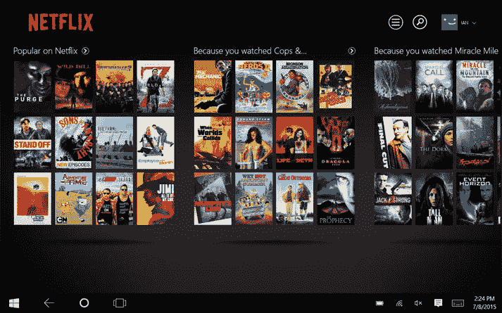

图 3-6. Windows 10 电脑上的 Netflix

当您选择一部电影（见图 3-7）或电视节目时，应用会显示该电影或节目的封面图、内容简介以及演员信息。对于电视节目，它还可能显示其他可供观看的剧集和季的信息。

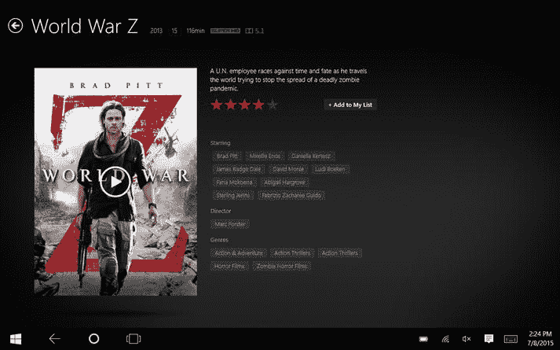

图 3-7. Netflix 上的电影信息

**信息**：对于没有封面图的电视节目和一些电影，将改用节目中的一个场景图代替。

要开始播放，请点击/轻触封面图上的播放图标，应用便会开始播放。您还可以选择将电影或电视节目添加到您的个人列表。点击/轻触 `Add to My List` 按钮可将该标题添加到您的列表中，您可以从应用首页查看该列表。您可以用此功能来构建一个未来想看的电影和电视节目清单。

**信息**：列表的一个好处是它们会在您的所有 Netflix 应用中同步，因此您可以在手机上将一个电影添加到列表，然后它就会出现在您的电脑和 Xbox 上。

您还可以通过选择搜索框并输入搜索词来搜索电影标题、电视节目或演员。然后您可以浏览搜索结果并选择您想要的标题。

Netflix 的另一个不错的功能是您可以为使用您帐户的每个家庭成员创建个人资料，这样您可以为自己和您的孩子分别创建不同的资料。这样一来，Netflix 可以根据每个人的观看记录来推荐内容。

当您在 Netflix 上开始观看内容时，它会记住您在电影或电视节目中的播放进度，因此如果您决定停止观看一部电影并稍后再看，它会从您上次停下的地方继续播放。此功能在包括手机、智能电视和媒体播放器设备在内的所有设备上也都能同步，因此您可以在电脑上开始观看，在手机上继续，最后在 Xbox One 上观看完毕。

**苹果或安卓手机用户**：Netflix 也会在您停止时记住您的进度，并在各设备间共享此信息，这意味着您可以例如在手机上开始观看，然后在您的 Windows 10 设备或其他设备（如 PlayStation 3 或 4 或智能电视）上继续播放。

### 观看 YouTube 视频

另一个绝佳的视频来源是 YouTube，你可以在上面观看各种视频，包括萌猫视频、音乐视频、教学视频甚至完整电影。

要在 Windows 10 上观看 YouTube 视频，只需打开 Microsoft Edge 浏览器，然后在地址栏中输入 `YouTube.com`。

> **信息**  
> Microsoft Edge 是 Windows 10 上取代 Internet Explorer 的新默认浏览器。如果你习惯寻找字母 `e` 图标来找到浏览器，不必担心，因为 Edge 使用的图标与之类似。

你可以在搜索框中输入搜索词，YouTube 会显示匹配的结果列表。

> **注意**  
> Windows 10 上的 YouTube 网站，其运行方式与其它 Windows 版本乃至其它操作系统上的完全相同。如果你以前用过，那么在 Windows 10 上也会感到很熟悉。

现在，你已经了解了如何使用内置的“电影和电视”应用播放视频，以及如何从 Netflix 和 YouTube 这两个最流行的在线服务播放视频。但是，如果你想观看自己的视频呢？嗯，你可以使用“电影和电视”应用，但如果你想要对播放有更多控制，或者“电影和电视”应用不支持你的特定格式，那该怎么办？在下一节中，我们将介绍一些可能有帮助的第三方应用。

## 其它视频应用

你已经看到，Windows 10 内置的播放选项相当不错，但根据我们多年解答听众关于冷门格式问题的经验来看，总会有一些视频文件是 Windows 本身无法播放的。

幸运的是，第三方开发者通常会迅速填补这些空白。你可以在 Windows 应用商店中找到大量视频播放应用。虽然其中许多应用要么功能有限、要么绑定特定的媒体服务器、或者质量不佳，但有一个名为 VLC 的应用，我们觉得非常有用。接下来我们将会介绍它。

### VLC

应用商店中还有许多适用于 Windows 10 的其他视频应用，但有一个应用因其最实用、功能最多而脱颖而出，它就是 VLC。VLC 是一个开源项目，其应用有适用于 iOS、Android、Mac、Linux 和 Windows 的版本。

Windows 10 版本可从 Windows 商店免费获取，并适用于 Windows PC 和移动设备。VLC 的主要优势之一是它能够播放多种文件格式和视频类型，其中一些是 Windows 默认的“电影和电视”应用无法播放的。

要开始使用此应用，请转到 Windows 商店，在搜索框中输入 `VLC`。搜索结果会显示该应用（图标是一个交通锥）；选中它，然后选择“安装”，即可将应用安装到你的设备上。

安装完成后，你可以从“所有应用”列表中找到 VLC 并加载它。

加载 VLC 时，它会自动在你的设备中搜索视频和音乐，这样你就可以通过 `home`（主页）、`videos`（视频）、`music`（音乐）和 `file explorer`（文件资源管理器）标签页浏览你的媒体库（参见图 3-8）。

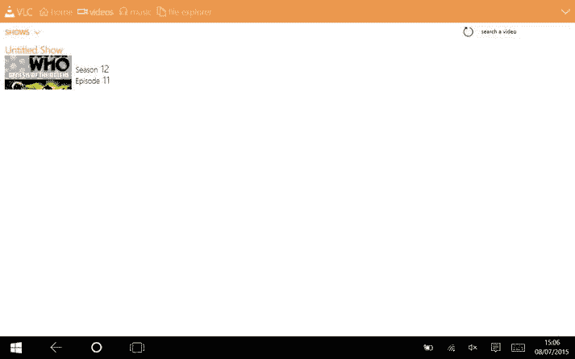

**图 3-8.** Windows 10 上的 VLC

在 PC 上，音乐文件夹的默认位置是 `This PC\Music`，视频内容的默认位置是 `This PC\Videos`。如果你想向媒体库中添加文件夹，请选择屏幕顶部菜单栏上的向下箭头按钮，然后选择“设置”按钮。

要添加文件夹到音乐库，请在“设置”窗格的“音乐库”部分选择“添加新文件夹”按钮（见图 3-9）。浏览到所需文件夹，然后点击“添加”按钮。VLC 就会将该文件夹的内容添加到你的音乐收藏中。

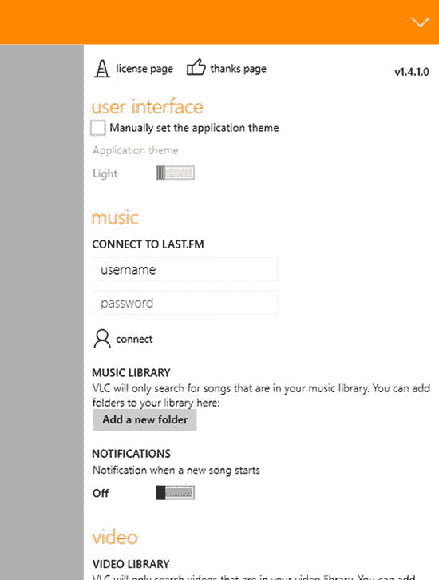

**图 3-9.** 在 VLC 中添加新文件夹

要添加包含视频的文件夹到你的媒体库，请在“设置”窗格的“视频”部分选择“添加新文件夹”按钮。浏览到所需文件夹，然后选择“添加”按钮。VLC 就会将该文件夹的内容添加到你的视频收藏中。

VLC 应用分为四个部分：`home`（主页）、`videos`（视频）、`music`（音乐）和 `file explorer`（文件资源管理器）（参见前面的图 3-8）。

#### 使用 VLC 播放音乐

`home`（主页）标签页会根据你观看或收听内容的频率以及是否将文件标记为收藏，将你的音乐和视频收藏合并到一个视图中。

`music`（音乐）标签页提供按艺术家、专辑、歌曲或播放列表排序（通过左上角的下拉列表查看）展示收藏的选项。

当您设置为艺术家（Artists）模式查看时（图 3-10），您会看到设备上来自这些艺术家的音乐。您可以选择一位艺术家，以显示其所有的专辑和音乐。当你选择一位艺术家时，会出现一个“全部播放”（Play All）按钮，可以播放该艺术家的所有音乐。还有一个“固定”（Pin）按钮，可以将该艺术家固定到 Windows 开始屏幕，以便稍后快速访问。工具栏上还有一个日历图标，用于搜索该艺术家的即将到来的演出。

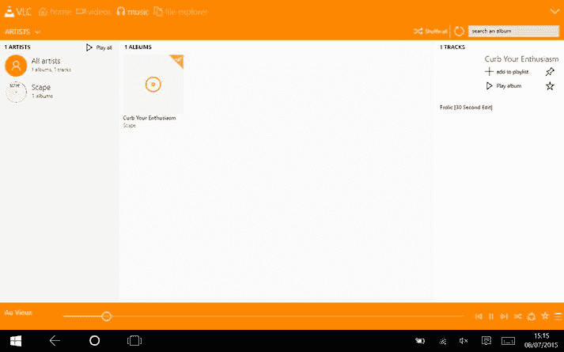

**图 3-10.** 艺术家模式下的 VLC

此外，当你选择一位艺术家时，会显示该艺术家的专辑。选择某个专辑会进入专辑视图，其中列出了专辑中的歌曲。你可以点击/轻触一首歌开始播放。

如果你想收听整张专辑，可以选择“播放专辑”（Play album）按钮。此视图中的其它选项有：“固定”（Pin）按钮，用于将专辑固定到 Windows 开始屏幕；一个收藏按钮，你可以用来将专辑添加到收藏夹；还有一个“添加到播放列表”（Add to playlist）按钮。当你选择“添加到播放列表”时，会弹出播放列表屏幕。在文本框中，你可以输入新的播放列表名称并点击“添加”。它还会显示你已有的播放列表，你可以选择将专辑添加到其中。

当你选择专辑（Albums）视图时，VLC 会按专辑列出你的音乐。点击/轻触一个专辑，会打开专辑信息屏幕（如前所示）。

歌曲（Songs）视图按字母顺序列出你设备上的所有歌曲。通过点击/轻触选择一首歌即可开始播放。

播放列表（Playlist）视图显示你已创建的播放列表。点击/轻触一个播放列表，会打开播放列表菜单，其中有两个选项：“删除”（Delete）或“全部播放”（Play all）。

还有一个“新建播放列表”（New Playlist）按钮，允许你创建一个新的播放列表。

当你使用 VLC 播放音乐时，会看到一个设计精良的“正在播放”屏幕（图 3-11），你可以通过“上一首”、“暂停/播放”和“下一首”按钮来控制播放。你还可以打开或关闭“随机播放”（Shuffle）模式，该模式会随机顺序播放歌曲。另一个选项是“分享”（Share）按钮；通过它你可以通过 Windows 应用（如 Twitter、Facebook 和 OneNote）分享歌曲（应用会分享一个 `last.fm` 链接）。

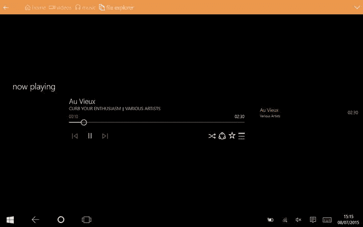

**图 3-11.** VLC 中的“正在播放”屏幕

另外两个选项是收藏按钮和播放列表按钮。收藏按钮会将当前正在播放的歌曲添加到你的收藏夹，而播放列表按钮会显示你当前播放列表中有哪些歌曲。

#### 使用 VLC 播放视频

在 VLC 中选择“视频”选项卡时，您将看到设备上存储的视频集。左侧有一个下拉菜单，您可以在其中选择`视频`、`节目`或`相机胶卷`。

`视频`显示您的电影集，`节目`显示您的电视节目，而`相机胶卷`显示由设备相机拍摄的视频。

播放视频时（图 3-12），点击或轻触屏幕即可调出视频传输控制，您可以移动滑块跳转到正在播放视频的任意位置。

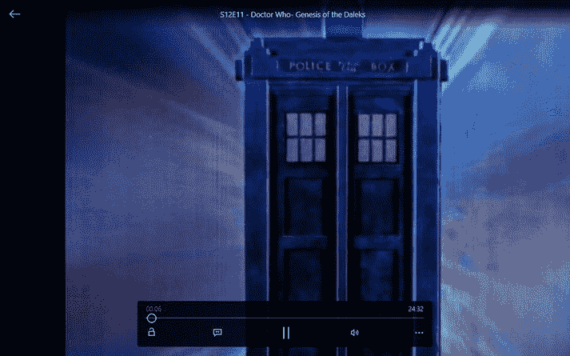

图 3-12. VLC 中的视频播放

“当前播放”屏幕上的其他控制包括一个锁定按钮，用于停用当前播放按钮。下一个按钮提供切换音轨、开启字幕以及选择字幕文件的选项。“音轨”按钮使您能够从不同的音轨中进行选择。（某些电影和电视节目含有多条音轨，您可在此处进行选择。）

**信息**

音轨除了提供不同语言版本外，其主要用途之一还在于导演评论。

字幕按钮使您能够在视频中显示字幕（并非所有视频都带有字幕）。

如果您有与视频存放位置不同的字幕文件，可以使用`选择字幕`选项来浏览并选择字幕文件（通常是 `.srt` 文件）。

同样在“当前播放”视图中，您可以更改视频的播放方式，标有三个点的按钮会弹出一个速度选项，您可以在此增加或降低视频的播放速度。

如需返回主视图，请选择屏幕右上角的`返回`按钮。

#### 文件管理器

VLC 中的另一个视图称为“文件”（见图 3-13）。这使您可以浏览设备上的音乐和视频。有一个下拉选项，您可以在其中选择音乐、视频或文件。

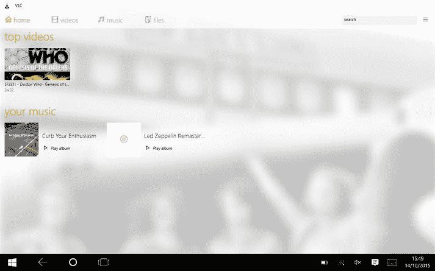

图 3-13. VLC 中的文件

当选择“音乐”时，您可以浏览应用正在监听的音乐文件夹（有关受监控文件夹的信息，请参阅本节第一部分）。如果选择“视频”，它将显示您视频文件夹中的文件。然后您可以选择一个希望 VLC 播放的文件。

如果您选择了一个额外的驱动器（例如 SD 卡或外置硬盘），则可以浏览外部来源中的媒体文件。

#### 其他选项

VLC 在菜单栏中还提供了一些其他选项。选择标题栏中的菜单按钮以显示这些选项。

有一个`文件`按钮，使您能够浏览本地电脑文件系统或手机文件系统中的任意位置的媒体文件。当您选择一个文件后，VLC 将开始播放它。

`流`按钮会打开一个输入框，您可以在其中键入或粘贴音乐或视频流的 URL。

在撰写本文时，VLC 仍在开发中，因此未来可能会增加更多功能。它是一款值得添加到您的收藏中的应用。

### 商店中的其他应用

虽然 Windows 商店中有大量其他视频应用，但其中许多仅仅是网页上电影或节目的链接，或者专门与某种服务器产品关联（例如，我们将在第 6 章中介绍的 Emby）。大多数商店应用都提供试用版，我们始终建议您在购买前先试用。

另一个值得注意的视频应用是 `PressPlay`，这是一款适用于 Windows 10 的视频播放器，可以播放可移动设备上的媒体。它可以播放 MKV 文件和 FLV（Flash 视频），并支持字幕。该应用可从 Windows 商店免费获取。

现在，您已经了解了如何播放自己的视频文件，以及如何使用微软自带的应用程序和流行的第三方服务（如 Netflix 和 YouTube）来流式播放电影。但是，您可能听说过有人带手机出国后产生巨额账单，或者仅仅因为超出家庭宽带限额而被收费。在下一节中，我们将解释 Windows 10 如何帮助您避免此类意外费用。

## 使用流量感知应用

如果您在按流量计费的移动设备上使用 Windows 10，Windows 10 提供了一个应用来帮助您避免来自移动运营商的高额账单。这对于可能消耗大量带宽的视频应用尤其有用。

移动版和桌面版在操作系统的“设置”部分都有一个名为`数据使用量`的选项。这个应用，也称为`流量感知`，会显示已消耗的数据量以及哪些应用在使用数据。

转到“设置”（可从“开始”菜单访问），在“网络和无线”（在电脑上为“网络和 Internet”）部分，您将看到“数据使用量”部分（见图 3-14）。

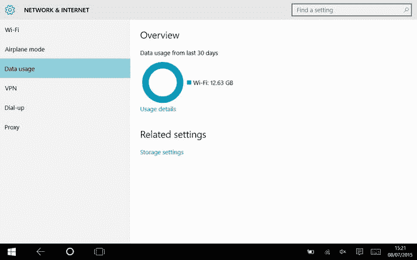

图 3-14. 流量感知概览

在`概览`中（图 3-14），该应用会向您显示通过移动连接消耗了多少数据，以及通过 Wi-Fi 使用了多少数据。

要找出哪些应用使用了数据，请选择“使用详情”。

在“应用使用情况”部分（图 3-15），该应用会显示每个应用使用的数据量，从使用数据最多的应用开始列在列表顶部。

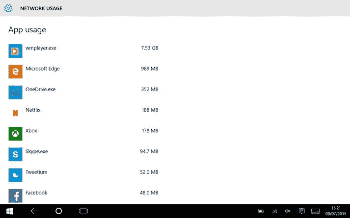

图 3-15. 流量感知中的应用使用情况

使用此应用，您可以查看是观看 Netflix 用完了您所有的数据，还是流式播放音乐占用了您所有的额度。

## 总结

现在，您已经了解了使用 Windows 10 从您自己的收藏、Windows 商店、Netflix 和 YouTube 观看视频的所有不同方式。

您还探索了其他视频应用（尤其是 VLC）如何帮助您观看各种不同格式的视频。最后，我们演示了如何使用 Windows 10 的`流量感知`应用来防止在流式播放视频时产生意外账单。

我们许多人家庭网络中可能既有 Windows 10 设备，也有较旧的设备；在下一章中，您将了解如何利用 Windows 7 和 8 设备以及 Windows 10 上的媒体存储，在家中的各个位置进行流式播放。

