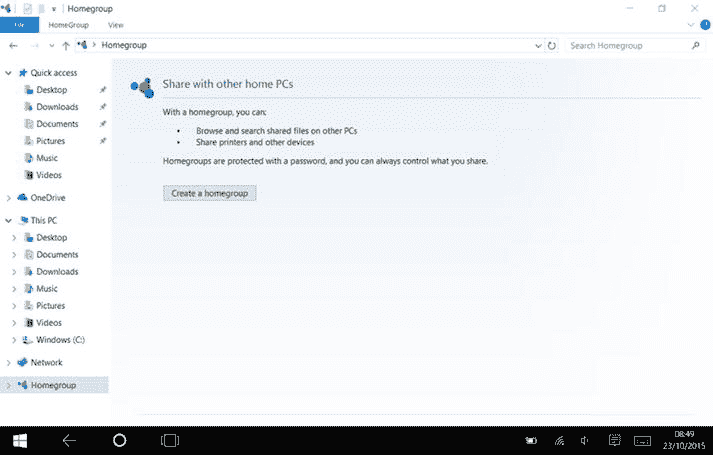
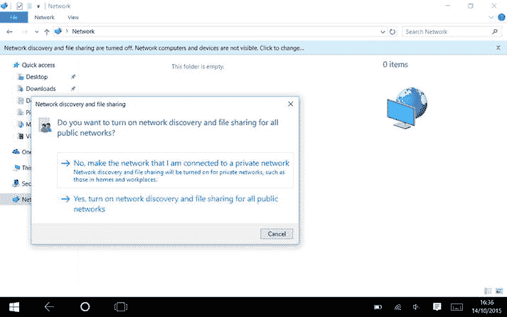
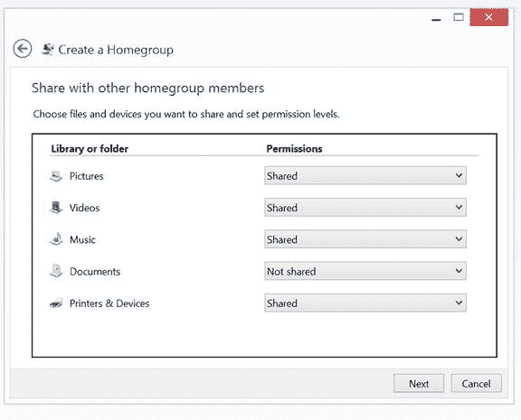
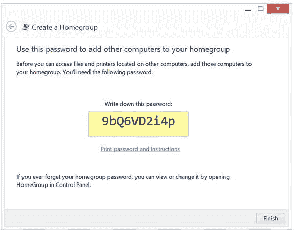
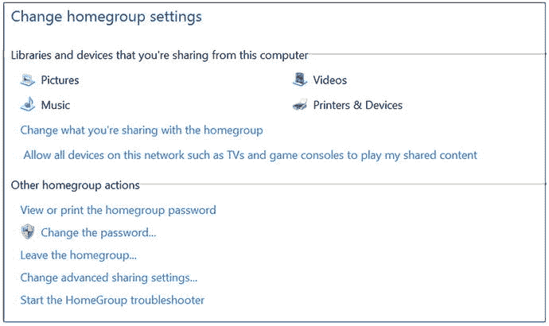

# 设置家庭组

Windows 7、Windows 8.1 和 Windows 10 具备一个名为家庭组的简单网络功能。家庭组是一种基于密码的系统，你可以在网络中的一台电脑上创建家庭组密码，然后在其他电脑、笔记本电脑和平板电脑上加入该组。

那么，要在 Windows 中开始使用家庭组，请打开`文件资源管理器`（在 Windows 7 和 Windows 8.1 中称为`Windows 资源管理器`），在左侧“收藏夹”和“OneDrive”下方，你会看到一个`家庭组`链接（图 4-1）。点击它，如果你尚未在网络中创建家庭组，则可以创建一个。

图 4-1. 设置家庭组

提示

如果你没有看到`家庭组`链接，可能是因为你当前的网络被设置为公用网络，Windows 会通过关闭某些共享功能来保护你的电脑。点击`网络`链接，你可能会看到一个黄色横幅，显示“网络发现和文件共享已关闭。网络计算机和设备不可见。请点击更改…”。

如果你确定自己位于家庭网络中，则可以在专用网络上启用网络发现。为此，请点击黄色横幅并选择“启用网络发现和文件共享”。

然后，一个对话框（图 4-2）会询问你是否要为所有公用网络启用网络发现和文件共享。这将在所有公用网络（例如咖啡馆的公共 Wi-Fi）上启用网络访问，这不是一个好主意，因此你应该选择`否`选项，该选项仅将你当前的网络切换为专用模式，之后你就能访问家庭组和其他网络共享了。

图 4-2. 网络发现

当你点击“创建家庭组”时，Windows 会启动一个向导，引导你完成创建组的过程。点击“创建家庭组”后，单击`下一步`启动向导。

你看到的第一个选项是，你想要与该组中的其他电脑共享哪些文件夹和设备（图 4-3）。

图 4-3. 选择要在家庭组中共享的内容

默认情况下，会共享图片、视频、音乐、打印机和设备，但“文档”文件夹不会共享。你可以点击每个库的下拉选项来更改设置。由于你将使用家庭组进行媒体共享，因此需要共享视频和音乐；点击`下一步`进入下一个屏幕。

设置的最后一个部分会为你提供一个家庭组密码（图 4-4）。这是你回到 Windows 10 电脑时需要使用的密码，因此请记下密码（或打印出来），然后点击`完成`。

图 4-4. 创建家庭组时显示的密码

如果你已经创建了家庭组，那么只要你知道密码，就可以开始使用了。当你回到 Windows 10 电脑时，会需要用到它。

提示

要查看已创建的家庭组密码，你可以前往`Windows 资源管理器`中的`家庭组`链接，右键点击并选择“查看家庭组密码”。

如果你右键点击`家庭组`链接并选择`更改家庭组设置`，你还可以选择更改家庭组密码（图 4-5）。

图 4-5. 家庭组设置

在本章稍后的部分，你将了解如何访问家庭组文件夹中的文件。

