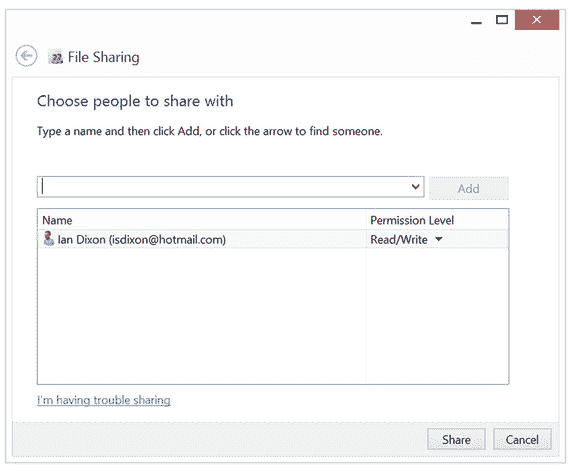

# 设置文件共享

你还可以选择与其他电脑共享单个文件夹。在 Windows 中，你可以通过使用`文件资源管理器`导航到要共享的文件夹来执行此操作。

信息

虽然与家庭组成员共享文件夹更容易，但稍后你将在这部分看到如何与非家庭组成员的电脑共享。

右键点击文件夹并选择“共享”。如果你已经设置了家庭组，你将看到“共享给家庭组 (查看)”和“共享给家庭组 (查看和编辑)”选项。

如果你选择“共享给家庭组 (查看)”，Windows 会将该文件夹添加到使用你的家庭组的电脑可访问的文件夹中；你不必设置特殊的密码或用户名。家庭组中的其他电脑将能够读取该文件夹的内容，但无法进行任何更改。如果你希望他们有权进行更改，则应选择“共享给家庭组 (查看和编辑)”。

此菜单上的其他选项包括`停止共享`和`特定用户`。如果你选择`停止共享`，其他电脑将无法再访问该文件夹。

注意

`停止共享`仅在文件夹已共享时才会出现。

如果你选择`特定用户`，则可以添加一个用户帐户家庭组来使用此选项。

该对话框（图 4-6）显示当前有权访问该文件夹的用户帐户，你可以在用户名框中输入你想要共享对象的用户名/电子邮件帐户。

图 4-6. 与特定用户共享文件

注意

请记住，这仅是与网络上的其他电脑共享，而非通过互联网共享。要做到后一点，你需要使用诸如 OneDrive 之类的工具。

你添加的名称必须是电脑上的现有用户，你才能选中他们。因此，如果 Ian 想要与他电脑上的 Garry 共享一个文件夹，Garry 需要在 Ian 的电脑上拥有一个帐户。其他选项包括`所有人`和`家庭组`。`所有人`意味着网络上的任何其他电脑都能访问该文件夹，即使它们不是家庭组的一部分，这对于包含个人数据的文件夹来说并不理想，但对于媒体文件夹来说是可以的。当你选择某个人或`所有人`时，你还可以设置访问权限。`只读`让他们有权读取文件夹内容，而无法进行任何更改。`读取/写入`则让他们有权读取和更改文件夹内容。

现在，你已经了解了如何在整个网络中共享文件与文件夹，但如果你想将媒体直接发送到另一台设备呢？在下一节中，你将了解如何实现这一操作。

