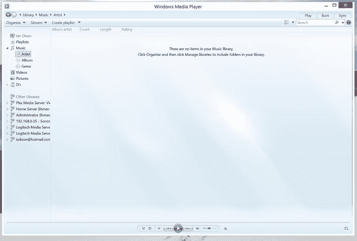
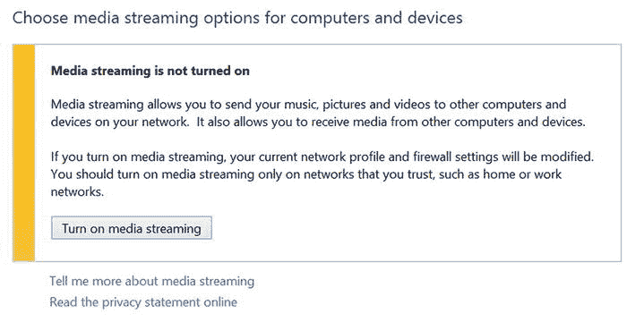

# 设置 Windows Media Player

如果你只想在电脑之间共享音乐和视频，另一种方法是设置媒体服务器。你将在下一章了解两个用于此目的的最佳第三方系统。但对于简单的流媒体播放，你可以使用内置的 `Windows Media Player`。

虽然 `Windows Media Player`（图 4-7）是一个相对古老的程序，而且对于听音乐来说，现代的 `Groove Music` 应用要好得多，但 `Windows Media Player` 可用于向网络上的其他设备提供内容，以及收听家中其他设备上存储的音乐。

图 4-7.

Windows 10 中的 `Windows Media Player`

首先，我们来看一下如何设置媒体共享。

Windows 7、Windows 8.1 和 Windows 10 都内置了 `Windows Media Player`，可以通过点击搜索框并输入 `Windows Media Player` 来找到它。

当你首次加载 `Windows Media Player` 时，它会询问是使用推荐设置还是自定义设置。现在，请选择“推荐”（如果你愿意，稍后可以自定义设置）。该程序会搜索你的“音乐”和“视频”库中的音乐和视频。如果你的媒体文件位于不属于“音乐”或“视频”库的文件夹中，那么将它们添加到 `Windows Media Player` 中最简单的方法就是将该文件夹添加到相应的库中。

**提示**

将文件夹添加到库中很容易。使用 `文件资源管理器`，右键点击该文件夹，选择“包含到库中”，然后选择相应的内容类型（例如，音乐文件夹选择“音乐”，视频文件夹选择“视频”）。将内容添加到库后，`Windows Media Player` 会自动索引这些媒体，并在应用中显示出来。

下一步是在 `Windows Media Player` 中开启媒体流。点击“流”菜单项。如果你已经设置了家庭组（前面讨论过），你的媒体库将与家庭组中的其他设备共享。如果你尚未加入家庭组，该选项将显示为“启用媒体流”（图 4-8）。

图 4-8.

在 `Windows Media Player` 中启用媒体流

当你启用媒体流时，`Windows Media Player` 会弹出一个确认对话框，你需要点击“启用媒体共享”。

下一个屏幕让你控制哪些设备可以访问你的共享库。默认情况下，本地网络上的设备是被允许的。如果你想要明确允许选定的设备，可以取消选中“此电脑上的媒体程序和远程连接...”选项，然后选择你想要授予访问权限的机器。

你还可以为你的库命名；点击“下一步”完成设置。

完成此操作后，这台机器上 `Windows Media Player` 中的音乐将可供你运行 `Windows Media Player` 的其他设备使用。

现在，你已经了解了如何使用家庭组、文件共享以及在 `Windows Media Player` 中进行媒体共享来共享文件。在下一节中，你将看到如何访问这些共享媒体。

