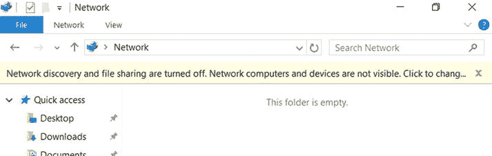
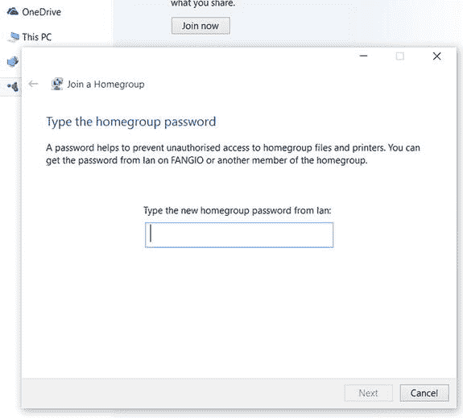
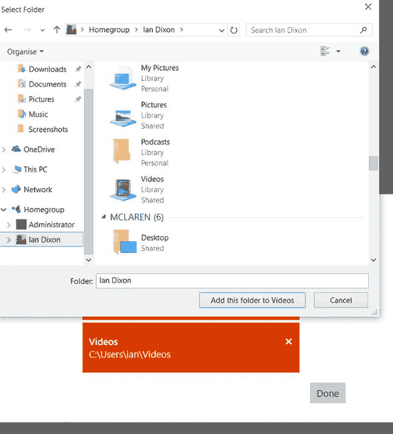
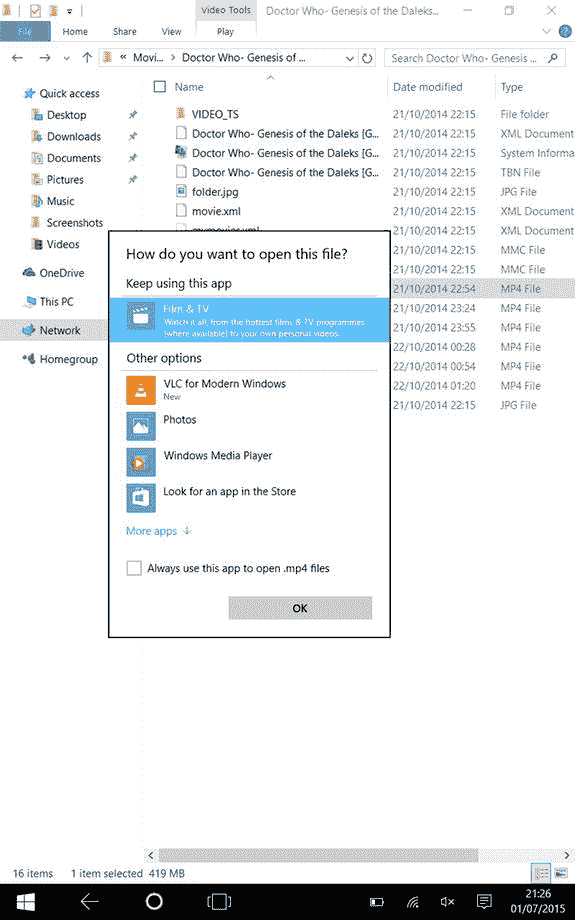

# 从 PC 访问存储在 Windows 7、8.1 和 10 上的内容

在你的 Windows 7、Windows 8.1 和 Windows 10 机器上设置好媒体共享后，你就可以在 Windows 10 电脑、笔记本电脑、平板电脑和手机上访问这些内容了。如何操作取决于你共享媒体的方式。我们先从通过家庭组共享的媒体开始。

### 使用家庭组访问媒体

在家庭网络上设置好家庭组后，你可以在 Windows 10 电脑上加入该网络，然后访问存储在其他电脑上的音乐和视频。

要加入家庭组，请点击“开始”，然后选择 `文件资源管理器`。在 `文件资源管理器` 的左侧，你会看到一个“家庭组”链接。点击它，然后点击右侧的“立即加入”按钮。

**提示**

需要重申的是，当你点击“网络”链接时，可能会看到一个黄色横幅，提示“网络发现和文件共享已关闭。网络计算机和设备不可见。点击更改...”（图 4-9）。

图 4-9.

网络发现提示

这意味着你的电脑连接到了一个它认为是公共网络的网络，因此为了保护你的设备，它会限制对网络上其他电脑的访问。由于这是你的家庭网络，你可以在专用网络上启用网络发现，所以点击黄色横幅，选择“启用网络发现和文件共享”。

然后，一个对话框会询问你是否要为所有公共网络启用网络发现和文件共享。如果你选择此项，它将在所有公共网络（例如，咖啡馆的公共 Wi-Fi）上启用网络访问，这不是个好主意。因此，你应该选择“否”选项，这会将你的当前网络切换到专用模式，然后你就能访问家庭组和其他网络共享了。

点击“立即加入”后，Windows 将启动家庭组向导，所以点击“下一步”开始操作。该向导会询问你想与家庭组共享哪些文件夹，就像之前设置家庭组时一样。默认情况下，图片、视频、音乐和打印机是共享的，而文档则不被共享。你可以通过从下拉列表中选择所需选项来更改此设置；点击“下一步”继续。

然后，系统会提示你输入家庭组密码（图 4-10）。这是你在设置家庭组时创建的密码。输入密码并点击“下一步”；Windows 10 随后将加入该家庭组。

图 4-10.

输入家庭组密码

一旦你加入了家庭组，你可以选择 `文件资源管理器` 中的“家庭组”链接，你会看到你网络上的用户名。点击一个用户名，然后 Windows 会列出网络上的其他电脑和共享文件夹。你可以点击一台电脑，它会显示该电脑上的共享文件夹。例如，你可以从另一台机器浏览共享的视频文件夹，当你看到一个视频或音乐文件时，双击它，Windows 10 就会播放它。

快速访问内容的更简单方法是将远程电脑的文件夹添加到“音乐”和“视频”应用中。

对于视频，请执行以下操作：

- 在 Windows 10 中打开 `电影和电视` 应用。
- 通过应用菜单按钮，进入应用的“设置”部分。
- 点击“选择我们查找视频的位置”选项。
- 这将弹出文件夹对话框，你可以在此选择 `+` 按钮。
- 浏览并选择你想要包含的远程文件夹。
- 在文件夹对话框中，展开“网络”组，并点击包含内容的远程计算机（图 4-11）。将显示远程共享文件夹。

图 4-11.

选择要添加到 `电影和电视` 的文件夹

- 点击视频文件夹（或你共享的包含视频的其他文件夹）。
- 然后点击“将此文件夹添加到视频”。
- 点击“完成”以结束该过程。

对于音乐来说，这个过程几乎完全相同，只是将 `电影和电视` 换成 `Groove Music`。

### 使用 Windows 10 访问共享文件夹

设置好网络共享后，你可以通过几种方式访问其中的内容。你可以通过**文件资源管理器**查看和播放内容，也可以将这些文件夹添加到 Groove 音乐和“电影和电视”应用中。
要通过文件资源管理器访问内容，请从“开始”菜单中选择**文件资源管理器**，然后选择**网络**链接。Windows 将显示你家庭网络中的计算机和媒体设备。
（如果未显示任何设备，则 Windows 认为你处于公共网络中；要更改此设置，请参阅“使用家庭组访问媒体”部分中的提示。）
**信息**
在下一章中，你将了解如何从非 PC 媒体设备访问音乐和视频，因此目前我们将重点讨论如何访问列出的计算机上的内容。
双击你要访问内容的计算机，然后它将显示共享文件夹。如果未显示任何文件夹，则需要按照本章前面的说明进行共享。
当你双击一个文件夹时，它将列出文件夹内容；如果有要播放的视频或音乐文件，只需双击它，Windows 10 将询问你要使用哪个应用来播放该文件。如果文件是视频文件，默认选项将是“电影和电视”（或“影片和电视”，具体取决于你的位置）应用，但对话框将显示其他可以播放该文件的应用（图 4-12）。选择你想要使用的应用，然后它将播放该文件。（Windows 10 的“电影和电视”应用可能是你的最佳选择，但正如你在上一章中所见，VLC 也是一个不错的选择。）如果你不希望 Windows 每次播放文件时都询问使用哪个应用，可以选择“始终使用此应用打开…”选项，Windows 将记住你的选择。

图 4-12. 播放文件
该文件将通过你的家庭网络进行播放。

### 将远程计算机文件夹添加到你的音乐和电影电视应用

如果你经常播放网络中其他计算机上的内容，可以将远程文件夹添加到媒体应用中，这样就不必每次都导航到所需的文件夹了。
要向“电影和电视”应用添加文件夹，请打开该应用并选择**设置**。然后选择“选择我们在何处查找视频”。选择 **+** 按钮，然后使用**资源管理器**窗口，通过**网络**链接导航到包含视频的文件夹。选择你想要的文件夹，然后点击“将此文件夹添加到视频”。然后你可以以相同的方式添加更多文件夹，并点击“完成”。
然后，该应用将索引内容并将其添加到“视频”部分，你可以在其中浏览和播放内容。
你可以在 Groove 音乐应用中进行同样的操作；转到**设置**，选择“选择我们在此电脑上查找音乐的位置”，然后添加你的其他计算机文件夹。
**信息**
如果你将文件夹添加到平板电脑或笔记本电脑，然后将设备带出家庭网络，你将无法访问共享内容。如果你希望这样做，请查看下一章。

## 总结

在本章中，你学习了如何通过 Windows Media Player、文件共享和家庭组在家庭网络上共享媒体。你还了解了在 Windows 10 上使用这些媒体是多么容易。在下一章中，你将了解第三方软件，如果你希望对共享有更多控制权，或者希望流式传输到非 PC 设备（如电视和网络媒体播放器），这些软件将有所帮助。

