# 5. 在家中流式传输媒体

使用 Windows 10，你可以通过名为数字生活网络联盟（DLNA）的标准，从网络上的媒体服务器流式传输音乐和视频。DLNA 是一种经过认证的标准，用于使媒体服务器、媒体播放器和应用程序协同工作。通过 DLNA，你拥有一个媒体服务器和一个称为媒体渲染器的设备。服务器可以是运行 Windows Media Player 的 PC、家中的网络附加存储（NAS）设备，或安装在 PC 上的媒体服务器软件。

在上一章中，你学习了如何将 Windows Media Player 设置为媒体服务器，在本章中，你将了解如何从 Windows Media Player 和家庭网络上的其他媒体服务器进行流式传输。

你还将学习如何使用 Windows 10 将 PC 上的媒体发送到家庭网络上兼容 DLNA 的设备，包括一些第三方软件如何帮助你从 Windows 10 手机进行流式传输。

## 从 DLNA 服务器流式传输到 Windows PC

当你的网络上设置了媒体服务器时，你可以从 Windows 10 PC 流式传输存储在其上的媒体。在上一章中，你已将 Windows Media Player 设置为 DLNA 服务器，你也可以使用 Windows Media Player 通过 DLNA 访问网络上其他 PC 上的内容。

**信息**
DLNA 是一种标准，允许来自不同（或相同）制造商的媒体设备通过网络共享内容。该标准由数字生活网络联盟控制。许多设备支持 DLNA，包括许多智能电视和现代音频系统。

当你在与其它 PC 运行在同一网络上的 PC 上运行 Windows Media Player 时，你将看到其他 PC 共享出的库列表（图 5-1）。
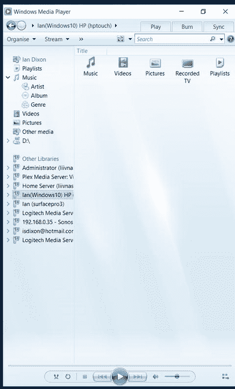
图 5-1. Windows Media Player 访问 DLNA 服务器

**注意**
如果 PC 已在 Windows Media Player 中共享其库（如上一章所述），或正在使用第三方 DLNA 软件（如 Emby，将在下一章讨论），则会显示这些 PC。

除了看到以共享模式运行 Windows Media Player（也称为 WMP）的 PC 外，你还将看到网络上的其他 DLNA 服务器，可能包括 NAS 设备、Sonos 设备和其他媒体服务器。

**信息**
DLNA 基于另一标准：通用即插即用音视频（UPnP AV）。一些制造商生产的 UPnP 设备完全符合 DLNA 标准，但由于涉及许可费用，而不愿称之为 DLNA。这意味着，虽然不能保证，但许多 UPnP AV 设备可以完美地与 Windows 10 的 DLNA 功能配合使用。

如果未看到任何共享库，则可能是其他 PC 未正确配置，或者你当前连接的网络处于“公共”模式，这意味着它将无法浏览和连接到其他设备。请参阅上一章了解如何将网络更改为“专用”模式。

当 Windows Media Player 显示远程设备后，单击你要连接的设备，然后 Windows Media Player 将为你提供选项（图 5-2），从其他 PC 中选择音乐、视频、图片，以及可选的“录制的电视”或“播放列表”。
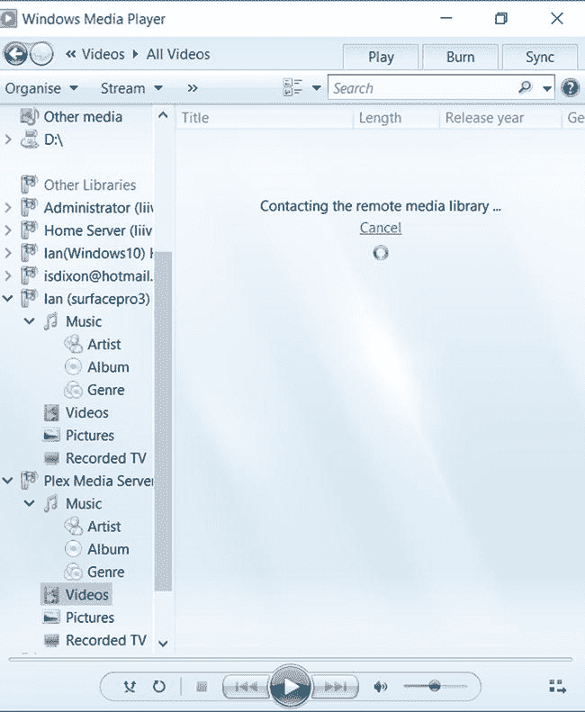
图 5-2. 来自网络 WMP 库的内容文件夹

### 流媒体音乐

要收听音乐，只需双击（或在触摸屏上双击）`Music` 图标。`Media Player` 将连接到远程服务器，并显示用于浏览音乐的图标。视图取决于服务器的配置；如果你连接到运行 `Windows Media Player` 的电脑，通常会看到以下部分选项：`Artist`（艺术家）、`Album`（专辑）、`All Music`（所有音乐）、`Genre`（流派）、`Year`（年份）、`Rating`（评级）、`Contributing Artist`（参与艺术家）、`Composer`（作曲家）、`Parental rating`（家长评级）、`Online Stores`（在线商店）和 `Folders`（文件夹）（图 5-3）。

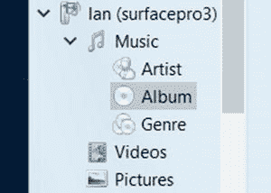

图 5-3. 来自网络化 WMP 库的音乐文件夹

所有这些选项展示了相同内容的不同视图，因此无论你选择哪个视图，都可以访问相同的音乐。

点击 `Album`（专辑）图标，即可按字母顺序查看远程电脑上存储的所有音乐专辑。要收听专辑，请双击它，`Windows Media Player` 将列出所有曲目；双击第一首曲目，`Windows Media Player` 将开始播放歌曲。

在屏幕底部播放音乐时（见图 5-2），你会看到“正在播放”控件。这些控件包括暂停播放和调节音量的按钮。此外，在“正在播放”栏上，还有一个 `Shuffle`（随机播放）按钮，选中后将以随机顺序播放当前音乐选择。另一个按钮是 `Repeat`（重复播放）按钮；如果选中它，应用程序将在当前选择播放完毕后重新开始播放。

你可以随时使用应用程序左上角的 `Back`（返回）按钮返回上一个视图。

如果你右键单击专辑、艺术家或歌曲，将看到以下选项：`Play All`（全部播放）、`Play`（播放）、`Play Next`（下一首播放）、`Cast to Device`（投射到设备）、`Add to`（添加到）和 `Properties`（属性）。

`Play All`（全部播放）会播放当前列表中的所有歌曲，因此如果选择的是专辑，它将播放该专辑中的所有曲目；如果选择的是艺术家，它将播放该艺术家所有的歌曲。

`Play`（播放）选项仅播放选定的歌曲。`Play Next`（下一首播放）会在当前歌曲播放完毕后播放选定的歌曲。

`Cast to Device`（投射到设备）是你将在本章后面了解的内容，它是一种在网络上其他设备（例如 `Xbox One`）上播放歌曲的方式。

`Add To`（添加到）选项用于将歌曲添加到播放列表（有关播放列表的更多信息，请参见第 1 章）。

最后一个选项是 `Properties`（属性），它提供有关歌曲的一些信息。

### 流媒体视频

播放视频与播放音乐类似。从 `Windows Media Player` 的远程服务器列表中，点击包含你要观看的视频的设备，然后双击 `Videos`（视频）按钮。与音乐一样，视频内容也有多种视图，这取决于服务器的配置方式。通常，会有一个 `All Videos`（所有视频）视图，显示远程机器上的所有视频；也可能有 `Actor`（演员）、`Genre`（流派）、`Rating`（评级）和 `Folders`（文件夹）等视图。

双击一个视图，`Windows Media Player` 将列出存储在远程电脑上的视频。

> **注意：** 如果服务器上有大量内容，列表可能需要一些时间才能显示出来。

要播放视频，只需双击它，视频将开始播放。与音乐播放一样，播放视频时，你会在屏幕底部看到“正在播放”控件。其中有 `Pause/Play`（暂停/播放）按钮，以及 `Previous`（上一个）和 `Next`（下一个）按钮、音量控制、`Shuffle`（随机播放）和 `Repeat`（重复）按钮。

在视频模式下还有一个全屏按钮，你可以选择它以全屏播放视频。要退出应用程序，请点击应用程序右上角的红色 `X`；要退出全屏并返回媒体浏览器，请点击屏幕右上方的 `Back`（返回）按钮。

在 `Windows Media Player` 中浏览视频时，右键单击视频将弹出一个菜单。你可以使用以下选项：

*   `Play All`（全部播放）播放该部分中的所有视频。
*   `Play`（播放）播放当前选定的视频。
*   `Play Next`（下一首播放）在当前视频播放完毕后播放选定的视频。
*   `Cast to Device`（投射到设备）使你能够在网络上的另一个设备上播放视频。
*   `Add To`（添加到）将文件添加到播放列表。

## 流式传输到 Windows 10 手机

要从家庭网络上的 DLNA 服务器将媒体流式传输到运行 Windows 10 的手机，你需要使用第三方应用程序。`Windows Store` 中有很多优秀的 DLNA 应用程序，在本节中，你将了解如何使用手机上 `Windows Store` 提供的一个名为 `Smart Player` 的免费应用程序。

`Smart Player` 应用程序分为三个部分：`Sources`（源）、`Players`（播放器）和 `Playlists`（播放列表）。你可以向左或向右滑动来切换部分。

在 `Sources`（源）（图 5-4）部分，你会看到一个媒体源列表，包括 `Google` 和 `YouTube` 等网站，以及家庭网络上的 DLNA 媒体服务器。点击包含你的媒体的服务器，你将看到 `Video`（视频）、`Music`（音乐）和 `Photos`（照片）文件夹。

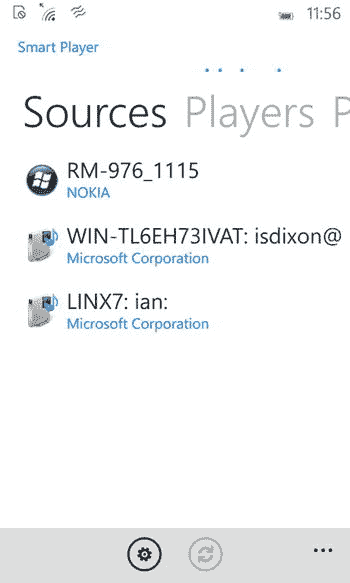

图 5-4. Smart Player 源

要播放视频，请按照以下步骤操作：

1.  选择 `Videos`（视频）文件夹，应用程序将列出服务器上的视频文件夹。
    > **注意：** 列表取决于媒体服务器的设置方式，因此每个服务器的文件夹列表可能有所不同。
2.  点击一个文件夹，应用程序将列出该文件夹中的视频。
3.  点击一个文件，应用程序将列出网络上可用的媒体播放器（图 5-5）。

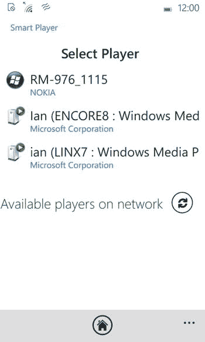

图 5-5. 在 Smart Player 中选择设备

4.  通常你的手机会出现在列表顶部（图 5-5），所以点击它，然后视频将开始流式传输到你的手机。

`Smart Player` 使用 Windows 10 的 `Movies & TV`（电影和电视）应用程序来播放视频，因此你可以获得与播放存储在手机上的视频文件时相同的选项。要返回应用程序，请点击 `Back`（返回）按钮。

播放音乐的方式与视频相同；你从应用程序的 `Sources`（源）部分开始，选择包含你的音乐的服务器。然后选择 `Music`（音乐）文件夹，应用程序将列出远程服务器上包含音乐的文件夹（图 5-6）。文件夹列表取决于服务器的设置，但通常会得到 `Albums`（专辑）、`Artists`（艺术家）、`Folders`（文件夹）和 `All Music`（所有音乐）文件夹。如果你选择 `Albums`（专辑）文件夹，应用程序将列出远程服务器上的所有专辑；如果你选择 `Artists`（艺术家），它将列出服务器上的所有艺术家。

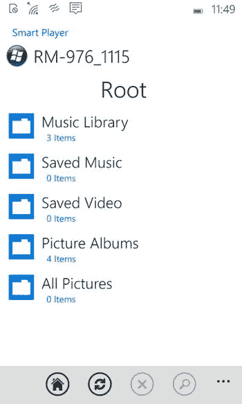

图 5-6. Smart Player 播放列表中的文件夹

当你点击一个包含音乐的文件夹时，它会列出该文件夹中的歌曲。点击一个文件，它会询问你想在哪个播放器上收听音乐。

在这里，你可以选择顶部的选项（通常是你的手机），或者选择家庭网络上的其他媒体播放器。

如果你长按一个包含音乐的文件夹，可以选择播放该文件夹中的所有音乐，或将音乐添加到播放列表。

播放音乐时，应用程序具有 `Previous`（上一首）和 `Next`（下一首）曲目按钮、`Play/Pause`（播放/暂停）按钮以及音量控制。

按 `Home`（主页）按钮返回应用程序的 `Sources`（源）部分。

> **提示：** `Windows Store` 中还有其他适用于 Windows 10 移动版的 DLNA 应用程序；请在商店中搜索 `DLNA`。

## 使用 Cast To 流式传输到 DLNA 设备

Windows 10 内置了 DLNA（媒体流式传输）功能，因此你可以从电脑上选择音乐或视频文件，并将其发送到家庭网络上的其他 DLNA 设备。兼容 DLNA 的设备包括 `Xbox One`、`Sonos` 音乐播放器、Windows 电脑和智能电视。

使用 Windows 10 进行流式传输有两种方式：你可以在 `Windows Media Player` 中使用 `Cast To`（投射到），也可以直接从 `File Explorer`（文件资源管理器）中使用它。

### 在文件资源管理器中

通过文件资源管理器，您可以浏览电脑的文件系统或网络驱动器。右键点击（在平板电脑上长按）音乐或视频文件，您会在上下文菜单中看到`投射到设备`选项。您也可以右键点击包含音乐的文件夹并选择`投射到设备`，这会将文件夹中的所有媒体文件在远程设备上播放。

当您选择`投射到设备`时，会弹出一个列表，其中包含您网络上兼容 DLNA 的播放器（图 5-7）。这可以包括智能电视、媒体播放器和游戏主机。

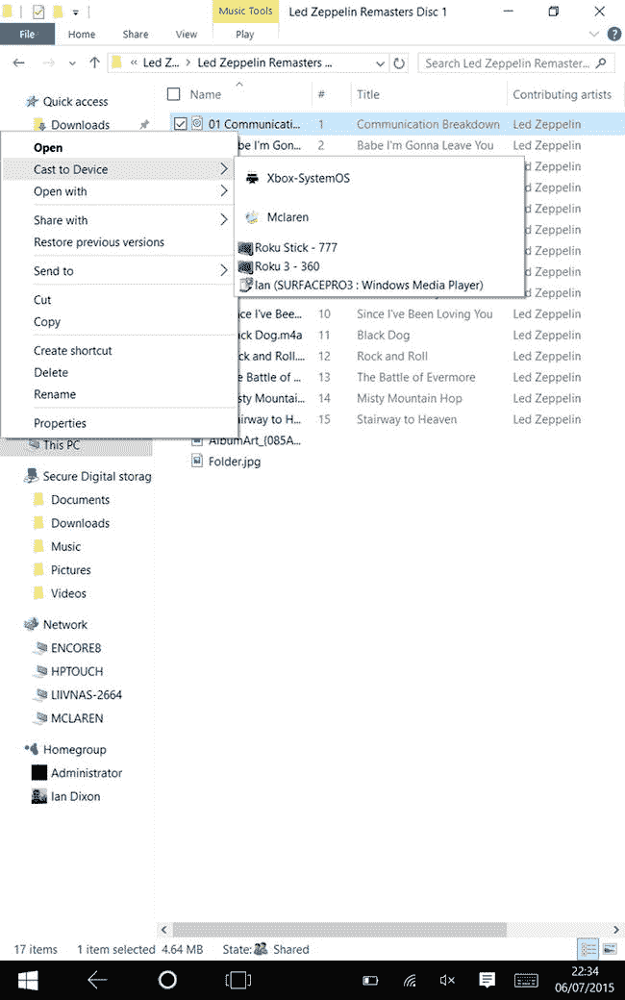

图 5-7. 文件资源管理器中的“投射到”选项

选择您想要播放媒体的设备，然后 Windows 会将音乐或视频文件流式传输到所选设备。随后会显示媒体播放控制，您可以在其中停止或暂停播放，并控制远程设备的音量。此外，在媒体窗口中还会显示远程播放器上当前的播放列表。

### 在 Windows Media Player 中

您可以使用 Windows Media Player 将音乐和视频流式传输到远程设备。通过 Windows Media Player，浏览您的媒体库。当您找到想要在远程系统上播放的专辑、歌曲、艺术家、播放列表或视频时，右键点击它并选择`投射到设备`。与通过文件资源管理器使用该选项类似，会弹出一个菜单，显示您网络上的可用媒体播放器。选择您想要流式传输到的设备，它就会开始在所选设备上播放内容。与从文件资源管理器流式传输时一样，会显示媒体传输控制，您可以停止、暂停和控制播放音量。

### 将 Windows Media Player 作为媒体接收器

除了将音乐和视频流式传输到家中的 DLNA 设备外，您还可以将 Windows Media Player 配置为远程播放器，以便将音乐和视频文件流式传输到您家庭网络上的电脑。

要启用 Windows Media Player 作为媒体接收器，请加载该应用，点击`流式传输`菜单项，然后选择`允许远程控制我的播放器`。这将弹出一个流式传输对话框（图 5-8）。选择`允许远程控制我的播放器`，Windows Media Player 将要求您确认允许远程控制。选择显示`允许在此网络上进行远程控制`的按钮，这将配置 Media Player。之后您就可以将媒体流式传输到该应用了。

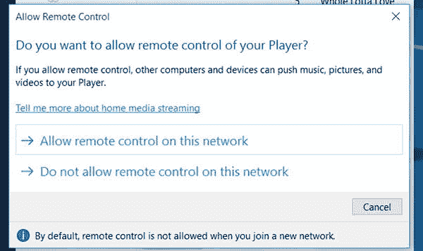

图 5-8. 远程控制 Windows Media Player

您可以通过转到网络上的另一台电脑，并使用 Windows Media Player 按照本章前面所述投射到您的 Windows 10 电脑来测试流式传输。

### 从 Windows 10 手机流式传输

在 Windows 10 的手机版本上，有几种方法可以将视频从手机发送到网络上的其他设备。

要将视频流式传输到支持 DLNA 的设备，您可以使用 Windows 10 Mobile 附带的`电影和电视`应用。我们将在下一节中介绍它。在本节中，您将使用另一个名为`Lumia Play To`的应用，该应用可从 Windows 应用商店免费下载。

微软的`Lumia Play To`应用（图 5-9）可以将手机上的音乐和视频发送到支持 DLNA 的设备，例如 Xbox One 或智能电视。

图 5-9. Lumia Play To 应用注意事项

`Lumia Play To`应用无法播放从 Windows 应用商店购买的内容。如果您想流式传输从商店购买的视频，您需要从`电影和电视`应用中进行；请参阅本章的下一节。

前往 Windows 应用商店，搜索`Lumia Play To`，然后将该应用下载到您的手机上。

运行该应用，您将看到三个选项：照片、视频和音乐（图 5-9）。

要流式传输视频，请点击`视频`按钮。该应用将列出存储在手机上的视频。点击视频，它会显示您家庭网络上可以流式传输到的设备列表（图 5-10）。

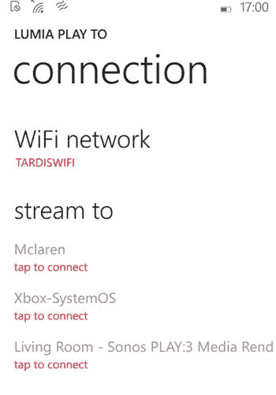

图 5-10. Lumia Play To 中可以流式传输到的设备

一旦您选择了设备，视频将开始在远程设备上播放。手机会显示视频的当前播放位置，您可以通过屏幕底部的传输控制暂停播放。

要更改当前连接的设备，请点击带有三个点的图标，将显示一个弹出菜单。点击`连接`，您可以选择不同的设备进行流式传输（图 5-11）。

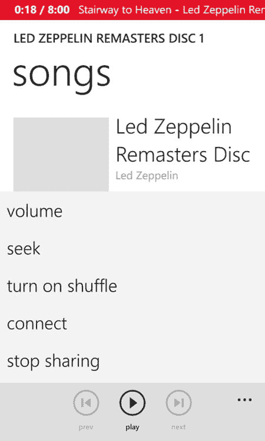

图 5-11. Lumia Play To 中的流式传输选项

您还可以使用该应用流式传输音乐；只需在应用的主屏幕上点击`音乐`按钮即可。该应用会按艺术家排列您的音乐收藏。向左滑动可按专辑显示，再次向左滑动可按歌曲显示。如果再次滑动，您将回到艺术家视图。

点击一个专辑或艺术家会显示歌曲。点击`播放`图标，应用会询问您想流式传输到哪个设备。点击设备，它就会开始播放歌曲。您可以使用屏幕上的传输控制暂停歌曲的播放。

### 使用电影和电视应用投射

另一个能够流式传输视频的 Windows 10 应用是第 2 章中介绍的`电影和电视`应用。使用`电影和电视`应用，您可以浏览您的视频收藏（关于如何查找视频，请参阅第 2 章），然后开始播放视频。

**信息**：`电影和电视`应用的名称因用户所在国家而异。在某些英语国家，它被称为`Film & TV`。

视频开始播放后，会弹出`正在播放`控制。在此屏幕中，您会看到位于应用左下角的`投射到设备`图标（图 5-12 和图 5-13）。

- 点击或轻触此图标，您将看到网络上能够接收视频的媒体流式传输器或 Miracast 设备列表。
- 点击您想要流式传输到的设备，应用将连接到该设备并开始在其上播放视频。

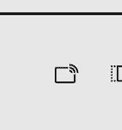

图 5-13. 投射到设备图标

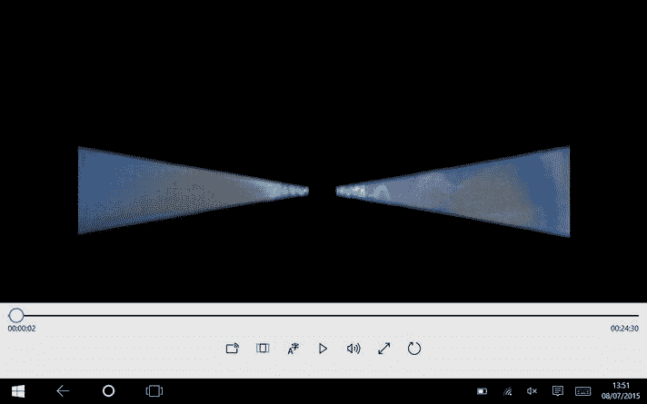

图 5-12. 电影和电视应用中的“正在播放”屏幕信息

**信息**：Miracast 是一种允许通过直接 Wi-Fi 连接流式传输视频的技术。要将其作为选项使用，您的电脑/手机必须兼容 Miracast，并且您必须有一个兼容 Miracast 的接收器。

您可以使用屏幕底部的`正在播放`控制暂停播放并跳转到视频的任何部分。要返回`电影和电视`应用，请点击应用中的`返回`按钮（如果处于平板模式，请向下滑动屏幕顶部的标题栏，然后点击`返回`按钮）。

## 总结

在本章中，您了解了如何使用 Windows Media Player 将媒体流式传输到家庭网络上的 DLNA 设备和其他电脑，并开始了解第三方软件如何辅助流式传输，特别是从 Windows 手机进行流式传输。在下一章中，如果您希望对共享有更多控制权，或希望流式传输到电视和网络媒体播放器等非电脑设备，您将进一步了解相关的第三方软件。

