# 6. 搭建媒体服务器以串流你的内容

到目前为止，本书已经介绍了如何在家庭网络内以及从云端进行媒体串流，但如果你拥有自己的音乐和视频收藏，并希望能够在世界任何地方访问它们，那该怎么办？在本章中，你将了解两种解决方案，它们可以让你在家庭网络内以及通过互联网串流自己的音乐和视频收藏。你将学习如何搭建一台媒体服务器，然后就可以通过家庭网络或互联网在 Windows 10 设备上访问这些内容。

你将学习搭建的两个系统是我们每周播客听众中最受欢迎的两种，它们分别是 Plex 和 Emby。此外还有许多其他选择。我们特别注意到有很多人对一款名为 Kodi 的产品提供支持，这款产品也非常值得一看，但它没有专门的 Windows 10 应用，而 Emby 和 Plex 都有。在本章后面，我们将为你提供一些关于这些其他可用媒体系统的指引。

我们介绍的这两项服务都是第三方系统，并非 Windows 10 的一部分，但服务器是免费的，客户端应用通常也只收取少量费用。

## Plex 媒体服务器

Plex 是一款媒体服务器，旨在成为一个简单的解决方案，用于存储和组织你所有的个人媒体收藏，并将其提供给你各种设备上的 Plex 客户端。你可以将 Plex 媒体服务器安装在存放音乐和视频收藏的电脑上，然后就可以从各种设备（包括 Windows PC、Windows 手机以及 iOS 和 Android 设备）访问你的收藏。Plex 是一个强大且灵活的媒体解决方案，在本节中，你将搭建一个基础服务器，并通过 Windows 10 连接它。

开始使用 Plex 的第一步是在网页浏览器中访问`Plex.tv`并创建一个用户账户。你需要一个账户，以便你的 Plex 媒体服务器和 Windows 10 上的 Plex 应用能够相互通信。

**信息**  
你也可以使用你的 Plex 账户从 Plex 购买功能。你无需为任何功能付费，因为免费版本已经非常强大，但付费选项确实会添加更多功能。你可以访问[`www.Plex.tv`](http://www.plex.tv/)了解更多关于这些选项的信息。

创建好 Plex 用户账户后，你需要下载并安装 Plex 媒体服务器软件。

**注意**  
在本章中，你会看到将其安装在 Windows 10 电脑上，但你也可以将其安装在 Windows Vista、Windows 7 和 Windows 8.1 上。此外，还有适用于 Mac、Linux 和 FreeBSD 的 Plex 媒体服务器安装包。

Plex 媒体服务器软件需要安装在存放你媒体的电脑上，因此，从该电脑的网页浏览器访问[`http://Plex.TV/downloads`](http://plex.tv/downloads)，并下载 Windows 版本。

下载完成后，运行该程序，它将启动 Plex 媒体服务器安装程序。

点击 Install 开始安装。Windows 用户账户控制将要求你确认安装程序可以对你的系统进行更改；点击 Yes 继续安装。

安装程序完成后，点击 Launch 开始配置 Plex。

**注意**  
Plex 的用户界面是基于浏览器的，因此 Plex 将在该电脑上启动默认的网页浏览器并打开配置页面。

首先，你必须同意服务条款（阅读它们可能也是个好主意！）。阅读完毕后，点击条款框底部的 Agree 按钮。

现在，你需要告知服务器你之前创建的 Plex 账户，然后配置你的媒体位置。因此，点击左侧的设置图标，并从菜单中选择 Settings（图 6-1）。

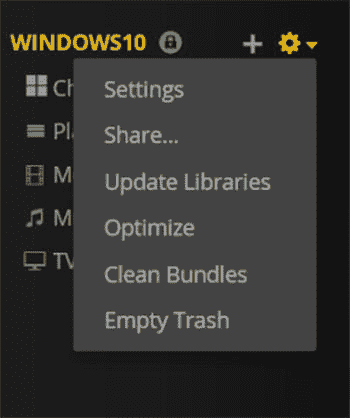

图 6-1. 在浏览器中选择 Plex 中的 Settings

Plex 的设置分为不同部分，第一部分名为 General，你需要在此输入你的 Plex 用户名和密码。将 Plex 账户与你的服务器关联将使 Plex 应用能够通过家庭网络和互联网与你的 Plex 服务器通信。

在相应字段中输入你的 Plex 用户名和密码，然后点击 Sign In。在 General 部分，你还可以为你的服务器命名，这样当你从远程应用连接时，可以轻松识别该服务器。在友好名称框中输入一个名称，然后点击 Update。

在 Remote Access 部分，你应该会看到一个绿色勾选框，表示你的服务器可以从互联网上的 Plex 应用访问到。如果你看到红色的叉，则意味着远程访问不可用。为了帮助你解决此问题，Remote Access 部分提供了故障排除链接。

**信息**  
建议查阅 Plex 文档以获取更多关于设置 Plex 的信息和帮助。

### 向 Plex 服务器添加音乐和视频

一旦服务器启动并运行，你将希望向其添加你的音乐和视频收藏，以便通过 Plex 应用播放它们。

要配置 Plex，请在电脑通知区域右键点击 Plex 应用，然后选择 Media Manager。这将在你的默认网页浏览器中打开 Plex，你需要在此使用你的 Plex 用户名和密码登录。

登录后，你会看到左侧显示你的 Plex 服务器名称；点击服务器名称旁边的`+`图标，然后选择你将添加到 Plex 的媒体类型（图 6-2）。

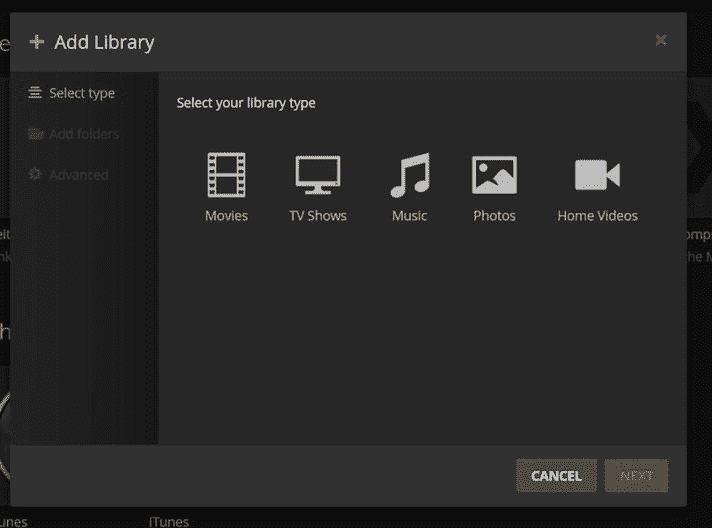

图 6-2. 在浏览器中向 Plex 添加媒体

首先，你将向服务器添加电影。

点击 Movies 图标（图 6-2），然后点击 Next。点击“Browse for media folder”按钮，并选择包含你电影的文件夹。点击 Add 以包含此文件夹。然后你可以重复此过程以添加包含电影的其他文件夹。当你选择了所有需要的文件夹后，点击 Add Library。

现在，你将向 Plex 添加你的音乐收藏。点击`+`图标，选择 Music，然后点击 Next。正如你对电影所做的，点击“Browse for media folder”按钮，选择包含你音乐的文件夹，然后点击 Next。此部分的最后一个屏幕是导入 iTunes 的选项；如果你选择此项，Plex 会将你的 iTunes 音乐播放列表以及评分和播放次数导入到 Plex 中。

点击 Add Library 完成此设置。

**注意**  
你也可以使用前面描述的方法向 Plex 添加电视节目、照片和家庭视频。点击`+`按钮，然后选择你想要添加的库类型，并告诉 Plex 内容所在的位置。

添加内容后，Plex 将扫描你选择的文件夹，并将其添加到系统中以供串流。当你完成库设置后，你的 Plex 服务器就可以开始使用了。

**提示**  
Plex 的妙处之一在于，你可以通过网页浏览器或 Plex 应用远程访问你的 Plex 服务器。Plex 拥有适用于 iOS、Android、Xbox One、Roku、Windows 8.1、Windows 10 和 Windows Phone 的应用。

### 通过浏览器从 Plex 媒体服务器串流到 PC

访问你的 Plex 媒体服务器最简单的方法是通过网页浏览器。打开 Microsoft Edge 网页浏览器，访问[`http://Plex.tv`](http://plex.tv/)，然后点击 Sign In 按钮。输入你的 Plex 用户名和密码，然后点击 SIGN IN。

登录后，点击 Launch 按钮，这将在浏览器中打开你的 Plex 服务器。

#### 播放音乐

如需查看您的音乐收藏，请点击左侧栏中的`音乐`按钮，Plex 会以网格形式展示您的音乐收藏（图 6-3）。

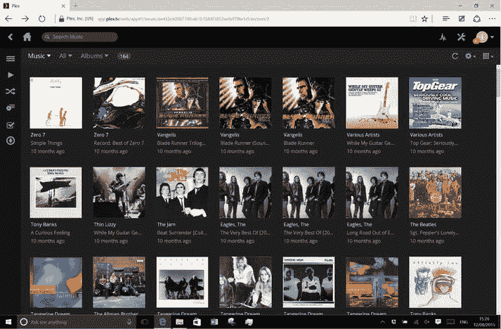

图 6-3. 浏览器中 Plex 的音乐视图

默认视图是`艺术家`，您可以通过在`专辑`、`艺术家`和`曲目`视图之间切换来改变 Plex 显示音乐的方式。要更改视图，请点击当前选中艺术家的下拉列表，然后选择所需的视图。Plex 会在当前选中的视图旁打上勾，并切换显示内容。

如果将鼠标悬停在一位艺术家上，您会看到一个`播放`按钮；点击它即可开始播放该艺术家的音乐。如果点击艺术家，则会显示该艺术家在您收藏中的专辑。点击艺术家的图片将开始播放该艺术家的歌曲。点击专辑封面即可显示专辑中包含的曲目（图 6-4）。要播放整张专辑，请点击专辑图片，或者您也可以点击单首曲目，通过网页浏览器开始播放。

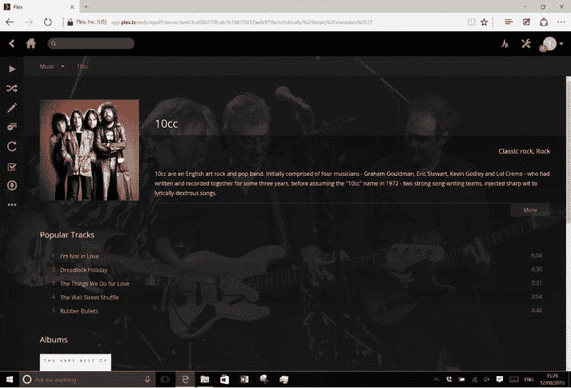

图 6-4. 浏览器中 Plex 的专辑曲目视图

在浏览器底部，您会看到一个"正在播放"栏，其中包含`暂停`、`停止`、下一首和上一首曲目按钮，以及音量控制。

#### 播放电影和电视节目

在 Plex 主屏幕上，点击`电影`按钮即可显示您的电影收藏（图 6-5）。点击电影可调出包含标题、时长、演员信息以及您是否已通过 Plex 设置观看过该电影的电影信息页面。要开始播放电影，请点击电影图片，它便会通过浏览器开始播放。

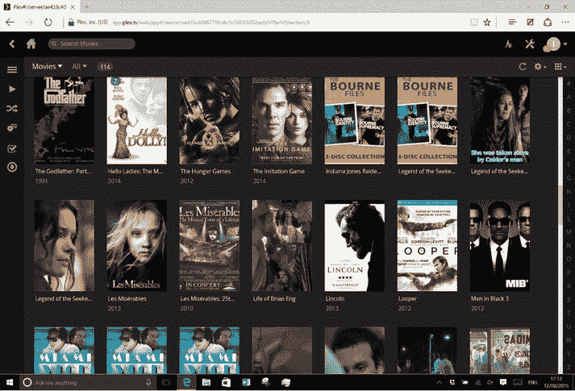

图 6-5. 浏览器中 Plex 的电影视图

**注意：** 如果您之前已开始观看该电影，Plex 会询问您是要从中断处继续播放还是从头开始播放（图 6-6）。

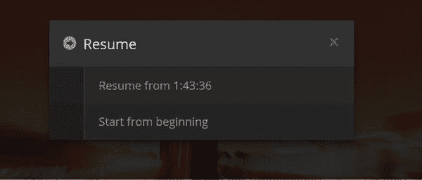

图 6-6. 在浏览器中恢复 Plex 播放

当电影播放时，点击屏幕会调出"正在播放"控件，您可以在其中暂停播放、调节音量以及跳转到视频中的特定位置（图 6-7）。

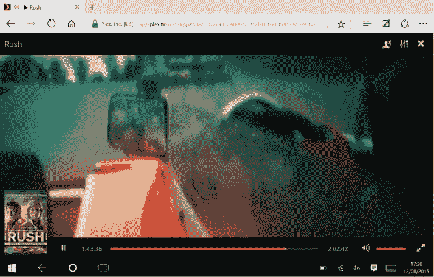

图 6-7. Plex 中的播放控件

在屏幕的右上方，有用于选择电影音频流的按钮、一个视频质量按钮以及一个关闭按钮。使用视频质量按钮，您可以更改视频播放的比特率。较低的比特率会降低画质，但占用更少的网络带宽；较高的比特率则画质更高，但会占用更多带宽。在家庭网络中，带宽可能不成问题，但在互联网上，您可能需要根据网络速度降低画质。点击关闭按钮可返回电影信息页面。

`电视节目`部分（图 6-8）与`电影`视图类似，区别在于 Plex 会将电视剧的各集按季分组。点击一个电视节目可调出该节目的信息以及您收藏中可用的季。

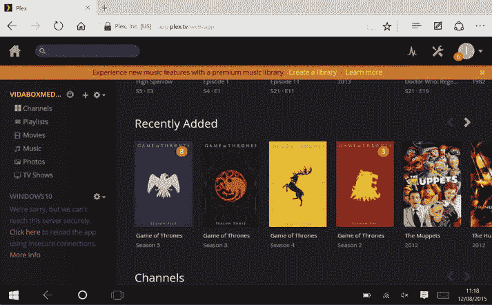

图 6-8. Plex 中的电视节目

点击一季，Plex 将显示该季中的单集。剧集标题旁的黄色圆点（图 6-9）表示您尚未观看该集。一旦您观看过该集，黄色圆点将不再显示。

图 6-9. Plex 中指示未播放的黄色圆点

要播放某一集，请点击它以显示该集的信息。然后点击节目图片开始播放。视频播放期间点击屏幕，会调出与播放电影时相同的控件，您可以在其中暂停播放和控制音量。

### 在 PC 上通过 Plex 应用从 Plex 媒体服务器流式传输

除了网页浏览器选项外，Plex 还提供了可从 Windows 商店获取的专用 Windows 应用。虽然 Plex 媒体服务器是免费的，并且通过网页浏览器使用它也不收费，但 Windows 版 Plex 应用需要通过应用内购买解锁才能使用。

**注意：** 未进行应用内购买的情况下，Plex 应用只会播放一分钟的音乐或视频，如果您想在付费前试用该应用，这没问题。

解锁应用后，您可以使用 Plex 账户登录该应用。此账户即为您安装 Plex 服务器时使用的账户。

**提示：** Plex 是一款通用 Windows 应用。一旦您在 PC 上解锁了它，就无需为 Windows 10 手机版再次付费，反之亦然。

Plex 用户界面分为三个部分：`待播清单`、`媒体库`和`频道`。在应用的右上方有一个服务器选择下拉列表。该列表会显示您当前使用的 PC，并列出您的 Plex 服务器。要从您的服务器流式传输内容，请从列表中选择其名称。如果您希望使用 Plex 播放存储在您当前使用的 PC 上的内容，请选择该 PC 的名称。

起始页上还有一个搜索框；您将在本章稍后部分了解它。

#### 播放电影

要播放存储在 Plex 服务器上的电影，请点击`电影`按钮。应用随后会按字母顺序列出您的电影收藏（图 6-10）。如果您想筛选和排序电影收藏，可以点击筛选图标并选择所需的筛选条件。您还可以从排序列表中选择排序方式。

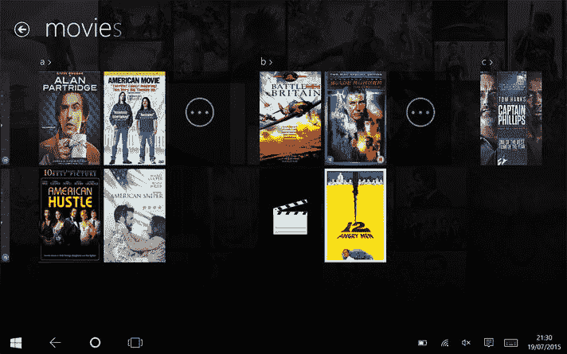

图 6-10. Plex 应用中的电影视图

要播放电影，请点击电影图片，Plex 会带您进入电影信息页面。这里会显示电影信息和摘要。要开始播放电影，请点击`播放`按钮，电影便会开始从服务器流式传输。

**信息：** Plex 的妙处在于，它会记住您已观看了电影的多少内容，然后当您回到 Plex 时（无论是在您的 PC、手机、浏览器还是 Xbox 上），都可以从中断处继续观看（图 6-11）。

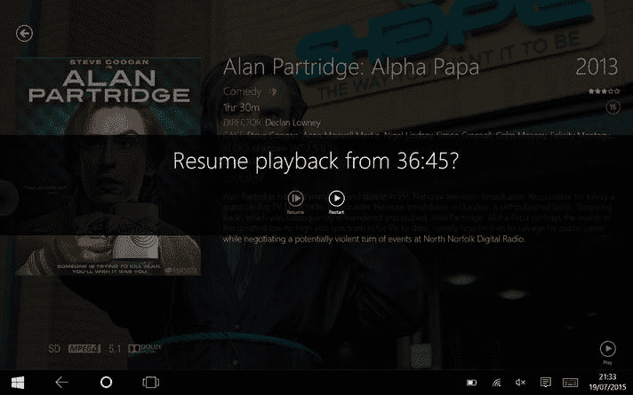

图 6-11. 在 Plex 应用中恢复播放

当视频播放时，点击屏幕会调出"正在播放"控件（图 6-12），您可以在其中暂停播放、使用视频进度条跳转到视频的任何部分，以及通过音量按钮控制电影音量。

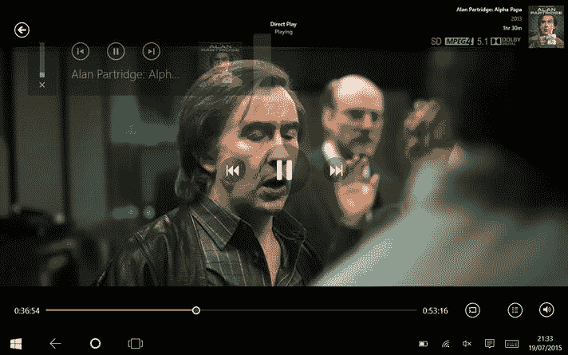

图 6-12. Plex 应用中的播放控件

还有一个选项可以将当前视频播放到您家庭网络中运行 Plex 的其他设备上。当您点击`连接到`按钮时，应用会搜索您网络上的其他 Plex 设备。要在远程设备上开始播放，请点击设备名称；电影将在其他 PC 上开始播放，并且应用会显示远程控件，以便您控制电影的播放。

**注意：** `连接到`选项可用于将视频发送到任何支持 Plex 的设备，而不仅仅是 PC；例如，您可以将其流式传输到 Amazon Fire TV 棒上。

要返回到电影信息页面，请点击`返回`按钮，然后您可以再次点击`返回`回到您的电影列表。

#### 播放电视节目

要播放电视节目，请点击起始页面上的**电视节目**图标。这将像“电影”视图一样列出您的电视节目收藏，但对于电视节目，它会把剧集归纳在一起（图 6-13）。

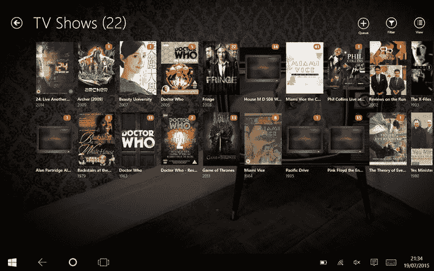

图 6-13. Plex 应用中的电视节目

点击一个电视节目后，将显示该剧的各季内容（图 6-14）。

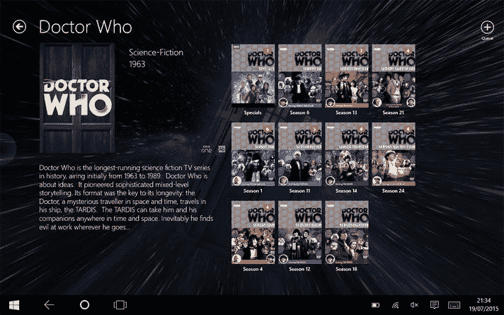

图 6-14. Plex 应用中的电视季视图

随后，您可以选择一季来列出其中的单集。要播放某集，只需点击它。Plex 将显示该集的详细信息，然后您可以点击**播放**按钮开始播放。

在某些剧集上，会显示一个橙色圆圈（图 6-15），这表示您还未观看过这段视频。与播放电影类似，您可以通过“正在播放”控件控制播放，并使用**连接至**按钮将电视节目流传输到您网络上的其他 Plex 应用。

图 6-15. Plex 应用中未播放的橙色指示标记

#### 播放音乐

您还可以通过 Plex 应用播放音乐，只需点击应用首页上的**音乐**图标即可。您的音乐收藏将按字母顺序列出，与电影收藏类似，您可以对收藏进行过滤和排序。要过滤收藏，请点击**过滤**按钮，然后选择过滤条件；您也可以通过点击所需选项来选择排序顺序。

您还可以更改音乐视图（图 6-16）。默认情况下，Plex 按艺术家列出内容，但您可以通过点击**视图**按钮，然后选择所需视图来更改。因此，要按专辑显示您的收藏，请点击**视图**按钮并选择**专辑**。

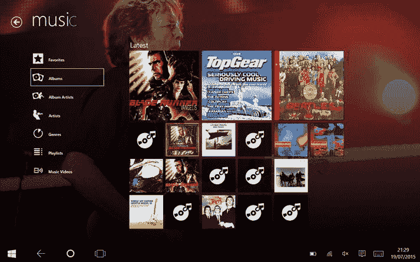

图 6-16. Plex 应用中的音乐视图

要播放专辑，请点击专辑封面，然后点击第一首曲目（图 6-17）。当您播放音乐时，会弹出“正在播放”界面，在此界面中，您可以选择专辑中的另一首歌曲；可以暂停播放、返回上一首曲目或跳到下一首曲目。此外，还有**随机播放**按钮，可以按随机顺序播放当前歌曲列表，以及**重复**按钮，可以在当前歌曲播放完毕后再次播放。

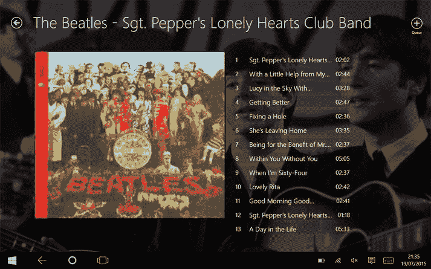

图 6-17. Plex 应用中的专辑视图

另一个功能是**队列**按钮。当您看到该按钮时，意味着您可以将当前选中的项目添加到以下选项之一：

- **现在播放**：立即播放当前项目。
- **随机播放**：清除当前“正在播放”列表，并按随机顺序播放所选项目。
- **下一首播放**：在当前歌曲播放完毕后播放所选内容。
- **添加到下一首**：将所选内容添加到当前播放列表的末尾。
- **添加到播放列表**：将当前所选内容添加到播放列表。

### 使用 Plex 的 On Deck 功能

在 Plex 应用的起始界面上，您会看到一个**On Deck**区域（图 6-18）。其中包含您正在观看的电影和电视节目。每个项目上都有一个进度条，显示您已观看多少内容。点击图片上的**播放**图标，视频将开始播放。如果您点击视频图片，则会跳转到该电影或电视节目的信息页面。

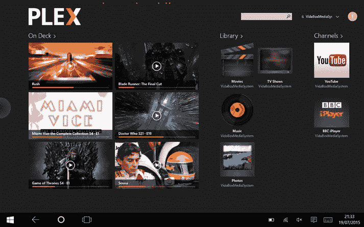

图 6-18. Plex On Deck 功能

Plex 应用的功能远不止本书涉及的这些；您可以访问 Plex.TV 获取更多信息。

## 在 Windows 10 手机上使用 Plex 应用进行流媒体播放

如果您想随时随地访问存储在 Plex 媒体服务器上的媒体，可以使用适用于手机的 Windows 10 Plex 应用。通过手机版 Plex，您可以像在 PC 版上一样访问电影、电视节目和音乐。

首先，从 Windows 商店下载 Plex 应用。与 PC 版一样，从商店安装 Plex 应用是免费的，但只能播放一分钟的音乐或视频。您需要通过应用内购买来解锁完整功能，撰写本书时的价格为 4.99 美元（3.89 英镑）。

> **提示：** 由于 Plex 是一个通用应用，一旦您在手机上解锁，就无需再次为 Windows 10 PC 版付费，反之亦然。

解锁应用后，您需要使用 Plex 账户登录。该账户是您在安装 Plex 服务器时使用的账户。

加载应用后（图 6-19），您会看到以下按钮：

- 资料库
- 频道
- 最近添加
- 播放列表
- 已共享

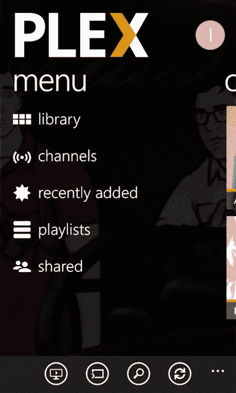

图 6-19. Windows 10 Mobile 上的 Plex

要开始播放内容，请点击**资料库**按钮，应用将显示您每个 Plex 服务器、网络上其他 Plex 应用以及手机自身中的电影、音乐和照片图标。

#### 播放电影

要播放电影，请点击**电影**按钮，应用随后会按字母顺序列出所选服务器上的所有电影，您可以上下滚动查看内容。找到您想看的电影后，只需点击它，就会弹出电影信息页面。点击**播放**按钮即可开始播放。

在“正在播放”界面上，有**播放/暂停**按钮、**后退**和**前进**按钮，以及**连接至**按钮。要将电影流传输到您网络上的另一个 Plex 应用，请点击**连接至**按钮，然后选择您想在哪个设备上观看电影。**连接至**按钮会高亮显示；点击**播放**即可在远程设备上开始播放。

要返回内容列表，请点击**后退**按钮。要返回电影信息页面，请再次点击**后退**，然后再次点击**后退**即可返回到电影列表。

在电影列表中，您可以通过向右滑动切换到**On Deck**和**最近添加**视图。**On Deck**视图显示您正在观看的电影，您可以点击电影并继续观看。**最近添加**视图显示最近添加到收藏中的项目；点击内容会弹出电影信息页面。

> **提示：** 在任何电影视图中，您都可以选择电影的列表顺序。要更改顺序，请点击**排序**按钮，然后选择所需的顺序。

#### 播放电视节目

您可以从主资料库视图中找到电视节目部分。点击**电视节目**按钮后，应用会进入存储在您服务器上的电视节目列表。电影视图与电视视图的区别在于，电视视图会整理出剧集的季和单集。因此，当您点击一个电视节目时，会看到该节目的不同季（图 6-20）。点击某一季，即可列出该季的单集，点击单集即可开始播放。“正在播放”界面与电影版本类似，包含**暂停**和**连接至**选项。

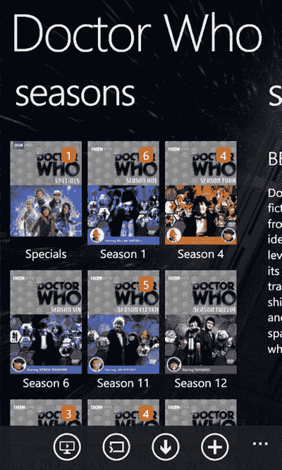

图 6-20. Windows 10 Mobile 上 Plex 的电视季视图

电视视图（图 6-21）同样具有**On Deck**和**最近添加**视图；与电影视图一样，您可以向右或向左滑动来切换视图。

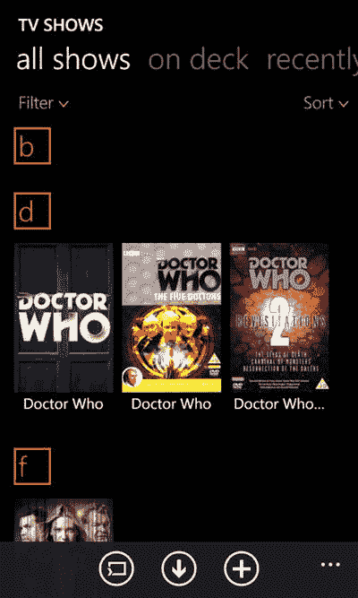

图 6-21. Windows 10 Mobile 上 Plex 的电视视图

#### 播放音乐

在主资料库视图中，轻点带有你想收听音乐的服务器的名称旁的`音乐`按钮，即可进入音乐版块。应用会按字母顺序列出艺术家。您可以通过左右滑动在`艺术家`、`专辑`、`最近添加`和`文件夹`之间切换。

**提示**

若要更改排序顺序，请轻点`排序`按钮，该按钮会显示排序选项列表。轻点您需要的排序选项即可。

当您轻点一位艺术家时，应用会列出该艺术家的专辑。如果您向右滑动，Plex 会显示该艺术家的信息。

轻点一张专辑，Plex 将列出曲目（图 6-22）。轻点一首曲目即可开始播放音乐。

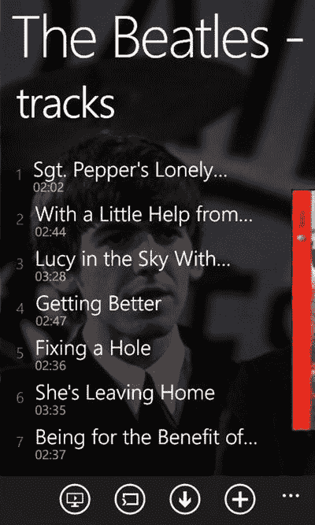

*图 6-22. Windows 10 Mobile 上 Plex 的曲目视图*

在“当前播放”屏幕上，您会看到`播放/暂停`、`上一曲`和`下一曲`按钮，以及`随机播放`和`重复`按钮。还有一个`播放列表`按钮，用于显示您当前的播放列表。

与应用中的电影版块类似，您可以将音乐流式传输到网络上的另一台 Plex 设备。轻点`连接到`按钮并选择您的 Plex 设备。`连接到`按钮将会高亮，然后您可以轻点`播放`，音乐将在远程设备上开始播放。

### 离线播放

Plex 有一个我们非常喜欢的功能，即能够将媒体内容离线保存，以便在没有网络连接时播放。Plex 将此功能称为同步（图 6-23），它适用于音乐、图片、电视剧和电影。

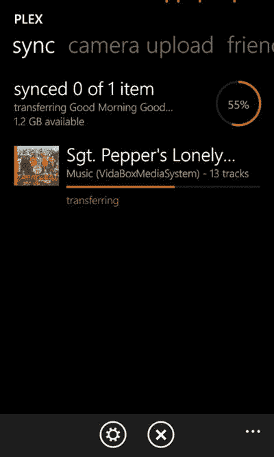

*图 6-23. Plex 中的同步功能*

若要离线保存内容，请在应用中浏览找到一部电影、一部电视剧或一张音乐专辑。当您查看该内容时，轻点`同步`按钮，应用会要求您创建一个新的同步项。您可以设置名称、比特率以及要同步的项目数量。

比特率是指从服务器下载文件的质量。比特率越高，质量越好，但请注意，较高的比特率会占用设备上更多的空间。点击`保存`按钮完成操作，Plex 便会将内容下载到您的设备。

**信息**

您可以通过 Plex 起始屏幕上的`状态`选项来查看 Plex 下载的状态（轻点`…`按钮可查看状态链接）。

在`同步状态`屏幕中，您可以查看已下载的内容以及当前的下载状态。

Plex 是一个强大而灵活的媒体系统，其服务器可在多种平台上运行，客户端则支持 iOS、Android、Windows 和 Xbox One。它拥有的功能远不止我们在此能介绍的这些。此外，还有一个庞大的 Plex 用户在线社区；您可以在网站 `Plex.tv` 上找到关于 Plex 的更多信息。

## Emby Server 入门

`Emby Server` 是一个媒体服务器（原名 `Media Browser`），旨在让您能够将所有媒体内容集中存储和管理，然后从 Windows 电脑、平板电脑、手机以及 Android、iOS、Roku、Chromecast 和其他设备上访问这些内容。它还支持强大的 DLNA 功能（有关 DLNA 的更多信息，请参见第 5 章）。如果您计划在家中使用 DLNA 设备，那么 Emby 是一个实用的服务器解决方案。

Emby 拥有极其丰富的功能，多到无法在此一一列举，因此我们将聚焦于如何上手使用 `Emby Server`，然后从 Windows 10 电脑和手机连接到您的服务器。

### 安装 Emby Server

要开始使用 Emby，您首先需要从 [`http://Emby.media/download`](http://emby.media/download) 下载服务器。

Emby 支持 Windows、Linux、NAS 设备、Mac 和 FreeBSD。在本章中，我们将重点介绍如何在 Windows 电脑上安装它，因此请从下载页面点击`Windows`按钮，并下载最新的稳定版本。

**注意**

除了稳定版，还可以选择下载测试版（图 6-24）。测试版是开发版本，可能包含新功能，但也可能带有错误。除非您有需要测试的内容，否则我们建议使用稳定版。

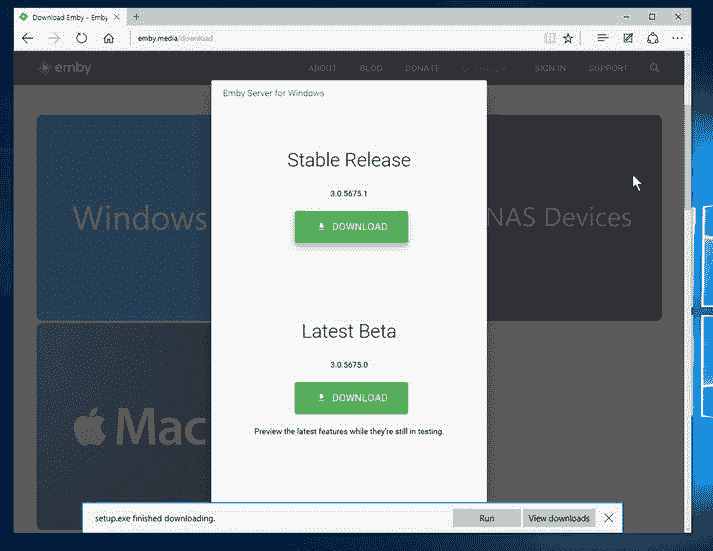

*图 6-24. Emby 网站上的下载选项*

设置文件下载完成后，请运行`setup.exe`。在安装过程中，根据您电脑上已有的软件，系统可能会提示您安装 `Visual C++ 运行时`库（图 6-25）。

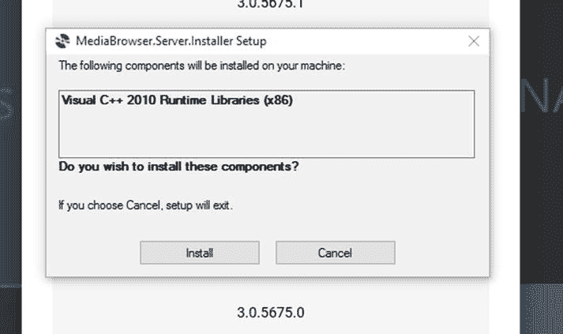

*图 6-25. Emby 需要 Visual C++ 运行时*

这是安装过程必不可少的一部分，您必须安装它才能完成 Emby 的设置。

在安装过程中，系统会提示您确认是否可以安装 Emby，然后 Emby 安装程序会将最新版本下载到您的电脑上。

`Emby Server` 安装完成后，根据您的网络配置，您可能会看到一个`Windows 防火墙`对话框（图 6-26）。这是您的电脑在请求允许 `Emby Server` 与网络上的其他设备通信。如果您将要使用 Emby 应用、DLNA 和其他网络功能，则需要允许访问，因此请点击`允许访问`按钮。

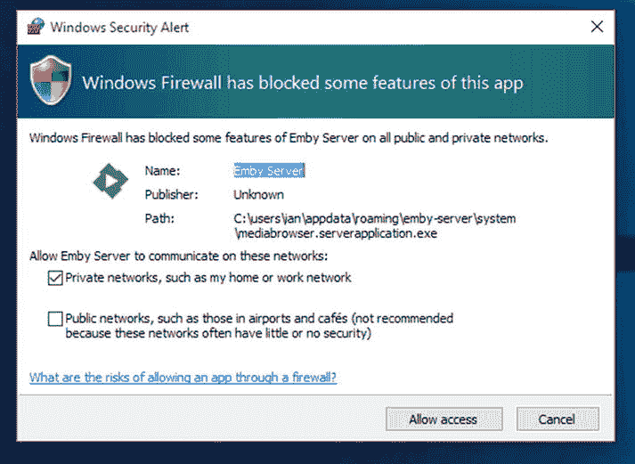

*图 6-26. 允许 Emby 通过防火墙*

安装完成后，您需要配置 `Emby Server`，因此在开始屏幕上点击`Emby Server`（它可能位于`最近添加`部分）。这将启动`Microsoft Edge`浏览器并打开 Emby 配置页面。

您首先要选择首选显示语言；从下拉列表中选择您的语言，然后点击`下一步`。

Emby 支持用户配置文件，因此您家中的每个用户都可以拥有自己的设置、播放统计数据和家长控制（您可以在 [`http://Emby.Media`](http://emby.media/) 上阅读更多相关信息）。现在，我们将设置一个用户，因此在名字框中输入您的名字。

下一步是将您的服务器链接到一个 Emby 帐户；如果您要通过互联网访问您的 Emby 服务器，则需要进行此操作。因此，如果您还没有 Emby 帐户，请前往 [`http://Emby.media`](http://emby.media/) 创建一个。

输入用户名后，点击`下一步`。Emby 会向您注册的电子邮件地址发送一封确认邮件。

安装过程的下一步是告诉 Emby 您的媒体文件在服务器上的位置（图 6-27）。

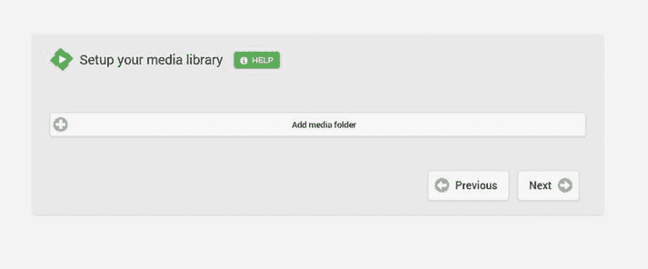

*图 6-27. 在 Emby 中添加媒体*

点击`添加媒体文件夹`按钮。
从`内容类型`下拉列表中选择`电影`。
点击`确定`。
点击`媒体位置`旁的加号按钮。
使用文件导航器选择电脑上存放电影集的文件夹。
点击`确定`。
对音乐、电视剧和图片重复此过程。
添加完所有文件夹后，点击`下一步`。
在下一个屏幕上，您可以保留从互联网下载艺术作品的默认选项，然后点击`下一步`。
再次点击`下一步`，然后选择`我接受服务条款`并再次点击`下一步`。接着点击`完成`以完成服务器设置。

您的 `Emby Server` 设置现已完成，您可以继续使用 Emby 应用了。

