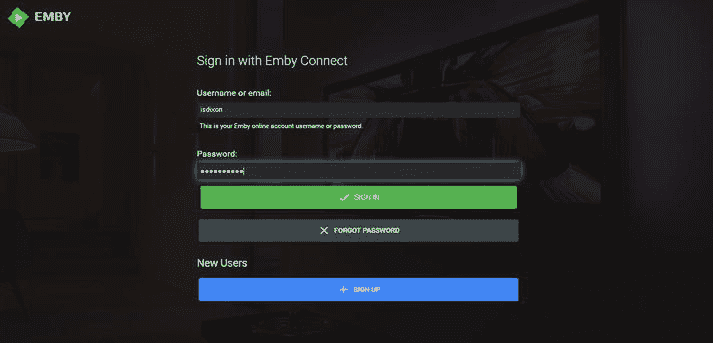
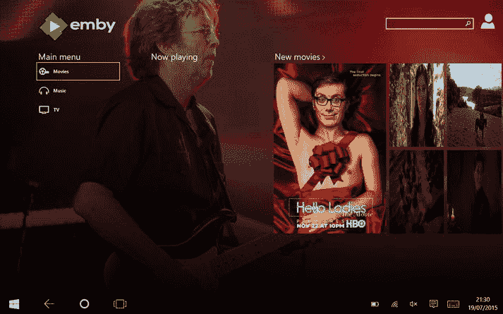
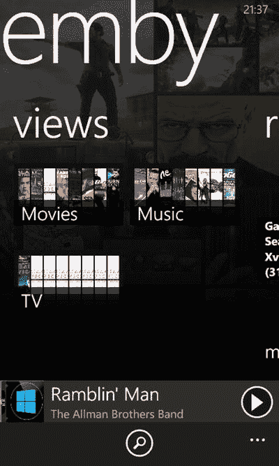

# 在 Windows 10 上使用 Emby 观看和收听

一旦你启动了 `Emby Server`，就可以在设备上使用专门的 `Emby` 应用来观看内容。

`Emby` 的一大优点是，如果你在设置服务器时使用了 `Emby` 账户，那么你可以使用同一账户登录 `Emby` 应用，然后该应用将能自动连接到你的 `Emby` 服务器，无需进行任何额外设置。事实上，你可以通过互联网从家里的服务器上播放电影、电视节目和音乐。

要在 PC、平板电脑或笔记本电脑上开始使用 `Emby`，请前往 Windows 应用商店，搜索 `Emby`，然后安装该应用。如果你只是想看看 `Emby` 是否适合你，可以试用免费版本；该应用的完整售价约为 4.99 美元（3.89 英镑）。

安装应用后，使用你在 `Emby Server` 安装期间使用的 `Emby` 账户登录应用（图 6-28）。

*图 6-28. 登录 Emby*

你可以选择不使用 `Emby` 账户，但那样你就必须手动配置 `Emby` 应用以连接到你的服务器。

登录应用后，你可以输入服务器 IP 详情，或点击已检测到的服务器。

一旦应用连接到服务器，它将显示你最近添加的电影；如果向右滚动，你会看到新的剧集，然后是新的专辑。

在应用的左侧，你会看到用于访问电影、音乐和电视节目的按钮。

`Emby` 应用有一个 `Home`（主页）按钮，可让你返回起始页面。要访问该按钮，如果你处于平板模式，可从屏幕顶部向下滑动；或者从应用左上角的菜单按钮中选择 `App Commands`（应用命令）以显示 `Home`（主页）按钮。

#### 播放电影

要播放电影，请点击左侧列中的 `Movies`（电影）按钮，或者点击起始页面显示的电影之一（图 6-29）。

*图 6-29. Emby 中的电影*

进入电影视图后，会有一些按钮用于更改视图：

- **Latest**（最新）：显示最近添加到服务器中的内容。
- **Suggested**（推荐）：根据你观看过的内容显示电影推荐。
- **All**（全部）：显示所有电影。
- **Genre**（类型）：显示电影类型，例如喜剧和动作片。
- **Favorites**（收藏）：显示你标记为收藏的电影。

`Emby` 应用提供键盘/鼠标操作模式和平板模式。根据你使用的模式不同，屏幕布局可能会有所变化。

当你选择一部电影后，你会看到电影信息屏幕，其中包含剧情简介（在平板模式下，向右滚动可查看详细信息），在主页面上你可以通过点击 `Play`（播放）按钮来播放电影。还有一些电影的附加选项，可以通过点击带有三个点的按钮找到。

此菜单上的第一个选项是 `Play To`（播放至）。使用此选项，你可以将电影从你的 `Emby` 服务器流式传输到家中的 `Emby` 应用或 `DLNA` 设备。

你可能还记得上一章中提到的 `DLNA` 以及如何将内容发送到家中的设备。借助 `Emby`，你可以使用平板电脑或笔记本电脑将存储在 `Emby` 服务器上的电影流式传输到 Xbox One。我们认为这是我们最喜欢 `Emby` 的功能之一。

在 `Emby` 菜单上，有一个 `Mark Watched`（标记为已观看）按钮，它会告知 `Emby Server` 你已经观看过此视频，因此它不会再将其列为新内容。

还有一个 `Favorite`（收藏）按钮，用于将项目标记为收藏，以便它出现在应用中的 `Favorites`（收藏）部分。

`Sync`（同步）按钮使你可以将电影复制到本地计算机，以便在网络断开时离线观看。当你选择 `Sync`（同步）按钮时，会弹出一个菜单，让你设置离线文件的质量；质量越高，文件越大。你还可以通过 `Sync To`（同步到）下拉列表选择要同步到的电脑。

当你播放视频时，“现在播放”屏幕会为你提供一个 `Pause/Play`（暂停/播放）按钮。还有一个 `Audio options`（音频选项）按钮，如果电影有多个音轨，你可以在它们之间切换。此外，还有 `Subtitles`（字幕）按钮（如果可用）可开启字幕，以及音量控制。

你还可以使用屏幕底部的进度条控制跳转到视频的特定部分。

要返回电影屏幕，然后返回电影列表，请两次点击屏幕顶部的 `Back`（返回）按钮。

#### 播放电视节目

在应用的起始页面，点击 `TV`（电视）按钮，应用将列出你的电视节目收藏。

电影和电视的主要区别在于，应用会按季节列出电视节目的剧集。电视部分分为 **Latest**（最新）、**Suggested**（推荐）、**All**（全部）、**Genres**（类型）和 **Favorites**（收藏）。

- **Latest**（最新）：显示收藏中最近添加的电视节目。
- **Suggested**（推荐）：根据你观看的内容显示电视推荐。
- **All**（全部）：列出你所有的电视节目。
- **Genres**（类型）：将你的收藏按类型分组，例如动作、犯罪和喜剧。
- **Favorites**（收藏）：显示你标记为收藏的电视节目。

当你选择一部电视节目后，应用会显示准备好播放的该节目各季节的第一集（在平板模式下，向右滚动）。当你点击一个季节时，它会显示单独的剧集，你可以点击查看剧集详情。点击 `Play`（播放）开始播放剧集。

还有一个带有三个点的菜单按钮，可打开 `Emby` 菜单，其中有一个 `Mark Watched`（标记为已观看）按钮，它会告知 `Emby Server` 你已经观看过此视频，因此它不会再将其列为新内容。

还有一个 `Favorite`（收藏）按钮，用于将项目标记为收藏，以便它出现在应用中的 `Favorites`（收藏）部分。

`Sync`（同步）按钮使你可以将电影复制到本地计算机，以便在网络断开时离线观看。当你选择 `Sync`（同步）按钮时，会弹出一个菜单，让你设置离线文件的质量；质量越高，文件越大。你还可以通过 `Sync To`（同步到）下拉列表选择要同步到的电脑。

当你播放电视节目时，点击屏幕会调出“现在播放”控件，这些控件与播放电影时相同，你可以暂停播放、控制音量以及跳转到视频的任何部分。

#### 播放音乐

要使用 `Emby` 应用播放音乐，请前往应用的起始页面并点击 `Music`（音乐）按钮；应用将列出所有最近添加的音乐。在左侧，你可以选择按专辑、艺术家、类型、播放列表和音乐视频来查看你的音乐。

要播放专辑，请点击 `Albums`（专辑）按钮，你将看到按字母顺序排列的收藏。点击你想播放的专辑，`Emby` 将列出构成该专辑的曲目；点击 `Play`（播放）按钮开始播放该专辑。

专辑视图中的其他控件包括 `+` 按钮，可将专辑添加到播放列表。还有一个艺术家按钮，可显示关于艺术家的信息；与电影和电视节目部分一样，这里也有一个标记为三个点的 `Emby` 菜单按钮。

菜单上的选项包括 **Shuffle**（随机播放）、**Play To**（播放至）、**Favorite**（收藏）和 **Sync**（同步）。

`Shuffle`（随机播放）按钮将随机顺序播放当前选定的歌曲。`Favorite`（收藏）按钮将专辑标记为收藏，以便你以后轻松找到它。`Sync`（同步）按钮使你可以通过将当前专辑的副本复制到设备上，在断开服务器连接时收听该专辑。

当你点击 `Sync`（同步）按钮时，会弹出一个菜单，让你选择要复制到设备上的文件质量；别忘了，质量越高，文件越大。

这里仅仅触及了该应用功能的皮毛；请访问 [`emby.media`](http://emby.media/) 了解更多信息。

### 在 Windows 10 移动版上使用 Emby

除了适用于 Windows 10 电脑的 `Emby` 应用外，还有一个专门为手机设计的 `Emby` 应用。

您可以在手机的 Windows 商店中搜索 `Emby` 找到该应用。该应用可免费试用，但要完全使用，需要应用内购买以解锁所有功能（试用版每天只能播放一个视频）。

首次打开应用时，您可以使用 `Emby` 帐户登录。这将使应用能够自动连接到您的 `Emby` 服务器。

连接成功后，应用会将内容分为音乐、电视节目和电影等部分（图 6-30）。

图 6-30.

Windows 10 移动版上的 Emby

#### 播放电影

要播放电影，请从应用的主屏幕点按 `Movies`（电影）部分（图 6-30）。应用将列出您最近添加到服务器的最新电影。如果您向右滑动，它将按字母顺序列出您的电影。再次向右滑动，将列出您的电影套装合集。再向右滑动一次可查看电影类型，然后再次向右滑动可返回最新的部分。

点按一部电影，将弹出电影信息页面。如果您向右滑动，将看到电影的概述，包括来自 IMDB 的电影评级。再次向右滑动可查看演员信息。

在“电影信息”页面上，您将看到一个 `Add to Favorites`（添加到收藏）按钮和一个 `Play To`（播放至）按钮。

`Play To`（播放至）按钮使您能够将电影从 `Emby` 服务器流式传输到网络上的另一个 `Emby` 客户端或 `DLNA` 设备（如 Xbox One 或智能电视）。

当您点按 `Play To`（播放至）按钮时，它会搜索您网络上的 `Emby` 应用和 `DLNA` 设备。点按您想要播放电影的设备，`Emby` 将开始在远程设备上播放。一旦开始流式传输，应用将变为远程播放器的遥控器。您可以暂停播放并控制远程设备的音量（如果设备支持该功能）。

要在您的手机上播放电影，只需点按电影图片上的 `Play`（播放）按钮即可。

#### 播放电视节目

应用的电视功能与电影部分非常相似，但它会将电视剧集按季整理。当您进入电视部分时，应用将显示准备好播放的下一个电视节目。向右滑动将显示您的电视合集。点按您想看的节目，应用将列出该节目的各季。点按某一季，它将显示该季的剧集。已观看的剧集上会有一个复选标记，表示它们已被看过。

点按一集以显示该集的相关信息。与电影一样，在查看剧集时，您可以使用 `Play To`（播放至）按钮在远程设备上播放视频。

点击 `Play`（播放）按钮开始观看电视节目。当剧集正在播放时，点按屏幕以调出“正在播放”控件。您可以暂停或恢复播放，并且可以使用进度条控制跳转到视频的特定部分。

#### 播放音乐

使用 `Emby`，您可以将音乐从服务器串流到您的手机。首先，点按 `Emby` 起始页面上的 `Music`（音乐）部分。

它将按艺术家列出您的音乐；向右滑动可将其更改为按专辑查看，再向右滑动一次可更改为按歌曲查看。

在 `Artists`（艺术家）视图中，应用按字母顺序列出艺术家，您可以通过点按艺术家的名字来查看他们的专辑。

然后，应用将列出所选艺术家的专辑；点按专辑封面上的 `Play`（播放）按钮，它将开始播放。

在 `Artists`（艺术家）视图中，向右滑动可查看该艺术家的单首歌曲；再次向右滑动可阅读艺术家的简介。

与电影和电视节目一样，您可以使用屏幕底部的 `Play To`（播放至）按钮将音乐发送到家庭网络上的另一个 `Emby` 客户端或 `DLNA` 设备。点按该按钮，它将调出家庭网络上的 `DLNA` 设备和 `Emby` 客户端列表。点按您想要播放的设备；内容将开始在远程设备上播放。

> **提示**
>
> 这里还有一些我们未能涵盖的、非常值得一看的其他功能。请访问 [`http://emby.media`](http://emby.media/) 获取更多详细信息。

### 使用网页浏览器使用 Emby

除了适用于 Windows 10 的 `Emby` 应用外，您还可以免费使用网页浏览器使用 `Emby`，无需在电脑上安装任何东西。

在网页浏览器中，您需要输入运行 `Emby Server` 的电脑的 IP 地址，后跟 `Emby Server` 正在运行的端口。与其试图找出您的 IP 地址和服务器运行的端口，不如通过您的 `Emby` 帐户找到它。

从网页浏览器，访问 [`http://Emby.media`](http://emby.media/)。点击 `Sign In`（登录）并输入您的 `Emby` 用户名和密码。点击 `Sign In`（登录）按钮。点击您的 `Emby` 电脑。

您将看到基于网页的 `Emby` 客户端版本，您可以使用它浏览您的媒体收藏并通过浏览器播放。

> **提示**
>
> 这是一种无需在您的电脑上进行任何设置即可访问您的媒体的简便方法。

`Emby` 拥有我们在此没有提到的许多功能，非常值得研究。它可以流式传输直播电视，可以与 Windows Media Center（在 Windows 7 和 8 上）及其他媒体平台（如 `Kodi`）集成，并且拥有一个非常活跃的社区。请访问 [`http://emby.media`](http://emby.media/) 获取更多信息并加入社区以更深入地参与。

## 其他平台上配置媒体服务器的资源

在本章中，您了解了 Plex Media Server 和 Emby Server，它们是功能强大的媒体服务器，也拥有适用于包括 Windows 10 在内的许多不同平台的客户端应用。在本节中，我们将简要介绍另外两种媒体服务器，它们没有专门的 Windows 10 客户端，但可以在 Windows 10 和许多其他平台上运行。它们绝对值得一看。它们是 `Kodi` 和 `MediaPortal`。

### Kodi

`Kodi` 是一个开源媒体服务器项目，以前称为 Xbox Media Center。它最初是为初代 Xbox 设计的媒体解决方案，现已发展成为一个流行的系统。`Kodi` 可以安装在包括 Windows 10 在内的广泛平台上，并具备媒体管理功能、网络串流和社区插件。要了解更多信息，请访问 [`http://Kodi.tv`](http://kodi.tv/)，您可以在那里阅读其功能说明，并找到下载链接。

### Media Portal

`MediaPortal` 是为个人电脑设计的媒体解决方案。与 Plex 和 Emby 这类客户端-服务器系统不同，`MediaPortal` 是一个一体化的媒体系统，您可以将其连接到大屏幕电视或投影仪。它支持直播电视、录制的电视节目、音乐和电影播放，并且拥有大量的可用插件。请访问 [`www.team-mediaportal.com`](http://www.team-mediaportal.com/) 获取更多详细信息和下载链接。

## 总结

正如您在本章中所见，Windows 拥有广泛、强大且灵活的媒体解决方案，您可以用它们来满足您家中和互联网上的所有媒体需求。哪种解决方案最适合您，将取决于您的具体需求，并且没有任何东西可以阻止您设置多个系统。Ian 在同一台服务器上安装了 Plex 和 Emby，两者和谐共存。

