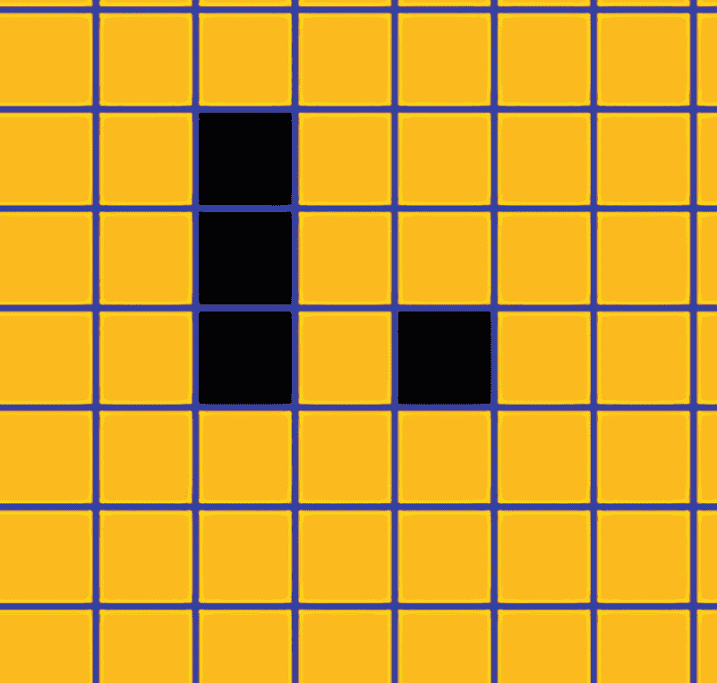
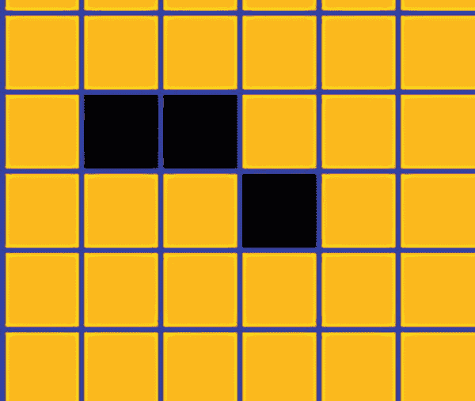
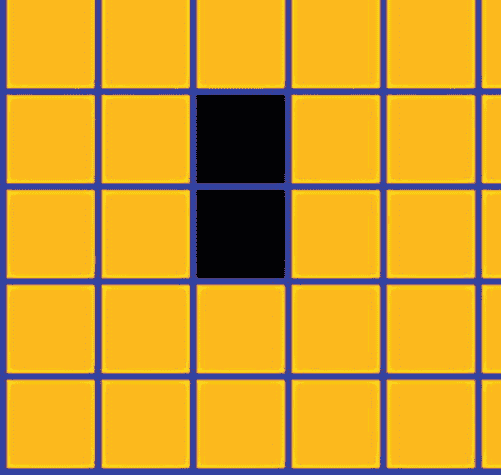
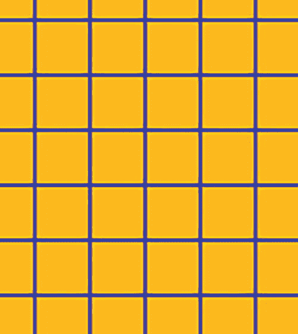
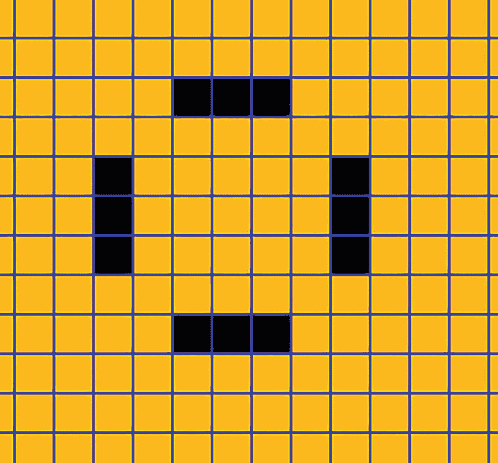
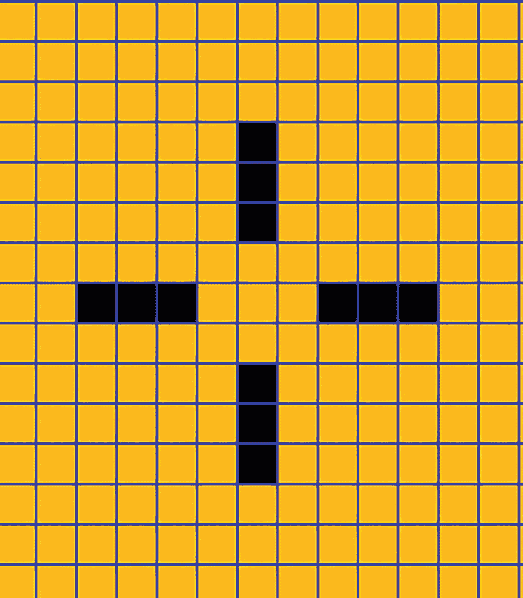
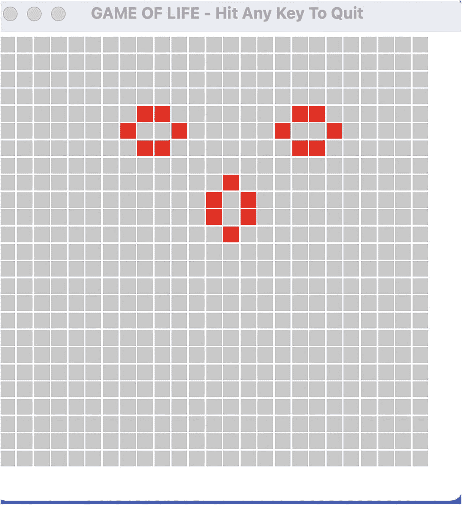
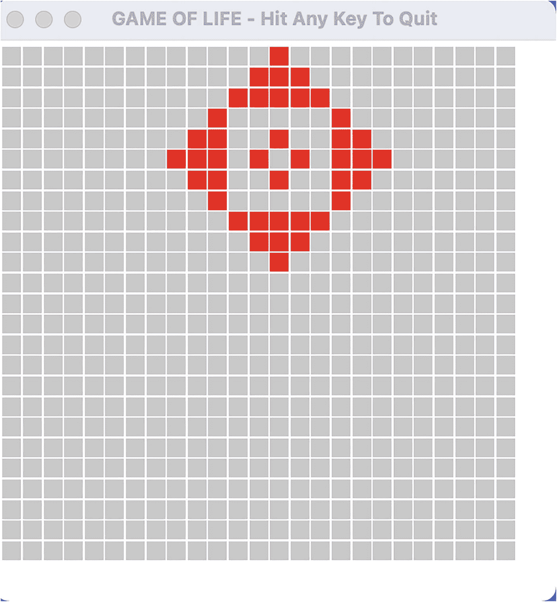

# 4. ADT 实战：生命游戏

在上一章中，我们展示了如何实现抽象数据类型，以及如何在 Go 中进行面向对象编程。在本章中，我们将继续探索 Go 中的面向对象编程。我们将实现经典的“生命游戏”。我们将在实现中引入并使用一个第三方 GUI 包。

在下一节中，我们将详细介绍“生命游戏”。

## 4.1 游戏

为了说明 ADT 在软件设计中可以发挥的核心作用，我们将探索由约翰·康威发明、并于 1970 年由《科学美国人》杂志发表的“生命游戏”。该游戏是一个细胞自动机，设计、实现和观察都很有趣。

除了展示 ADT 在该游戏设计中的核心作用外，我们还将介绍 Go 中的 `fyne` 图形用户界面（GUI）框架。

我们从具有 R 行和 C 列的空网格开始。在随机位置创建活细胞簇。然后，网格演化的内部规则开始生效，用户可以每隔一秒观察一次连续网格的演化过程。


### 网格细胞演化规则

生成下一代网格细胞的演化规则如下：

1.  任何拥有零个或一个邻居的活细胞都会死亡（在下一代中从网格中消失）。
2.  任何拥有四个或更多活邻居的活细胞都会死亡（在下一代中从网格中消失）。
3.  任何拥有两个或三个活邻居的活细胞都会存活到下一代。
4.  任何恰好拥有三个活邻居的空细胞都会在下一代变为活细胞。

让我们从图 4-1 开始考虑游戏的演化。



*初始配置示意图显示了一个由 7 行 7 列方格组成的正方形网格。从第二行开始的第三列中有三个方格被着色。第四行第五列中有一个方格被着色。*

**图 4-1** 初始配置

下一代演化成图 4-2。



*第一次迭代示意图显示了一个由 5 行 6 列方格组成的正方形网格。从第二列开始的第二行中有两个方格被着色。第三行第四列中有一个方格被着色。*

**图 4-2** 第一次迭代

在此，两个细胞被激活（最右边的细胞和最左边的细胞），一个细胞存活下来（右起第二个细胞）。其他细胞则死亡。

然后，下一代演化成图 4-3。



*第二次迭代示意图显示了一个由 5 行 5 列方格组成的正方形网格。从第二行开始的第三列中有两个方格被着色。*

**图 4-3** 第二次迭代

最后，在最后一次迭代中，配置演化成图 4-4。



*最终迭代示意图显示了一个由 6 行 6 列方格组成的正方形网格。*

**图 4-4** 最终迭代

随着生命游戏的演化，会出现非常有趣的模式。有时，振荡会永远持续下去。图 4-5 和图 4-6 提供了一个示例。



*振荡最终配置示意图显示了一个由 13 行 13 列方格组成的正方形网格。第三行的第 6、7、8 列中有 3 个方格被着色。第九行的第 6、7、8 列中有 3 个方格被着色。第四行的第 5、6、7 行中有 3 个方格被着色。第十行的第 5、6、7 行中有 3 个方格被着色。*

**图 4-6** 振荡的最终配置



*振荡初始配置示意图显示了一个由 15 行 13 列方格组成的正方形网格。从第四行到第六行以及从第十行到第十二行的第七列中有六个方格被着色。从第三列到第五列以及从第九列到第十一列的第八行中有六个方格被着色。*

**图 4-5** 振荡的初始配置

随着游戏的演化，该模式会在第一个图案和第二个图案之间来回跳变。

下一节，我们将为网格定义一个抽象数据类型（ADT）。

## 4.2 网格的 ADT

定义**网格** ADT 需要五个操作。具体如下：

| 底层网格的维度为 **<行数, 列数>**。 |
| --- |
| **操作** |
| `initializeGrid(rows, cols)` – 为给定行数和列数的网格分配存储空间 |
| `bringAlive(row, col)` – 激活指定 <行, 列> 位置的细胞 |
| `kill(row, col)` – 从网格中移除指定 <行, 列> 位置的细胞，使其变为空细胞 |
| `numberLiveNeighbors(row, col)` – 返回网格中 <行, 列> 位置的活邻居数量 |
| `evolveGrid()` – 基于四条演化规则获取下一个网格 |

下一节，我们将介绍该游戏的基于控制台的实现。


## 4.3 游戏的终端实现

在本节中，我们将实现第 4.2 节定义的 ADT，并支持逐步的终端输出。

定义的 ADT 通过以下方法实现，其中`g`为`Grid`类型，即接收器：

```
type Grid [][]bool
func (g *Grid) initializeGrid(r, c int)
func (g Grid) bringAlive(row, col int)
func (g Grid) kill(row, col int)
func (g Grid) numberLiveNeighbors(row, col int) int
func (g Grid) evolveGrid()
```

方法 `initializeGrid` 的实现如下：

```
func (g *Grid) initializeGrid(r, c int) {
rows = r
cols = c
*g = make([][]bool, rows)
for row := 0; row < rows; row++ {
(*g)[row] = make([]bool, cols)
}
}
```

全局变量 `rows` 和 `cols` 被赋值为输入参数 `r` 和 `c`。分配存储空间以容纳 `rows` 行数据。对于每一 `row`，分配存储空间以容纳 `cols` 列数据。

由于接收器是指向 `Grid` 的指针，因此接收器 `grid` 被原地初始化。

函数 `numberLiveNeighbors` 的实现如下。尽管细节有些繁琐，但逻辑直接明了。

```
func (g Grid) numberLiveNeighbors(row, col int) int {
result := 0
if row > 0 && g[row - 1][col] == true {
result++
}
if row > 0 && col < len(g[row]) - 1 && g[row - 1][col + 1] == true {
result++
}
if col < len(g[row]) - 1 && g[row][col + 1] == true {
result++
}
if row < len(g) - 1 && col < len(g[row]) - 1 && g[row + 1][col + 1] == true {
result++
}
if row < len(g) - 1 && g[row + 1][col] == true {
result++
}
if row < len(g) - 1 && col > 0 && g[row + 1][col - 1] == true {
result += 1
}
if col > 0 && g[row][col - 1] == true {
result += 1
}
if row > 0 && col > 0 && g[row - 1][col - 1] == true {
result += 1
}
return result
}
```

方法 `evolveGrid` 实现了业务逻辑——即规定游戏如何演化的四条规则。该方法实现如下：

```
func (g Grid) evolveGrid() {
Copy(newGrid, g)
for row := 0; row < rows; row++ {
for col := 0; col < cols; col++ {
liveN := g.numberLiveNeighbors(row, col)
// 规则 1 & 3
if g[row][col] == true && (liveN < 2 || liveN > 3) {
newGrid[row][col] = false
}
// 规则 2
if g[row][col] == true && (liveN == 2 || liveN == 3) {
newGrid[row][col] = true
}
// 针对人口稀少/人口过剩的附加规则
if g[row][col] == true && (liveN < 2 || liveN >= 4) {
newGrid[row][col] = false
}
// 规则 4
if g[row][col] == false && liveN == 3 {
newGrid[row][col] = true
}
}
}
Copy(g, newGrid)
}
```

使用了一个局部创建的 `newGrid`，并将其初始化为接收器 `g`。计算存活邻居的数量，在接下来的两个 `if` 子句中，执行了活细胞被杀死或空细胞变活的规则。

最后，将局部创建的 `newGrid` 复制回接收器 `g`。

清单 4-1 将各部分代码与一个主驱动程序整合在一起，并展示了针对特定输入的输出。

```
package main
import (
"fmt"
"time"
)
var (
rows int
cols int
)
type Grid [][]bool
var grid Grid
var newGrid Grid
func (g *Grid) initializeGrid(r, c int) {
rows = r
cols = c
*g = make([][]bool, rows)
for row := 0; row < rows; row++ {
(*g)[row] = make([]bool, cols)
}
}
func (g Grid) bringAlive(row, col int) {
g[row][col] = true
}
func (g Grid) kill(row, col int) {
g[row][col] = false
}
func (g Grid) numberLiveNeighbors(row, col int) int {
result := 0
if row > 0 && g[row - 1][col] == true {
result++
}
if row > 0 && col < len(g[row]) - 1 && g[row - 1][col + 1] == true {
result++
}
if col < len(g[row]) - 1 && g[row][col + 1] == true {
result++
}
if row < len(g) - 1 && col < len(g[row]) - 1 && g[row + 1][col + 1] == true {
result++
}
if row < len(g) - 1 && g[row + 1][col] == true {
result++
}
if row < len(g) - 1 && col > 0 && g[row + 1][col - 1] == true {
result += 1
}
if col > 0 && g[row][col - 1] == true {
result += 1
}
if row > 0 && col > 0 && g[row - 1][col - 1] == true {
result += 1
}
return result
}
func (g Grid) evolveGrid() {
Copy(newGrid, g)
for row := 0; row < rows; row++ {
for col := 0; col < cols; col++ {
liveN := g.numberLiveNeighbors(row, col)
if g[row][col] == true && (liveN < 2 || liveN > 3) {
newGrid[row][col] = false
}
if g[row][col] == true && (liveN == 2 || liveN == 3) {
newGrid[row][col] = true
}
if g[row][col] == true && (liveN < 2 || liveN >= 4) {
newGrid[row][col] = false
}
if g[row][col] == false && liveN == 3 {
newGrid[row][col] = true
}
}
}
Copy(g, newGrid)
}
func consoleOutput() {
for row := 0; row < rows; row++ {
for col := 0; col < cols; col++ {
if grid[row][col] == true {
fmt.Print("$ ")
} else {
fmt.Print("# ")
}
}
fmt.Print("\n")
}
fmt.Println("-----")
}
func main() {
grid.initializeGrid(3, 3)
newGrid.initializeGrid(3, 3)
grid.bringAlive(0, 0)
grid.bringAlive(0, 2)
grid.bringAlive(1, 0)
grid.bringAlive(1, 1)
grid.bringAlive(2, 2)
consoleOutput()
for iteration := 1; iteration < 5; iteration++ {
time.Sleep(1 * time.Second)
grid.evolveGrid()
consoleOutput()
}
}
/* 输出
$ # $
$ $ #
# # $
$ # #
$ # $
# $ #
# $ #
$ # #
# $ #
# # #
$ $ #
# # #
# # #
# # #
# # #
*/
清单 4-1
生命游戏的终端实现
```

在基于文本的终端输出中，美元符号 `$` 用于表示活细胞，井号 `#` 用于表示空细胞。

每秒钟显示一个新的网格。

让我们仔细检查从初始状态到下一个状态的演化过程。

```
$ # $
$ $ #
# # $

$ # #
$ # $
# $ #
```

位于 `<0, 0>` 的活细胞存活，因为它有两个存活邻居。

位于 `<0, 1>` 的空细胞保持为空，因为它有四个存活邻居。

位于 `<0, 2>` 的活细胞未能存活，因为它只有一个存活邻居。

位于 `<1, 0>` 的活细胞存活，因为它有两个存活邻居。

位于 `<1, 1>` 的活细胞未能存活，因为它有四个存活邻居。

位于 `<1, 2>` 的空细胞变为存活，因为它有三个存活邻居。

位于 `<2, 0>` 的空细胞保持为空，因为它有两个存活邻居。

位于 `<2, 1>` 的空细胞变为存活，因为它有三个存活邻居。

最后，位于 `<2, 2>` 的活细胞未能存活，因为它有一个存活邻居。

其余三个网格是否正确遵循了演化规则，留给读者自行验证。

在下一节中，我们将实现游戏的 GUI 版本。

## 4.4 生命游戏的 GUI 实现

在 Go 中，需要图形用户界面（GUI）的应用程序依赖于第三方库，因为没有内置的 GUI 库。我们在此处及后续章节中使用的一个第三方库是 `Fyne` 库。

关于 `Fyne` 库的参考资料是安德鲁·威廉姆斯的著作：*使用 Fyne 和 Go 编程语言构建跨平台 GUI 应用程序*，Packt Publishing，2021 年。

清单 4-2 展示了生命游戏的一个 GUI 解决方案。

```
package main
import (
"math/rand"
"time"
"image/color"
"fyne.io/fyne/v2"
"fyne.io/fyne/v2/app"
"fyne.io/fyne/v2/canvas"
"fyne.io/fyne/v2/container"
)
var (
rows int
cols int
rect *canvas.Rectangle
// 保存矩形对象
segments = []fyne.CanvasObject
)
// 从清单 4.1 中截取
func output() *fyne.Container {
for row := 0; row < rows; row++ {
for col := 0; col < cols; col++ {
if grid[col][row] == false {
rect = canvas.NewRectangle(&color.RGBA{B: 200, R: 200, G: 200, A: 255})
} else {
rect = canvas.NewRectangle(&color.RGBA{B: 0, R: 255, G: 0, A: 255})
}
rect.Resize(fyne.NewSize(10, 10))
rect.Move(fyne.NewPos(float32(row * 11), float32(col * 11)))
segments = append(segments, rect)
}
}
return container.NewWithoutLayout(segments...)
}
func main() {
grid.initializeGrid(25, 25)
newGrid.initializeGrid(25, 25)
for numberCritters := 0; numberCritters < 4; numberCritters++ {
r := 5 + rand.Intn(10)
c := 5 + rand.Intn(10)
grid.bringAlive(r, c)
grid.bringAlive(r + 1, c)
grid.bringAlive(r + 1, c + 1)
grid.bringAlive(r - 1, c)
grid.bringAlive(r - 2, c - 1)
}
a := app.New()
w := a.NewWindow("生命游戏 - 按任意键退出")
w.Resize(fyne.NewSize(300, 300))
w.SetFixedSize(true)
go func() {
for {
container := output()
w.SetContent(container)
time.Sleep(1 * time.Second)
grid.evolveGrid()
}
}()
w.Canvas().SetOnTypedKey(func(k *fyne.KeyEvent) {
// 关闭模拟
w.Close()
})
w.ShowAndRun()
}
清单 4-2
生命游戏的 GUI 版本
```

函数 `output` 返回一个 `fyne` 容器。该容器包含一个由彩色的 10x10 矩形组成的网格，其颜色取决于 `grid[row][col]` 是 `true` 还是 `false`。

在 `main` 函数中，在随机位置创建了四个活细胞簇。创建了一个新的 `fyne` 窗口，大小设置为 300x300 像素。

在一个 goroutine 中，容器的内容每秒在 `fyne` 窗口上显示一次。内容通过方法 `evolveGrid()` 改变。输出持续演化，直到用户按下任意键。此操作将关闭窗口并终止程序。

### 创建 go.mod 文件

为了让你的程序能够访问从 `fyne` 库导入的众多函数，你需要按如下方式创建一个 `go.mod` 文件：

1. `go mod init guigameoflife.go`
2. `go mod tidy`

在包含该程序的终端窗口中执行这两个命令，将生成程序执行所需的 `go.mod` 和 `sum.mod` 文件。


好的，作为一名高级文档工程师和翻译员，我将严格遵循您的格式要求，将给定的英文文本翻译成中文。


### 程序输出

下图展示了游戏演化过程中的两个截图。第二张截图显示了一个稳定不变的模式。这种情况经常发生。

随着游戏的进行，会演化出美丽的图案（图 4-7 和 4-8）。



图中展示了一个网格，其中阴影格子使用(行号, 列号)的格式表示如下：(5, 9), (5, 10), (5, 18), (5, 19), (6, 8), (6, 11), (6, 17), (6, 20), (7, 9), (7, 10), (7, 18), (7, 19), (9, 14), (10, 13), (10, 15), (11, 13), (11, 15), (12, 14)。

图 4-8

稳定状态模式



图中展示了一个网格，其中阴影格子使用(行号, 列号)的格式表示如下：(1, 14), (2, 13), (2, 14), (2, 15), (3, 12), (3, 13), (3, 14), (3, 15), (3, 16)。这个 3 步骤的模式在其他三个方向上重复。在中心，有 4 个阴影格子：(5, 14), (6, 13), (6, 15), (7, 14)。

图 4-7

游戏演化过程中的模式

## 4.5 总结

在本章中，我们介绍了基于控制台和基于 GUI 的生命游戏实现。我们根据游戏规范中的演化规则定义了一个 ADT。我们使用了一个第三方 GUI 包来描绘网格及其细胞。

在下一章中，我们将开始本书的数据结构部分。我们将重点介绍**栈**，并提供一些通用的栈实现以及一些使用栈的应用程序。

