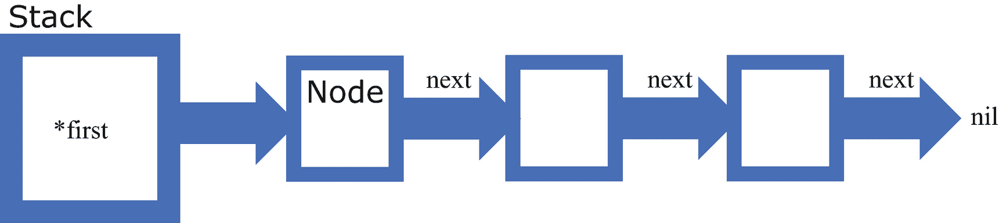
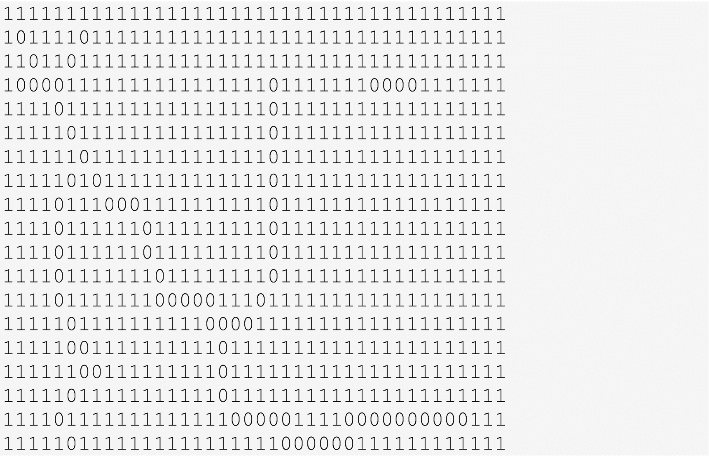
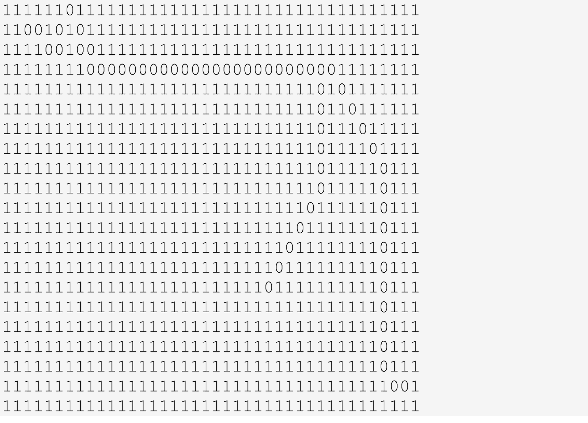

# 5. 栈

上一章介绍了抽象数据类型的一个应用，即生命游戏。

在本章中，我们将转换方向，开始探索通用数据结构。我们研究的第一个，也可能是最简单的数据结构是**栈**。它在应用程序开发中有许多实际用途。

栈以“后进先出”（LIFO）的方式组织数据。只有最后插入到栈中的项才能被访问。

由于 LIFO 特性，其最明显的应用是反转插入序列。例如，如果将列表中的项插入到栈中，那么通过不断弹出栈中的元素，就可以获得一个与原列表顺序相反的新列表。

在下一节中，我们将形式化定义栈这个抽象数据类型。

## 5.1 栈 ADT

栈 ADT 有四个特征操作。

- `Push(item)` – 将项添加到栈中
- `Pop()` item – 移除并返回最后压入栈中的项
- `Top()` item – 访问最后压入栈中的项，但不改变栈
- `IsEmpty()` bool – 如果栈中没有项，则返回`true`，否则返回`false`

我们考虑的第一种栈实现将在下一节中介绍，其中我们将探讨一种基于切片的实现。

## 5.2 通用栈的切片实现

清单 5-1 中展示的第一个通用栈实现，使用一个切片来存储栈中的数据。

```go
package main
import (
"fmt"
)
type Ordered interface {
~float64 | ~int | ~string
}
type Stack[T Ordered] struct {
items []T
}
func getZero[T Ordered]() T {
var result T
return result
}
// Methods
func (stack *Stack[T]) Push(item T) {
// item is added to the right-most position in the
// slice
if item != getZero[T]() { // We exclude item if it
// is getZero[T]()
stack.items = append(stack.items, item)
}
}
func (stack *Stack[T]) Pop() T {
length := len(stack.items)
if length > 0 {
returnValue := stack.items[length - 1]
stack.items = stack.items[:(length - 1)]
return returnValue
} else {
return getZero[T]()
}
}
func (stack Stack[T]) Top() T {
length := len(stack.items)
if length > 0 {
return stack.items[length - 1]
} else {
return getZero[T]()
}
}
func (stack Stack[T]) IsEmpty() bool {
return len(stack.items) == 0
}
func main() {
// Create a stack of names
nameStack := Stack[string]{}
nameStack.Push("Zachary")
nameStack.Push("Adolf")
topOfStack := nameStack.Top()
if topOfStack != getZero[string]() {
fmt.Printf("\nTop of stack is %s", topOfStack)
}
poppedFromStack := nameStack.Pop()
if poppedFromStack != getZero[string]() {
fmt.Printf("\nValue popped from stack is %s",
poppedFromStack)
}
poppedFromStack = nameStack.Pop()
if poppedFromStack != getZero[string]() {
fmt.Printf("\nValue popped from stack is %s",
poppedFromStack)
}
poppedFromStack = nameStack.Pop()
if poppedFromStack != getZero[string]() {
fmt.Printf("\nValue popped from stack is %s",
poppedFromStack)
}
poppedFromStack = nameStack.Pop()
if poppedFromStack != getZero[string]() {
fmt.Printf("\nValue popped from stack is %s",
poppedFromStack)
}
// Create a stack of integers
intStack := Stack[int]{}
intStack.Push(5)
intStack.Push(10)
intStack.Push(0) // Problem since 0 is the zero
// value for int
top := intStack.Top()
if top != getZero[int]() {
fmt.Printf("\nValue on top of intStack is %d", top)
}
popFromStack := intStack.Pop()
if popFromStack != getZero[int]() {
fmt.Printf("\nValue popped from intStack is
%d", popFromStack)
}
popFromStack = intStack.Pop()
if popFromStack != getZero[int]() {
fmt.Printf("\nValue popped from intStack is
%d", popFromStack)
}
popFromStack = intStack.Pop()
if popFromStack != getZero[int]() {
fmt.Printf("\nValue popped from intStack is
%d", popFromStack)
}
}
/* Output
Top of stack is Adolf
Value popped from stack is Adolf
Value popped from stack is Zachary
Value on top of intStack is 10
Value popped from intStack is 10
Value popped from intStack is 5
*/
清单 5-1
通用栈的切片实现
```

### GetZero 函数

函数 `getZero[T]()` 返回与泛型参数 `T` 关联的“零值”。如果栈中包含的切片 `items` 为空，函数 `Pop()` 和 `Top()` 将返回这个特殊值。

由于我们使用“零值”作为哨兵，指示栈为空，因此我们不能允许将这个“零值”压入栈中。


### 为什么 `T` 被声明为 `Ordered`

如果你好奇为什么我们要求 `T` 是 `Ordered` 而非 `any`，可以考察 `Push` 方法中的 `if item != getZero[T]()` 这条语句。泛型类型 `T` 必须是 `Ordered` 才能让该语句合法。也就是说，我们需要确保类型 `T` 的两个变量能够进行比较。这是该实现带来的一个令人遗憾的要求，因为栈抽象本身并不要求所持有的数据是有序的。

当我们创建整数栈时，我们压入的第三个值 0 会被阻止插入栈中，因为它恰好是 `int` 类型的“零值”。

因此，第一个使用切片来保存数据的泛型栈实现存在严重缺陷。

我们将在代码清单 [5-2] 中考察第二种实现。

```
package main
import (
"fmt"
)
type Stack[T any] struct {
items []T
}
// Methods
func (stack *Stack[T]) Push(item T) {
// item is added to the right-most position in the
// slice
stack.items = append(stack.items, item)
}
func (stack *Stack[T]) Pop() T {
length := len(stack.items)
returnValue := stack.items[length - 1]
stack.items = stack.items[:(length - 1)]
return returnValue
}
func (stack Stack[T]) Top() T {
length := len(stack.items)
return stack.items[length - 1]
}
func (stack Stack[T]) IsEmpty() bool {
return len(stack.items) == 0
}
func main() {
// Create a stack of names
nameStack := Stack[string]{}
nameStack.Push("Zachary")
nameStack.Push("Adolf")
if !nameStack.IsEmpty() {
topOfStack := nameStack.Top()
fmt.Printf("\nTop of stack is %s", topOfStack)
}
if !nameStack.IsEmpty() {
poppedFromStack := nameStack.Pop()
fmt.Printf("\nValue popped from stack is %s",
poppedFromStack)
}
if !nameStack.IsEmpty() {
poppedFromStack := nameStack.Pop()
fmt.Printf("\nValue popped from stack is %s",
poppedFromStack)
}
if !nameStack.IsEmpty() {
poppedFromStack := nameStack.Pop()
fmt.Printf("\nValue popped from stack is %s",
poppedFromStack)
}
if !nameStack.IsEmpty() {
poppedFromStack := nameStack.Pop()
fmt.Printf("\nValue popped from stack is %s",
poppedFromStack)
}
// Create a stack of integers
intStack := Stack[int]{}
intStack.Push(5)
intStack.Push(10)
intStack.Push(0)
if !intStack.IsEmpty() {
top := intStack.Top()
fmt.Printf("\nValue on top of intStack is %d", top)
}
if !intStack.IsEmpty() {
popFromStack := intStack.Pop()
fmt.Printf("\nValue popped from intStack is
%d", popFromStack)
}
if !intStack.IsEmpty() {
popFromStack := intStack.Pop()
fmt.Printf("\nValue popped from intStack is
%d", popFromStack)
}
if !intStack.IsEmpty() {
popFromStack := intStack.Pop()
fmt.Printf("\nValue popped from intStack is
%d", popFromStack)
}
}
/* Output
Top of stack is Adolf
Value popped from stack is Adolf
Value popped from stack is Zachary
Value on top of intStack is 0
Value popped from intStack is 0
Value popped from intStack is 10
Value popped from intStack is 5
*/
Listing 5-2
Another slice implementation of generic stack
```

在第二种实现中，参数 `T` 的类型是 `any`，理应如此。如果试图在空栈上调用 `Top()` 或 `Pop()` 方法，将会产生致命的索引越界错误。

主驱动程序展示了避免该问题的正确做法。在调用这两个方法之前，需先检查栈是否为空。

这里栈是在 `main` 包中实现的。通常，我们会创建一个独立的 `stack` 包，与 `main` 包分开。我们这样做只是为了简化问题。

下一节，我们将介绍使用 `Node` 实现的泛型栈。

## 5.3 泛型栈的节点实现

代码清单 [5-3] 展示了栈的另一种实现。

```
package main
import (
"fmt"
)
type Node[T any] struct {
value T
next *Node[T]
}
type Stack[T any] struct {
first *Node[T]
}
// Methods
func (stack *Stack[T]) Push(item T) {
newNode := Node[T]{item, nil}
newNode.next = stack.first
stack.first = &newNode
}
func (stack *Stack[T]) Top() T {
return stack.first.value
}
func (stack *Stack[T]) Pop() T {
result := stack.first.value
stack.first = stack.first.next
return result
}
func (stack Stack[T]) IsEmpty() bool {
return stack.first == nil
}
func main() {
// Create a stack of names
nameStack := Stack[string]{}
nameStack.Push("Zachary")
nameStack.Push("Adolf")
if !nameStack.IsEmpty() {
topOfStack := nameStack.Top()
fmt.Printf("\nTop of stack is %s", topOfStack)
}
if !nameStack.IsEmpty() {
poppedFromStack := nameStack.Pop()
fmt.Printf("\nValue popped from stack is %s",
poppedFromStack)
}
if !nameStack.IsEmpty() {
poppedFromStack := nameStack.Pop()
fmt.Printf("\nValue popped from stack is %s",
poppedFromStack)
}
if !nameStack.IsEmpty() {
poppedFromStack := nameStack.Pop()
fmt.Printf("\nValue popped from stack is %s",
poppedFromStack)
}
if !nameStack.IsEmpty() {
poppedFromStack := nameStack.Pop()
fmt.Printf("\nValue popped from stack is %s",
poppedFromStack)
}
// Create a stack of integers
intStack := Stack[int]{}
intStack.Push(5)
intStack.Push(10)
intStack.Push(0)
if !intStack.IsEmpty() {
top := intStack.Top()
fmt.Printf("\nValue on top of intStack is %d", top)
}
if !intStack.IsEmpty() {
popFromStack := intStack.Pop()
fmt.Printf("\nValue popped from intStack is
%d", popFromStack)
}
if !intStack.IsEmpty() {
popFromStack := intStack.Pop()
fmt.Printf("\nValue popped from intStack is
%d", popFromStack)
}
if !intStack.IsEmpty() {
popFromStack := intStack.Pop()
fmt.Printf("\nValue popped from intStack is
%d", popFromStack)
}
}
/* Output
Top of stack is Adolf
Value popped from stack is Adolf
Value popped from stack is Zachary
Value on top of intStack is 0
Value popped from intStack is 0
Value popped from intStack is 10
Value popped from intStack is 5
*/
```

泛型类型 `Node` 与泛型类型 `Stack` 一并定义。

```
type Node[T any] struct {
value T
next *Node[T]
}
type Stack[T any] struct {
first *Node[T]
}
```

代码清单 5-3  
泛型栈的节点实现

我们可以将数据结构可视化，如图 [5-1] 所示。



图示展示了栈的结构。第一个节点连接到下一个节点，该节点再连接到下一个节点。这个过程一直持续，直到遇到 `nil`。

**图 5-1**  
栈结构

函数 `main` 与代码清单 [5-2] 中的 `main` 相同，输出也相同。如果在空栈上调用 `Top()` 或 `Pop()`，将会发生内存段违规。因此，与代码清单 [5-2] 一样，在调用这两个方法之前必须验证栈非空。

下一节，我们将比较节点实现与切片实现的栈的效率。


## 5.4 比较节点栈与切片栈的效率

这两种栈实现哪种效率更高？

切片实现所需内存更少，因为节点实现需要为每个后续节点提供指针的内存开销。

为了比较这两种栈类型在速度上的效率，我们运行一个基准测试：向栈中压入 1000 万个整数值，然后弹出所有元素直至栈为空。

我们将这两种栈类型分别封装为`nodestack`和`slicestack`，如代码清单 5-4 和 5-5 所示。在代码清单 5-6 中，我们给出了比较这两个栈包速度的应用程序。

```
package main
import (
"example.com/nodestack"
"example.com/slicestack"
"time"
"fmt"
)
const size = 10_000_000
func main() {
nodeStack := nodestack.Stack[int]{}
sliceStack := slicestack.Stack[int]{}
// 基准测试 nodeStack
start := time.Now()
for i := 0; i < size; i++ {
nodeStack.Push(i)
}
elapsed := time.Since(start)
fmt.Println("\n 在 nodeStack 上执行 1000 万次 Push() 操作的时间：", elapsed)
start = time.Now()
for i := 0; i < size; i++ {
nodeStack.Pop()
}
elapsed = time.Since(start)
fmt.Println("\n 在 nodeStack 上执行 1000 万次 Pop() 操作的时间：", elapsed)
// 基准测试 sliceStack
start = time.Now()
for i := 0; i < size; i++ {
sliceStack.Push(i)
}
elapsed = time.Since(start)
fmt.Println("\n 在 sliceStack 上执行 1000 万次 Push() 操作的时间：", elapsed)
start = time.Now()
for i := 0; i < size; i++ {
sliceStack.Pop()
}
elapsed = time.Since(start)
fmt.Println("\n 在 sliceStack 上执行 1000 万次 Pop() 操作的时间：", elapsed)
}
/* 输出
在 nodeStack 上执行 1000 万次 Push() 操作的时间：616.365084ms
在 nodeStack 上执行 1000 万次 Pop() 操作的时间：29.104829ms
在 sliceStack 上执行 1000 万次 Push() 操作的时间：148.623915ms
在 sliceStack 上执行 1000 万次 Pop() 操作的时间：11.485335ms
*/
代码清单 5-6
nodestack 与 slicestack 的速度比较
```

```
package slicestack
type Stack[T any] struct {
items []T
}
// 方法
func (stack *Stack[T]) Push(item T) {
// 将元素添加到切片的最右侧位置
stack.items = append(stack.items, item)
}
func (stack *Stack[T]) Pop() T {
length := len(stack.items)
returnValue := stack.items[length - 1]
stack.items = stack.items[:(length - 1)]
return returnValue
}
func (stack Stack[T]) Top() T {
length := len(stack.items)
return stack.items[length - 1]
}
func (stack Stack[T]) IsEmpty() bool {
return len(stack.items) == 0
}
代码清单 5-5
slicestack 包
```

```
package nodestack
type Node[T any] struct {
value T
next *Node[T]
}
type Stack[T any] struct {
first *Node[T]
}
// 方法
func (stack *Stack[T]) Push(item T) {
newNode := Node[T]{item, nil}
// newNode.value = item
newNode.next = stack.first
stack.first = &newNode
}
func (stack *Stack[T]) Top() T {
return stack.first.value
}
func (stack *Stack[T]) Pop() T {
result := stack.first.value
stack.first = stack.first.next
return result
}
func (stack Stack[T]) IsEmpty() bool {
return stack.first == nil
}
代码清单 5-4
nodestack 包
```

`slicestack` 明显比 `nodestack` 更快。与往常一样，基准测试结果受处理器、内存容量、时钟速度以及其他因机器而异因素的影响。

下一节，我们将介绍栈的一个应用。

## 5.5 栈的应用：函数求值

我们希望构建一个函数，该函数接收一个代表数学表达式的字符串作为输入，其中操作符符号为 a 到 z，运算符来自集合 “+”、“-”、“*”、“/”、“(”、“)”。

例如，函数的输入可能是`“(a + (b - c) / (d * e)”`。在为每个操作数赋值一个浮点数后，该函数必须对表达式进行求值。

我们很快就会看到，尽管这一点并不显而易见，但栈在此应用的设计与实现中扮演着关键角色。

### 后缀求值

如果要在惠普（HP）计算器上执行此计算，操作步骤序列如下：

1. 输入数值 `a`。
2. 输入数值 `b`。
3. 输入数值 `c`。
4. 按下减法按钮。
5. 输入数值 `d`。
6. 输入数值 `e`。
7. 按下乘法按钮。
8. 按下除法按钮。
9. 按下加法按钮。

用符号表示，这一操作序列可以写成：`abc-de*/+`。

前面的表达式中没有括号。运算的优先级被封装在表达式中。我们将这种表达式称为原表达式的**后缀**表示法。

为了进一步说明，假设将 `a` 赋值为 2，`b` 赋值为 3，`c` 赋值为 1，`d` 赋值为 5，`e` 赋值为 2；则后缀求值过程如下：

运算符 –（中缀表达式中的第四个字符）将作用于其前面的两个操作数 `b` 和 `c`，得到 `b – c`，结果为 2。下一个运算符 `*` 将作用于其前面的两个操作数，得到 `d * e`，结果为 10。下一个运算符 `/` 将除以其前面的两个操作数，即 2 和 10，得到 0.2。最后，最后一个运算符 `+` 将加以其前面的两个操作数，即 `a` 和 0.2，得出答案 2.2。

遵循这种表达式求值的方法，我们将问题分为两个子问题。第一个子问题是将输入表达式转换为后缀表达式。第二个子问题是计算这个后缀表达式。

每个子问题都利用栈来完成其工作。

代码清单 5-7 中的 `infixpostfix` 函数将中缀表达式转换为后缀形式。

```
package main
import (
"fmt"
"example.com/nodestack"
)
func precedence(symbol1, symbol2 string) bool {
// 如果 symbol1 的优先级高于 symbol2，则返回 true
if (symbol1 == "+" || symbol1 == "-") && (symbol2
== "(" || symbol2 == "/") {
return false
} else if (symbol1 == "(" && symbol2 != ")") ||
symbol2 == "(" {
return false
} else {
return true
}
}
func isPresent(symbol string, operators []string) bool {
for i := 0; i = "a" && newSymbol <= "z" {
postfix += newSymbol
}
if isPresent(newSymbol, operators) {
if !nodeStack.IsEmpty() {
topSymbol := nodeStack.Top()
if precedence(topSymbol, newSymbol) ==
true {
if topSymbol != "(" {
postfix += topSymbol
}
nodeStack.Pop()
}
}
if newSymbol != ")" {
nodeStack.Push(newSymbol)
} else { // 将 nodeStack 向下弹出直到遇到第一个左括号
for {
if nodeStack.IsEmpty() == true {
break
}
ch := nodeStack.Top()
if ch != "(" {
postfix += ch
nodeStack.Pop()
} else {
nodeStack.Pop()
break
}
}
}
}
}
for {
if nodeStack.IsEmpty() == true {
break
}
if nodeStack.Top() != "(" {
postfix += nodeStack.Top()
nodeStack.Pop()
}
}
return postfix
}
func main() {
postfix := infixpostfix("a + (b - c) / (d * e)")
fmt.Println(postfix)
}
// 输出: abc-de*/+
代码清单 5-7
中缀转后缀的转换
```

`nodeStack` 是该算法的核心部分。


### 遍历算法

让我们以给定的中缀表达式为例，“遍历”函数 `infixpostfix`。我们描绘的栈中，栈顶显示在右侧，之前入栈的元素从右向左显示。在我们的栈图示中，最早入栈的元素位于最左侧，最近入栈的元素位于最右侧。

中缀表达式为 `"a + (b - c) / (d * e)"`。

我们按如下方式初始化 `operators` 切片、输出字符串 `postfix` 以及 `nodeStack`：

```
operators := []string{"+", "-", "*", "/", "(", ")"}
postfix = ""
nodeStack := nodestack.Stack[string]{}
```

在循环中依次捕获中缀表达式的每一个 `newSymbol`，若 `newSymbol` 是空白字符，则跳过本次循环的剩余部分，直接进入下一次循环。

第一个非空白字符是操作数 `"a"`。第一个 `if` 语句将该操作数追加到 `postfix` 字符串中。

下一个非空白字符是 `"+"`。该运算符被压入 `nodeStack`。此时系统的状态为：

```
Stack: +
postfix: a
```

下一个非空白字符是 `"("`。使用 `precedence` 函数比较 `topSymbol`（`"+"`）和 `newSymbol`（`"("`），返回 false。因此我们将 `"("` 压入栈中，得到系统状态：

```
Stack (top on the right): +  (
postfix: a
```

下一个非空白字符被追加到 `postfix` 中。系统状态如下：

```
Stack: +  (
postfix: ab
```

接下来处理运算符 `"-"`。`"("` 与 `"-"` 的优先级比较结果为 false，因此将运算符 `"-"` 压入栈中。

```
Stack (top on the right): +  (  -
postfix: ab
```

接着处理操作数 `"c"`。它被追加到结果中。

```
Stack (top on the right): +  (  -
postfix: abc
```

下一个处理的字符是 `")"`。`"-"` 与 `")"` 的优先级比较结果为 false。条件逻辑会进入 `else` 分支。根据注释说明，这将导致我们将栈中所有运算符弹出并追加到 `postfix`，直到遇到 `"("` 符号为止。

```
Stack (top on the right): +
postfix: abc-
```

下一个字符 `"/"`，由于 `"+"` 与 `"/"` 的优先级比较结果为 false，因此被压入栈中。

```
Stack (top on the right): +  /
postfix: abc-
```

与前文相同的原因，下一个符号 `"("` 被压入栈中。

```
Stack (top on the right): +  /  (
postfix: abc-
```

同样地，下一个运算符符号 `"*"` 被压入栈中。

```
Stack (top on the right): +  /  (  *
postfix: abc-
```

在此过程的每个阶段，栈中运算符从左到右的优先级依次递增。这确保了最终结果无需括号。

下一个符号 `")"` 导致栈被清空，直至遇到 `"("`。

```
Stack (top on the right): +  /
postfix: abc-*
```

当中缀表达式的所有符号处理完毕后，只剩下最终的循环。在此循环中，随着栈的弹出，所有剩余的运算符符号都被追加到 `postfix` 中。

系统的最终状态为：

```
Stack (top on the right):
postfix: abc-*/+
```

### 计算后缀表达式

接下来，我们处理这个问题的第二部分：当每个操作数被赋予 `float64` 值时，计算后缀表达式。

清单 5-8 呈现了函数 `evaluate`，该函数接收一个后缀表达式以及每个操作数符号对应的数值映射表作为输入。

```
package main
// 摘自清单 5.7
var values map[string]float64
func evaluate(postfix string) float64 {
operandStack := nodestack.Stack[float64]{}
for index := 0; index < len(postfix); index++ {
ch := postfix[index]
if ch >= "a" && ch <= "z" {
operandStack.Push(values[ch])
} else { // ch 是一个运算符
operand1 := operandStack.Pop()
operand2 := operandStack.Pop()
if ch == "+" {
operandStack.Push(operand1 + operand2)
} else if ch == "-" {
operandStack.Push(operand2 - operand1)
} else if ch == "*" {
operandStack.Push(operand1 * operand2)
} else if ch == "/" {
operandStack.Push(operand2 / operand1)
}
}
}
return operandStack.Top()
}
func main() {
postfix := infixpostfix("a + (b - c) / (d * e)")
fmt.Println(postfix)
values = make(map[string]float64)
values["a"] = 10
values["b"] = 5
values["c"] = 2
values["d"] = 4
values["e"] = 3
result := evaluate(postfix)
fmt.Println("函数计算结果为：", result)
}
// 输出：abc-de*/+
// 函数计算结果为：10.25
清单 5-8
计算后缀表达式
```

在函数 `evaluate` 中，另一个栈 `operandStack` 是核心。该函数比 `infixpostfix` 函数简单得多，留给读者自行遍历一个简单示例来理解。

泛型的优势显而易见。清单 5-7 中的 `nodeStack` 使用 `string` 作为其类型实例，而清单 5-8 中的 `operandStack` 则使用 `float64` 作为其类型实例。

在下一节中，我们将探讨栈的另一个应用——将十进制数转换为二进制数。

## 5.6 将十进制数转换为二进制数

栈的一个更简单的应用是将十进制数转换为二进制数。

清单 5-9 展示了如何实现这一点。

```
package main
import (
"fmt"
"example.com/slicestack"
)
func convertToBinary(input int) (binary []int) {
binaryNumberStack := slicestack.Stack[int]{}
for {
binaryNumberStack.Push(input % 2)
input = input / 2
if input == 0 {
break
}
}
binary = []int{}
for {
if !binaryNumberStack.IsEmpty() {
binary = append(binary,
binaryNumberStack.Pop())
} else {
break
}
}
return binary
}
func main() {
number := 1_000_000
binaryNumber := convertToBinary(number)
fmt.Printf("\n%d 转换为二进制数是 \n%v",
number, binaryNumber)
}
/* 输出
1000000 转换为二进制数是
[1 1 1 1 0 1 0 0 0 0 1 0 0 1 0 0 0 0 0 0]
*/
清单 5-9
使用栈将十进制数转换为二进制数
```

此处，`binaryNumberStack[int]` 用于反转通过寻找余数序列 `input % 2` 产生的 0 和 1 序列，因为每次迭代输入都会减少为原来的二分之一。

在下一节中，我们将介绍栈的另一个应用——在迷宫中寻找路径。

## 5.7 迷宫应用

尽管对栈等数据结构（以及后续将要探讨的许多其他结构）的研究本身很有趣，但只有当这些数据结构及其相关操作被应用于实际问题时，它们才真正变得生动起来。

在本节中，我们将介绍一个更复杂的应用，其中栈扮演着核心角色。

注意

本应用改编自 Richard Sincovec 和 Richard Wiener 合著的 *Data Structures Using Modula-2*（John Wiley，1986 年）第 3.2 节中的一个示例，后来在 Richard Wiener 的 *Modern Software Development Using C#.Net*（Thompson Learning，2007 年）中用 C# 实现。

我们用一个由 0 和 1 组成的二维列表来表示迷宫。值为 1 的单元格代表阻挡迷宫路径的障碍物。值为 0 的单元格代表可能的迷宫路径位置。给定这样一个由 0 和 1 组成的矩阵文件，以及起始位置和结束位置，目标是编写一个 Go 应用程序，如果存在一条或多条路径，则找到一条从起始位置到结束位置的路径。

我们希望避免使用穷举法，即枚举从起点到终点的每一条可能路径。


### 使用栈的迷宫路径高效策略

通过使用 `栈`，我们可以制定一种高效的策略，其概述如下。

在迷宫路径上的任意位置，下一步移动可以从八个相邻位置（北、东北、东、东南、南、西南、西、西北）中选择，前提是该位置的值为 `0`（即可通行）。我们让程序在可通行的相邻位置中随机选择。每次运行时，程序可能会产生不同的可行路径。

由于路径不能重复访问同一位置，我们将路径上每个单元格的值从 `0` 设置为 `1`。

每次移动后，我们将当前位置及将要移动的方向推入路径栈。如果路径遇到死胡同（这种情况很常见），我们可以回溯并访问上一个安全位置，然后从那里继续。

更正式地说，我们的迷宫算法以栈作为核心控制机制，具体步骤如下：

1. 加载迷宫文件，包括行数、列数以及起始和结束位置。
2. 初始化一个用于存储路径对象的路径栈。我们使用一个泛型栈，其基类型 `T` 为 `Path` 类型。
3. `路径`对象包含迷宫内的一个坐标、当前移动方向以及一个可用移动方向列表。
4. 从可通行的相邻位置中选择一个初始移动方向。
5. 每次尝试一个移动方向后，将其从八个可能的移动方向列表中删除。
6. 根据起点、初始移动方向和剩余移动方向列表，构造一个新的路径对象。
7. 将初始路径对象推入栈中。
8. 当栈不为空时，通过弹出栈顶获取顶部的路径对象。
9. 开始一个循环：当当前路径对象有更多可用移动时，随机选择一个可用位置，并将其值从 `0` 设置为 `1`。构造一个新的路径对象并将其推入栈中。当栈不为空时，通过弹出栈顶获取顶部的路径对象。

### 构建迷宫应用的基础设施

在深入实现迷宫功能之前，我们先通过定义一些相关类型及其操作（即抽象数据类型）来构建基础设施。

代码清单 5-10 介绍了迷宫应用所需的基本类型。

```
package main
import (
"fmt"
"math/rand"
"time"
)
// 方向抽象
type Direction int
const (
N int = 0
NE = 1
E = 2
SE = 3
S = 4
SW = 5
W = 6
NW = 7
NotAvailable = 8
)
func (d Direction) String() string {
switch d {
case 0:
return "north"
case NE:
return "north-east"
case E:
return "east"
case SE:
return "south-east"
case S:
return "south"
case SW:
return "south-west"
case W:
return "west"
case NW:
return "north-west"
case NotAvailable:
return "not available"
}
return "unknown"
}
func (d Direction) PrintDirection() {
fmt.Println("direction: ", d)
}
// 点抽象
type Point struct {
x, y int
}
func (p Point) Equals(other Point) bool {
return p.x == other.x && p.y == other.y
}
func (p Point) PrintPoint() {
fmt.Printf("\n", p.x, p.y)
}
// 路径抽象
type Path struct {
point Point
move Direction
movesAvailable []Direction
}
func NewPath(point Point) Path {
path := Path{point, Direction(NotAvailable),
[]Direction{}}
path.move = NotAvailable
// 初始所有方向均可用
path.movesAvailable = []Direction{0, NE, E, SE, S, SW, W, NW}
return path
}
func (path *Path) RandomMove() Direction {
// 返回移动方向的值，并修改接收者
indicesAvailable := []int{}
for index := 0; index  0 {
randomIndex := rand.Intn(count)
path.move =
path.movesAvailable[indicesAvailable[randomIndex]]
path.movesAvailable[indicesAvailable[randomIndex]]
= NotAvailable
return path.move
} else {
return NotAvailable
}
}
func main() {
rand.Seed(time.Now().UnixNano())
myDirection := Direction(6)
myDirection.PrintDirection()
myPoint := Point{3, 4}
myPoint.PrintPoint()
result := myPoint.Equals(Point{3, 4})
fmt.Println(result)
myPath := NewPath(Point{3, 4})
randomMove := myPath.RandomMove()
fmt.Println(randomMove)
fmt.Println(myPath)
}
/* 输出
direction:  west

true
south
{{3 4} 4 [0 1 2 3 8 5 6 7]}
*/
代码清单 5-10
迷宫应用的类型基础设施
```

`RandomMove` 方法会修改接收者，并返回移动方向。

Go 语言不支持枚举类型，因此我们通过定义 `type Direction int` 来模拟枚举类型。

创建这个新类型可以保护该类型的实体，防止其像普通整数那样被操作和可能损坏。

我们定义了一组常量，代表九种可能的移动方向（如果我们将 `NotAvailable` 视为其中之一的话）。

`main` 函数本身没有实际功能，仅用于演示如何创建和使用每种类型的变量。

现在，我们准备引入 `Maze` 抽象并编写这个应用。由于需要一个栈（本应用中将使用 `slicestack`，尽管 `nodestack` 也同样适用），我们将为 `Maze` 功能（`main` 包中的代码）创建一个单独的子目录，并导入 `slicestack`。我们将在 `mainmaze` 子目录中创建一个包含 `main` 包的 `go.mod` 文件。该 `go.mod` 文件内容如下：

```
module example.com/main
go 1.18
replace example.com/slicestack => ../slicestack
require example.com/slicestack v0.0.0-00010101000000-000000000000
```

`Maze` 类型的定义如下：

```
type Maze struct {
rows, cols int
start, end Point
mazefile   string
barriers   [][]bool
current    Path
moveCount  int
pathStack  slicestack.Stack[Path]
gameOver   bool
}
```

字段 `barriers` 用于定义位置是否被阻塞或可通行，它是一个布尔类型的二维切片。`mazefile` 中的字符 `"1"` 表示阻塞位置，字符 `"0"` 表示可通行位置。

字段 `pathStack` 是一个以 `Path` 作为泛型类型的 `slicestack.Stack`。


函数`NewMaze`创建了一个`Maze`实例，具体如下：

```
func NewMaze(rows int, cols int, start Point, end Point, mazefile string) (maze Maze) {
    maze.rows = rows
    maze.cols = cols
    maze.start = start
    maze.end = end
    // Initialize maze.barriers
    maze.barriers = make([][]bool, rows)
    for i := range maze.barriers {
        maze.barriers[i] = make([]bool, cols)
    }
    file, err := os.Open(mazefile)
    if err != nil {
        log.Fatal(err)
    }
    scanner := bufio.NewScanner(file)
    scanner.Split(bufio.ScanLines)
    var textlines []string
    for scanner.Scan() {
        textlines = append(textlines, scanner.Text())
    }
    defer file.Close()
    for row := 0; row < rows; row++ {
        line := textlines[row]
        for col := 0; col < cols; col++ {
            if string(line[col]) == "1" {
                maze.barriers[row][col] = true
            } else {
                maze.barriers[row][col] = false
            }
        }
    }
    maze.current = NewPath(start)
    maze.pathStack = slicestack.Stack[Path]{}
    maze.pathStack.Push(maze.current)
    maze.barriers[start.x][start.y] = true
    return maze
}
```

二维切片`barriers`通过为指定行数分配存储空间，然后再为每一行分配列存储空间来完成初始化。

输入文本文件`mazefile`使用`bufio`包中的`NewScanner`逐行读取。

然后，如果给定的行和列位置出现“1”，`barriers`切片在该位置赋值为`true`；如果出现“0”，则赋值为`false`。

辅助函数`NewPosition`根据`oldPosition`和`move`方向返回一个`Point`，具体如下：

```
func NewPosition(oldPosition Point, move Direction) Point {
    if move == Direction(N) {
        return Point{oldPosition.x, oldPosition.y - 1}
    } else if move == NE {
        return Point{oldPosition.x + 1, oldPosition.y - 1}
    } else if move == E {
        return Point{oldPosition.x + 1, oldPosition.y}
    } else if move == SE {
        return Point{oldPosition.x + 1, oldPosition.y + 1}
    } else if move == S {
        return Point{oldPosition.x, oldPosition.y + 1}
    } else if move == SW {
        return Point{oldPosition.x - 1, oldPosition.y + 1}
    } else if move == W {
        return Point{oldPosition.x - 1, oldPosition.y}
    } else {
        return Point{oldPosition.x - 1, oldPosition.y - 1}
    }
}
```

在迷宫中前进的主要程序逻辑由方法`StepAhead`实现。该函数返回一个新位置和一个回溯位置，两者均为`Point`类型。

该函数如下：

```
func (m *Maze) StepAhead() (Point, Point) {
    validMove := false
    backTrackPoint := None
    newPos := None
    for {
        if m.gameOver || validMove || m.pathStack.IsEmpty() {
            break
        }
        validMove = false
        m.current = m.pathStack.Pop()
        m.moveCount += 1
        nextMove := m.current.RandomMove()
        for {
            if validMove || nextMove == NotAvailable {
                break
            }
            newPos = NewPosition(m.current.point, m.current.move)
            if m.barriers[newPos.y][newPos.x] == false {
                validMove = true
                if newPos.Equals(m.end) {
                    for {
                        if m.pathStack.IsEmpty() == true {
                            break
                        }
                        m.pathStack.Pop()
                    }
                    m.gameOver = true
                }
                m.barriers[newPos.y][newPos.x] = true
                m.pathStack.Push(m.current)
                newPathObject := NewPath(newPos)
                m.pathStack.Push(newPathObject)
            } else {
                nextMove = m.current.RandomMove()
            }
        }
        if !validMove && !m.pathStack.IsEmpty() {
            fmt.Printf("\nBacktrack from %v to %v\n", m.current.point, m.pathStack.Top().point)
            backTrackPoint = m.pathStack.Top().point
        }
    }
    if m.pathStack.IsEmpty() {
        fmt.Println("No solution is possible")
        return None, None
    }
    return newPos, backTrackPoint
}
```

两个嵌套的`for`循环控制着在迷宫中寻找下一个位置的逻辑。外层循环在以下条件之一成立时终止：迷宫`m`的`gameOver`字段为`true`，或`validMove`为`true`，或迷宫的`pathStack`为空。如果`pathStack`为空，则应用程序终止并显示消息“No solution is possible.”。内层循环在找到有效移动或下一个随机移动为`NotAvailable`时终止。

该应用程序的各部分紧密配合，且具有一定的复杂性。显然，`slicestack.Stack[Path]`在迷宫导航过程中起着核心作用。

### 完成的迷宫应用

清单 5-11 展示了完整的迷宫应用，包含一个`main`驱动函数以及一次典型运行的输出。本次运行的迷宫文件`maze.txt`如图 5-2 所示。



一页由 0 和 1 组成的数据以二进制语言呈现。该页面以 40 行 40 列的格式展示数据。



图 5-2

`maze.txt`

从 0 的序列中可以看出，在这个 40×40 的网格中，如果起始位置为`<1, 1>`且结束位置为`<38, 38>`，则存在一条可行路径。同时，您也可以看到存在多条可能通向死胡同的旁支路径。


```
// MAZE application
package main
import (
"bufio"
"example.com/slicestack"
"fmt"
"log"
"math/rand"
"os"
"time"
)
// 摘自清单 5.10
// ********************************
// MAZE 抽象
type Maze struct {
rows, cols int
start, end Point
mazefile   string
barriers   [][]bool
current    Path
moveCount  int
pathStack  slicestack.Stack[Path]
gameOver   bool
}
func NewMaze(rows int, cols int, start Point, end
Point, mazefile string) (maze Maze) {
maze.rows = rows
maze.cols = cols
maze.start = start
maze.end = end
// 初始化 maze.barriers
maze.barriers = make([][]bool, rows)
for i := range maze.barriers {
maze.barriers[i] = make([]bool, cols)
}
file, err := os.Open(mazefile)
if err != nil {
log.Fatal(err)
}
scanner := bufio.NewScanner(file)
scanner.Split(bufio.ScanLines)
var textlines []string
for scanner.Scan() {
textlines = append(textlines, scanner.Text())
}
defer file.Close()
for row := 0; row < rows; row++ {
line := textlines[row]
for col := 0; col < cols; col++ {
if string(line[col]) == "1" {
maze.barriers[row][col] = true
} else {
maze.barriers[row][col] = false
}
}
}
maze.current = NewPath(start)
maze.pathStack = slicestack.Stack[Path]{} // 泛型实例
maze.pathStack.Push(maze.current)
maze.barriers[start.x][start.y] = true
return maze
}
func NewPosition(oldPosition Point, move Direction)
Point {
if move == Direction(N) {
return Point{oldPosition.x, oldPosition.y - 1}
} else if move == NE {
return Point{oldPosition.x + 1, oldPosition.y - 1}
} else if move == E {
return Point{oldPosition.x + 1, oldPosition.y}
} else if move == SE {
return Point{oldPosition.x + 1, oldPosition.y + 1}
} else if move == S {
return Point{oldPosition.x, oldPosition.y + 1}
} else if move == SW {
return Point{oldPosition.x - 1, oldPosition.y + 1}
} else if move == W {
return Point{oldPosition.x - 1, oldPosition.y}
} else {
return Point{oldPosition.x - 1, oldPosition.y - 1}
}
}
func (m *Maze) StepAhead() (Point, Point) {
validMove := false
backTrackPoint := None
newPos := None
for {
if m.gameOver || validMove ||
m.pathStack.IsEmpty() {
break
}
validMove = false
m.current = m.pathStack.Pop()
m.moveCount += 1
nextMove := m.current.RandomMove()
for {
if validMove || nextMove == NotAvailable {
break
}
newPos = NewPosition(m.current.point, m.current.move)
if m.barriers[newPos.y][newPos.x] == false
{
validMove = true
if newPos.Equals(m.end) {
for {
if m.pathStack.IsEmpty() ==
true {
break
}
m.pathStack.Pop()
}
m.gameOver = true
}
m.barriers[newPos.y][newPos.x] = true
m.pathStack.Push(m.current)
newPathObject := NewPath(newPos)
m.pathStack.Push(newPathObject)
} else {
nextMove = m.current.RandomMove()
}
}
if !validMove && !m.pathStack.IsEmpty() {
fmt.Printf("\n 从 %v 回溯到 %v\n",
m.current.point,
m.pathStack.Top().point)
backTrackPoint = m.pathStack.Top().point
}
}
if m.pathStack.IsEmpty() {
fmt.Println("未找到可行路径")
return None, None
}
return newPos, backTrackPoint
}
// *********************************************
func main() {
rand.Seed(time.Now().UnixNano())
start := Point{1, 1}
end := Point{38, 38}
maze := NewMaze(40, 40, start, end, "maze.txt")
newPos, _ := maze.StepAhead()
time.Sleep(1 * time.Second)
if newPos != None {
fmt.Println(newPos)
}
for {
if newPos == None || newPos.Equals(end) {
break
}
newPos, _ = maze.StepAhead()
time.Sleep(100 * time.Millisecond)
if newPos != None {
fmt.Println(newPos)
}
}
if newPos.Equals(end) {
fmt.Println("成功！到达 ", end)
}
}
/* 输出
{2 2}
{1 3}
{2 3}
{3 3}
{4 4}
{4 3}
{5 2}
{6 1}
从 {6 1} 回溯到 {5 2}
从 {5 2} 回溯到 {4 3}
从 {4 3} 回溯到 {4 4}
{5 5}
{6 6}
{5 7}
{4 8}
{4 9}
{4 10}
{4 11}
{4 12}
{5 13}
{6 14}
{6 15}
{5 16}
{4 17}
{5 18}
{6 19}
{5 20}
{5 21}
{4 21}
{3 20}
{2 20}
从 {2 20} 回溯到 {3 20}
从 {3 20} 回溯到 {4 21}
从 {4 21} 回溯到 {5 21}
从 {5 21} 回溯到 {5 20}
从 {5 20} 回溯到 {6 19}
{7 20}
{8 21}
{8 22}
{7 21}
从 {7 21} 回溯到 {8 22}
{9 22}
{10 22}
{11 22}
{12 22}
{13 22}
{14 22}
{15 22}
{16 22}
{17 22}
{18 22}
{19 22}
{20 22}
{21 22}
{22 22}
{23 22}
{24 22}
{25 22}
{26 22}
{27 22}
{28 22}
{29 22}
{30 23}
{31 22}
{32 23}
{33 24}
{34 25}
{35 26}
{36 27}
{36 28}
{36 29}
{36 30}
{36 31}
{36 32}
{36 33}
{36 34}
{36 35}
{36 36}
{36 37}
{37 38}
{38 38}
成功！到达  {38 38}
*/
清单 5-11
迷宫应用
```

在显示的输出中，遇到了三个死胡同绕行。`pathStack` 使得从每个绕行路径中回溯恢复，并最终找到穿过迷宫的路径成为可能。

## 5.8 本章小结

在本章中，我们展示了泛型栈的两种实现。接着，我们介绍了几种栈的应用，包括代数函数求值、十进制转二进制以及寻找穿过迷宫的路径。

在下一章，我们将重点讨论队列和列表数据结构。

