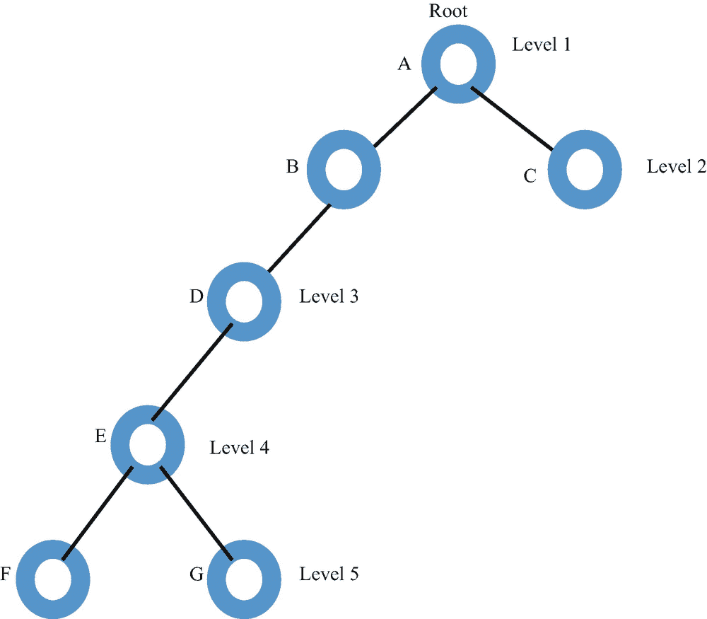
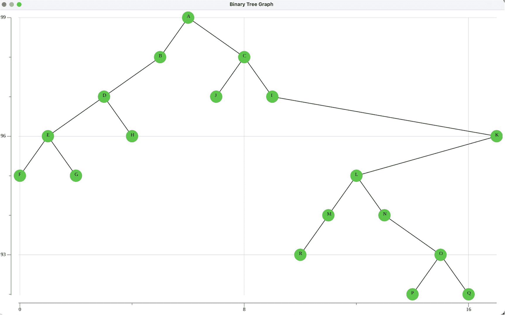
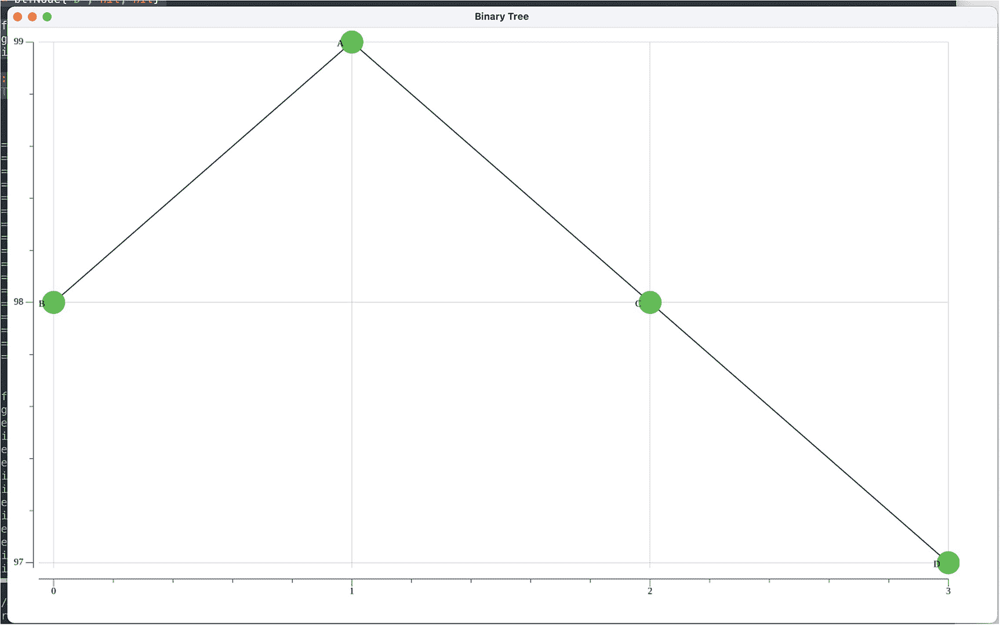
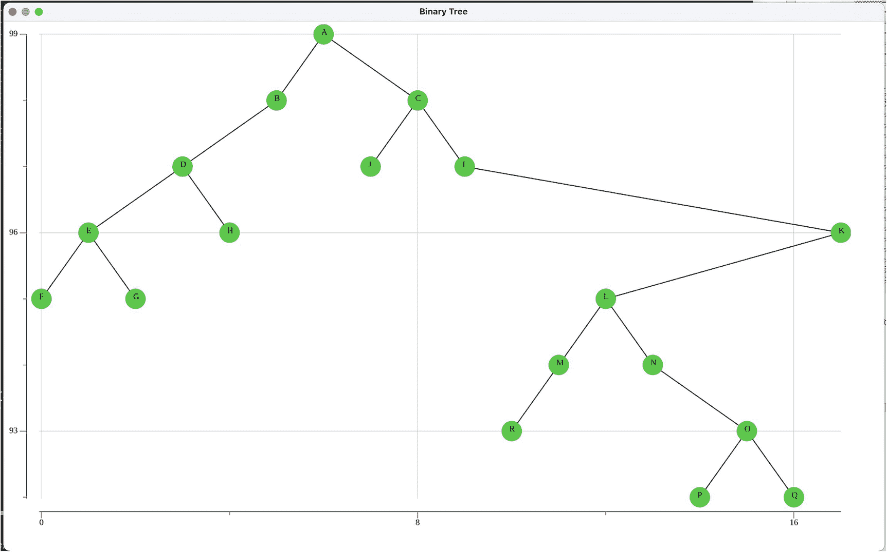

# 8. 二叉树

在上一章中，我们研究了哈希函数和哈希表，并探讨了几个应用，包括字符串搜索以及利用哈希实现的 `Set`。

在本章中，我们将注意力转向 `树` 结构。这是聚焦于树的若干章节中的第一章。我们在本章介绍二叉树。我们将研究遍历二叉树的机制。我们还将解决图形化显示二叉树这一具有挑战性的问题。为此，我们将再次使用第三方 Fyne 包来获取此类图形所需的资源。

在下一节中，我们定义二叉树。


## 8.1 二叉树

二叉树是一种特殊类型的树，其特点如下：

- 每个节点最多有两个子节点
- 子节点分别称为`左子节点`和`右子节点`

图 8-1 展示了一棵具有 7 个节点、高度为 5、包含 3 个叶子节点的二叉树。



一幅展示有 7 个节点、5 层结构的二叉树示意图。第 1 层的根节点 A 分为第 2 层的节点 B 和 C。第 2 层的节点 B 进一步分为节点 D，并引向第 3 层的节点 E。第 3 层的节点 E 再分为第 5 层的节点 F 和 G。

图 8-1

二叉树

与自然界中的树不同，二叉树的根位于结构顶部，随着更多节点的添加，树向下生长。叶子节点没有子节点。

下一节，我们将介绍遍历二叉树的三种方法。

## 8.2 树的遍历

树的遍历是指访问每个节点一次，并对节点中存储的数据进行操作。对于二叉树，我们将讨论三种遍历方式：`中序`、`前序`和`后序`。每种遍历都是通过递归定义的。我们以上图所示的树为例进行说明。

### 中序遍历

从根节点开始，我们从 A 向左下降到 B。再次向左下降，到达 D。然后向左到 E，最后再到 F。此时尚未产生任何输出。从 F 向左下降，发现没有左子节点。然后回溯并访问 F。访问可以是输出 F 中存储的数据，或对该数据执行某种操作。再到 F 的右侧，发现也没有右子节点。处理完 F 的左、访问 F 以及 F 的右之后，回溯到 E。由于已经处理过 E 的左，接下来访问节点 E。然后下降到 E 的右。从 G 向左，然后访问 G。回溯到 D。访问 D。回溯到 B。访问 B。回溯到 A。处理完 A 的左，访问 A。下降到右侧到节点 C。向左走。访问 C。向右走。回溯到 A，完成遍历。

因此，访问顺序为 `F, E, G, D, B, A, C`。

### 前序遍历

对于这种遍历，我们首先访问节点 A。访问可以是将 A 中存储的数据输出，或对其执行某种操作。访问 A 后，向左下降到节点 B。访问节点 B。然后向左下降并访问节点 D。接着向左下降并访问节点 E。再向左下降并访问节点 F。由于节点 F 没有左子节点，并且已经访问过节点 F，我们向右下降并访问节点 G。回溯到节点 A。由于已经访问过 A，我们向右下降并访问节点 C。因此，访问顺序为 `A B D E F G C`。

### 后序遍历

在这里，递归的操作顺序是：先向左下降，再向右下降，最后访问节点。请对照前文的树，看是否同意这种遍历产生的结果序列为 `F G E D B C A`。

下一节，我们将借助第三方 Fyne 包来实现二叉树的图形化绘制。

## 8.3 绘制树

我们希望能够使用`fyne`图形用户界面包中的图形函数来绘制二叉树。绘制的图形必须显示所有树节点及其键值，以及连接父节点与子节点的线条，并在绘图中体现每个节点的层级。

图 8-2 展示了由本节代码构建的树的屏幕截图。每个节点中数据的基类型假定为单字符字符串。



一幅二叉树的示意图。根节点 A 分为 B 和 C。节点 B 引向 D。节点 D 引向 E 和 H。节点 E 引向 F 和 G。节点 C 引向 I 和 J。节点 I 引向 K。节点 K 引向 L。节点 L 引向 M 和 N。节点 M 引向 R。节点 N 引向 O。节点 O 引向 P 和 Q。

图 8-2

二叉树的屏幕截图

为了简化对相当复杂的绘制树算法的解释，我们首先给出一个非泛型版本，该版本使用 `string` 作为基类型。下一章将介绍泛型版本。代码清单 8-1 展示了绘制二叉树的核心数据结构。

```
package main
type BinaryTree struct {
Root *Node
NumNodes int
}
type Node struct {
Value string
Left *Node
Right *Node
}
type nodePair struct {
Val1, Val2 string
}
type nodePos struct {
Val string
YPos int
XPos int
}
var data []nodePos         // 用于获取节点位置 (Val, XPos, YPos)
var endPoints []nodePair    // 用于绘制线条
代码清单 8-1
绘制二叉树的核心数据结构
```

### 二叉树结构

`BinaryTree` 被定义为一个结构体，包含一个指向 `Node` 的指针类型字段 `Root`，以及一个 `int` 类型字段 `NumNodes`。

`Node` 被定义为一个结构体，包含一个 `string` 类型（后续会改为泛型类型）的 `Value` 字段，以及两个均定义为指向 `Node` 的指针的字段 `Left` 和 `Right`。一个 `Node` 通过 `Left` 和 `Right` 指针包含两个对 `Node` 自身的递归引用。

类型 `nodePair` 被定义为一个结构体，包含字段 `Val1` 和 `Val2`（均为 `string` 类型）。变量 `endPoints` 被定义为 `nodePair` 类型的切片，用于跟踪连接二叉树中各节点的线条的端点值。

类型 `nodePos` 是一个结构体，包含 `Val`（`string` 类型）以及 `YPos` 和 `XPos`（均为 `int` 类型）。变量 `data` 被定义为 `nodePos` 类型的切片，用于定义要绘制的每个节点的位置和值。

### 用于显示二叉树的基础设施

代码清单 8-2 展示了设置显示二叉树图形的基础设施的支持函数。

```
func prepareDrawTree(tree BinaryTree) {
prepareToDraw(tree)
fmt.Println(endPoints)
fmt.Println(data)
}
func findXY(val string) (int, int) {
for i := 0; i < len(data); i++ {
if data[i].Val == val {
return data[i].XPos, data[i].YPos
}
}
return -1, -1
}
func findX(val string) int {
for i := 0; i < len(data); i++ {
if data[i].Val == val {
return i
}
}
return -1
}
func setXValues() {
for index := 0; index < len(data); index++ {
xValue := findX(data[index].Val)
data[index].XPos = xValue
}
}
func prepareToDraw(tree BinaryTree) {
inorderLevel(tree.Root, 1)
setXValues()
getEndPoints(tree.Root, nil)
}
func inorderLevel(node *Node, level int) {
if node != nil {
inorderLevel(node.Left, level + 1)
data = append(data, nodePos{node.Value, 100 - level, -1})
inorderLevel(node.Right, level + 1)
}
}
func getEndPoints(node *Node, parent *Node) {
if node != nil {
if parent != nil {
endPoints = append(endPoints, nodePair{node.Value, parent.Value})
}
getEndPoints(node.Left, node)
getEndPoints(node.Right, node)
}
}
代码清单 8-2
设置二叉树显示的函数
```


### 代码解释

函数 `prepareDrawTree` 调用 `prepareToDraw`，两者都接收一个参数 `tree`（`BinaryTree` 类型）。

函数 `prepareToDraw` 调用 `inorderLevel`，传入树的根节点和层级 1。此中序遍历会检查节点是否不为 `nil`，如果非空，则递归调用自身，传入参数 `node.Left` 和 `level + 1`。

代码的第二行是访问操作，它会向全局 `data` 切片追加一个 `nodePos`，其中包含 `node.Value`，以及 `YPos` 等于 100 – level 和 `XPos` 等于 -1（仅作为临时占位符）。由于树是从根节点向下构建的，层级越高，`YPos` 值越低，因此 `YPos` 的计算公式为 100 – level。

代码的第三行是对 `node.Right` 和 `level + 1` 的递归调用。

`prepareToDraw` 中的第二行代码是对 `setXValues()` 函数的调用。此函数使用 `findX` 来找到 `data` 切片中包含 `data` 中每个 `nodePos` 值的索引。在遍历 `data` 切片时，该索引用作 `nodePos` 中的 `XValue`。`data` 中的第一个 `nodePos` 将是最左侧的节点（在前面展示的树中为节点 F），其 `XPos` 为 0。`data` 中的第二个 `nodePos` 将是该树中的节点 E。在 `setXY()` 函数能够工作之前，需要先计算出 `data` 切片（除了 `XPos` 之外的部分）。

在 `setXY()` 完成后，会调用前序递归函数 `getEndPoints`。

每访问一个节点，就会使用所访问的节点及其父节点构建 `nodePair` 切片。这些信息将用于绘制连接树节点的边。

我们用一个包含四个节点的简单树来说明 `data` 和 `endPoints` 的构建过程。

8-3 清单 展示了一个简单的 `main` 函数以及在控制台中显示的 `data` 和 `endPoints` 切片结果。

```
package main
func main() {
root := Node{"A", nil, nil}
nodeB := Node{"B",nil, nil}
nodeC := Node{"C", nil, nil}
nodeD := Node{"D", nil, nil}
root.Left = &nodeB
root.Right = &nodeC
nodeC.Right = &nodeD
myTree := BinaryTree{&root, 4}
ShowTreeGraph(myTree)
}
清单 8-3
包含四个节点的 Main 函数
```

控制台输出为：

`slice of endPoints: [{B A} {C A} {D C}]`

`slice of data: [{B 98 0} {A 99 1} {C 98 2} {D 97 3}]`

`data` 切片显示，节点 B 的 `XPos` 为 0（最左侧节点）；节点 A 的 `XPos` 为 1；节点 C 的 `XPos` 为 2；节点 D 的 `XPos` 为 3。这个顺序是前面所示的中序遍历的结果。

必须绘制的三条线的端点显示在 `endPoints` 切片中（从 B 到 A，从 C 到 A，以及从 D 到 C 的线）。

使用 `fyne` GUI 包构建的树如图 8-3 所示。



一个包含 4 个节点的二叉树示意图。根节点 A 分为节点 B 和 C。节点 C 连接节点 D。

**图 8-3** 另一个二叉树截图

### ShowTreeGraph 的实现

计算完全局变量 `data` 和 `endPoints` 后，我们就可以绘制表示二叉树的图形了。

8-4 清单 展示了绘制树形图的详细信息。

```
func drawGraph(a fyne.App, w fyne.Window) {
image := canvas.NewImageFromResource(theme.FyneLogo())
image = canvas.NewImageFromFile(path + "tree.png")
image.FillMode = canvas.ImageFillOriginal
w.SetContent(image)
w.Show()
}
func ShowTreeGraph(myTree BinaryTree) {
prepareDrawTree(myTree)
myApp := app.New()
myWindow := myApp.NewWindow("Binary Tree")
myWindow.Resize(fyne.NewSize(1000, 600))
path, _ := homedir.Dir()
path += "/Desktop//"
nodePts := make(plotter.XYs, myTree.NumNodes)
for i := 0; i < len(data); i++ {
nodePts[i].Y = float64(data[i].YPos)
nodePts[i].X = float64(data[i].XPos)
}
nodePtsData := nodePts
p := plot.New()
p.Add(plotter.NewGrid())
nodePoints, err := plotter.NewScatter(nodePtsData)
if err != nil {
log.Panic(err)
}
nodePoints.Shape = draw.CircleGlyph{}
nodePoints.Color = color.RGBA{G: 255, A: 255}
nodePoints.Radius = vg.Points(12)
// 绘制线条
for index := 0; index < len(endPoints); index++ {
val1 := endPoints[index].Val1
x1, y1 := findXY(val1)
val2 := endPoints[index].Val2
x2, y2 := findXY(val2)
pts := plotter.XYs{{X: float64(x1), Y: float64(y1)}, {X: float64(x2),
Y: float64(y2)}}
line, err := plotter.NewLine(pts)
if err != nil {
log.Panic(err)
}
scatter, err := plotter.NewScatter(pts)
if err != nil {
log.Panic(err)
}
p.Add(line, scatter)
}
p.Add(nodePoints)
// 添加标签
for index := 0; index < len(data); index++ {
x := float64(data[index].XPos) - 0.05
y := float64(data[index].YPos) - 0.02
str := data[index].Val
label, err := plotter.NewLabels(plotter.XYLabels {
XYs: []plotter.XY {
{X: x ,Y: y},
},
Labels: []string{str},
},)
if err != nil {
log.Fatalf("无法创建标签绘图器: %+v", err)
}
p.Add(label)
}
path, _ = homedir.Dir()
path += "/Desktop/GoDS/"
err = p.Save(1000, 600, "tree.png")
if err != nil {
log.Panic(err)
}
drawGraph(myApp, myWindow)
myWindow.ShowAndRun()
}
清单 8-4
绘制二叉树图形
```

`ShowTreeGraph` 中的第一行代码是 `prepareDrawTree`。这会将 `data` 填充为 `nodePos` 的切片，每个 `nodePos` 包含节点中存储的键值以及其在图中的 `XPos` 和 `YPos`。

创建了一个新的 `fyne.Window` 即 `myWindow`，标题为“Binary Tree”，宽度为 1000 像素，高度为 600 像素。

创建了一个新的绘图器 `nodePts`。该绘图器的 X 和 Y 坐标由 `data` 切片中的 `XPos` 和 `YPos` 赋值。

创建了一个新的 `plot` 并使用 `plotter` 中的信息进行填充。使用 `nodePtsData` 从 `plotter` 创建了一个散点图 `nodePoints`。

为每个节点点的 `Shape`、`Color` 和 `Radius` 进行了赋值。

绘制线条和在每个节点上创建标签也采用了相同的方法。

最后，一个“tree.png”文件被保存到主目录。

支持函数 `drawGraph` 被调用，并传入 `fyne.App` (`myApp`) 和 `fyne.Window` (`myWindow`) 作为参数。

函数 `drawGraph` 加载并显示“tree.png”图像。

为了使代码能够运行，需要导入 `fyne` 框架中的多个包。这些导入信息如 8-5 清单 所示，该清单展示了完整的 `binarytree` 包。


```go
package binarytree

import (
	"fmt"
	"image/color"
	"log"

	"fyne.io/fyne/v2"
	"fyne.io/fyne/v2/app"
	"fyne.io/fyne/v2/canvas"
	"fyne.io/fyne/v2/theme"
	"github.com/mitchellh/go-homedir"
	"gonum.org/v1/plot"
	"gonum.org/v1/plot/plotter"
	"gonum.org/v1/plot/vg"
	"gonum.org/v1/plot/vg/draw"
)

type BinaryTree struct {
	Root     *Node
	NumNodes int
}

type Node struct {
	Value string
	Left  *Node
	Right *Node
}

type nodePair struct {
	Val1, Val2 string
}

type nodePos struct {
	Val  string
	YPos int
	XPos int
}

var data []nodePos   // 用于获取每个节点的（Val, XPos, YPos）
var endPoints []nodePair     // 用于绘制连线

func prepareDrawTree(tree BinaryTree) {
	prepareToDraw(tree)
	fmt.Printf("\n 连接点切片: %v", endPoints)
	fmt.Printf("\n 数据切片: %v", data)
}

func findXY(val string) (int, int) {
	for i := 0; i < len(data); i++ {
		if data[i].Val == val {
			return data[i].XPos, data[i].YPos
		}
	}
	return -1, -1
}

func findX(val string) int {
	for i := 0; i < len(data); i++ {
		if data[i].Val == val {
			return i
		}
	}
	return -1
}

func setXValues() {
	for index := 0; index < len(data); index++ {
		xValue := findX(data[index].Val)
		data[index].XPos = xValue
	}
}

func prepareToDraw(tree BinaryTree) {
	inorderLevel(tree.Root, 1)
	setXValues()
	getEndPoints(tree.Root, nil)
}

func inorderLevel(node *Node, level int) {
	if node != nil {
		inorderLevel(node.Left, level+1)
		data = append(data, nodePos{node.Value, 100 - level, -1})
		inorderLevel(node.Right, level+1)
	}
}

func getEndPoints(node *Node, parent *Node) {
	if node != nil {
		if parent != nil {
			endPoints = append(endPoints, nodePair{node.Value, parent.Value})
		}
		getEndPoints(node.Left, node)
		getEndPoints(node.Right, node)
	}
}

var path string

func drawGraph(a fyne.App, w fyne.Window) {
	image := canvas.NewImageFromResource(theme.FyneLogo())
	image = canvas.NewImageFromFile(path + "tree.png")
	image.FillMode = canvas.ImageFillOriginal
	w.SetContent(image)
	w.Show()
}

func ShowTreeGraph(myTree BinaryTree) {
	prepareDrawTree(myTree)
	myApp := app.New()
	myWindow := myApp.NewWindow("二叉树")
	myWindow.Resize(fyne.NewSize(1000, 600))
	path, _ := homedir.Dir()
	path += "/Desktop//"
	nodePts := make(plotter.XYs, myTree.NumNodes)
	for i := 0; i < len(data); i++ {
		nodePts[i].Y = float64(data[i].YPos)
		nodePts[i].X = float64(data[i].XPos)
	}
	nodePtsData := nodePts
	p := plot.New()
	p.Add(plotter.NewGrid())
	nodePoints, err := plotter.NewScatter(nodePtsData)
	if err != nil {
		log.Panic(err)
	}
	nodePoints.Shape = draw.CircleGlyph{}
	nodePoints.Color = color.RGBA{G: 255, A: 255}
	nodePoints.Radius = vg.Points(12)
	// 绘制连线
	for index := 0; index < len(endPoints); index++ {
		val1 := endPoints[index].Val1
		x1, y1 := findXY(val1)
		val2 := endPoints[index].Val2
		x2, y2 := findXY(val2)
		pts := plotter.XYs{{X: float64(x1), Y: float64(y1)},
			{X: float64(x2), Y: float64(y2)}}
		line, err := plotter.NewLine(pts)
		if err != nil {
			log.Panic(err)
		}
		scatter, err := plotter.NewScatter(pts)
		if err != nil {
			log.Panic(err)
		}
		p.Add(line, scatter)
	}
	p.Add(nodePoints)
	// 添加标签
	for index := 0; index < len(data); index++ {
		x := float64(data[index].XPos) - 0.05
		y := float64(data[index].YPos) - 0.02
		str := data[index].Val
		label, err := plotter.NewLabels(plotter.XYLabels{
			XYs: []plotter.XY{
				{X: x, Y: y},
			},
			Labels: []string{str},
		})
		if err != nil {
			log.Fatalf("无法创建标签绘图器: %+v", err)
		}
		p.Add(label)
	}
	path, _ = homedir.Dir()
	path += "/Desktop/GoDS/"
	err = p.Save(1000, 600, "tree.png")
	if err != nil {
		log.Panic(err)
	}
	drawGraph(myApp, myWindow)
	myWindow.ShowAndRun()
}
```

*清单 8-5 完整的`binarytree`包*

---

`清单 8-6`展示了一个`main`驱动程序，它使用`binarytree`包构建一个包含 18 个节点的`BinaryTree`，然后显示该树。

*清单 8-6 构建并显示二叉树的 main 驱动程序*

```go
package main

import bt "example.com/binarytree"

func main() {
	root := bt.Node{"A", nil, nil}
	nodeB := bt.Node{"B", nil, nil}
	nodeC := bt.Node{"C", nil, nil}
	nodeD := bt.Node{"D", nil, nil}
	nodeE := bt.Node{"E", nil, nil}
	nodeF := bt.Node{"F", nil, nil}
	nodeG := bt.Node{"G", nil, nil}
	nodeH := bt.Node{"H", nil, nil}
	nodeI := bt.Node{"I", nil, nil}
	nodeJ := bt.Node{"J", nil, nil}
	nodeK := bt.Node{"K", nil, nil}
	nodeL := bt.Node{"L", nil, nil}
	nodeM := bt.Node{"M", nil, nil}
	nodeN := bt.Node{"N", nil, nil}
	nodeO := bt.Node{"O", nil, nil}
	nodeP := bt.Node{"P", nil, nil}
	nodeQ := bt.Node{"Q", nil, nil}
	nodeR := bt.Node{"R", nil, nil}
	root.Left = &nodeB
	root.Right = &nodeC
	nodeB.Left = &nodeD
	nodeD.Right = &nodeH
	nodeD.Left = &nodeE
	nodeE.Left = &nodeF
	nodeE.Right = &nodeG
	nodeC.Right = &nodeI
	nodeC.Left = &nodeJ
	nodeI.Right = &nodeK
	nodeK.Left = &nodeL
	nodeL.Left = &nodeM
	nodeL.Right = &nodeN
	nodeN.Right = &nodeO
	nodeO.Left = &nodeP
	nodeO.Right = &nodeQ
	nodeM.Left = &nodeR
	myTree := bt.BinaryTree{&root, 18}
	bt.ShowTreeGraph(myTree)
}
```

生成的二叉树如图 8-4 所示。



二叉树的示意图。根节点 A 分为 B 和 C。节点 B 连接到 D。节点 D 连接到 E 和 H。节点 E 连接到 F 和 G。节点 C 连接到 I 和 J。节点 I 连接到 K。节点 K 连接到 L。节点 L 连接到 M 和 N。节点 M 连接到 R。节点 N 连接到 O。节点 O 连接到 P 和 Q。

*图 8-4 程序输出*


好的，作为高级文档工程师和翻译员，我将严格遵循注意事项和示例，为您提供高质量的翻译。


### 在 `binarytree` 和 `main` 子目录中创建 `go.mod` 文件

如第 3.2 节所述，必须在包含 `main.go` 和 `binarytree.go` 的 `main` 和 `binarytree` 子目录中各生成一个模块文件 `go.mod`。

在 `main` 和 `binarytree` 子目录中调用 `go mod tidy` 会使得每个 `go.mod` 文件中构建正确的 require 子句。当 `main` 首次运行时，将从 GitHub 下载相应的导入包。

生成的文件如下：

```
module example.com/main
go 1.18
replace example.com/binarytree => ../binarytree
require (
example.com/binarytree v0.0.0-00010101000000-000000000000 // indirect
fyne.io/fyne/v2 v2.1.2 // indirect
github.com/ajstarks/svgo v0.0.0-20210923152817-c3b6e2f0c527 // indirect
github.com/davecgh/go-spew v1.1.1 // indirect
github.com/fogleman/gg v1.3.0 // indirect
github.com/fredbi/uri v0.0.0-20181227131451-3dcfdacbaaf3 // indirect
github.com/fsnotify/fsnotify v1.4.9 // indirect
github.com/go-fonts/liberation v0.2.0 // indirect
github.com/go-gl/gl v0.0.0-20210813123233-e4099ee2221f // indirect
github.com/go-gl/glfw/v3.3/glfw v0.0.0-20211024062804-40e447a793be
github.com/go-latex/latex v0.0.0-20210823091927-c0d11ff05a81 // indirect
github.com/go-pdf/fpdf v0.5.0 // indirect
github.com/godbus/dbus/v5 v5.0.4 // indirect
github.com/goki/freetype v0.0.0-20181231101311-fa8a33aabaff // indirect
github.com/golang/freetype v0.0.0-20170609003504-e2365dfdc4a0 // indirect
github.com/mitchellh/go-homedir v1.1.0 // indirect
github.com/pmezard/go-difflib v1.0.0 // indirect
github.com/srwiley/oksvg v0.0.0-20200311192757-870daf9aa564 // indirect
github.com/srwiley/rasterx v0.0.0-20200120212402-85cb7272f5e9 // indirect
github.com/stretchr/testify v1.5.1 // indirect
github.com/yuin/goldmark v1.3.8 // indirect
golang.org/x/image v0.0.0-20210628002857-a66eb6448b8d // indirect
golang.org/x/net v0.0.0-20210405180319-a5a99cb37ef4 // indirect
golang.org/x/sys v0.0.0-20210630005230-0f9fa26af87c // indirect
golang.org/x/text v0.3.6 // indirect
gonum.org/v1/plot v0.10.0 // indirect
gopkg.in/yaml.v2 v2.2.8 // indirect
)
module example.com/binarytree
go 1.18
require (
fyne.io/fyne/v2 v2.1.2
github.com/mitchellh/go-homedir v1.1.0
gonum.org/v1/plot v0.10.0
)
require (
github.com/ajstarks/svgo v0.0.0-20210923152817-c3b6e2f0c527 // indirect
github.com/davecgh/go-spew v1.1.1 // indirect
github.com/fogleman/gg v1.3.0 // indirect
github.com/fredbi/uri v0.0.0-20181227131451-3dcfdacbaaf3 // indirect
github.com/fsnotify/fsnotify v1.4.9 // indirect
github.com/go-fonts/liberation v0.2.0 // indirect
github.com/go-gl/gl v0.0.0-20210813123233-e4099ee2221f // indirect
github.com/go-gl/glfw/v3.3/glfw v0.0.0-20211024062804-40e447a793be
github.com/go-latex/latex v0.0.0-20210823091927-c0d11ff05a81 // indirect
github.com/go-pdf/fpdf v0.5.0 // indirect
github.com/godbus/dbus/v5 v5.0.4 // indirect
github.com/goki/freetype v0.0.0-20181231101311-fa8a33aabaff // indirect
github.com/golang/freetype v0.0.0-20170609003504-e2365dfdc4a0 // indirect
github.com/pmezard/go-difflib v1.0.0 // indirect
github.com/srwiley/oksvg v0.0.0-20200311192757-870daf9aa564 // indirect
github.com/srwiley/rasterx v0.0.0-20200120212402-85cb7272f5e9 // indirect
github.com/stretchr/testify v1.5.1 // indirect
github.com/yuin/goldmark v1.3.8 // indirect
golang.org/x/image v0.0.0-20210628002857-a66eb6448b8d // indirect
golang.org/x/net v0.0.0-20210405180319-a5a99cb37ef4 // indirect
golang.org/x/sys v0.0.0-20210630005230-0f9fa26af87c // indirect
golang.org/x/text v0.3.6 // indirect
gopkg.in/yaml.v2 v2.2.8 // indirect
)
```

现在，导入语句

```
package main
import bt"example.com/binarytree"
```

将可以正常工作，并使得 `binarytree` 包中定义的资源在 `main.go` 中可用。

## 8.4 总结

我们介绍了二叉树结构。展示了三种恰好访问每个树节点一次的机制。我们给出了一个非泛型的二叉树实现，以及一组使用第三方包 `fyne` 的资源图形化显示二叉树的函数。

在下一章中，我们将继续探索树，并研究二叉搜索树。

