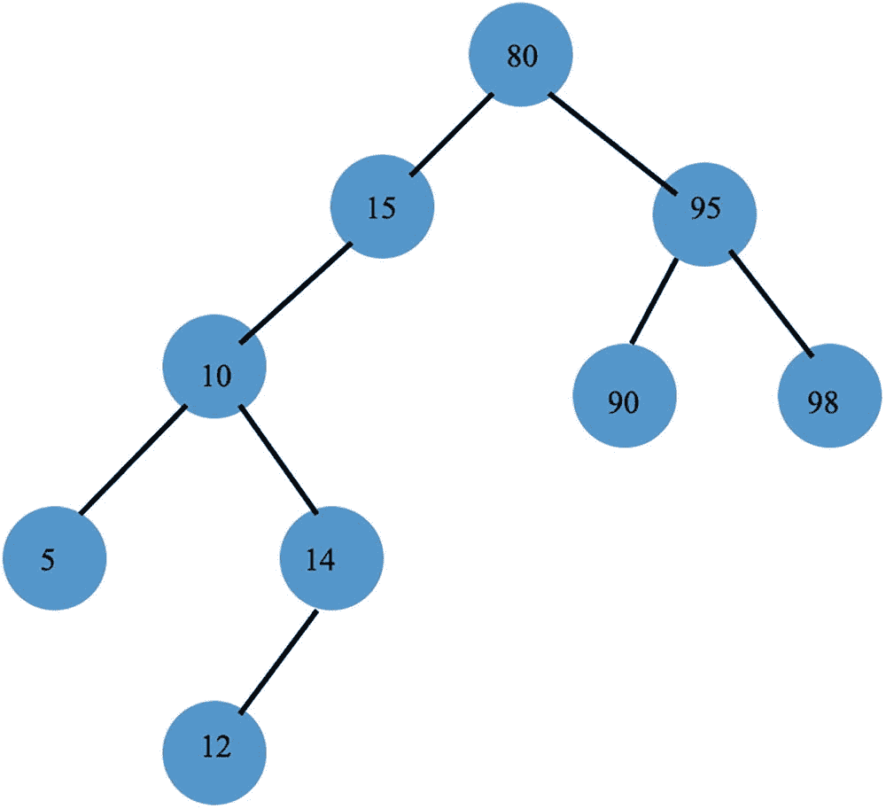
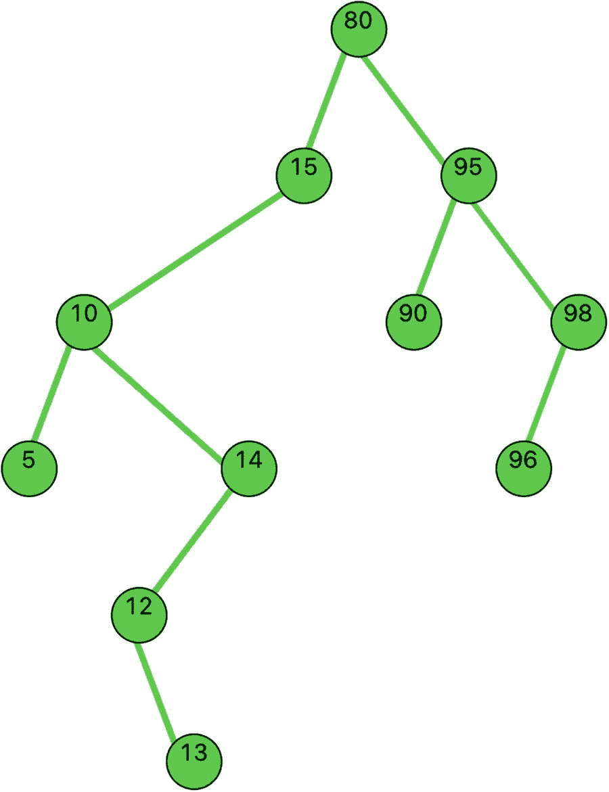
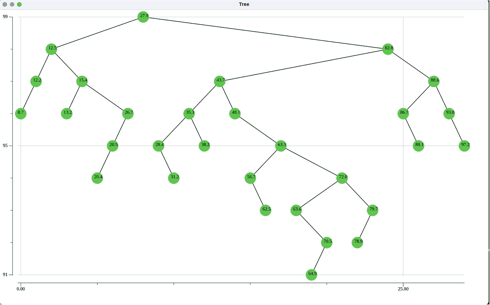

# 9. 二叉搜索树

在上一章中，我们介绍并实现了二叉树，并讲解了遍历和以图形方式显示此类树的代码。

在本章中，我们将探索一种重要的专用二叉树：二叉搜索树。搜索树的目标是组织数据，以支持快速访问存储在树中的信息。相对平衡的搜索树，其最大深度与树中节点数量之间呈对数关系，因此，在树中搜索某个特定项所需的操作次数也与树的最大深度呈对数关系。

复杂度受限于最大深度的树搜索算法是非常高效的。

在下一节中，我们将概述搜索树。

## 9.1 概述

搜索树有很多种类型。

我们首先研究的搜索树类型是二叉搜索树。在后面的章节中，我们将探索其他类型的搜索树。

二叉搜索树（BST）是一种特殊类型的二叉树，其中每个节点都包含一个搜索键，并且：

1.  节点 X 中所有小于其键值的键都存储在 X 的左子树中。
2.  节点 X 中所有大于其键值的键都存储在 X 的右子树中。

这意味着，在搜索树中，我们必须能够比较每个节点的 `Value` 字段。

例如，考虑图 9-1 所示的二叉搜索树。这棵树并不平衡，但前面陈述的条件 1 和条件 2 对于树中的每个节点都成立。



**图 9-1** 二叉搜索树

### 搜索

搜索二叉搜索树使用一个简单的算法。将要搜索的键与根节点中的键进行比较。如果搜索键较小，则向左下降；如果较大，则向右下降。递归地继续这种模式，直到到达树底，或者找到一个值等于搜索键的节点。

例如，如果我们要在之前展示的树中搜索节点 12，我们将向左下降（到节点 15），再向左下降（到节点 10），再向右下降（到节点 14），最后向左下降到达我们的目标节点 12。这需要进行五次比较操作，也就是这棵树的深度。

### 插入

要向搜索树中插入一个节点，我们首先搜索要插入的节点。由于搜索树中不允许存在重复值的节点，因此这会将我们带到树的底部。然后，我们将新节点插入到它原本存在时应该被发现的位置。

对于前面给出的树，如果要插入节点 13，它将被插入为节点 12 的右子节点，因为如果它原本就在树中，它就会在这个位置被发现。

### 有序输出

对此搜索树（以及所有搜索树）进行中序遍历，会产生一个从最小值到最大值的访问序列，即有序输出。尝试对图 9-2 中的树进行此操作，并验证这一事实。



**图 9-2** 用于中序遍历的二叉搜索树


### 删除

从搜索树中移除某个键的算法和方法较为复杂。移除后，必须保证得到的仍然是一棵搜索树。

存在三种特殊情况：

1.  待删除的节点是叶节点。
2.  待删除的节点有一个子节点。
3.  待删除的节点有两个子节点。

情况 1 最简单。我们找到叶节点的父节点，并将父节点对应的链接（`left` 或 `right`）设置为 `nil`，从而有效地将叶节点从树中剪除。

第二种情况（待删除的节点有一个子节点）的处理方式类似于链表删除，如下所示：

假设 `left` 是被删除节点的左子节点，或假设 `right` 是被删除节点的右子节点。

```go
if node to be deleted has one child (left or right):
if left != nil and parent.left == keyNode:
parent.left = left
else if left != nil and parent.right == keyNode:
parent.right = left
else if right != nil and parent.left == keyNode:
parent.left = right
else if right != nil and parent.right == keyNode:
parent.right = right
```

作为练习，请画出这四种情况的示意图，以验证 `keyNode` 已与其父节点断开连接，并且父节点已重新连接到其孙节点。

第三种情况（待删除的节点有两个子节点）最为复杂。它包含三个步骤：

1.  找到 `keyNode` 的中序后继节点（`keyNode` 右侧最小的节点）。
2.  将 `successor` 节点中的键复制到 `keyNode`。
3.  移除 `successor` 节点。

作为练习，请证明 `successor` 节点有零个或一个子节点，因此它的删除属于前面展示的情况 1 或情况 2 的删除。

在下一节中，我们将介绍一个通用的二叉搜索树实现。

## 9.2 通用二叉搜索树

我们将介绍一个通用的二叉搜索树实现。我们必须约束泛型类型 `T`，使其满足两个条件：

1.  存储在树节点中的类型 `T` 的值可以进行比较。
2.  存储在树节点中的类型 `T` 的值可以使用 `String()` 函数转换为字符串。

#### 类型 `OrderedStringer`

我们定义一个约束类型 `OrderedStringer`，使其满足上述两个条件，如下所示：

```go
type ordered interface {
~int | ~float64 | ~string
}
type OrderedStringer interface {
ordered
String() string
}
```

要求 1 使用 `ordered` 类型指定。要求 2 使用 `String()` 函数的签名指定。

通用二叉搜索树的任何实例化都必须使用满足上述 `OrderedStringer` 类型的值类型。我们将在本节稍后部分提供说明此用法的示例。

#### 二叉搜索树所需的泛型类型

清单 9-1 展示了 `binarysearchtree` 包中所需的泛型数据结构。

```go
package binarysearchtree
import (
"image/color"
"log"
"fyne.io/fyne/v2"
"fyne.io/fyne/v2/app"
"fyne.io/fyne/v2/canvas"
"fyne.io/fyne/v2/theme"
"github.com/mitchellh/go-homedir"
"gonum.org/v1/plot"
"gonum.org/v1/plot/plotter"
"gonum.org/v1/plot/vg"
"gonum.org/v1/plot/vg/draw"
)
type ordered interface {
~int | ~float64 | ~string
}
type BinarySearchTree[T OrderedStringer] struct {
Root *Node[T]
NumNodes int
}
type Node[T OrderedStringer] struct {
Value T
Left *Node[T]
Right *Node[T]
}
type OrderedStringer interface {
ordered
String() string
}
```

*清单 9-1*  
`binarysearchtree` 包中的泛型数据结构

类型 `BinarySearchTree` 和类型 `Node` 都使用类型为 `OrderedStringer` 的泛型参数 `T` 进行定义。这确保我们能够比较节点值，并在通用树的图形显示中将值输出为字符串。如果我们不使用显示二叉搜索树的函数，则不需要对泛型参数 `T` 的第二个约束。

#### 二叉搜索树的方法

为类型 `BinarySearchTree` 定义的方法如清单 9-2 所示。

```go
func (bst *BinarySearchTree[T]) Insert(newValue T) {
if bst.Search(newValue) == false { // newValue not in existing tree
n := &Node[T]{newValue, nil, nil}
if bst.Root == nil { // First value in bst
bst.Root = &Node[T]{newValue, nil, nil}
} else {
insertNode(bst.Root, n)
}
bst.NumNodes += 1
}
}
func (bst *BinarySearchTree[T]) Delete(value T) {
if bst.Search(value) == true {
deleteNode(bst.Root, value)
bst.NumNodes -= 1
}
}
func (bst *BinarySearchTree[T]) Search(value T) bool {
return search(bst.Root, value)
}
func (bst *BinarySearchTree[T]) InOrderTraverse(op func(T)) {
inOrderTraverse(bst.Root, op)
}
func (bst *BinarySearchTree[T]) Min() *T {
node := bst.Root
if node == nil {
return nil
}
for {
if node.Left == nil {
return &node.Value
}
node = node.Left
}
}
func (bst *BinarySearchTree[T]) Max() (*T, int) { // second return value is height
node := bst.Root
height := 1
if node == nil {
return nil, 0
}
for {
if node.Right == nil {
return &node.Value, height
}
height += 1
node = node.Right
}
}
```

*清单 9-2*  
`BinarySearchTree` 的方法

#### `Insert`、`Delete` 和中序遍历的讨论

方法 `Insert` 和 `Delete` 要求当前插入的节点不在搜索树中，并且被删除的节点在搜索树中。如果树相对平衡，这种检查会带来轻微的性能损失。

泛型参数约束不出现于任何方法中。编译器可以推断此约束，因为它是在类型 `BinarySearchTree` 中定义的。

方法 `InOrderTraversal` 接收一个函数 `op` 作为输入。这代表了在访问二叉搜索树的每个节点时要执行的操作。

#### 辅助函数

清单 9-3 包含辅助函数，这些函数执行清单 9-2 中定义的公开可用方法的实际工作。

```go
func insertNodeT OrderedStringer {
if newNode.Value < node.Value {
if node.Left == nil {
node.Left = newNode
} else {
insertNode(node.Left, newNode)
}
} else {
if node.Right == nil {
node.Right = newNode
} else {
insertNode(node.Right, newNode)
}
}
}
func deleteNodeT OrderedStringer *Node[T] {
if node == nil {
return nil
}
if value < node.Value {
node.Left = deleteNode(node.Left, value)
return node
}
if value > node.Value {
node.Right = deleteNode(node.Right, value)
return node
}
if node.Left == nil && node.Right == nil {
node = nil
return nil
}
if node.Left == nil {
node = node.Right
return node
}
if node.Right == nil {
node = node.Left
return node
}
LeftmostRightside := node.Right
for {
//find smallest value on the Right side
if LeftmostRightside != nil && LeftmostRightside.Left != nil {
LeftmostRightside = LeftmostRightside.Left
} else {
break
}
}
node.Value = LeftmostRightside.Value
node.Right = deleteNode(node.Right, node.Value)
return node
}
func searchT OrderedStringer bool {
if n == nil {
return false
}
if value < n.Value {
return search(n.Left, value)
}
if value > n.Value {
return search(n.Right, value)
}
return true
}
func inOrderTraverseT OrderedStringer) {
if n != nil {
inOrderTraverse(n.Left, op)
op(n.Value)
inOrderTraverse(n.Right, op)
}
}
```

*清单 9-3*  
用于实现方法的辅助函数

这些辅助函数中的每一个都需要显式指定泛型类型约束，因为编译器无法从函数签名中推断出此约束。

清单 9-3 中展示的辅助函数是相对简单的递归函数，它们执行指示的任务。验证此点留作读者的练习。


### 树形图实现

清单 9-4 展示了显示二叉搜索树所需的代码。

```go
type NodePair struct {
	Val1, Val2 string
}
type NodePos struct {
	Val  string
	YPos int
	XPos int
}
var data []NodePos
var endPoints []NodePair
func PrepareDrawTreeT OrderedStringer {
	prepareToDraw(tree)
	// fmt.Println(endPoints)
	// fmt.Println(data)
}
func FindXY(val interface{}) (int, int) {
	for i := 0; i < len(data); i++ {
		if data[i].Val == val {
			return data[i].XPos, data[i].YPos
		}
	}
	return -1, -1
}
func FindX(val interface{}) int {
	for i := 0; i < len(data); i++ {
		if data[i].Val == val {
			return i
		}
	}
	return -1
}
func SetXValues() {
	for index := 0; index < len(data); index++ {
		xValue := FindX(data[index].Val)
		data[index].XPos = xValue
	}
}
func prepareToDrawT OrderedStringer {
	inorderLevel(tree.Root, 1)
	SetXValues()
	getEndPoints(tree.Root, nil)
}
func inorderLevelT OrderedStringer {
	if node != nil {
		inorderLevel(node.Left, level + 1)
		data = append(data, NodePos{node.Value.String(), 100 - level, -1})
		inorderLevel(node.Right, level + 1)
	}
}
func getEndPointsT OrderedStringer {
	if node != nil {
		if parent != nil {
			endPoints = append(endPoints, NodePair{node.Value.String(),
				parent.Value.String()})
		}
		getEndPoints(node.Left, node)
		getEndPoints(node.Right, node)
	}
}
var path string
func DrawGraph(a fyne.App, w fyne.Window) {
	image := canvas.NewImageFromResource(theme.FyneLogo())
	image = canvas.NewImageFromFile(path + "tree.png")
	image.FillMode = canvas.ImageFillOriginal
	w.SetContent(image)
	w.Close()
	w.Show()
}
func ShowTreeGraphT OrderedStringer {
	PrepareDrawTree(myTree)
	myApp := app.New()
	myWindow := myApp.NewWindow("Tree")
	myWindow.Resize(fyne.NewSize(1000, 600))
	path, _ := homedir.Dir()
	path += "/Desktop//"
	nodePts := make(plotter.XYs, myTree.NumNodes)
	for i := 0; i < len(data); i++ {
		nodePts[i].Y = float64(data[i].YPos)
		nodePts[i].X = float64(data[i].XPos)
	}
	nodePtsData := nodePts
	p := plot.New()
	p.Add(plotter.NewGrid())
	nodePoints, err := plotter.NewScatter(nodePtsData)
	if err != nil {
		log.Panic(err)
	}
	nodePoints.Shape = draw.CircleGlyph{}
	nodePoints.Color = color.RGBA{G: 255, A: 255}
	nodePoints.Radius = vg.Points(12)
	// Plot lines
	for index := 0; index < len(endPoints); index++ {
		val1 := endPoints[index].Val1
		x1, y1 := FindXY(val1)
		val2 := endPoints[index].Val2
		x2, y2 := FindXY(val2)
		pts := plotter.XYs{{X: float64(x1), Y: float64(y1)}, {X: float64(x2), Y: float64(y2)}}
		line, err := plotter.NewLine(pts)
		if err != nil {
			log.Panic(err)
		}
		scatter, err := plotter.NewScatter(pts)
		if err != nil {
			log.Panic(err)
		}
		p.Add(line, scatter)
	}
	p.Add(nodePoints)
	// Add Labels
	for index := 0; index < len(data); index++ {
		x := float64(data[index].XPos) - 0.2
		y := float64(data[index].YPos) - 0.02
		str := data[index].Val
		label, err := plotter.NewLabels(plotter.XYLabels {
			XYs: []plotter.XY {
				{X: x ,Y: y},
			},
			Labels: []string{str},
		},)
		if err != nil {
			log.Fatalf("could not creates labels plotter: %+v", err)
		}
		p.Add(label)
	}
	path, _ = homedir.Dir()
	path += "/Desktop/GoDS/"
	err = p.Save(1000, 600, "tree.png")
	if err != nil {
		log.Panic(err)
	}
	DrawGraph(myApp, myWindow)
	myWindow.ShowAndRun()
}
```

*清单 9-4*
*绘制二叉搜索树的代码*

该代码遵循第 8 章中展示二叉树的逻辑。

清单 9-5 和 9-6 展示了 `binarysearchtree` 包的完整代码，以及一个用于测试该树功能的主驱动程序。

```go
package main

import (
	bst"example.com/binarysearchtree"
	"math/rand"
	"time"
	"fmt"
)

// Satisfies OrderedStringer because of ~int
// Also satisfies OrderedStringer because of String() method below
type Number int
func (num Number) String() string {
	return fmt.Sprintf("%d", num)
}

type Float float64
func (num Float) String() string {
	return fmt.Sprintf("%0.1f", num)
}

func inorderOperator(val Float) {
	fmt.Println(val.String())
}

func main() {
	rand.Seed(time.Now().UnixNano())
	// Generate a random search tree
	randomSearchTree := bst.BinarySearchTree[Float]{nil, 0}
	for i := 0; i < 30; i++ {
		rn := 1.0 + 99.0 * rand.Float64()
		randomSearchTree.Insert(Float(rn))
	}
	time.Sleep(3 * time.Second)
	bst.ShowTreeGraph(randomSearchTree)
	randomSearchTree.InOrderTraverse(inorderOperator)
	min := randomSearchTree.Min()
	max, _ := randomSearchTree.Max()
	fmt.Printf("\nMinimum value in random search tree is %0.1f  \nMaximum
value in random search tree is %0.1f", *min, *max)
	start := time.Now()
	tree := bst.BinarySearchTree[Number]{nil, 0}
	for val := 0; val < 100_000; val++ {
		tree.Insert(Number(val))
	}
	elapsed := time.Since(start)
	_, ht := tree.Max()
	fmt.Printf("\nTime to build BST tree with 100,000 nodes in sequential
order: %s. Height of tree: %d", elapsed, ht)
}
/* Output
1.2
4.4
6.9
7.7
13.8
14.7
17.3
17.9
20.8
21.2
24.6
25.0
25.1
30.2
33.6
33.9
38.0
46.5
47.0
56.1
56.5
57.2
57.4
60.7
70.5
72.6
75.5
83.3
92.1
94.5

Minimum value in random search tree is 1.2
Maximum value in random search tree is 94.5

Time to build BST tree with 100,000 nodes in sequential order: 35.645312291s. Height of tree: 100000
*/
```

*清单 9-6*
*使用 `binarysearchtree` 包的主驱动程序*


```go
// Go 源代码，无需翻译
package binarysearchtree

import (
	"image/color"
	"log"

	"fyne.io/fyne/v2"
	"fyne.io/fyne/v2/app"
	"fyne.io/fyne/v2/canvas"
	"fyne.io/fyne/v2/theme"
	"github.com/mitchellh/go-homedir"
	"gonum.org/v1/plot"
	"gonum.org/v1/plot/plotter"
	"gonum.org/v1/plot/vg"
	"gonum.org/v1/plot/vg/draw"
)

type ordered interface {
	~int | ~float64 | ~string
}

type BinarySearchTree[T OrderedStringer] struct {
	Root     *Node[T]
	NumNodes int
}

type Node[T OrderedStringer] struct {
	Value T
	Left  *Node[T]
	Right *Node[T]
}

type OrderedStringer interface {
	ordered
	String() string
}

// Methods
func (bst *BinarySearchTree[T]) Insert(newValue T) {
	if bst.Search(newValue) == false { // newValue 不在现有树中
		n := &Node[T]{newValue, nil, nil}
		if bst.Root == nil { // bst 中的第一个值
			bst.Root = &Node[T]{newValue, nil, nil}
		} else {
			insertNode(bst.Root, n)
		}
		bst.NumNodes += 1
	}
}

func (bst *BinarySearchTree[T]) Delete(value T) {
	if bst.Search(value) == true {
		deleteNode(bst.Root, value)
		bst.NumNodes -= 1
	}
}

func (bst *BinarySearchTree[T]) Search(value T) bool {
	return search(bst.Root, value)
}

func (bst *BinarySearchTree[T]) InOrderTraverse(op func(T)) {
	inOrderTraverse(bst.Root, op)
}

func (bst *BinarySearchTree[T]) Min() *T {
	node := bst.Root
	if node == nil {
		return nil
	}
	for {
		if node.Left == nil {
			return &node.Value
		}
		node = node.Left
	}
}

func (bst *BinarySearchTree[T]) Max() (*T, int) { // 第二个返回值是高度
	node := bst.Root
	height := 1
	if node == nil {
		return nil, 0
	}
	for {
		if node.Right == nil {
			return &node.Value, height
		}
		height += 1
		node = node.Right
	}
}

// 内部使用
func insertNodeT OrderedStringer {
	if newNode.Value < node.Value {
		if node.Left == nil {
			node.Left = newNode
		} else {
			insertNode(node.Left, newNode)
		}
	} else {
		if node.Right == nil {
			node.Right = newNode
		} else {
			insertNode(node.Right, newNode)
		}
	}
}

func deleteNodeT OrderedStringer *Node[T] {
	if node == nil {
		return nil
	}
	if value < node.Value {
		node.Left = deleteNode(node.Left, value)
		return node
	}
	if value > node.Value {
		node.Right = deleteNode(node.Right, value)
		return node
	}
	if node.Left == nil && node.Right == nil {
		node = nil
		return nil
	}
	if node.Left == nil {
		node = node.Right
		return node
	}
	if node.Right == nil {
		node = node.Left
		return node
	}
	LeftmostRightside := node.Right
	for {
		// 找到右侧最小的值
		if LeftmostRightside != nil && LeftmostRightside.Left != nil {
			LeftmostRightside = LeftmostRightside.Left
		} else {
			break
		}
	}
	node.Value = LeftmostRightside.Value
	node.Right = deleteNode(node.Right, node.Value)
	return node
}

func searchT OrderedStringer bool {
	if n == nil {
		return false
	}
	if value < n.Value {
		return search(n.Left, value)
	} else if value > n.Value {
		return search(n.Right, value)
	}
	return true
}

func inOrderTraverseT OrderedStringer) {
	if n != nil {
		inOrderTraverse(n.Left, op)
		op(n.Value)
		inOrderTraverse(n.Right, op)
	}
}

// 绘制树的逻辑
type NodePair struct {
	Val1, Val2 string
}

type NodePos struct {
	Val  string
	YPos int
	XPos int
}

var data []NodePos
var endPoints []NodePair // 用于绘制线条

func PrepareDrawTreeT OrderedStringer {
	prepareToDraw(tree)
	// fmt.Println(endPoints)
	// fmt.Println(data)
}

func FindXY(val interface{}) (int, int) {
	for i := 0; i < len(data); i++ {
		if data[i].Val == val {
			return data[i].XPos, data[i].YPos
		}
	}
	return -1, -1
}

func FindX(val interface{}) int {
	for i := 0; i < len(data); i++ {
		if data[i].Val == val {
			return i
		}
	}
	return -1
}

func SetXValues() {
	for index := 0; index < len(data); index++ {
		xValue := FindX(data[index].Val)
		data[index].XPos = xValue
	}
}

func prepareToDrawT OrderedStringer {
	inorderLevel(tree.Root, 1)
	SetXValues()
	getEndPoints(tree.Root, nil)
}

func inorderLevelT OrderedStringer {
	if node != nil {
		inorderLevel(node.Left, level+1)
		data = append(data, NodePos{node.Value.String(), 100 - level, -1})
		inorderLevel(node.Right, level+1)
	}
}

func getEndPointsT OrderedStringer {
	if node != nil {
		if parent != nil {
			endPoints = append(endPoints, NodePair{node.Value.String(), parent.Value.String()})
		}
		getEndPoints(node.Left, node)
		getEndPoints(node.Right, node)
	}
}

var path string

func DrawGraph(a fyne.App, w fyne.Window) {
	image := canvas.NewImageFromResource(theme.FyneLogo())
	image = canvas.NewImageFromFile(path + "tree.png")
	image.FillMode = canvas.ImageFillOriginal
	w.SetContent(image)
	w.Close()
	w.Show()
}

func ShowTreeGraphT OrderedStringer {
	PrepareDrawTree(myTree)
	myApp := app.New()
	myWindow := myApp.NewWindow("树")
	myWindow.Resize(fyne.NewSize(1000, 600))
	path, _ := homedir.Dir()
	path += "/Desktop//"
	nodePts := make(plotter.XYs, myTree.NumNodes)
	for i := 0; i < len(data); i++ {
		nodePts[i].Y = float64(data[i].YPos)
		nodePts[i].X = float64(data[i].XPos)
	}
	nodePtsData := nodePts
	p := plot.New()
	p.Add(plotter.NewGrid())
	nodePoints, err := plotter.NewScatter(nodePtsData)
	if err != nil {
		log.Panic(err)
	}
	nodePoints.Shape = draw.CircleGlyph{}
	nodePoints.Color = color.RGBA{G: 255, A: 255}
	nodePoints.Radius = vg.Points(12)
	// 绘制线条
	for index := 0; index < len(endPoints); index++ {
		val1 := endPoints[index].Val1
		x1, y1 := FindXY(val1)
		val2 := endPoints[index].Val2
		x2, y2 := FindXY(val2)
		pts := plotter.XYs{{X: float64(x1), Y: float64(y1)}, {X: float64(x2), Y: float64(y2)}}
		line, err := plotter.NewLine(pts)
		if err != nil {
			log.Panic(err)
		}
		scatter, err := plotter.NewScatter(pts)
		if err != nil {
			log.Panic(err)
		}
		p.Add(line, scatter)
	}
	p.Add(nodePoints)
	// 添加标签
	for index := 0; index < len(data); index++ {
		x := float64(data[index].XPos) - 0.2 // 原值为 .05
		y := float64(data[index].YPos) - 0.02
		str := data[index].Val
		label, err := plotter.NewLabels(plotter.XYLabels{
			XYs: []plotter.XY{
				{X: x, Y: y},
			},
			Labels: []string{str},
		})
		if err != nil {
			log.Fatalf("无法创建标签绘图器: %+v", err)
		}
		p.Add(label)
	}
	path, _ = homedir.Dir()
	path += "/Desktop/GoDS/"
	err = p.Save(1000, 600, "tree.png")
	if err != nil {
		log.Panic(err)
	}
	DrawGraph(myApp, myWindow)
	myWindow.ShowAndRun()
}
```

**清单 9-5** 包 `binarysearchtree`

### 对 `binarysearchtree` 包和主驱动程序的讨论

清单 9-5 中用于显示二叉搜索树的代码在多个地方使用了`.String()`，因为类型`T`是未知的。该清单中以**粗体**标出了对`String()`的调用。

主驱动程序中使用了两棵二叉搜索树。使用的泛型类型是`Number`和`Float`。由于这两种类型都定义了`String()`函数，因此它们都隐式地属于`OrderedStringer`类型。

构造了一棵基础类型为`float64`的二叉搜索树，包含 30 个节点。每次调用都会生成一棵不同的树。图 9-3 展示了其中一棵树。



**图 9-3** 一棵 30 节点的二叉搜索树

这棵随机生成的二叉搜索树是不平衡的。左子树的深度为 5，而右子树的深度为 8。

第二棵二叉搜索树的基础类型为`Number`，通过按顺序插入 100,000 个整数构建而成。本质上，这是一条链表。构建这棵完全不平衡的搜索树花费了 35.6 秒。

## 9.3 总结

在本章中，我们实现了一个泛型二叉搜索树。我们对绘制树的逻辑进行了轻微修改，以便能够输出基础类型`T`。

在下一章中，我们将介绍最重要的二叉搜索树之一——AVL 树。当新节点添加到树中时，这棵树会保持其平衡。


好的，作为高级文档工程师和翻译员，我将遵循您提供的注意事项和示例格式，将以下英文文本翻译成中文。


