# 10\. AVL 树

在上一章中，我们介绍了二叉搜索树。在这种树中，每个节点包含一个关键字，该关键字大于其左子树中的所有关键字，且小于其右子树中的所有关键字。不允许有重复的关键字。

在构建二叉搜索树时，其平衡性取决于关键字插入的顺序。例如，如果关键字按升序插入，那么搜索树就会类似于一个链表，所有节点都在根节点的右侧。

1962 年，两位俄罗斯数学家 Adelson Velsky 和 Landis 定义了一种关于搜索树平衡性的有用定义（后来为纪念他们而被称为 AVL 平衡），并描述了能够保持 AVL 平衡的 `insert` 和 `remove` 算法。他们的工作已成为数据结构领域经典的组成部分。

在下一节中，我们将概述 AVL 树。

## 10.1 概述：Adelson Velsky 与 Landis

在本章中，我们将探索并实现一个通用的 AVL 树。

对于任何二叉搜索树，`Insert`、`Delete` 和 `Search` 操作的效率都取决于搜索树的平衡程度。如果树中有 `n` 个节点，且树是平衡的，那么每个操作大约需要 `log2 n` 次操作。

如果一个二叉搜索树满足以下条件，则将其定义为 AVL 树：**对于树中的每个节点，其左子树的最大深度减去右子树的最大深度，其绝对值小于等于 1**。也就是说，每个节点的 AVL 平衡值（由左子树深度减去右子树深度得到）只能是 -1、0 或 1。

在下面的树中，显示了每个节点的 AVL 平衡值（此处简称为平衡值）。平衡值为 0 的节点未显示。由于节点 A 的存在，这棵树不是 AVL 树。

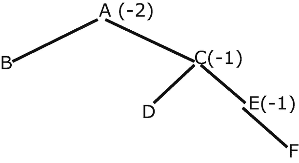

一棵二叉树的示意图，其中值为-2 的节点 A 有两个子节点 B 和 C，值为-1 的节点 C 有两个子节点 D 和 E。值为-1 的节点 E 有一个右子节点 F。

请验证以下搜索树是一棵 AVL 树。

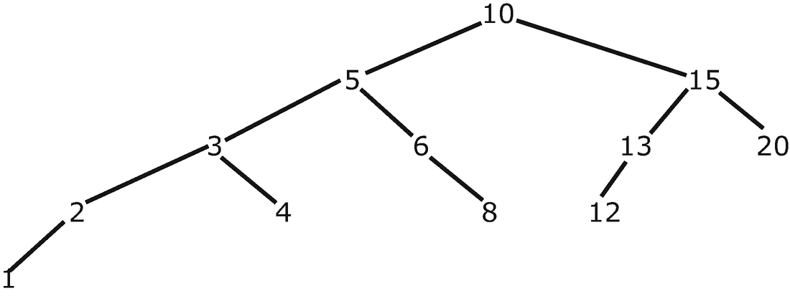

一棵二叉树的示意图，其中根节点 10 有两个子树。左子树的父节点 5 有两个子节点 3 和 6。节点 3 有两个子节点 2 和 4，节点 2 有一个值为 1 的左子节点。右子节点 6 有一个值为 8 的右子节点。右子树的节点 15 有两个子节点 13 和 20，左节点 13 有一个值为 12 的左子节点。

AVL 的插入和删除算法涉及树的旋转。我们用上面的树来演示。

### 树的旋转

对节点 10 执行右旋得到：

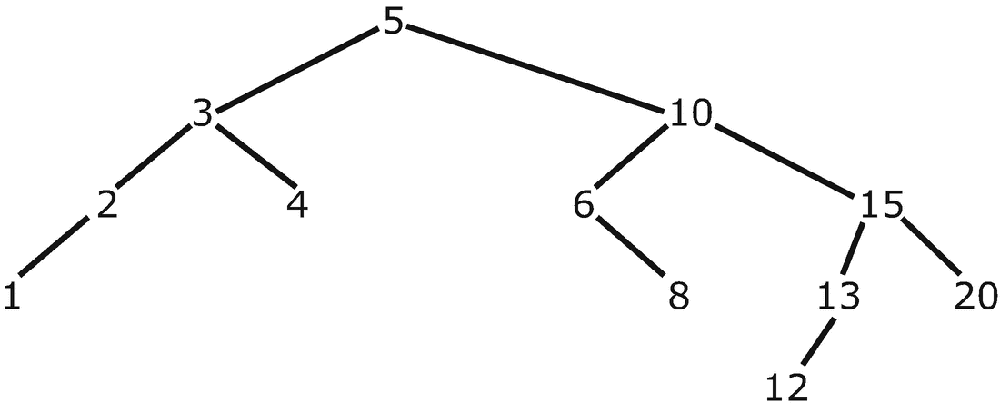

一棵二叉树的示意图，其中节点 5 有两个子树。左子树的父节点 3 有两个子节点 2 和 4。节点 2 有一个值为 1 的左子节点。右子树的节点 10 有两个子节点 6 和 15，节点 6 有一个值为 8 的右子节点，右节点 15 有两个子节点 13 和 20，节点 13 有一个值为 12 的左子节点。

当 10 向右旋转时，5 的右子节点变为节点 10。这使得 6 和 8 成为孤儿节点。由于它们都大于 5 且小于 10，因此它们被放置在 10 的左子树和 5 的右子树中，如上图所示。

对节点 10 执行左旋得到：

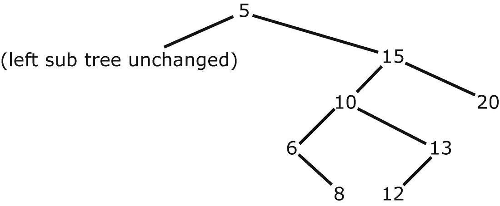

一棵二叉树的示意图，其中节点 5 有两个子树。左侧文字为“左子树不变”。右子树的父节点 15 有两个子节点 10 和 20，左节点 10 有两个子节点 6 和 13，其中节点 6 有一个值为 8 的右子节点，节点 13 有一个值为 12 的左子节点。

孤儿节点 13 和 12 大于 10 且小于 15，它们被放置在上图所示的位置。

执行树旋转涉及的计算工作量非常少。整个树中只需要修改两个链接。无论树的大小如何，这一点都成立。

AVL 算法的精妙之处在于 `Insert` 和 `Delete` 方法。这两个方法都需要在操作后产生一棵 AVL 树。

### 插入

我们首先考虑 AVL 插入。包含四个步骤。

1.  在 AVL 树上执行一次普通的二叉搜索树插入。如果树仍然是 AVL 树，则停止。
2.  从插入的节点（始终位于叶节点位置）开始，沿着搜索路径回溯到根节点。如果发现一个节点组合，其中父节点的平衡值绝对值为 2，其子节点的平衡值绝对值为 1，且符号相同（例如，-2 和 -1 或 2 和 1），则存在 **类型 1** 的配置。如果符号相反（例如，-2 和 1 或 2 和 -1），则存在 **类型 2** 的配置。
3.  如果配置是类型 1，则对父节点执行一次单一旋转，以恢复平衡。
4.  如果配置是类型 2，则执行两次旋转。第一次旋转在子节点上进行，方向与恢复平衡的方向一致。然后，对父节点执行第二次旋转，方向与第一次旋转相反。

这些步骤保证能生成一棵保持 AVL 属性的搜索树。其证明超出了本书的范围。

### 删除

AVL 删除的步骤如下：

1.  执行一次普通的二叉搜索树删除。如果树是 AVL 树，则停止。
2.  如果经过普通删除后树不再是 AVL 树，则从被删除的节点开始，沿着搜索路径遍历到根节点。当出现以下平衡值组合之一时停止：
    a. 父节点的平衡值绝对值为 2，子节点的平衡值绝对值为 1。按照与插入相同的方式判断配置类型，并执行相同类型的单一旋转或两次旋转序列。
    b. 父节点的平衡值为 2 或 -2，而子节点的平衡值为 0。将此视为类型 1 配置，并对父节点执行适当的单一旋转。
    c. 重新评估父节点上方节点的平衡值。由于步骤 a 或 b 中执行的旋转操作，可能会出现另一个需要处理的类型 1 或类型 2 配置。继续执行步骤 c，直到到达根节点且无需进一步的旋转修正。

图 10-1 展示了一棵需要执行步骤 c 的树。

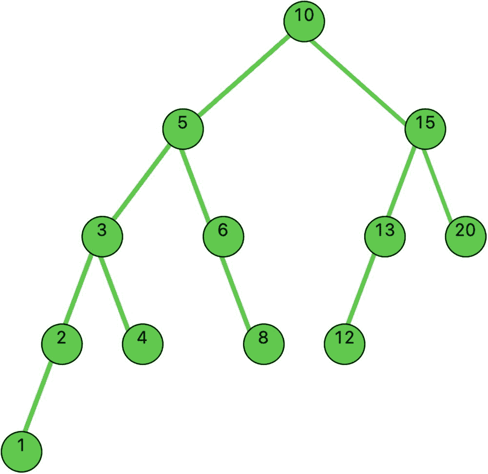

一棵二叉树的示意图，其中节点 10 有两个子树。左子树的父节点 5 有两个子节点 3 和 6。节点 3 有两个子节点 2 和 4，节点 2 有一个值为 1 的左子节点。右子节点 6 有一个值为 8 的右子节点。右子树的节点 15 有两个子节点 13 和 20，左节点 13 有一个值为 12 的左子节点。

**图 10-1** — 用于说明 AVL 删除的树

我们想要删除节点 20。在普通删除 20 后，节点 15 的平衡值变为 2。这促使我们对节点 15 执行一次右旋。节点 13 向上移动，成为根节点 10 的右子节点。

但现在，根节点 10 的平衡值也变成了 2，因为它的左子树高度为 4，右子树高度为 2（在第一次旋转中，右子树丢失了一层高度）。我们通过对节点 10 执行一次右旋来修正这个情况。作为练习，请画出结果树的草图。

作为练习，请画出在步骤 c 之后得到的 AVL 树的草图。


### 关于 AVL 树的事实

以下是关于 AVL 树的一些有趣事实：

- 向 AVL 树插入节点时，大约 50% 的插入操作不需要进行旋转修正。在剩下的 50% 中，约一半需要类型 1 的单次旋转修正，另一半需要类型 2 的旋转修正。
- 从 AVL 树删除节点时，约 80% 的情况不需要旋转修正。在剩下的 20% 中，约一半是类型 1，一半是类型 2。在搜索树中需要多次旋转修正的情况非常罕见。

下一节，我们将介绍一个通用 AVL 树的实现。

## 实现一个通用 AVL 树

代码清单 10-1 展示了一个完整的 `avl` 包。与二叉搜索树一样，我们包含了用于显示 AVL 树的辅助代码。

```
package avl

import (
	"image/color"
	"log"
	"fyne.io/fyne/v2"
	"fyne.io/fyne/v2/app"
	"fyne.io/fyne/v2/canvas"
	"fyne.io/fyne/v2/theme"
	"github.com/mitchellh/go-homedir"
	"gonum.org/v1/plot"
	"gonum.org/v1/plot/plotter"
	"gonum.org/v1/plot/vg"
	"gonum.org/v1/plot/vg/draw"
)

type ordered interface {
	~int | ~float64 | ~string
}

type AVLTree[T OrderedStringer] struct {
	Root     *Node[T]
	NumNodes int
}

type Node[T OrderedStringer] struct {
	Value T
	Left  *Node[T]
	Right *Node[T]
	Ht    int
}

type OrderedStringer interface {
	ordered
	String() string
}

// Methods
func (avl *AVLTree[T]) Insert(newValue T) {
	if avl.Search(newValue) == false { // newValue is not in existing tree
		avl.Root = insertNode(avl.Root, newValue)
		avl.NumNodes += 1
	}
}

func (avl *AVLTree[T]) Delete(value T) {
	if avl.Search(value) == true {
		avl.Root = deleteNode(avl.Root, value)
		avl.NumNodes -= 1
	}
}

func (avl *AVLTree[T]) Search(value T) bool {
	return search(avl.Root, value)
}

func (avl *AVLTree[T]) Height() int {
	return avl.Root.Height()
}

func (avl *AVLTree[T]) InOrderTraverse(f func(T)) {
	inOrderTraverse(avl.Root, f)
}

func (avl *AVLTree[T]) Min() *T {
	node := avl.Root
	if node == nil {
		return nil
	}
	for {
		if node.Left == nil {
			return &node.Value
		}
		node = node.Left
	}
}

func (avl *AVLTree[T]) Max() *T {
	node := avl.Root
	if node == nil {
		return nil
	}
	for {
		if node.Right == nil {
			return &node.Value
		}
		node = node.Right
	}
}

func (n *Node[T]) balanceFactor() int {
	if n == nil {
		return 0
	}
	return n.Left.Height() - n.Right.Height()
}

func (n *Node[T]) Height() int {
	if n == nil {
		return 0
	} else {
		return n.Ht
	}
}

func (n *Node[T]) updateHeight() {
	max := func(a, b int) int {
		if a > b {
			return a
		}
		return b
	}
	n.Ht = max(n.Left.Height(), n.Right.Height()) + 1
}

// Support functions
func newNodeT OrderedStringer *Node[T] {
	return &Node[T]{
		Value: val,
		Left:  nil,
		Right: nil,
		Ht:    1,
	}
}

func searchT OrderedStringer bool {
	if n == nil {
		return false
	}
	if value < n.Value {
		return search(n.Left, value)
	} else if value > n.Value {
		return search(n.Right, value)
	}
	return true
}

func insertNodeT OrderedStringer *Node[T] {
	// if there's no node, create one
	if node == nil {
		return newNode(val)
	}
	// if value is greater than current node's value, insert to the right
	if val > node.Value {
		right := insertNode(node.Right, val)
		node.Right = right
	}
	// if value is less than current node's value, insert to the left
	if val < node.Value {
		left := insertNode(node.Left, val)
		node.Left = left
	}
	return rotateInsert(node, val)
}

func rotateInsertT OrderedStringer *Node[T] {
	node.updateHeight()
	bFactor := node.balanceFactor()
	if bFactor > 1 && val < node.Left.Value {
		return rightRotate(node)
	}
	if bFactor < -1 && val > node.Right.Value {
		return leftRotate(node)
	}
	if bFactor > 1 && val > node.Left.Value {
		node.Left = leftRotate(node.Left)
		return rightRotate(node)
	}
	if bFactor < -1 && val < node.Right.Value {
		node.Right = rightRotate(node.Right)
		return leftRotate(node)
	}
	return node
}

func rightRotateT OrderedStringer *Node[T] {
	x := y.Left
	t2 := x.Right
	x.Right = y
	y.Left = t2
	y.updateHeight()
	x.updateHeight()
	return x
}

func leftRotateT OrderedStringer *Node[T] {
	y := x.Right
	t2 := y.Left
	y.Left = x
	x.Right = t2
	x.updateHeight()
	y.updateHeight()
	return y
}

func rotateDeleteT OrderedStringer *Node[T] {
	node.updateHeight()
	bFactor := node.balanceFactor()
	if bFactor > 1 && node.Left.balanceFactor() >= 0 {
		return rightRotate(node)
	}
	if bFactor > 1 && node.Left.balanceFactor() < 0 {
		node.Left = leftRotate(node.Left)
		return rightRotate(node)
	}
	if bFactor < -1 && node.Right.balanceFactor() <= 0 {
		return leftRotate(node)
	}
	if bFactor < -1 && node.Right.balanceFactor() > 0 {
		node.Right = rightRotate(node.Right)
		return leftRotate(node)
	}
	return node
}

func deleteNodeT OrderedStringer *Node[T] {
	if node == nil {
		return nil
	}
	if val > node.Value {
		right := deleteNode(node.Right, val)
		node.Right = right
	} else if val < node.Value {
		left := deleteNode(node.Left, val)
		node.Left = left
	} else {
		if node.Left != nil && node.Right != nil {
			// has 2 children, find the successor
			successor := largest(node.Left)
			value := successor.Value
			// remove the successor
			left := deleteNode(node.Left, value)
			node.Left = left
			// copy the successor value to the current node
			node.Value = value
		} else if node.Left != nil || node.Right != nil {
			// has 1 child
			// move the child position to the current node
			if node.Left != nil {
				node = node.Left
			} else {
				node = node.Right
			}
		} else if node.Left == nil && node.Right == nil {
			// has no child
			// simply remove the node
			node = nil
		}
		if node == nil {
			return nil
		}
		return rotateDelete(node)
	}
	return node
}

func largestT OrderedStringer *Node[T] {
	if node == nil || node.Right == nil {
		return node
	}
	return largest(node.Right)
}

func inOrderTraverseT OrderedStringer) {
	if node != nil {
		inOrderTraverse(node.Left, f)
		f(node.Value)
		inOrderTraverse(node.Right, f)
	}
}

// Logic for drawing tree
type NodePair struct {
	Val1, Val2 string
}

type NodePos struct {
	Val  string
	YPos int
	XPos int
}

var data []NodePos
var endPoints []NodePair

func PrepareDrawTreeT OrderedStringer {
	prepareToDraw(tree)
}

func FindXY(val interface{}) (int, int) {
	for i := 0; i < len(data); i++ {
		if data[i].Val == val {
			return data[i].XPos, data[i].YPos
		}
	}
	return -1, -1
}

func FindX(val interface{}) int {
	for i := 0; i < len(data); i++ {
		if data[i].Val == val {
			return i
		}
	}
	return -1
}

func SetXValues() {
	for index := 0; index < len(data); index++ {
		xValue := FindX(data[index].Val)
		data[index].XPos = xValue
	}
}

func prepareToDrawT OrderedStringer {
	inorderLevel(tree.Root, 1)
	SetXValues()
	getEndPoints(tree.Root, nil)
}

func inorderLevelT OrderedStringer {
	if node != nil {
		inorderLevel(node.Left, level+1)
		data = append(data, NodePos{node.Value.String(), 100 - level, -1})
		inorderLevel(node.Right, level+1)
	}
}

func getEndPointsT OrderedStringer {
	if node != nil {
		if parent != nil {
			endPoints = append(endPoints, NodePair{node.Value.String(), parent.Value.String()})
		}
		getEndPoints(node.Left, node)
		getEndPoints(node.Right, node)
	}
}

var path string

func DrawGraph(a fyne.App, w fyne.Window) {
	image := canvas.NewImageFromResource(theme.FyneLogo())
	image = canvas.NewImageFromFile(path + "tree.png")
	image.FillMode = canvas.ImageFillOriginal
	w.SetContent(image)
	w.Close()
	w.Show()
}

func ShowTreeGraphT OrderedStringer {
	PrepareDrawTree(myTree)
	myApp := app.New()
	myWindow := myApp.NewWindow("Tree")
	myWindow.Resize(fyne.NewSize(1000, 600))
	path, _ = homedir.Dir()
	path += "/Desktop/"
	nodePts := make(plotter.XYs, myTree.NumNodes)
	for i := 0; i < len(data); i++ {
		nodePts[i].Y = float64(data[i].YPos)
		nodePts[i].X = float64(data[i].XPos)
	}
	nodePtsData := nodePts
	p := plot.New()
	p.Add(plotter.NewGrid())
	nodePoints, err := plotter.NewScatter(nodePtsData)
	if err != nil {
		log.Panic(err)
	}
	nodePoints.Shape = draw.CircleGlyph{}
	nodePoints.Color = color.RGBA{G: 255, A: 255}
	nodePoints.Radius = vg.Points(12)

	// Plot lines
	for index := 0; index < len(endPoints); index++ {
		val1 := endPoints[index].Val1
		x1, y1 := FindXY(val1)
		val2 := endPoints[index].Val2
		x2, y2 := FindXY(val2)
		pts := plotter.XYs{{X: float64(x1), Y: float64(y1)}, {X: float64(x2), Y: float64(y2)}}
		line, err := plotter.NewLine(pts)
		if err != nil {
			log.Panic(err)
		}
		scatter, err := plotter.NewScatter(pts)
		if err != nil {
			log.Panic(err)
		}
		p.Add(line, scatter)
	}
	p.Add(nodePoints)

	// Add Labels
	for index := 0; index < len(data); index++ {
		x := float64(data[index].XPos) - 0.2
		y := float64(data[index].YPos) - 0.02
		str := data[index].Val
		label, err := plotter.NewLabels(plotter.XYLabels{
			XYs: []plotter.XY{
				{X: x, Y: y},
			},
			Labels: []string{str},
		})
		if err != nil {
			log.Fatalf("could not creates labels plotter: %+v", err)
		}
		p.Add(label)
	}

	path, _ = homedir.Dir()
	path += "/Desktop/GoDS/"
	err = p.Save(1000, 600, "tree.png")
	if err != nil {
		log.Panic(err)
	}
	DrawGraph(myApp, myWindow)
	myWindow.ShowAndRun()
}
```

*代码清单 10-1: avl 包*


### `avl` 包说明

有许多函数需要分析。最简单的方法是使用调试器。我使用了 **VS Code** 和 **IntelliJ IDEA Ultimate**，它们都带有 Go 插件和出色的调试器。

我们使用清单 10-2 中给出的主驱动程序代码构建了之前展示的树。

```
package main

import (
    avl "example.com/avl"
    "fmt"
)

type Integer int

func (num Integer) String() string {
    return fmt.Sprintf("%d", num)
}

func main() {
    myTree := avl.AVLTree[Integer]{nil, 0}
    myTree.Insert(10)
    myTree.Insert(15)
    myTree.Insert(5)
    myTree.Insert(3)
    myTree.Insert(6)
    myTree.Insert(13)
    myTree.Insert(20)
    myTree.Insert(2)
    myTree.Insert(4)
    myTree.Insert(8)
    myTree.Insert(12)
    myTree.Insert(1)
    // myTree.Delete(20)
    avl.ShowTreeGraph(myTree)
}
清单 10-2
主驱动程序代码
```

这将生成如图 10-2 所示的树形显示。

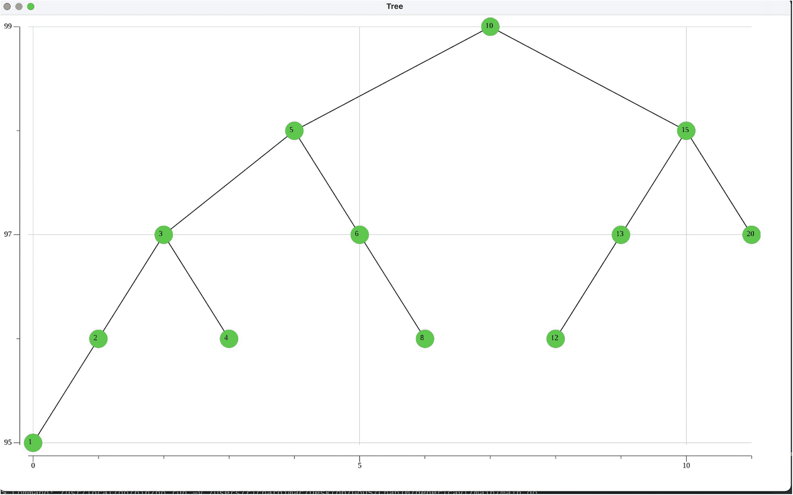

一棵二叉树示意图，其中节点 10 有两个子树。左侧子树的父节点 5 有两个子节点 3 和 6。节点 3 有 2 个子节点 2 和 4，节点 2 有一个值为 1 的左子节点。右侧子节点 6 有一个值为 8 的右子节点。右侧子树的节点 15 有 2 个子节点 13 和 20，左节点 13 有一个值为 12 的左子节点。

**图 10-2** 生成的 AVL 树

使用调试器，让我们“走读”删除节点 20 的代码，这是较难处理的情况之一。如果你没有调试器，只需在视觉上逐行执行“走读”即可。

我们取消注释代码行 `myTree.Delete(20)`，并使用 **IntelliJ IDEA** 在这行代码处设置一个断点。

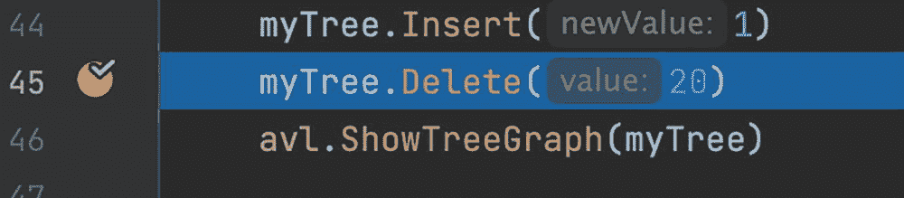

程序代码图像，其中断点设置在第四十五行指令 `my tree dot delete of value 20`。

在函数 `deleteNode` 中，我们沿着树向下递归到右侧，直到节点等于 `nil`。然后递归回溯到等于 15 的节点。

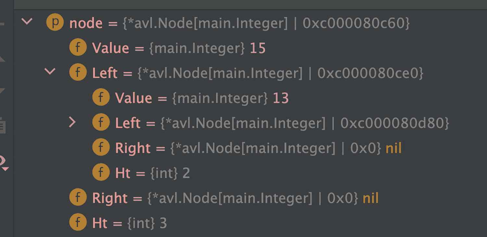

九行代码的图像，描述了几行代码生成的值，其中包括：`value` 等于 15，`value` 等于 13，`right` 等于 `nil`，`H t` 等于 2，`right` 等于 `nil` 以及 `H t` 等于 3。

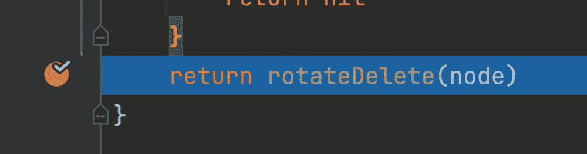

程序代码图像，其中断点设置在指令 `return rotate delete of node`。

我们以节点 15 进入函数 `rotateDelete`。15 的右子节点已被设置为 `nil`。

节点 15 的 `bFactor`（平衡因子）为 2，其左节点的 `bFactor` 为 1。

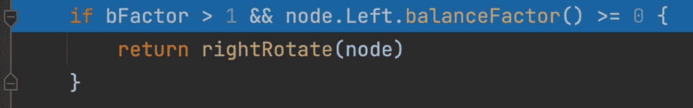

程序代码图像，其中断点设置在指令 `if b factor greater than 1 logical AND node dot left dot balance factor function greater than or equals to zero`。

我们调用 `rightRotate(node)`，其中 node 是 15。变量 `y` 被设置为 13；13 的右子节点被设置为 15。节点 13 被返回递归链（作为后续调试器代码中显示的 `right`）。

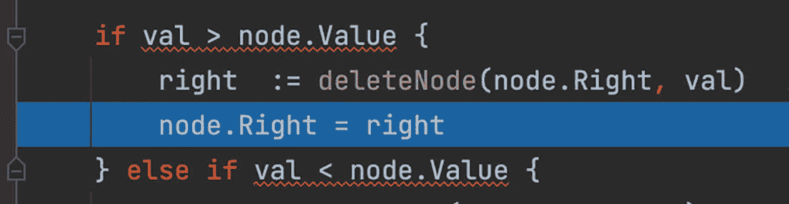

带有 `if-else` 块的程序代码图像，其中断点设置在指令 `node dot right equals to right`。

节点 10 将其右子节点赋值为 13。`deleteNode` 末尾的 return 语句返回 `rotateDelete(10)` 的结果。

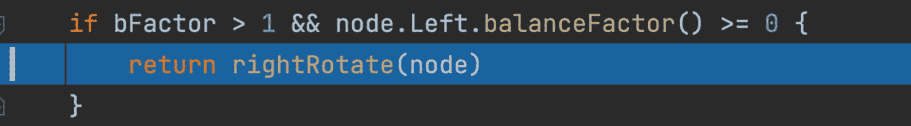

带有 `if` 块的程序代码图像，其中断点设置在指令 `return right rotate of node`。

基于 10 的 `bFactor`（大于 1）和 5 的 `bFactor`（大于或等于 0），接下来我们执行 `rightRotate(10)`。

值 5 被返回链上，并成为树的新根节点。5 的右子节点变为 10。10 的左子节点变为 6。

新树如图 10-3 所示。

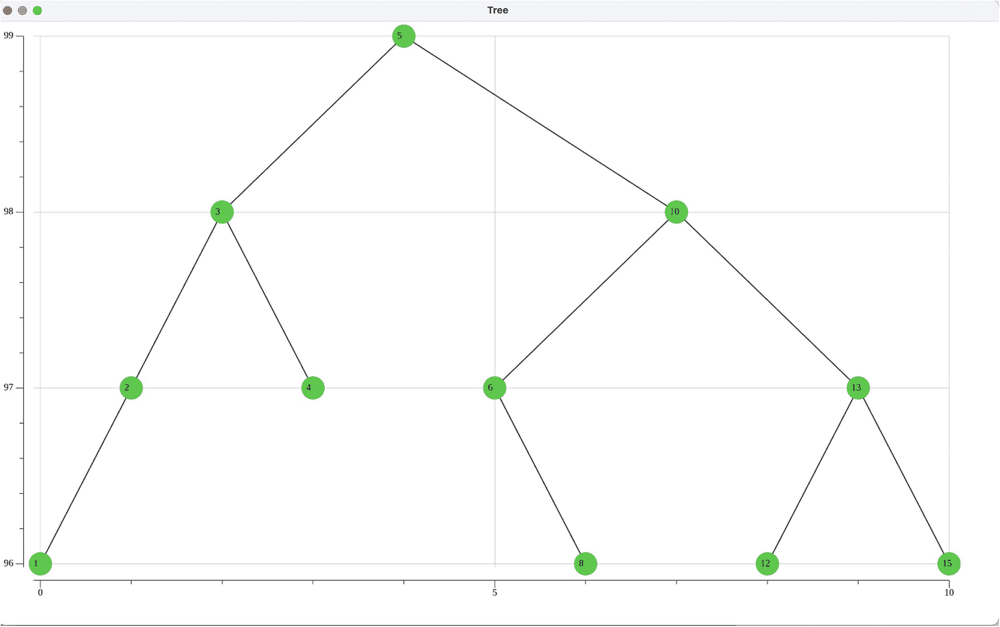

一棵二叉树示意图，其中节点 5 有两个子树。左侧子树的父节点 3 有两个子节点 2 和 4。节点 2 有一个值为 1 的左子节点。右侧子树节点 10 有 2 个子节点 6 和 13，左节点 6 有一个值为 8 的右子节点，右节点 13 有两个值为 12 和 15 的子节点。

**图 10-3** 删除操作后得到的树

AVL 树的一些其他测试在清单 10-3 中给出（取消注释你想要执行的测试）。

```
package main

import (
    avl "example.com/avl"
    "fmt"
    "math/rand"
    "time"
)

func inorderOperator(val Float) {
    val *= val
    fmt.Println(val.String())
}

// 由于 ~float64，实现了 OrderedStringer
// 同时由于下面的 String() 方法，也实现了 OrderedStringer
type Float float64

func (num Float) String() string {
    return fmt.Sprintf("%0.1f", num)
}

type Integer int

func (num Integer) String() string {
    return fmt.Sprintf("%d", num)
}

func main() {
    rand.Seed(time.Now().UnixNano())

    // 生成一棵随机搜索树
    randomSearchTree := avl.AVLTree[Float]{nil, 0}
    for i := 0; i < 30; i++ {
        rn := 1.0 + 99.0 * rand.Float64()
        randomSearchTree.Insert(Float(rn))
    }
    time.Sleep(3 * time.Second)
    avl.ShowTreeGraph(randomSearchTree)
    randomSearchTree.InOrderTraverse(inorderOperator)
    min := randomSearchTree.Min()
    max := randomSearchTree.Max()
    fmt.Printf("\n 树中最小值为 %0.1f  树中最大值为 %0.1f", *min, *max)

    /*
    start := time.Now()
    tree := avl.AVLTree[Integer]{nil, 0}
    for val := 0; val < 100_000; val++ {
        tree.Insert(Integer(val))
    }
    elapsed := time.Since(start)
    fmt.Printf("\n 构建具有 100,000 个节点的 AVL 树所用时间: %s.  树的高度: %d", elapsed, tree.Height())
    numbers := make([]int, 100_000)
    for i := 0; i < 100_000; i++ {
        numbers[i] = i
    }
    start = time.Now()
    sort.Ints(numbers)
    elapsed = time.Since(start)
    fmt.Printf("\n 对 100,000 个整数进行排序所用时间: %s", elapsed)
    */
}

/*
构建具有 100,000 个节点的 BST 树所用时间：17.054928498s
构建具有 100,000 个节点的 AVL 树所用时间：24.698786ms
构建具有 1,000,000 个节点的 AVL 树所用时间：281.799923ms
*/
清单 10-3
另一个包含更多 AVL 测试的主驱动程序
```

### 主驱动程序结果讨论

使用清单 10-3 生成的 30 节点 AVL 树的图形如图 10-4 所示。

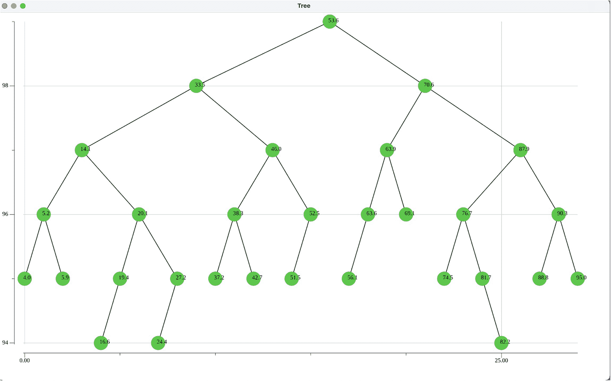

一棵有 30 个节点的 AVL 树示意图。根节点是 53.6，有五个层级的子节点。第 1 层的值：33.5, 70.6；第 2 层：14.1, 46.0, 63.9, 87.9；第 3 层：5.2, 20.1, 38.3, 52.5, 63.6, 69.1, 76.7, 90.3；第 4 层：4.0, 5.9, 19.4, 27.2, 37.2, 42.7, 51.5, 56.1, 74.5, 81.7, 88.8, 95.0；第 5 层：16.6, 24.4, 82.2

**图 10-4** 一个三十节点的 AVL 树

AVL 树是一种有序集合。`Search` 方法允许我们确定数据结构中是否存在某个键值。这是任何集合的核心要求。它还允许我们执行中序遍历，从小到大访问节点。

在下一节中，我们首先使用 AVL 树，然后使用并发 AVL 树来实现一个**集合**。我们假设该集合包含浮点数值。在下一章中，我们将介绍一个更完整的泛型集合实现。


好的，作为高级文档工程师和翻译员，我将严格遵循您提供的注意事项和示例格式，将所给的英文文本翻译成中文。


## 10.3 使用 Map、AVL 树和并发 AVL 树实现集合

集合通常使用**map**来实现。清单 10-4 展示了一个集合的几个重要方法。

```go
func NewSet() *Set {
	return &Set{
		container: make(map[float64]struct{}),
	}
}

type Set struct {
	container map[float64]struct{}
}

func (c *Set) IsPresent(key float64) bool {
	_, present := c.container[key]
	return present
}

func (c *Set) Add(key float64) {
	c.container[key] = struct{}{}
}

func (c *Set) Remove(key float64) error {
	_, present := c.container[key]
	if !present {
		return fmt.Errorf("Remove Error: Item doesn't exist in set")
	}
	delete(c.container, key)
	return nil
}

func (c *Set) Size() int {
	return len(c.container)
}
```

*清单 10-4：使用 map 实现的集合*

在清单 10-4 中，我们假设集合元素的基类型是 `float64`。map 结构将一个空的 `struct{}` 与每个 `float64` 键值关联起来。这里，我们只关心 map 中键值对的键。

众所周知，**map** 对其成员的访问速度很快。我们希望将此 map 实现的集合与 AVL 树的性能进行比较。接着，我们定义一个并发 AVL 集合，它会并发地构建多个 AVL 树，并将其性能与 map 和单 AVL 树实现进行比较。

### 使用 Map、AVL 树和并发 AVL 树实现集合

清单 10-5 展示了一个 `floatset` 包，其中包含了集合的 map、AVL 树和并发 AVL 树实现。为了节省篇幅，我们跳过了 AVL 树的实现细节，因为前面已经介绍过了。

```go
package floatset

import (
	"fmt"
	"sort"
	"sync"
)

const (
	Concurrent = 32
)

var max [Concurrent]float64 // 存储每棵 AVL 树中的最大值

func NewSet() *Set { // 创建一个新的 Set
	return &Set{
		container: make(map[float64]struct{}),
	}
}

type Set struct {
	container map[float64]struct{}
}

func (c *Set) IsPresent(key float64) bool {
	_, present := c.container[key]
	return present
}

func (c *Set) Add(key float64) {
	c.container[key] = struct{}{}
}

func (c *Set) Remove(key float64) error {
	_, present := c.container[key]
	if !present {
		return fmt.Errorf("Remove Error: Item doesn't exist in set")
	}
	delete(c.container, key)
	return nil
}

func (c *Set) Size() int {
	return len(c.container)
}

// 跳过 AVL 树细节

var concurrrentSet [Concurrent]AVLTree // AVL 树切片

func BuildConcurrentSet(dataSet []float64) {
	// 使用并发处理来构建并发 AVL 树
	var wg sync.WaitGroup
	sort.Float64s(dataSet)
	segment := len(dataSet) / Concurrent
	for treeNumber := 0; treeNumber < Concurrent; treeNumber++ {
		wg.Add(1)
		go func(num int) {
			defer wg.Done()
			startVal := segment * num
			for j := startVal; j < startVal+segment; j++ {
				concurrrentSet[num].Insert(dataSet[j])
			}
			max[num] = dataSet[startVal+segment-1]
		}(treeNumber)
	}
	wg.Wait()
}

func IsPresent(val float64) bool {
	// 确定 val 属于哪一棵 AVL 树
	treeNumber := 0
	for ; treeNumber < len(max); treeNumber++ {
		if val <= max[treeNumber] {
			break
		}
	}
	return concurrrentSet[treeNumber].Search(val)
}
```

*清单 10-5：`floatset` 包*

### 并发 AVL 集合的解释

常量 `Concurrent`（本例中为 32）定义了并发构建的 AVL 树的数量。`concurrentSet` 变量存储了一个 `AVLTree` 数组。

首先，我们对传入的 `dataSet` 切片进行排序。然后通过将 `dataSet` 的长度除以并发树的数量，计算出每棵 AVL 树中的节点数 `segment`。

在遍历树编号的循环中，我们调用多个 goroutine，每个 goroutine 从传入的 `dataSet` 切片中插入已排序的值。通过等待组（WaitGroup）确保在退出此函数之前，每棵并发构建的 AVL 树都已经完成。

全局 `max` 数组存储了每棵 AVL 树中的最大值。由于 `max` 数组中的索引对每个 goroutine（传入的树编号）是唯一的，因此 goroutine 在赋值给 `max` 时不会发生冲突。

函数 `IsPresent` 首先通过将传入的 `val` 与 `max` 数组中存储的每棵 AVL 树的最大值进行比较，来确定该值属于哪棵 AVL 树。确定之后，该函数将返回在正确的树编号上调用 `Search` 方法的结果。

### 比较三种集合实现

清单 10-6 是一个驱动程序，用于执行比较集合构建时间以及（最重要的）判断值是否存在的耗时实验。为此，我们会访问数据集中的每一个元素，并判断它是否存在于我们正在计时的集合类型中。

```go
package main

import (
	"fmt"
	"math/rand"
	"time"
	"example.com/floatset"
)

const (
	size = 1_000_000
)

var dataSet []float64

func main() {
	mySet := floatset.NewSet()
	dataSet = make([]float64, size)
	for i := 0; i < size; i++ {
		dataSet[i] = 100.0 * rand.Float64()
	}

	// 计时 Set 的构建
	start := time.Now()
	for i := 0; i < size; i++ {
		mySet.Add(dataSet[i])
	}
	elapsed := time.Since(start)
	fmt.Printf("\n 使用 %d 个元素构建 Set 耗时: %s", size, elapsed)

	// 计时测试 dataSet 中所有元素是否存在
	start = time.Now()
	for i := 0; i < len(dataSet); i++ {
		if !mySet.IsPresent(dataSet[i]) {
			fmt.Println("%f 不存在", dataSet[i])
		}
	}
	elapsed = time.Since(start)
	fmt.Printf("\n 测试 Set 中所有元素是否存在耗时: %s",
		elapsed)

	avlSet := floatset.AVLTree{nil, 0}
	// 计时 avlSet 的构建
	start = time.Now()
	for i := 0; i < size; i++ {
		avlSet.Insert(dataSet[i])
	}
	elapsed = time.Since(start)
	fmt.Printf("\n\n 使用 %d 个元素构建 avlSet 耗时: %s", size, elapsed)

	// 计时测试 avlSet 中所有元素是否存在
	start = time.Now()
	for i := 0; i < len(dataSet); i++ {
		if !mySet.IsPresent(dataSet[i]) {
			fmt.Println("%f 不存在", dataSet[0])
		}
	}
	elapsed = time.Since(start)
	fmt.Printf("\n 测试 avlSet 中所有元素是否存在耗时: %s",
		elapsed)

	// 使用并发处理来构建并发 AVL 树
	start = time.Now()
	floatset.BuildConcurrentSet(dataSet)
	elapsed = time.Since(start)
	fmt.Printf("\n\n 使用 %d 个元素构建并发 (%d) avlSet 耗时: %s", floatset.Concurrent, size, elapsed)

	// 对照并发集合测试 dataSet 中的每个元素
	start = time.Now()
	for i := 0; i < len(dataSet); i++ {
		if !floatset.IsPresent(dataSet[i]) {
			fmt.Println("%f 不存在", dataSet[i])
		}
	}
	elapsed = time.Since(start)
	fmt.Printf("\n 测试并发 (%d) avlSet 中所有元素是否存在耗时: %s", floatset.Concurrent, elapsed)
}

/*
在配备 32G 内存和 3.2 GHz 8 核 Intel Xeon W 的 iMac Pro 上
使用 1000000 个元素构建 Set 耗时: 184.442966ms
测试 Set 中所有元素是否存在耗时: 105.600217ms

使用 1000000 个元素构建 avlSet 耗时: 819.517251ms
测试 avlSet 中所有元素是否存在耗时: 103.422116ms

使用 1000000 个元素构建并发 (32) avlSet 耗时: 184.681628ms
测试并发 (32) avlSet 中所有元素是否存在耗时: 66.183935ms

在配备 32G 内存的 Apple M1 Max 的 iMac Pro 上
使用 1000000 个元素构建 Set 耗时: 90.186209ms
测试 Set 中所有元素是否存在耗时: 44.667542ms

使用 1000000 个元素构建 avlSet 耗时: 421.970625ms
测试 avlSet 中所有元素是否存在耗时: 39.154042ms

使用 1000000 个元素构建并发 (32) avlSet 耗时: 172.478583ms
测试并发 (32) avlSet 中所有元素是否存在耗时: 47.972875ms
*/
```

*清单 10-6：比较三种集合类型的性能*


### 结果讨论

该程序在两台计算机上运行，结果令人惊讶。

在一台配备 32G 内存、3.2GHz 八核 Intel Xeon W 处理器的 2017 款 iMac Pro 上，`concurrentAVLSet` 呈现了最快的 `isPresent` 性能，比单棵 AVL 树更快，并且比基于映射（map）实现的 set 快两倍以上。

在一台配备 32G 统一内存、10 核 CPU 和 32 核 GPU 的 Apple M1 Max 芯片的 MacBook Pro 上，`concurrentAVLSet` 的表现最慢，而单棵 AVL 树的性能最快。

必须指出的是，Apple M1 Max 计算机上所有 set 实现的运行速度，都显著快于它们在 Intel Xeon W 计算机上的对应执行时间。

因此，尚不清楚在将输入数据填充到 32 棵 AVL 树的过程中使用 Go 协程和并发处理是否能带来有意义的益处，因为结果取决于处理器。

## 10.4 本章小结

我们介绍了 AVL 树的特性。`Insert`（插入）和 `Delete`（删除）操作能够保持 AVL 树的特性。我们概述了执行这些操作的逻辑。接着，我们呈现了一个包含这些操作的包，并检验了构建和搜索 AVL 树的相关性能。最后，我们展示了使用 map、AVL 树和并发 AVL 树三种不同方式实现的 Set，并比较了它们的性能。

在下一章中，我们将重点介绍哈希函数和哈希表，以及几个重要的应用。

