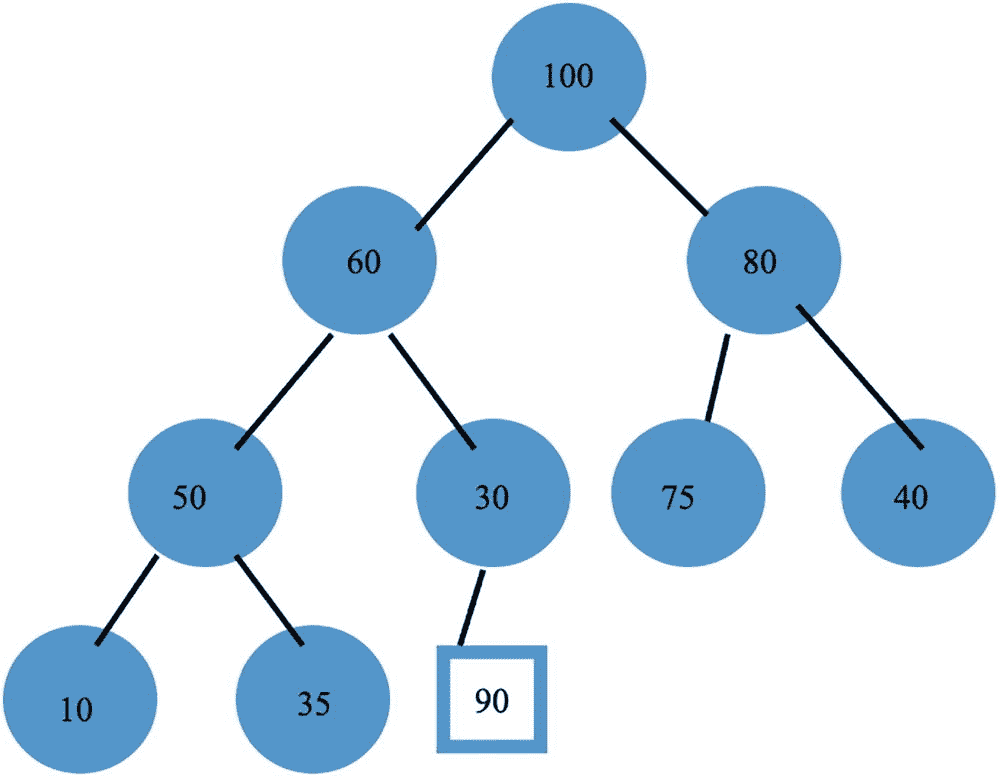
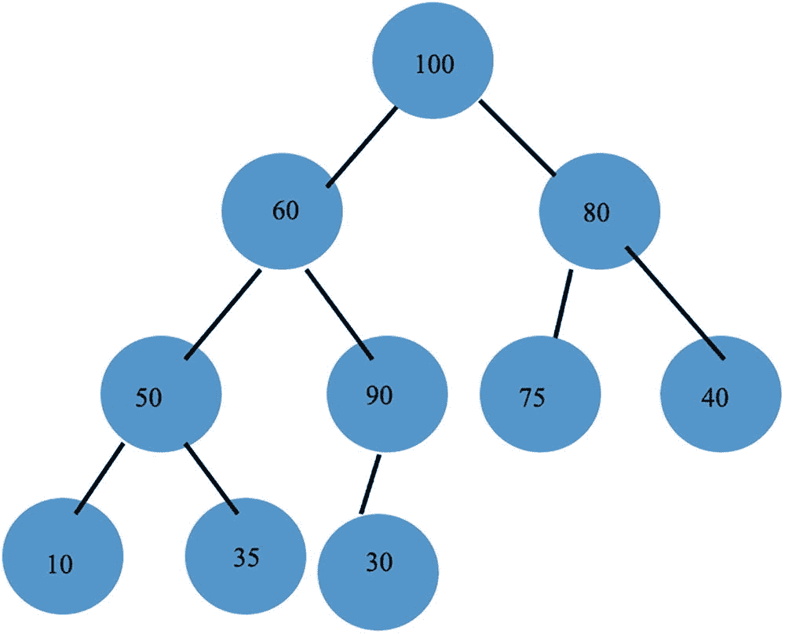
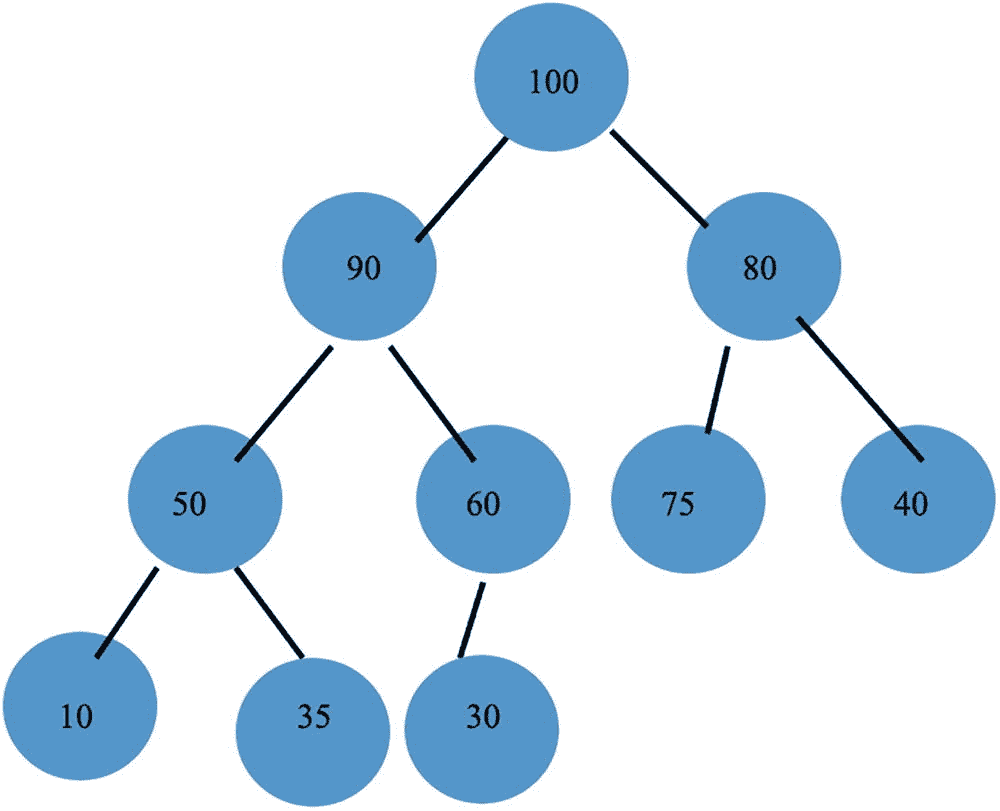
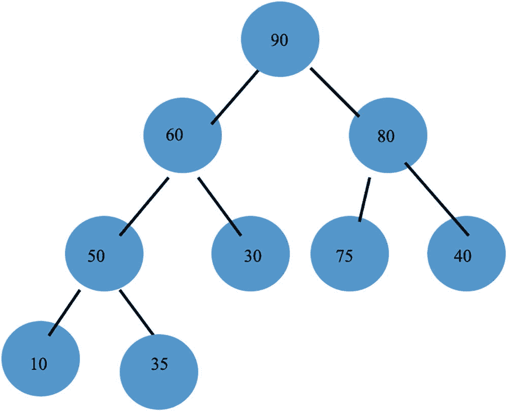

# 11. 堆树

上一章介绍了 AVL 树。当需要大量快速查找时，这些树极其有用。

在本章中，我们将介绍另一种重要的树结构——`堆`。堆树是另一种平衡树类型，树中最大的项始终位于树的根节点。我们使用堆树来实现一种高效的排序算法。

在下一节中，我们将定义堆树并说明堆树的构建过程。

## 11.1 堆树的构建

堆是一棵完全二叉树，其特点是**每个节点的值都大于它的两个子节点**。堆树中最大的值始终位于根节点。完全二叉树的叶子节点从最深层从左到右填充。

请看下图所示的堆树。每个节点的值都大于它的两个子节点。

我们想要插入一个值为 90 的新节点。见图 11-1。



一幅堆树结构示意图，展示了以数字 100 为顶点的最大堆，共三层。根节点 100 有两个子树 60 和 80。左子树：节点 60 有两个子节点 50 和 30。节点 50 有两个子节点 10 和 35。右子树：节点 80 有两个子节点 75 和 40。左子树中的节点 30 处插入了一个新节点，值为 90。

图 11-1

插入 90

我们按从左到右的顺序填充叶子节点，因此节点 90 需要成为节点 30 的左子节点。但是 90 比它的父节点 30 大。因此我们交换这两个节点。见图 11-2。



一幅堆树结构示意图，展示了以数字 100 为顶点的最大堆，共三层。根节点 100 有两个子树 60 和 80。左子树：节点 60 有两个子节点 50 和 90。节点 50 有两个子节点 10 和 35。节点 90 有一个子节点 30。右子树：节点 80 有两个子节点 75 和 40。

图 11-2

插入的继续

但是 90 比它的父节点 60 大，所以我们再次进行交换，得到包含 90 的新堆树。见图 11-3。



一幅堆树结构示意图，展示了以数字 100 为顶点的最大堆，共三层。根节点 100 有两个子树 90 和 80。左子树：节点 90 有两个子节点 50 和 60。节点 50 有两个子节点 10 和 35。节点 60 有一个子节点 30。右子树：节点 80 有两个子节点 75 和 40。

图 11-3

插入后的结果

在下一节中，我们将展示如何从堆树中执行删除操作。

## 11.2 从堆树中删除

我们只能删除堆树根节点中的值。要删除根节点的值 100，我们使用树中最低层最右侧节点的值（本例中为 30）替换根节点中的值。然后，我们将新的根节点值与其两个子节点的值进行比较，并与较大的子节点进行交换。我们继续这个下沉过程，直到没有更多节点需要交换。因此，30 先与 90（子节点 90 和 80 中较大的那个）交换；然后 30 再与 60（子节点 50 和 60 中较大的那个）交换。这得到了图 11-4 所示的新堆树。



一幅堆树结构示意图，展示了以数字 90 为顶点的最大堆，共三层。根节点 90 有两个子树 60 和 80。左子树：节点 60 有两个子节点 50 和 30。节点 50 有两个子节点 10 和 35。右子树：节点 80 有两个子节点 75 和 40。

图 11-4

删除后的结果

在下一节中，我们将研究从一个切片构建通用堆树以及插入新项的实现细节。

## 11.3 堆树的实现

### 构建堆树的逻辑

构建堆树以及在堆树中插入项的逻辑，源于切片中项的 `index`（索引）与该堆树中项的位置之间的以下关系。假设我们在指定的 `index` 处有一个项。

- 如果索引是奇数，其父节点位于 `index / 2` 处；如果索引是偶数，则位于 `index / 2 – 1` 处。
- 其左子节点位于索引 `2 * index + 1` 处。
- 其右子节点位于索引 `2 * index + 2` 处。

考虑与上述堆树对应的切片 `[90, 60, 80, 50, 30, 75, 40, 10, 35]`。通过按从左到右的顺序遍历树中每个层级的值，切片的值与堆树中的值相关联。

考虑切片中索引为 3、值为 50 的节点。

其父节点位于索引 3 / 2，等于 1。这对应着值为 60 的节点。其两个子节点位于索引值 `2 * 3 + 1` 和 `2 * 3 + 2`，即索引 7 和 8。这对应着值为 10 和 35 的节点。


### 包 `heap`

代码清单 11-1 展示了一个泛型堆的包，代码清单 11-2 则是一个主驱动程序，用于测试和练习该堆包的各方法。

```
package main
import (
"fmt"
"example.com/heap"
)
func main() {
slice1:= []int{100, 60, 80, 50, 30, 75, 40, 10, 35}
heap1 := heap.NewHeapint
heap1.Insert(90)
fmt.Println("heap1 after inserting 90")
fmt.Println(heap1.Items)
fmt.Println("Largest item in heap: ", heap1.Largest())
heap1.Remove()
fmt.Println("Removing largest item from heap yielding the heap: ")
fmt.Println(heap1.Items)
fmt.Println("Largest item in heap: ", heap1.Largest())
slice2:= []int{10, 35, 100, 80, 30, 75, 40, 50, 60}
heap2 := heap.NewHeapint
heap2.Insert(90)
fmt.Println("heap2 with rearranged slice2 after inserting 90")
fmt.Println(heap2.Items)
}
/* Output
heap1 after inserting 90
[100 90 80 50 60 75 40 10 35 30]
Largest item in heap:  100
Removing largest item from heap yielding the heap:
[90 60 80 50 30 75 40 10 35]
Largest item in heap:  90
heap2 with rearranged slice2 after inserting 90
[100 90 75 60 80 35 40 10 50 30]
*/
代码清单 11-2
堆的主驱动程序
```

```
package heap
type Ordered interface {
~float64 | ~int | ~string
}
type Heap[T Ordered] struct {
Items []T
}
// Methods
func (heap *Heap[T]) Swap(index1, index2 int) {
heap.Items[index1], heap.Items[index2] =
heap.Items[index2], heap.Items[index1]
}
func NewHeapT Ordered *Heap[T] {
heap := &Heap[T]{}
for i := 0; i < len(input); i++ {
heap.Insert(input[i])
}
return heap
}
func (heap *Heap[T]) Insert(value T) {
heap.Items = append(heap.Items, value)
heap.buildHeap(len(heap.Items) - 1)
}
func (heap *Heap[T]) buildHeap(index int) {
var parent int
if index > 0 {
parent = (index - 1) / 2
if heap.Items[index] > heap.Items[parent] {
heap.Swap(index, parent)
}
heap.buildHeap(parent)
}
}
func (heap *Heap[T]) rebuildHeap(index int) {
length := len(heap.Items)
if (2 * index + 1) < length {
left := 2*index + 1
right := left + 1
largest := index
if right < length && heap.Items[right] > heap.Items[left] {
if heap.Items[index] < heap.Items[right] {
largest = right
}
} else if heap.Items[index] < heap.Items[left] {
largest = left
}
if index != largest {
heap.Swap(index, largest)
heap.rebuildHeap(largest)
}
}
}
代码清单 11-1
包 `heap`
```

### 包 `heap` 说明

泛型 `Heap` 结构体由一个包含泛型有序类型 `T` 切片的 struct 定义。

```
type Heap[T Ordered] struct {
Items []T
}
```

我们重点介绍函数 `NewHeap` 以及方法 `Insert` 和 `Remove`。其他方法更简单，无需解释。

为了从某个有序类型 `T` 的切片构建一个堆，我们执行以下操作：

```
func NewHeapT Ordered *Heap[T] {
heap := &Heap[T]{}
for i := 0; i < len(input); i++ {
heap.Insert(input[i])
}
return heap
}
```

第一行代码将 `heap` 定义为一个 `Heap` 的地址（因为我们返回一个指向 `Heap` 的指针），该 `Heap` 的 `Items` 切片为空。

随后是一个 for 循环，它对 `input` 切片中的每个项调用 `Insert` 方法。

`Insert` 方法定义如下：

```
func (heap *Heap[T]) Insert(value T) {
heap.Items = append(heap.Items, value)
heap.buildHeap(len(heap.Items) - 1)
}
```

它将输入的 `value` 追加到 `heap.Items` 切片中。然后调用私有方法 `buildHeap`。

这个私有方法 `buildHeap` 直接遵循第 11.1 节中展示的示例，从树的底部向上工作，必要时进行交换以生成一个堆。

`Remove` 方法定义如下：

```
func (heap *Heap[T]) Remove() {
// Can only remove Items[0], the largest value
heap.Items[0] = heap.Items[len(heap.Items)-1]
heap.Items = heap.Items[:(len(heap.Items) - 1)]
heap.rebuildHeap(0)
}
```

它将最右下角位置的项赋值给 `heap.Items` 切片中的索引 0。然后重新分配此切片以排除此最右项。通过将最深、最右的值放置在根节点，堆结构被暂时破坏。随后调用私有方法 `rebuildHeap`，该方法恢复堆属性。

方法 `rebuildHeap` 逻辑严密，需要仔细理解其工作原理。在递归的每一层，首先假设 `index` 处的项是最大的。然后比较索引 `left` 和索引 `right` 处的值（如果 `right` 超出范围，则仅比较 `left`）。如果 `index` 处的值小于较大的子节点，则将 `largest` 设置为较大子节点的索引。然后交换 `index` 和 `largest` 处的值，并以 `largest` 作为参数递归调用 `rebuildHeap`。此方法完成后，堆结构得以恢复。

由于堆接近于完美平衡，其高度与节点数呈对数关系，即 `height = log[2]n`，其中 n 是节点数。因此，方法 `buildHeap` 和 `rebuildHeap` 的复杂度为 `O(log[2]n)`。

在主驱动程序中，使用相同的输入整数但以不同的顺序构建了第二个堆 `heap2`。生成的树确实是一个堆，但切片中的值序列略有不同。

在下一节中，我们将考察堆树的一个重要应用——排序算法：堆排序。

## 11.4 堆排序

堆树为排序算法提供了基础。其工作原理如下：

从待排序的初始列表构建一个堆。从根节点取出最大元素并追加到结果列表（初始化为空）。对堆应用 `Remove` 方法。重复此过程直到堆缩减为空。

此过程将生成一个从大到小排序的切片。我们可以通过反转之前生成的切片中的顺序来产生升序的输出。

堆排序的细节展示在代码清单 11-3 中。

```
package main
import (
"example.com/heap"
"fmt"
"math/rand"
"time"
)
type Ordered interface {
~float64 | ~int | ~string
}
func heapSortT Ordered []T {
heap1 := heap.NewHeapT
descending := []T{}
for {
if len(heap1.Items) > 0 {
descending = append(descending, heap1.Largest())
heap1.Remove()
} else {
break
}
}
ascending := []T{}
for i := len(descending) - 1; i >= 0; i-- {
ascending = append(ascending, descending[i])
}
return ascending
}
const size = 50_000_000
func IsSortedT Ordered bool {
for i := 1; i < len(data); i++ {
if data[i] < data[i-1] {
return false
}
}
return true
}
func main() {
slice := []float64{0.0, 2.7, -3.3, 9.6, -13.8, 26.0, 4.9, 2.6, 5.1, 1.1}
sorted := heapSortfloat64
fmt.Println("After heapSort on slice: ", sorted)
data := make([]float64, size)
for i := 0; i < size; i++ {
data[i] = 100.0 * rand.Float64()
}
start := time.Now()
largeSorted := heapSortfloat64
elapsed := time.Since(start)
fmt.Println("Time for heapSort of 50 million floats: ", elapsed)
if !IsSortedfloat64 {
fmt.Println("largeSorted is not sorted.")
}
}
/* Output
Elapsed time for regular quicksort = 5.382400384s  (from Chapter 1)
Elapsed time for concurrent quicksort = 710.431619ms (from Chapter 1)
After heapSort on slice:  [-13.8 -3.3 0 1.1 2.6 2.7 4.9 5.1 9.6 26]
Time for heapSort of 50 million floats:  23.978801647s
*/
代码清单 11-3
堆排序
```

### 堆排序结果讨论

堆排序的复杂度为 `O(nlog[2]n)`，因为 `buildHeap` 和 `rebuildHeap` 的复杂度为 `log[2]n`，并且我们执行此过程 n 次。

比较使用快速排序或并发快速排序对 5000 万个浮点数进行排序的时间，我们看到堆排序比快速排序慢大约四倍。

在下一节中，我们将考察堆的另一个应用：优先队列。


## 11.5 堆的应用：优先队列

堆为优先队列提供了一种自然的模型。每个条目都被视为封装了一个优先级。例如，如果我们将字符串值插入到优先队列中，那么我们认为按字典顺序越大的字符串，其优先级越高。因此，字符串 `"Zachary"` 的优先级高于字符串 `"Robert"`。

清单 11-4 展示了使用堆实现优先队列的代码。

```
package main
import (
"example.com/heap"
"fmt"
)
type Ordered interface {
~float64 | ~int | ~string
}
type PriorityQueue[T Ordered] struct {
infoHeap heap.Heap[T]
}
// Methods
func (queue *PriorityQueue[T]) Push(item T) {
queue.infoHeap.Insert(item)
}
func (queue *PriorityQueue[T]) Pop() T {
returnValue := queue.infoHeap.Largest()
queue.infoHeap.Remove()
return returnValue
}
func main() {
myQueue := PriorityQueue[string]{}
myQueue.Push("Helen")
myQueue.Push("Apollo")
myQueue.Push("Richard")
myQueue.Push("Barbara")
fmt.Println(myQueue)
myQueue.Pop()
fmt.Println(myQueue)
myQueue.Push("Arlene")
fmt.Println(myQueue)
myQueue.Pop()
myQueue.Pop()
fmt.Println(myQueue)
}
/* Output
{{[Richard Barbara Helen Apollo]}}
{{[Helen Barbara Apollo]}}
{{[Helen Barbara Apollo Arlene]}}
{{[Arlene Apollo]}}
*/
清单 11-4
使用堆实现的优先队列
```

## 11.6 本章小结

在本章中，我们定义了堆结构并给出了实现。从一个条目切片构建堆可以确保最大的条目位于根节点。堆中的每个条目都大于其左子节点和右子节点。我们使用堆实现了一个高效的排序算法。我们还使用堆实现了一个优先队列。

在下一章中，我们将介绍并实现红黑树。

