# 12. 红黑树

在上一章中，我们介绍了堆树。这些树接近完全平衡树，其中最大的条目总是位于根节点，并且每个节点的值都大于其子节点。

在本章中，我们将介绍另一种平衡树结构——红黑树。与第 10 章中介绍的 AVL 树一样，红黑树数据结构旨在高效地插入、删除和搜索存储在树中的条目。

在下一节中，我们将介绍红黑树。

## 12.1 红黑树

一种有趣且重要的平衡二叉搜索树是红黑树。鲁道夫·拜耳于 1972 年发明了这种树结构，比 AVL 树的发明晚了十年。

红黑树与 AVL 树一样，是自平衡的。在插入或删除操作之后，生成的树仍然是一棵红黑树。与 AVL 树类似，插入、删除或搜索的计算复杂度为 `O(log2 n)`。

红黑树的插入和删除通常涉及较少的旋转修正，但生成的树不如 AVL 树平衡。在预期有大量插入和删除操作但搜索操作较少的应用中，红黑树可能比 AVL 树更受青睐。

由于红黑树的复杂性，我们在本章中将仅限于实现红黑树的插入操作。感兴趣的读者可以在我的书《Modern Software Development Using C#.Net》（Thompson, 2006）的第 13 章（第 545 页）中找到删除操作的实现。

### 红黑树的定义

一棵二叉搜索树是红黑树，如果它满足以下条件：

1.  每个节点都被赋予红色或黑色。
2.  根节点始终是黑色。
3.  红色节点的子节点是黑色。
4.  从根节点到任意叶节点的每条路径都包含相同数量的黑色节点。

### 红黑树示例

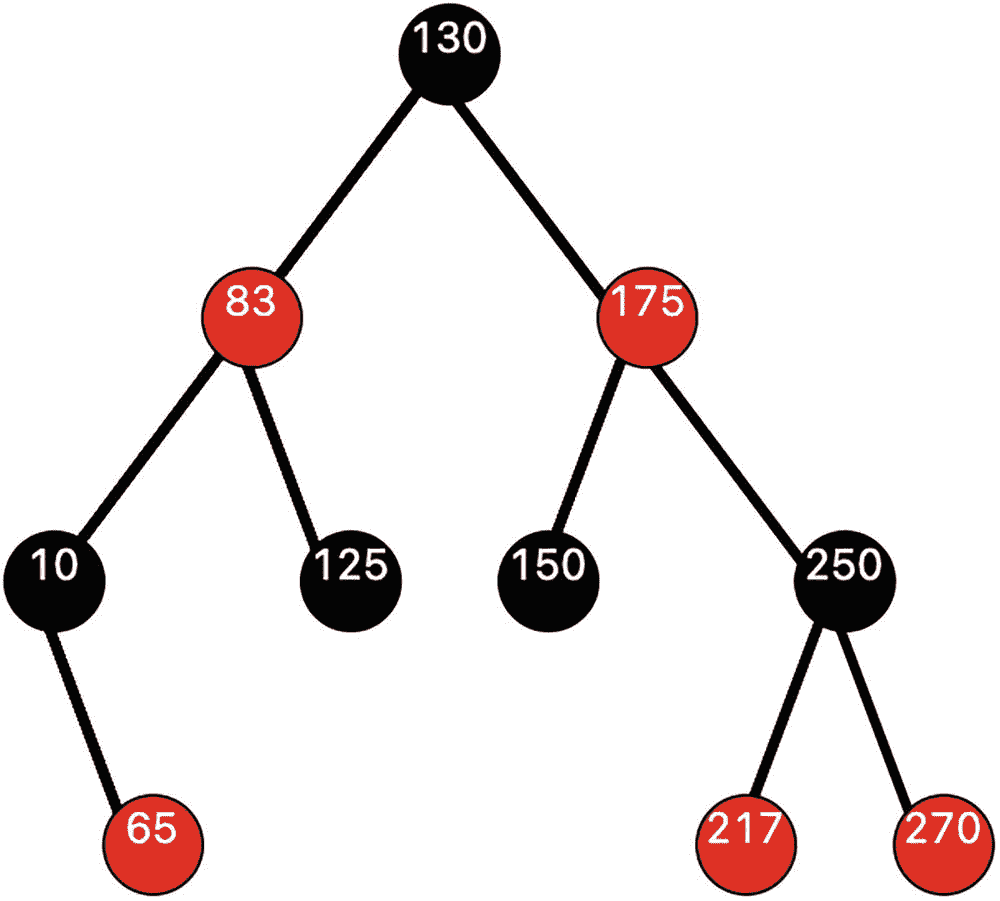

一棵二叉树结构的示意图，包含两种色度。节点以“节点值，色度”的格式描绘。根节点 130，深色，有两个子树：83 浅色和 175 浅色。节点 83 有两个子节点：10 深色和 125 深色。节点 10 有一个子节点 65 浅色。节点 175 有两个子节点：150 深色和 250 深色。节点 250 有两个子节点：217 浅色和 270 浅色。

在这棵包含十个节点的红黑树中，从根节点到任意叶节点的每条路径都恰好包含两个黑色节点。

我们将使用的一些术语包括**父节点**、**祖父节点**和**叔父节点**。

例如，节点 217 的父节点是 250。217 的叔父节点是 150（父节点的兄弟节点）。217 的祖父节点是 175。

在下一节中，我们将讨论向红黑树插入一个条目的逻辑。我们将通过一个详细的示例逐步说明该过程。


好的，作为高级文档工程师和翻译员，我将严格按照您提供的注意事项和示例格式，将给定的英文文本翻译成中文。


## 12.2 插入过程

我们通过一系列示例来讨论插入操作的逻辑。

插入的第一步是执行一次普通的搜索树插入操作。

添加到树中的新节点总是被着色为红色。我们的目标是保持根节点到所有叶节点之间的黑色节点数量恒定。

如果新插入的节点的父节点是红色，那么这违反了前文中的条件 3，该条件要求红色节点的子节点必须是黑色。此时，我们必须采取纠正措施。

我们考虑的第一种情况是，被插入节点的父节点是红色，并且其叔叔节点存在且为红色。考虑在插入 25 之后的以下树。25 的叔叔是 150，且为红色。

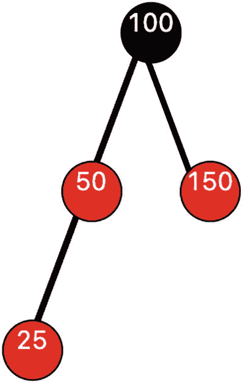

一幅包含两种色调的二叉树结构示意图。节点以“节点值，色调”的格式表示。根节点 100，深色，有两个子节点：50（浅色）和 150（浅色）。节点 50（浅色）有一个子节点 25（浅色）。

我们通过修改父节点（红色改为黑色）、叔叔节点（红色改为黑色）以及祖父节点（如果它不是根节点，本例中它是根节点）的颜色来执行纠正。纠正后的树如下所示。如果 100 不是根节点，那么在将节点 100 改为红色后，我们可能需要在树中继续向上查找违规情况。

执行颜色修改的结果如下所示：

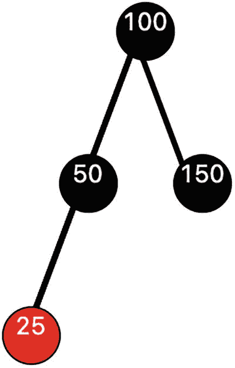

一幅包含两种色调的二叉树结构示意图。节点以“节点值，色调”的格式表示。根节点 100，深色，有两个子节点：50（深色）和 150（深色）。节点 50（深色）有一个子节点 25（浅色）。

我们接下来考虑的情况是，被插入节点的父节点是红色，而叔叔节点是黑色或不存在。这里有四种情况需要考虑。

第一种情况，我们插入 25。父节点为红色，叔叔节点不存在。

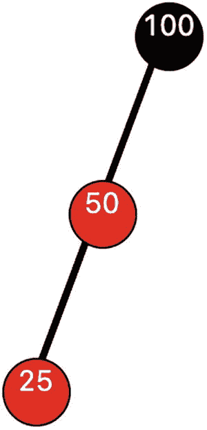

一幅包含两种色调的二叉树结构示意图。节点以“节点值，色调”的格式表示。根节点 100，深色，有一个子节点 50（浅色）。节点 50（浅色）有一个左子节点 25（浅色）。

第二种情况，我们再次插入 25。父节点为红色，叔叔节点不存在。

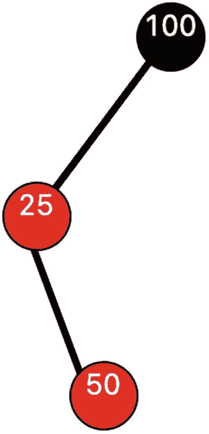

一幅包含两种色调的二叉树结构示意图。节点以“节点值，色调”的格式表示。根节点 100，深色，有一个子节点 25（浅色）。节点 50（浅色）有一个右子节点 50（浅色）。

另外两种情况相对于根节点是对称的（在根节点的右侧）。

我们采取的纠正措施涉及树的旋转，具体如下：

我们从祖父节点开始对子树进行中序遍历，并按遍历顺序将节点标记为第一、第二和第三；然后第二个节点将始终成为该子树的新根节点，其左子节点为第一个节点，右子节点为第三个节点。

在情况 1 中，遍历结果依次为：第一=25，第二=50，第三=100。

在情况 2 中，遍历结果依次为：第一=25，第二=50，第三=100。

我们将新的子根节点重新着色为黑色，它的两个子节点保持红色。

这样就得到了纠正后的树。

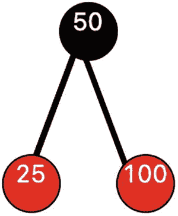

一幅包含两种色调的二叉树结构示意图。节点以“节点值，色调”的格式表示。根节点 50，深色，有两个子节点：25（浅色）和 100（浅色）。

在情况 1 中，我们对节点 100 执行一次右旋。在情况 2 中，我们对节点 25 执行一次左旋（得到情况 1），然后对节点 100 执行一次右旋。情况 3 和情况 4 遵循对称的模式。

### 多次插入的详细演练

为了巩固我们对插入操作的理解，我们通过插入序列值 `10, 20, 4, 15, 17, 40, 50, 60, 70, 35, 38, 18, 19, 45, 30, 25`，一步一步地构建一棵红黑树。我们演示其中部分插入的过程，其余部分留作练习。

插入`10`、`20`和`4`之后，我们得到


一幅包含两种色调的二叉树结构示意图。节点以“节点值，色调”的格式表示。根节点 10，深色，有两个子节点：4（浅色）和 20（浅色）。

插入`15`之后，我们得到

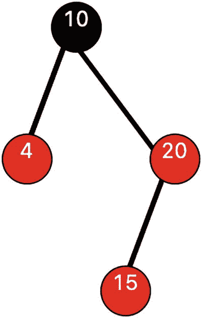

一幅包含两种色调的二叉树结构示意图。节点以“节点值，色调”的格式表示。根节点 10，深色，有两个子节点：4（浅色）和 20（浅色）。节点 20（浅色）有一个子节点 15（浅色）。

由于`15`的父节点是红色，叔叔节点也是红色，我们执行重新着色，得到

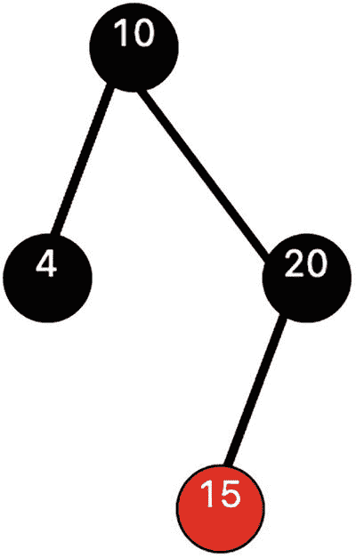

一幅包含两种色调的二叉树结构示意图。节点以“节点值，色调”的格式表示。根节点 10，深色，有两个子节点：4（深色）和 20（深色）。节点 20（深色）有一个子节点 15（浅色）。

插入`17`之后，我们得到

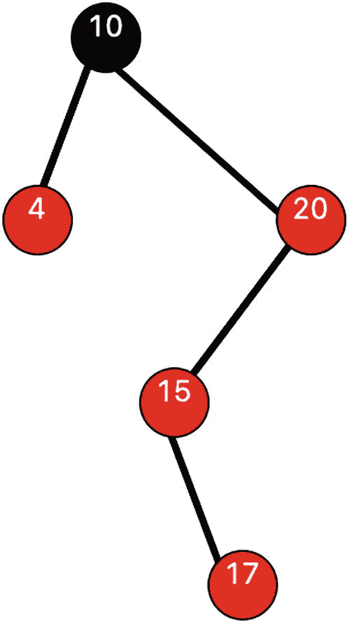

一幅包含两种色调的二叉树结构示意图。节点以“节点值，色调”的格式表示。根节点 10，深色，有两个子节点：4（浅色）和 20（浅色）。节点 20（浅色）有一个子节点 15（浅色）。节点 15（浅色）有一个子节点 17（浅色）。

但这需要纠正。由于`17`的父节点是红色，且叔叔节点不存在，我们执行旋转纠正（在`15`上左旋，在`20`上右旋）和重新着色，得到

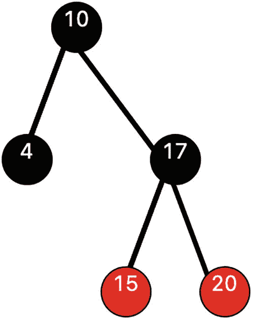

一幅包含两种色调的二叉树结构示意图。节点以“节点值，色调”的格式表示。根节点 10，深色，有两个子节点：4（深色）和 17（深色）。节点 17（深色）有两个子节点：15（浅色）和 20（浅色）。

接下来我们插入`40`。我们只显示重新配置后的结果（重新着色情况），因为父节点和叔叔节点都是红色。

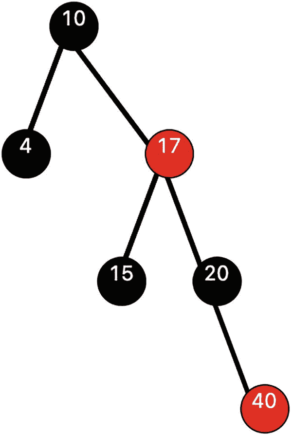

一幅包含两种色调的二叉树结构示意图。节点以“节点值，色调”的格式表示。根节点 10，深色，有两个子节点：4（深色）和 17（浅色）。节点 17（浅色）有两个子节点：15（深色）和 20（深色）。节点 20（深色）有一个子节点 40（浅色）。

接下来我们插入`50`。这是情况 4，需要对`20`执行一次左旋纠正，得到

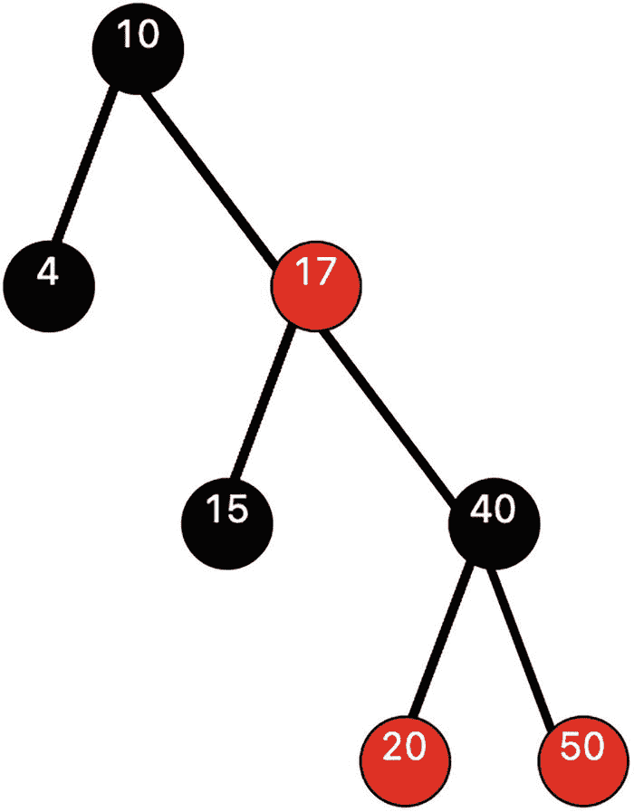

一幅包含两种色调的二叉树结构示意图。节点以“节点值，色调”的格式表示。根节点 10，深色，有两个子节点：4（深色）和 17（浅色）。节点 17（浅色）有两个子节点：15（深色）和 40（深色）。节点 40（深色）有两个子节点：20（浅色）和 50（浅色）。

接下来我们插入`60`。由于父节点和叔叔节点都是红色，这只需要重新着色。结果如下

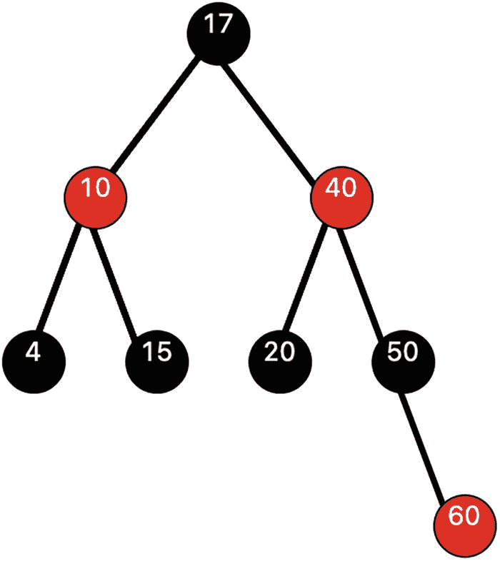

一幅包含两种色调的二叉树结构示意图。节点以“节点值，色调”的格式表示。根节点 17，深色，有两棵子树：10（浅色）和 40（浅色）。节点 10（浅色）有两个子节点：4（深色）和 15（深色）。节点 40（深色）有两个子节点：20（深色）和 50（深色）。节点 50（深色）有一个子节点 60（浅色）。

我们已经完成了一半！作为练习，请继续后续的插入操作，并证明最终得到的红黑树如下所示

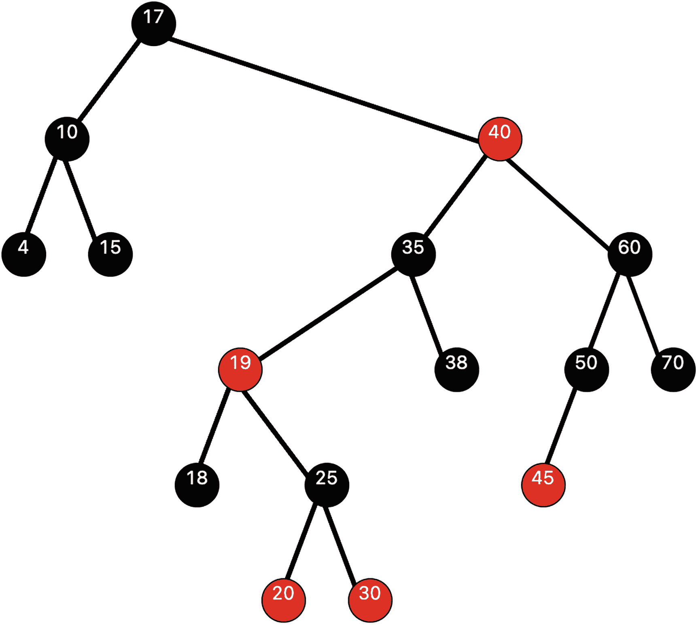


这是一个二叉树的示意图，带有两种着色。根节点`17`有子树`10`和`40`。节点`10`有子节点`4`和`15`。节点`40`有子节点`35`和`60`。节点`35`有子节点`19`和`38`。节点`19`有子节点`18`和`25`。节点`25`有子节点`20`和`30`。节点`60`有子节点`50`和`70`。节点`50`有子节点`45`。除节点`40`、`19`、`20`、`30`和`45`外，所有节点均为深色。

仔细检查这棵树可以发现，从根节点`17`到每个叶节点的黑色节点数量恰好为`3`。每个红色节点只有黑色子节点。

这棵树显然不如 AVL 树平衡（根的右侧最大深度为`5`，左侧最大深度为`2`）。

在下一节中，我们将介绍向红黑树中执行**插入**操作的实现。由于存在许多特殊情况，其细节相当复杂。

## 12.3 红黑树的实现

向红黑树中插入元素的实现细节令人望而生畏。这是因为根据第 12.2 节讨论和说明的逻辑，可能存在大量潜在的旋转或颜色校正操作。

理解清单 12-1 中实现逻辑的最佳策略是，逐步“遍历”第 12.2 节中给出的示例，尽可能地深入。

为了绘制红黑树，对第 8.3 节中定义和讨论的`display tree`函数进行了一些小的修改。实现中这一部分的更改以粗体显示。

清单 12-1 展示了红黑树的实现，包括绘制树的逻辑，但仅包含`Insert`方法。该树的实现与一个简短的驱动程序`main`结合在一起，没有为树创建单独的包。


```go
package main

import (
	"image/color"
	"log"

	"fyne.io/fyne/v2"
	"fyne.io/fyne/v2/app"
	"fyne.io/fyne/v2/canvas"
	"fyne.io/fyne/v2/theme"
	"github.com/mitchellh/go-homedir"
	"gonum.org/v1/plot"
	"gonum.org/v1/plot/plotter"
	"gonum.org/v1/plot/vg"
	"gonum.org/v1/plot/vg/draw"
	"strconv"
)

type ordered interface {
	~int | ~float64 | ~string
}

type OrderedStringer interface {
	ordered
	String() string
}

type Node[T OrderedStringer] struct {
	value  T
	red    bool
	parent *Node[T]
	left   *Node[T]
	right  *Node[T]
}

type RedBlackTree[T OrderedStringer] struct {
	count int
	root  *Node[T]
}

func NewTreeT OrderedStringer *RedBlackTree[T] {
	return &RedBlackTree[T]{1, &Node[T]{value, false, nil, nil, nil}}
}

// 方法
func (tree *RedBlackTree[T]) Insert(value T) {
	if tree.root == nil { // 空树
		tree.root = &Node[T]{value, false, nil, nil, nil}
		tree.count += 1
		return
	}
	parent, nodeDirection := tree.findParent(value)
	if nodeDirection == "" {
		return
	}
	newNode := Node[T]{value, true, parent, nil, nil}
	if nodeDirection == "L" {
		parent.left = &newNode
	} else {
		parent.right = &newNode
	}
	tree.checkReconfigure(&newNode)
	tree.count += 1
}

func (tree *RedBlackTree[T]) IsPresent(value T, node *Node[T]) bool {
	if node == nil {
		return false
	}
	if value < node.value {
		return tree.IsPresent(value, node.left)
	} else if value > node.value {
		return tree.IsPresent(value, node.right)
	}
	return true
}

func (tree *RedBlackTree[T]) findParent(value T) (*Node[T], string) {
	return search(value, tree.root)
}

func (tree *RedBlackTree[T]) checkReconfigure(node *Node[T]) {
	var nodeDirection, parentDirection, rotation string
	var uncle *Node[T]
	parent := node.parent
	value := node.value
	if parent == nil || parent.parent == nil || node.red == false || parent.red == false {
		return
	}
	grandfather := parent.parent
	if value < parent.value {
		parentDirection = "L"
	} else {
		parentDirection = "R"
	}
	if parentDirection == "L" {
		uncle = grandfather.right
	} else {
		uncle = grandfather.left
	}
	rotation = nodeDirection + parentDirection
	if uncle == nil || uncle.red == false {
		if rotation == "LL" {
			tree.rightRotate(node, parent, grandfather, true)
		} else if rotation == "RR" {
			tree.leftRotate(node, parent, grandfather, true)
		} else if rotation == "LR" {
			tree.rightRotate(nil, node, parent, false)
			tree.leftRotate(parent, node, grandfather, true)
			node, parent = parent, node
		} else if rotation == "RL" {
			tree.leftRotate(nil, node, parent, false)
			tree.rightRotate(parent, node, grandfather, true)
		}
	} else {
		tree.modifyColor(grandfather)
	}
}

func (tree *RedBlackTree[T]) leftRotate(node, parent, grandfather *Node[T], modifyColor bool) {
	greatgrandfather := grandfather.parent
	tree.updateParent(parent, grandfather, greatgrandfather)
	oldLeft := parent.left
	parent.left = grandfather
	grandfather.parent = parent
	grandfather.right = oldLeft
	if oldLeft != nil {
		oldLeft.parent = grandfather
	}
	if modifyColor == true {
		parent.red = false
		node.red = true
		grandfather.red = true
	}
}

func (tree *RedBlackTree[T]) rightRotate(node, parent, grandfather *Node[T], modifyColor bool) {
	greatgrandfather := grandfather.parent
	tree.updateParent(parent, grandfather, greatgrandfather)
	oldRight := parent.right
	parent.right = grandfather
	grandfather.parent = parent
	grandfather.left = oldRight
	if oldRight != nil {
		oldRight.parent = grandfather
	}
	if modifyColor == true {
		parent.red = false
		node.red = true
		grandfather.red = true
	}
}

func (tree *RedBlackTree[T]) modifyColor(grandfather *Node[T]) {
	grandfather.right.red = false
	grandfather.left.red = false
	if grandfather != tree.root {
		grandfather.red = true
	}
	tree.checkReconfigure(grandfather)
}

func (tree *RedBlackTree[T]) updateParent(node, parentOldChild, newParent *Node[T]) {
	node.parent = newParent
	if newParent != nil {
		if newParent.value > parentOldChild.value {
			newParent.left = node
		} else {
			newParent.right = node
		}
	} else {
		tree.root = node
	}
}

func searchT OrderedStringer (*Node[T], string) {
	if value == node.value {
		return nil, ""
	} else if value > node.value {
		if node.right == nil {
			return node, "R"
		}
		return search(value, node.right)
	} else if value < node.value {
		if node.left == nil {
			return node, "L"
		}
		return search(value, node.left)
	}
	return nil, ""
}

// 绘制树的逻辑
type NodePair struct {
	Val1, Val2 string
}

type NodePos struct {
	Val string
	Red bool
	YPos int
	XPos int
}

var data []NodePos
var endPoints []NodePair // 用于绘制连线

func PrepareDrawTreeT OrderedStringer {
	prepareToDraw(tree)
}

func FindXY(val interface{}) (int, int) {
	for i := 0; i < len(data); i++ {
		if data[i].Val == val {
			return data[i].XPos, data[i].YPos
		}
	}
	return -1, -1
}

func FindX(val interface{}) int {
	for i := 0; i < len(data); i++ {
		if data[i].Val == val {
			return i
		}
	}
	return -1
}

func SetXValues() {
	for index := 0; index < len(data); index++ {
		xValue := FindX(data[index].Val)
		data[index].XPos = xValue
	}
}

func prepareToDrawT OrderedStringer {
	inorderLevel(tree.root, 1)
	SetXValues()
	getEndPoints(tree.root, nil)
}

func inorderLevelT OrderedStringer {
	if node != nil {
		inorderLevel(node.left, level+1)
		data = append(data, NodePos{node.value.String(), node.red, 100 - level, -1})
		inorderLevel(node.right, level+1)
	}
}

func getEndPointsT OrderedStringer {
	if node != nil {
		if parent != nil {
			endPoints = append(endPoints, NodePair{node.value.String(), parent.value.String()})
		}
		getEndPoints(node.left, node)
		getEndPoints(node.right, node)
	}
}

var path string

func DrawGraph(a fyne.App, w fyne.Window) {
	image := canvas.NewImageFromResource(theme.FyneLogo())
	image = canvas.NewImageFromFile(path + "tree.png")
	image.FillMode = canvas.ImageFillOriginal
	w.SetContent(image)
	w.Close()
	w.Show()
}

func ShowTreeGraphT OrderedStringer {
	PrepareDrawTree(myTree)
	myApp := app.New()
	myWindow := myApp.NewWindow("树")
	myWindow.Resize(fyne.NewSize(1000, 600))
	path, _ := homedir.Dir()
	path += "/Desktop//"
	nodePts := make(plotter.XYs, myTree.count)
	for i := 0; i < len(data); i++ {
		nodePts[i].Y = float64(data[i].YPos)
		nodePts[i].X = float64(data[i].XPos)
	}
	nodePtsData := nodePts
	p := plot.New()
	p.Add(plotter.NewGrid())
	nodePoints, err := plotter.NewScatter(nodePtsData)
	if err != nil {
		log.Panic(err)
	}
	nodePoints.Shape = draw.CircleGlyph{}
	nodePoints.Color = color.RGBA{R: 255, G: 255, B: 250, A: 255} // 白色填充
	nodePoints.Radius = vg.Points(12)
	// 绘制连线
	for index := 0; index < len(endPoints); index++ {
		val1 := endPoints[index].Val1
		x1, y1 := FindXY(val1)
		val2 := endPoints[index].Val2
		x2, y2 := FindXY(val2)
		pts := plotter.XYs{{X: float64(x1), Y: float64(y1)}, {X: float64(x2), Y: float64(y2)}}
		line, err := plotter.NewLine(pts)
		if err != nil {
			log.Panic(err)
		}
		scatter, err := plotter.NewScatter(pts)
		if err != nil {
			log.Panic(err)
		}
		p.Add(line, scatter)
	}
	p.Add(nodePoints)
	// 添加标签
	for index := 0; index < len(data); index++ {
		x := float64(data[index].XPos) - 0.10
		y := float64(data[index].YPos) - 0.02
		str := data[index].Val
		if data[index].Red == true {
			str += "(红)"
		} else {
			str += "(黑)"
		}
		label, err := plotter.NewLabels(plotter.XYLabels{
			XYs: []plotter.XY{
				{X: x, Y: y},
			},
			Labels: []string{str},
		})
		if err != nil {
			log.Fatalf("无法创建标签绘制器: %+v", err)
		}
		p.Add(label)
	}
	path, _ = homedir.Dir()
	path += "/Desktop/GoDS/"
	err = p.Save(1000, 600, "tree.png")
	if err != nil {
		log.Panic(err)
	}
	DrawGraph(myApp, myWindow)
	myWindow.ShowAndRun()
}

// 使 int 类型符合 Stringer 接口
type Integer int

func (i Integer) String() string {
	return strconv.Itoa(int(i))
}

func main() {
	myTree := NewTreeInteger
	myTree.Insert(20)
	myTree.Insert(4)
	myTree.Insert(15)
	myTree.Insert(17)
	myTree.Insert(40)
	myTree.Insert(50)
	myTree.Insert(60)
	myTree.Insert(70)
	myTree.Insert(35)
	myTree.Insert(38)
	myTree.Insert(18)
	myTree.Insert(19)
	myTree.Insert(45)
	myTree.Insert(30)
	myTree.Insert(25)
	ShowTreeGraph(*myTree)
}
```
**清单 12-1** 红黑树

好的，这是根据您提供的格式和注意事项翻译的中文版本。


`main` 的输出如下所示，这与第 12.2 节中构建的树相同。

由于显示树需要为每个树节点创建标签，因此再次引入了 `OrderedStringer` 接口。

### 比较红黑树与 AVL 树的性能

我们进行了一项基准测试，以了解从 100,000 个随机整数序列构建红黑树所需的时间。同时，也测试了从 100,000 个随机整数构建 AVL 树所需的时间。

结果如下，非常有趣：

红黑树的插入时间：**27.62615ms**

红黑树的搜索时间：**16.037945ms**

AVL 树的插入时间：**48.315163ms**

AVL 树的搜索时间：**3.914522ms**

### 基准测试结论

与 AVL 树相比，红黑树的**构建时间大约是其一半**，但**搜索时间是其四倍**。AVL 树比红黑树更平衡，但在构建过程中需要更多的旋转操作。

由于我们通常构建搜索树以进行大量快速查找，因此在这种情况下，AVL 树通常是更优的选择。

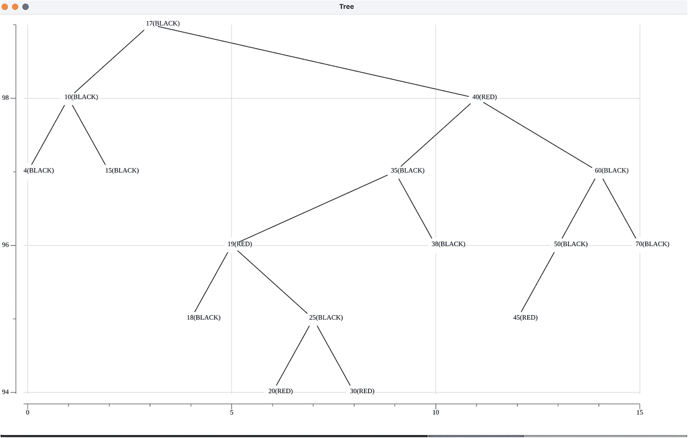

一张以树形格式展示节点的图。垂直标记从 94 到 99，水平标记从 0 到 15。垂直点：第 99 行节点 17。第 98 行节点 10, 40。第 97 行节点 4, 15, 35, 60。第 96 行节点 19, 38, 50, 70。第 95 行节点 18, 25, 45。第 94 行节点 20, 30。节点 40, 19, 20, 30 和 45 标记为红色，其余标记为黑色。

## 12.4 小结

本章介绍并说明了构建红黑树的逻辑。通过 `Insert` 方法和许多辅助方法，展示了一个通用红黑树的实现。文中还展示了经过小幅修改后用于绘制红黑树的代码。最后，将红黑树的性能与 AVL 树进行了比较。红黑树的生成效率更高，但搜索效率低于 AVL 树。

在下一章中，我们将介绍表达式树。

