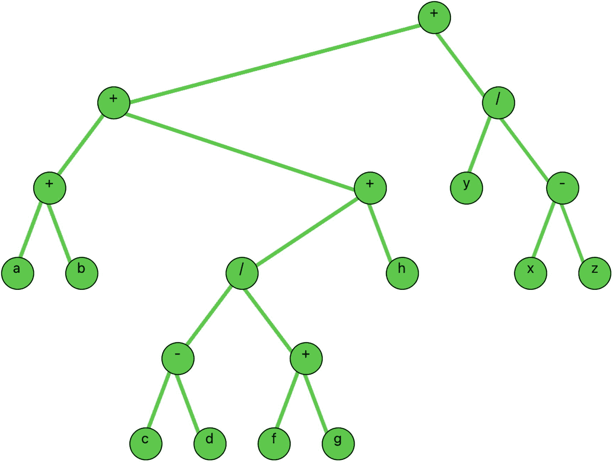
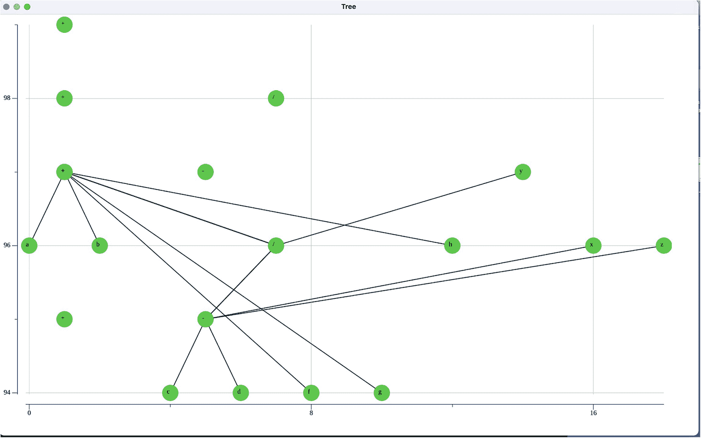
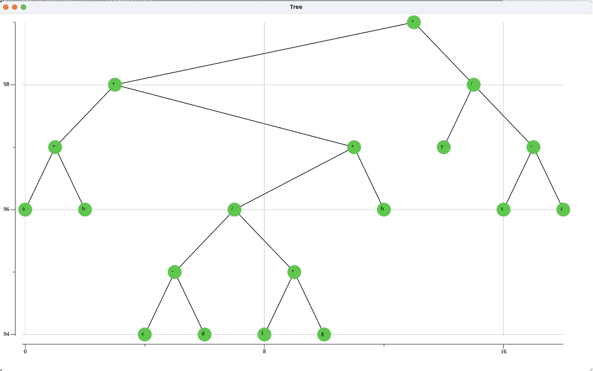

# 13. 表达式树

在上一章中，我们介绍了红黑树。与 AVL 树相比，这些二叉搜索树提供了更快的插入性能，但搜索速度较慢。

在本章中，我们将介绍并实现表达式树。它们用于表示和计算某些数学表达式。

在下一节中，我们将介绍表达式树。

## 13.1 表达式树

表达式树用于表示和计算数学表达式。这里，我们将此类表达式限制为：操作数由单个字符（介于“a”和“z”之间）表示，运算符包括 `"+"`、`"-"`、`"*"` 和 `"/"`。

考虑表达式 `"((a + b) + (c - d) / (f + g) + h)) + y / (x - z)"`。

表示该数学表达式的表达式树如图 13-1 所示。



一张表达式树的示意图。根节点是加号。它有两个子树：加号和除号。加号子树有两个子节点加号。左加号的子节点是 a 和 b。右加号的子节点是除号和 h。除号的子节点是减号和加号。减号的子节点是 c 和 d。加号的子节点是 f 和 g。除号子树的子节点是 y 和减号。减号的子节点是 x 和 z。

图 13-1

数学表达式的表达式树

操作数位于叶节点，运算符位于内部节点。

我们从各个叶节点开始，向上工作到根节点，来解释并获得此树表示的数学表达式。

从最左边的叶节点开始，我们得到 `(a + b) + ...`。

移至中间部分的叶节点，我们得到

`(c – d) / (f + g) + h`

从最右边的叶节点，我们得到

`y / (x – z) + ...`

将这三个部分组合在一起就得到了原始表达式。

在下一节中，我们将介绍并讨论表达式树的构建。

## 13.2 表达式树的构建

表达式树的构建需要多层抽象。我们需要一个 `Stack` 来辅助构建过程。

我们定义两种类型，`Node` 和 `ExpressionTree`，如下所示：

```
type Node struct {
ch string
left *Node
right *Node
}
type ExpressionTree struct {
postfix string
root *Node
}
```

`Node` 类型是我们熟悉的二叉树节点，每个节点存储一个字符串 `ch`。该字符串可以是操作数或运算符。

`ExpressionTree` 类型包含两个字段。字段 `postfix` 是我们输入用于构建表达式树的数学表达式的后缀字符串表示形式。字段 `root` 是指向 `Node` 的指针。

### 构建一个新的表达式树

下面介绍的 `NewTree` 函数用于构建我们的表达式树。

```
func NewTree(infix string) (tree *ExpressionTree) {
infix = strings.ToLower(infix)
tree = &ExpressionTree{"", nil}
tree.postfix = infixpostfix(infix)
stack := nodestack.Stack[*Node]{} // 创建 Node
// 的栈
str := strings.Split(tree.postfix, "")
for index := 0; index < len(str); index++ {
if str[index] >= string('a') &&
str[index] <= string('z') {
node := &Node{str[index], nil, nil}
stack.Push(node)
} else if (str[index] == "+") ||
(str[index] == "-") ||
(str[index] == "*") ||
(str[index] == "/") {
right := stack.Top()
stack.Pop()
left := stack.Top()
stack.Pop()
node := &Node{str[index], nil, nil}
node.left = left
node.right = right
stack.Push(node)
}
}
tree.root = stack.Top()
return tree
}
```

### `NewTree` 函数的解释

前四行代码创建了一个空树（`tree` 变量用作返回值变量）和一个基类型为指向 `Node` 的指针的空 `Stack`。

这是通用数据结构非常有用的另一个示例。我们无需用 `*Node` 作为基类型重复实现一个新的栈，只需使用通用的 stack 包并指定基类型为 `*Node` 即可。

在一个访问后缀字符串中每个字符的 `for` 循环中，如果该字符是操作数，我们就创建一个包含该字符的节点，并将该节点压入栈中。

如果该字符是四种可能的运算符之一，我们就从栈中取出顶部的两个字符，创建一个包含该运算符字符的节点，并将其左右子节点设置为从栈中弹出的两个节点。最后，我们将这个新节点压入栈中。这相当于从我们上一节中描述的叶节点向上移动到树的根节点。

### 使用表达式树的函数求值

下面介绍的 `Evaluate` 方法将表达式树的根作为其第一个参数，将操作数值的映射作为其第二个参数，并返回函数的值（`float64` 类型）。

```
func (tree *ExpressionTree) Evaluate(node *Node,
operandValues map[string]float64) float64 {
if node == nil {
return 0.0
}
if node.left == nil && node.right == nil {
value := operandValues[node.ch]
return value
}
leftValue := tree.Evaluate(node.left, operandValues)
rightValue := tree.Evaluate(node.right, operandValues)
if node.ch == "+" {
return leftValue + rightValue
} else if node.ch == "-" {
return leftValue - rightValue
} else if node.ch == "*" {
return leftValue * rightValue
} else {
return leftValue / rightValue
}
}
```


### 方法 `Evaluate` 的说明

如果表达式树节点是叶节点，我们通过访问 `operandValues` 映射来赋值并返回 `value`。

否则，我们通过递归调用 `Evaluate`，传入 `node.left` 和 `node.right` 以及 `operandValues` 映射，来赋值 `leftValue` 和 `rightValue`。

然后，根据 `node` 中包含的运算符，我们相应地组合 `leftValue` 和 `rightValue`。

在清单 13-1 中，我们展示了表达式树构建和求值的完整实现，以及一个 `main` 驱动程序。

```
package main
import (
"fmt"
"example.com/nodestack"
"strings"
)
type Node struct {
ch string
left *Node
right *Node
}
type ExpressionTree struct {
postfix string
root *Node
}
func NewTree(infix string) (tree *ExpressionTree) {
infix = strings.ToLower(infix)
tree = &ExpressionTree{"", nil}
tree.postfix = infixpostfix(infix)
stack := nodestack.Stack[*Node]{}
str := strings.Split(tree.postfix, "")
for index := 0; index = string('a') && str[index] = "a" && newSymbol <= "z" {
postfix += newSymbol
}
if isPresent(newSymbol, operators) {
if !nodeStack.IsEmpty() {
topSymbol := nodeStack.Top()
if precedence(topSymbol, newSymbol) ==
true {
if topSymbol != "(" {
postfix += topSymbol
}
nodeStack.Pop()
}
}
if newSymbol != ")" {
nodeStack.Push(newSymbol)
} else {
for {
if nodeStack.IsEmpty() == true {
break
}
ch := nodeStack.Top()
if ch != "(" {
postfix += ch
nodeStack.Pop()
} else {
nodeStack.Pop()
break
}
}
}
}
}
for {
if nodeStack.IsEmpty() == true {
break
}
if nodeStack.Top() != "(" {
postfix += nodeStack.Top()
nodeStack.Pop()
}
}
return postfix
}
// 来自清单 5.7
func precedence(symbol1, symbol2 string) bool {
if (symbol1 == "+" || symbol1 == "-") &&
(symbol2 == "(" || symbol2 == "/") {
return false
} else if (symbol1 == "(" && symbol2 != ")") ||
symbol2 == "(" {
return false
} else {
return true
}
}
// 来自清单 5.7
func isPresent(symbol string,operators []string) bool {
for i := 0; i < len(operators); i++ {
if symbol == string(operators[i]) {
return true
}
}
return false
}
func main() {
operandValues := map[string]float64{"a": 5.0, "b":
2.0, "c": 3.0, "d": 2.0,
"f": 4.0, "g": 8, "h": 17, "y": 20,
"x": 14, "z": 3}
infix := "((a+b)+(- d)/(f+g)+ h))+ y / (x - z)"
expressionTree := NewTree(infix)
fmt.Println("Expression tree evaluates to: ",
expressionTree.Evaluate(expressionTree.root,
operandValues))
}
/* 输出
Expression tree evaluates to:  25.90151515151515
*/
清单 13-1
表达式树
```

在下一节中，我们将为表达式树实现 `ShowTreeGraph` 函数。

## 13.3 `ShowTreeGraph` 的实现

如果我们使用第 8 章中用于绘制二叉树的代码，并将其原封不动地应用于表达式树，对于清单 13-1 中生成的树，我们会得到如图 13-2 所示的图形。



一张图。竖线标记从 94 到 98，横线标记从 0 到 16。第 99 行有加号。第 98 行有加号和除号。第 97 行有加号、减号、y。第 96 行有 a、b、除号、h、x、y。第 95 行有加号、减号。第 94 行有 c、d、f、g。所有元素都排列在不同的水平点上，其中一些由线条连接。

**图 13-2** 使用第 8 章代码生成的表达式树

为什么失败了？表达式树是一棵二叉树，因此人们会期望第 8 章的代码在这里能够工作。

用于图形化显示二叉树的那套代码假定每个节点都有一个唯一的 `value` 字段。

表达式树不满足这个要求，因为存在具有相同值的节点。例如，有多少个节点的值是“+”？很多！

为了解决这个问题，以便我们可以部署代码来绘制表达式树，我们将一个唯一的数字标签（作为字符串）连接到每个节点的 `ch` 字段。然后，在创建标签时，我们只从 `node.ch` 中提取第一个字符。通过这种方式，我们在构建树时强制每个节点都拥有一个唯一的字符串表示。

清单 13-2 展示了用于绘制表达式树的函数套件的修改部分。新增的四行代码以粗体显示。

变量 `c` 被定义为函数 `inorderLevel` 的全局变量。每次调用此函数时，`c` 增加 1，并且 `node.ch` 会被修改以附加这个唯一的标签。

在函数 `ShowTreeGraph` 中添加标签时，只使用 `node.ch` 的第一个字符，从而屏蔽掉唯一的标签。

```
var c  = 0
func inorderLevel(node *Node, level int) {
if node != nil {
inorderLevel(node.left, level + 1)
c += 1
node.ch += string(c)
data = append(data, NodePos{node.ch, 100 -
level, -1})
inorderLevel(node.right, level + 1)
}
}
// 添加标签
for index := 0; index < len(data); index++ {
x := float64(data[index].XPos) - 0.1
y := float64(data[index].YPos) - 0.02
str := data[index].Val
label, err := plotter.NewLabels(plotter.XYLabels {
XYs: []plotter.XY {
{X: x ,Y: y},
},
Labels: []string{string(str[0])},
},)
if err != nil {
log.Fatalf("could not creates labels
plotter: %+v", err)
}
p.Add(label)
}
清单 13-2
用于绘制表达式树的代码
```

当将修改后的树绘制函数套件添加到清单 13-2 的代码中时，生成的树形图如图 13-3 所示。



一张图。竖线标记从 94 到 98，横线标记从 0 到 16。垂直点。第 99 行有加号。第 98 行有加号和除号。第 97 行有加号、减号、y。第 96 行有 a、b、除号、h、x、y。第 95 行有加号、减号。第 94 行有 c、d、f、g。所有元素都排列在不同的水平点上，并由线条连接形成一棵树。

**图 13-3** 使用修改后的绘图代码生成的表达式树

## 13.4 总结

在本章中，我们实现并讨论了构建和求值表达式树的细节。我们展示了绘制表达式树所需的修改。

在下一章中，我们将介绍一个涉及并发的更大规模的应用。

