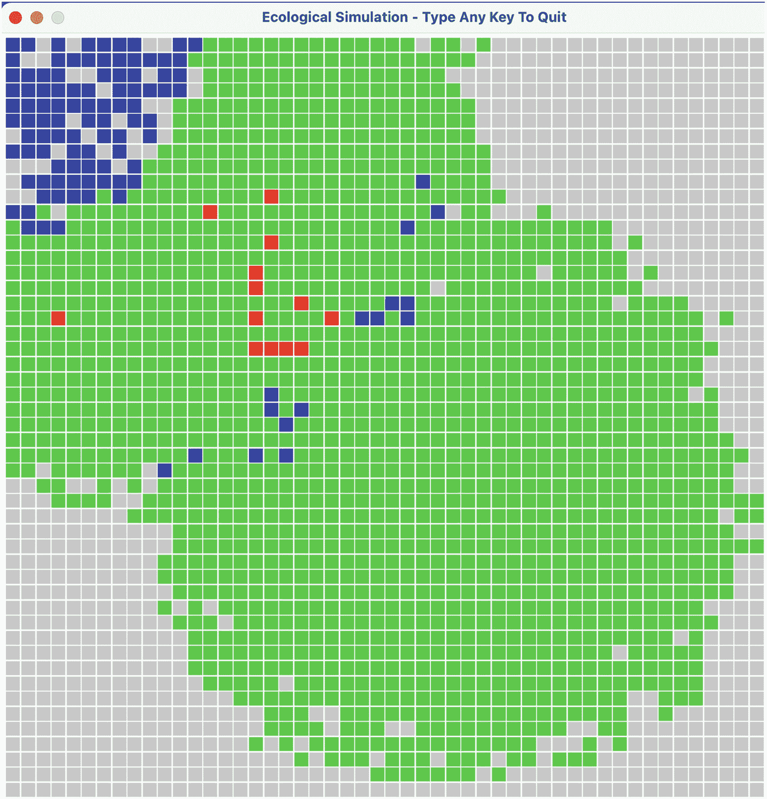

# 14. 使用并发进行生态模拟

前一章介绍了表达式树。我们展示了如何使用此类树来表示和求值简单的数学表达式。

在本章中，我们换个方向。我们将介绍一种生态模拟的并发实现。

在下一节中，我们将概述这个模拟。


## 14.1 概述

本章通过一个捕食者/猎物模型来呈现一种有趣的涌现计算，该模型模拟了一个简单生态系统的种群动态。其设计运用了并发机制。

本示例使用了前几章的许多重要概念和技术。其中包括图形框架、goroutine 的广泛运用、面向对象编程、类型断言（本章引入）、接口实现以及共享数据保护等。

我们模拟了三种简化的海洋生物物种在一个海洋中共同生存的动态变化，它们在任意时刻的位置均由一个 50 × 50 的网格定义。在任意时刻，这 2500 个位置中的每一个要么空无一物，要么存在一条**鲨鱼**、一条**金枪鱼**或一条**鲭鱼**。

在这个简单的食物链中，**鲨鱼**处于顶端，因为**鲨鱼**可以吃掉**金枪鱼**。**金枪鱼**处于食物链的第二位，因为**金枪鱼**可以吃掉**鲭鱼**。**鲭鱼**处于食物链的最底端。它们严格来说是一种猎物（可以被**金枪鱼**吃掉）。**金枪鱼**既是捕食者（可以吃掉**鲭鱼**），也是猎物（可以被**鲨鱼**吃掉）。

这三种物种都可以根据待指定的规则进行繁殖。作为捕食者的两种物种（**鲨鱼**和**金枪鱼**）可能会饿死。**金枪鱼**也可能因被**鲨鱼**吃掉而死亡。所有三种物种都可能因衰老而死亡。由于**鲨鱼**不会被吃掉，它们的种群数量会因饥饿（在指定时间间隔内未能吃掉**金枪鱼**）或衰老而减少。金枪鱼也能繁殖，并可能因饥饿或衰老而死亡。**鲭鱼**可以繁殖，可能因衰老或被吃掉而死亡。

在 50 × 50 网格内的移动规则允许每个生物（**鲨鱼**、**金枪鱼**或**鲭鱼**）在创建后并发移动。当它们死亡时（因饥饿、衰老或被吃掉），移动停止，并从海洋中清除。整个海洋的快照会被定期拍摄，以显示所有物种的位置以及空置位置。

我们为每个物种进行颜色编码，因此模拟输出非常有趣，它展示了三个物种的迁徙和种群动态随时间的变化。生物之间没有通信。每个生物都是一个独立的个体，与所有其他生物并发移动。

## 14.2 规格说明

我们指定了支配这三个物种的规则。

### 鲭鱼

一条鲭鱼会移动到其邻近区域（从其当前位置最多八个单元格，如果鲭鱼位于海洋边界（第 0 行、第 49 行、第 0 列、第 49 列），则数量更少）中的一个空置位置。如果找到多个空置位置，它会随机选择一个并移动到该空置位置，同时腾出其先前的位置。所有鲭鱼在创建时都会被分配一个繁殖值。每次移动，其繁殖值减一。当其繁殖值小于或等于零，并且鲭鱼能够移动到邻近的空置位置时，它就会繁殖，创建一个新的鲭鱼并将其放置在刚刚腾出的位置上。这条新鲭鱼开始自己的生命周期，并与海洋中的其他生物并发移动。如果鲭鱼能够繁殖，其繁殖值会重置为初始值。如果繁殖值小于或等于零，但鲭鱼移动受阻（其邻近区域没有空置位置），则本次移动无法繁殖，必须等待下一次移动。只有当鲭鱼移动后，繁殖才能发生，这样新创建的鲭鱼才能占据正在繁殖的鲭鱼腾出的单元格。

如果一条鲭鱼被某条金枪鱼吃掉，必须阻止其进一步移动，因为死鲭鱼无法移动或繁殖。

鲭鱼在创建时还会被分配一个年龄值。每次移动，其年龄值减一。当年龄值达到 0 时，鲭鱼死亡。死鲭鱼必须被阻止进一步移动并从海洋中清除。

### 金枪鱼

金枪鱼的行为与鲭鱼仅略有不同。每次移动，其繁殖值、饥饿值和年龄值都减一。如果其饥饿值或年龄值为零，则死亡，无法再次移动，并从海洋中清除。

金枪鱼首先会尝试移向邻近区域中含有鲭鱼的一个位置。如果找到多条鲭鱼，它会随机选择一条并移动到其位置。死鲭鱼不能再移动，并从海洋中清除。金枪鱼的饥饿值会重置为初始状态。如果金枪鱼邻近区域没有鲭鱼，它会尝试移向邻近的空置位置，如果有多个则随机选择一个空置单元格。当其繁殖值小于或等于 0 时，它会使用为鲭鱼描述的相同机制进行繁殖。除非它已经移动，否则无法繁殖。

如果某条金枪鱼被鲨鱼吃掉，它不能再次移动，并且必须从海洋中清除。

### 鲨鱼

鲨鱼的行为与金枪鱼类似，区别在于它不会被吃掉。移动时，它首先尝试在其邻近单元格中寻找并吃掉一些金枪鱼。如果没有找到，在存在邻近空置位置的情况下，它会移动到该空置位置，如果有多个则随机选择一个。其繁殖规则与金枪鱼和鲭鱼相同。

总结来说，鲭鱼的种群数量因繁殖而增加。其种群数量因被吃掉或衰老而减少。

金枪鱼的种群数量因繁殖而增加。其种群数量因被吃掉、饥饿或衰老而减少。

鲨鱼的种群数量因繁殖而增加。其种群数量因饥饿或衰老而减少。

### 输出

每个生物在 50 × 50 的单元格网格中用一个彩色矩形表示。红色矩形代表鲨鱼。蓝色矩形代表金枪鱼，绿色矩形代表鲭鱼。空单元格用灰色表示。

定期进行种群普查，并在图形上显示每个生物和空单元格在 50 × 50 网格中的当前位置。这使得每个物种的迁徙模式能够在生物并发移动时得到生动的展示。

正在运行的模拟截图如图 14-1 所示。



生态模拟截图。该模拟采用 50 × 50 网格，并使用不同深浅的方块来显示鲨鱼、金枪鱼和鲭鱼的种群。鲭鱼的数量非常高，覆盖了网格的大部分区域。金枪鱼的数量已减少至 103 条。鲨鱼仅有 13 条。浅色阴影表示空单元格。

图 14-1：运行中的模拟

在这里，鲭鱼的数量已暴增向外扩散，金枪鱼的数量即将侵入鲭鱼群，而鲨鱼正等待金枪鱼增多以便捕食。


好的，作为高级文档工程师和翻译员，我将遵循您的注意事项和示例，将以下英文文本翻译成中文。

---


## 14.3 设计

构建一个全局的位置对象网格。每个位置对象包含一个 `x` 和 `y` 坐标，以及一个生物。这个生物可以是鲨鱼、金枪鱼或鲭鱼。每当一个生物移动时，全局位置网格（一个二维数组）都会被更新。

每个生物的运动由一个独立的 goroutine 控制，该 goroutine 在生物（通过繁殖或初始种群）诞生时生成。当生物因被吃掉（鲭鱼或金枪鱼）、饿死（金枪鱼或鲨鱼）或衰老（鲭鱼、金枪鱼或鲨鱼）而死亡时，必须停止其 goroutine，以防止进一步移动并控制计算机资源。随着海洋单元格被生物占据，可能会有数千个 goroutine 同时运行，每个都代表一个正在移动的生物。

为了实现每个生物的持续移动，在生物的 goroutine 内部构建了一个循环，并带有半秒到一秒的随机休眠延迟。当模拟结束或生物死亡时，此循环必须终止。终止（跳出）循环将结束该生物的 goroutine。

构建一个独立的输出 goroutine，放在一个带有 1 秒休眠延迟的循环中。因此，每秒钟会计算一次生物的数量普查，并使用彩色矩形显示所有生物的位置。在此输出过程中，显示包含生物位置的全局矩阵。

使用互斥锁，当生物移动或海洋被显示时，必须冻结全局位置矩阵，以防止出现竞态条件。

## 14.4 实现

在展示完整实现（超过 400 行代码）之前，我们将展示并讨论各个部分。

### 每个物种的数据模型

我们首先检查每个物种的数据模型，最重要的是全局位置矩阵。

```go
type Location struct {
    x       int
    y       int
    critter MarineLife
}
type MarineLife interface {
    Move()
    Reproduce(l Location)
    Starve() bool
    LifeOver() bool
}
type Tuna struct {
    repro int
    starv int
    life  int
    x, y int  // 如果死亡，设 x 为 -1, y = -1
}
type Shark struct {
    repro int
    starv int
    life  int
    x, y int  // 如果死亡，设 x 为 -1, y = -1
}
type Mackerel struct {
    repro int
    starv int
    life  int
    x, y int  // 如果死亡，设 x 为 -1, y = -1
}
var locations [numRows][numCols]Location
```

### 代码讨论

类型 `Location` 将 `critter` 指定为 `MarineLife` 类型。为此，每个具体的生物类型（鲨鱼、金枪鱼和鲭鱼）都必须实现 `MarineLife` 接口。这意味着每个具体类型都必须实现 `Move()`、`Reproduce()`、`Starve()` 和 `LifeOver()` 方法。

每种生物类型都由一个包含 `repro`、`starv`、`life`、`x` 和 `y` 字段的结构体定义。

全局的 `locations` 二维数组被定义为包含 `Location` 对象。

### 支持函数

定义了实现 `MarineLife` 接口方法所需的几个支持函数。如下所示：

```go
func init() {
    rand.Seed(time.Now().UTC().UnixNano())
}
func distanceOfOne(x1, y1, x2, y2 float64) bool {
    return (math.Abs(x2-x1) == 0 &&
        math.Abs(y2-y1) == 1) ||
        (math.Abs(x2-x1) == 1 && math.Abs(y2-y1) == 0)
        || (math.Abs(x2-x1) == 1 &&
            math.Abs(y2-y1) == 1)
}
func initializeLocations() {
    for row := 0; row < numRows; row++ {
        for col := 0; col < numCols; col++ {
            locations[row][col] =
                Location{col, row, nil}
        }
    }
}
func findRandomCritter(x int, y int,
    critter MarineLife) (bool, Location) {
    // 传入 nil 作为生物参数以获取随机空位置
    result := []Location{}
    for r := 0; r < numRows; r++ {
        for c := 0; c < numCols; c++ {
            d := distanceOfOne(float64(x), float64(y),
                float64(c), float64(r))
            if d == true &&
                reflect.TypeOf(locations[c][r].critter) ==
                    reflect.TypeOf(critter) {
                result = append(result, Location{r, c,
                    critter})
            }
        }
    }
    if len(result) == 0 {
        return false, Location{}
    } else {
        return true, result[rand.Intn(len(result))]
    }
}
```

### 代码讨论

我们在函数 `findRandomCritter` 中使用 `reflect.TypeOf` 方法来创建一个包含输入到此函数的生物的 `Location` 对象切片。此函数返回两个输出，允许调用者判断是否找到了目标位置。

函数 `init()` 使用当前时钟时间为随机数生成器播种，确保每次运行模拟时都会产生不同的结果。

函数 `initializeLocations` 为每个单元格分配 `x` 和 `y` 坐标，并将每个单元格的 critter 值设为 `nil`。

### 使鲭鱼符合 `MarineLife` 类型所需的方法

```go
func (mackerel *Mackerel) Move() {
    for ; quit == false ; {
        if mackerel.x == -1 { // 鲭鱼已被杀死
            break
        }
        mutex.Lock()
        mackerel.repro -= 1
        mackerel.starv -= 1
        mackerel.life -= 1
        if mackerel.LifeOver() || mackerel.Starve() {
            locations[mackerel.y][mackerel.x].critter
                = nil
            mackerel.x = -1
            mackerel.y = -1
            mutex.Unlock()
            break
        }
        // 寻找没有生物的随机邻居
        found, newLoc := findRandomCritter(mackerel.x,
            mackerel.y, nil)
        if found == true {
            fmt.Printf("\n 鲭鱼从 (%d,%d) 移动到 (%d,%d)",
                mackerel.x,
                mackerel.y, newLoc.x, newLoc.y)
            mackerel.Reproduce(newLoc)
        }
        mutex.Unlock()
        time.Sleep(time.Duration(rand.Intn(500) + 500)
            * time.Millisecond)
    }
}
func (mackerel Mackerel) Starve() bool {
    return mackerel.starv <= 0
}
func (mackerel Mackerel) LifeOver() bool {
    return mackerel.life <= 0
}
func (mackerel *Mackerel) Reproduce(l Location) {
    if mackerel.x == -1 {
        return
    }
    if mackerel.repro <= 0 {
        newMackerel := new(Mackerel)
        newMackerel.repro = MACKERELREPRO
        newMackerel.starv = MACKERELSTARVE
        newMackerel.life = MACKERELLIFE
        newMackerel.x = mackerel.x
        newMackerel.y = mackerel.y
        locations[mackerel.y][mackerel.x].critter =
            newMackerel
        go newMackerel.Move()
    } else {
        locations[mackerel.y][mackerel.x].critter = nil
    }
    mackerel.x = l.x // 将鲭鱼分配到新位置
    mackerel.y = l.y
    // 将鲭鱼添加到新位置
    locations[l.y][l.x].critter = mackerel
}
```

### 代码讨论

鲭鱼的 `Move` 方法将指向 `Mackerel` 的指针作为方法的接收者。这是必需的，因为 `mackerel` 接收者的内部数据可能会被修改。

在定义连续移动的 for 循环中，如果 `mackerel` 对象的 `x` 坐标为 -1，我们跳出循环，从而终止该方法。此方法将在其他地方被定义为一个 goroutine。

我们锁定互斥锁，以防止在此 goroutine 之外更改全局的 `locations` 矩阵。我们递减 `repro`、`starv` 和 `life` 三个字段。

如果 `Starve()` 或 `LifeOver()` 中的任何一个为真，我们将该鲭鱼对象从海洋中清除（在相应的 `location[mackerel.y][mackerel.x]` 处将其 `critter` 值设为 `nil`）。通过将该死亡鲭鱼对象的 `x` 和 `y` 值设为 -1 来终止其 goroutine。我们解锁互斥锁。

如果找到了一个空的目标位置，我们将移动信息输出到控制台，并将 `newLoc` 传递给 `Reproduce` 方法。我们解锁互斥锁。我们使用随机休眠间隔暂停 goroutine 循环。

`Reproduce` 方法使用指针接收者，因为接收者的内部数据可能会被修改。

如果 `repro` 值小于或等于零，我们使用定义初始字段值 `repro`、`starv` 和 `life` 的全局常量创建一个新的鲭鱼对象。我们将新的鲭鱼对象分配给 `Location` 的 `critter` 字段，并将其 `x` 和 `y` 值设置为繁殖鲭鱼腾出的位置。

如果 `repro` 值大于 1，我们将腾出的位置的 critter 值设为 `nil`。

最后，我们将鲭鱼的 `x` 和 `y` 坐标设置为新位置。


### 鲨鱼的移动方法

接下来我们展示 `Shark` 的 `Move` 方法的实现。

```go
func (shark *Shark) Move() {
	for ; quit == false; {
		if shark.x == -1 { // 鲨鱼已死亡
			break
		}
		mutex.Lock()
		shark.repro -= 1
		shark.starv -= 1
		shark.life -= 1
		if shark.LifeOver() || shark.Starve() {
			locations[shark.y][shark.x].critter = nil
			shark.x = -1
			shark.y = -1
			mutex.Unlock()
			break
		}
		// 寻找相邻的金枪鱼
		found, newLoc := findRandomCritter(shark.x,
			shark.y, new(Tuna))
		if found == true {
			fmt.Printf("\nShark Move from  to
", shark.x, shark.y, newLoc.x,
				newLoc.y)
			shark.starv = SHARKSTARVE
			// 类型断言
			eatenTuna := locations[newLoc.y][newLoc.x].critter.(*Tuna)
			// 必须停止被吃金枪鱼的 goroutine
			eatenTuna.x = -1
			eatenTuna.y = -1
			fmt.Printf("\nEaten tuna = %v", eatenTuna)
			shark.Reproduce(newLoc)
		} else {
			found, newLoc = findRandomCritter(shark.x,
				shark.y, nil)
			if found == true {
				fmt.Printf("\nShark Move from 
to ", shark.x,
					shark.y, newLoc.x, newLoc.y)
				shark.Reproduce(newLoc)
			}
		}
		mutex.Unlock()
		time.Sleep(time.Duration(rand.Intn(500)+500) *
			time.Millisecond)
	}
}
```

### 代码讨论

`Shark` 的 `Move` 方法大部分实现细节与 `Mackerel` 相同。唯一的区别在于鲨鱼会首先寻找相邻的金枪鱼作为食物。

这里我们遇到了**类型断言**。让我们仔细看看。

我们调用 `findRandomCritter` 方法如下，将 `new(Tuna)` 作为第三个参数传递：

```go
found, newLoc := findRandomCritter(shark.x, shark.y,
	new(Tuna))
```

如果 `found` 为 true，我们将 `starv` 值重置为初始值 `SHARKSTARVE`。然后按如下方式赋值变量 `eatenTuna`：

```go
// 类型断言
eatenTuna := locations[newLoc.y][newLoc.x].critter.(*Tuna)
```

这个类型断言断言了 `locations[newLoc.y][newLoc.x]` 的类型是 `Tuna`。

由于断言成立，我们可以将 `eatenTuna` 视为已被定义为 `Tuna` 类型。

通过将 `eatenTuna` 的 `x` 和 `y` 值设为 -1，我们有效地终止了被吃掉的 `Tuna` 对象的 goroutine。

当我们需要依据一个形式类型为接口的对象的实际类型进行相应操作时，这类类型断言非常有用。

要使此操作生效，`Tuna` 类型必须实现 `MarineLife` 接口。它确实实现了！

`Shark` 类型实现的 `MarineLife` 接口的其他三个方法与此相同。

### 金枪鱼的移动方法

`Tuna` 类的 `Move` 方法与上面描述的 `Shark` 的 `Move` 方法本质上是相同的。

```go
func (tuna *Tuna) Move() {
	for ; quit == false; {
		if tuna.x == -1 { // 金枪鱼已死亡
			break
		}
		mutex.Lock()
		tuna.repro -= 1
		tuna.starv -= 1
		tuna.life -= 1
		if tuna.LifeOver() || tuna.Starve() {
			locations[tuna.y][tuna.x].critter = nil
			tuna.x = -1
			tuna.y = -1
			mutex.Unlock()
			break
		}
		// 寻找相邻的鲭鱼
		found, newLoc := findRandomCritter(tuna.x,
			tuna.y, new(Mackerel))
		if found == true {
			fmt.Printf("\nTuna Move from  to
", tuna.x, tuna.y, newLoc.x,
				newLoc.y)
			tuna.starv = TUNASTARVE
			// 必须停止被吃鲭鱼的 goroutine
			// 类型断言
			eatenMackerel := locations[newLoc.y][newLoc.x].critter.(*Mackerel)
			eatenMackerel.x = -1
			eatenMackerel.y = -1
			fmt.Printf("\nEaten mackerel = %v",
				eatenMackerel)
			tuna.Reproduce(newLoc)
		}
		found, newLoc = findRandomCritter(tuna.x,
			tuna.y, nil)
		if found == true {
			fmt.Printf("\nTuna Move from  to
", tuna.x, tuna.y, newLoc.x,
				newLoc.y)
			tuna.Reproduce(newLoc)
		}
		mutex.Unlock()
		time.Sleep(time.Duration(rand.Intn(500)+500) *
			time.Millisecond)
	}
}
```

类似的**类型断言**被用于处理被吃鲭鱼的终止。

### 生物图形化显示的输出函数

用于生成生物图形化显示的 `output` 函数如下：

```go
func output() *fyne.Container {
	for col := 0; col < numCols; col++ {
		for row := 0; row < numRows; row++ {
			if locations[col][row].critter == nil {
				rect =
					canvas.NewRectangle(&color.RGBA{B:
						200, R: 200, G: 200, A: 255})
			} else if
			reflect.TypeOf(locations[col][row].critter) ==
				reflect.TypeOf(new(Tuna)) {
				rect =
					canvas.NewRectangle(&color.RGBA{B:
						255, R: 0, G: 0, A: 255})
			} else if
			reflect.TypeOf(locations[col][row].critter) ==
				reflect.TypeOf(new(Shark)) {
				rect =
					canvas.NewRectangle(&color.RGBA{B:
						0, R: 255, G: 0, A: 255})
			} else if
			reflect.TypeOf(locations[col][row].critter) ==
				reflect.TypeOf(new(Mackerel)) {
				rect =
					canvas.NewRectangle(&color.RGBA{B:
						0, R: 0, G: 255, A: 255})
			}
			rect.Resize(fyne.NewSize(10, 10))
			rect.Move(fyne.NewPos(float32(col*11),
				float32(row*11)))
			segments[col+numCols*row] = rect
		}
	}
	return container.NewWithoutLayout(segments...)
}
```

该函数由以下全局声明支持：

```go
const (
	numRows         int = 50
	numCols         int = 50
	MAKERELREPRO    int = 4
	MAKERELSTARVE   int = 10000000
	MAKERELLIFE     int = 30
	TUNAREPRO       int = 8
	TUNASTARVE      int = 11
	TUNALIFE        int = 18
	SHARKREPRO      int = 15
	SHARKSTARVE     int = 25
	SHARKLIFE       int = 30
)
var (
	quit       bool
	contain    *fyne.Container
	rect       *canvas.Rectangle
	mutex = &sync.Mutex{}
	// 保存矩形对象
	segments = make([]fyne.CanvasObject, numRows*
		numCols)
)
```

`output` 函数包含在 `main` 函数中的以下 goroutine 内：

```go
go func() {
	for ; ; {
		mutex.Lock()
		contain := output()
		mutex.Unlock()
		w.SetContent(contain)
		time.Sleep(1000 * time.Millisecond)
	}
}()
```

### 代码讨论

在一个遍历每个位置对象的循环中，定义了一个矩形 `rect`，其颜色根据占据该位置的生物类型而定。这些矩形被分配至 `segments` 数组，从而使 `w.SetContent` 能够显示这些矩形。

### 模拟的完整实现

该生态模拟的实现在清单 14-1 中给出。为节省篇幅，之前展示和讨论的函数已被精简。你可以从前言中指定的网站下载完整源代码并运行这个模拟。


```go
package main

import (
	"fmt"
	"math"
	"math/rand"
	"reflect"
	"time"
	"image/color"
	"fyne.io/fyne/v2"
	"fyne.io/fyne/v2/app"
	"fyne.io/fyne/v2/canvas"
	"fyne.io/fyne/v2/container"
	"sync"
)

const (
	numRows        int = 50
	numCols        int = 50
	MAKERELREPRO   int = 4
	MAKERELSTARVE  int = 10000000
	MAKERELLIFE    int = 30
	TUNAREPRO      int = 8
	TUNASTARVE     int = 11
	TUNALIFE       int = 18
	SHARKREPRO     int = 15
	SHARKSTARVE    int = 25
	SHARKLIFE      int = 30
)

var (
	quit    bool
	contain *fyne.Container
	rect    *canvas.Rectangle
	mutex   = &sync.Mutex{}
	// 存储矩形对象
	segments = make([]fyne.CanvasObject, numRows*numCols)
)

type Location struct {
	x       int
	y       int
	critter MarineLife
}

type MarineLife interface {
	Move()
	Reproduce(l Location)
	Starve() bool
	LifeOver() bool
}

type Tuna struct {
	repro int // 繁殖所需的移动次数
	starv int // 饥饿所需的移动次数
	life  int // 寿命结束所需的移动次数
	x, y int  // 如果死亡，将 x 设为 -1，y 设为 -1
}

type Shark struct {
	repro int
	starv int
	life  int
	x, y int // 如果死亡，将 x 设为 -1，y 设为 -1
}

type Mackerel struct {
	repro int
	starv int
	life  int
	x, y int // 如果死亡，将 x 设为 -1，y 设为 -1
}

var locations [numRows][numCols]Location

func init() {
	rand.Seed(time.Now().UTC().UnixNano())
}

func distanceOfOne(x1, y1, x2, y2 float64) bool {
	// 略
}

func initializeLocations() {
	// 略
}

func findRandomCritter(x int, y int, critter MarineLife) (bool, Location) {
	// 略
}

func (tuna *Tuna) Move() {
	// 略
}

func (shark *Shark) Move() {
	// 略
}

func (mackerel *Mackerel) Move() {
	// 略
}

func (tuna Tuna) Starve() bool {
	// 略
}

func (tuna Tuna) LifeOver() bool {
	// 略
}

func (shark Shark) Starve() bool {
	// 略
}

func (shark Shark) LifeOver() bool {
	// 略
}

func (mackerel Mackerel) Starve() bool {
	// 略
}

func (mackerel Mackerel) LifeOver() bool {
	// 略
}

func (tuna *Tuna) Reproduce(l Location) {
	// 略
}

func (shark *Shark) Reproduce(l Location) {
	// 略
}

func (mackerel *Mackerel) Reproduce(l Location) {
	// 略
}

func output() *fyne.Container {
	// 略
}

func main() {
	quit = false
	a := app.New()
	w := a.NewWindow("生态模拟 - 按任意键退出")
	w.Resize(fyne.NewSize(600, 600))
	w.SetFixedSize(true)
	initializeLocations()
	newTuna := new(Tuna)
	newTuna.repro = TUNAREPRO
	newTuna.starv = TUNASTARVE
	newTuna.life = TUNALIFE
	newTuna.x = 15
	newTuna.y = 15
	locations[15][15].critter = newTuna
	go newTuna.Move()
	newTuna = new(Tuna)
	newTuna.repro = TUNAREPRO
	newTuna.starv = TUNASTARVE
	newTuna.life = TUNALIFE
	newTuna.x = 19
	newTuna.y = 19
	locations[19][19].critter = newTuna
	go newTuna.Move()
	newTuna = new(Tuna)
	newTuna.repro = TUNAREPRO
	newTuna.starv = TUNASTARVE
	newTuna.life = TUNALIFE
	newTuna.x = 4
	newTuna.y = 4
	locations[4][4].critter = newTuna
	go newTuna.Move()
	newShark := new(Shark)
	newShark.repro = SHARKREPRO
	newShark.starv = SHARKSTARVE
	newShark.life = SHARKLIFE
	newShark.x = 11
	newShark.y = 11
	locations[11][11].critter = newShark
	go newShark.Move()
	newShark = new(Shark)
	newShark.repro = SHARKREPRO
	newShark.starv = SHARKSTARVE
	newShark.life = SHARKLIFE
	newShark.x = 16
	newShark.y = 16
	locations[16][16].critter = newShark
	go newShark.Move()
	newMackerel := new(Mackerel)
	newMackerel.repro = MAKERELREPRO
	newMackerel.starv = MAKERELSTARVE
	newMackerel.life = MAKERELLIFE
	newMackerel.x = 2
	newMackerel.y = 2
	locations[2][2].critter = newMackerel
	go newMackerel.Move()
	newMackerel = new(Mackerel)
	newMackerel.repro = MAKERELREPRO
	newMackerel.starv = MAKERELSTARVE
	newMackerel.life = MAKERELLIFE
	newMackerel.x = 13
	newMackerel.y = 8
	locations[8][13].critter = newMackerel
	go newMackerel.Move()
	newMackerel = new(Mackerel)
	newMackerel.repro = MAKERELREPRO
	newMackerel.starv = MAKERELSTARVE
	newMackerel.life = MAKERELLIFE
	newMackerel.x = 16
	newMackerel.y = 16
	locations[16][16].critter = newMackerel
	go newMackerel.Move()
	newMackerel = new(Mackerel)
	newMackerel.repro = MAKERELREPRO
	newMackerel.starv = MAKERELSTARVE
	newMackerel.life = MAKERELLIFE
	newMackerel.x = 28
	newMackerel.y = 28
	locations[28][28].critter = newMackerel
	go newMackerel.Move()
	go func() {
		for ; ; {
			mutex.Lock()
			contain := output()
			mutex.Unlock()
			w.SetContent(contain)
			time.Sleep(1000 * time.Millisecond)
		}
	}()
	w.Canvas().SetOnTypedKey(func(k *fyne.KeyEvent) { // 关闭模拟
		quit = true
		w.Close()
	})
	w.ShowAndRun()
}
```

*代码清单 14-1 生态模拟*

## 14.5 摘要

本章介绍了一个生态模拟的并发实现。在实现中引入并使用了类型断言。

该示例运用了之前章节中的许多重要概念和技术，包括图形框架、协程的广泛使用、面向对象编程、类型断言、接口实现以及保护共享数据。

在下一章中，我们将介绍一种重要的算法设计技术：动态规划。

