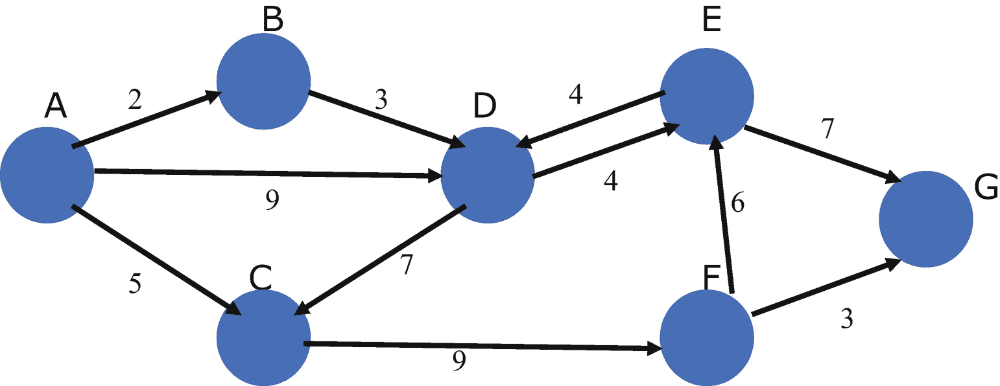
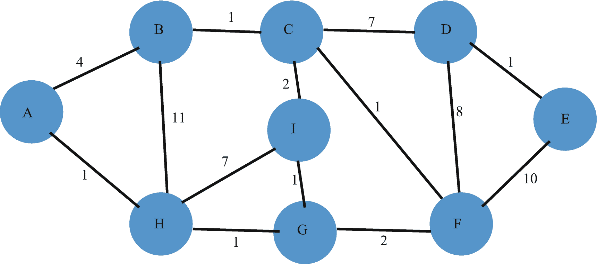
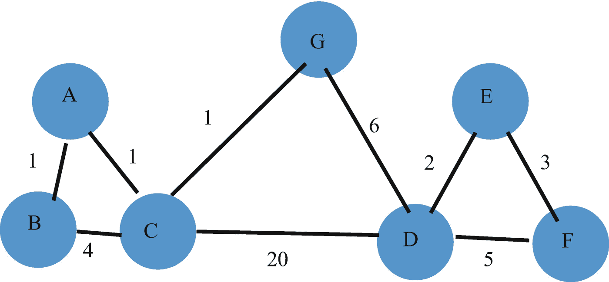

# 16. 图结构

在上一章中，我们介绍了动态规划及其三个应用。

在本章中，我们将介绍图结构及其一些应用。我们将展示几个如何表示图的示例，并研究一些与图遍历相关的基本算法。

在下一节中，我们将研究如何表示图。

## 16.1 表示图

**图**数据结构为算法设计提供了最有用、最强大的框架之一。图（不要与数学函数的图形表示混淆）可以表示大量的系统，例如通信网络、交通、电网、在线交互、游戏和模式匹配等。

图由一组节点和它们之间的边组成：`Graph = (N, E)`，其中`N`是节点的集合，`E`是边的集合。

在**有向图**中，每条边都有一个指定的方向。

如果节点之间有一条边相连，则它们是**相邻的**。与给定节点相邻的节点是其**邻居**。

节点的**度**是与该节点关联的边的数量。

图中的**路径**是一个子图（`N`和`E`的子集），其中的边按顺序连接一系列节点，且不重复访问任何节点。

**加权图**中的每条边都有一个相关的权重。路径的长度是其边权重的总和。

考虑图 16-1 中所示的加权有向图。



一个带有节点和边以及具有数值的路径的加权图示意图。节点由字母表示。值以节点到节点、数值的形式表示。A 到 B，2。A 到 C，5。A 到 D，9。B 到 D，3。C 到 D，7。C 到 F，9。D 到 E，4。E 到 G，7。G 到 F，3。E 到 F，6。

图 16-1
一个加权图

在下一节中，我们将讨论遍历此图或任何图的两种方法。我们允许节点为泛型类型`OrderedStringer`。在这里，泛型类型是`String`。

## 16.2 遍历图

我们研究两种重要的遍历算法：

1.  深度优先搜索 (DFS)
2.  广度优先搜索 (BFS)

`DFS`方法使用递归，从起始节点向外按顺序移动，并继续尽可能远地按顺序访问节点，且不重复访问节点，然后逐渐返回到起始节点。

`BFS`方法使用迭代和一个内部队列，从起始节点开始逐步遍历图。节点按照与起始顶点距离递增的顺序被访问，直到最远的顶点。

边的值在定义边时存储在一个全局 map 变量中。

在下一节中，我们将讨论并实现一个具有泛型顶点值的图的深度优先遍历和广度优先遍历。


## 16.3 深度优先搜索与广度优先搜索

我们先定义一些重要的数据类型。

```go
type OrderedStringer interface {
    comparable
    String() string
}
type Vertex[T OrderedStringer] struct {
    Key       T
    Neighbors map[T]*Vertex[T]
}
type Graph[T OrderedStringer] struct {
    Vertices map[T]*Vertex[T]
}
var visitation []string
```

我们的泛型类型是 `OrderedStringer`。该类型的实体必须具有可比性，并且能够通过 `String()` 函数生成字符串表示形式。

泛型结构体 `Vertex` 包含一个 `Key`（类型为 `T`）和一个映射 `Neighbors`，该映射将键（类型为 `T`）映射到指向其他顶点的指针。

泛型结构体 `Graph` 包含一个映射 `Vertices`，该映射将键（类型为 `T`）映射到指向顶点的指针。

定义了一个全局变量 `visitation`。该变量是一个字符串切片，用于表示遍历过程中的键。

以下几个重要的函数和方法如下所示：

```go
func NewVertexT OrderedStringer *Vertex[T] {
    return &Vertex[T]{
        Key:       key,
        Neighbors: map[T]*Vertex[T]{},
    }
}
func NewGraph[T OrderedStringer]() *Graph[T] {
    return &Graph[T]{Vertices: map[T]*Vertex[T]{}}
}
func (g *Graph[T]) AddVertex(key T) {
    vertex := NewVertex(key)
    g.Vertices[key] = vertex
}
func (g *Graph[T]) AddEdge(key1, key2 T, edgeValue int) {
    vertex1 := g.Vertices[key1]
    vertex2 := g.Vertices[key2]
    if vertex1 == nil || vertex2 == nil {
        return
    }
    vertex1.Neighbors[vertex2.Key] = vertex2
    g.Vertices[vertex1.Key] = vertex1
    g.Vertices[vertex2.Key] = vertex2
}
```

函数 `NewVertex` 接收一个键（类型为 `T`），并返回一个指向 `Vertex` 的指针，该顶点包含一个空的映射 `Neighbors`。

函数 `NewGraph` 返回一个空图，其中包含一个空的 `Vertices` 映射。

方法 `AddVertex` 创建一个新顶点，并将 `Vertices[key]` 赋值为该新顶点。

方法 `AddEdge` 接收两个键，将它们赋值给图的 `Vertices` 字段，并将 `vertex1` 的 `Neighbors` 字段赋值为 `vertex2`。

### 深度优先搜索

我们探讨的第一个遍历方法是深度优先搜索。该方法从起始顶点开始向外移动，并直接移动到最远且尚未访问的顶点。

其实现如下：

```go
func (g *Graph[T]) DepthFirstSearch(start *Vertex[T],
    visited map[T]bool) {
    if start == nil {
        return
    }
    visited[start.Key] = true
    visitation = append(visitation, start.Key.String())
    // 对于每个相邻顶点，如果尚未访问，
    // 则递归调用该函数
    for _, v := range start.Neighbors {
        // v 的顺序可能因运行不同而改变
        if visited[v.Key] {
            continue
        }
        g.DepthFirstSearch(v, visited)
    }
}
```

参数 `visited` 在调用该方法前必须初始化为一个空映射。

递归调用的顺序使得遍历从起始顶点向外移动，直到到达最远顶点，然后回溯并查找远离起始顶点的其他顶点。

### 广度优先搜索

我们探讨的第二个遍历方法是广度优先搜索。该方法先访问靠近起始顶点的顶点，然后逐渐向外、远离起始顶点地移动。这里没有使用递归。而是使用一个队列来存储已访问顶点的邻居顶点。这些邻居顶点会先被遍历。因此，正如该方法的名称所暗示的，这种遍历会移动到相邻顶点，并逐渐远离起始顶点。其实现如下：

```go
type Queue[T any] struct {
    items []T
}
// 方法
func (queue *Queue[T]) Insert(item T) {
    // item 被添加到切片的最右侧位置
    queue.items = append(queue.items, item)
}
func (queue *Queue[T]) Remove() T {
    returnValue := queue.items[0]
    queue.items = queue.items[1:]
    return returnValue
}
func (g *Graph[T]) BreadthFirstSearch(start *Vertex[T],
    visited map[T]bool) {
    if start == nil {
        return
    }
    queue := Queue[*Vertex[T]]{} // Queue 保存指向
    // Vertex 的指针
    current := start
    for {
        if !visited[current.Key] {
            visitation = append(visitation,
                current.Key.String())
        }
        visited[current.Key] = true
        // 将每个未访问的邻居顶点插入队列
        for _, v := range current.Neighbors {
            if !visited[v.Key] {
                queue.Insert(v)
            }
        }
        // 获取队列中的第一个顶点并将其移除
        if len(queue.items) > 0 {
            current = queue.Remove()
        } else {
            break
        }
    }
}
```

`queue` 在该方法的实现中起着核心作用。与深度优先搜索相反，它强制所有近邻顶点被优先访问。与后者一样，该方法要求参数 `visited` 在调用前初始化为一个空映射。

列表 16-1 展示了定义和遍历图的所有细节。第 16.1 节中展示的图在主驱动程序中构建。


好的，作为高级文档工程师和翻译员，我将按照您提供的注意事项和示例格式，对给定的英文文本进行翻译。


```go
package main
import (
"fmt"
)
type OrderedStringer interface {
comparable
String() string
}
type Graph[T OrderedStringer] struct {
Vertices map[T]*Vertex[T]
}
type Vertex[T OrderedStringer] struct {
Key T
Neighbors map[T]*Vertex[T]
}
var visitation []string
func NewVertexT OrderedStringer *Vertex[T] {
return &Vertex[T]{
Key: key,
Neighbors: map[T]*Vertex[T]{},
}
}
func NewGraph[T OrderedStringer]() *Graph[T] {
return &Graph[T]{Vertices: map[T]*Vertex[T]{}}
}
func (g *Graph[T]) AddVertex(key T) {
vertex := NewVertex(key)
g.Vertices[key] = vertex
}
func (g *Graph[T]) AddEdge(key1, key2 T,
edgeValue int) {
vertex1 := g.Vertices[key1]
vertex2 := g.Vertices[key2]
if vertex1 == nil || vertex2 == nil {
return
}
vertex1.Neighbors[vertex2.Key] = vertex2
g.Vertices[vertex1.Key] = vertex1
g.Vertices[vertex2.Key] = vertex2
}
func (g *Graph[T]) DepthFirstSearch(start *Vertex[T],
visited map[T]bool) {
if start == nil {
return
}
visited[start.Key] = true
visitation = append(visitation, start.Key.String())
for _, v := range start.Neighbors {
// The sequence of v may change from run to run
if visited[v.Key] {
continue
}
g.DepthFirstSearch(v, visited)
}
}
type Queue[T any] struct {
items []T
}
// Methods
func (queue *Queue[T]) Insert(item T) {
queue.items = append(queue.items, item)
}
func (queue *Queue[T]) Remove() T {
returnValue := queue.items[0]
queue.items = queue.items[1:]
return returnValue
}
func (g *Graph[T]) BreadthFirstSearch(start *Vertex[T],
visited map[T]bool) {
if start == nil {
return
}
queue := Queue[*Vertex[T]]{}
current := start
for {
if !visited[current.Key] {
visitation = append(visitation,
current.Key.String())
}
visited[current.Key] = true
for _, v := range current.Neighbors {
if !visited[v.Key] {
queue.Insert(v)
}
}
// Grab first vertex in the queue and remove it
if len(queue.items) > 0 {
current = queue.Remove()
} else {
break
}
}
}
func (g *Graph[T]) String() string {
result := ""
for i := 0; i < len(visitation); i++ {
result += " " + visitation[i]
}
return result
}
// Make String implement Stringer
type String string
func (str String) String() string {
return string(str)
}
func main() {
g := NewGraph[String]()
g.AddVertex("A")
start := g.Vertices["A"]
g.AddVertex("B")
g.AddVertex("C")
g.AddVertex("D")
g.AddVertex("E")
g.AddVertex("F")
g.AddVertex("G")
g.AddEdge("A", "B", 2)
g.AddEdge("A", "C", 5)
g.AddEdge("A", "D", 9)
g.AddEdge("B", "D", 3)
g.AddEdge("C", "F", 9)
g.AddEdge("D", "E", 4)
g.AddEdge("E", "D", 4)
g.AddEdge("F", "E", 6)
g.AddEdge("E", "G", 7)
g.AddEdge("F", "G", 3)
visited := make(map[String]bool)
visitation = []string{}
g.DepthFirstSearch(start, visited)
fmt.Println("Depth First Search:", g.String())
visited = make(map[String]bool)
visitation = []string{}
g.BreadthFirstSearch(start, visited)
fmt.Println("Breadth First Search:", g.String())
}
/* Output
Depth First Search:  A B D E G C F
Breadth First Search:  A C D B F E G
*/
```
清单 16-1 - 图的定义与遍历

两个输出的遍历序列证实了我们对深度优先搜索和广度优先搜索中访问节点顺序的推断。

在下一节中，我们将介绍并实现一个经典图论问题的解决方案，展示如何找到从源节点到图中所有其他节点的最短路径。

## 16.4 图中的单源最短路径

给定一个图及其中的一个源节点，找出从该源节点到图中所有节点的最短路径。

接下来介绍著名的 Dijkstra 算法。该算法由[计算机科学家](https://en.wikipedia.org/wiki/Computer_scientist) [Edsger W.​ Dijkstra](https://en.wikipedia.org/wiki/Edsger_W._Dijkstra) 于 1956 年构思，并在三年后发表。

考虑图 16-2 中所示的以节点 `"A"` 为源节点的图。



Dijkstra 单源最短路径的图例说明。 `A` 被视为源节点。距离以路径和数字格式描述： `A-B`，4；`A-H`，1；`B-H`，11；`B-C`，1；`C-I`，2；`H-I`，7；`H-G`，1；`I-G`，1；`C-D`，7；`C-F`，1；`G-F`，2；`D-E`，1；`D-F`，8；`F-E`，10。

图 16-2 - 单源最短路径图

Dijkstra 算法返回从源节点 `"A"` 到图中所有其他节点的最短距离。

### 实现

清单 16-2 给出了 Dijkstra 算法的实现。

```go
package main
import (
"fmt"
"github.com/jiaxwu/container/heap"
)
// PriorityQueue Priority queue
type PriorityQueue[T any] struct {
h *heap.Heap[T]
}
func NewT any bool) *PriorityQueue[T] {
return &PriorityQueue[T]{
h: heap.New(less),
}
}
func (p *PriorityQueue[T]) Add(elem T) {
p.h.Push(elem)
}
func (p *PriorityQueue[T]) Remove() T {
return p.h.Pop()
}
func (p *PriorityQueue[T]) Len() int {
return p.h.Len()
}
func (p *PriorityQueue[T]) Empty() bool {
return p.Len() == 0
}
func Less(a, b tuple) bool {
return a.weight < b.weight
}
type tuple struct {
node   rune
weight int
}
type edges map[rune]int
func Dijkastra(graph map[rune]edges) map[rune]tuple {
distances := make(map[rune]tuple)
visited := make(map[rune]bool)
// Initialize distances
for node := range graph {
distances[node] = tuple{node, 1000}
}
source := 'A' // 'A' is 65 in ASCII
distances[source] = tuple{source, 0}
// This implements a priority queue using the container/heap package
heapQueue := New*tuple
heapQueue.Add(tuple{source, 0})
for !heapQueue.Empty() {
current := heapQueue.Remove()
currentNode := current.node
currentDistance := current.weight
// We have already found a better path
if currentDistance > distances[convert(currentNode)].weight {
continue
}
for t, w := range graph[currentNode] {
neighbor := t
weight := w
distance := currentDistance + weight
/*
Only consider this new path if it's
better than any path we've already
found
*/
if distance < distances[convert(neighbor)].weight {
distances[convert(neighbor)] = tuple{neighbor, distance}
heapQueue.Add(tuple{neighbor, distance})
}
}
}
return distances
}
func main() {
graph := make(map[rune]edges)
graph['A'] = edges{'B': 4, 'H': 1}
graph['B'] = edges{'A': 4, 'C': 1, 'H': 11}
graph['C'] = edges{'B': 1, 'I': 2, 'F': 1, 'D': 7}
graph['D'] = edges{'C': 7, 'F': 8, 'E': 1}
graph['E'] = edges{'D': 1, 'F': 10}
graph['F'] = edges{'G': 2, 'C': 1, 'D': 8, 'E': 10}
graph['G'] = edges{'F': 2, 'I': 1, 'H': 1}
graph['H'] = edges{'G': 1, 'I': 7, 'B': 11, 'A': 1}
graph['I'] = edges{'C': 2, 'H': 7, 'G': 1}
solution := Dijkastra(graph)
for node, weight := range solution {
fmt.Printf("%s %d ", string(node+65), weight)
}
}
/* Output
A {65 0} B {66 4} C {67 5} D {68 12} E {69 13} F {70 4} G {71 2} H {72 1} I {73 3}
*/
```
清单 16-2 - Dijkstra 算法


### 解答说明

图中的每个节点都由一个定义如下的元组表示：

```go
type tuple struct {
    node   rune
    weight int
}
type edges = map[rune]int
```

一个`Graph`定义如下：

```go
type Graph map[rune]edges
```

在图结构中，每个节点以`rune`类型为键（例如“A”），映射到另一个从`rune`到`int`的映射`edges`。这种抽象分层是表示图这样复杂结构所必需的。

优先队列在实现问题解决方案中扮演着核心角色。这里，我们通过导入包`"github.com/jiaxwu/container/heap"`，使用泛型类型`T`实现了`PriorityQueue`。

我们定义了一个`Less`函数，用于比较元组的`int`字段，从而按从小到大顺序排列。

我们使用以下方式初始化队列：

```go
heapQueue := Newtuple
```

这里，我们看到了另一个例子，即拥有一个泛型结构`PriorityQueue`，可以轻松创建以`tuple`为基础类型的实例，这对本应用程序非常有用。

我们定义了一个切片`distances`，其中包含节点（`rune`类型）和一个表示迄今最佳距离的`int`值所组成的元组。我们将`distances`初始化为一个非常大的初始值。

我们将`distances[0]`设置为`tuple{'A', 0}`。

将此元组推入堆队列。该堆队列的设置确保距离最小的元组位于队列头部，即第一个可被移除的元组。

在一个循环中（循环在队列为空时终止），我们移除队列头部，并将当前距离赋值给其`weight`字段。如果该值大于从队列中移除的元组的第二个字段，我们通过继续循环将其丢弃。

在第二个内部循环中，我们遍历当前节点的连接，将当前距离与每个图连接的权重之和，与给定连接迄今为止的最佳距离进行比较。如果该最佳距离小于`distances`切片中的值，我们将该元组推入队列，并更新`distances`切片。

在`main`函数中，我们定义了前文所示的图。输出结果显示了从源节点“A”到其他每个节点的最短距离。

在下一节中，我们将介绍另一个经典的图问题及其解决方案——最小生成树。

## 16.5 最小生成树

加权无向连通图的**最小生成树**，是指一组能够触及图中所有节点、不包含环路且权重最小的边的集合。生成树的权重定义为构成该树的所有边的权重之和。

尽管有多人声称创建了从加权图中生成最小生成树的算法，但最著名的两种算法分别由普里姆（Prim）和克鲁斯卡尔（Kruskal）提出。

我们将介绍克鲁斯卡尔算法及其实现。该算法首次发表于 1956 年的《*美国数学学会会刊*》（第 48–50 页），作者是[约瑟夫·克鲁斯卡尔](https://en.wikipedia.org/wiki/Joseph_Kruskal)。

所采用的方法是每次选择一条当前可用边中代价最小的边，逐步构建树。这是一种经典的贪心策略，即局部最优解能够导向全局最优解。

### 克鲁斯卡尔算法

1.  将边按权重升序排序。
2.  选择权重最小的边，并在不产生环路的条件下将其加入生成树。
3.  重复步骤 1 和 2，直到覆盖所有节点。

为了了解该算法的工作方式，我们通过一个示例来演示。

考虑图 16-3 中所示的树。



**图 16-3** 克鲁斯卡尔算法用图

我们插入生成树的第一条边权重最小。这样的边有三条：“AB”、“AC”和“CG”，每条权重均为 1。由于不会产生环路，我们将这三条边全部插入生成树。接下来，我们插入“DE”和“EF”，权重分别为 2 和 3，因为它们同样不会产生环路。

下一条最小边是“BC”，权重为 4。如果将这条边加入生成树，节点“A”、“B”和“C”之间会产生环路，因此我们拒绝这条边。同样，我们拒绝下一条可用的最小边“DF”，因为加入它会导致节点“D”、“E”和“F”之间形成环路。

接下来，添加下一条最小边“GD”，权重为 6。剩余的可选边“CD”被拒绝，因为加入它会导致节点“C”、“G”和“D”之间形成环路。

因此，该图的最小生成树为 **{1 A B} {1 A C} {1 C G} {2 D E} {3 E F} {6 G D}** ，总权重为 14。

下一节中，我们将实现克鲁斯卡尔算法。主驱动程序使用前文所示的图。

## 16.6 克鲁斯卡尔算法的实现

我们对克鲁斯卡尔算法的实现相对简短。详细信息见清单 16-3，并在清单之后进行详细解释。

```go
package main

import (
    "fmt"
    "sort"
)

type Edge struct {
    weight int
    node1  Node
    node2  Node
}

type Node = string

type EdgeSlice []Edge

// 基础设施，允许对 []Edges 进行排序
func (edges EdgeSlice) Len() int {
    return len(edges)
}

func (edges EdgeSlice) Swap(i, j int) {
    edges[i], edges[j] = edges[j], edges[i]
}

func (edges EdgeSlice) Less(i, j int) bool {
    return edges[i].weight < edges[j].weight
}

var connection map[Node]Node
var end map[Node]int

func Initialize(node Node) {
    connection = make(map[Node]Node)
    end = make(map[Node]int)
    connection[node] = node
    end[node] = 0
}

func Find(node Node) Node {
    if connection[node] != node {
        connection[node] = Find(connection[node])
    }
    return connection[node]
}

func Connect(node1, node2 Node) {
    n1 := Find(node1)
    n2 := Find(node2)
    fmt.Printf("\nFind(%s) = %s", node1, n1)
    fmt.Printf("\nFind(%s) = %s", node2, n2)

    if n1 != n2 {
        fmt.Printf("\nend[%s] = %d", n1, end[n1])
        fmt.Printf("\nend[%s] = %d", n2, end[n2])

        if end[n1] < end[n2] {
            connection[n1] = n2
            fmt.Printf("\nconnection[%s] = %s", n1, n2)
        } else if end[n1] > end[n2] {
            connection[n2] = n1
            fmt.Printf("\nconnection[%s] = %s", n2, n1)
        } else {
            connection[n2] = n1
            fmt.Printf("\nconnection[%s] = %s", n2, n1)
            if end[n1] == end[n2] {
                end[n2] += 1
                fmt.Printf("\nend[%s] = 1", n2)
            }
        }
    }
}

func Kruskal(nodes []Node, edges EdgeSlice) []Edge {
    for _, node := range nodes {
        Initialize(node)
    }

    spanningTree := []Edge{}
    sort.Sort(edges)

    for _, edge := range edges {
        node1 := edge.node1
        node2 := edge.node2
        n1 := Find(node1)
        n2 := Find(node2)

        fmt.Printf("\nFind(%s) = %s", node1, n1)
        fmt.Printf("\nFind(%s) = %s", node2, n2)

        if n1 != n2 {
            Connect(node1, node2)
            fmt.Printf("\nConnect(%s, %s)", node1, node2)
            spanningTree = append(spanningTree, edge)
        } else {
            fmt.Printf("\nReject edge %s and %s", node1, node2)
        }
    }

    return spanningTree
}

func main() {
    connection = make(map[Node]Node)
    end = make(map[Node]int)

    // 通过节点和边定义图
    nodes := []Node{"A", "B", "C", "D", "E", "F", "G"}
    edges := []Edge{
        {1, "A", "B"}, {1, "A", "C"},
        {4, "B", "C"}, {20, "C", "D"},
        {2, "D", "E"}, {3, "E", "F"},
        {6, "G", "D"}, {1, "C", "G"},
        {5, "D", "F"},
    }

    spanningTree := Kruskal(nodes, edges)
    fmt.Println("\n", spanningTree)
}

/* 输出
Find(A) = A
Find(B) = B
Find(A) = A
Find(B) = B
end[A] = 0
end[B] = 0
connection[A] = B
end[B] = 1
Connect(A, B)
Find(A) = B
Find(C) = C
Find(A) = B
Find(C) = C
end[B] = 1
end[C] = 0
connection[C] = B
Connect(A, C)
Find(C) = B
Find(G) = G
Find(C) = B
Find(G) = G
end[B] = 1
end[G] = 0
connection[G] = B
Connect(C, G)
Find(D) = D
Find(E) = E
Find(D) = D
Find(E) = E
end[D] = 0
end[E] = 0
connection[D] = E
end[E] = 1
Connect(D, E)
Find(E) = E
Find(F) = F
Find(E) = E
Find(F) = F
end[E] = 1
end[F] = 0
connection[F] = E
Connect(E, F)
Find(B) = B
Find(C) = B
Reject edge B and C
Find(D) = E
Find(F) = E
Reject edge D and F
Find(G) = B
Find(D) = E
Find(G) = B
Find(D) = E
end[B] = 1
end[E] = 1
connection[B] = E
end[E] = 1
Connect(G, D)
Find(C) = E
Find(D) = E
Reject edge C and D
[{1 A B} {1 A C} {1 C G} {2 D E} {3 E F} {6 G D}]
*/
```

**清单 16-3** 克鲁斯卡尔算法


### Kruskal 算法实现详解

我们通过主驱动程序中的示例来逐步揭示此实现的细节。

我们初始化了 `connection` 和 `end` 映射。

我们在 main 函数中定义了输入、`Node` 值切片和 `Edge` 值切片。

我们将这些切片传递给 `Kruskal` 函数。

在 `Kruskal` 函数中，我们通过将节点的 `connection` 设置为其自身，并将 `end` 值设置为 0 来初始化所有节点。

我们将 `spanningTree` 定义为一个空边切片。我们按边的权重对边进行排序，为此我们创建了确保边切片可排序的基础设施（`Len`、`Swap` 和 `Less` 函数）。

在遍历边的循环中，对于每条边，我们将 `node1` 和 `node2` 定义为边的起始节点和结束节点。

代码中插入了许多 `fmt.Printf` 输出，详细记录了算法的执行过程，特别展示了那些导致环路的边是如何被拒绝的。

让我们来看一下。

第一条需要被拒绝的边是从 "B" 到 "C" 的连接。让我们放大查看从 "E" 到 "F" 连接之后的细节。下一个要插入的边是从 "C" 到 "B" 的连接。

由于 `Find("B")` 等于 `Find("C")`，这条边没有被添加到生成树中。

以粗体显示的输出行对应于所显示的边的拒绝。从 "D" 到 "F" 的连接因相同原因被拒绝。

## 16.7 总结

在本章中，我们介绍了图结构及其一些应用。我们展示了几个如何表示图的示例，并研究了一些与图遍历相关的**基本算法**。

下一章将介绍著名的**旅行商问题（TSP）**。所有已知的此问题的精确解在计算上都难以处理。我们将介绍一种这样的精确解，并在一个较小规模的问题上进行测试。我们还将展示如何绘制与 TSP 解相关的路径图。

