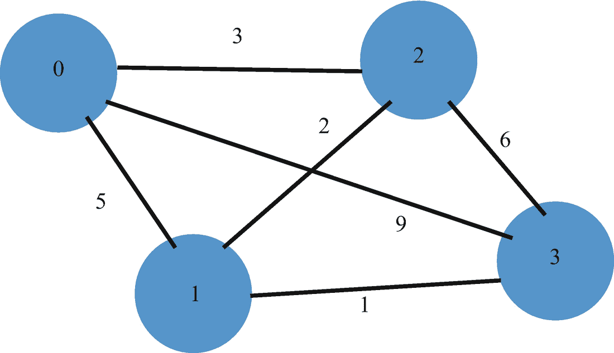
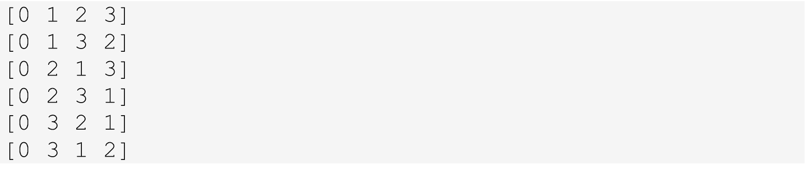
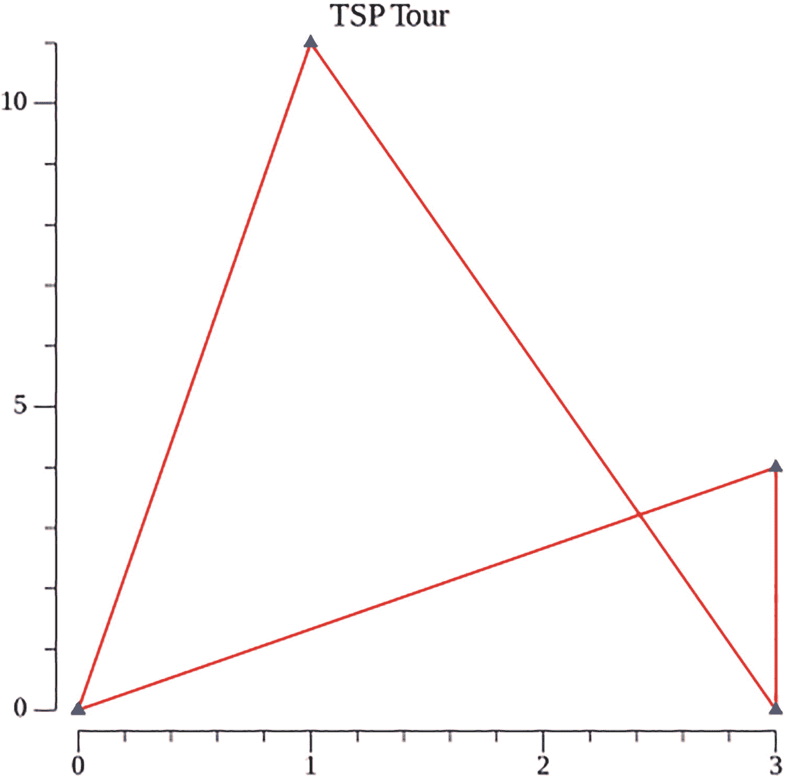

# 17. 旅行商问题

上一章介绍了图数据结构。我们展示了一个通用的实现。几个经典的图算法也已被实现和讨论。

本章是探讨经典旅行商问题解决方案的系列章节中的第一章。该问题的精确解在计算上是难以处理的。在本章中，我们将介绍并实现一个获取该问题精确解的算法。

在下一节中，我们将介绍这个经典问题。

## 17.1 旅行商问题及其历史

旅行商问题（TSP）是一个有着丰富历史的经典问题。给定一组城市以及每对城市之间的距离，该问题是要求**找到访问每个城市恰好一次并返回起始城市的最短路径**。该问题于 1930 年首次被提出，现已成为优化领域研究最深入的问题之一。

一些历史背景：

请参见 [`en.wikipedia.org/wiki/Travelling_salesman_problem#Exact_algorithms`](https://en.wikipedia.org/wiki/Travelling_salesman_problem%2523Exact_algorithms)。

1.  2001 年，使用由 [George Dantzig](https://en.wikipedia.org/wiki/George_Dantzig)、[Ray Fulkerson](https://en.wikipedia.org/wiki/D._R._Fulkerson) 和 [Selmer M. Johnson](https://en.wikipedia.org/wiki/Selmer_M._Johnson) 于 1954 年提出的、基于[线性规划](https://en.wikipedia.org/wiki/Linear_programming)的[割平面法](https://en.wikipedia.org/wiki/Cutting-plane_method)，找到了 TSPLIB 中 15,112 个德国城镇的精确解。

2.  2004 年 5 月，访问瑞典全部 24,978 个城镇的旅行商问题被解决：计算出一条长度约为 72,500 公里的路径，并证明了不存在更短的路径。

3.  2005 年 3 月，使用 [Concorde TSP 求解器](https://en.wikipedia.org/wiki/Concorde_TSP_Solver)解决了访问电路板上全部 33,810 个点的旅行商问题。该计算耗时约 15.7 CPU 年。

TSP 是一类被称为 **NP-hard**（非确定性多项式时间困难）问题的成员之一。如果能为这类问题中的任何一个找到基于多项式时间的解，则可以证明可以为该组中的所有问题找到多项式时间解。迄今为止，尚未为任何 NP-hard 问题找到这样的多项式时间解。

在下一节中，我们将介绍一种针对此问题的蛮力解法，该方法可以产生精确解。

## 17.2 精确的蛮力解法

城市将由图中的顶点表示，并编号为 0, 1, 2, …, n。城市之间的距离将指定为整数或浮点数，并显示为图中的边。

考虑图 17-1 所示的图形。该图表示一个四城市问题。边上的值代表城市之间的距离。



**图 17-1** – 四城市 TSP 图形

蛮力解法要求我们获取所有以城市 0 开始并以城市 0 结束的路径排列。对于排列中的每条路径，我们计算其成本。我们返回成本最低的路径。

我们考虑的路径排列如图 17-2 所示。



**图 17-2** – 路径排列

对于每条路径排列，我们计算路径的长度。具有最小长度的路径排列是该问题的一个最优解。可能存在多个并列最优解。

### 寻找排列

第一个任务是计算一个包含从 0 开始的连续整数的切片的所有排列。

清单 17-1 执行此任务。

```
package main
import (
"fmt"
)
func Permutations(data []int, operation func([]int)) {
permute(data, operation, 0)
}
func permute(data []int, operation func([]int), step
int) {
if step > len(data) {
operation(data)
return
}
permute(data, operation, step + 1)
for k := step + 1; k < len(data); k++ {
data[step], data[k] = data[k], data[step]
permute(data, operation, step + 1)
data[step], data[k] = data[k], data[step]
}
}
func main() {
data := []int{0, 1, 2, 3}
Permutations(data, func(a []int) {
fmt.Println(a)
})
}
/* 输出
[0 1 2 3]
[0 1 3 2]
[0 2 1 3]
[0 2 3 1]
[0 3 2 1]
[0 3 1 2]
[1 0 2 3]
[1 0 3 2]
[1 2 0 3]
[1 2 3 0]
[1 3 2 0]
[1 3 0 2]
[2 1 0 3]
[2 1 3 0]
[2 0 1 3]
[2 0 3 1]
[2 3 0 1]
[2 3 1 0]
[3 1 2 0]
[3 1 0 2]
[3 2 1 0]
[3 2 0 1]
[3 0 2 1]
[3 0 1 2]
*/
```

**清单 17-1** – 切片的排列

我们把验证代码对于一个小问题能产生所需排列的任务留给读者。

`Permutations` 函数的第二个参数是一个必须对每个切片执行的操作。在清单 17-1 展示的例子中，操作是输出该切片。这在 `main` 函数中以粗体显示。


### 旅行商问题的暴力计算

清单 17-2 展示了针对旅行商问题的暴力计算方法。它使用了清单 17-1 中介绍的排列逻辑，找出所有从 0 出发并回到 0 的旅行路径的排列。对于每条路径，计算其成本，并保存最优路径及其成本。

```
package main
import (
"fmt"
"math/rand"
"time"
)
type Graph [][]int
type TourCost struct {
cost int
tour []int
}
var minimumTourCost TourCost
var graph Graph
func Permutations(data []int, operation func([]int)) {
permute(data, operation, 0)
}
func permute(data []int, operation func([]int), step int) {
if step > len(data) {
operation(data)
return
}
permute(data, operation, step+1)
for k := step + 1; k < len(data); k++ {
data[step], data[k] = data[k], data[step]
permute(data, operation, step+1)
data[step], data[k] = data[k], data[step]
}
}
func TSP(graph Graph, numCities int) {
tour := []int{}
for i := 1; i < numCities; i++ {
tour = append(tour, i)
}
minimumTourCost = TourCost{32767, []int{}}
Permutations(tour, func(tour []int) {
// 计算路径成本
cost := graph[0][tour[0]]
for i := 0; i < len(tour)-1; i++ {
cost += graph[tour[i]][tour[i+1]]
}
cost += graph[tour[len(tour)-1]][0]
if cost < minimumTourCost.cost {
minimumTourCost.cost = cost
var tourCopy []int
tourCopy = append(tourCopy, 0)
tourCopy = append(tourCopy, tour...)
tourCopy = append(tourCopy, 0)
minimumTourCost.tour = tourCopy
}
})
}
func main() {
graph = Graph{{0, 5, 3, 9}, {5, 0, 2, 1}, {3, 2, 0, 6},
{9, 1, 6, 0}}
TSP(graph, 4)
fmt.Printf("\nOptimum tour cost: %d  An Optimum Tour %v", minimumTourCost.cost,
minimumTourCost.tour)
numCities := 14
graph2 := make([][]int, numCities)
for i := 0; i < numCities; i++ {
graph2[i] = make([]int, numCities)
}
for row := 0; row < numCities; row++ {
for col := 0; col < numCities; col++ {
graph2[row][col] = rand.Intn(9) + 2
}
}
// 为测试目的创建一条短路径
for i := 0; i < numCities-1; i++ {
graph2[i][i+1] = 1
}
graph2[numCities-1][0] = 1
start := time.Now()
TSP(graph2, numCities)
elapsed := time.Since(start)
fmt.Printf("\nOptimum tour cost: %d  An Optimum Tour %v", minimumTourCost.cost,
minimumTourCost.tour)
fmt.Println("\nComputation time: ", elapsed)
}
/* 输出
Optimum tour cost: 15  An Optimum Tour [0 1 3 2 0]
Optimum tour cost: 14  An Optimum Tour [0 1 2 3 4 5 6 7 8 9 10 11 12 13 0]
Computation time:  2m15.918717943s
*/
清单 17-2
旅行商问题的暴力求解方案
```

### 代码讨论

我们关注函数 `TSP` 内部对 `Permutations` 的调用。具体来说，我们查看作为第二个参数定义的函数（以粗体显示）。

对于排列中的每条路径，我们计算该路径的成本。

首先计算从城市 0 到路径排列中第一个城市的成本。随后，在一个循环中，我们计算并累加路径排列中城市序列的成本。最后计算的成本是从路径排列的最后一个城市回到城市 0 的成本。

我们将该路径排列的成本与迄今为止的最低成本进行比较。这个最低成本保存在一个 `TourCost` 类型的全局变量中。

```
type TourCost struct {
cost int
tour []int
}
```

一个编程细节要求我们复制保存到全局变量 `minimumTourCost` 中的路径。这是必要的，因为将一个切片赋值给另一个切片是浅拷贝。我们这里关心的是复制信息，而不是切片的地址。

我们通过如下 `append` 函数实现这一点：

```
var tourCopy []int
tourCopy = append(tourCopy, 0)
tourCopy = append(tourCopy, tour...)
tourCopy = append(tourCopy, 0)
```

这段代码还添加了从起始城市 0 出发的路径链接，以及返回城市 0 的路径链接。

这种暴力求解方案的计算成本是 `(n – 1)!`。这就是为什么暴力方法难以处理的原因。

为了说明这一点，我们求解一个 14 个城市的问题，城市间的距离为随机整数。我们嵌入了一条从城市 0 到 1、1 到 2、……、13 到 0 的低成本路径，每条路径距离为 1，总成本为 14。这不会影响计算时间，但可以测试 TSP 算法的正确性。

从输出中可以看到，我们通过了这个测试。14 个城市问题的计算时间超过了两分钟。

如果我们将问题规模增加一个城市，计算时间将增加 14 倍。计算复杂度 `O(n!)` 显然使得这种暴力算法难以处理。

### 其他解法

有许多算法都能给出 TSP 的精确解，但都难以处理。这些算法采用了动态规划、分支定界、线性规划等技术。它们对于小规模问题效果不错，但当城市数量超过几十个时就不实用了。

在探讨那些能够在大规模问题的合理时间和存储空间内给出接近精确解的启发式算法之前，下一节将介绍用于显示 TSP 路径的代码。

## 17.3 显示 TSP 路径

清单 17-3 使用一个第三方包，根据定义路径中城市的点切片，以图形方式显示一条路径。

```
package main
import (
"image/color"
"gonum.org/v1/plot"
"gonum.org/v1/plot/plotter"
"gonum.org/v1/plot/vg"
"gonum.org/v1/plot/vg/draw"
)
type Point struct {
X float64
Y float64
}
func definePoints(cities []Point, tour []int) plotter.XYs {
pts := make(plotter.XYs, len(cities) + 1)
pts[0].X = cities[0].X
pts[0].Y = cities[0].Y
for i := 1; i < len(cities); i++ {
pts[i].X = cities[tour[i]].X
pts[i].Y = cities[tour[i]].Y
}
pts[len(cities)].X = cities[0].X
pts[len(cities)].Y = cities[0].Y
return pts
}
func DrawTour(cities []Point, tour []int) {
data := definePoints(cities, tour) // plotter.XYs
p := plot.New()
p.Title.Text = "TSP 路径"
lines, points, err := plotter.NewLinePoints(data)
if err != nil {
panic(err)
}
lines.Color = color.RGBA{R: 255, A: 255}
points.Shape = draw.PyramidGlyph{}
points.Color = color.RGBA{B: 255, A: 255}
p.Add(lines, points)
// 将图表保存为 PNG 文件。
if err := p.Save(4*vg.Inch, 4*vg.Inch, "tour.png"); err != nil {
panic(err)
}
}
func main() {
numCities := 4
cities := make([]Point, numCities)
cities[0] = Point{0.0, 0.0}
cities[1] = Point{3.0, 0.0}
cities[2] = Point{3.0, 4.0}
cities[3] = Point{1.0, 11.0}
tour := []int{0, 3, 1, 2}
DrawTour(cities, tour)
}
清单 17-3
显示 TSP 路径
```

### 代码讨论

辅助函数 `definePoints` 返回一个 `plotter.XYs` 类型。它使用输入的切片 `cities` 来获取每个城市的 `X` 和 `Y` 坐标，并赋值给 `pts`。它根据输入的切片 `tour` 来分配点的序列。

`DrawTour` 函数调用 `definePoints` 并将结果赋值给 `data`。剩余的代码遵循导入的绘图包中的协议。定义了一个新的绘图 `p`。通过 `plotter.NewLinePoints` 获取了 `lines` 和 `points` 变量。

在将它们添加到绘图 `p` 后，保存了一个 `png` 文件，其中包含以图形方式显示路径的点和线。

该程序的输出如图 17-3 所示。



该图描绘了 TSP 的输出。X 轴范围从 0 到 3，增量为 1。Y 轴范围从 0 到 10，增量为 5。四个点 (0, 0)、(3, 4)、(3, 0) 和 (1, 11) 按上述顺序由线连接。

**图 17-3** 清单 17-3 的输出


## 17.4 小结

本章介绍了著名的**旅行商问题**，并给出了一种暴力求解方案。与所有已知的精确解法一样，该方案在计算上难以处理，其大 O 复杂度为 `O(n!)`。

文中展示了一段用于显示具有指定坐标位置的旅行路线代码，并通过一个简单示例进行了说明。

下一章将介绍另一种求解 TSP 精确解的算法。该算法运用了一种名为**分支定界**的强大技术。和所有已知的 TSP 精确解一样，这种分支定界算法在计算上同样难以处理。

