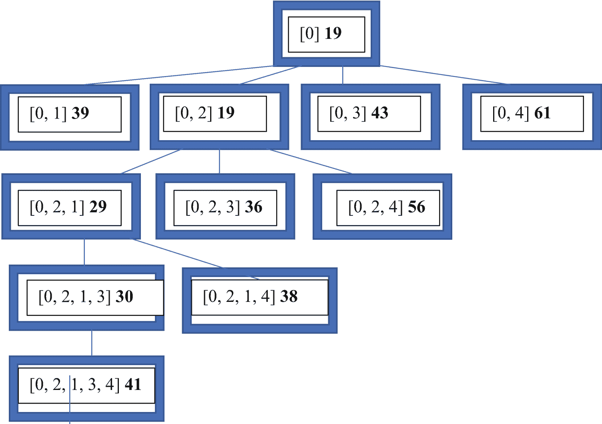

# 18. 旅行商问题的分支定界解法

前一章介绍了著名的**旅行商问题**，并给出了一种暴力求解方案。与所有该问题的精确解法一样，它在计算上是难以处理的。同时，还介绍了一个第三方包以及用于图形化显示 TSP 旅行路线的代码。

本章将介绍另一种使用强大技术——分支定界——求解 TSP 的精确解法。该解法同样在计算上难以处理。

下一节，我们将介绍分支定界技术，并展示如何将其应用于 TSP。

## 18.1 用于 TSP 的分支定界法

本章内容大部分基于本文作者于 2003 年发表在 *《Journal of Object Technology》* 上的一篇论文。论文标题为“*Branch and Bound Implementation for the Traveling Salesperson Problem*”（Richard Wiener, Journal of Object Technology, Vol 2. No. 3, May–June 2003）。

我们给定一个包含所有城市间距离的图（每个城市都与其他每个城市相连，边代表两城之间的距离）。图的节点是城市，编号为 0, …, n - 1。一条旅行路线是指从城市 0 出发，恰好访问每个其他城市一次，并最终返回起点城市 0 的城市序列。

**在任意旅行路线中，离开某城市时，所选择的边的权值必须大于或等于离开该城市的最短边的权值。**

这构成了 TSP 分支定界解法的基础。

### 一个示例

考虑一个具有如下距离矩阵（成本矩阵）的 TSP：

```
  0   14   4   11   20
14    0   7    8    7
4     7   0    7   16
11    8   7    0    2
20    7  16    2    0
```

我们按如下方式构建解树：

在第 0 层，根节点表示部分路线 `[0]`。

在第 1 层，生成表示部分路线 `[0, 1]`、`[0, 2]`、`[0, 3]`、…、`[0, n - 1]` 的节点。

在第 2 层，生成表示部分路线 `[0, 1, 2]`、`[0, 1, 3]`、`[0, 1, 4]`、… 的节点。

依此类推，直到最底层，我们得到所有可能旅行路线的全部排列。

### 下界计算

对于上述图中部分路线为 `[0]` 的根节点，离开五个顶点的成本下界为：

城市 0：最小值 (14, 4, 11, 20) = `4`。

城市 1：最小值 (14, 7, 8, 7) = `7`。

城市 2：最小值 (4, 7, 7, 16) = `4`。

城市 3：最小值 (11, 8, 7, 2) = `2`。

城市 4：最小值 (20, 7, 16, 2) = `2`。

因此，基于部分路线 `[0]` 的 TSP 解的下界是这些值的和，即 `19`。

现在，我们来计算部分路线 `[0, 2, 3]` 的下界。

城市 0：`4`（因为路线包含 0 -> 2）

城市 1：`7`（不能触碰已存在于路线中的节点）

城市 2：`7`（因为路线包含 2 -> 3）

城市 3：`11`（因为路线包含 3 -> 0）

城市 4：`7`（不能触碰已存在于路线中的节点）

因此，部分路线 `[0, 2, 3]` 的下界是这些值的和，等于 `36`。

计算部分路线下界的计算成本很低。

在包含部分路线的树的任何一层中，节点都可以根据其计算出的下界进行排序。我们可以使用优先队列来维护树结构。

### 分支定界算法

- 为最佳旅行路线成本设置一个初始值。
- 初始化一个优先队列（PQ）。
- 生成第一个节点，其部分路线为 `[0]`，并计算其下界。
- 将此节点插入到 PQ 中。
- 当 PQ 非空时，从 PQ 中取出第一个节点，并将其赋给父节点。
- 如果它的下界 < 最佳旅行路线成本，则将其层级设置为父节点的层级 + 1。
- 如果此层级为 N – 1（N 为城市数量），则将起始城市 0 添加到部分路线的末尾，并计算完整路线的成本。
- 如果此完整路线的成本 < 最佳旅行路线成本，则更新最佳旅行路线成本，并保存最佳旅行路线。
- 如果父节点的层级 + 1 不等于 N – 1，
    - 对于所有满足 `1 <= i < N` 且 `i` 不在父节点部分路线中的 `i`，
        - 将父节点的部分路线复制到新节点，并将 `i` 添加到该部分路线的末尾。
        - 计算此新节点的下界。
        - 如果此下界小于当前最佳旅行路线成本，则将此新节点插入优先队列；否则，剪掉此节点。

### 优先队列

在将节点插入 PQ 之前，会对其进行筛选，以确定其下界是否小于当前已知的最佳旅行路线成本。这有助于将 PQ 中的节点数控制在可管理的水平。

队列必须执行哪些优先级规则？

在 PQ 中，处于更深层级（层级编号更高）的节点比处于更浅层级的节点具有更高的优先级。这确保了树向下生长，并且代表完整路线的叶节点能够尽快生成。在比较同一层级的两个节点时，优先考虑具有最小下界的节点。如果出现平局（两个节点具有相等的下界），则计算部分路线中城市编号的总和。总和较小的节点比总和较大的节点具有更高的优先级（平局不可能发生）。刚刚陈述的规则禁止两个不同的节点具有相等的优先级。

我们将遍历前面提到的五城示例的一部分，以了解优先队列是如何构建的。

### 遍历前面提到的五城示例的一部分

初始成本通过计算路线 `[0, 1, …, n – 1, 0]` 的成本得到，其值为 `50`。由于前面显示根节点的下界为 19，因此我们将部分路线 `[0]` 推入 PQ。我们从 PQ 中取出路线 `[0]`，并生成第 1 层的节点。除了一个节点外，所有节点的下界都小于 50，因此我们将它们推入 PQ。PQ 顶部是 `[0, 2]`，其下界为 19。接下来是 `[0, 1]`，下界为 39，第三个是 `[0, 3]`，下界为 43。我们按照算法中的规定继续生成节点，如图 18-1 所示。



图 18-1 部分解树

完整路线 `[0, 2, 1, 3, 4]` 是第一个被生成的。由于其成本小于当前最佳值 50，我们设定最佳路线为 `[0, 2, 1, 3, 4]`，其成本为 41。

PQ 的前端包含节点 `[0, 2, 1, 4]`，因为它处于最深层。算法回溯到该节点，然后生成另一条完整路线 `[0, 2, 1, 4, 3]`，其成本也是 41。这使得一些节点在从 PQ 中取出时可以被剪掉，因为它们的下界大于 `41`。

您可能希望继续处理这个示例的其余过程。

下一节，我们将探讨该算法的实现。


## 18.2 分支定界法的实现

支持该分支定界算法所需的最重要功能之一，是计算给定旅程的下界。该函数如下所示：

```
func LowerBound(tour []int) float64 {
edges := make([]float64, 0)
sum := 0.0
n := len(tour)
for city := 0; city < n; city++ {
pos := 0
found := false
for index := 0; index < n; index++ {
if city == tour[index] {
found = true
pos = index
break
}
}
if n > 1 && found {
if pos == n-1 {
edges = append(edges,
graph[city][0])
} else {
edges = append(edges,
graph[city][tour[pos+1]])
}
break
}
found, _ = In(index, tour)
if n == 1 || !found {
// 不允许已在旅程中的索引
edges = append(edges,
graph[city][index])
}
}
sum += Minimum(edges)
edges = make([]float64, 0)
}
return sum
}
```

该函数的工作方式与第 18.1 节中介绍的算法大纲完全一致。

一个关键的辅助函数是 `In`，如下所示：

```
func In(value int, values []int) (bool, int) {
// 若 value 存在于 values 中则返回 true
// 返回位置索引，若未找到则返回 -1
for index := 0; index < len(values); index++ {
if values[index] == value {
return true, index
}
}
return false, -1
}
```

### 优先队列的实现

优先队列在此算法中起着核心作用。它存储节点，每个节点包含一个旅程、一个下界和一个层级，其优先级按第 18.1 节中的规定定义，为方便起见在此重复：

- 在 PQ 中，层级更深（层级编号更高）的节点优先于层级较浅的节点。
- 如果节点处于同一层级，则优先级赋予下界最小的节点。
- 如果同一层级的两个节点具有相同的下界，则累加节点旅程中的城市，总和较大的节点具有更高优先级。

支持优先队列实现的代码如下：

```
type Node struct {
tour       []int
lowerBound float64
level      int
}
type Nodes []Node
// 允许节点排序
func (nodes Nodes) Len() int {
return len(nodes)
}
func (nodes Nodes) Swap(i, j int) {
nodes[i], nodes[j] = nodes[j], nodes[i]
}
func (nodes Nodes) Less(i, j int) bool {
if nodes[i].level > nodes[j].level {
return true
}
if nodes[i].level == nodes[j].level &&
nodes[i].lowerBound == nodes[j].lowerBound {
// 返回较小的城市总和
tour1 := nodes[i].tour
sum1 := 0
for i := 0; i < len(tour1); i++ {
sum1 += tour1[i]
}
tour2 := nodes[j].tour
sum2 := 0
for i := 0; i < len(tour2); i++ {
sum2 += tour2[i]
}
return sum1 < sum2
}
if nodes[i].level == nodes[j].level &&
nodes[i].lowerBound != nodes[j].lowerBound {
return nodes[i].lowerBound <
nodes[j].lowerBound
}
return false
}
type PriorityQueue struct {
items Nodes
}
func NewPriorityQueue() PriorityQueue {
return PriorityQueue{}
}
func (pq *PriorityQueue) Insert(node Node) {
tourToInsert := DeepCopy(node.tour)
nodeToInsert := Node{tourToInsert, node.lowerBound,
node.level}
pq.items = append(pq.items, nodeToInsert)
sort.Sort(pq.items)
}
func (pq *PriorityQueue) Remove() Node {
result := pq.items[0]
pq.items = pq.items[1:]
return result
}
```

优先队列（PQ）持有类型为 `Node` 的实体。每次向队列中插入新节点时，我们都会对队列进行排序，以确保优先级最高的节点位于队列前面。

为了实现对 PQ 中节点的排序，我们需要实现 `sort` 包中 `Sort` 方法的接口。

这是通过前面给出的函数 `Len`、`Swap` 和 `Less` 完成的。三个优先级规则均在函数 `Less` 中实现。

`Insert` 函数在追加正在插入的节点后对项目（`Node` 切片）进行排序。

### 生成分支定界解

根据第 18.1 节大纲生成节点、将其插入优先队列、寻找最佳新旅程，并在剪除下界超过当前已知最佳旅程的节点时进行回溯的函数，如下所示为函数 `TSP`：

```
func TSP() {
var elapsed time.Duration
start := time.Now()
bestTour := []int{}
for i := 0; i < NUMCITIES; i++ {
bestTour = append(bestTour, i)
}
pq := NewPriorityQueue()
bestCost := LowerBound(bestTour)
tour := []int{0}
lowerBound := LowerBound(tour)
node := Node{tour, lowerBound, 0}
nodesGenerated += 1
pq.Insert(node)
for {
if len(pq.items) == 0 {
break
}
top := pq.Remove()
topLevel := top.level
topTour := top.tour
// 生成 topLevel + 1 层的节点
for i := 0; i < NUMCITIES; i++ {
tour := DeepCopy(topTour)
found, _ := In(i, topTour)
if !found {
tour = append(tour, i)
nodesGenerated += 1
if nodesGenerated %
10_000_000 == 0 {
fmt.Println("\n 生成的节点数（以百万计）: ", nodesGenerated /
1_000_000)
fmt.Printf("\n\n 最优旅程成本:
%0.2f  \n 最佳旅程: %v", bestCost,
bestTour)
elapsed = time.Since(start)
seconds := elapsed / 1_000_000_000
rate := float64(nodesGenerated) /
float64(seconds)
fmt.Printf("\n 每秒生成的节点数: %0.0f  PQ 长度: %d
已用时间: %v", rate,
len(pq.items), elapsed)
}
if len(tour) == NUMCITIES {
// 得到一个完整的旅程
tourCost := LowerBound(tour)
if tourCost < bestCost {
bestTour = tour
bestCost = tourCost
fmt.Println("\n\n 迄今为止的最佳旅程
成本: ", bestCost)
}
} else {
tourCost := LowerBound(tour)
if tourCost < bestCost {
node := Node{tour, tourCost,
topLevel + 1}
pq.Insert(node)
}
}
}
}
}
fmt.Printf("\n\n 最优旅程成本: %0.2f  \n 最佳
旅程: %v  \n 生成的节点数: %d", bestCost,
bestTour, nodesGenerated)
}
```

清单 18-1 将所有部分整合在一起，并展示了所有辅助函数和一个尝试解决 33 个城市问题的主驱动程序。

```
package main
import (
"fmt"
"sort"
"time"
)
const (
NUMCITIES = 33
)
type Node struct {
tour       []int
lowerBound float64
level      int
}
type Graph [][]float64
var graph Graph
var nodesGenerated int64
type Nodes []Node
// 允许节点排序
func (nodes Nodes) Len() int {
return len(nodes)
}
func (nodes Nodes) Swap(i, j int) {
nodes[i], nodes[j] = nodes[j], nodes[i]
}
func (nodes Nodes) Less(i, j int) bool {
// 省略
}
type PriorityQueue struct {
items Nodes
}
func NewPriorityQueue() PriorityQueue {
return PriorityQueue{}
}
func (pq *PriorityQueue) Insert(node Node) {
// 省略
}
func (pq *PriorityQueue) Remove() Node {
// 省略
}
func DeepCopy(tour []int) []int {
result := []int{}
for i := range tour {
result = append(result, tour[i])
}
return result
}
func Minimum(values []float64) float64 {
// 此函数排除值为 0 的情况
min := 100000000.0
for i := 0; i < len(values); i++ {
if values[i] != 0 && values[i] < min {
min = values[i]
}
}
if min == 100000000.0 {
return 0.0
}
return min
}
func In(value int, values []int) (bool, int) {
// 省略
}
func LowerBound(tour []int) float64 {
// 省略
}
func TSP() {
// 省略
}
func main() {
graph = // 从出版商网站下载
TSP()
}
清单 18-1
旅行商问题的分支定界解法
```

### main 函数的数据

图是根据从 Rand McNally Atlas 中获取的 33 个美国城市的数据构建的，并指定了它们之间的距离。

由于篇幅限制，此处省略了 `main` 函数中的细节。请从出版商网站下载完整清单。

该问题的已知解是一个最优旅程，长度为 **10,861** 英里。

### 结果

在运行分支定界程序 **18 小时** 42 分钟、以约 **每秒 70,000 个节点** 的速度生成 **46 亿个节点** 后，迄今生成的最佳旅程是

`[0 13 1 2 3 5 4 6 7 8 9 10 11 17 18 19 27 29 30 28 31 32 22 21 23 24 25 26 20 14 15 16 12]`

该旅程长度为 11,553 **英里**，误差约为 6%。我们必须提醒自己，表示此问题的完整树中节点总数为 263,130,836,933,693,530,167,218,012,160,000,000 个。

按平均每秒 71,874 个节点的速率，生成该树中的所有叶节点大约需要 1.39 × 10³⁰ 秒，即大约 4.41 × 10²² 年。


## 18.3 总结

我们提出了一种分支定界算法，该算法为 TSP 提供了精确解。问题在于，这是一个计算上难以处理的问题。如果允许其运行足够长的时间，它将找到该问题的精确解。

使用一个优先队列来保存一系列节点，每个节点包含一个旅程（可能是部分旅程）、一个下界和一个层级。队列中的节点按层级、下界以及（在平局情况下）旅程中城市值的总和进行排序。

尝试了一个 33 城市的问题。经过两个小时的计算，获得的最佳旅程比已知的最优旅程高出约 6%。这个迄今为止的最佳旅程在 16 小时后保持不变。

这为接下来的两章奠定了基础，在其中我们将介绍 TSP 的启发式解法。这些启发式解法在几秒钟内执行，并生成精确解或误差很小的解。

下一章介绍一种启发式算法：模拟退火。

