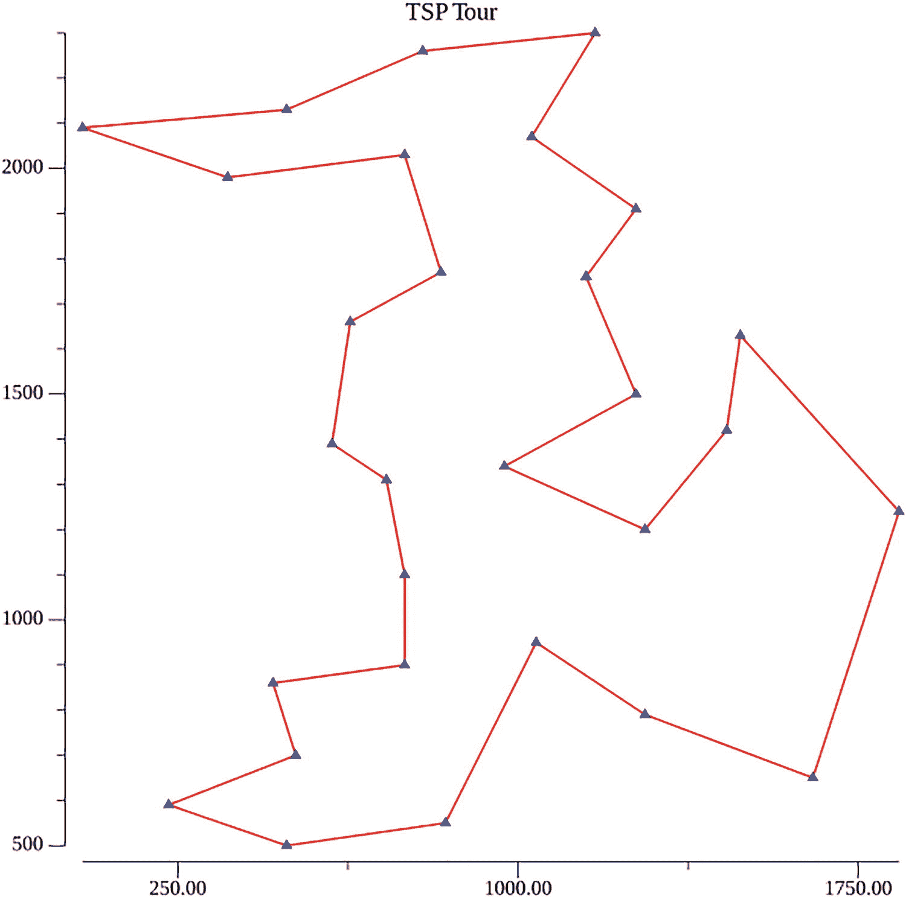

# 19. 模拟退火：一种解决 TSP 的启发式解法

前一章介绍了一种用于生成 TSP 精确解的分支定界算法。像所有已知的精确解法一样，它在计算上是难以处理的。

本章介绍解决 TSP 的强大启发式解法：模拟退火。

在下一节中，我们将介绍组合优化问题，并为我们介绍解决 TSP 的启发式算法奠定基础。

## 19.1 组合优化

组合优化问题在计算上是困难的。随着这些问题规模的增大，精确解的计算时间会变得不可行——需要数年或数个世纪的计算时间和无法实现的内存需求。

其中一个著名且有趣的问题是前一章介绍的“旅行商问题”（TSP）。这个问题很容易陈述和理解。给定 `n` 个城市，以及城市之间的指定距离，找到从给定城市（例如城市 0）出发，访问其余 `n-1` 个城市，并返回起始城市的最短旅程。换句话说，找到访问城市的顺序，使得总行驶距离最小。

通常，我们会得到 `n` 个城市的位置，从中我们可以计算它们之间的距离。我们假设在一个全连接图中，城市之间存在双向连接（每个城市与所有其他城市都有连接）。

正如我们在第 17 章中看到的，枚举所有可能的旅程组合并选择总行驶距离最小的旅程的暴力解法，其复杂度为 `(n – 1)!`。例如，对于标记为 1、2、3 和 4 的四个城市，从城市 1 出发并返回的可能的旅程是：

```
1 -> 2 -> 3 -> 4
1 -> 2 -> 4 -> 3
1 -> 3 -> 2 -> 4
1 -> 3 -> 4 -> 2
1 -> 4 -> 2 -> 3
1 -> 4 -> 3 -> 2
```

正如预测的那样，共有 `(4 – 1)!` 或 `3! = 6` 种可能的旅程。

对于一个 29 城市的问题，可能的旅程数量是 `28! = 3.0488834e+29`。如果我们能以每秒 1000 万次旅程的速度评估这些旅程，完成这个计算大约需要 317,000,000,000,000 年。

因此，即使对于像 29 城市这样规模不大的问题，获得 TSP 的精确解在计算上也是难以处理的。

### 启发式解法

由于 TSP 有许多重要的“现实世界”应用（例如，印刷电路板、交通运输），研究人员已经设计了许多解决 TSP 的启发式算法。启发式解法是一种不保证最优但在计算上可处理（多项式复杂度）并且有望产生接近最优解的解法。通常，启发式算法能够生成问题的最优解。

解决 TSP 的这两类近似解法的两大框架是：

1.  模拟退火
2.  遗传编程

上述两大框架之所以如此有趣，是因为它们各自源自与 TSP 并不直接相关的过程和系统。它们可以部署在广泛的组合优化问题上。还有其他用于获得 TSP 启发式解法的框架。

这些启发式框架中的第一个利用了热力学模型，第二个利用了遗传学和适者生存模型。

在下一节中，我们将研究这些启发式框架中的第一个：模拟退火。

## 19.2 模拟退火

导致这一用于解决组合优化问题框架的开创性工作于 1953 年由 [Nicholas Constantine Metropolis] 发表。后来，他和同事 W. K. Hastings 发表了构成模拟退火基础的 Metropolis-Hastings 算法。

模拟退火是一种蒙特卡洛算法。这类算法依赖于对系统的重复统计抽样。在计算系统感兴趣属性的同时，生成系统的许多随机配置，并根据实验结果改进抽样。

模拟退火依赖于模仿金属分子晶格结构在加热并缓慢冷却以产生刚性强晶格结构时的热力学特性。冶金学家称此过程为“退火”。其目的是通过创建具有最小内能的晶格结构，来最小化钢制承重梁中的微观变形。在退火过程（梁的缓慢冷却）中，此类梁的平均能量由玻尔兹曼因子 `e`^(-`E`/`kT`) 给出，其中 `E` 是梁的平均能量，`T` 是温度，`k` 是玻尔兹曼常数。

金属梁物理退火过程中极其重要的一部分是缓慢降低温度。这增加了梁内部晶格结构能量最小且强度最大的概率。

### 模拟退火步骤

模拟退火算法的概要如下：

1.  选择一个初始旅程并计算其成本。
2.  为人工温度变量选择一个较高的初始温度 `T`。
3.  通过对现有旅程进行更改来修改旅程（例如，修改旅程中两个城市的顺序，或稍后出现的其他修改方式）。
4.  如果新旅程成本小于旧旅程成本，则接受这个新旅程（下坡移动）。
5.  如果新旅程成本高于旧旅程成本，则以玻尔兹曼因子 `e`^(-`E`/`kT`) 给出的概率接受这个上坡移动。
6.  在高温下，接受这种“上坡移动”的概率接近于 1。这使得模拟能够探索解空间中的许多区域，而不会陷入旅程成本与温度空间中的局部谷底。
7.  根据冷却曲线降低温度。该冷却曲线可以通过观察旅程成本随温度下降的速率来凭经验获得，并在该下降速率高时减缓温度的降低。
8.  重复步骤 3 到 7。
9.  随着温度降低，接受上坡移动的概率减小。这允许算法下降，希望达到接近全局最小值的能量最低状态（最低旅程成本）。

这个算法的特别之处在于，随着温度变量缓慢降低，它会从统计上演化出越来越好、越来越好的旅程。这是基于冶金退火物理学对解空间进行的一次有引导的随机游走。

该算法相对容易实现，并且正如我们将要展示的那样，它能生成高质量的解，要么是最优解，要么接近最优解。


### 收敛到局部最小值而非全局最小值的问题

在解决组合优化问题时，一个始终存在的挑战是解会收敛到局部最小值，而非期望的全局最小值。因此，理想的做法是允许在解空间中进行充分的探索，而不是急于演化为一个解。

在模拟退火算法中，我们通过允许"上坡移动"来实现这一点。这些是在解空间中产生的路径长度大于当前已知最优路径的移动。其目标是能够跳出解空间中的局部低谷，同时找到可能包含全局最小值的更深低谷。

在下一节中，我们将按照刚才介绍的步骤，给出模拟退火算法的实现。

## 模拟退火算法的实现

我们创建一个 `Status` 类型，用于封装系统中相关的状态信息。

```go
type Status struct {
	tour           []int
	bestTour       []int
	bestCostToDate float64
	previousCost   float64
	temperature    float64
	downhillMoves  int
	uphillMoves    int
	rejectedMoves  int
	inverseOps     int
	swapOps        int
	insertOps      int
}
var status Status
```

我们使用三种独立的操作来扰动解空间中的一条路径：

- **逆序操作** – 我们在两个随机选择的索引值之间将路径反向。
- **交换** – 我们在给定路径中随机选择两个城市并进行交换。
- **插入** – 将位于随机位置的第二个城市移动到第一个随机位置。

此模拟退火实现的详细信息，以及大量的注释和程序输出，都展示在代码清单 19-1 中。

```go
package main
import (
	"fmt"
	"math"
	"math/rand"
	"time"
)
const (
	NUMCITIES = 29
)
type Point struct {
	x float64
	y float64
}
func init() {
	rand.Seed(time.Now().UnixNano())
}
func (pt Point) distance(other Point) float64 {
	dx := pt.x - other.x
	dy := pt.y - other.y
	return math.Sqrt(dx*dx + dy*dy)
}
func createGraph(numCities int, cities []Point, graph [][]float64) {
	for row := 0; row < numCities; row++ {
		for col := 0; col < numCities; col++ {
			graph[row][col] = cities[row].distance(cities[col])
		}
	}
}
func randomFrom(min int, max int) int {
	return rand.Intn(max-min) + min
}
func inverse(tour []int) []int {
	firstIndex := randomFrom(1, len(tour)-1)
	secondIndex := randomFrom(1, len(tour)-1)
	for firstIndex == secondIndex {
		firstIndex = randomFrom(1, len(tour)-1)
		secondIndex = randomFrom(1, len(tour)-1)
	}
	if firstIndex > secondIndex {
		firstIndex, secondIndex = secondIndex, firstIndex
	}
	result := deepcopy(tour[:firstIndex])
	for index := 0; index <= secondIndex-firstIndex; index++ {
		result = append(result, tour[secondIndex-index])
	}
	for index := secondIndex + 1; index < len(tour); index++ {
		result = append(result, tour[index])
	}
	return result
}
func swap(tour []int) []int {
	firstIndex := randomFrom(1, len(tour)-1)
	secondIndex := randomFrom(1, len(tour)-1)
	for firstIndex == secondIndex {
		firstIndex = randomFrom(1, len(tour)-1)
		secondIndex = randomFrom(1, len(tour)-1)
	}
	if firstIndex > secondIndex {
		firstIndex, secondIndex = secondIndex, firstIndex
	}
	result := deepcopy(tour)
	result[firstIndex], result[secondIndex] = result[secondIndex], result[firstIndex]
	return result
}
func insert(tour []int) []int {
	/*
	   这意味着将第二个位置上的城市移动到第一个位置。
	   考虑路径 [0, 3, 2, 1, 5, 4] 且 first = 1 和 second = 4
	   新路径将为 [0, 5, 3, 2, 1, 4]
	*/
	firstIndex := randomFrom(1, len(tour)-1)
	secondIndex := randomFrom(1, len(tour)-1)
	for firstIndex == secondIndex {
		firstIndex = randomFrom(1, len(tour)-1)
		secondIndex = randomFrom(1, len(tour)-1)
	}
	if firstIndex > secondIndex {
		firstIndex, secondIndex = secondIndex, firstIndex
	}
	result := []int{}
	for index := 0; index < firstIndex; index++ {
		result = append(result, tour[index])
	}
	result = append(result, tour[secondIndex])
	for index := firstIndex; index < secondIndex; index++ {
		result = append(result, tour[index])
	}
	for index := secondIndex + 1; index <= len(tour); index++ {
		if index != firstIndex && index != secondIndex+1 {
			result = append(result, tour[index-1])
		}
	}
	return result
}
type Status struct {
	tour           []int
	bestTour       []int
	bestCostToDate float64
	previousCost   float64
	temperature    float64
	downhillMoves  int
	uphillMoves    int
	rejectedMoves  int
	inverseOps     int
	swapOps        int
	insertOps      int
}
var status Status
func deepcopy(tour []int) []int {
	result := []int{}
	for i := range tour {
		result = append(result, tour[i])
	}
	return result
}
func simulatedAnnealing(graph [][]float64) {
	for i := 0; i < len(status.tour); i++ {
		status.tour[i] = i
	}
	status.bestTour = deepcopy(status.tour)
	status.bestCostToDate = tourCost(status.tour, graph)
	status.previousCost = status.bestCostToDate
	for status.temperature >= lowestTemperature {
		for iteration := 0; iteration < numIterations; iteration++ {
			// 使用三种操作扰动当前路径
			newTour1 := inverse(status.tour)
			newTour2 := swap(status.tour)
			newTour3 := insert(status.tour)
			cost1 := tourCost(newTour1, graph)
			cost2 := tourCost(newTour2, graph)
			cost3 := tourCost(newTour3, graph)
			// 从三者中选择最佳路径
			var newTour []int
			newCost := 0.0
			if cost1 <= cost2 && cost1 <= cost3 {
				newTour = newTour1
				newCost = cost1
			} else if cost2 <= cost1 && cost2 <= cost3 {
				newTour = newTour2
				newCost = cost2
			} else {
				newTour = newTour3
				newCost = cost3
			}
			if newCost < status.previousCost {
				status.tour = newTour
				status.previousCost = newCost
				status.downhillMoves++
				if newCost < status.bestCostToDate {
					status.bestTour = deepcopy(newTour)
					status.bestCostToDate = newCost
				}
			} else {
				metropolis := math.Exp((status.previousCost - newCost) / status.temperature)
				randomValue := rand.Float64()
				if randomValue < metropolis {
					status.tour = newTour
					status.previousCost = newCost
					status.uphillMoves++
				} else {
					status.rejectedMoves++
				}
			}
		}
		if status.temperature >= 1000.0 {
			status.temperature *= 0.90
		} else if status.temperature >= 500 {
			status.temperature *= 0.94
		} else if status.temperature >= 200 {
			status.temperature *= 0.97
		} else if status.temperature >= 50 {
			status.temperature *= 0.98
		} else {
			status.temperature *= 0.99
		}
	}
}
func main() {
	cities := []Point{}
	pt1 := Point{1150.0, 1760.0}
	cities = append(cities, pt1)
	pt2 := Point{630.0, 1660.0}
	cities = append(cities, pt2)
	pt3 := Point{40.0, 2090.0}
	cities = append(cities, pt3)
	pt4 := Point{750.0, 1100.0}
	cities = append(cities, pt4)
	pt5 := Point{750.0, 2030.0}
	cities = append(cities, pt5)
	pt6 := Point{1030.0, 2070.0}
	cities = append(cities, pt6)
	pt7 := Point{1650.0, 650.0}
	cities = append(cities, pt7)
	pt8 := Point{1490.0, 1630.0}
	cities = append(cities, pt8)
	pt9 := Point{790.0, 2260.0}
	cities = append(cities, pt9)
	pt10 := Point{710.0, 1310.0}
	cities = append(cities, pt10)
	pt11 := Point{840.0, 550.0}
	cities = append(cities, pt11)
	pt12 := Point{1170.0, 2300.0}
	cities = append(cities, pt12)
	pt13 := Point{970.0, 1340.0}
	cities = append(cities, pt13)
	pt14 := Point{510.0, 700.0}
	cities = append(cities, pt14)
	pt15 := Point{750.0, 900.0}
	cities = append(cities, pt15)
	pt16 := Point{1280.0, 1200.0}
	cities = append(cities, pt16)
	pt17 := Point{230.0, 590.0}
	cities = append(cities, pt17)
	pt18 := Point{460.0, 860.0}
	cities = append(cities, pt18)
	pt19 := Point{1040.0, 950.0}
	cities = append(cities, pt19)
	pt20 := Point{590.0, 1390.0}
	cities = append(cities, pt20)
	pt21 := Point{830.0, 1770.0}
	cities = append(cities, pt21)
	pt22 := Point{490.0, 500.0}
	cities = append(cities, pt22)
	pt23 := Point{1840.0, 1240.0}
	cities = append(cities, pt23)
	pt24 := Point{1260.0, 1500.0}
	cities = append(cities, pt24)
	pt25 := Point{1280.0, 790.0}
	cities = append(cities, pt25)
	pt26 := Point{490.0, 2130.0}
	cities = append(cities, pt26)
	pt27 := Point{1460.0, 1420.0}
	cities = append(cities, pt27)
	pt28 := Point{1260.0, 1910.0}
	cities = append(cities, pt28)
	pt29 := Point{360.0, 1980.0}
	cities = append(cities, pt29)
	graph := make([][]float64, NUMCITIES)
	for i := 0; i < NUMCITIES; i++ {
		graph[i] = make([]float64, NUMCITIES)
	}
	createGraph(NUMCITIES, cities, graph)
	status.tour = make([]int, NUMCITIES)
	lowestTemperature := 5.0
	numIterations := 100
	status.temperature = 20000.0
	simulatedAnnealing(graph)
	fmt.Printf("最佳路径: %v\n", status.bestTour)
	fmt.Printf("最佳成本: %.2f\n", status.bestCostToDate)
	fmt.Printf("下坡移动次数: %d\n", status.downhillMoves)
	fmt.Printf("上坡移动次数: %d\n", status.uphillMoves)
	fmt.Printf("拒绝移动次数: %d\n", status.rejectedMoves)
	fmt.Printf("逆序操作次数: %d\n", status.inverseOps)
	fmt.Printf("交换操作次数: %d\n", status.swapOps)
	fmt.Printf("插入操作次数: %d\n", status.insertOps)
}
/*
   程序输出:
   最佳路径: [28 9 6 12 10 28 17 21 2 4 22 23 16 0 27 19 18 25 1 8 12 5 7 24 20 3 13 15 14]
   最佳成本: 9074.15
   下坡移动次数: 407
   上坡移动次数: 1399
   拒绝移动次数: 8194
   逆序操作次数: 3394
   交换操作次数: 3312
   插入操作次数: 3294
   耗时: 2.288s
*/
// 代码清单 19-1
// 模拟退火算法解决旅行商问题
```

### 代码讨论

让我们聚焦于 `simulatedAnnealing` 函数。

一个 `for` 循环在温度大于 `lowestTemperature`（我们将其设置为 5.0）时运行。我们考虑使用前面讨论的三种操作来扰动当前路径。我们将新路径分配给这三个候选项中的成本最低者。

如果这条新路径的成本小于先前路径的成本，我们就接受这条新路径，增加下坡移动的次数，并更新其他状态值。

否则，我们使用类玻尔兹曼函数计算一个 `metropolis` 值，以决定是否接受一次上坡移动（路径成本大于先前路径成本）。

```go
metropolis :=
	math.Exp((status.previousCost - newCost) /
		status.temperature)
```

接下来，我们生成一个介于 0 和 1 之间的随机浮点值。如果该值小于 `metropolis`，我们通过将路径更改为成本更差的路径（上坡移动）来接受一次上坡移动，然后更新相应的状态值。

如果随机浮点值大于或等于 `metropolis` 值，我们则不修改当前路径。

随后，使用之前定义的三种操作对路径进行新的潜在修改。这将继续进行，直到我们为给定温度完成了规定次数的修改。然后，我们使用冷却曲线的逻辑来降低温度，并重新开始刚才描述的过程。

### 结果

这次运行在 iMac 上的执行时间为 2.3 秒。成本最低的路径 **9074.15** 是这个 29 城市问题的已知最优路径。模拟退火启发式算法找到最优路径的情况并不罕见，尽管这并非 guaranteed。


### 显示最终结果

如果将清单 17-3 中的代码添加到清单 19-1 中，并在函数`simulatedAnnealing`的最后一行加入`DrawTour`，我们就能得到如图 19-1 所示的绘图。



这张图展示了模拟退火算法生成的一个包含 29 个城市的旅行路线图。所有数据均为近似值。图中绘制的一些点包括(250, 600)、(1100, 900)、(1650, 650)、(1800, 1200)、(1550, 1400)、(1200, 2300)、(750, 2250)、(50, 2100)、(750, 1400)、(600, 850)，所有这些点都由一条线连接，形成了一个封闭的多边形。

图 19-1

模拟退火算法生成的 29 个城市旅行路线图

### 交叉的线段

正如预期的那样，这个路线中没有交叉的线段。众所周知，如果一个封闭多边形中有两条边交叉，那么存在一个具有相同顶点但周长更小的多边形。这是由三角不等式推导得出的。该不等式指出，在任何三角形中，任意两边之和必定大于第三边。

因此，**一个必要条件**是，最优路线中不能存在交叉线段。但这**并不是一个充分条件**。非最优路线也可能没有交叉线段。

用于生成图形输出的补充代码如清单 19-2 所示。此处仅展示了发生变化的函数。

```
package main
import (
"fmt"
"math"
"math/rand"
"time"
"image/color"
"gonum.org/v1/plot"
"gonum.org/v1/plot/plotter"
"gonum.org/v1/plot/vg"
"gonum.org/v1/plot/vg/draw"
)
const (
NUMCITIES = 29
)
type Point struct {
x float64
y float64
}
var cities []Point
func init() {
// 省略
}
func (pt Point) distance(other Point) float64 {
// 省略
}
func createGraph(numCities int, cities []Point, graph
[][]float64) {
// 省略
}
func cost(graph [][]float64, tour []int) float64 {
// 省略
}
func swap(tour []int) []int {
// 省略
}
func insert(tour []int) []int {
// 省略
}
type Status struct {
// 省略
}
var status Status
func deepcopy(tour []int) []int {
// 省略
}
func simulatedAnnealing(graph [][]float64) {
// 省略
DrawTour(cities, status.bestTour)
}
func definePoints(cities []Point, tour []int)
plotter.XYs {
pts := make(plotter.XYs, len(cities) + 1)
pts[0].X = cities[0].x
pts[0].Y = cities[0].y
for i := 1; i < len(cities); i++ {
pts[i].X = cities[tour[i]].x
pts[i].Y = cities[tour[i]].y
}
pts[len(cities)].X = cities[0].x
pts[len(cities)].Y = cities[0].y
return pts
}
func DrawTour(cities []Point, tour []int) {
data := definePoints(cities, tour) // plotter.XYs
p := plot.New()
p.Title.Text = "TSP Tour"
lines, points, err := plotter.NewLinePoints(data)
if err != nil {
panic(err)
}
lines.Color = color.RGBA{R: 255, A: 255}
points.Shape = draw.PyramidGlyph{}
points.Color = color.RGBA{B: 255, A: 255}
p.Add(lines, points)
// 将绘图保存为 PNG 文件。
if err := p.Save(6*vg.Inch, 6*vg.Inch, "tour.png");
err != nil {
panic(err)
}
}
func main() {
// 省略
}
清单 19-2
带图形输出的模拟退火算法
```

## 19.4 总结

本章介绍了一种用于解决 TSP 问题的模拟退火启发式算法。该算法的步骤模拟了金属梁的退火过程，其目标是将金属梁浸入热液体中，然后缓慢冷却，直到其晶格结构的内部平均能量降至最低。模拟退火算法使用一个人工温度变量，在尝试降低路线成本的同时，缓慢地冷却解空间。

我们将此启发式算法应用于一个 29 个城市的问题，并获得了显著的结果。

下一章将介绍另一种解决 TSP 问题的启发式算法：遗传算法。

