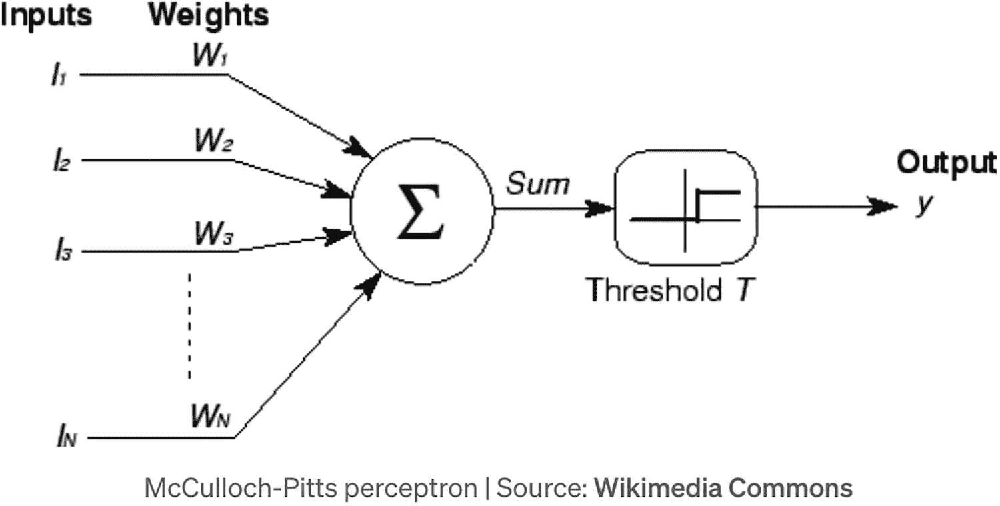
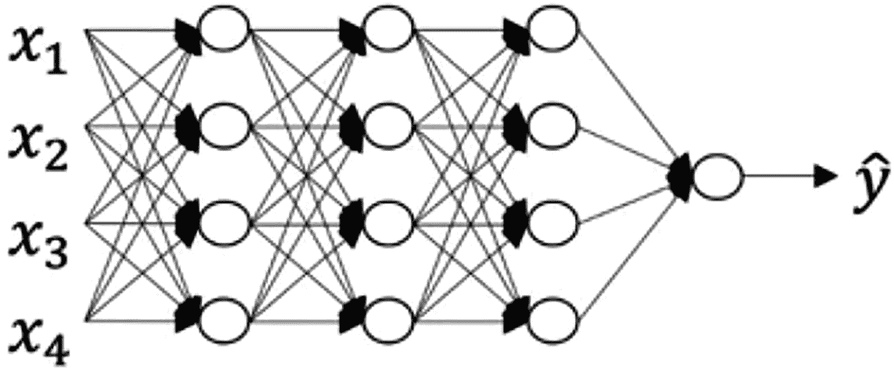
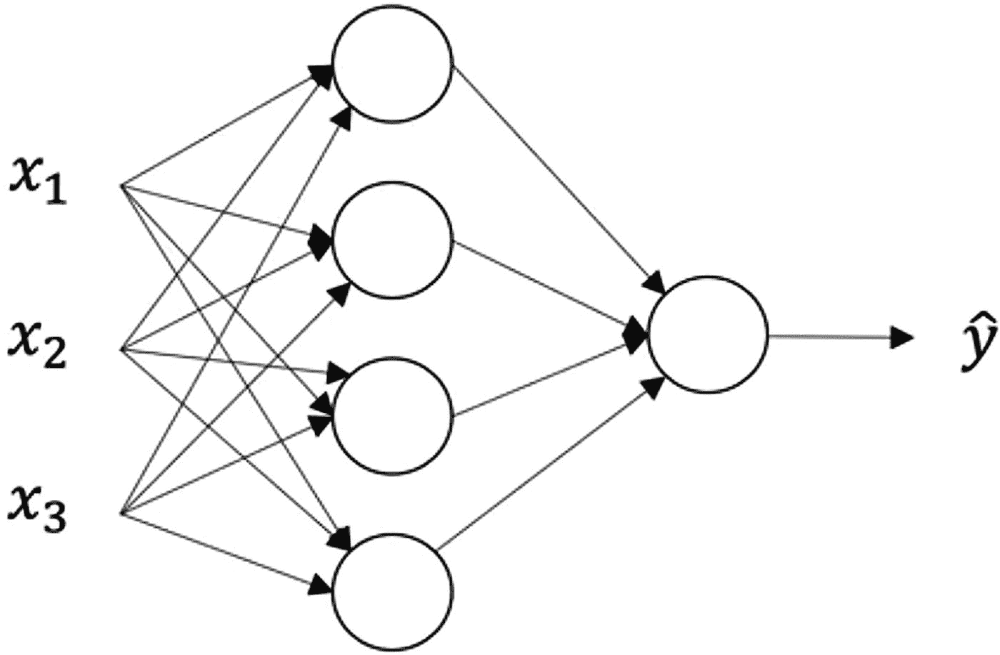
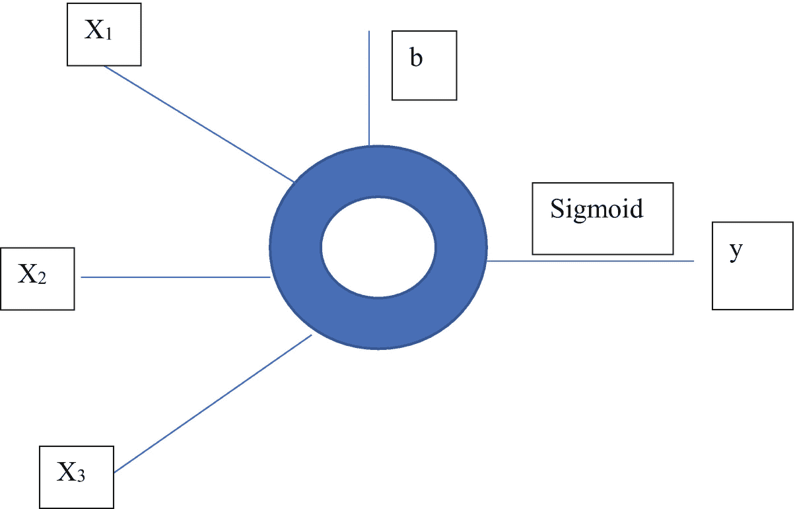

# 21. 神经网络与机器学习

上一章介绍了用于解决旅行商问题的通用算法实现。

本章将介绍神经网络与机器学习。我们将从零开始实现一个神经网络。

下一节，我们将概述机器学习与神经网络。

## 21.1 神经网络与机器学习概述

AI（人工智能）的根源可追溯到 1956 年在达特茅斯进行的研究，其目标是模拟人类的推理能力。

机器学习是人工智能的一个子领域。它利用统计学、运筹学和神经网络模型，从数据中获取洞见。它允许计算机（机器）通过一个迭代过程来获取洞见，该过程模拟了我们所认为的人类大脑学习新事物的方式。它使计算机能够无需明确编程即可学会执行复杂任务。

机器学习的应用包括自然语言处理（含语言翻译）、图像分类与分析、聊天机器人、医疗诊断、游戏博弈、模式识别以及股价预测。

机器学习从数据开始，通常需要海量数据。这些数据可能是数值时间序列、照片、文本、维修记录、银行交易、销售报告，或来自多种来源的传感器数据（气象数据、地震数据、医疗数据等）。

此类数据被用于“训练”一个计算机模型，例如神经网络。经过充分训练后，该模型基于从训练数据中习得的知识，用于执行分类、预测未来结果、在游戏中做出决策、提供文本翻译等。

### 训练

训练神经网络模型涉及将输入数据通过网络前向传播到一个或多个输出，并将输出中检测到的误差反向传播以修改网络，从而最小化这些误差。本章我们将详细研究这一重要过程。

### 神经网络

神经网络是函数逼近器。通过使用大量观测到的输入和相应输出训练这样的网络，其目标是当输入新数据时，能够获得可靠的输出。

例如，如果我们的目标是让网络区分一张狗的照片和一张猫的照片，我们通过输入大量猫和狗的图像来训练网络，每次告知网络该图像（一个由像素值组成的二维矩阵）是狗还是猫。然后，当输入网络从未见过的图像时，希望网络能够高精度地判断它是狗还是猫的图像。

这样一个经过训练的神经网络可以被视为一个数学函数，当输入给定数据时，它会产生某个输出（在此案例中是分类结果）。

一个神经网络通常包含：

1.  一组构成输入层的输入值
2.  一个或多个隐藏层
3.  一个包含输出值的输出层
4.  各层之间的一组权重和偏置
5.  每个层的激活函数

### 感知器

1943 年，神经生理学家沃伦·麦卡洛克和数学家沃尔特·皮茨定义了一个简单的神经元模型，该模型接收一组输入，将其乘以权重值并加上偏置值，然后通过一个激活函数，产生 0 或 1 的输出。这个模型被称为麦卡洛克-皮茨感知器。

该感知器的示意图如图 21-1 所示。



感知器神经网络感知的示意图。输入命名为 `l`，下标从 1 到 `N`。相同的连线具有权重，命名为 `w`，下标从 1 到 `N`。所有这些都指向求和运算，随后是阈值 `T` 和输出 `y`。

**图 21-1** 感知器

输出 `y` 是输入值乘以权重集 `W` 再加上偏置值 `b` 的总和，随后经过一个阈值函数，将该总和转换为 0 到 1 之间的值。

接下来，将期望值与实际值进行比较以形成误差。计算出的误差被反馈给权重，以修改权重来减小该误差。经过多次迭代，有望使误差变得非常小。

从输入和权重获得输出的过程称为前向传播。基于误差修改权重的过程称为反向传播。通过了解误差相对于每个权重的导数，可以实现一种递归下降算法，该算法在迭代修改权重的同时，不断减小输出误差。

通过将多个神经元堆叠成不同的层，就创建了一个神经网络。

### 神经网络示意图

两个这样的神经网络示意图如图 21-2 和 21-3 所示。第一个网络有一个包含四个神经元的“隐藏”层和一个单输出层。

第二个神经网络有三个层，每层包含四个神经元，由于层数较多，它是一个深度神经网络。



一个示意图。有四个 `x`，下标分别为 1、2、3 和 4。每个 `x` 有四条线指向四个圆圈，使得每个 `x` 的每条线都接触到所有四个圆圈。每个圆圈又有四条线指向另外四个不同的圆圈，相同的过程重复进行。所有圆圈都指向一个单独的圆圈，并指向 `y` 上标 caret。

**图 21-3** 具有多个隐藏层的神经网络



具有一个隐藏层的神经网络示意图。三个点标记为 `x`，下标分别为 1、2 和 3。每个 `x` 有四条线指向四个圆圈，使得每个 `x` 的每条线都接触到所有四个圆圈。每个圆圈指向一个单独的圆圈，并指向 `y` 上标 caret。

**图 21-2** 具有一个隐藏层的神经网络

### 神经元

我们进一步深入，研究神经网络中的单个神经元或节点。在图 21-4 中，我们展示了这样一个神经元。



神经网络中一个神经元的示意图。一个边缘高亮的圆圈。它有 5 条从它分支出来的线，分别命名为：`X` 下标 1、`X` 下标 2、`X` 下标 3、`b`，并且在写入 `y` 的线上写着 sigmoid。

**图 21-4** 一个神经元

输出 `y` 由输入 `x[1]`、`x[2]` 和 `x[3]` 按如下方式计算：

`z = w[1]x[1] + w[2]x[2] + w[3]x[3] + b`

然后，我们对此输入和偏置的线性组合应用非线性激活函数，例如 Sigmoid 函数，如下所示：

`y = sigmoid(z) = 1 / (1 + e^(-z))`

使用 Sigmoid 激活函数会强制结果在 0 到 1 之间，而 `z` 则从一个很大的负数变化到一个很大的正数。

下一节，我们将定义一个要解决的简单问题。


## 21.2 一个具体示例

假设我们希望构建并训练一个神经网络，用于判断某项诊断测试是否表明患者患有某种特定疾病。测试会给出两个数字 `x` 和 `y`，取值范围均在 0.0 到 1.0 之间。如果 `x`² `< y`，则测试结果为阴性；否则为阳性。我们用数字标签 `0` 表示阴性结果，用数字标签 `1` 表示阳性结果。

该神经网络将接收 150 个测试结果（每个结果包含一对数字，每个数字均在 0.0 到 1.0 之间）。神经网络的输出包含 150 个计算出的得分（每个得分在 0.0 到 1.0 之间），以及 150 个基于测试结果得出的正确标签（每个标签在 0.0 到 1.0 之间）。

通过这个示例，我们可以介绍神经网络建模与计算的方法论，并了解各个重要组成部分是如何协同工作的。

在下一节中，我们将从头构建一个神经网络来解决这个问题。

## 21.3 构建神经网络

我们将从头构建一个简单的神经网络，用于解决第 21.2 节中提出的问题。

我们定义一个权重矩阵。该权重矩阵的每一列表示从前一层所有神经元到当前层特定神经元的权重。

例如，值 `w[0][2]`、`w[1][2]`、`w[2][2]`、……、`w[n – 1][2]`（即权重矩阵的第三列）表示从前一层的 `n` 个神经元到当前层第 3 个神经元的权重。

我们将构建的神经网络包含：输入层 150 个节点（每个测试结果包含两个数字，对应一个节点）、隐藏层 25 个节点，以及输出层 150 个节点。

### 表示网络的矩阵

输入矩阵的维度为 `150 × 2`。该矩阵的每一行包含测试结果的数字 `x` 和 `y`。

连接输入层和隐藏层的权重矩阵的维度为 `2 × 25`。

连接隐藏层和输出层的权重矩阵的维度为 `25 × 1`。

神经网络的输出维度为 `150 × 1`。

在本示例中，我们将偏置设置为零。

一些示例输入和输出如下：

输入 1：`<0.42, 0.1>`（阳性测试，因为 `0.42`² `> 0.1`）

输入 2：`<0.6, 0.8>`（阴性测试，因为 `0.6`² `< 0.8`）

我们将通过为每次测试生成随机的 `x` 和 `y` 值（每个值介于 0.0 到 1.0 之间）来生成测试结果。

我们使用这 150 个测试结果来训练网络。然后，像之前一样，再随机生成 25 个全新的测试结果。接着，我们使用训练好的网络来预测这 25 个新测试中的每一个是阳性还是阴性，并统计错误情况。

下一节中，我们将介绍并解释一个用于分类诊断测试结果的神经网络的实现。

## 21.4 神经网络实现

在实现开始时，我们定义一些全局变量，并用 0 到 1 之间的随机值初始化所有权重。

```go
package main
import (
"fmt"
"math"
"math/rand"
"time"
)
var (
InputLayer  = 150
HiddenLayer = 25
OutputLayer = InputLayer
Inputs      = 2 // x 和 y 值
)
var weights1 [][]float64
var derivatives1 [][]float64
var weights2 [][]float64
var derivatives2 [][]float64
var input [][]float64
func InitializeWeights1() {
weights1 = make([][]float64, Inputs)
derivatives1 = make([][]float64, Inputs)
for row := 0; row < Inputs; row++ {
weights1[row] = make([]float64, HiddenLayer)
derivatives1[row] = make([]float64,
HiddenLayer)
}
for row := 0; row < Inputs; row++ {
for col := 0; col < HiddenLayer; col++ {
weights1[row][col] = rand.Float64()
}
}
}
func InitializeWeights2() {
weights2 = make([][]float64, HiddenLayer)
derivatives2 = make([][]float64, HiddenLayer)
for row := 0; row < HiddenLayer; row++ {
weights2[row] = make([]float64, 1)
derivatives2[row] = make([]float64,
OutputLayer)
}
for row := 0; row < HiddenLayer; row++ {
for col := 0; col < 1; col++ {
weights2[row][col] = rand.Float64()
}
}
}
```

`derivatives1` 和 `derivatives2` 矩阵将在后面解释。

接下来，我们来看两个函数：`trueOutput` 和 `cost`。

`trueOutput` 函数会评估 `a[0]`（表示 `x`）和 `a[1]`（表示 `y`），如果测试结果为阴性则返回 0，如果为阳性则返回 1。

`cost` 函数将神经网络 `output` 中第零列（唯一的一列）的值与正确值进行比较，对每个误差求平方，将所有误差相加，然后除以误差数量。

```go
func trueOutput(a []float64) float64 {
if a[0] * a[0] <= a[1] {
return 0.0
} else {
return 1.0
}
}
func cost(output [][]float64) float64 {
result := 0.0
for i := 0; i < InputLayer; i++ {
correctAnswer := trueOutput(input[i])
result += (output[i][0] - correctAnswer) * (output[i][0] - correctAnswer)
}
return result / float64(InputLayer)
}
```

函数 `dot`、`DotProduct` 和 `Sigmoid` 是支持函数，用于实现神经网络所需的矩阵运算。

```go
func dot(vector1 []float64, vector2 []float64) float64 {
if len(vector1) != len(vector2) {
panic("点积的向量维度不合法。")
}
result := 0.0
for i := 0; i < len(vector1); i++ {
result += vector1[i] * vector2[i]
}
return result
}
func DotProduct(matrix1, matrix2 [][]float64) (result [][]float64) {
rows1 := len(matrix1)
cols1 := len(matrix1[0])
rows2 := len(matrix2)
cols2 := len(matrix2[0])
if cols1 != rows2 {
panic("无法计算点积")
}
result = make([][]float64, rows1)
for row := 0; row < rows1; row++ {
result[row] = make([]float64, cols2)
}
for row := 0; row < rows1; row++ {
for col := 0; col < cols2; col++ {
column := []float64{}
for r := 0; r < cols1; r++ {
column = append(column,
matrix2[r][col])
}
result[row][col] = dot(matrix1[row],
column)
}
}
return result
}
func Sigmoid(matrix [][]float64) (result [][]float64) {
rows := len(matrix)
cols := len(matrix[0])
result = make([][]float64, rows)
for row := 0; row < rows; row++ {
result[row] = make([]float64, cols)
}
for row := 0; row < rows; row++ {
for col := 0; col < cols; col++ {
result[row][col] = 1.0 / (1.0 + math.Exp(-
matrix[row][col]))
}
}
return result
}
```

这些函数在 `FeedForward` 函数中用到，该函数将神经网络的输入转换为其输出。

```go
func FeedForward() [][]float64 {
hidden := Sigmoid(DotProduct(input, weights1))
output := Sigmoid(DotProduct(hidden, weights2))
return output
}
```

我们可以看到，通过计算 `input` 矩阵与 `weights1` 矩阵的点积，然后再对得到的 `hidden` 矩阵与 `weights2` 矩阵进行点积运算，我们就能得到输出矩阵。

`Sigmoid` 激活函数确保所有值都被缩放到 0 到 1 之间。


到目前为止，我们已经考察了网络的输入（一个包含 150 个测试结果的矩阵，每个测试有两个实数）如何产生 150 个输出。

神经网络的奇妙之处在于训练网络的过程。这意味着要对权重矩阵（本例中的`weights1`和`weights2`）进行修改，以降低计算输出与正确结果之间的均方误差（即`cost`成本）。

实现这一目标的过程被称为**反向传播**。

与**反向传播**相关的数学计算是复杂的。例如，请参阅`https://hmkcode.com/ai/backpropagation-step-by-step/`。

反向传播涉及对成本关于众多权重中的每一个求偏导数。这些偏导数中的每一个都描述了如果对某个特定权重进行微小改变，成本将如何增加或减少。如果我们知道每个权重的偏导数，就可以修改每个权重，目标是降低均方误差（成本）。偏导数将指明所需权重修改的方向和幅度。

由于本章旨在介绍神经网络的机制，我们将通过经验性地估算偏导数来绕过数学计算。为此付出的代价是性能。在反向传播的每次迭代中，我们需要评估改变每个权重对网络输出整体成本的影响。

### 估算成本关于每个权重的偏导数

对于`weights1`和`weights2`中的每个权重，我们给该权重加上 0.01 或任何其他一个微小量。我们计算进行此更改后网络的输出及其成本。成本关于该权重的偏导数是权重的调整所导致的成本变化量与权重变化量之比。如果比值为正，我们将这个正的偏导数保存在一个与权重矩阵维度相同的单独矩阵中。如果比值为负，我们改变比值的符号，并将其保存在单独的偏导数矩阵中。

估算并保存所有偏导数后，我们根据偏导数的值修改整个`weights1`和`weights2`矩阵。这代表了网络训练的第一次迭代。

下面的`ComputeDerivatives`函数执行偏导数的估算：

```
func ComputeDerivatives() {
// 估算成本关于每个权重的偏导数
for row := 0; row < Inputs; row++ {
for col := 0; col < HiddenLayer; col++ {
output1 := FeedForward()
c1 := cost(output1)
weights1[row][col] += .01
output2 := FeedForward()
c2 := cost(output2)
weights1[row][col] -= .01
derivatives1[row][col] = (c2 - c1) / .01
weights2[col][0] += .01
output3 := FeedForward()
c3 := cost(output3)
weights2[col][0] -= .01
derivatives2[col][0] = (c3 - c1) / .01
}
}
}
```

如下所示，`BackPropagate`函数根据导数矩阵中的值改变每个权重。

```
func BackPropagate() {
ComputeDerivatives()
// 修改 weights1 和 weights2
for row := 0; row < Inputs; row++ {
for col := 0; col < HiddenLayer; col++ {
weights1[row][col] -=
derivatives1[row][col]
}
}
for row := 0; row < HiddenLayer; row++ {
for col := 0; col < 1; col++ {
weights2[row][col] -=
derivatives2[row][col]
}
}
}
```

最后，`Train()`函数迭代地修改权重，目标是降低成本。

```
func Train() {
for epoch := 1; epoch < 1500; epoch++ {
output := FeedForward()
fmt.Println("cost = ", cost(output))
BackPropagate()
}
}
```

我们在清单 21-1 中将所有部分整合在一起，包括一个主驱动函数，该函数为神经网络构建输入，训练网络，并在训练完成后对新数据输出结果。

```
package main

import (
"fmt"
"math"
"math/rand"
"time"
)

var (
InputLayer  = 150
HiddenLayer = 25
OutputLayer = InputLayer
Inputs      = 2 // x 和 y 值
)

var weights1 [][]float64
var derivatives1 [][]float64
var weights2 [][]float64
var derivatives2 [][]float64
var input [][]float64

func InitializeWeights1() {
weights1 = make([][]float64, Inputs)
derivatives1 = make([][]float64, Inputs)
for row := 0; row < Inputs; row++ {
weights1[row] = make([]float64, HiddenLayer)
derivatives1[row] = make([]float64, HiddenLayer)
for col := 0; col < HiddenLayer; col++ {
weights1[row][col] =
rand.Float64() * (1 - -1) + -1
}
}
}

func InitializeWeights2() {
weights2 = make([][]float64, HiddenLayer)
derivatives2 = make([][]float64, HiddenLayer)
for row := 0; row < HiddenLayer; row++ {
weights2[row] = make([]float64, 1)
derivatives2[row] = make([]float64, 1)
weights2[row][0] = rand.Float64() * (1 - -1) + -1
}
}

func Sigmoid(x float64) float64 {
return 1.0 / (1.0 + math.Exp(-x))
}

func FeedForward() [][]float64 {
output := make([][]float64, InputLayer)
hidden := make([][]float64, InputLayer)
for row := 0; row < InputLayer; row++ {
hidden[row] = make([]float64, HiddenLayer)
for col := 0; col < HiddenLayer; col++ {
sum := 0.0
for i := 0; i < Inputs; i++ {
sum += input[row][i] *
weights1[i][col]
}
hidden[row][col] = Sigmoid(sum)
}
}
for row := 0; row < InputLayer; row++ {
output[row] = make([]float64, 1)
sum := 0.0
for i := 0; i < HiddenLayer; i++ {
sum += hidden[row][i] *
weights2[i][0]
}
output[row][0] = Sigmoid(sum)
}
return output
}

func cost(output [][]float64) float64 {
sum := 0.0
for i := 0; i < InputLayer; i++ {
sum += (output[i][0] -
trueOutput(input[i])) *
(output[i][0] -
trueOutput(input[i]))
}
return sum / float64(InputLayer)
}

func trueOutput(input []float64) float64 {
if input[0]*input[0]+
input[1]*input[1] > 0.25 {
return 1.0
} else {
return 0.0
}
}
```

下一节将展示该网络的输出。

## 21.5 神经网络输出

输出量很大。`Train`函数执行 1500 个周期，每个周期涉及一次前向计算和一次反向计算来训练网络。并且每次迭代都会输出当前的均方误差`cost`。观察这些`cost`的演变，并看到它们如何随着网络的训练而减少，这既有趣又重要。

出于篇幅考虑，仅展示部分输出。值得注意的是对 25 个新输入进行测试的结果。如果我们认为输出大于 0.5 为正，小于 0.5 为负，那么这些新输入的结果表明神经网络的准确率达到 100%。


```
cost =  0.6637402659161185
cost =  0.6636630956218156
cost =  0.6635817634090139
cost =  0.6634959251095335
cost =  0.6634051977180305
cost =  0.6633091537786991
cost =  0.6632073147732753
cost =  0.663099143297417
cost =  0.6629840337592922
cost =  0.6628613012653831
cost =  0.6627301682691753
cost =  0.6625897484413662
cost =  0.6624390270658043
cost =  0.6622768370596327
cost =  0.6621018294396175
cost =  0.6619124366814639
cost =  0.6617068269041807
cost =  0.6614828460975539
cost =  0.6612379446084452
cost =  0.6609690826757143
cost =  0.660672607747008
cost =  0.660344093298625
cost =  0.6599781243955765
...
cost =  0.5811888364173224
cost =  0.5117698491474624
cost =  0.3431174223399081
cost =  0.22278592696925442
cost =  0.22219689682890306
cost =  0.22164595119640423
cost =  0.22109565104100137
cost =  0.22054536159623406
cost =  0.21999484909425368
cost =  0.21944389274059498
cost =  0.21889227410423057
cost =  0.2183397768384557
cost =  0.21778618670317892
cost =  0.21723129159816149
cost =  0.21667488160010032
cost =  0.21611674900371572
cost =  0.21555668836712247
cost =  0.21499449656177205
cost =  0.21442997282722046
cost =  0.21386291883096756
cost =  0.21329313873359648
cost =  0.21272043925942305
cost =  0.21214462977284917
cost =  0.21156552236059478
cost =  0.21098293191996614
cost =  0.2103966762532983
cost =  0.209806576168689
...
cost =  0.14066304727899404
cost =  0.1397261098810677
cost =  0.138792748311244
cost =  0.13786318684860793
cost =  0.13693764327438454
cost =  0.1360163286396859
cost =  0.13509944705792176
cost =  0.1341871955218915
cost =  0.13327976374542316
cost =  0.13237733402931087
cost =  0.13148008115118084
cost =  0.13058817227880457
cost =  0.1297017669062738
cost =  0.12882101681236946
cost =  0.1279460660403555
cost =  0.12707705089837232
cost =  0.1262140999795274
cost =  0.1253573342007353
cost =  0.12450686685930376
cost =  0.12366280370623699
cost =  0.12282524303519099
cost =  0.121994275786003
cost =  0.12116998566170542
cost =  0.12035244925792699
cost =  0.1195417362035959
cost =  0.11873790931186408
cost =  0.117941024740192
cost =  0.1171511321585531
cost =  0.11636827492474516
cost =  0.11559249026582975
cost =  0.11482380946475092
cost =  0.11406225805122268
...
cost =  0.016816878951632613
cost =  0.01680969687113106
cost =  0.016802523693735683
cost =  0.0167953594016083
cost =  0.01678820397696063
cost =  0.01678105740205403
cost =  0.016773919659199398
cost =  0.016766790730756983
cost =  0.016759670599136158
cost =  0.01675255924679531
cost =  0.01674545665624165
cost =  0.016738362810030993
cost =  0.016731277690767675
cost =  0.016724201281104255
计算值：0.991841  正确答案 = 1.000000  估算正确：true
计算值：0.001271  正确答案 = 0.000000  估算正确：true
计算值：0.025702  正确答案 = 0.000000  估算正确：true
计算值：0.998475  正确答案 = 1.000000  估算正确：true
计算值：0.958112  正确答案 = 1.000000  估算正确：true
计算值：0.021453  正确答案 = 0.000000  估算正确：true
计算值：0.000903  正确答案 = 0.000000  估算正确：true
计算值：0.963236  正确答案 = 1.000000  估算正确：true
计算值：0.854382  正确答案 = 1.000000  估算正确：true
计算值：0.115060  正确答案 = 0.000000  估算正确：true
计算值：0.528623  正确答案 = 1.000000  估算正确：true
计算值：0.996182  正确答案 = 1.000000  估算正确：true
计算值：0.000672  正确答案 = 0.000000  估算正确：true
计算值：0.168254  正确答案 = 0.000000  估算正确：true
计算值：0.525666  正确答案 = 1.000000  估算正确：true
计算值：0.004078  正确答案 = 0.000000  估算正确：true
计算值：0.000913  正确答案 = 0.000000  估算正确：true
计算值：0.000013  正确答案 = 0.000000  估算正确：true
计算值：0.549601  正确答案 = 0.000000  估算正确：true
计算值：0.000007  正确答案 = 0.000000  估算正确：true
计算值：0.926115  正确答案 = 1.000000  估算正确：true
计算值：0.292149  正确答案 = 0.000000  估算正确：true
计算值：0.000013  正确答案 = 0.000000  估算正确：true
计算值：0.000048  正确答案 = 0.000000  估算正确：true
计算值：0.882903  正确答案 = 1.000000  估算正确：true
```

以粗体显示的结果表明，神经网络生成了**100%** 正确的输出。对于一个从零开始构建，且无需进行与反向传播相关的复杂偏导数计算的网络而言，这个成绩相当不错。

## 总结

我们从头构建了一个相对简单的神经网络，其含有一个包含 25 个节点的隐藏层。该网络使用 150 对诊断测试结果及其对应的已知正确结果标签进行训练，训练轮次为 1500 次。随后，用 25 个不在原始训练集中的全新测试结果对网络进行测试。测试结果令人鼓舞。均方误差随着训练的推进逐渐减小至一个很小的数值。所有 25 个测试结果均得出了正确结论。

好的，作为高级文档工程师和翻译员，我将严格按照您的注意事项和示例，将给定的英文文本翻译成中文。


