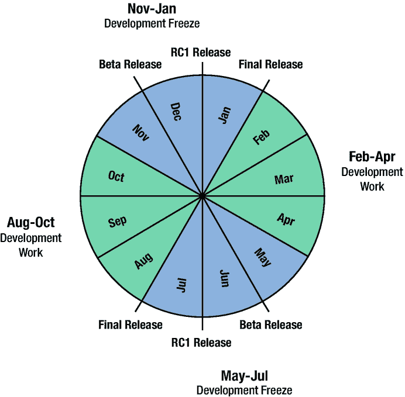

# 一、简单看一下 Go 和 Java

Java 和 Go 有很多明显和细微的区别。它们可以作为语言和运行时来比较。这项调查主要集中在语言比较上。它旨在提供一个粗略的比较。更深入的比较贯穿全文。

本章中的一些文字可能会被解读为贬低 Go。这不是我们的意图。Go 是一种强大的语言，它可以轻松地与 Java 抗衡。但是 Java 确实有 Go 没有的特性，稍后会对它们进行总结。

请注意，这里的描述可能需要更深入地了解到目前为止已经介绍过的 Go 知识，以便全面理解。在本文后面的内容中，当你对 Go 更加熟悉之后，你可能会想重温这一章。

Go 语言及其相关的运行时与 Java 语言及其相关的 *Java 运行时环境* (JRE)既有许多相似之处，也有许多不同之处。本章将试图在较高的层次上对它们进行总结。这些相似点和不同点将在本文后面详细讨论。

Go 和 Java 都是*图灵完全* [1](#Fn1) 环境，这意味着(几乎)任何可能的程序都可以在其中任何一个环境中编写。这只是花费的相对开发努力和产生的程序大小和性能的问题。

应该注意的是，Go 语言和 Go 开发经验更接近于 C 语言，而不是 Java 语言。Go 语言的风格和语义比 Java 更像 C 语言。标准的 Go 库也更类似于 c 语言自带的库。

与 C 语言相比的一个例外是 Go 程序构建经验。在 C 中，这通常由 *Make* [2](#Fn2) (或一个变体)实用程序驱动。在 Go 中，它由 Go *构建器*工具驱动。在作者看来，Go 方法更优越，更容易使用(不需要 make 文件)。

注意一些 Go 开发人员使用 make file-like 方法，特别是在复杂的项目中，这些项目不仅仅将 Go 源文件作为组件，因此还需要构建其他工件。Make 文件通常用于编写超出 Go builder 能力范围的多步骤流程。这类似于在 Java 中使用 Ant [3](#Fn3) 或者 Maven [4](#Fn4) 。

## Go 是一种编译型语言(而 Java 是解释型语言)

像 C 和 C++一样，Go 程序在执行开始前就已经完全构建好了。所有源代码都被编译成目标计算机体系结构的机器语言。此外，所有代码都被编译到目标操作系统。相比之下，Java 被编译成虚拟机语言(又名*字节码*)，并由 Java 虚拟机(JVM)解释。为了提高性能，字节码通常在运行时动态编译成机器语言。JVM 本身是为特定的操作系统和硬件架构而构建的。

一旦建立起来，Go 程序只需要一个操作系统就能运行。此外，Java 程序需要在运行之前，在计算机上存在一个 JRE(所需版本的)。许多 Java 程序可能还需要额外的第三方代码。

Go 方法通常会导致更快的程序启动和更自包含的程序，这两者都使它更适合于容器化的部署。

## Go 和 Java 共享相似的程序结构

两种语言都支持包含方法和字段的数据结构的概念。在 Go 中，它们被称为*结构*，而在 Java 中，它们被称为*类*。这些结构被收集到称为*包*的分组中。在这两种语言中，包可以分层排列(即，具有嵌套包)。

Java 包只包含类型声明。Go 包可以包含基本声明，如变量、常量、函数以及派生类型声明。

两种语言都通过导入不同包中的代码来访问它们。在 Java 中，可以选择使用非限定的导入类型(`String` vs. `java.lang.String`)。在 Go 中，所有导入的名字都必须是限定的。

## Go 和 Java 在代码风格上有一些差异，这些差异会影响代码的结构

*   Java 声明把类型放在第一位，而在 Go 中，类型放在最后。例如:

    Java—`int x, y z;`

    go-`var x, y, z int`

*   Java 方法只能返回一个值。Go 函数可以返回许多值。

*   Java 方法和字段必须在它们所属的类型中声明。Go 方法是在所属类型之外定义的。Go 支持独立于任何类型的函数和变量。Java 没有真正的静态共享变量；静态字段只是某个类的字段(相对于实例)。Go 支持在可执行映像中分配的真正的静态(全局)变量。

*   Go 有全闭包(可以捕获可变数据)，而 Java 只支持部分闭包(只能捕获不可变数据)。这可以让 Go 中的一流功能更加强大。

*   Go 缺少用户定义的泛型类型。一些内置类型(例如切片和贴图)是通用的。Java 支持任何引用类型的泛型类型。

    注意，有一个已获批准的建议，即在将来添加泛型类型。

*   Java 只允许其他类型(类、枚举和接口)的类型扩展，而 Go 可以在任何现有类型的基础上创建新类型，包括基本类型(如整数和浮点)和其他用户定义的类型。Go 可以支持这些自定义类型的方法。

*   Go 和 Java 接口的工作方式非常不同。在 Java 中，一个类(或枚举)必须显式地实现一个接口，如果它是通过那个接口被使用(方法调用)的话。在 Go 中，任何类型都可以简单地通过实现接口的方法来实现该接口；不需要声明实现接口的意图，这只是方法存在的副作用。Java 中的许多标准(继承的)行为(如`toString()`方法)在 Go 中由实现公共接口的类型提供(相当于`Stringer`接口的`String()`方法)。

## Go 和 Java 都是过程语言

命令式程序是那些通过随时间显式改变状态并测试该状态来工作的程序。它们直接反映了无处不在的*冯·诺依曼*计算机架构。过程程序是命令式程序，由*过程*(也就是 Go 中的函数和 Java 中的方法)组成。每种语言都提供了过程语言的以下主要功能:

*   可以执行表达式，通常带有变量赋值。

*   可以执行一系列(0+)语句(通常称为基本块)。

*   通常，一条语句也可以隐式地充当一个块。

*   可以在代码流中创建单向(`if`)、双向(`if/else`)或 n 向(`if/else if/else`、`switch`)条件分支。

*   可以循环语句。

*   Java 有`while`、`do`、`for`语句；Go 将它们全部组合成仅仅`for`。

*   可以定义可以从多个位置调用的可重用代码。

*   Java 有方法；Go 有函数，有些是方法。

所有的 [6](#Fn6) 程序都可以只用这些结构来编写。

## Java 是一种面向对象的语言，而 Go 并不完全是面向对象的

和所有面向对象语言一样，Java 是一种基于类的语言。所有代码(方法)和数据(字段)都封装在某个类实现中。Java 类支持继承，因为它们可以扩展一个超类(从`Object`开始)。Go 允许组合(一个结构可以嵌入到另一个结构中)，这通常可以获得继承的一些代码重用好处，但不是全部。

Java 提供了对方法和字段封装的完全控制(通过可见性:public/protected/package private/private)。Go 不提供所有这些选项。Go 结构在拥有字段和关联方法方面与类相似，但是它们不支持子类化。此外，Go 只支持等同于公共和包私有的可见性。

在 Java 中，类和接口都支持多态方法调度。在 Go 中，只有接口做多态方法调度。Go 没有抽象基类的等价物。同样，合成可以提供这个特性的一个子集。

注:尽管 Java 通常被认为是面向对象的，但它并不是面向对象编程风格的完美例子。例如，它有原始数据类型。但是这篇文章并不是要批评 Java 的设计。

## Java 是一种高度函数化的语言，Go 则不然

Java，从版本 8 开始，已经很好的支持*函数式编程* (FP)。FP 仅使用具有本地数据的函数进行编程；不存在全局的和可变的状态。Java 支持创建一级函数文字(称为 *Lambdas* )并将它们传递给其他要调用的代码。Java 还允许外部(或显式)循环(`while`、`for`等)。)将被内部循环(在方法内部)替换。例如，Java *流*支持提供了这一点。

Go 也有一级函数文字，但是缺少对内部循环的类似支持；循环通常是外部的。一级函数提供类似 lambda 的函数，通常是以一种优越的方式。缺少内部循环被认为是 Go 的一个优点，因为它能产生更明显的代码。

Java FP 支持强烈依赖于泛型类型。目前 Go 缺少这些。

## Java 是一种高度声明性的语言，而 Go 则不是

通过*注释*和流等特性的组合，Java 代码可以用*声明式*风格编写。这意味着代码说明了要做什么，但没有明确说明如何做。运行库将声明转换为实现预期结果的行为。Go 并不提倡对等的编程风格；必须编写代码来明确说明如何实现一个行为。因此，Go 代码更明显，但有时比典型的 Java 代码更大、更重复。

## 许多 Java 特性是注释驱动的

很多 Java 库(尤其是那些叫框架的)，比如 *Spring* ，都大量使用了 Java 的注释。注释提供元数据，通常在运行时使用，以修改库提供的行为。Go 没有注释，所以缺少这个功能。因此，Go 代码通常更加明确；这被普遍认为是一种美德。Go 可以使用代码生成来获得与注释类似的结果。Go 有一种简单的注释形式，叫做*标签*，可以用来定制一些库行为，比如 JSON 或 XML 格式。

注释的使用可以将配置决策绑定到源代码。有时，这是一个缺点，因为决策需要延迟到运行时。在这种情况下，Go 和 Java 通常使用类似的方法(比如命令行或配置文件参数)。

### Go 不支持异常

Java 有*异常*(实际上是*抛出的*异常或错误),可以被引发来报告异常情况。异常的使用在 Java 中非常普遍，经常被用来报告可预测和不可预测的失败。由于来自方法的值很少，因此返回错误。

Go 对这些角色做了更强的分离。所有失败都由函数返回值报告，调用方必须显式测试这些返回值。这样做很好，因为 Go 函数可以更容易地返回多个值，比如一个结果和一个错误。

Go 有*死机*，其作用类似于 Java 错误。它们被饲养的频率要低得多。与 Java 不同，紧急值不是类型的层次结构，只是开发者选择的值的包装，但通常是`error`类型的实例。永远不要声明函数可能引发的异常值的类型(也就是说，没有与 Java 的`throws`子句等价的语句)。这通常意味着代码不那么冗长。许多 Java 代码遵循这种模式，只抛出不需要声明的`RuntimeException`实例。

## Java 和 Go 都使用托管内存(垃圾收集器)

两种语言都使用堆栈和堆来保存数据。栈主要用于函数局部变量，堆用于其他动态创建的数据。在 Java 中，所有对象都是在堆上分配的。在 Go 中，只有可以在函数的生存期之外使用的数据才被分配到堆上。在 Java 和 Go 中，堆都是垃圾回收的；堆对象由代码显式分配，但总是由垃圾收集器回收。

Java 没有指向对象的指针的概念，只有指向位于堆中的对象的引用。Go 允许访问指向任何数据值的指针(或地址)。大多数情况下，Go 的指针可以像 Java 引用一样使用。

Go 的垃圾回收实现比 Java 简单。与 Java 不同，有几个选项可以对它进行调优，它就是工作。

## Go 和 Java 都支持并发，但方式不同

Java 有*线程*的概念，线程是由库提供的执行路径。Go 有 *Goroutines* (GRs)的概念，是语言本身提供的执行路径。GRs 可以被视为轻量级线程。Go 运行时可以支持使用比 JRE 所能支持的线程更多的(数千个)gr。

Java 支持语言中的同步控件。Go 有类似的库函数。Go 和 Java 都支持可以跨线程/gr 安全更新的原子值的概念。两者都支持显式锁定库。

Go 提供了*通信顺序进程* (CSP)的概念，作为 GRs 在没有显式同步和锁定的情况下进行交互的主要方式。相反，gr 通过*通道*进行通信，这些通道实际上是与`select`语句相结合的管道(FIFO 队列)来查询它们。

本文后面将讨论并发方法的其他不同之处。GRs 和线程通常以不同的方式管理，在它们之间传递状态也是如此。

## Go 的运行时比 JRE 简单

Go 的运行时比 JRE 提供的要小得多。虽然没有 JVM 的等价物，但是两者都有类似的组件，比如垃圾收集。Go 没有字节码解释器。

Go 有一大套标准库。Go 社区提供了更多。但是 Java 标准和社区库在功能的广度和深度上都远远超过了当前的 Go 库。尽管如此，Go 库足够丰富，可以开发许多有用的应用程序，尤其是应用服务器。

所有使用过的库(仅此而已)都嵌入到 Go 可执行文件中。可执行文件是运行程序所需的一切。Java 库在第一次使用时动态加载。这使得 Go 程序二进制文件(作为文件)通常比 Java 二进制文件(单个“主”类)大，但是当加载 JVM 和所有依赖类时，Java 的总内存占用通常更大。

随着 Java 的解释，动态创建字节码，然后执行它是可能的。这可以通过在运行时编写字节码或动态加载预先编写的字节码(即类)来完成。这带来了极大的灵活性。Go 是预构建的，不能这样做。

## Go 程序的构建过程是不同的

Java 程序是在运行时构建的类的组合，通常来自多个来源(供应商)。这使得 Java 程序非常灵活，尤其是通过网络下载时，这是 Java 的一个主要用例。Go 程序是在执行之前静态构建的。启动时，所有代码都在可执行映像中。这以牺牲一些灵活性为代价提供了更大的完整性和可预测性。这使得 Go 更适合容器化部署。

Go 程序通常由“go builder”构建，该工具结合了编译器、依赖性管理器、链接器和可执行构建器工具等。它包含在标准 Go 安装中。Java 类被单独编译(通过 *javac* 工具，由*Java 开发工具包* (JDK)提供)，然后通常被组装成保存相关类的档案(JAR/WAR)。程序从这些档案中的一个或多个加载。档案的创建，尤其是包括任何依赖关系，通常是由独立于标准 JRE 的程序(例如， *Maven* )来完成的。

## Go 和 Java 有相似的发布周期

Go 对 1.xx 版本采用了两年一次的发布周期 [7](#Fn7) 。图 [1-1](#Fig1) 对此做了最好的总结(来自 Go 网站)。

图 1-1

两年一次的发布周期

Go 团队支持后两个版本。

Java 为 1.xx 版本采用了类似的两年周期 [8](#Fn8) 。Java 有一个额外的概念*长期支持* (LTS)版本。在提供下一个版本(无论是否是 LTS 版本)之前，将支持非 LTS 版本；至少在下一个 LTS 发布之前，LTS 版本是受支持的。LTS 经常每 18-24 个月来一次。Java 也有*实验性*特性的概念，这些特性已经发布，但在未来的版本中会有变化(或撤销);它们提供了未来支持的预览。Go 的这种功能较少，但是，例如，类属类型特征可以用类似的方式预览。

<aside aria-label="Footnotes" class="FootnoteSection" epub:type="footnotes">Footnotes [1](#Fn1_source)

艾伦·图灵描述了一个通用计算引擎，现在被称为图灵机，可以计算任何可能的计算。任何可以用来创建图灵机的编程语言都被称为“图灵全集”

  [2](#Fn2_source)

[T2`https://en.wikipedia.org/wiki/Make_(software)`](https://en.wikipedia.org/wiki/Make_%2528software%2529)

  [3](#Fn3_source)

[T2`https://en.wikipedia.org/wiki/Apache_Ant`](https://en.wikipedia.org/wiki/Apache_Ant)

  [4](#Fn4_source)

[T2`https://en.wikipedia.org/wiki/Apache_Maven`](https://en.wikipedia.org/wiki/Apache_Maven)

  [5](#Fn5_source)

[T2`https://en.wikipedia.org/wiki/Von_Neumann_architecture`](https://en.wikipedia.org/wiki/Von_Neumann_architecture)

  [6](#Fn6_source)

[T2`https://en.wikipedia.org/wiki/Structured_programming#Elements`](https://en.wikipedia.org/wiki/Structured_programming%2523Elements)

  [7](#Fn7_source)

[T2`https://github.com/golang/go/wiki/Go-Release-Cycle`](https://github.com/golang/go/wiki/Go-Release-Cycle)

  [8](#Fn8_source)

[T2`https://dzone.com/articles/welcoming-the-new-era-of-java`](https://dzone.com/articles/welcoming-the-new-era-of-java)

 </aside>