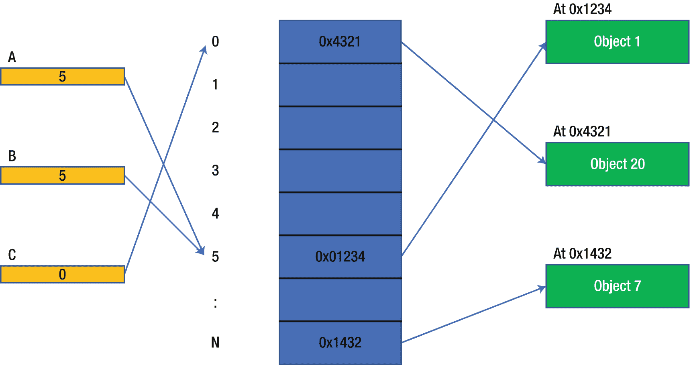
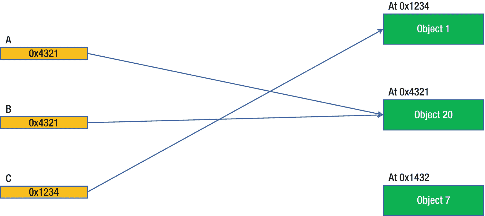

# 六、Go 类型

在这一章中，我们将深入探讨 Go 的类型系统，以及它与 Java 的类型系统有何不同。读完这一章后，你应该能够清楚地识别 Go 和 Java 类型系统之间的相似和不同之处。

## 原始/内置类型

Java 和 Go 有相似的原语类型。在 Java 中，基本类型不能放在集合中(数组除外)。这与引用类型有很大的不同。此外，基本类型不能有方法。基本类型的概念在 Go 中意义不大，因为任何类型都可以是集合的元素，任何派生类型都可以有方法。

像 Java 中一样，Go 布尔类型是最简单的类型。它只有`true`和`false`作为值。

两种语言都将字符、有符号整数和浮点类型作为数字类型。Go 将无符号整数和`complex`数字相加。

Go 还有一个指针(有点像 Java 引用)类型。两种语言都有一个`null`(在 Go 中称为`nil`)值。在 Go 中，指针可以转换成无符号整数，反之亦然。这种用例并不常见，因此不在本文中讨论。大多数情况下，这样做是为了与用 C 语言编写的代码(也称为 CGo)接口。

### 民数记

内置数值类型:

*   有符号整数类型—`int8`、`int16`、`int32`(又名`rune`)、`int64`、`int`

*   无符号整数类型—`uint8`(又名`byte`)、`uint16`、`uint32`、`uint64`、`uint`

*   浮动类型—`float32`、`float64`

*   复杂类型(如`real`和`imag`对)–`complex64`、`complex128`

后缀数字(如果有)是该值的位数。

非内置数值类型:

*   大整数—`Int`

*   大浮动—`Float`

*   有理-`Rat`(两个`int64`值的)

注意，Java 有一组库函数使用它的有符号整数来模拟无符号整数；Go 方法更好。Go 没有大十进制类型。

像在 Java 中一样，数字文字值可能有一个基本前缀:

*   0b，0B–二进制，数字:0，1

*   0o，0O–八进制，数字:0，1，2，3，4，5，6，7

*   0x，0X–十六进制，数字:0，1，2，3，4，5，6，7，8，9，A，B，C，D，E，F(或 A，B，C，D，E，F)

像在 Java 中一样，数值可以在数字之间包含下划线(“_”)。像 Java 一样，如果一个数以“0”开头，并且没有基数指示符，那么它就是八进制的。

浮点数添加一个可选分数(" .“引入者”)和/或可选的带符号十进制指数(十进制数用“E”或“E”引入者，十六进制数用“P”或“P”引入者，很少使用 P 指数)。

与 Java 不同，数字文字没有大小指示符或值限制。

像在 C 中一样，Go 增加了对架构敏感的类型(基于架构的 32 位或 64 位字长的整数和指针)。Java 显式地隐藏了依赖于架构的数字特征。

Go 添加了带有虚文字量的复杂浮点类型，虚文字量是以“I”为后缀的任何数字文字量。Go 不支持复数的极坐标表示法。

Go 使用不确定精度的无类型数值。这些文字被自动转换为表达式或初始化所需的类型。Java 数字文字有特定的类型(`short`、`int`等)。)后缀。

### 字符和字符串

Go 的内置字符称为 Rune，是有符号的 32 位(`int32` ) Unicode 整数。Java 使用名为`char`的无符号 16 位 Unicode 整数，其中较大的字符需要`char`对(充其量是笨拙的)。两者都被视为整数数值。

Go 有一个内置的`string`类型，它本质上是一个由`byte`值组成的数组(`byte`是`uint8`的同义词)，预期用 UTF-8 格式表示一个 0+字符的字符串。Java 有一个*字符串* (JRE 库)类型，本质上是一个 Java `char`数组。Java 和 Go 字符串都是不可变的。

Go 字符串的长度是字符串中的字节数(不是字符数)，而在 Java 中，字符串的长度是`char`值的个数。注意如果使用 ASCII 编码，字符和字节是同义的。字符串可以被索引到它们的长度来提取字符。将它们作为字节进行索引时必须小心，因为它们可能包含 UTF-8(多字节)字符。处理符文的帮助见`scanner`包。

例如:

```go
s := "Hello World"
firstByte, hello, world, copy, lenS :=
      s[0], s[:5], s[6:], s[:], len(s)

```

很像 Java 的`charAt()`方法，单索引表达式是`[index]`。

字符串是不可变的，因此如下表达式是非法的:

```go
s[0] = 'a'

```

很像 Java 的`substring`方法，范围索引表达式是`[{start}:{end+1}]`；缺少开始= = 0；缺少的 end == length。

Go 也有一个类似于字符串的 byte *slice* 类型，但不一定会出现在 UTF-8 中。如果所有字节都是 ASCII 码，则可以将其视为一个字符串。

所有的数字和字符串类型都可以比较(==，`!=`，`>`，`>=`，`<`，`<=`)。字符串就像字节数组一样进行比较。

注意字符串不能是`nil`(但是指向字符串的指针可以是)。将`nil`值赋给任何字符串变量都是不合法的。使用`len(s)`功能(vs. `s == ""`)测试空字符串。

注意大多数在 Java 中被视为静态或`String`(或`StringBuilder/Buffer`)类的实例方法的函数都被定义为 Go `fmt`、`strings`或`strconv`包中的函数。

### 引用与指针类型

Java 基本上有两类可变数据:

1.  原始值–数字和布尔值

2.  引用(或对象)–一个值，它是对象实例或`null`的定位器

    对象总是在堆中分配。

Go 也有类似的分类:

1.  任何(非指针)类型的值

2.  指针–是另一个值的地址的值，包括另一个指针，或`nil`

    通常，由指针定位的数据值通常在堆中分配。

注:接口类型的变量可以像值或指针一样工作。

一个 Java 引用选择了某个对象(或者如果`null`没有选择任何对象)。引用是如何实现的取决于 JVM，但是可以如图 [6-1](#Fig1) 所示实现，其中每个引用是一个指向对象的指针数组的索引。变量(A、B 和 C)在左边。参考索引表在中间。被引用的对象在右边。这种方法使垃圾收集变得容易，因为当删除未使用的对象并将剩余的对象压缩到内存中时，只需要更新索引表。请注意，同一索引可以有多个引用；这就产生了别名。



图 6-1

可能的 Java 参考实现

在 Go 中，如图 [6-2](#Fig2) 所示，指针是对数据的直接引用(对象或任何类型的值)。变量(A、B 和 C)在左边。被引用的对象在右边。注意，同一个地址可以有多个变量；这就产生了别名。这种方法使得垃圾收集期间的压缩变得困难，因此不经常进行。



图 6-2

可能的 Go 指针实现

Java 引用就像一个指针，但是它通常是隐式解引用的(如前所示)。例如:

```go
public class Xxx {
  public int x, y, z;
}
:
Xxx xxx = new Xxx();
int v = xxx.z;

```

在这里，引用`xxx`指的是堆上的一个 *Xxx* 实例，它被“.”解除引用操作员。

类似地，在 Go 中，使用结构而不是类:

```go
type Xxx struct{
      X, Y, Z int
}
:
var xxx *Xxx  // creates a "zero" valued (or nil) pointer variable
xxx = &Xxx{}  // assign instance address (a new is implied)
v := xxx.Z

```

或者

```go
var xxx = &Xxx{}  // alternate declaration

```

这里，指针`xxx`指向一个 *Xxx* 实例，并且它被。“接线员。这在逻辑上等同于

```go
v := (*xxx).Z

```

其中解引用是显式的。

注意这样做在 Go 中是合法的(但在 Java 中是无意义的，因为 xxx 会有一个`null`值):

```go
var xxx Xxx // creates a "zero" valued variable
v := xxx.Z

```

在 Go 中，可以获取该实例的地址:

```go
pToXxx := &xxx

```

Java 中没有类似的东西。在 Go 中，可以这样更新`xxx`实例:

```go
pToXxx.Z += 10

```

也可以获取字段的地址:

```go
pToXxxZ := &(xxx.Z)

```

这样就可以更新`xxx`实例了:

```go
*pToXxxZ += 10

```

这种获取对象地址的能力意味着 Go 必须提供真正的*闭包*。闭包是捕获函数调用历史中的一些值，这样函数就可以在函数的生命周期内获取或设置它们。Java 有一种有限形式的闭包，闭包中的所有变量都必须是`final`，所以它们不能被更改。Go 也允许它们被改变。Go 程序经常利用这种能力。

### 向下钻取基本数据类型

像在 Java 中一样，布尔、整数和浮点类型以及字符和字符串类型是常用的类型。

#### 布尔型

Java 和 Go 支持几种布尔类型。见表 [6-1](#Tab1) 。

表 6-1

布尔类型

<colgroup><col class="tcol1 align-left"> <col class="tcol2 align-left"> <col class="tcol3 align-left"> <col class="tcol4 align-left"></colgroup> 
| 

Java 类型

 | 

大小(位)

 | 

Go 类型

 | 

Go 示例

 |
| --- | --- | --- | --- |
| `boolean` | 未定义 <sup>[1](#Fn1)</sup> | `bool` | 真实的 |

#### 整数类型

Java 和 Go 支持几种整数类型。见表 [6-2](#Tab2) 。

表 6-2

整数类型

<colgroup><col class="tcol1 align-left"> <col class="tcol2 align-left"> <col class="tcol3 align-left"> <col class="tcol4 align-left"></colgroup> 
| 

Java 类型

 | 

大小(位)

 | 

Go 类型

 | 

Go 示例

 |
| --- | --- | --- | --- |
| `byte` | eight | `int8` | 10, –1 |
| `short` | Sixteen | `int16` | 10, –1 |
| `int` | Thirty-two | `int32 or int` <sup>[2](#Fn2)</sup> | 10, –1 |
| `long` | Sixty-four | `int64 or int` <sup>[3](#Fn3)</sup> | 10, –1 |
| `char` | Sixteen | `uint16` | “A”或 10 (ASCII 值) |
|   | eight | `uint8 or byte` | “A”或 10 (ASCII 值) |
|   | Sixteen | `uint16` | “A”或 10 (ASCII 值) |
|   | Thirty-two | `uint32` | “A”或 10(符文值) |
|   | Sixty-four | `uint64` | Ten |
|   | Thirty-two | `rune``(an int32 alias)` | “A”和 Unicode 转义 |

Note

Java 有一个库，提供对有符号值的无符号操作。

Java 有所有整数类型的对象包装器。Go 没有这样的等价物，因为不需要它们。

#### 浮点类型

Java 和 Go 支持几种浮点类型。见表 [6-3](#Tab3) 。

表 6-3

浮动类型

<colgroup><col class="tcol1 align-left"> <col class="tcol2 align-left"> <col class="tcol3 align-left"> <col class="tcol4 align-left"></colgroup> 
| 

Java 类型

 | 

大小(位)

 | 

Go 类型

 | 

Go 示例

 |
| --- | --- | --- | --- |
| `float` | Thirty-two | `float32` | 10.0，1e10 |
| `double` | Sixty-four | `Float64` | 10.0，1e10 |
|   | Sixty-four | `complex64` | 10.1+3.2 升 |
|   | One hundred and twenty-eight | `complex128` | –4.0i |

Java 有所有浮点类型的对象包装器。Go 没有这样的等价物，因为不需要它们。

Note Go 允许使用非十进制尾数的浮点文字(指数仍然是十进制)。

#### 当零可能出错时

Java 程序员经常会遇到可怕的*NullPointerException*(NPE——由于 Java 没有指针，它应该被命名为 *NullReferenceException* )。Go 不能解决这个问题；大多数对`nil`指针的解引用都会导致类似的运行时混乱。但是 Go 的函数调用风格倾向于减少 NPE 的出现率。还有，在 Go 中，a `nil`有时可以像值一样使用；例如，一个`nil`切片可以被追加，而在 Java 中一个`null`集合不能被追加/添加。同样，与 Java 中的 npe 相比，这减少了 Go 中死机的发生。

通常，Java 中的函数可以返回`null`。通常，程序员不会先测试结果看它是否是`null`，从而得到一个 NPE。在 Go 中，测试函数的结果是否失败是惯用的方法，因此通常都是这样做的。例如，考虑这个可以得到 NPE 的典型 Java 模式:

```go
:
var xs = getXxx().toString();
:

```

人们应该，但经常不这样编码:

```go
var x = getXxx();
if(x != null) {
  var xs = x.toString()
  :
}

```

也就是说

```go
if x, err := GetXxx(); err == nil {
      xs := x.String()
      :
}

```

当`err`是`nil`时`x`是`nil`的几率很低(写得好的 Go 里是 0)(反过来也是可能的——如果`err`不是`nil`，`x`就会是`nil`)。Go 没有 Java `Optional`类型的等价物，可以帮助减少 Java 编码中的 npe。此外，在 Go 中不能将指针类型声明为非`nil`(也就是说，总是指向某个东西)。

注:在 Go 中，如果在创建时没有特别初始化，所有变量都有一个“零”值。对于指针，这是一个`nil`值。对于非指针类型，它通常是一个有用的值。

#### 程序员定义的类型

Go 和 Java 都允许程序员创建新的数据类型。Java 使用`class`、`interface`或`enum`构造来完成这项工作。Go 使用`type`语句，该语句基于预先存在的或直接(文字)基类型创建一个命名类型。Java 没有类似的功能。

基类型可以是基元类型、数组类型、结构类型、映射类型、接口类型、通道类型或指向任何类型的指针(包括其他指针)。它也可以是声明的类型。

每个这样声明的类型都是不同的，即使基类型是相同的。例如:

```go
type weight      float64
type temperature float64
type age         float64

```

都是不同的类型(不能直接相互赋值或比较)，即使它们共享相同的基类型(`float64`)。前面的例子也可以写成

```go
type (
      weight      float64
      temperature float64
      age         float64
)

```

给定:

```go
var w weight = 10
var a age = 10

```

由于类型不同(即使都基于`float64`)，下面的代码不会编译；这是增加更多类型安全性的一种方法:

```go
var sum = w + a

```

但是这将会编译(即使是无意义的),因为类型现在是相同的:

```go
var sum = age(w) + age(a)   // second age(...) not required

```

当然，一个人不应该做这样的事情，除非它在当时的情况下有意义。

Go 支持创建现有类型的别名，如下所示:

```go
type weight = float64
type temperature = float64
type age = float64

```

这里，这些新类型都是相同的类型(如果缺少“=”，则是不同的)。这就像`byte`是`uint8`的内置别名一样。应谨慎使用该功能。

考虑这个例子(改编自 Go 语言规范例子):

```go
type TimeZone int
const (
      EST TimeZone = -(iota + 5)
      CST
      MST
      PST
      AKST
      _  // blank value
      _  // blank value
      HST
)
func (tz TimeZone) String() string {
      return fmt.Sprintf("GMT%+dh", tz)
}
func (tz1 TimeZone) Difference(tz2 TimeZone) int {
      return int(tz1) - int(tz2)
}
func Gap(tz1, tz2 TimeZone) int {
      return tz1.Difference(tz2)
}

```

在这里，一个新的类型*时区*，基于`int`类型(实际上应该是一个浮点类型，因为一些时区与小时有 30 分钟(或 0.5 小时)的偏差)，具有相关的常量(两个作为占位符)、方法和一个独立的实用函数。它还实现了`fmt.Stringer`接口。

从预先存在的类型中创建不同类型的概念有助于使 Go 代码更加安全，并且可以说更加清晰(因为类型名称有助于使代码更加不言自明)。不可能意外地(没有显式转换)将一种类型的值赋给另一种类型，例如，将权重值赋给温度变量。

这可以防止 Java 更容易出现的规模和精度损失错误。在 Java 中，变量命名方案可以部分地提供更多的安全性，但是 Go 在这方面做得更好。

要使 Go 聚合类型近似于 Java 类类型，可以这样做:

```go
type Person struct {
      Age          float64
      Name         string
      PlaceOfBirth string
      privateValue int32
}

```

与 Java 相比:

```go
public class Person {
  public double age;
  public String name;
  public String placeOfBirth;
  private int   privateValue;
}

```

Note Go 使用字段(和类型)名称的大小写来确定私有和公共可见性。

像在 Java 中一样，聚集成员和局部变量的声明是不同的。

在 Go 中，局部和全局变量是用“var”、“const”或“func”语句声明的。结构字段不使用“var”导入器。界面功能不使用“func”导管鞘。

在结构中，结构的字段是这样声明的:

```go
type S struct {
      s string
      x, y, z int
      f func(int, int) int
}

```

其中没有允许的初始(超过零值)字段值。初始值必须来自结构文本:

```go
var s = S{"abc", 0, 1, 2, nil}

```

或构造函数:

```go
var s = NewS("abc", 0, 1, 2, func(x, y int) int {
      return x * y
})

```

其中第二个`s`是指针(`*S`)类型。`NewS`函数必须由一个人编码；Go 编译器不会生成一个。所有具体(如 struct)类型的构造函数(又名工厂)都应该返回指针，如`new`函数。在 Go 中，按照惯例，工厂方法(以创建实例为主要功能的方法)以`New`开始，比如`New<typename>`。如果这个包只定义了一种类型，那么按照惯例，这个名字就是`New`。

例如:

```go
func NewS(name string, a, b, c int, f func(int, int) int) (s *S) {
      s = &S{}  // or s = new(S)
      s.s = name
      s.x = a
      s.y = b
      s.z = c
      s.f = f
      return
}

```

或者更简单地说:

```go
func NewS(name string, a, b, c int, fx func(int, int) int) (s *S) {
      s = &S{name, a, b, c, fx}
      return
}

```

注意变量名的不同(a 与 x，...).

注意在`S`结构定义中没有为函数`fx`提供代码体。在这里，`fx`是一个保存函数的变量(就像一个引用)，而不是函数本身。任何函数定义都是在结构之外完成的。

在接口中，方法是这样声明的:

```go
type Openable interface {  // or Opener (especially if 1 function)
      Open([]byte) (int, error)
      Close() error
}

```

与 Java 不同，在 Go 接口中只能定义函数签名。

注意没有为任何函数提供代码体。像在 Java 中一样，接口方法总是纯抽象的。Go 在接口中没有等价的(`static final`)字段，在接口中也没有具体的(`default`)方法。

像在 Java 中一样，如果工厂(和类似的)函数返回接口，而不是具体类型，会更好。这允许工厂返回符合接口的任何类型。在 Java 中，这意味着

```go
public <I extends Integer> List<I> makeIntegerList() { ... }

```

是比这个定义更好的选择:

```go
public <I extends Integer> ArrayList<I> makeIntegerList() { ... }

```

同样，在 Go 中最好做这样的事情:

```go
type IntegerList interface {
      Len() int
      GetAt(index int) int
      SetAt(index int, v int)
}
func makeIntegerList() IntegerList { ... }

```

像`new`函数这样的工厂方法应该返回指针。允许替换工厂名，如`Make<typename>`(在各种`make`函数之后)，如果最好的话，它们可以返回一个实例(相对于指向实例的指针)。考虑一下:

```go
func NewIntegerList() *IntegerList { ... }

```

它可以返回任何实现`IntegerList`的类型。或者:

```go
func MakeIntegerList() IntegerList {
      return *NewIntegerList()
}

```

记住，在不传递和返回指针时要小心，因为值会被复制到函数中或从函数中复制出来。这可能会增加开销，在某些情况下会导致行为问题。

工厂方法很少有接收者参数。一个例外可以是基于复制或原型的方法，可能命名为`Copy`或`Clone`:

```go
func (il *IntegerList) Clone() *IntegerList { ... }

```

#### 数组

Go 和 Java 都支持任何单一(同构)类型的密集数组(一维定长打包列表)。两者都使用从零开始的索引。两者在创建时都被设置为固定长度，不能更改。两者都以相似的方式支持多维数组。像在 Java 中一样，数组提供了 *O(N)* 搜索和 *O(1)* 访问。

所有的 Java 数组都存在于堆上；Go 可能允许数组也存在于调用堆栈中。

使用`[<length>]type`语法声明数组。例如:

```go
var x [10]int               // array of 10 ints, each set to 0
var x [10]string            // array of 10 strings, each set to ""
var x [10][10]int           // array of 10x10 ints, each set to 0
var x = [3]int{1,2,3}       // array of 3 ints, each set to provided values

```

Java 的对等物是

```go
var x = new int[10];
var x = new String[10]; // need a loop to create the 10 empty strings
var = new int[10][];    // need a loop to create the 10 nested arrays
var x = new int[]{1,2,3};

```

在 Go 中，数组长度是其类型的一部分，所以`[10]int`和`[20]int`是不同的类型。这在 Java 中是不成立的。

同类型的数组可以比较(==，`!=`，`>`，`>=`，`<`，`<=`)。

零起点索引表达式访问数组元素，如下所示:

```go
a := [...]int{1,2,3}  // has implied length of 3
a[0] = a[1]

```

这里，根据数组的定义，`len(a)`和`cap(a)`都是 3。像在 Java 中一样，数组边界之外的索引访问会导致混乱。

像在 Java 中一样，数组可以有文字值。通常，文字意味着数组的长度。一些例子:

```go
var x [...]int{1,2,3}    // array of 3 ints; each set to provided values
var x [10]int{1:1,5:5,6} // array of 10 ints; select values set, others 0

```

请注意，数组文字可以有显式索引(int 类型的常量表达式)。所有或部分条目可以有索引。如果所有索引都存在，索引顺序可以是任意的。任何缺失的索引都是序列中的下一个值。任何提供的索引必须是唯一的。因此，前面的示例相当于

```go
var x = [10]int{0,1,0,0,0,5,6,0,0,0}

```

也可以写成

```go
var x = [10]int{0,1,0,0,0,5,6}

```

其中隐含了最后的值。

与 Java 的一个重要区别是，给数组赋值会产生一个副本。例如:

```go
var a1 = [...]int{1,2,3}
var a2 = a1
a2[0] = 10

```

Go 里，`a1[0]`还是一。在 Java 里，`a1[0]`现在也是十。这是因为在 Java 中`a2`是`a1`的别名。这是因为在 Java 中所有的数组都是堆对象。

`copy`函数(像 Java 的`System.arraycopy`方法)使得将一个数组的元素复制到另一个数组变得容易。源数组和目标数组可以相同，这允许将元素移动到数组中的不同索引:

```go
array1 := [...]int{1,2,3,4}
copy(array1[N:], array1[N+1:])    // shift (overwrite) elements down
array1[len(array1)–1] = 0        // set zero value (optional)

```

通过对所有元素取一个范围，可以将数组转换为数组上的一个切片(下一部分):

```go
var a1slice = a1[:]

```

注意当你将数组作为函数参数或返回值传递时，数组被复制，就像赋值一样。传递一个指向数组的指针(或者最好是数组上的一个片)以允许访问原始数组。

注意，在 Go 中直接使用数组不如在 Java 中常见；切片的使用频率更高。

#### 部分

像 Java *Vectors* 或*ArrayList*一样，Go 允许一个可变大小的类似数组的构造，称为 *slice* 。切片是一种内置(相对于库)类型。切片类似于数组，但没有预先声明的大小。切片是通用的(因为不同的实例可以保存不同的类型，但是每个切片实例只能保存一种类型)。一个特例是可以保存任何类型的`[]interface{}`(类似于 Java 中的`List<Object>`)。与 Java 不同，Go 中没有可选的*列表*接口实现；只有一个实现可用。像在 Java 中一样，片给出了 *O(N)* 搜索和 *O(1)* 访问。

使用`[]type`语法声明切片。例如:

```go
var x []int           // slice of ints
var x []string        // slice of strings
var x [][]int         // slice of slice of ints
var x []int{1,2,3}    // slice of 3 ints, each set to provided values

```

注意，片声明看起来像数组声明，但是缺少长度值。

在大多数情况下，人们在 Go 中使用切片，而不是数组。切片隐式包装一个数组。

空切片通常用`make`函数显式创建。例如:

```go
var x = make([]int, 0, 10)        // slice of up to 10 ints
var x = make([]string, 0, 10)     // slice of up to 10 strings
var x = make([][]int, 0, 10)      // a loop to create the 10 nested slices

```

每个示例切片的初始长度为 0，容量为 10。如果只提供长度(第一个数字)，则容量被设置为长度。请注意，该片完全分配有零值:

```go
var x = make([]int, 10)           // slice of 10 ints, each 0

```

作为使用`make`的替代方法，可以像这样创建一个切片，但这种方法不太常用:

```go
var x = []int{} // or []int{1, 2, 3 } to initialize

```

注意`make`和`new`是相互关联的。以下示例是等效的:

```go
var x = make([]int, 5, 10)
var x = new([10]int)[0:5]

```

这显示了切片是如何在数组上包装的。

前面的示例还展示了如何使用索引从数组中选择子元素(这里是前五个)。Java 语言不能做到这一点，但是大多数集合类型都有可以做到这一点的方法。这在 Go 中有效，因为切片是内置类型。

在幕后，就像(实际上没有)一个切片被定义如下:

```go
type Slice[T any] struct { // slices behave as if generic
  data *[cap]T  // data "held" by the slice (an array)
  len int       // current length; always <= cap
  cap int       // max capacity; can append until exceeded
}

```

如果您需要切片容纳超过其当前容量的项目，则需要使用`append(...)`内置函数对其进行扩展。Java *List* 实现不需要显式扩展。例如:

```go
x = append(x, 100)      // add 100 to x increasing its length by 1

```

如果`x`的容量耗尽，会用更多的容量重新创建；因此，有必要将任务分配回`x`。如果切片的容量(不是长度)需要扩展，Append 可以返回输入切片或新切片。因此，片既有长度(元素的实际计数)又有容量(元素的最大计数)，所以每次添加一个项目时不一定需要扩展。这是一种优化。

从前面的结构中，很容易看出不同的片实例如何访问(共享)相同的数据。`data`指针只是指向某个共享数组。此外，每个片可能指向共享数组中的不同索引。例如:

```go
slice1 := make([]int, 5, 10)  // len: 5, cap: 10
slice2 := slice1[2:5]         // len: 3 (5-2), cap: 8 (10-2)

```

这里，`slice1`和`slice2`共享一个公共的数据数组(长度为 10)，但是`slice1`指向数组的第一个元素，`slice2`指向第三个元素。每个切片都有不同的长度和容量值。`slice2`长度和容量值必须在`slice1`的范围内。

切片是数组或另一个切片(切片的切片)上的包装...).如前所述，切片是后备数组或切片的子范围的视图。通过任何切片更改元素都可以被其他切片看到。扩展切片可以替换该切片的后备阵列。

Java 的对等物是

```go
List<Integer> x = new ArrayList<>(10);
List<String> x = new ArrayList<>(10); // need a loop to add the 10 empty strings
List<List<Integer>> x = new ArrayList<>(10); // need a loop to add the 10 nested lists
List<Integer> x = new ArrayList<>(10); // need a loop to add the values

```

注意，在 Java 中，如果列表是不可变的，那么更直接的形式(带有值)是可能的:

```go
List<Integer> x = List.of(1,2,3);

```

零起点索引表达式可以访问切片元素，如下所示:

```go
a := []int{1,2,3}  // a slice literal
a[0] = a[1]

```

这里，`len(a)`和`cap(a)`都是 3。像在 Java 中一样，超出片长度的索引访问会导致死机。

考虑这个定义:

```go
var x = []int{1:1,5:5,6} // slice of ints

```

请注意，切片文字可以有显式索引(int 类型的常量表达式)。所有或部分条目可以有索引。如果所有索引都存在，索引顺序可以是任意的。任何缺失的索引都是序列中的下一个值。任何提供的索引必须是唯一的。因此，前面的示例相当于

```go
var x = []int{0,1,0,0,0,5,6}

```

当片被稀疏填充时，初始化的索引形式可能是有用的。

`copy`函数使得将一个片的元素复制到另一个片中变得容易。源切片和目标切片可以是相同的，这允许在切片中移动元素。例如，要从切片中删除第 n 个元素，可以这样做:

```go
slice1 := []int{1,2,3,4}           // slice to remove from
copy(slice1[N:], slice1[N+1:])     // shift (overwrite) elements down
slice1 = slice1[: len(slice1) - 1] // remove (now dup) last element

```

在 Go 中，与 Java 数组一样，多维切片被实现为包含切片的切片。这可能会降低存储利用率。要使这样的切片既规则又尽可能密集，请使用一个一维切片，并通过代码将其划分成行。给定:

```go
type PackedIntSlice struct {
      width, height int
      data []int
}
func NewPackedIntSlice(width, height int) (pas *PackedIntSlice) {
      if width <= 0 || height <= 0 {
            panic(errors.New("size must be positive"))
      }
      pas = &PackedIntSlice{width, height, make([]int, width * height)}
      return
}
func(pas *PackedIntSlice) Get(x, y int) int {
      pas.check(x, y)
      return pas.data[x * pas.width + y]
}
func(pas *PackedIntSlice) Set(x, y int, v int) {
      pas.check(x, y)
      pas.data[x * pas.width + y] = v
}
func(pas *PackedIntSlice) check(x, y int) {
      if x < 0 || x >= pas.width || y < 0 || y >= pas.height {
            panic(ErrIndexOutOfRange)
      }
}
var ErrIndexOutOfRange = errors.New("index out of range")

```

要制作密集的 100x200 整数切片，可以这样做:

```go
var packed = NewPackedIntSlice(100, 200)
topLeft, topRight, bottomLeft, bottomRight :=
      packed.Get(0, 0), packed.Get(0, 199),
      packed.Get(99, 0), packed.Get(99, 199)

```

这个概念可以扩展到更高维度，数学家和科学家经常用到。也可以使用其他类型，如布尔型、浮点型、复杂型甚至字符串型。一些 Go 库就是这么做的。

#### 地图

像 Java 一样，Go 支持类似关联数组的*哈希表*或*哈希表*。Go 为此有一个内置的*(vs . library)map*类型。映射是通用的(因为它们可以有键并保存任何类型的值，但是每个映射实例只有一种类型)。像在 Java 中一样，map 给出了 *O(1)* lookup。

使用`map[keyType]valueType`语法声明映射。例如:

```go
var x map[string]int            // map of ints with string keys
var x map[int]string            // map of strings with int keys
var x map[string]interface{}    // map of any type with string keys

```

一个映射对于每个不同的键只有一个条目。像 Java 一样，键必须是可散列的和可比较的(因此通常是基本的)类型。与 Java 不同，Go 中没有可选的 *Map* 接口实现；只有一个实现可用。Go 映射的枚举顺序是未定义的，可能是随机的。这防止了程序员依赖于任何预先确定的顺序。在 Java 中，对于某种类型和键集的映射，顺序是固定的(有时还有键插入顺序)；这可以是故意的。

注意 Go 在`sync.Map`类型中有一个`map`类型的近似。它用于安全的并发访问，但它并不完全等同于内置的`map`类型。

地图通常用`make`函数显式创建。例如:

```go
var x = make(map[string]int, 10)            // empty map with capacity 10

```

地图的容量自动扩展；初始值是一个优化值，通常可以忽略，但应该设置为> =最大预期项目数的值。

Java 的对等物是

```go
Map<String,Integer> x = new HashMap<>(10);

```

与 Java 不同，Go 可以通过以任意顺序提供键/值对来创建文字映射，每个键/值对用冒号(":")分隔。这样的地图是可变的。例如:

```go
var m = map[string]int{"key1":1, "key2":2, "key3":3}

```

或者

```go
var m = map[int]string{1:"key1", 2:"key2", 3:"key3"}

```

这种文本中的所有值都必须有一个键。键和值都是表达式。除非是单个术语，否则应该用括号括起来。如果是常量表达式，则键必须是唯一的:

```go
var m = map[int]string{(1 + 5):"key6", 2:"key2", (3*6):("key3"+"key6")}

```

地图元素通过一个键值来访问，该键值必须支持==和！=运算符，如下所示:

```go
a := map[int]int{1:3,2:2,3:1} // a map literal
a[0] = a[1]

```

这里，`len(a)`是 3(地图上不允许有`cap()`)。与 Java 不同，未定义的键返回值类型的零值(相对于`nil`)。要确定映射中是否包含键，需要修改 get 表达式:

```go
valueAt99, ok := a[99]

```

这里，如果没有定义键，ok 值将是`false`，否则将是`true`，并设置 value 变量。这就像 Java 的`Map.contains()`方法。与这个 Java 示例相比:

```go
var a = new HashMap<Integer,Integer>();
:
if(a.contains(99)) {
  var valueAt99 = a.get(99);
  :
}

```

和...相对

```go
var valueAt99 = a.get(99);
if(valueAt99 != null) {
  :
}

```

在 Go 中，可以使用内置的`delete(<map>,<key>)`功能移除地图键。

与 Java 不同，Go 不支持集合类型。但是可以模拟一个，例如一组整数，映射类型如下:

```go
s := map[int]bool{1:true, 20:true, 50:true}

```

其中键可以是任何可比较的类型，但是值总是布尔值(为了便于测试，按照惯例)。可以通过以下方式测试成员资格:

```go
if s[5] { // is 5 in set }

```

虽然在 Go 中没有明确指定，但在概念上(不是合法的 Go ),映射类型由以下类型描述:

```go
type map[K builtin, V any] struct {  // maps are generic
  data      *[hashLimit][]mapEntry[K builtin, V any]
  cap       int
  hashLimit int   // often a prime number
}

func (m *map) hash(k *K) (h int) { ... } // 0 <= h < hashLimit

type mapEntry[K builtin, V any] struct {
  key   K
  value *T  (or just T for a primitive type (say int, string))
}

```

`cap`字段是关于第一个维度`data`有多大的提示。随着键的数量增加或减少，可以替换(重新计算)T2 数组+片。`data`的数组由键值的`hash`索引。它的大小基于可能的哈希值的数量。键类型仅限于 Go 编译器理解的数据类型(可以哈希)，并且是不可变的(比如数字或字符串)。`MapEntry`片保存键/值对，其中键散列为相同的值。

复制地图时，内部内容被复制，但不复制`data`内容。因此，映射的行为很像指针类型。

#### 功能

在 Java 中，函数(称为*方法*)是一个只在源代码中使用的构造。它们不是运行时值。Java 有一个 *Lambda* 的概念，它看起来像一个函数文字，但在它的背后是语法糖，实际上是编译器编写的类的一个实例，有一个符合 Lambda 签名的方法(由`@FunctionalInterface`注释定义)。在 Go 中，函数是一个值，就像任何整数或字符串一样(例如，它的第一个类)。

Go 函数可以有 0+个参数，也可以有 0+个返回值。没有返回值的函数就像 Java 中的`void`方法。使用以下模式定义函数:

```go
func <name>({<arg>{,<arg>}...}) {(<return>{,<return>}...)} {
      :
}

```

其中<arg>和<return>的形式为 <name>{， <name>} <type>。</type></name></name></return></arg>

如果只有一个未命名的返回值，这可以简化为

```go
func <name>({<arg>{,<arg>}...}) <type> {
      :
}

```

如果没有返回值，这可以简化为

```go
func <name>({<arg>{,<arg>}...}) {
      :
}

```

作者建议按照习惯命名所有返回值。这就创建了可以在函数内部赋值的局部变量，并允许所有的返回都不用任何值来表示。

例如:

```go
func xxx(x, y, z int) (result int, err error) {
      :
      if err != nil {
            return
      }
      :
      result = x * y * z
      :
      return
}

```

其中`return`在任何地方都是相同的，使用返回变量的最后一次赋值。通常，这是创建返回变量时使用的零值。

一些 Gophers 建议不要使用这种模式，特别是对于那些显式返回值提供更多本地上下文的长函数。如果函数保持简短，这就不是问题了。即使命名的变量没有被使用(即`return`有值)，它们也为代码创建了更好的*自文档*。

前面的示例等效于

```go
func xxx(x, y, z int) (int, error) {
      :
      err := ...
      if err != nil {
            return nil, err
      }
      :
      var result = x * y * z
      :
      return result, nil
}

```

函数的最后一个(或唯一一个)`<arg>`可能是这样的:

```go
name... type

```

这意味着该参数可以重复零次或更多次。这被称为*可变参数*(或*可变参数*)。Java 也有类似的特性，例如:

```go
void xxx(String... strings) { ... }

```

像在 Java 中一样，任何 vararg 参数都必须是最后一个参数。

在幕后，实现略有不同。

在 Java 中，vararg 作为声明类型的可能为空(如果没有提供参数)的数组传递。这意味着从方法的角度来看，下面的形式实际上是相同的:

```go
void xxx(String[] strings) { ... }

```

在 Go 中，vararg 作为声明类型的非空片传递，如果没有提供参数，则作为`nil`传递。

有时，希望将切片的内容作为单个值发送给 vararg 参数。为此，请使用以下表格:

```go
aStringSlice := []string{"123", "456", "789"}
xxx(aStringSlice...)

```

函数(而非方法)声明的另一种形式是

```go
var <name> := func({<arg>{,<arg>}...}) {(<return>{,<return>}...)} {
      :
}

```

这创建了一个函数文字(通常也是一个闭包；我们将在本文后面更多地讨论闭包)。这里，函数没有名字；`<name>`只是一个设置为函数文本实例的变量。通过这种方式，这些函数文字(但不是声明/命名的函数)可以在函数体中使用的调用上下文中的所有局部变量上创建闭包。这在传递给`defer`或`go`语句的函数中很常见。

在另一个函数中声明一个命名函数是不合法的，但允许使用函数文本，如下所示:

```go
func xxx() {
      func yyy() {            // illegal
      }
      yyy := func() {            // legal
      }
}

```

这种通过赋值来定义函数的方式部分解释了<sup>[5](#Fn5)</sup>Go 相对于 Java 的一个限制。Go 和 C 一样，不允许*重载*函数。重载函数是一组不同函数中的一个，在相同的范围内，与另一个函数具有相同的名称但不同的参数。

对于 Java(或 C++)程序员来说，这可能是一个巨大的损失。不使用重载，必须使用(作者的术语)*多重加载*(有时也称为*名字混淆*)，在这里函数名被调整(通常通过后缀)以使其唯一。例如，在 Java 中，可能会产生这些函数(忽略基于 Java 泛型的方法):

```go
int max(int... values) { ... }
long max(long... values) { ... }
double max(double... values) { ... }
while in Go it would be (say):
func maxInt(values ...int32) int32 { ... }        // or maxInt32
func maxLong(values ...int64) int64 { ... }       // or maxInt64
func maxDouble(values ...float64) float64 { ... } // or maxFloat64

```

像在 Java 中一样，Go 有函数参数和返回值，它们通过值传递，这意味着它们被复制到函数中或从函数中复制出来。调用方看不到对函数中参数副本的更改。

对于较大的(比如数组)或复杂的(比如结构)数据类型，这种复制可能会很昂贵。通常，改为传递指向这些类型的指针。注意传递切片时，复制的是切片本身(很小)，而不是支持数据数组(可以在切片之间共享)，因此切片通常是按值传递的，除非它们是可选值。类似于 map 类型，除了很少通过指针传递它们，除非它们是作为函数输出创建的。

要在 Java 中传递可变数据，必须传入函数可以修改的对象(比如数组、集合或包装对象)。在 Go 中，除了传入一个指向某个可变对象的指针(相对于引用)之外，它是类似的。

请注意，Go map 类型总是以这种方式有效地传递；对传递到函数中的映射所做的任何更改都可以被函数的调用者看到。

在某些情况下，甚至有可能将命名变量设置为具有相同签名的不同函数。这种变量通常被称为*函数适配器*。这在一些语言中很常见，比如 *JavaScript* 。在 Java 中，最常见的是使用一个 *@FunctionalInterface* 类型的变量，并将 lambdas 赋给它们。

在 Go 中，通常函数签名被定义为支持这一点的类型。例如:

```go
type MultFunction func(x... int) int

```

像这样使用:

```go
func DoFunction(f MultFunction) int {
      return f(1)
}

```

其中函数(注意不是指向函数的指针)作为参数传递。

最重要的是，在 Go 中，函数实例可以传递给不同的函数和/或由不同的函数返回。这意味着函数在 Go 中是“第一类”(而在 Java 中不是)。这给了 Go 一个类似 Java 的特性。它还支持丰富的、类似函数式编程的功能来组合函数。

将函数作为参数或返回函数的函数称为“二阶函数”这可以(很少)扩展到“三阶函数”及以上。如果参数和返回都不是函数，那么函数就是“一阶的”

Go 功能可以通过以下方式退出:

1.  返回一个结果——当设计不可能失败时。

2.  返回成功或失败值-特殊值表示失败。

3.  返回一个值和一个成功/失败布尔值——布尔值通常被命名为`ok`。

4.  返回值和可能的`nil`错误——通常是首选的错误报告机制；误差值通常被命名为`err`。

5.  引起恐慌——仅当问题罕见或由于编程不当(例如，被零除)时；恐慌被视为异常退出，如 Java *Error* 异常。

注意前面的*结果*本身可能是多个值。习惯上，任何特殊的布尔值或错误返回值，如果声明了，应该是最后一个。

### 作为函数的方法

在 Go 中，与类型相关联的函数被称为*方法*。使用以下模式将方法声明为带有特殊附加参数的函数:

```go
func (<receiver>) <name>({<arg>{,<arg>}...}) {(<return>{,<return>}...)}  {
      :
}

```

其中`<receiver>`的形式为`<name> <type>`。只能有一个接收者。

请注意，这与

```go
func <name>(<receiver>, {<arg>{,<arg>}...}) {(<return>{,<return>}...)}  {
      :
}

```

虽然合法，但不被认为是接收器类型的方法。这种形式更像是 Java 中的静态方法。

接收器类型是该函数作为其方法的关联类型。该方法可以看到该类型的任何字段，甚至是私有字段(假设该类型是 struct 类型)。请注意，这些方法不是在包含类型中声明的，而是独立的(甚至可能在同一包的不同源文件中；与 Java 截然不同)。例如:

```go
type SomeStruct struct {
      x,y,z int
}

func (ss *SomeStruct) X() int {
      return ss.x
}
func (ss *SomeStruct) SetX(v int) {
      ss.x = v
}
func (ss *SomeStruct) Z() int {
      return ss.z
}
func (ss *SomeStruct) SetZ(v int) {
      ss.z = v
}

```

可以让公共访问私有值，就像 Java 访问方法一样。Go 较少使用访问方法；通常所有字段都是公开的。与 Java 不同，Go 对于这样的访问方法没有一致的命名约定。Java 遵循(`isXxx|getXxx)` / `setXxx`命名模式。一些地鼠使用`Xxx/SetXxx`模式。

`<receiver>`可以是直接接收者命名类型，也可以是指向接收者命名类型的指针(如前所述)。它不能直接是指针或接口类型。如果在方法中需要改变接收者，必须传递一个指针；否则可以传递一个值。

如果一个类型有多个方法，建议所有方法要么接受一个接收方，要么接受一个指向接收方的指针，而不是混合使用。作者建议总是为结构类型传递指针。

注意，在 Go 中，对接收者的 Java `this`和`super`引用是不等价的。没有隐含使用`this`。必须始终使用显式名称(如在 *Python* 中)。在 Go 中，接收者的名字可以是任何东西。不像 Java 中那样限制为`this`。一些地鼠为此使用了名字`self`(或者`me`)(就像 Python 中的一样)，但是更常见的是使用接收器类型名的缩写。

### 任何声明的类型都可以有自定义函数

基于基元类型的类型也可以有方法。这是与 Java 的一大区别，是一个强大的特性。例如，考虑一些众所周知的温度范围(可以相互转换):

```go
type Celsius float64
func (c Celsius) ToFahrenheit() Fahrenheit {
      return Fahrenheit(c * RatioFahrenheitCelsius + 32)
}
func (c Celsius) String() string {
      return fmt.Sprintf("%GC", float64(c))
}

type Fahrenheit float64
func (f Fahrenheit) ToCelsius() Celsius {
      return Celsius((f - 32) / RatioFahrenheitCelsius )
}
func (f Fahrenheit) String() string {
      return fmt.Sprintf("%GF", float64(f))
}

```

通常对于新的类型，人们会提供一些常量，例如

```go
const (
      FreezingPointFahrenheit Fahrenheit = 32.0
      BoilingPointFahrenheit Fahrenheit = 212.0
      FreezingPointCelsius Celsius = 0.0
      BoilingPointCelsius Celsius = 100.0
      RatioFahrenheitCelsius = 9.0/5.0
)

```

在`fmt`包中有一个名为 *Stringer* 的标准接口，定义如下:

```go
type Stringer interface {
      String() string
}

```

这个接口是 Go 对所有实现`toString()`的 Java 对象子类型的替代。在 Java 中，总是提供一个`toString()`方法(默认从*对象*继承而来);这在 Go 中是不成立的。`fmt`包提供的各种格式化器(比如`Sprintf`)可以格式化大多数类型，即使没有提供`String()`方法。“`%#v`”格式化程序将显示带标签的结构字段。

摄氏*度*和华氏*度*类型都隐式地实现了这个接口，因此是 *Stringer* 类型，可以在任何允许 Stringer 类型的地方使用。一个常见的例子是

```go
fmt.Printf("Celsius: %s\n", Celsius(100.1))
which would print:Celsius: 100.1C

```

### 作为值的功能

在 Go 中，函数是值，就像数字和字符串一样，因此可以以类似的方式赋值和使用。每个函数都有一个调用该函数的内置操作。当函数值后跟一个调用操作符(括号)时，就会发生这种情况，例如

```go
var identity = func(x int) int {
      return x
}
:
var fx = identity
var result = fx(1)  // fx followed by the call operator

```

这里，函数 literal 被间接调用。和调用`identity(1)`是一样的。

声明的函数类型可以有额外的动作。例如:

```go
type MyFunction func(int) int
func (f MyFunction) Twice(x int) int {
      return f(x) + f(x)
}
:
var xf = MyFunction(identity)
var aCharm = xf.Twice(1) + xf(1)

```

有一个函数指针是可能的，但是很少，比如

```go
var fp *MyFunction

var result = (*fp)(1)

```

请注意，调用带有`nil`值的函数变量会导致死机。

与 Java 不同，Go 具有可以返回多个值的函数，比如

```go
type Returns3 func(int) (int, int, int)
type Takes3 func(x, y, z int) int
:
var f Takes3 = ...
var g Returns3 = ...

```

这些可以这样使用:

```go
a, b, c := g(1)
result := f(a, b, c)

```

对于这种具有匹配的返回和参数计数和类型的函数组合，Go 有一个方便的快捷方式:

```go
result := f(g(1))

```

Go 函数提供了一个 Java 中没有的特性。Go 函数文字可以充当*闭包*(一个代码块，它捕获在它之外定义的变量，只要这个代码块存在，这些变量就存在)。在 Java 中，只有只读变量可以用这种方式捕获，而在 Go 中可以捕获读写变量。

这是一个强大的特性，但是它有一个经常让开发人员出错的问题。考虑这个例子:

```go
for _, v := range []int{1,2, ..., N} {
      go func() {
            fmt.Printf("v=%v\n", v)
      }()
}

```

这里，`func()`捕获了`v`变量。将打印哪些 N 值？

许多人会期望以某种明显随机的顺序打印值 1 到 N。虽然有可能，但这不太可能。

goroutine 内部的`v`变量与 for 循环中的`v`相同(在 Java 中，如果支持，但不支持，它将是外部`v`的副本)，它被 goroutine 捕获并最终打印出来。

最有可能的情况(取决于 goroutine 实例相对于执行`for`循环的速度)是 N 次打印值 N。这可能是因为一些 goroutines 直到`for`循环结束后才开始，这是可能的。

对此问题有两种常见的修复方法:

1.  Send the `v` value as a goroutine parameter:

    ```go
    for v := range []int{1,2,..., N} {
          go func(v int) {
                fmt.Printf("v=%v\n", v)
          }(v)
    }

    ```

    这里，`v`值在调用 goroutine 时(而不是运行时)被复制到参数中，因此它是当前迭代的值。请注意，goroutine 参数的名称可以不同(为了清楚起见，应该不同)。

2.  Send the `v` value as a distinct variable:

    ```go
    for v := range []int{1,2,..., N} {
          vx := v
          go func() {
                fmt.Printf("v=%v\n", xv)
          }()
    }

    ```

    这里，`v`值在调用 goroutine 之前被复制到`vx`局部变量，因此`xv`是 goroutine 捕获的变量。因为`xv`是在 for 循环的每次迭代中创建的，所以它在每个 goroutine 实例的捕获中是一个不同的存储位置。

    Note that this subtle variant also works:

    ```go
    for v := range []int{1,2,..., N} {
          v := v  // only change from original loop
          go func() {
                fmt.Printf("v=%v\n", v)
          }()
    }

    ```

这里，块内的新局部变量恰好与块外的变量同名。它隐藏了 for 循环的值。这是 Go 中常用的成语。

函数声明可能会省略主体。这表明该函数被定义为一个*外来*函数(在不同的语言中(通常是 C))。例如，用 C 编写的二分搜索法可以用下面的声明来访问:

```go
// Search for float64 value v in float64 slice values.
// Values must be sorted.
// Returns the index or < 0 if not found.
func BinarySearchDouble(values []float64, v float64) int

```

编写这种外来函数的技术超出了本文的范围。参见 Go online 文档网站上的 *CGo* 工具。外来函数经常被用来访问一些用 C 编写的现有函数，比如数据库系统。CGo 函数必须专门编码来消费或返回 Go 数据类型，并在 Go 运行时环境中运行。

注意，单行函数可以用更简洁的方式输入。例如:

```go
func square(x float64) float64 { return x * x }

```

这通常不是推荐的形式，除了传递给其他函数的匿名函数。例如:

```go
type Floater func(x, y float64) float64
func DoFloater(f Floater, x, y float64) float64 {
      return f(x, y)
}

```

用作

```go
var v = DoFloater(func(x, y float64) float64 { return x * y }, 2.5, 3)

```

这很像 Java 实现:

```go
@FunctionalInterface public interface Floater {
  double op(double x, double y);
}

public double doFloater(Floater f, double x, double y) {
  return f.op(x, y);
}

```

用作

```go
var v = doFloater((x, y) -> x * y , 2.5, 3);

```

或者更详细但等价的完整表示，更像 Go 版本:

```go
var v = doFloater((double x, double y) -> { return x * y; }, 2.5, 3);

```

为了鼓励它们的使用，Java 为编写 lambda 调用提供了非常简洁的选项，包括方法引用。Go 往往不那么简洁。

#### 结构

Go 和 Java 都支持多种(异构)类型的聚合。在 Java 中，这些集合是*类*(在较小程度上是枚举)。在 Go 中，这些集合是*结构*。从概念上讲，类是支持完全面向对象编程(OOP)租户的结构的扩展。Go 没有 OOP 类的概念。

像类一样，结构由 0+个数据/状态字段和 0+个行为方法组成。结构不支持继承，但是一个结构可以包含另一个结构，所以支持直接(相对于 Java 支持的引用)*组合*。结构字段可以是任何类型，包括其他结构类型。

缺少 OOP 可能是 Go 和 Java 作为语言的最大区别。它对如何编写 Java 和 Go 程序有着深远的影响。Go 不是一种面向对象的语言，尽管许多专家声称它是。

这并不是说 Go 相对于 Java 有所欠缺。和 Java 不一样。基于你的观点，Go 对 Java 的 OOP 的替代方案要么是积极的，要么是消极的。例如，Go 的接口概念差异(例如，Duck Typing)可以提供比 Java 的接口更大的灵活性。

Go 具有允许程序员模拟许多 OOP 语言特性的特性，但是 OOP 不是语言本身的内置特性。Go 设计者认为一些 OOP 特性过于复杂(可能运行时效率低下)，因此故意没有包括在内。

结构定义示例(定义为类型，这是典型的–在允许自定义类型名称的情况下，也允许文本结构):

```go
type Person struct {
      Name string
      Address string
      Age float32
      Sex int
}
const(
      UndeclaredSex int = iota
      MaleSex
      FemaleSex
      TransgenderSex
)

```

前面定义的常量为`Sex`字段提供了特定的值。像这样使用常量是很常见的。前面的枚举(又名 iota 常量)集不是特定于类型的。可以创建特定类型的枚举，如清单 [6-1](#PC113) 所示。

```go
package main

import "fmt"

type FileSize uint64
const (
      B FileSize = 1 << (10 * iota)
      KiB
      MiB
      GiB
      TiB
      PiB
      EiB
)

var fsNames = [...]string{"EiB","PiB","TiB","GiB","MiB","KiB",""}
func (fs FileSize) scaleFs(scale FileSize, index int) string {
      return fmt.Sprintf("%d%v", FileSize(fs + scale / 2) / scale, fsNames[index])
}
func (fs FileSize) String() (r string) {
      switch {
      case fs >= EiB:
            r = fs.scaleFs(EiB, 0)
      case fs >= PiB:
            r = fs.scaleFs(PiB, 1)
      case fs >= TiB:
            r = fs.scaleFs(TiB, 2)
      case fs >= GiB:
            r = fs.scaleFs(GiB, 3)
      case fs >= MiB:
            r = fs.scaleFs(MiB, 4)
      case fs >= KiB:
            r = fs.scaleFs(KiB, 5)
      default:
            r = fs.scaleFs(1, 6)
      }
      return
}

func main() {
      var v1, v2 FileSize = 1_000_000, 2 * 1e9
      fmt.Printf("FS1: %v; FS2: %v\n", v1, v2)
}

Listing 6-1Format Enum Values

```

注意 Go 社区有库来生成这种枚举到字符串的函数。这可能非常方便。

运行时，它报告(四舍五入为整数):`FS1: 977KiB; FS2: 2GiB`

### 结构字段

在 Java 中，制作类字段`private`并提供访问它们的值的访问方法是很常见的。例如:

```go
public class Data {
  private int value1, value2;
  public int getValue1() { return value1; }
  public void setValue1(int value1) { this.value1 = value1; }
  public int getValue2() { return value2; }
  public void setValue2(int value2) { this.value2 = value2; }
}

```

Go 没有这么强的命名约定，但是经常使用这种模式(省略 get on getter，前缀 setter with set ):

```go
type Data struct {
       value1, value2 int
}
func (d *Data) Value1() int {
      return d.value1;
}
func (d *Data) SetValue1(value1 int) {
      d.value1 = value1
}
func (d *Data) Value2() int {
      return d.value2;
}
func (d *Data) SetValue2(value2 int) {
      d.value2 = value2
}

```

在 Go 中，将 struct 字段设置为公共字段比将其设置为私有字段并提供访问方法更常见，这在 Java 中很常见。只有当需要一些额外的行为(比如 setters 中的值验证)时，才使用这种方法。一些地鼠考虑总是将字段设为私有，并像 Java 一样使用访问方法。有时，甚至包含这些字段的类型也是私有的。例如，请参见这个记录在案的用例 <sup>[6](#Fn6)</sup> (一个返回的匿名类型)，用于具有公共方法的私有结构。当然，在接口类型中，访问方法是必需的，因为不能有数据字段。

这反映了 C(所有的 struct 字段总是公共的)对 Go 的强烈影响。结构不是 Java 意义上的类。因此，它们不像类那样提供相同程度的封装(或数据隐藏)。

给定定义:

```go
type X struct {
      : some fields
}
func (x X) value(arg int) int {
      return arg
}
func (px *X) pointer(arg int) int {
      return arg
}
:
var x  X
var p *X

```

函数表达式`X.value`产生一个类型为`func(x X, arg int) int`的结果。

这种函数可以通过几种方式调用:

*   `x.value(1)                   // like a Java instance method`

*   `X.value(x, 1)                // like a Java static method`

*   `var f = X.value; f(x, 1)     // as a function value`

*   `var f = x.value; f(1)        // similar to above`

在最后一种情况下，`f`变量是一个绑定到实例的函数。这叫做*方法值*。这样的价值是一流的。这有点像柯里 <sup>[7](#Fn7)</sup> 的功能。

类似地，函数表达式(* `X).pointer`产生一个类型为`func(px *X, arg int) int`的函数。

这种函数可以通过几种方式调用:

*   `(*p).pointer(1) // like a Java instance method`

*   `X.pointer(p, 1) // like a Java static method`

任何结构字段都可以有*标签*。标签是附加到字段的字符串，通常(但不是必须)表示一组键和字符串值。这种格式化的标签是代码的元数据，它反射性地查看结构(在运行时)。标签是 Java 提供的一种简单的注释形式。标签的含义完全取决于进行字段自省的代码。标签的一般形式是

```go
<name>:"<CSL>"...

```

或者

```go
<name>:"<string>",...

```

一个更完整的例子:

```go
StructField string `json:"aField" gorm:"varchar,maxLength:100"`

```

或者

```go
StructField string `json:"aField" gorm:"varchar","maxLength:100"`

```

注意 Go 反射库有帮助函数来访问和解析标签。

这里有两个标记集，一个用于 JSON 处理器，一个用于 GORM 处理器。由处理器决定是否拥有唯一的键(不幸的是，冲突是可能的，尤其是对于短键)。请注意，使用原始字符串可以更容易地输入带有嵌套引用文本的标签。

如果按位置排列的元素可比较，则相同结构的结构可以比较(`==`、`!=`、`>`、`>=`、`<`、`<=`)。如果这样做，字段的顺序就变得很重要。

### 结构文字

结构文字是可能的。考虑这些例子:

```go
p := Person{Name:"Barry", Address: "123 Fourth St.", Sex: MaleSex, Age:25.5}

```

或者

```go
p := Person{"Barry", "123 Fourth St.", 20.5, MaleSex}

```

请注意，虽然命名值可以提供给结构文字元素，但不能提供给函数参数。

当字段名存在时，所有字段名都必须有名称，但是可以按任何顺序输入。当不存在名称时，值按结构中定义的顺序赋值。任何省略的字段都有零值。请注意，在结构中添加、移除或重新排序字段会破坏任何此类位置结构文本，而添加或移除字段会破坏命名结构文本。

如果`Person`类有一个合适的构造函数，类似的事情可以在 Java 中完成。没有与字段名驱动的初始化等效的方法:

```go
var p = new Person("Barry", "123 Fourth St.", 25.5, MaleSex);

```

上例的 Go 对应物是

```go
p := &Person{"Barry", "123 Fourth St.", 25.5, MaleSex}

```

### 嵌套结构

Java 支持其他类型定义中的嵌套类型定义，比如其他类中的类。Go 不允许这样。Java 允许类字段引用类，包括类本身。Go 允许使用指向结构类型的指针来实现这一点。例如:

```go
type Node struct {
      Value interface{}
      Next, Previous *Node
      Parent *Node
      Children []*Node  // maybe *[]*Node to make Children optional
}
var head *Node

```

一个结构可以嵌入另一个结构(作为定义的类型或结构文本)。这可以有也可以没有字段名。这与任何其他标量类型一样；该结构的字段被嵌入(可能递归地)到嵌入结构中。结构不能直接或通过传递嵌入自身。

如果没有提供字段名，就好像嵌入结构字段被复制到嵌入结构中。如果多个嵌入结构包含同名字段，这可能会导致问题。这可以通过使用嵌入的类型名作为限定符来解决。因此，如果没有标签，同一类型不能被嵌入多次。

在 Java 中，标准的*对象*方法是由运行时实现的。Go 没有这样的自动实现，但是根据字段类型，可以使用`==`(和`!=`)操作符。

Java 16 最近引入了一个`record`类型，除了实例是不可变的之外，它类似于 Go 结构。记录的行为类似于经典的*元组* <sup>[8](#Fn8)</sup> 类型(一个通常不可变的异构固定大小的值集合)。一个例子是

```go
public record Point(int x, int y) { }
:
var r = new Point(0, 0);
int x = r.x(), y = r.y();
System.out.printf("Point r: " + r + " " + x + " " + y);

```

这产生了

```go
Point r: Point[x=0, y=0] 0 0

```

考虑 Go 等效物:

```go
type Point struct {
      X, Y int
}

func (p *Point) String() string {
      return fmt.Sprintf("Point(%d  %d)", p.X, p.Y)
}

```

它是这样使用的:

```go
var r = Point{0, 0}  // or &Point{0, 0}
x, y := r.X, r.Y
fmt.Println("Point r:", r, x, y)

```

这产生了

```go
Point r: {0 0} 0 0

```

注意在 Java 中，适当的`toString`方法是由编译器生成的。在 Go 中，必须显式创建。还要注意，这些字段是公共的，因此不需要访问方法。

### 结构字段对齐

在 Java 中，人们无法知道类字段在内存中的排列顺序(JIT 可以选择任何顺序)。Go 结构通常按照字段声明的顺序在内存中布局。每种类型都有自己的对齐需求；通常基于字节数，该类型占用 16 字节的边界。因此，最好先放置较大的字段；否则，结构中可能会有内部间隙来重新建立对准。您可以使用特定大小的*空白*(名称为“_”)字段强制对齐。例如:

```go
type Xxx struct {
      i1 int64
      b int8
      _ [3]byte  // add 3 bytes
      i2 int16
      _ [2]byte  // add 2 bytes
      i3 int32
}

```

这些校准在表 [6-4](#Tab4) 中定义。

表 6-4

结构字段的对齐

<colgroup><col class="tcol1 align-left"> <col class="tcol2 align-left"></colgroup> 
| 

类型

 | 

大小(字节)

 |
| --- | --- |
| `byte, uint8, int8, bool` | one |
| `uint16, int16` | Two |
| `uint32, int32, float32, rune` | four |
| `uint64, int64, float64, complex64` | eight |
| `complex128` | Sixteen |
| `int, uint` | 基于机器架构的 4 或 8 |
| `*<any type>` | 基于机器架构的 4 或 8 |

注意大多数现代计算机使用 64 位(8 字节)字，所以`int`、`uint`和指针的长度都是 8 字节。

您还可以对字段进行排序，使较大的字段(根据用于表示它们的字节数)排在前面。

#### 接口

Go 和 Java 都支持接口，但它们支持的方式不同。这是 Go 和 Java 的一个关键区别。

在 Java 中，接口是一个抽象方法签名的集合(某些 Java 8+扩展被忽略),任何具体的类都必须实现，如果该类实现(符合)接口的话。在 Go 中也是如此，除了任何类型(不仅仅是结构)都可以实现(符合)接口方法。

最大的区别是在 Go 中没有必要正式声明类型实现接口；任何拥有接口所有方法的类型(通过签名)隐式实现(或者经常被 Gophers 称为*满足*；本文将使用 implements 作为 Java 术语)接口。事实上，接口可以(并且经常)在类型被创建之后创建，并且类型仍然可以符合接口。

这就是通常所说的“鸭子”(如果它走路像鸭子，叫声像鸭子，那它就是鸭子)打字。换句话说，决定类型的是对象的行为，而不是状态。如果一个对象实现了某种类型的行为，它可以被认为是该类型的一个实例。一般来说，Go 方法比 Java 方法更灵活。

在 Java 中，可以声明任何类类型来实现任意数量的接口。如果一个 Java 类没有实现它声明的所有接口方法，那么它必须被声明为`abstract`。任何接口都可以被另一个接口扩展，这增加了扩展接口的方法。

在 Java 中，所有的接口都是`abstract`。Go 也是如此。Go 的规则不一样。在 Go 中，如果一个接口的所有方法都没有被某个类型实现，那么这个类型就是没有实现这个接口。句号！反之亦然；如果实现了接口的所有方法，则该类型确实实现了接口。句号！

Java 接口调用由 JVM 指令*invoke interface*<sup>T3】9T5】实现。这个指令决定了哪个具体的方法在实际的接收者对象上实现接口签名，并调用它。在 Go 中，使用了类似的过程。接口类型的任何变量在概念上(而不是实际上；不合法的 Go)在运行时由如下结构表示:</sup>

```go
type InterfaceValue struct {
      Type  *type   // nil or current runtime concrete type
      Value *value  // nil or current runtime value (of type *type)
}

```

因此，实际上所有的接口类型都是指针类型的形式(因此可以设置为指针值或者编译器自动获取地址的非指针值)。任何引用都是通过`Value`指针间接引用的。任何类型断言都会测试`Type`值。这些字段在每次分配给接口变量时设置。只有符合接口类型的类型才能赋给变量。

由于前面的设计，应该很少将变量或类型声明为指向接口类型的指针。接口类型的行为很像一个隐式指针。

实际上，在每一次给接口类型的变量赋值时，都会创建一个调度表，该调度表由接口类型的方法进行索引。指向分配类型中匹配函数的指针被设置到这个调度表中，因此可以通过它们的索引而不是名称来调用它们(这样快得多)。

注意，除了赋值给接口的函数之外，赋值类型可能还有许多其他函数。

通常，这个调度表是延迟创建的，因此，如果没有对该值调用接口方法，就不会生成调度表。它也可以被缓存以获得更好的性能。这个过程会使任何初始的方法调用变得有点慢。

前面的结构允许一个接口值有两种形式的`nil`值，每种形式都有细微的不同行为:

1.  类型和值字段都是`nil`(或未设置)——典型情况。

2.  如果类型是某种指针类型，只有值字段是`nil`。

如果你做出这样的声明:

```go
var xxx interface{}  // zero value is nil

```

你接第一个案子。但是如果你做一个任务，比如

```go
var data *int  // zero value is nil
xxx = data     // dynamic type is now *int; dynamic value is nil

```

你接第二个案子。

考虑这些定义:

```go
type Xxx interface {
    DoIt()
}

type XxxImpl struct {
}
func (xi *XxxImpl) DoIt() {
      :
}
:
func DoXxx(xxx Xxx) {
      if xxx != nil {
            xxx.DoIt()
      }
}

```

在前面的例子中，`DoXxx`函数可以接收一个为`nil`的 Xxx 实例或者一个有类型但有`nil`值的实例。`if`测试将只检测第一种情况，但是在第二种情况下，使用该值调用接口的方法可能会失败，并出现运行时死机。

### 接口的应用

在 Go 中，接口通常只有几个(通常只有一个)方法。这类似于 Java 中的`@FunctionalInterface`注释，但按照惯例。当只有一个方法并且它的名字是(比方说)`Xxx`时，那么这个接口通常被命名为`Xxxer`。例如:

```go
type Stringer interface {
      String() string
}

```

和

```go
type Reader interface {
      Read(n int) []byte
}

```

可能有多个接口具有相同的函数签名。例如:

```go
type ToString interface {
      String() string
}

```

任何提供`String()`方法的类型都会实现所有这样的接口。

Go 运行时库广泛地定义和使用了这样的接口。许多 Go 类型实现了多个这样的接口。这些类型的实例可以发送给任何接受这样一个接口作为参数或返回该接口的函数。

例如，Go `File`类型实现了*读取器*和*写入器*接口(以及其他接口)，因此文件实例本身可以直接用于访问文件的内容。在 Java 中，必须在文件实例上使用单独的访问类(实现 Java *Reader* 或 *Writer* 接口)。

示例接口(定义为类型，这是典型的，也允许文字接口):

```go
type Worker interface {
      RecordHoursWorked(hours float32) (err error)
      GetPay() (pay Payment, err error)
}

type Payment float32

```

注意，在 Go 中，一个接口只能包含方法原型(抽象方法的签名)。不能有字段、带体的方法或嵌套类型。这就是为什么原型没有前缀“func”的原因。

另请注意，参数和返回名称是可选的，如下所示。该定义含义相同，但不太清楚，因此不推荐使用:

```go
type Worker interface {
      RecordHoursWorked(float32) error
      GetPay() (Payment, error)
}

```

在 Go 中，任何在一个接口中定义了所有方法的类型都会隐式实现该接口。不像在 Java 中，不需要`implements`子句。例如:

```go
type HourlyWorker struct {
      HoursWorked    float32
      Overtime       float32
      Rate           float32
}
func (hw * HourlyWorker) RecordHoursWorked(worked float32) (err error) {
      hw.HoursWorked += worked
      return
}
func (hw * HourlyWorker) GetPay() (pay Payment, err error) {
      reg := hw.HoursWorked * hw.Rate
      ot := hw.Overtime * 1.5 * hw.Rate
      if hw.Overtime > 20 {
            ot = 20 * 1.5 * hw.Rate + (hw.Overtime - 20) * 2 * hw.Rate
      }
      pay = Payment(reg + ot)
      return
}
:
var worker Worker = &HourlyWorker{40.0, 10.5, 15.50}
var pay, err := worker.GetPay()
:

```

接口类型的一个特例是空接口(即它没有方法)。看起来是这样的:

```go
interface{}

```

这意味着为了符合接口，您根本不需要实现任何方法。这是所有类型都可以做的事情。因此，空接口的行为类似于通用类型(很像 Java 中的*对象*充当通用引用类型)。任何类型，包括基本类型，都可以分配给空接口。

例如:

```go
var x interface{}
x = 10                         // value 10 (no boxing needed as Java does)
x = "hello"                    // value "hello"
x = make([]string, 0, 10)      // an empty slice

```

通常，空接口类型用于可变参数，其中可以为每个参数传递不同的类型，如以下签名所示:

```go
func Printf(format string, args... interface{})

```

请注意，空接口可以是不同的类型。下面的类型`any`和`all`是不同的类型:

```go
type any interface{}
type all interface{}

```

### 复合界面

在 Go 中，就像在 Java 中一样，可以用其他接口来构建接口。在 Java 中，这是由`extends`完成的。在 Go 中，这是通过嵌入接口来实现的。例如，在 Java 中

```go
public interface A {
  void a();
}
public interface B {
  void b();
}
public interface C {
  void c();
}
public interface All extends A, B, C {
  void all();
}

```

在 Go 中会是这样的:

```go
type A interface {
      A()
}
type B interface {
      B()
}
type C interface {
      C()
}
type All interface {
      A
      B
      C
      All()
}

```

接口`All`有这些方法:`A()`、`B()`、`C()`、`All()`。接口不能直接或间接嵌入自身。与 Java 一样，在 Go 中，如果多个嵌入接口有相同的方法(通过名称、参数和返回)，那么嵌入接口只有一个方法。如果嵌入的方法具有相同的名称但不同的签名，则会发生编译时错误。

如果动态类型是可比较的，相同动态类型的接口的实例可以被比较(==，`!=`，`>`，`>=`，`<`，`<=`)。

Go's duck typing 的一个强大方面就是这个例子。给定:

```go
type XBytes []byte

func (x *XBytes) Write(bs []byte) (n int, err error) {
      n = len(bs)
      *x = XBytes(append([]byte(*x), bs...))
      return
}

```

然后

```go
var b = make(XBytes, 0, 100)
xb := &b
xb.Write([]byte("hello - "))
fmt.Fprintf(xb, "this is a %s", "test")
fmt.Printf("%q\n", *xb)

```

在定制的`XBytes`类型上工作，因为它实现了`io.Writer`接口。

它产生`"hello - this is a test"`。

#### 通道

Go 有一个*通道*类型，Java 没有与之对应的标准。频道与 *Goroutines* 相结合，是 Go 最有特色、最强大的功能之一。

通道基本上是一个有序的管道或先进先出(FIFO)队列，通过它可以发送或接收值。发送方和接收方通常运行在不同的 goroutines 中，因此彼此是异步的。一个通道只能保存一种类型的数据(但是由于它可以是一个结构，数据可以是复杂的，或者由于它可以是一个接口，数据可以是多态的)。通道可以用作单向或双向。通道声明如下:

```go
chan <type>        // bidirectional (receive and send)
chan <type> <- // receive only
chan <- <type>  // send only

```

其中<type>是任意 Go 类型(但是通道的通道很少)。</type>

使用`make`构建通道，如下所示:

```go
<chanVar> = make(<chan declaration>{, <cap>})

```

其中`<cap>`是信道的容量。默认值为零。容量决定了有多少发送的项目可以被缓冲等待接收。容量为零意味着没有缓冲；发送者和接收者在锁定步骤中操作。对于一个通道，`cap()`函数返回这个容量，`len()`函数返回当前缓冲的计数。

一些通道定义示例:

```go
var ichan = make(chan int)
var schan = make(chan string)
var roichan = make(chan <- int)
var woichan = make(<- chan int)
type Celsius float64
var cchan = make(chan Celsius)

```

通道可以是开放的，也可以是封闭的。当通道打开时，可以将更多的值发送到通道。关闭时，它们不能。接收(`<-`)操作员可以测试通道是否打开。`close()`功能用于关闭一个通道。

读取通道直到它们被关闭是很常见的。这最容易做到，如下所示:

```go
for <value> := range <channel> {
      : process next value from the channel
}

```

前面的逻辑通常放在某个 goroutine 中。如果信道当前为空，则循环阻塞。循环继续，直到某个发送方关闭通道。

通道可以用来帮助支持通用的请求处理器。例如，参见清单 [6-2](#PC154) 中所示的程序。

```go
package main

import (
      "fmt"
      "time"
)

type RequestFunc func(arg interface{}) interface{}

type GenericRequest struct {
      Handler     RequestFunc
      Args        interface{}
      Result      chan interface{}
}

func NewGenericRequest(h RequestFunc, a interface{},
      r chan interface{}) (gr * GenericRequest) {
      gr = &GenericRequest{h, a, r}
      if gr.Result == nil {
            gr.Result = make(chan interface{})
      }
      return
}

func HandleGenericRequests(requests chan *GenericRequest) {
      for req := range requests {
            req := req
            go func() {
                  req.Result <- req.Handler(req.Args)
            }()
      }
}

var Requests = make(chan *GenericRequest, 100)

func sumFloat(arg interface{}) interface{} {
      var res float64
      values, ok := arg.([]float64)
      if ok {
            for _, v := range values {
                  res += v
            }
      }
      return res
}

func main() {
      reqs := make([]*GenericRequest, 0, 10)
      reqs = append(reqs, NewGenericRequest(sumFloat, []float64{1, 2, 3}, nil))
      reqs = append(reqs, NewGenericRequest(sumFloat, []float64{5, 6, 7}, nil))
      reqs = append(reqs, NewGenericRequest(sumFloat, []float64{7, 8, 9}, nil))
      for _, r := range reqs {
            // accepts < 100  requests without blocking
            Requests <- r
      }
      go HandleGenericRequests(Requests)

      time.Sleep(5 * time.Second)  // simulate doing other work

      for i, r := range reqs {
            fmt.Printf("sum %d: %v\n", i+1, <-r.Result) // wait for each to finish
      }
      close(Requests)
}

Listing 6-2Request Handler and Summation Action

```

这在运行时产生

```go
sum 1: 6
sum 2: 18
sum 3: 24

```

通过改变输入值和匹配函数，可以同时进行任何计算。

## 变量声明

像 Java 一样，Go 允许程序员声明不同类型的变量。Java 放置类型(`int`、`String`、`List`等)。)作为语句引入者。Go 对声明有特殊的语句。在 Go 中，变量声明使用 *var* 语句，很像最近的 Java 10+版本对局部变量的声明。在 Go 中，类型跟在变量名后面。以下是一些例子:

```go
var x int                   // x is int, value 0
var x, y, z int             // x, y, z are int, values all 0
var x, y, z int = 1, 2, 3   // x, y, z are int, corresponding value 1, 2, 3
var x, y, z = 1, 2, 3       // x, y, z are int (implied by values), corresponding value 1, 2, 3
var z *int = &x             // z is address of x (or var x = &x)

```

“风险值”可以被剔除。例如:

```go
var (
      x int                 // x is int, value 0
      z *int = &x           // z is address of x
)

```

在 Go 中，如果可以通过任何提供的值推断出类型，则该类型是可选的。在 Go 中，如果省略赋值，则使用“零”值。对于布尔值来说，零值是`false`，对于数字来说是 0，对于字符串来说是空字符串，对于指针来说是`nil`指针。对于切片、贴图和通道，零值类似于`nil`，但其行为并不完全类似于`nil`。虽然它们具有零值，但作者建议不要依赖于切片、贴图或通道的零值；相反，总是明确地`make`他们。

Java 对于方法或块局部变量也有类似的形式，比如

```go
var x = 10;
var s = "string";
for (var i = 0; i < 10; i++)  {...}

```

像在 Java 中一样，Go 的变量名(即标识符)区分大小写，通常(但不是必须)使用 camel 大小写(每个单词都有一个大写字母)。在 Go 中，不鼓励在名称中使用下划线(“_”)，即使是常量。此外，不鼓励只使用大写字母(如`XXX_YYY`)。下划线(`_`)本身用于命名一个可以忽略的特殊的`blank`变量。

在 Go 中，声明没有可见性修饰符。相反，标识符的大小写决定了可见性。如果标识符以大写字母开头，则它是公共的(任何包中的代码都可以看到)；否则标识符是包私有的(只能被同一个包中的代码看到)。这种区别对于块局部声明并不重要；首选私有样式名称。

例如:

*   `T - public`

*   `t – private`

*   `Bird - public`

*   `aFriendOfAFriend - private`

与 Java 不同，嵌入式首字母缩略词通常都是大写字母(大小写混合)。例如:

```go
MyURLPath (vs. MyUrlPath)

```

因此，使用表 [6-5](#Tab5) 中所示的命名惯例。

表 6-5

情景名称案例示例

<colgroup><col class="tcol1 align-left"> <col class="tcol2 align-left"> <col class="tcol3 align-left"></colgroup> 
| 

作用

 | 

规则

 | 

例子

 |
| --- | --- | --- |
| 私有类型名 | 卡米洛宫殿 | `myType` |
| 公共类型名 | 卡米洛宫殿 | `MyType` |
| 私有字段名称 | 卡米洛宫殿 | `myField` |
| 公共字段名称 | 卡米洛宫殿 | `MyField` |
| 私有顶级名称(var、const、func) | 卡米洛宫殿 | `packagePrivateValue` |
| 公共顶级名称(var、const、func) | 卡米洛宫殿 | `PackagePublicValue` |
| 函数/块/参数/返回任何角色的本地名称 | 卡米洛宫殿 | `aLocalValue` |
| 包名 | 一个短单词(或“/”分隔的单词) | `fmt``net/http` |

虽然不是一个语言标准，但有一些关于创建名称的推荐软规则。名称需要信息丰富且不言自明，尤其是类型、字段和函数名称。它们是关于代码描述的主要形式，因此，人们应该专注于确定的、通常是多词的名称，而不是使用等价的注释。

全局名称比本地名称需要更严格的定义(因此通常也更长)。避免使用缩写(如 len 代表长度)，但使用众所周知的缩写是合适的。本地名称可以更简短(长的本地名称会使阅读代码更加困难)。在这里，缩写可能更合适——例如，一个名为 len、fmt、ctx 或 err 的变量。

有限上下文的名称，比如循环索引，通常很短，比如一个字母，或者(全部小写)缩写。对于循环索引，由于历史原因， <sup>[10](#Fn10)</sup> 通常使用从“I”开始的单个字母，嵌套循环使用下一个字母，比如“j”。

## 常量声明

像 Java 一样，Go 允许程序员声明不同类型的常量。在 Go 中，常量是编译时的构造(像 Java 中的文字)，而在 Java 中，它最接近运行时存在的`static final`值(在某个类中)。常量声明类似于变量声明，只是使用了关键字`const`并且需要一个值。例如:

```go
const x, y, z int = 1, 2, 3    // x, y, z are int, corresponding value 1, 2, 3
const x, y, z = 1, 2, 3        // x, y, z are int (implied by values), corresponding value 1, 2, 3

```

“常数”可以被分解掉。例如:

```go
const (
      x, y, z = 1, 2, 3        // x, y, z are int (implied by values), corresponding value 1, 2, 3
)

```

值表达式必须是常量(即编译器可以对其求值)表达式。每个值可以是不同的类型。

一个特例是为枚举集(enums)定义标识符。与 Java 不同，Go 枚举类型不是特殊类型，应该是整数。使用“iota”值，其从先前值被分配了增量值(从 0 开始):

```go
const (
      v1 = iota      // 0
      v2 = iota      // 1
      v3 = iota      // 2
)

```

或者更简短:

```go
const (
      v1 = iota      // 0
      v2             // 1
      v3             // 2
)

```

其中该值暗示为前一个值的重复。该值可以是一个表达式，例如创建位掩码:

```go
const (
      bit0mask = 1 << iota       // 1
      bit1mask                   // 2
      bit2mask                   // 4
)

```

前面的形式(带有隐含值)是

```go
const (
      bit0mask = 1 << iota       // 1
      bit1mask = 1 << iota       // 2
      bit2mask = 1 << iota       // 4
)

```

为每个`const`组重置`iota`值。

另一个例子:

```go
const (
      Sunday = iota
      Monday
      Tuesday
      Wednesday
      Thursday
      Friday
      Saturday
)
const (
      FirstDay  = Sunday
      HumpDay   = Wednesday
      FunDay    = Saturday
      LastDay   = Saturday
)

```

这些值可以用

```go
fmt.Fprintf(os.Stdout, "%v %v %v %v %v %v %v %v %v\n",
Sunday, FirstDay, Monday, Wednesday, HumpDay, Friday, Saturday, FunDay, LastDay)

```

这产生了

```go
0 0 1 3 3 5 6 6 6

```

## 铅字铸造

在 Java 中，大多数操作，比如赋值和比较，不能跨不同类型完成。只允许兼容的类型。Java 允许自动提升选择类型，以使它们在算术、比较和/或赋值方面兼容，如下所示:

*   `byte -> short -> int -> long`

*   `byte -> char -> int -> long`

*   `float-> double`

*   `long -> double`

*   `int -> double`

*   `subclass -> superclass`

*   `sub interface -> super interface`

*   `class -> implemented interface`

其他转换需要显式转换。除了数值类型转换，转换不会改变值的实际类型，只是改变它的外观。数值转换可能会改变数据表示，如下所示:

```go
double d = (double)anInt;

```

但是下面的转换不会改变数据:

```go
Object o = (Object)aString;

```

事实上，这些类型转换(称为*向上转换*)永远不需要显式编码，因为 Java 编译器可以暗示这一点。但是反向操作(称为*向下转换*)必须显式完成，因为编译器认为它不安全，不会自动完成:

```go
String s = (String)anObject;

```

这就像从 double 转换回 int，其中数据(例如小数部分)可能会丢失:

```go
int i = (int)aDouble;

```

Go 有类似的强制转换(称为转换)策略，只是所有不同的类型都必须显式强制转换；几乎没有自动铸造。所以，对于数值，我们可以这样做

```go
i := int64(aDouble)
d := float64(anInt)  // this is automatic in Java

```

注转换常数会赋予它一个类型。例如:

```go
var i = int32(1)  // i is of type int32 while 1 has no type

```

一些有趣的特例:

```go
var s1 = string(123)                    // s is string "123"
var s2 = string([]byte{48, 49, 50})     // s is string "123"
var s3 = []byte("123")                  // s is []byte{48, 49, 50}

```

## 类型测试

像在 Java 中一样，对于除接口类型之外的任何转换源类型，Go 可以在编译时确定这种转换是否合法。要将接口(抽象)类型转换为非接口(具体)类型，需要一个转换表达式。在 Java 中，这采用以下形式:

```go
var x = (<concreteType>)<value>;

```

在 Go 中，它采用以下形式，称为*类型断言*:

```go
x := <value>.(<concreteType>)

```

其中`<value>`是某个接口类型的表达式，而`<concreteType>`是期望的类型。例如:

```go
aString := couldBeAString.(string)

```

如果这有效，`aString`是一个类型为`string`的值。但是如果`couldBeAString`不是一个`string`值，就会引发恐慌(就像 Java 的 *ClassCastException* )。为了克服这一点，我们在 Java 中执行以下操作:

```go
if(couldBeAString instanceof String) {
      var aString = (String)couldBeAString;
      // use aString
}

```

在 Go 中，一个人可以

```go
aString, ok := couldBeAString.(string)
if ok {
      // use aString
}

```

或者更简洁、更地道地说:

```go
if aString, ok := couldBeAString.(string); ok {
      // use aString
}

```

像在 Java 的`instanceof`测试中一样，对`nil`值的类型断言总是`false`。

Go Switch 语句也可以实现这种逻辑，并且比使用 if 语句进行多类型测试更简洁:

```go
switch <expr>.(type) {  // here type is a keyword, not a variable
  case <type> {, <type>}...:
    <statements>
  default:
    <statements>
}

```

其中`<type>`是目标类型。也可以是值`nil`。

有一个有用的扩展:

```go
switch <v> := <expr>.(type) {
  case <type> {, <type>}...:
    <statements>
  default:
    <statements>
}

```

其中`<v>`是转换后的值，在每种情况下，它将是匹配事例类型的值。如果每个案例列出多个类型，则铸造类型为`interface{}`；否则，它就是案例类型。例如:

```go
func DoSomething(v interface{}) (err error) {
      switch xv := v.(type) {
      case string:
            : process string value xv
            return
      case int:
            : process int value xv
            return
            :
      case nil:
            return errors.New("nil not supported")
      default:
            return errors.New(fmt.Sprintf("type %T not supported", v))
      }
}

```

注意 Java 的新的`switch`表达式提供了 like 转换，而没有使用前面显示的`instanceof`。

测试类型时，需要注意的是指针类型(`*T`)和非指针类型(`T`)被认为是不同的类型，必须有自己的`case`测试。

## 派生类型声明

Go 支持 Java 中没有的功能。最接近的 Java 特性是使用继承来声明子类型。在 Go 中，新类型可以从其他(称为 *base* )类型中派生出来。这些新类型没有为基类型设置别名；每个派生类型都是不同的类型，即使派生自相同的基类型也是如此(因此没有强制转换就无法进行赋值)。甚至可以从派生类型派生。例如，我们可以定义一些温度类型:

```go
type Temperature float64
type Celsius Temperature
type Fahrenheit Temperature
type Kelvin Temperature

```

我们还可以定义派生类型，如

```go
type anything interface {}

```

或者

```go
type Person struct {
      :
}

```

注在 Java 中，类型通常以大写字母开头。这在 Go 中并不总是正确的；与所有标识符一样，只有当定义的类型是公共的时，才使用首字母大写。

Go 不支持继承(Java 中的`extends`或`implements`)。最接近的对等词是作文。例如，给定

```go
type Address struct {
      city  string
      state string
      zip   string
}
func (a *Address) Format() string {
      return fmt.Sprintf("%s\n%s, %s", a.city, a.state, a.zip)
}

```

那么可以如下使用这种类型:

```go
type Person struct {
      :
      Address
      :
}

```

这意味着 Address 实例(及其所有状态)直接嵌入到 Person 实例中(很像 Java 超类的字段存在于任何 Java 子类中)。此外，地址拥有的任何方法都隐式地添加到任何 Person(如果还没有为 Person 定义)。这些方法亲自将工作委托给地址类型的方法。因此，这是可行的:

```go
p := Person{...}
x := p.city
f := p.Format()

```

这也适用于将嵌入类型用作限定符的情况:

```go
p := Person{...}
x := p.Address.city
f := p.Address.Format()

```

这是实际的形式；前一个是方便的简化。

考虑这个选项:

```go
type Person struct {
      :
      address Address
      :
}

```

这意味着地址实例(及其所有状态)作为字段`address`嵌入。因此，这是可行的(此处需要`address`):

```go
p := Person{...}
x := p.address.city
f := p.address.Format()

```

但是考虑一下这个:

```go
type Person struct {
      :
      address *Address
      :
}

```

其中地址实例由字段`address`指向。一个人没有嵌入地址实例的任何数据，只有实例的地址。这仍然有效:

```go
p := Person{...}
x := p.address.city
f := p.address.Format()

```

因为这里 p `.address`像表达式`*(p.address)`一样被隐式处理。

一般来说，作者建议使用指向结构的指针而不是嵌入结构来构造复合类型。这模仿了 Java 中通过组合(相对于继承)来完成的方式。只有当嵌入类型不能脱离嵌入类型而存在时，才应该使用物理嵌入。

与 Java 不同，Go 没有嵌入式命名类型的方法继承。但是如果类型是匿名嵌入的(没有名字)，如前所述，如果嵌入类型还没有这样的方法，那么嵌入类型的方法将被复制到嵌入类型中。这被称为对嵌入式方法的*委托*。

重要的是要注意，当调用嵌入结构的方法时，即使是通过嵌入结构的委托，接收方也是嵌入结构，而不是嵌入结构，如果嵌入结构继承了嵌入结构(即，只有一个对象，而不是两个对象，一个在另一个里面)，就像 Java 继承一样。

同样重要的是要注意，嵌入结构不知道嵌入结构的存在。此外，当给定字段名时，可以获取嵌入结构的地址，并使用该地址独立于嵌入器来操作嵌入结构。

当多个结构被匿名嵌入时，它们有可能都具有相同名称的字段(如果同一结构类型被多次匿名嵌入，这总是正确的，所以这是不允许的)。如果是这样，这个问题必须解决。必须在同名的嵌入结构中声明字段，以解析(并隐藏嵌入的名称)名称。或者字段的引用必须由嵌入的类型名限定。方法也是如此。只有当字段或方法被某些代码使用时，这才是一个问题。

<aside aria-label="Footnotes" class="FootnoteSection" epub:type="footnotes">Footnotes [1](#Fn1_source)

通常需要一个字节的内存。参见[https://stack overflow . com/a/383597/13103095](https://stackoverflow.com/a/383597/13103095)

  [2](#Fn2_source)

基于 32 位架构。

  [3](#Fn3_source)

基于 64 位架构。

  [4](#Fn4_source)

Go 版的`char`。

  [5](#Fn5_source)

此外，如果 Go 编译器不需要整理重载函数，它会更快。

  [6](#Fn6_source)

[https://stack overflow . com/a/37952786/13103095](https://stackoverflow.com/a/37952786/13103095)

  [7](#Fn7_source)

[https:// en。维基百科。org/wiki/Curran〔t1〕](https://en.wikipedia.org/wiki/Currying)

  [8](#Fn8_source)

[https:// en。维基百科。org/ wiki/元组〔t1〕](https://en.wikipedia.org/wiki/Tuple)

  [9](#Fn9_source)

[https:// docs。甲骨文。com/javase/specs/JVMs/se15/html/JVMs-6。html # jvms。​5.invokeinterface](https://docs.oracle.com/javase/specs/jvms/se15/html/jvms-6.html%2523jvms-6.5.invokeinterface)

  [10](#Fn10_source)

早期的 FORTRAN 编译器处理以 I，J，...n 为整数，其他名称为浮点类型。

 </aside>