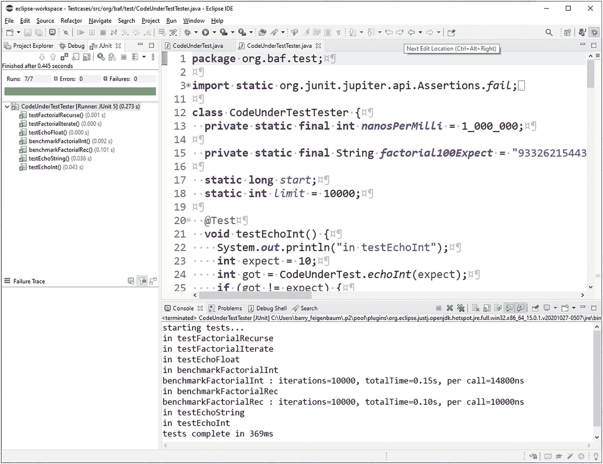
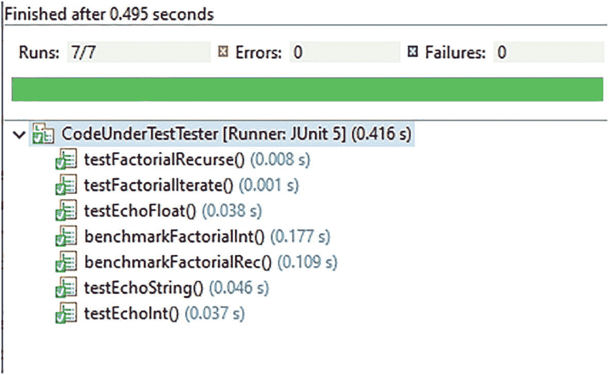

# 十、单元测试和基准测试

对代码进行频繁而全面的单元测试是最佳实践。让可重复的(和自动化的)测试用于变更后的回归测试也是最佳实践。通常，这些实践是结合在一起的。类似地，经常运行代码性能基准测试是最佳实践。通常，一个人应该创建一个尽可能接近 100%代码覆盖率的测试套件。 <sup>1</sup> 虽然没有在本文中深入讨论，Go 标准运行时支持代码覆盖测试。一种被称为*测试驱动开发* <sup>2</sup> (TDD)的开发风格，强调在任何被测试的*代码* (CUT)(即要测试的代码)被创建之前，创建所有的测试用例。

Go 标准运行时提供了运行 Go 代码的基本单元测试用例和基准的方法。它还支持 Go 程序的高级分析，但在本文中不会深入讨论。有关更多信息，请参见 Go 文档。对于 Java，类似的支持需要社区提供的库和框架。Go 测试框架类似于 Java*JUnit*<sup>3框架，尤其是它的早期版本(在 Java 注释出现之前)。</sup>

Go 测试套件通常提供多个单元测试(一个单元是少量的相关代码，通常是一个函数，或者可能是一个具有相关方法的类型，或者可能是一个具有几个类型和函数的包)。您还可以创建功能测试(测试一组复杂的类型和函数，以查看它们是否像预期的那样作为一个集合工作)。其他测试，如性能、系统、安全、负载等。，但扩展了标准测试功能。与 Java 一样，Go 社区为这些更高级的测试提供了增强的测试和基准支持。

下面提供了用 Go 和 Java 创建和运行测试用例的例子。这两个语言示例都没有涵盖库的全部功能。参见 [`https://golang.org/pkg/testing/`](https://golang.org/pkg/testing/) 的 Go 测试文档。

## Go 中的测试案例和基准

测试概念最好用例子来解释。首先，样品切割如清单 10-1 所示。

```go
package main

import (
     "errors"
     "math/big"
     "math/rand"
     "time"
)

// a set of functions to be tested

// Echo my input

func EchoInt(in int) (out int) {
     randomSleep(50 * time.Millisecond)
     out = in
     return
}

func EchoFloat(in float64) (out float64) {
     randomSleep(50 * time.Millisecond)
     out = in
     return
}

func EchoString(in string) (out string) {
     randomSleep(50 * time.Millisecond)
     out = in
     return
}

// Sum my inputs

func SumInt(in1, in2 int) (out int) {
     randomSleep(50 * time.Millisecond)
     out = in1 + in2
     return
}

func SumFloat(in1, in2 float64) (out float64) {
     randomSleep(5)
     out = in1 + in2
     return
}

func SumString(in1, in2 string) (out string) {
     randomSleep(50 * time.Millisecond)
     out = in1 + in2
     return
}

// Factorial computation: factorial(n):
// n < 0 - undefined
// n == 0 - 1
// n > 0 - n * factorial(n-1)

var ErrInvalidInput = errors.New("invalid input")

// Factorial via iteration
func FactorialIterate(n int64) (res *big.Int, err error) {
     if n < 0 {
          err = ErrInvalidInput
          return
     }
     res = big.NewInt(1)
     if n == 0 {
          return
     }
     for  i := int64(1); i <= n; i++ {
          res.Mul(res, big.NewInt(i))
     }
     return
}

// Factorial via recursion
func FactorialRecurse(n int64) (res *big.Int, err error) {
     if n < 0 {
          err = ErrInvalidInput
          return
     }
     res = big.NewInt(1)
     if n == 0 {
          return
     }
     term := big.NewInt(n)
     facm1, err := FactorialRecurse(n - 1)
     if err != nil {
          return
     }
     res = term.Mul(term, facm1)
     return
}

// a helper

func randomSleep(dur time.Duration ) {
     time.Sleep(time.Duration((1 + rand.Intn(int(dur)))))
}

Listing 10-1Code Under Test

```

请注意，阶乘函数使用 big `Int`类型，以便可以表示阶乘的(相当大的)结果。

现在是测试用例。

每个测试用例都是这个表单的一个函数:

```go
func TestXxx(t *testing.T) {
     expect := <expected vale>
     got := <actual value from CUT>
     if got != expect {
          reportNoMatch(t, got, expect)
     }
}

```

请注意，通常用“想要”这个词来代替“期望”

所有测试用例都以所需的“test”前缀和特定的测试用例名称开始。每个函数都有一个类型参数`T`来链接到测试库。

每个基准都是以下形式的函数:

```go
func BenchmarkXxx(b *testing.B) {
     for i := 0; i < b.N; i++ {
          <do something to be timed>
     }
}

```

所有基准测试都以所需的“基准”前缀和特定的测试用例名称开始。每个函数都有一个类型参数`B`来链接到测试库。

测试用例与基准通常放在一个文件中，格式为`XXX_test.go`，其中 XXX 是测试套件的名称。“_test”后缀是必需的，因此测试用例运行人员知道不要寻找要调用的`main`函数。这可能很方便，因为不需要创建`main`包和`main`函数来运行代码的测试用例，而没有测试用例运行器则需要这样做。

通常，CUT 和测试套件在同一个包/目录中，如图 10-1 所示。


图 10-1

被测代码和相应的测试用例

清单 10-2 是一些样本测试用例。

请注意阶乘带来的巨大结果，即使输入值相对较小，如 100。随着输入变大，阶乘快速增长(以数字表示)。没有一个正常的整数(比如说`uint64`)可以开始持有这样的结果。

```go
package main

import (
     "fmt"
     "math/big"
     "os"
     "testing"
     "time"
)
const factorialnput = 100
const factorialExpect = "93326215443944152681699238856266700490715968264381621468592963895217599993229915608941463976156518286253697920827223758251185210916864000000000000000000000000"

// test the functions; happy case only

func TestEchoInt(t *testing.T) {
     //fmt.Println("in TestEchoInt")
     expect := 10
     got := EchoInt(expect)
     if got != expect {
          reportNoMatch(t, got, expect)
     }
}

func TestSumInt(t *testing.T) {
     //fmt.Println("in TestSumInt")
     expect := 10
     got := SumInt(expect, expect)
     if got != expect+expect {
          reportNoMatch(t, got, expect+expect)
     }
}

func TestEchoFloat(t *testing.T) {
     //fmt.Println("in TestEchoFloat")
     expect := 10.0
     got := EchoFloat(expect)
     if got != expect {
          reportNoMatch(t, got, expect)
     }
}

func TestSumFloat(t *testing.T) {
     //fmt.Println("in TestSumFloat")
     expect := 10.0
     got := SumFloat(expect, expect)
     if got != expect+expect {
          reportNoMatch(t, got, expect+expect)
     }
}

func TestEchoString(t *testing.T) {
     fmt.Println("in TestEchoString")
     expect := "hello"
     got := EchoString(expect)
     if got != expect {
          reportNoMatch(t, got, expect)
     }
}

func TestSumString(t *testing.T) {
     //fmt.Println("in TestSumString")
     expect := "hello"
     got := SumString(expect, expect)
     if got != expect+expect {
          reportNoMatch(t, got, expect+expect)
     }
}

func TestFactorialIterate(t *testing.T) {
     //fmt.Println("in TestFactorialIterate")
     expect := big.NewInt(0)
     expect.SetString(factorialExpect, 10)
     got, err := FactorialIterate(factorialnput)
     if err != nil {
          reportFail(t, err)
     }
     if expect.Cmp(got) != 0 {
          reportNoMatch(t, got, expect)
     }
}

func TestFactorialRecurse(t *testing.T) {
     //fmt.Println("in TestFactorialRecurse")
     expect := big.NewInt(0)
     expect.SetString(factorialExpect, 10)
     got, err := FactorialRecurse(factorialnput)
     if err != nil {
          reportFail(t, err)
     }
     if expect.Cmp(got) != 0 {
          reportNoMatch(t, got, expect)
     }
}

// benchmarks

func BenchmarkFacInt(b *testing.B) {
     for i := 0; i < b.N; i++ {
          FactorialIterate(factorialnput)
     }
}

func BenchmarkFacRec(b *testing.B) {
     for i := 0; i < b.N; i++ {
          FactorialRecurse(factorialnput)
     }
}

// helpers

func reportNoMatch(t *testing.T, got interface{}, expect interface{}) {
     t.Error(fmt.Sprintf("got(%v) != expect(%v)", got, expect))
}

func reportFail(t *testing.T, err error) {
     t.Error(fmt.Sprintf("failure: %v", err))
}

var start time.Time

// do any test setup
func setup() {
     // do any setup here
     fmt.Printf("starting tests...\n")
     start = time.Now()
}

// do any test cleanup
func teardown() {
     end := time.Now()
     // do any cleanup here
     fmt.Printf("tests complete in %dms\n", end.Sub(start)/time.Millisecond)
}

// runs test with setup and cleanup
func TestMain(m *testing.M) {
     setup()
     rc := m.Run()
     teardown()
     os.Exit(rc)
}

Listing 10-2Test Cases and Benchmarks

```

使用`go test {<option>...}`命令运行测试和/或基准。一个关键选项是`-bench=<re>`，它指定了一个正则表达式(`<re>`)，通常是“.”对于所有人来说。如果未指定，则不运行任何基准。请注意，基准测试会使测试套件花费大量时间运行，因此您可能不想每次都运行它们。

以下是前面在 ide 中运行的套件的结果:

```go
GOROOT=C:\Users\Administrator\sdk\go1.14.2 #gosetup
GOPATH=C:\Users\Administrator\IdeaProjects;C:\Users\Administrator\IdeaProjects\LifeServer;C:\Users\Administrator\go #gosetup
C:\Users\Administrator\sdk\go1.14.2\bin\go.exe test -c -o C:\Users\Administrator\AppData\Local\Temp\1\___CodeUnderTest_test_go.exe samples #gosetup
C:\Users\Administrator\sdk\go1.14.2\bin\go.exe tool test2json -t C:\Users\Administrator\AppData\Local\Temp\1\___CodeUnderTest_test_go.exe -test.v -test.run "^TestEchoInt|TestSumInt|TestEchoFloat|TestSumFloat|TestEchoString|TestSumString|TestFactorialIterate|TestFactorialRecurse$" -test.bench=. #gosetup
starting tests...
=== RUN   TestEchoInt
--- PASS: TestEchoInt (0.05s)
=== RUN   TestSumInt
--- PASS: TestSumInt (0.02s)
=== RUN   TestEchoFloat
--- PASS: TestEchoFloat (0.03s)
=== RUN   TestSumFloat
--- PASS: TestSumFloat (0.00s)
=== RUN   TestEchoString
in TestEchoString
--- PASS: TestEchoString (0.01s)
=== RUN   TestSumString
--- PASS: TestSumString (0.03s)
=== RUN   TestFactorialIterate
--- PASS: TestFactorialIterate (0.00s)
=== RUN   TestFactorialRecurse
--- PASS: TestFactorialRecurse (0.00s)
goos: windows
goarch: amd64
pkg: samples
BenchmarkFacInt
BenchmarkFacInt-48            76730          15441 ns/op
BenchmarkFacRec
BenchmarkFacRec-48            52176          23093 ns/op
PASS
tests complete in 2924ms

Process finished with exit code 0

```

在这个例子中，所有的测试都通过了。这两个基准测试显示了迭代(较快，约 15μs)和递归(较慢，约 23μs)阶乘实现所用的显著不同的运行时间。这是意料之中的，因为递归实现会根据输入值增加大量额外的调用/返回开销。

请注意安装和拆卸代码添加的消息。还要注意，基准测试运行者根据每次迭代花费的时间选择了不同的迭代计数(for 循环中的 N)来进行测试。它通过在调用完整运行之前先做一些初步运行来做到这一点。

只是为了演示代码覆盖率，测试套件是带覆盖率运行的。图 10-2 显示了覆盖范围总结报告。


图 10-2

测试用例覆盖报告摘要

图 10-3 显示了应用了覆盖着色的剪切片段。


图 10-3

针对测试源的测试用例覆盖率指标

绿色部分(第 61、66、70–73 行)显示代码运行；黄色部分(第 62、67 行)显示只覆盖了部分路径的代码(通常是`if`或`switch`语句)。红色部分(第 63–65、68、69 行)显示代码根本没有运行。该报告可以建议进行额外的测试用例来增加覆盖率。

一些 ide 可以运行 Go profiling 并生成报告和/或图表或结果。下面是一个针对测试套件运行概要文件的示例。在这些例子中很难看到细节(并且对我们的讨论来说不是关键的)，但是仅仅使用标准的 Go 库和工具来分析代码的能力是非常强大的。在 Java 中，需要社区支持。

图 10-4 显示了 CPU 使用情况分析结果。


图 10-4

IDE 绘制的 CPU 配置文件结果

内存使用分析结果如图 10-5 所示。


图 10-5

IDE 绘制的内存分析结果

## Java 测试用例

为了与 Java 进行比较，清单 10-2 结合了相似的切割和测试案例。JUnit 没有简单的基准特性，所以基准是手工构建的 <sup>4</sup> 作为测试用例。下面的 Java 例子使用了 JUnit 5。注意 JUnit 测试用例使用 Java 注释(比如`@Test`，vs .方法命名约定)来识别测试用例；不需要“测试”前缀。

```go
package org.baf.test;

import static org.junit.jupiter.api.Assertions.fail;

import java.math.BigInteger;

import org.baf.CodeUnderTest;
import org.junit.jupiter.api.AfterAll;
import org.junit.jupiter.api.BeforeAll;
import org.junit.jupiter.api.Test;

public class CodeUnderTestTester {
  private static final String factorial100Expect = "93326215443944152681699238856266700490715968264381621468592963895217599993229915608941463976156518286253697920827223758251185210916864000000000000000000000000";

  static long start;
  static int limit = 10_000;

  @Test
  void testEchoInt() {
    int expect = 10;
    int got = CodeUnderTest.echoInt(expect);
    if (got != expect) {
      reportNoMatch(got, expect);
    }
  }

  @Test
  void testEchoFloat() {
    double expect = 10;
    double got = CodeUnderTest.echoFloat(expect);
    if (got != expect) {
      reportNoMatch(got, expect);
    }
  }

  @Test
  void testEchoString() {
    String expect = "hello";
    String got = CodeUnderTest.echoString(expect);
    if (!got.equals(expect)) {
      reportNoMatch(got, expect);
    }
  }

  @Test
  void testFactorialIterate() {
    BigInteger expect = new BigInteger(factorial100Expect);
    BigInteger got = CodeUnderTest.factorialIterative(100);
    if (!got.equals(expect)) {
      reportNoMatch(got, expect);
    }
  }

  @Test
  void testFactorialRecurse() {
    BigInteger expect = new BigInteger(factorial100Expect);
    BigInteger got = CodeUnderTest.factorialRecursive(100);
    if (!got.equals(expect)) {
      reportNoMatch(got, expect);
    }
  }

  @Test
  void benchmarkFactorialInt() {
    long start = System.currentTimeMillis();
    for (int i = 0; i < limit; i++) {
      CodeUnderTest.factorialIterative(1000);
    }
    long end = System.currentTimeMillis(), delta = end - start;
    System.out.printf("factorialIterativeve : iterations=%d, totalTime=%.2fs, per call=%.3fms%n", limit,
        (double) delta / 1000, (double) delta / limit);

  }

  @Test
  void benchmarkFactorialRec() {
    long start = System.currentTimeMillis();
    for (int i = 0; i < limit; i++) {
      CodeUnderTest.factorialRecursive(1000);
    }
    long end = System.currentTimeMillis(), delta = end - start;
    System.out.printf("factorialRecursive : iterations=%d, totalTime=%.2fs, per call=%.3fms%n", limit,
        (double) delta / 1000, (double) delta / limit);

  }

  @BeforeAll
  static void setUp() throws Exception {
    System.out.printf("starting tests...%n");
    start = System.currentTimeMillis();
  }

  @AfterAll
  static void tearDown() throws Exception {
    long end = System.currentTimeMillis();
    System.out.printf("tests complete in %dms%n", end - start);
  }

  private void reportNoMatch(Object got, Object expect) {
    fail(String.format("got(%s) != expect(%s)", got.toString(), expect.toString()));
  }

  private void reportFail(String message) {
    fail(String.format("failure: %s", message));
  }
}

Listing 10-3Java JUnit Test Cases

```

使用 Eclipse IDE，针对 CUT 运行测试用例。和 Go 例子一样，都通过了，如图 10-6 所示。



图 10-6

在 IDE 中运行 JUnit 报告

总结报告(展开)如图 10-7 所示。



图 10-7

IDE 中的 JUnit 运行摘要

测试输出以下摘要:

```go
benchmarkFactorialInt : iterations=10000, totalTime=0.17s, per call=17400ns
benchmarkFactorialRec : iterations=10000, totalTime=0.11s, per call=10700ns

```

请注意，迭代和递归阶乘实现之间的运行时间差异很小。这意味着与计算阶乘相比，调用/返回开销很小；大部分时间是在阶乘法中。

将前面的 Java 结果与下面的 Go 结果进行对比。虽然不相同，但它们是相似的:

```go
BenchmarkFacInt-48            76730          15441 ns/op
BenchmarkFacRec-48            52176          23093 ns/op

```

<aside aria-label="Footnotes" class="FootnoteSection" epub:type="footnotes">Footnotes 1

100%的覆盖率通常需要许多测试用例，常常超过切割的体积。因此，通常会制定一些较低的目标(比如 80%)。

  2

[`https://en.wikipedia.org/wiki/Test-driven_development`](https://en.wikipedia.org/wiki/Test-driven_development)

  3

[`https://en.wikipedia.org/wiki/JUnit`](https://en.wikipedia.org/wiki/JUnit) 。最近的 JUnit 版本依赖于 Java 注释，而 Go 并不支持。

  4

如前所述，它们不考虑 for 循环增加的时间。生产基准必须做到这一点。

 </aside>