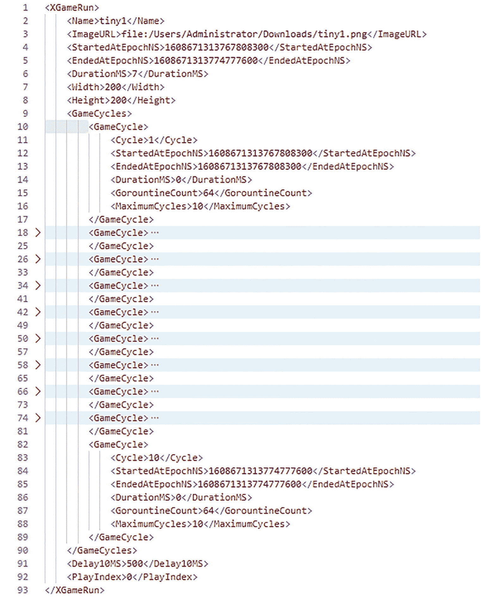

# 十一、走向未来

在我们结束学习 Go 的旅程之前，我们将简要了解一些未来可能的增强功能。然后，我们将以顶点计划的形式带来我们一起学到的东西，一个相当大的示例 web 服务器实现，希望也应该是有趣的。

下一部分中的 Go 库介绍和调查部分提供了一些关于使用单个 Go 库的背景和示例，您应该在学习 capstone 示例时回顾一下。

在我们展望未来之前，让我们回顾一下过去。和 Java 一样，Go 的起源也不像今天这样。随着时间的推移，Go 实现已经发展成熟。它有一段持续改进的历史，而且肯定会继续下去。

Go 会随着时间不断进步。对语言和运行时库有许多提议的增强。有些人可能会进入 Go。有些建议不是向后兼容的。这些提议的改变是会出现在 Go 1.x 版本中，还是等到 Go 2.x 版本(如果有的话)才会出现，还有待确定。

在众多潜在的增强功能中，有两个关键的潜在增强功能正在讨论中。

## 改进的错误处理

Go 处理错误的惯用方式可能会很繁琐。在 [`https://go.googlesource.com/proposal/+/master/design/go2draft-error-handling-overview.md`](https://go.googlesource.com/proposal/%252B/master/design/go2draft-error-handling-overview.md) 中有一个改善这种情况的提议。

今天，一段典型的 Go 代码会处理这样的错误:

```go
func FileCopy(fromPath, toPath string) (count int64, err error) {
      reader, err := os.Open(fromPath)
      if err != nil {
            return
      }
      defer reader.Close()
      writer, err := os.Create(toPath)
      if err != nil {
            return
      }
      defer writer.Close()
      count, err = io.Copy(writer, reader)
      return
}

```

这是重复的。此外，代码的很大一部分是错误处理。

即使进行了所有这些检查，即使复制功能失败，输出文件也可以保留；在生产中应将其移除。此外，报告的错误可能无法提供足够的上下文信息来从原因中恢复。事情应该会好起来。提议的设计允许类似这样的事情:

```go
func FileCopy(fromPath, toPath string) (count int64, err error) {
      handle err {
            return fmt.Errorf("copy(%q,%q) failed: %v",
            fromPath, toPath, err)
      }
      reader := check os.Open(fromPath)
      defer reader.Close()
      writer := check os.Create(toPath)
      handle err {
            writer.Close()
            os.Remove(toPath) // clean up
      }
      count = check io.Copy(writer, reader)
      return
}

```

另一个简单的例子:

```go
func main() {
      handle err {
            log.Fatalf("main failed due to %v", err)
      }
      text := check ioutil.ReadAll(os.Stdin)
      check os.Stdout.Write(text)
}

```

这里，`handle`语句的工作有点像`defer`语句，处理错误并将它们传递给前面的句柄块，直到完成一个`return`。action 语句上的`check`前缀寻找(并消耗)一个返回的错误值，如果存在，触发`handle`链将错误传递给它。注意，冗长的`if/return`习惯用法被替换为使用`check`。这使得错误处理更像是紧急处理。

## 去仿制药

当前 Go 定义中似乎缺少的另一个关键领域是创建*泛型*类型的能力。这是被定义为 <sup>2</sup> 和现在被接受的 <sup>3</sup> 的增强。作为预览，这里介绍一下 Go 中的泛型会是什么样子。这篇简介并不打算涵盖泛型的所有方面。

提案中概括了这个概念: <sup>4</sup> *我们建议* ***扩展 Go 语言，在类型和函数声明中添加可选的类型参数*** *。类型参数受接口类型的约束。当用作类型约束时，接口类型允许列出可能分配给它们的类型集。在许多情况下，通过统一算法的类型推断允许从函数调用中省略类型参数。* ***设计完全向后兼容 Go 1*** 。

*…术语* ***泛型*** *是…一种简写，意思是采用类型参数的函数或类型。*

在 Go 中，这些类型参数用方括号(`[...]`)括起来。在 Java 中，尖括号(`<...>`)有类似的作用。例如，考虑这个通用函数:

```go
func DoItT any {
      :
}

```

其中`[T any]`定义了一个可以采用任何类型的类型参数。注意，这里的`any`是`interface{}`的同义词。

Java 的对等物是

```go
public <T> void doIt(List<T> s) {
    :
}

```

提案进一步细化为 <sup>5</sup> ，并对提议的变更进行了总结:

*   *函数可以有一个额外的类型参数列表，它使用方括号，但在其他方面看起来像一个普通的参数列表:* `func FT any { ... }` *。*

*   *这些类型参数可以被常规参数和函数体使用。*

*   *类型也可以有一个类型参数表:* `type MySlice[T any] []T` *。*

*   *每个类型参数都有一个类型约束，就像每个普通参数都有一个类型:* `func FT Constraint { ... }` *。*

*   类型约束是接口类型。

*   *新的预声明名称* `any` *是一个允许任何类型的类型约束。*

*   *用作类型约束的接口类型* *可以有一个预声明类型的列表；只有与这些类型之一匹配的类型参数才满足约束。*

*   通用函数只能使用其类型约束所允许的操作。

*   使用泛型函数或类型需要传递类型参数。

*   类型推断允许在一般情况下省略函数调用的类型参数。

在 Java 中，泛型只能在引用(对象及其子类)类型上，而不能在基本类型上。Go 没有这种限制。

这个 Go 函数可以通过为 T 类型参数提供一个实类型来使用。例如:

```go
DoItint

```

其中通用类型被设置为`int`。通常，编译器可以推断出这种类型，让它写成

```go
DoIt([]int{1, 2, 3, 4, 5})

```

这类似于非一般呼叫。

通常，人们需要限制(约束)一个泛型类型可以采用的实际类型。通常，这意味着一个限制类型的接口，这样就可以调用它的方法。

假设我们想将类型参数限制为符合`fmt.Stringer`接口的东西。为此，有人写道

```go
func DoItT fmt.Stringer {
      :
}

```

Java(接近)的对等词是

```go
public <T extends Stringer> void doIt(List<T> s) {
    :
}

```

像 Java 一样，一个函数可以有多个类型参数，比如

```go
func DoItS fmt.Stringer, R io.Reader {
      :
}

```

这里，这些类型参数是不同的(即使基于相同的实类型)。

以下示例摘自 Go proposal 网站的内容。

类型也可以是泛型的。考虑这种通用切片类型:

```go
type Slice[T any] []T

```

要实现(或实例化)这样的类型参数，需要提供一个类型，如下所示:

```go
var s Slice[int]

```

与非泛型类型一样，泛型类型也可以有方法:

```go
func (v *Slice[T]) AddToEnd(x T) {
      *v = append(*v, x)
}

```

为了保持简单，实现有一些限制。方法被限制为与其作为方法的类型相同的类型参数；它不能再增加了。没有计划允许泛型类型参数或复合文本上的反射。

若要对泛型类型执行操作，必须将该类型映射到具有该操作的真实类型。在 Go 中，操作通常仅限于预定义的类型。因此，需要将泛型类型限制为一个或多个预定义的类型。通过声明枚举允许的预定义类型的接口类型可以做到这一点。例如:

```go
type SignedInt interface {
  type int, int8, int16, int32, int64
}

```

它表示任何有符号整数类型或从它们派生的任何类型。这不是普通接口，不能用作基类型，只能用作约束。常用的分组接口将可能由标准的 Go 运行时提供。

像`any`预定义约束一样，`comparable`约束允许任何支持相等比较的类型。

使用切片的通用函数示例: <sup>6</sup>

```go
func SliceMapT1, T2 any T2) (res []T2) {
      res := make([]T2, len(s))
      for i, v := range s {
            res[i] = mapper(v)
      }
      return
}
func SliceReduceT1, T2 any T2) (acc T2) {
      acc := first
      for _, v := range s {
            acc = reducer(acc, v)
      }
      return
}
func SliceFilterT any bool) (match []T) {
      match = make([]T, 0, len(s))
      for _, v := range s {
            if pred(v) {
                  match = append(match, v)
            }
      }
      return
}

```

注意，Go 的泛型类型没有 Java 泛型可能有的对立/协变问题 <sup>7</sup> 。这是因为 Go 不支持类型继承。在 Go 中，每个类型都是不同的，不能混合在一个泛型类型中，比如集合。

为了更早地了解泛型的作用，可以使用扩展的 Go Playground。 <sup>8</sup> 在图 11-1 中，我们看到了对整数和浮点数值的`min`(最小值)函数的通用版本。


图 11-1

支持泛型的操场示例

其他样品也可用，如图 11-2 所示。


图 11-2

可用的通用示例

## `Capstone``Game of Life`

关于 Go 的最后一节提供了一个重要的编码示例，又名 *capstone* ，用 Java 和 Go 语言编写。Go capstone 实现演示了许多基本的 Go 函数、goroutines 的使用以及 HTTP 服务器实现。Java capstone 实现演示了如何用 Java 编写一个类似的程序来进行比较。

顶点程序玩的是约翰·康威定义的生命 <sup>9</sup> (GoL)的*游戏。这个游戏是一个零玩家游戏，在一个伪培养皿 <sup>10</sup> 一样的约束环境中模拟多代(又名回合或循环)的“微生物生命”。在这种情况下，培养皿由包含活(填充)或死(空)细胞的细胞矩形网格表示。根据康威的规则，游戏的迭代(离散时间步骤)导致细胞停留在停滞状态，繁殖或死亡。*

根据网格的大小,“活着的”细胞的初始位置，以及进行的世代数，可以出现许多可能的、通常是有趣的模式。通常，这些模式最终会循环往复或变得固定不变。一些模式最终导致一个空的(全死的)网格。

游戏的一般规则是，在一代人的时间里

*   任何有三个相邻活细胞的死细胞都会变成活细胞。

*   任何只有两三个相邻活细胞的活细胞仍然活着；其他活细胞死亡。

*   所有其他死亡的细胞仍然是死的。

图 11-3 提供了一个正在进行的不同 GoL 实施的示例快照。注意黑色的活细胞和灰色的死细胞。随着游戏的进行(也称为循环)，细胞从活的移动到死的，或者从死的移动到活的，因此可以看起来在网格周围移动和/或改变群体形状。


图 11-3

生命网格的示例游戏

图 11-3 取自 [`http://pi.math.cornell.edu/~lipa/mec/lesson6.html`](http://pi.math.cornell.edu/%257Elipa/mec/lesson6.html) 。

顶点高尔夫网格通过加载一个 PNG <sup>11</sup> 图像来初始化。这可以是一个真实的图像，比如一张照片或一幅漫画，或者一些(通常)带有特定单元格集的更小的网格，通常在一个程序中创建，比如微软 *Paint* 如图 11-4 所示。


图 11-4

在 Microsoft Paint 中创建高尔夫网格

这可以保存为 PNG 格式，如图 11-5 所示。


图 11-5

在 Microsoft Paint 中保存高尔夫网格

图像的宽度和高度设置网格的宽度和高度(本例中为 100 x 100)。如果图像是彩色的，它将被映射为黑白(BW)。RGB 总和高于阈值的颜色被视为白色，否则被视为黑色。详情见 GoL 代码。黑色表示活细胞。一旦加载，就会运行一组预定的周期并保存在内存中(GoL 程序的生产版本可能会使用文件系统或数据库来保存以前生成的周期)。

有一个 web API(类似 REST ),允许用户在浏览器中查看生成的结果。提供了两种图像格式:

1.  GIF–允许显示一系列循环(动画)

2.  PNG–允许显示单个周期，通常比 GIF 提供的分辨率更高

请参见代码清单下面的图像示例。

程序接受这些可选的命令行标志参数(更多细节参见 Go `flag`包) :

*   用来引用游戏的名称

*   图像的 URL(文件或 HTTP)

*   放大系数(1–20)

*   启动 HTTP 服务器的标志(默认为真)

*   启用游戏计时循环的标志(默认为假)

*   启用报告呈现统计信息的标志(默认为 false)

*   允许将生成的图像保存到文件中的标志(默认为 false)

如果存在的话，*名称*和 *url* 命令行参数会导致在服务器启动之前发生“播放”动作。这可以预载 GoL 结果。

注意各种标志的出现主要是为了演示命令行参数处理，而不是为了使 GoL 程序非常复杂；由于标志处理不是此顶点的关键点，因此标志可能无法可靠地实现。一个生产游戏可能会更加注意标志，并有更多的标志(如服务器端口值)。

程序的服务器部分提供了这些 API 路径:

*   `GET /play`–加载图像，并在图像上打高尔夫球；返回 JSON 关于播放过程的统计数据。

*   查询参数:

*   名称–引用游戏的名称

*   url–图像的 URL(文件或 HTTP)

*   `GET /show`–以图像形式返回之前运行的游戏。

*   查询参数:

*   名称–引用游戏的名称。

*   表单-图像格式:GIF 或 PNG 如果是 GIF，可能是动画(包含几个循环)。

*   maxCount–返回的最大周期数(直到保存的周期数)。

*   mag–放大系数(1–20)。

*   `GET /history`–返回玩过游戏的历史记录。这种历史在高尔夫比赛中并不持久。

*   清空已玩游戏的历史记录。

注意 GoL 代码通常用于本地(`file:`协议)初始电路板图像和网络(`http:`协议)图像。所有示例都使用本地图像。

前面的 API 不太符合标准的 REST 定义。它们的存在只是为了演示基本的 HTTP 请求处理。通常，带有嵌入式路径参数和其他选项的 production REST APIs 的匹配和解析会更加复杂。在这种情况下，使用 Go 标准库解析支持会很有挑战性。Go 社区有几个扩展了标准支持的库，例如， *Gorilla Mux* 、<sup>、 12 、使这变得更容易。这些库可以使 API 匹配与 Java 的 JAX-RS 和 Spring MVC 提供的相媲美。</sup>

服务器启动并监听端口 8080。

GoL 的计算量可能很大，特别是对于大网格，因为时间复杂度是 *O(n )* 。因为工作很容易划分(每个单元的新周期状态只依赖于它的前一个周期的近邻)，所以这是一个很好的例子来演示如何使用 goroutines 以较少的编码工作来提高程序性能。

## 游戏人生 Go 源码

将给出 GoL 实现的两种形式，一种用 Java，另一种用 Go。这允许对用 Go 和 Java 编写的实际程序进行详细的点对点实现比较。

两个版本中的大部分核心代码本质上是相同的。一般来说，相同的变量、类型和函数名(但大小写不同以匹配语言风格)用于帮助匹配实现部分。这种比较还显示了 Go 通常如何能够实现 Java SE 能够以相当的努力实现的大多数程序。

为了尽可能直接地进行比较，首先编写并测试 Go 表单，然后基于它创建 Java 实现。这意味着 Java 代码通常遵循 Go 习惯用法，没有充分利用 Java 语言(例如，使用 Lambdas 和 streams)。Java 版本与 Go 版本在以下关键方面有所不同:

*   异常的使用(与 Go 风格的错误返回相比)

*   HTTP 服务器库差异

*   图像库差异

*   命令行解析差异(Java 没有解析命令行的标准库)

*   将所有函数包装在某个类中

在 Java 代码中，通常只使用公共和默认可见性。这是为了匹配 Go 的可视性。大多数 Java 开发人员会选择使用私有可见性，而不是默认可见性。可见性是显式的(而不是由标识符大小写暗示的)。

与 Go 代码一样，Java 代码通常仅限于使用标准(相对于社区)库。Go 支持从结构创建标准的 JSON 和 XML。Java 没有。JSE 没有标准的 JSON 渲染器，所以实现了一个基本的，而不需要社区实现。一个等效的定制 XML 渲染器更复杂，并且对顶点的目的不重要，所以没有实现。Go 版本使用标准库 JSON 和 XML 呈现器。

Java 版本使用半标准的 HTTP 服务器`com.sun.net.httpserver.HttpServer`。它随 Java SDK 一起提供，但不使用标准的 Java 包名。比如说，要求社区支持 JAX-RS 或 Spring MVC 的选择违反了这个顶点的只能使用标准库的限制。只使用 Java HTTP 包来编写 HTTP 服务器将是一项非常大的工作。Go 版本使用标准的库 HTTP 服务器。

将首先呈现 Java 版本，然后是 Go 版本。一旦你理解了 Java 的实现，Go 版本应该很容易上手。您应该注意到实现中的高度相似性，这是故意的。检查代码时，在 Java 和 Go 源代码之间切换可能会有所帮助。或者你可以从 Go 实现开始，参考 Java 实现。做你觉得最舒服的事。

注意，顶点程序的 Java 代码是使用 Eclipse IDE 开发的，Go 代码是使用 IntelliJ IDEA IDE 开发的。这对代码的格式有一些影响。

### Java 中的顶点项目

GoL 程序的 Java 形式由一个单独的`org.baf.gol`包组成，该包包含以下源文件:

*   Main.java——主命令处理器

*   Server.java——HTTP 服务器和请求处理器

*   Game.java——高尔夫的游戏逻辑

*   Utility.java-助手功能

*   AnnimatedGifWriter.java——一个将多张图片组合成 GIF 的助手

*   Logger.java——一个简单的 Go 记录器

*   ParameterProvider.java——一个帮助器接口，用于在类之间传递命令行参数(在 Go 版本中使用公共全局值)

*   Formatter.java——格式化地图的助手界面

*   JsonFormatter.java——将地图格式化成 JSON 的格式化程序

*   XmlFormatter.java——将地图格式化为 XML 的格式化程序(未实现)

注意前四个来源也存在于 Go 版本中。它们在两个版本中的功能几乎相同。需要其他资源来处理 Java 与 Go 运行时的差异。

注意这个例子使用了 Java 14 <sup>13</sup> 特性，并且必须至少在那个版本上编译和运行。在该版本中预览了一些使用的 Java 特性。

#### Main.java

Main.java 包含了`main`函数，它可以检测任何命令行参数并进行处理。它使用定制但简单的代码来处理任何命令行标志。它还可以选择启动 HTTP 服务器。

清单 11-1(Main.java)包含了这段代码。

```go
package org.baf.gol;

import  org.baf.gol.Logger;

import java.util.ArrayList;
import java.util.Arrays;

/**
 * Main GoL engine.
 */
public class Main implements ParameterProvider {
  // command line values
  String urlString, nameString;
  int magFactorInt = 1, gameCycles = 10;
  boolean startServerFlag, runTimingsFlag, reportFlag, saveImageFlag;
  public static String saveImageRoot = "/temp"; // change per OS type

  @Override
  public String getUrlParameter() {
    return urlString;
  }

  @Override
  public String getNameParameter() {
    return nameString;
  }

  @Override
  public int getMagFactorParameter() {
    return magFactorInt;
  }

  @Override
  public boolean startServerFlag() {
    return startServerFlag;
  }

  @Override
  public boolean runTimingsFlag() {
    return runTimingsFlag;
  }

  @Override
  public boolean reportFlag() {
    return reportFlag;
  }

  @Override
  public boolean saveImageFlag() {
    return saveImageFlag;
  }

  @Override
  public int getGameCyclesParameter() {
    return gameCycles;
  }

  /**
   * Main entry point.
   *
   * Sample: -n tiny1 -u file:/.../tiny1.png
   */
  public static void main(String[] args) {
    if (args.length == 0) {
      printHelp();
      return;
    }
    try {
      var main = new Main();
      if (!main.parseArgs(args)) {
        Logger.log.tracef("Command arguments: %s", Arrays.toString(args));
        printHelp();
        System.exit(1);
      }
      main.launch();
    } catch (Exception e) {
      Logger.log.exceptionf(e, "launched failed");
      System.exit(3);
    }
  }

  private void launch() throws Exception {
    Game.coreGame = new Game(this);
    Game.coreGame.saveImageRoot = saveImageRoot;
    Game.coreGame.maxCycles = gameCycles;

    // need timings
    if (!urlString.isEmpty()) {
      if (nameString.isEmpty()) {
        System.err.printf("a name is required when a URL is provided%n");
        System.exit(1);
      }
      if (runTimingsFlag) {
        runCycleTimings();
      }

    }

    // need server
    if (startServerFlag) {
      // launch HTTP server
      var server = new Server(this);
      server.saveImageRoot = saveImageRoot;
      server.startHttpServer();
    }
  }

  // approximation of flag package in Go
  private boolean parseArgs(String[] args) {
    boolean ok = true;
    try {
      for (int i = 0; i < args.length; i++) {
        switch (args[i].toLowerCase()) {
          case "-url":
          case "-u":
            urlString = args[++i];
            break;
          case "-name":
          case "-n":
            nameString = args[++i];
            break;
          case "-magfactor":
          case "-mf":
          case "-mag":
            magFactorInt = Integer.parseInt(args[++i]);
            if (magFactorInt < 1 || magFactorInt > 20) {
              throw new IllegalArgumentException("bad magFactor: " + magFactorInt);
            }
            break;
          case "-gamecycles":
          case "-gc":
            gameCycles = Integer.parseInt(args[++i]);
            if (gameCycles < 1 || gameCycles > 1000) {
              throw new IllegalArgumentException("bad gameCycles: " + gameCycles);
            }

            break;
          case "-start":
            startServerFlag = true;
            break;
          case "-time":
            runTimingsFlag = true;
            break;
          case "-report":
            reportFlag = true;
            break;
          case "-saveimage":
          case "-si":
            saveImageFlag = true;
            break;
          default:
            throw new IllegalArgumentException("unknown parameter key: " + args[i]);
        }
      }
    } catch (Exception e) {
      System.err.printf("parse failed: %s%n", e.getMessage());
      ok = false;
    }
    return ok;
  }

  // get execution timings
  private void runCycleTimings() throws Exception {
    var cpuCount = Runtime.getRuntime().availableProcessors();
    for (var i = 1; i <= 64; i *= 2) {
      Logger.log.tracef("Running with %d threads, %d CPUs...", i, cpuCount);
      Game coreGame = Game.coreGame;
      coreGame.threadCount = i;
      coreGame.run(getNameParameter(), getUrlParameter());

      if (reportFlag()) {
        Logger.log.tracef("Game max: %d, go count: %d:", i, coreGame.maxCycles, coreGame.threadCount);
        for (var grk : coreGame.runs.keySet()) {
          var gr = coreGame.runs.get(grk);
          Logger.log.tracef("Game Run: %s, cycle count: %d", gr.name, gr.cycles.size());
          for (var c : gr.cycles) {
            long start = c.startedAt.getTime(), end = c.endedAt.getTime();
            Logger.log.tracef("Cycle: start epoch: %dms, end epoch: %dms, elapsed: %dms", start, end, end - start);
          }

        }
      }
    }
  }

  private static void printHelp() {
    System.err.printf("%s%n%n%s%n", trimWhitespace(golDescription), trimWhitespace((golArgs)));
  }

  private static Object trimWhitespace(String lines) {
    var xlines = lines.split("\n");
    var result = new ArrayList<String>();
    for (int i = 0, c = xlines.length; i < c; i++) {
      String tline = xlines[i].trim();
      if (!tline.isEmpty()) {
        result.add(tline.replace("%n", "\n"));
      }
    }
    return String.join("\n", result);
  }

  static String golDescription = """
       Play the game of Life.
       Game boards are initialized from PNG images.
       Games play over several cycles.%n
       Optionally acts as a server to retrieve images of game boards during play.%n
       No supported positional arguments.
      """;

  static String golArgs = """
      Arguments (all start with '-'):
      url|u <url>              URL of the PNG image to load
      name|n <name>            name to refer to the game initialized by the URL
      magFactor|mf|mag <int>   magnify the grid by this factor when formatted into an image  (default 1; 1 to 20)
      gameCycles|gc <int>      sets number of cycles to run (default 10)
      start <boolean>          start the HTTP server (default false)
      time <boolean>           run game cycle timings with different thread counts (default false)
      report <boolean>         output run statistics (default false)
      saveImage|si <boolean>   save generated images into a file (default false)
      """;
}

Listing 11-1Source File 1 Main.java

```

#### Server.java

Server.java 启动了一个带有几个路径处理器的 HTTP 服务器。处理程序访问任何查询参数，然后生成和/或访问 GoL 数据。`Game.coreGame`代表过去玩过的游戏的历史的根。返回存储在其中的图像或 JSON/XML 统计信息。

目前，标准 JRE 中不支持 JSON 必须使用第三方实现。通常情况下，Java 版本使用起来更复杂，但是功能更强大。

一些 Java JSON 处理器的例子:

*   杰克逊<sup>14</sup>——流行；通常是 JEE 版本中的默认实现

*   gson<sup>15</sup>——来自谷歌，还需要我们多说吗

*   Json-io <sup>16</sup>

*   genson<sup>【17】</sup>

这个例子尽可能使用标准库支持，所以 JSON 由定制代码处理。

Server.java(清单 11-2 )包含了这段代码。

```go
package org.baf.gol;

import static org.baf.gol.Logger.log;
import static org.baf.gol.Utility.NANOS_PER_MS;
import static org.baf.gol.Utility.isNullOrEmpty;

import java.io.IOException;
import java.net.InetSocketAddress;
import java.nio.file.Files;
import java.nio.file.Paths;
import java.util.ArrayList;
import java.util.LinkedHashMap;
import java.util.List;
import java.util.Map;
import java.util.Objects;
import java.util.stream.Collectors;

import com.sun.net.httpserver.HttpExchange;
import com.sun.net.httpserver.HttpHandler;
import com.sun.net.httpserver.HttpServer;

/**
 * Provides a HTTP server for the GoL.<br>
 * Uses com.sun.net.httpserver.HttpServer for basic function.<br>
 * Can be opened only one time.
 **/
public class Server implements AutoCloseable {
  private static final String GIF_IMAGE_FILE_PATTERN = "/Image_%s.gif";

  String address;
  int port;
  Map<String, HttpHandler> handlers = new LinkedHashMap<>();
  HttpServer server;
  ParameterProvider pp;
  public String saveImageRoot = "/temp"; // change per OS type

  public Server(ParameterProvider pp) {
    this(pp, "localhost", 8080);
  }

  public Server(ParameterProvider pp, String address, int port) {
    this.pp = pp;
    this.address = address;
    this.port = port;
  }

  @Override
  public String toString() {
    return "Server[address=" + address + ", port=" + port + ", open=" + isOpen() + ", handlers=" + handlers.keySet() + "]";
  }

  String getRequestPath(HttpExchange ex) {
    return ex.getRequestURI().toString().split("\\?")[0];
  }

  // assumes only one value; redo if more than one possible
  String getQueryParamValue(HttpExchange ex, String name) {
    String result = null;
    var parts = ex.getRequestURI().toString().split("\\?");
    if (parts.length > 1) {
      parts = parts[1].split("&");
      for (var part : parts) {
        var xparts = part.split("=");
        if (xparts[0].equals(name)) {
          result = xparts[1];
          break;
        }
      }
    }
    return result;
  }

  /**
   * Used to allow clients outside this class to send data.
   */
  public interface ResponseDataSender {
    void sendResponseData(byte[] data) throws IOException;
  }

  public class DefaultResponseDataSender implements ResponseDataSender {
    HttpExchange ex;

    public DefaultResponseDataSender(HttpExchange ex) {
      this.ex = ex;
    }

    @Override
    public void sendResponseData(byte[] data) throws IOException {
      Server.this.sendResponseData(ex, data);
    }

  }

  void sendResponseData(HttpExchange ex, byte[] data) throws IOException {
    ex.sendResponseHeaders(200, data.length);
    var os = ex.getResponseBody();
    os.write(data);
    os.flush();
    os.close();
    log.tracef("Sent %d bytes", data.length);
  }

  void sendResponseJson(HttpExchange ex, Object data) throws IOException {
    ex.getResponseHeaders().add("Content-Type", "text/json");
    var jf = new JsonFormatter();
    sendResponseData(ex, jf.valueToText(data).getBytes());
  }

  void sendResponseXml(HttpExchange ex, Object data) throws IOException {
    ex.getResponseHeaders().add("Content-Type", "text/xml");
    var xf = new XmlFormatter();
    sendResponseData(ex, xf.valueToText(data).getBytes());
  }

  void sendStatus(HttpExchange ex, int status) throws IOException {
    ex.sendResponseHeaders(status, 0);
  }

// Show request handler.
  HttpHandler showHandler = new HttpHandler() {

    @Override
    public void handle(HttpExchange exchange) throws IOException {
      try {
        switch (exchange.getRequestMethod()) {
          case "GET": {
            if (!Objects.equals(getRequestPath(exchange), "/show")) {
              sendStatus(exchange, 404);
              return;
            }
            // process query parameters
            var name = getQueryParamValue(exchange, "name");
            if (isNullOrEmpty(name)) {
              name = "default";
            }
            var form = getQueryParamValue(exchange, "form");
            if (isNullOrEmpty(form)) {
              form = "gif";
            }
            var xmaxCount = getQueryParamValue(exchange, "maxCount");
            if (isNullOrEmpty(xmaxCount)) {
              xmaxCount = "50";
            }
            var maxCount = Integer.parseInt(xmaxCount);
            if (maxCount < 1 || maxCount > 100) {
              sendStatus(exchange, 400);
              return;
            }
            var xmag = getQueryParamValue(exchange, "mag");
            if (isNullOrEmpty(xmag)) {
              xmag = "1";
            }
            var mag = Integer.parseInt(xmag);
            var xindex = getQueryParamValue(exchange, "index");
            if (isNullOrEmpty(xindex)) {
              xindex = "0";
            }

            var index = Integer.parseInt(xindex);
            if (index < 0) {
              sendStatus(exchange, 400);
              return;
            }

            // get a game
            var gr = Game.coreGame.runs.get(name);
            if (gr == null) {
              sendStatus(exchange, 404);
              return;
            }

            // return requested image type
            switch (form) {
              case "GIF":
              case "gif": {
                var b = gr.makeGifs(maxCount, mag);
                sendResponseData(exchange, b);

                if (pp.saveImageFlag()) {
                  var imageFormat = saveImageRoot + GIF_IMAGE_FILE_PATTERN;
                  var saveFile = String.format(imageFormat, name);
                  Files.write(Paths.get(saveFile), b);
                  log.tracef("Save %s", saveFile);
                }
              }
                break;
              case "PNG":
              case "png": {
                if (index <= maxCount) {
                  var rs = new DefaultResponseDataSender(exchange);
                  gr.sendPng(rs, index, mag);
                } else {
                  sendStatus(exchange, 400);
                }
              }
                break;
              default:
                sendStatus(exchange, 405);
            }
          }

        }
      } catch (Exception e) {
        log.exceptionf(e, "show failed");
        sendStatus(exchange, 500);
      }
    }
  };

// Play request handler.
  HttpHandler playHandler = new HttpHandler() {

    @Override
    public void handle(HttpExchange exchange) throws IOException {
      try {
        switch (exchange.getRequestMethod()) {
          case "GET": {
            if (!Objects.equals(getRequestPath(exchange), "/play")) {
              sendStatus(exchange, 404);
              return;
            }
            // process query parameters
            var name = getQueryParamValue(exchange, "name");
            var url = getQueryParamValue(exchange, "url");
            if (Utility.isNullOrEmpty(name) || Utility.isNullOrEmpty(url)) {
              sendStatus(exchange, 400);
              return;
            }
            var ct = getQueryParamValue(exchange, "ct");
            if (Utility.isNullOrEmpty(ct)) {
              ct = exchange.getRequestHeaders().getFirst("Content-Type");
            }
            if (Utility.isNullOrEmpty(ct)) {
              ct = "";
            }
            ct = ct.toLowerCase();
            switch (ct) {
              case "":
                ct = "application/json";
                break;
              case "application/json":
              case "text/json":
                break;
              case "application/xml":
              case "text/xml":
                break;
              default:
                sendStatus(exchange, 400);
            }

            // run a game
            Game.coreGame.run(name, url);
            var run = makeReturnedRun(name, url);

            // return statistics as requested
            switch (ct) {
              case "application/json":
              case "text/json": {
                sendResponseJson(exchange, run);
              }
                break;
              case "application/xml":
              case "text/xml": {
                sendResponseXml(exchange, run);
              }
                break;
            }
          }
            break;
          default:
            sendStatus(exchange, 405);
        }
      } catch (Exception e) {
        log.exceptionf(e, "play failed");
        sendStatus(exchange, 500);
      }
    }
  };

// History request handler.
  HttpHandler historyHandler = new HttpHandler() {

    @Override
    public void handle(HttpExchange exchange) throws IOException {
      try {
        switch (exchange.getRequestMethod()) {
          case "GET": {
            if (!Objects.equals(getRequestPath(exchange), "/history")) {
              sendStatus(exchange, 404);
              return;
            }
            // format history
            Map<String, Object> game = new LinkedHashMap<>();
            var runs = new LinkedHashMap<>();
            game.put("Runs", runs);
            var xruns = Game.coreGame.runs;
            for (var k : xruns.keySet()) {
              runs.put(k, makeReturnedRun(k, xruns.get(k).imageUrl));
            }

            sendResponseJson(exchange, game);
          }
            break;
          case "DELETE":
            if (!Objects.equals(getRequestPath(exchange), "/history")) { // more is bad
              sendStatus(exchange, 404);
              return;
            }
            // erase history
            Game.coreGame.clear();
            sendStatus(exchange, 204);
            break;
          default:
            sendStatus(exchange, 405);
        }
      } catch (Exception e) {
        log.exceptionf(e, "history failed");
        sendStatus(exchange, 500);
      }
    }

  };

  Map<String, Object> makeReturnedRun(String name, String imageUrl) {
    var xrun = new LinkedHashMap<String, Object>();
    var run = Game.coreGame.runs.get(name);
    if (run != null) {
      xrun.put("Name", run.name);
      xrun.put("ImageURL", run.imageUrl);
      xrun.put("PlayIndex", run.playIndex);
      xrun.put("DelayIn10ms", run.delayIn10ms);
      xrun.put("Height", run.height);
      xrun.put("Width", run.width);
      xrun.put("StartedAMst", run.startedAt);
      xrun.put("EndedAMst", run.endedAt);
      xrun.put("DurationMs", run.endedAt.getTime() - run.startedAt.getTime());
      var cycles = new ArrayList<Map<String, Object>>();
      xrun.put("Cycles", cycles);
      for (var r : run.cycles) {
        var xc = new LinkedHashMap<String, Object>();
        xc.put("StartedAtNs", r.startedAt.getTime() * NANOS_PER_MS);
        xc.put("EndedAtNs", r.endedAt.getTime() * NANOS_PER_MS);
        var duration = (r.endedAt.getTime() - r.startedAt.getTime()) * NANOS_PER_MS;
        xc.put("DurationNs", duration);
        xc.put("Cycle", r.cycleCount);
        xc.put("ThreadCount", Game.coreGame.threadCount);
        xc.put("MaxCount", Game.coreGame.maxCycles);
        cycles.add(xc);
      }

    }
    return xrun;
  }

  public void startHttpServer() throws IOException {
    registerContext("/play", playHandler);
    registerContext("/show", showHandler);
    registerContext("/history", historyHandler);
    open();
    log.tracef("Server %s:%d started", address, port);
  }

  public void open() throws IOException {
    if (isOpen()) {
      throw new IllegalStateException("already open");
    }
    server = HttpServer.create(new InetSocketAddress("localhost", 8080), 0);
    for (var path : handlers.keySet()) {
      server.createContext(path, handlers.get(path));
    }

    server.start();
    Runtime.getRuntime().addShutdownHook(new Thread(() -> {
      try {
        close();
      } catch (Exception e) {
        log.exceptionf(e, "shutdown failed");
      }
    }));
  }

  public boolean isOpen() {
    return server != null;
  }

  @Override
  public void close() throws Exception {
    if (isOpen()) {
      server.stop(60);
      server = null;
    }
  }

  public void registerContext(String path, HttpHandler handler) {
    if (handlers.containsKey(path)) {
      throw new IllegalArgumentException("path already exists: " + path);
    }
    handlers.put(path, handler);
  }

  public void removeContext(String path) {
    if (!handlers.containsKey(path)) {
      throw new IllegalArgumentException("unknown path: " + path);
    }

    handlers.remove(path);
  }

  public List<String> getContextPaths() {
    return handlers.keySet().stream().collect(Collectors.toUnmodifiableList());
  }
}

Listing 11-2Source File 2 Server.java

```

#### Game.java

Game.java 包含了打高尔夫球的逻辑。每个*游戏*由一组命名为*的 GameRun* 实例组成。每个 GameRun 由一组 *GameCycle* 实例和一些统计数据组成。每个游戏周期由一个前后*网格*快照和一些统计数据组成。每个网格都有单元格数据(作为`byte[]`)和网格尺寸。REST `show` API 返回制作成图像的 after-grid 实例。

在`NextCycle`方法内部的线程中调用`processRows`函数。这允许使用可变数量的线程。使用更多的线程可以显著加快 GoL 循环的处理速度，特别是对于较大的网格，如本节后面所示。Java 示例为 Go 版本使用 goroutine 的每个地方使用一个新线程。这在 Java 代码中是不典型的；通常使用线程池。

游戏的 Java 版本支持 Swing GUI 来显示循环。Go 版本没有对应的版本。GUI 实现包括在内，但对于与 Go 的比较并不重要。

Game.java(清单 11-3 )包含此代码。

```go
package org.baf.gol;

import  org.baf.gol.Logger;

import java.awt.GridLayout;
import java.awt.Rectangle;
import java.awt.image.BufferedImage;
import java.io.BufferedOutputStream;
import java.io.ByteArrayOutputStream;
import java.io.IOException;
import java.nio.file.Files;
import java.nio.file.Paths;
import java.util.ArrayList;
import java.util.Date;
import java.util.LinkedHashMap;
import java.util.List;
import java.util.Map;

import javax.imageio.ImageIO;

import javax.imageio.stream.MemoryCacheImageOutputStream;
import javax.swing.ImageIcon;
import javax.swing.JFrame;
import javax.swing.JLabel;
import javax.swing.JPanel;
import javax.swing.JScrollPane;
import javax.swing.border.TitledBorder;

import org.baf.gol.Server.ResponseDataSender;

/**
 * Represents a GoL Game with a set of Game runs.
 */
public class Game {
  public static Game coreGame; // global instance

  static int threadId;

  private int nextThreadId() {
    return ++threadId;
  }

  // play history
  public Map<String, GameRun> runs = new LinkedHashMap<>();

  public int maxCycles = 25; // max that can be played
  public int threadCount; // thread to use in timings
  ParameterProvider pp; // source of command line parameters
  public String saveImageRoot = "/temp"; // change per OS type

  public Game(ParameterProvider pp) {
    this.pp = pp;
  }

  /**
   * Represents a single run of a GoL Game.
   */
  public class GameRun {
    static final int offIndex = 255, onIndex = 0;
    static final int midvalue = 256 / 2; // separates black vs. white

    public Game parent;
    public String name;
    public String imageUrl;
    public Date startedAt, endedAt;
    public int width, height;
    public Grid initialGrid, currentGrid, finalGrid;
    public List<GameCycle> cycles = new ArrayList<>();
    public int delayIn10ms, playIndex;
    public int threadCount;

    private String author = "Unknown";

    public String getAuthor() {
      return author;
    }

    public void setAuthor(String author) {
      this.author = author;
    }

    public GameRun(Game game, String name, String url) throws Exception {
      this.parent = game;
      this.name = name;
      this.imageUrl = url;
      this.delayIn10ms = 5 * 100;

      // make the game grid and load initial state
      String[] kind = new String[1];
      BufferedImage img = Utility.loadImage(url, kind);
      Logger.log.tracef("Image kind: %s", kind[0]);
      if (!"png".equals(kind[0].toLowerCase())) {
        throw new IllegalArgumentException(
            String.format("named image %s is not a PNG", url));
      }
      var bounds = new Rectangle(img.getMinX(), img.getMinY(),
          img.getWidth(), img.getHeight());
      var size = bounds.getSize();
      initialGrid = new Grid(size.width, size.height);
      width = initialGrid.width;
      height = initialGrid.height;
      initGridFromImage(bounds.x, bounds.y, bounds.width, bounds.height, img);
      currentGrid = initialGrid.deepClone();
    }

    @Override
    public String toString() {
      return "GameRun[name=" + name + ", imageUrl=" + imageUrl +
          ", startedSt=" + startedAt + ", endedAt=" + endedAt
          + ", width=" + width + ", height=" + height +
          ", cycles=" + cycles + ", delayIn10ms=" + delayIn10ms
          + ", playIndex=" + playIndex + ", threadCount=" + threadCount + "]";
    }

    private void initGridFromImage(int minX, int minY, int maxX, int maxY,
        BufferedImage img) {
      for (int y = minY; y < maxY; y++) {
        for (int x = minX; x < maxX; x++) {
          var pixel = img.getRGB(x, y);
          int r = (pixel >> 16) & 0xFF,
              g = (pixel >> 8) & 0xFF,
              b = (pixel >> 0) & 0xFF;

          var cv = 0; // assume all dead
          if (r + g + b < midvalue * 3) {
            cv = 1; // make cell alive
          }
          initialGrid.setCell(x, y, cv);
        }
      }
    }

    public void sendPng(ResponseDataSender rs, int index, int mag)
        throws IOException {
      Grid grid = null;
      switch (index) {
        case 0:
          grid = initialGrid;
          break;
        default:
          index--;
          if (index < 0 || index >= cycles.size()) {
            throw new ArrayIndexOutOfBoundsException("bad index");
          }
          grid = cycles.get(index).afterGrid;
      }

      var img = new BufferedImage(width * mag + 1, height * mag + 1,
          BufferedImage.TYPE_BYTE_BINARY);
      fillImage(grid, mag, img);
      var b = encodePngImage(img);
      rs.sendResponseData(b);
      showImageInGui(img); // show in GUI

      if (parent.pp.saveImageFlag()) {
        var saveFile = String.format(saveImageRoot + "/Image_%s.gif", name);
        Files.write(Paths.get(saveFile), b);
        Logger.log.tracef("Save %s", saveFile);
      }
    }

    private byte[] encodePngImage(BufferedImage img) throws IOException {
      var baos = new ByteArrayOutputStream();
      var bos = new BufferedOutputStream(baos);
      var ios = new MemoryCacheImageOutputStream(bos);
      ImageIO.write(img, "png", ios);
      ios.flush();
      return baos.toByteArray();
    }

    private void fillImage(Grid grid, int mag, BufferedImage img) {
      for (var row = 0; row < grid.height; row++) {
        for (var col = 0; col < grid.width; col++) {
          var index = grid.getCell(col, row) != 0 ? onIndex : offIndex;
          // apply magnification
          for (var i = 0; i < mag; i++) {
            for (var j = 0; j < mag; j++) {
              img.setRGB(mag * col + i, mag * row + j,
                  index == onIndex ? 0 : 0x00FFFFFF);
            }
          }
        }
      }
    }

    /**
     * Run a game.
     */
    public void run() {
      this.threadCount = coreGame.threadCount;
      startedAt = new Date();
      int maxCycles = parent.maxCycles;
      for (int count = 0; count < maxCycles; count++) {
        nextCycle();
      }
      endedAt = new Date();
      Logger.log.tracef("GameRun total time: %dms, cycles: %d, thread count: %d", endedAt.getTime() - startedAt.getTime(),
          maxCycles, threadCount);
      finalGrid = currentGrid.deepClone();
    }

    // Advance and play next game cycle.
    // Updating of cycle grid rows can be done in parallel;
    // which can reduce execution time.
    private void nextCycle() {
      var gc = new GameCycle(this);
      gc.beforeGrid = currentGrid.deepClone();
      var p = gc.parent;
      var threadCount = Math.max(p.parent.threadCount, 1);
      gc.afterGrid = new Grid(gc.beforeGrid.width, gc.beforeGrid.height);
      gc.startedAt = new Date();
      var threads = new ArrayList<Thread>();
      var rowCount = (height + threadCount / 2) / threadCount;
      for (var i = 0; i < threadCount; i++) {
        var xi = i;
        var t = new Thread(() -> {
          procesRows(gc, rowCount, xi * rowCount, gc.beforeGrid, gc.afterGrid);
        }, "thread_" + nextThreadId());
        threads.add(t);
        t.setDaemon(true);
        t.start();
      }
      for (var t : threads) {
        try {
          t.join();
        } catch (InterruptedException e) {
          // ignore
        }
      }
      gc.endedAt = new Date();
      currentGrid = gc.afterGrid.deepClone();
      cycles.add(gc);
      gc.cycleCount = cycles.size();
    }

    // process all cells in a set of rows
    private void procesRows(GameCycle gc, int rowCount, int startRow,
        Grid inGrid, Grid outGrid) {
      for (var index = 0; index < rowCount; index++) {
        var rowIndex = index + startRow;
        for (var colIndex = 0; colIndex < width; colIndex++) {
          // count any neighbors
          var neighbors = 0;
          if (inGrid.getCell(colIndex - 1, rowIndex - 1) != 0) {
            neighbors++;
          }
          if (inGrid.getCell(colIndex, rowIndex - 1) != 0) {
            neighbors++;
          }
          if (inGrid.getCell(colIndex + 1, rowIndex - 1) != 0) {
            neighbors++;
          }
          if (inGrid.getCell(colIndex - 1, rowIndex) != 0) {
            neighbors++;
          }
          if (inGrid.getCell(colIndex + 1, rowIndex) != 0) {
            neighbors++;
          }
          if (inGrid.getCell(colIndex - 1, rowIndex + 1) != 0) {
            neighbors++;
          }
          if (inGrid.getCell(colIndex, rowIndex + 1) != 0) {
            neighbors++;
          }

          if (inGrid.getCell(colIndex + 1, rowIndex + 1) != 0) {
            neighbors++;
          }
          // determine next generation cell state based on neighbor count
          var pv = inGrid.getCell(colIndex, rowIndex);
          var nv = 0;
          switch (neighbors) {
            case 2:
              nv = pv;
              break;
            case 3:
              if (pv == 0) {
                nv = 1;
              }
              break;
          }
          outGrid.setCell(colIndex, rowIndex, nv);
        }
      }
    }

    /**
     * Make images from 1+ cycles into GIF form.
     */
    public byte[] makeGifs(int count, int mag) throws IOException {
      var cycleCount = cycles.size();
      var xcycles = Math.min(count, cycleCount + 1);
      List<BufferedImage> bia = new ArrayList<>();
      var added = addGridSafe(initialGrid, 0, xcycles, mag, bia);
      for (int i = 0; i < cycleCount; i++) {
        added = addGridSafe(cycles.get(i).afterGrid, added, xcycles, mag, bia);
      }
      return packGifs(added, mag, delayIn10ms,
          bia.toArray(new BufferedImage[bia.size()]));
    }

    int addGridSafe(Grid grid, int added, int max, int mag, List<BufferedImage> bia) {
      var img = new BufferedImage(mag * width + 1, mag * height + 1,
          BufferedImage.TYPE_BYTE_BINARY);
      if (added < max) {
        fillImage(grid, mag, img);
        bia.add(img);
        added++;
      }
      return added;
    }

    byte[] packGifs(int count, int mag, int delay, BufferedImage[] bia)
        throws IOException {
      showImagesInGui(bia);

      var baos = new ByteArrayOutputStream();
      var bos = new BufferedOutputStream(baos);
      var ios = new MemoryCacheImageOutputStream(bos);
      AnnimatedGifWriter.createGifs(ios, delay, author, bia);
      ios.flush();
      return baos.toByteArray();
    }

    // not in Go version.
    void showImagesInGui(BufferedImage[] bia) {
      // create a Swing Frame to show a row of images
      var frame = new JFrame("Show Images rendered at " + new Date());
      frame.setDefaultCloseOperation(JFrame.DISPOSE_ON_CLOSE);
      JPanel imagePanel = new JPanel(new GridLayout());
      var sp = new JScrollPane(imagePanel);
      frame.setContentPane(sp);
      frame.setSize(1000, 800);

      var index = 1;
      for (var bi : bia) {
        var icon = new ImageIcon(bi);
        JLabel labelledIcon = new JLabel(icon);
        labelledIcon.setBorder(new TitledBorder(String.format("Image: %d (%dx%d)", index++,
 icon.getIconWidth(), icon.getIconHeight())));
        imagePanel.add(labelledIcon);
      }
      frame.setVisible(true);
    }

    // not in Go version.
    void showImageInGui(BufferedImage bi) {
      var frame = new JFrame("Show Image rendered at " + new Date());
      JPanel imagePanel = new JPanel(new GridLayout());
      var sp = new JScrollPane(imagePanel);
      frame.setContentPane(sp);
      frame.setDefaultCloseOperation(JFrame.DISPOSE_ON_CLOSE);
      frame.setSize(1000, 800);
      var icon = new ImageIcon(bi);
      JLabel labelledIcon = new JLabel(icon);
      labelledIcon .setBorder(new TitledBorder(String.format("Image: (%dx%d)",
              icon.getIconWidth(), icon.getIconHeight())));
      imagePanel.add(labelledIcon);
      frame.setVisible(true);
    }

  }

  /**
   * Clear all runs.
   */
  public void clear() {
    runs.clear();
  }

  /**
   * Run a game.
   */
  public void run(String name, String url) throws Exception {
    var gr = new GameRun(this, name, url);
    runs.put(gr.name, gr);
    gr.run();
  }

  /**
   * Represents a GoL Game grid.
   */
  public static class Grid {
    public byte[] data;
    public int width, height;

    public Grid(int width, int height) {
      this.width = width;
      this.height = height;
      data = new byte[width * height];
    }

    @Override
    public String toString() {
      return "Grid[width=" + width + ", height=" + height + "]";
    }

    public int getCell(int x, int y) {
      if (x < 0 || x >= width || y < 0 || y >= height) {
        return 0;
      }
      return data[x + y * width];
    }

    public void setCell(int x, int y, int cv) {
      if (x < 0 || x >= width || y < 0 || y >= height) {
        return;
      }
      data[x + y * width] = (byte) cv;
    }

    public Grid deepClone() {
      var ng = new Grid(width, height);
      for (int i = 0; i < data.length; i++) {
        ng.data[i] = data[i];
      }
      ng.width = width;
      ng.height = height;
      return ng;
    }
  }

  /**
   * Represents a GoL Game cycle.
   */
  public static class GameCycle {
    public GameRun parent;
    public int cycleCount;
    public Date startedAt, endedAt;
    public Grid beforeGrid, afterGrid;

    public GameCycle(GameRun parent) {
      this.parent = parent;
    }

    @Override
    public String toString() {
      return "GameCycle[cycle=" + cycleCount + ", "
          + "startedAt=" + startedAt + ", endedAt=" + endedAt + "]";
    }
  }

}

Listing 11-3Source File 3 Game.java

```

#### Utility.java

Utility.java(清单 11-4 )提供了一些辅助函数和共享值。

Utility.java 包含此代码。

```go
package org.baf.gol;

import static org.baf.gol.Logger.log;

import java.awt.image.BufferedImage;
import java.io.File;
import java.io.IOException;
import java.net.URL;

import javax.imageio.ImageIO;

public class Utility {
  public static final int NANOS_PER_MS = 1_000_000;
  public static final String FILE_PREFIX = "file:";

  public static boolean isNullOrEmpty(CharSequence cs) {
    return cs == null || cs.length() == 0;
  }

  public static boolean isNullOrEmptyTrim(String cs) {
    return cs == null || cs.trim().length() == 0;
  }

  public static BufferedImage loadImage(String url, String[] kind) throws IOException {
    BufferedImage bi = null;
    if (url.startsWith(FILE_PREFIX)) {
      String name = url.substring(FILE_PREFIX.length());
      log.tracef("loadImage %s; %s", url, name);
      bi = ImageIO.read(new File(name));
    } else {
      var xurl = new URL(url);
      bi = ImageIO.read(xurl);
    }
    var posn = url.lastIndexOf(".");
    kind[0] = posn >= 0 ? url.substring(posn + 1) : "gif";
    return bi;
  }

}

Listing 11-4Source File 4 Utility.java

```

#### Formatter.java

{Json|Xml}Formatter.java 为响应格式化提供了一些帮助函数。JsonFormatter 直接完成所有格式化。未实现 XmlFormatter。

Formatter.java(清单 11-5 )包含了这段代码。

```go
package org.baf.gol;

/**
 * Define a formatter (object to text).
 */
@FunctionalInterface
public interface Formatter {

  String valueToText(Object v);

}

Listing 11-5Formatter.java

```

JsonFormatter.java(清单 11-6 )包含了这段代码。

```go
package org.baf.gol;

import java.util.Date;
import java.util.List;
import java.util.Map;

/**
 * A simple (but restricted) JSON object formatter.
 */
public class JsonFormatter implements Formatter {
  boolean pretty;
  String eol;

  public JsonFormatter(boolean pretty) {
    this.pretty = pretty;
    this.eol = pretty ? "\n" : "";
  }

  public JsonFormatter() {
    this(true);
  }

  @Override
  public String toString() {
    return "JsonFormatter[pretty=" + pretty + "]";
  }

  @Override
  public String valueToText(Object v) {
    StringBuilder sb = new StringBuilder();
    var size = 0;
    if (v instanceof List) {
      size = ((List) v).size();
    } else if (v instanceof Map) {
      size = ((Map) v).size();
    }
    valueToText(v, 0, "  ", "", size, ",  ", sb);
    return sb.toString();
  }

  // Format worker.
  void valueToText(Object v, int depth, String indent, String label, int len, String join, StringBuilder out) {
    if (join == null) {
      join = ", ";
    }

    var xindent = indent.repeat(depth);
    out.append(xindent);
    if (!label.isEmpty()) {
      out.append(label);
      out.append(": ");
    }
    if (v == null) {
      out.append("null");
      return;
    }
    // treat all implementations the same
    var c = v.getClass();
    var cname = c.getName();
    if (v instanceof List) {
      cname = List.class.getName();
    } else if (v instanceof Map) {
      cname = Map.class.getName();
    }
    // process all supported embedded types
    switch (cname) {
      case "java.util.Date":
        out.append(((Date) v).getTime());
        break;
      case "java.lang.String":
        v = '"' + v.toString().replace("\"", "\\\"") + '"';
      case "java.lang.Byte":
      case "java.lang.Short":
      case "java.lang.Integer":
      case "java.lang.Long":
      case "java.lang.Double":
      case "java.lang.Float":
      case "java.lang.Boolean":
        out.append(v.toString());
        break;
      case "java.util.List":
        out.append("[\n");
        List list = (List) v;
        for (int i = 0, xc = list.size(); i < xc; i++) {
          valueToText(list.get(i), depth + 1, indent, "", xc, join, out);
          out.append(i < len - 1 ? join : "");
          out.append(eol);
        }

        out.append(xindent + "]");
        break;
      case "java.util.Map":
        out.append("{\n");
        Map map = (Map) v;
        int i = 0, xc = map.size();
        for (var k : map.keySet()) {
          valueToText(map.get(k), depth + 1, indent, "\"" + k + "\"", xc, join, out);
          out.append(i < len - 1 ? join : "");
          i++;
          out.append(eol);
        }
        out.append(xindent + "}");
        break;
      default:
        throw new IllegalArgumentException("unknown type: " + cname);
    }
  }
}

Listing 11-6JsonFormatter.java

```

XmlFormatter.java(清单 11-7 )包含了这段代码。

```go
package org.baf.gol;

public class XmlFormatter implements Formatter {

  @Override
  public String valueToText(Object v) {
    throw new IllegalThreadStateException("not implemented");
  }
}

Listing 11-7XmlFormatter.java

```

#### ParameterProvider.java

ParameterProvider.java 提供对命令参数的访问。

ParameterProvider.java(清单 11-8 )包含此代码。

```go
package org.baf.gol;

/**
 * Provides a selected set of parameter values.
 */
public interface ParameterProvider {
  String getUrlParameter();

  String getNameParameter();

  int getMagFactorParameter();

  int getGameCyclesParameter();

  boolean startServerFlag();

  boolean runTimingsFlag();

  boolean reportFlag();

  boolean saveImageFlag();
}

Listing 11-8ParameterProvider.java

```

#### annimatedgifwriter . java

AnnimatedGifWriter.java 支持组合图像。

AnnimatedGifWriter.java(清单 11-9 )包含了这段代码。

```go
package org.baf.gol;

import java.awt.image.BufferedImage;
import java.awt.image.RenderedImage;
import java.io.IOException;

import javax.imageio.IIOImage;
import javax.imageio.ImageIO;
import javax.imageio.ImageTypeSpecifier;
import javax.imageio.ImageWriteParam;
import javax.imageio.ImageWriter;
import javax.imageio.metadata.IIOMetadata;
import javax.imageio.metadata.IIOMetadataNode;
import javax.imageio.stream.ImageOutputStream;

/**
 * Supports combining multiple images into a single animated GIF.
 *
 */
public class AnnimatedGifWriter implements java.io.Closeable {
  private static final String CODE = "2.0";
  private static final String ID = "NETSCAPE";
  private static final String ZERO_INDEX = "0";
  private static final String NONE = "none";
  private static final String FALSE = "FALSE";

  protected IIOMetadata metadata;
  protected ImageWriter writer;
  protected ImageWriteParam params;

  public AnnimatedGifWriter(ImageOutputStream ios, int imageType, boolean showAsLoop, int delayMs, String author)
      throws IOException {
    var imageTypeSpecifier = ImageTypeSpecifier.createFromBufferedImageType(imageType);
    writer = ImageIO.getImageWritersBySuffix("gif").next();
    params = writer.getDefaultWriteParam();
    metadata = writer.getDefaultImageMetadata(imageTypeSpecifier, params);
    configMetadata(delayMs, showAsLoop, "Author: " + author);

    writer.setOutput(ios);
    writer.prepareWriteSequence(null);
  }

  @Override
  public void close() throws IOException {
    writer.endWriteSequence();
  }

  /**
   * Creates an animated GIF from 1+ images.
   */
  public static void createGifs(ImageOutputStream ios, int delay, String author, BufferedImage... images)
      throws IOException {
    if (delay < 0) {
      delay = 5 * 1000;
    }
    if (images.length < 1) {
      throw new IllegalArgumentException("at least one image is required");
    }
    try (var writer = new AnnimatedGifWriter(ios, images[0].getType(), true, delay, author)) {
      for (var image : images) {
        writer.addImage(image);
      }
    }
  }

  // configure self
  void configMetadata(int delay, boolean loop, String comment) throws IOException {
    var name = metadata.getNativeMetadataFormatName();
    var root = (IIOMetadataNode) metadata.getAsTree(name);
    metadata.setFromTree(name, root);

    var cel = findOrAddMetadata(root, "CommentExtensions");
    cel.setAttribute("CommentExtension", comment);

    var gce = findOrAddMetadata(root, "GraphicControlExtension");
    gce.setAttribute("transparentColorIndex", ZERO_INDEX);
    gce.setAttribute("userInputFlag", FALSE);
    gce.setAttribute("transparentColorFlag", FALSE);
    gce.setAttribute("delayTime", Integer.toString(delay / 10));
    gce.setAttribute("disposalMethod", NONE);

    byte[] bytes = new byte[] { 1, (byte) (loop ? 0 : 1), 0 };
    var ael = findOrAddMetadata(root, "ApplicationExtensions");
    var ae = new IIOMetadataNode("ApplicationExtension");
    ae.setUserObject(bytes);
    ae.setAttribute("authenticationCode", CODE);
    ae.setAttribute("applicationID", ID);
    ael.appendChild(ae);
  }

  static IIOMetadataNode findOrAddMetadata(IIOMetadataNode root, String metadataType) {
    for (int i = 0, c = root.getLength(); i < c; i++) {
      if (root.item(i).getNodeName().equalsIgnoreCase(metadataType)) {
        return (IIOMetadataNode) root.item(i);
      }
    }
    var node = new IIOMetadataNode(metadataType);
    root.appendChild(node);
    return (node);
  }

  void addImage(RenderedImage img) throws IOException {
    writer.writeToSequence(new IIOImage(img, null, metadata), params);
  }
}

Listing 11-9AnimatedGifWriter.java

```

#### Logger.java

Logger.java 支持模仿(不完全是)标准的 Go logger。

Logger.java(清单 11-10 )包含了这段代码。

```go
package org.baf.gol;

import java.io.PrintStream;
import java.text.SimpleDateFormat;
import java.util.Date;

/**
 * Approximates the default Go logger function.
 *
 */
public class Logger {
  static public Logger log = new Logger();

  public PrintStream ps = System.out;
  public String lineFormat = "%-25s %-20s %-8s %-30s %s%n";
  public String contextFormat = "%s#%s@%d";
  public String threadFormat = "%s:%s";
  public SimpleDateFormat df = new SimpleDateFormat("yyyy-MM-dd HH:mm:ss.SSS");

  public void fatalf(String format, Object... args) {
    output(2, "FATAL", format, args);
    System.exit(3);
  }

  public void exceptionf(Exception e, String format, Object... args) {
    output(2, "EXCPT", "%s; caused by %s", String.format(format, args), e.getMessage());
    e.printStackTrace(ps);
  }

  public void errorf(String format, Object... args) {
    output(2, "ERROR", format, args);
  }

  public void tracef(String format, Object... args) {
    output(2, "TRACE", format, args);
  }

  void output(int level, String severity, String format, Object... args) {
    var text = String.format(format, args);
    Thread ct = Thread.currentThread();
    var st = ct.getStackTrace();
    StackTraceElement ste = st[level + 1];
    var tn = String.format(threadFormat, ct.getThreadGroup().getName(), ct.getName());
    var ctx = String.format(contextFormat, reduce(ste.getClassName()), ste.getMethodName(), ste.getLineNumber());
    ps.printf(lineFormat, df.format(new Date()), tn, severity, ctx, text);
  }

  String reduce(String name) {
    var posn = name.lastIndexOf(".");
    return posn >= 0 ? name.substring(posn + 1) : name;
  }
}

Listing 11-10Logger.java

```

虽然本文不是关于构建和运行 Java 程序的教程，但是 Java GoL 程序可以通过如下命令来构建和运行。命令形式会因您的设置和使用的工具而异(在本文中，作者使用的是 Eclipse IDE，而不是命令行工具)。假设源根目录是当前目录:

```go
javac -d . -sourcepath ./org/baf/gol *.java
java -cp . org.baf.gol.Main -start -url ''

```

如果 GoL 程序构建在一个可运行的 JAR 中，它可以像这样启动:

```go
$>java --enable-preview -jar gol.jar

```

注意 GoL 程序使用了新的 Java 特性。

该命令产生以下输出:

```go
Play the game of Life.
Game boards are initialized from PNG images.
Games play over several cycles.
Optionally acts as a server to retrieve images of game boards during play.
No supported positional arguments.
Arguments (all start with '-'):
url|u <url>              URL of the PNG image to load
name|n <name>            name to refer to the game initialized by the URL
magFactor|mf|mag <int>   magnify the grid by this factor when formatted into an image  (default 1; 1 to 20)
gameCycles|gc <int>      sets number of cycles to run (default 10)
start <boolean>          start the HTTP server (default false)
time <boolean>           run game cycle timings with different thread counts (default false)
report <boolean>         output run statistics (default false)
saveImage|si <boolean>   save generated images into a file (default false)

```

这段代码生成如下所示的跟踪行(在 Go 和 Java 版本之间有所不同，在文本列处分开):

```go
2021-01-16 09:49:17.686   main:main            TRACE    Server#startHttpServer@337
Server localhost:8080 started

2021-01-16 09:49:22.166   main:HTTP-Dispatcher TRACE    Utility#loadImage@28
loadImage file:/.../tiny1.png; /.../tiny1.png

2021-01-16 09:49:22.204   main:HTTP-Dispatcher TRACE    Game$GameRun#<init>@69
Image kind: png

2021-01-16 09:49:22.257   main:HTTP-Dispatcher TRACE    Game$GameRun#run@169
GameRun total time: 45ms, cycles: 10, thread count: 0

2021-01-16 09:49:22.259   main:HTTP-Dispatcher EXCPT    Server$2#handle@257
play failed; caused by not implemented

```

### Go 中的顶点项目

GoL 程序的 Go 形式由一个单独的`main`包组成，该包包含以下源文件:

*   main . go–主命令处理器

*   server . go–HTTP 服务器和请求处理程序

*   game . go–高尔夫游戏逻辑

*   utility . go–助手功能

注意所有前面的 Go 源代码都在`main`包中。在更具生产风格的实现中，每个源代码可能都在自己的包中。使用单独的包可能需要改变一些名字的大小写以使它们成为公共的。

注意这个 Go 例子是在 Go 1.14 上测试的。至少使用该版本的工具和运行时。

#### Main.go

`main.go`文件包含`main`函数，它检测任何命令行参数并处理它们。它使用`flag`包来处理任何命令行标志(名称以`...Flag`结尾)。它还可以选择(但默认情况下)启动 HTTP 服务器。请注意，命令行参数`name`和`url`仅在请求运行计时时使用。

清单 11-11 (Main.go)包含了这段代码。

```go
import (
      "flag"
      "fmt"
      "os"
      "runtime"
      "strings"
)

// Command line flags.
var (
      urlFlag         string
      nameFlag        string
      gridFlag        string
      magFactorFlag   int
      startServerFlag bool
      runTimingsFlag  bool
      reportFlag      bool
      saveImageFlag   bool
)

// Command line help strings
const (
      urlHelp       = "URL of the PNG image to load"
      nameHelp      = "name to refer to the game initialized by the URL"
      magFactorHelp = "magnify the grid by this factor when formatted into an image"
      gridHelp      = "specify the layout grid (for PNG images); MxN, default 1x1"
      startHelp     = "start the HTTP server (default true)"
      timingHelp    = "run game cycle timings with different goroutine counts"
      reportHelp    = "output run statistics"
      saveImageHelp = "save generated images into a file"
)

// Define command line flags.
// Some are aliases (short forms).
func init() {
      flag.StringVar(&urlFlag, "url", "", urlHelp)
      flag.StringVar(&urlFlag, "u", "", urlHelp)
      flag.StringVar(&nameFlag, "name", "", nameHelp)
      flag.StringVar(&nameFlag, "n", "", nameHelp)
      flag.StringVar(&gridFlag, "grid", "1x1", gridHelp)
      flag.IntVar(&magFactorFlag, "magFactor", 1, magFactorHelp)
      flag.IntVar(&magFactorFlag, "mf", 1, magFactorHelp)
      flag.IntVar(&magFactorFlag, "mag", 1, magFactorHelp)
      flag.BoolVar(&startServerFlag, "start", true, startHelp)
      flag.BoolVar(&runTimingsFlag, "time", false, timingHelp)
      flag.BoolVar(&reportFlag, "report", false, reportHelp)
      flag.BoolVar(&saveImageFlag, "saveImage", false, saveImageHelp)
      flag.BoolVar(&saveImageFlag, "si", false, saveImageHelp)
}

const golDescription = `
Play the game of Life.
Game boards are initialized from PNG images.
Games play over cycles.
Optionally acts as a server to retrieve images of game boards during play.
No supported positional arguments. Supported flags (some have short forms):
`

// Main entry point.
// Sample: -n bart -u file:/Users/Administrator/Downloads/bart.png
func main() {
      if len(os.Args) <= 1 {
            fmt.Fprintln(os.Stderr, strings.TrimSpace(golDescription))
            flag.PrintDefaults()
            os.Exit(0)
      }
      fmt.Printf("Command arguments: %v\n", os.Args[1:])
      fmt.Printf("Go version: %v\n", runtime.Version())
      flag.Parse() // parse any flags
      if len(flag.Args()) > 0 {
            fatalIfError(fmt.Fprintf(os.Stderr,
                  "positional command arguments (%v) not accepted\n", flag.Args()))
            os.Exit(1)
      }
      launch()
}

func launch() {
      if len(urlFlag) > 0 {
            if len(nameFlag) == 0 {
                  fatalIfError(fmt.Fprintln(os.Stderr,
                        "a name is required when a URL is provided"))
            }

            if runTimingsFlag {
                  runCycleTimings()
            }
      }

      if startServerFlag {
            startHTTPServer()
      }
}

// launch the HTTP server.
func startHTTPServer() {
      err := startServer()
      if err != nil {
            fmt.Printf("start Server failed: %v\n", err)
            os.Exit(3)
      }

}

// Output information about recorded cycles.
func runCycleTimings() {
      cpuCount := runtime.NumCPU()
      for i := 1; i <= 64; i *= 2 {
            fmt.Printf("Running with %d goroutines, %d CPUs...\n", i, cpuCount)
            CoreGame.GoroutineCount = i
            err := CoreGame.Run(nameFlag, urlFlag)
            if err != nil {
                  fmt.Printf("Program failed: %v\n", err)
                  os.Exit(2)
            }
            if reportFlag {
                  fmt.Printf("Game max: %d, go count: %d:\n",
                        CoreGame.MaxCycles, CoreGame.GoroutineCount)
                  for _, gr := range CoreGame.Runs {
                        fmt.Printf("Game Run: %v, cycle count: %d\n", gr.Name, len(gr.Cycles))
                        for _, c := range gr.Cycles {
                              start, end :=
                                    c.StartedAt.UnixNano()/NanosPerMs,
                                    c.EndedAt.UnixNano()/NanosPerMs
                              fmt.Printf(
                                    "Cycle: start epoch: %dms, end epoch: %dms, elapsed: %dms\n",
                                    start, end, end-start)
                        }
                  }
            }
      }
}

Listing 11-11Main.go

```

#### Server.go

`server.go`文件启动一个带有几个路径处理程序的 HTTP 服务器。处理程序访问任何查询参数，然后生成和/或访问 GoL 数据。`AllGames`代表过去玩过的游戏的历史的根。返回存储在其中的图像或 JSON/XML 统计信息。

服务器以 JSON 或 XML 格式返回统计数据。请注意，这两种格式都只需要很少的代码。还要注意每种格式的代码有多相似。大部分工作是在任何要转换为文本的结构上定义标记。一般来说，这里的代码比任何 Java 等效实现所需的代码都要少。

返回的数据结构有控制数据格式的标记。注意返回的数据名称有时与字段名称不同。

Server.go(清单 11-12 )包含了这段代码。

```go
package main

import (
      "bytes"
      "encoding/json"
      "encoding/xml"
      "fmt"
      "image/gif"
      "io/ioutil"
      "log"
      "net/http"
      "os"
      "regexp"
      "strconv"
      "strings"
)

var spec = ":8080" // means localhost:8080

// launch HTTP server for th GoL.
func startServer() (err error) {
      http.HandleFunc("/play", playHandler)
      http.HandleFunc("/show", showHandler)
      http.HandleFunc("/history", historyHandler)
      fmt.Printf("Starting Server %v...\n", spec)
      err = http.ListenAndServe(spec, nil)
      return
}

// XYyyy types are returned to clients as JSON or XML.
// They are subset of Yyyy types used by the game player.
// They have no reference loops (i.e., to parents) not allowed in JSON and
// omit large fields.
// The tags define how the data is named and formatted

// Represents a game.
type XGame struct {
      Runs map[string]*XGameRun
}

type XGameCycle struct {
      Cycle           int   `json:"cycle" xml:"Cycle"`
      StartedAt       int64 `json:"startedAtNS" xml:"StartedAtEpochNS"`
      EndedAt         int64 `json:"endedAtNS" xml:"EndedAtEpochNS"`
      Duration        int64 `json:"durationMS" xml:"DurationMS"`
      GorountineCount int   `json:"goroutineCount" xml:"GorountineCount"`
      MaxCycles       int   `json:"maximumCycles" xml:"MaximumCycles"`
}

type XGameRun struct {
      Name        string        `json:"name" xml:"Name"`
      ImageURL    string        `json:"imageURL" xml:"ImageURL"`
      StartedAt   int64         `json:"startedAtNS" xml:"StartedAtEpochNS"`
      EndedAt     int64         `json:"endedAtNS" xml:"EndedAtEpochNS"`
      Duration    int64         `json:"durationMS" xml:"DurationMS"`
      Width       int           `json:"width" xml:"Width"`
      Height      int           `json:"height" xml:"Height"`
      Cycles      []*XGameCycle `json:"gameCycles" xml:"GameCycles>GameCycle,omitempty"`
      DelayIn10ms int           `json:"delay10MS" xml:"Delay10MS"`
      PlayIndex   int           `json:"playIndex" xml:"PlayIndex"`
}

func getLead(s string) (res string) {
      res = s
      posn := strings.Index(s, "?")
      if posn >= 0 {
            res = s[0:posn]
      }
      return
}

// History request handler
func historyHandler(writer http.ResponseWriter, request *http.Request) {
      switch request.Method {
      case "GET":
            if getLead(request.RequestURI) != "/history" {
                  writer.WriteHeader(405)
                  return
            }
            game := &XGame{}
            game.Runs = make(map[string]*XGameRun)
            for k, g := range CoreGame.Runs {
                  game.Runs[k] = makeReturnedRun(k, g.ImageURL)
            }
            ba, err := json.MarshalIndent(game, "", "  ")
            if err != nil {
                  writer.WriteHeader(500)
                  return
            }
            writer.Header().Add("Content-Type", "text/json")
            writer.WriteHeader(200)
            writer.Write(ba) // send response; error ignored
      case "DELETE":
            if request.RequestURI != "/history" {
                  writer.WriteHeader(405)
                  return
            }

            for k, _ := range CoreGame.Runs {
                  delete(CoreGame.Runs, k)
            }
            writer.WriteHeader(204)
      default:
            writer.WriteHeader(405)
      }
}

// Play request handler.
func playHandler(writer http.ResponseWriter, request *http.Request) {
      if request.Method != "GET" || getLead(request.RequestURI) != "/play" {
            writer.WriteHeader(405)
            return
      }
      err := request.ParseForm() // get query parameters
      if err != nil {
            writer.WriteHeader(400)
            return
      }
      name := request.Form.Get("name")
      url := request.Form.Get("url")
      if len(url) == 0 || len(name) == 0 {
            writer.WriteHeader(400)
            return
      }
      ct := request.Form.Get("ct")
      if len(ct) == 0 {
            ct = request.Header.Get("content-type")
      }
      ct = strings.ToLower(ct)
      switch ct {
      case "":
            ct = "application/json"
      case "application/json", "text/json":
      case "application/xml", "text/xml":
      default:
            writer.WriteHeader(400)
            return
      }

      err = CoreGame.Run(name, url)
      if err != nil {
            writer.WriteHeader(500)
            return
      }
      run := makeReturnedRun(name, url)

      var ba []byte
      switch ct {
      case "application/json", "text/json":
            ba, err = json.MarshalIndent(run, "", "  ")
            if err != nil {
                  writer.WriteHeader(500)
                  return
            }
            writer.Header().Add("Content-Type", "text/json")
      case "application/xml", "text/xml":
            ba, err = xml.MarshalIndent(run, "", "  ")
            if err != nil {
                  writer.WriteHeader(500)
                  return
            }
            writer.Header().Add("Content-Type", "text/xml")
      }

      writer.WriteHeader(200)
      writer.Write(ba) // send response; error ignored
}

// Build data for returned run.
func makeReturnedRun(name, url string) *XGameRun {
      run := CoreGame.Runs[name]
      xrun := &XGameRun{}
      xrun.Name = run.Name
      xrun.ImageURL = url
      xrun.PlayIndex = run.PlayIndex
      xrun.DelayIn10ms = run.DelayIn10ms
      xrun.Height = run.Height
      xrun.Width = run.Width
      xrun.StartedAt = run.StartedAt.UnixNano()
      xrun.EndedAt = run.EndedAt.UnixNano()
      xrun.Duration = (xrun.EndedAt - xrun.StartedAt + NanosPerMs/2) / NanosPerMs
      xrun.Cycles = make([]*XGameCycle, 0, 100)

      for _, r := range run.Cycles {
            xc := &XGameCycle{}
            xc.StartedAt = r.StartedAt.UnixNano()
            xc.EndedAt = r.EndedAt.UnixNano()
            xc.Duration = (xc.EndedAt - xc.StartedAt + NanosPerMs/2) / NanosPerMs
            xc.Cycle = r.Cycle
            xc.GorountineCount = CoreGame.GoroutineCount
            xc.MaxCycles = CoreGame.MaxCycles
            xrun.Cycles = append(xrun.Cycles, xc)
      }

      return xrun
}

var re = regexp.MustCompile(`^(\d+)x(\d+)$`)

// Show request handler.
func showHandler(writer http.ResponseWriter, request *http.Request) {
      if request.Method != "GET" || getLead(request.RequestURI) != "/show" {
            writer.WriteHeader(405)
            return
      }
      err := request.ParseForm() // get query parameters
      if err != nil {
            writer.WriteHeader(400)
            return
      }
      name := request.Form.Get("name")
      if len(name) == 0 {
            name = "default"
      }
      form := request.Form.Get("form")
      if len(form) == 0 {
            form = "gif"
      }
      xmaxCount := request.Form.Get("maxCount")
      if len(xmaxCount) == 0 {
            xmaxCount = "20"
      }
      maxCount, err := strconv.Atoi(xmaxCount)
      if err != nil || maxCount < 1 || maxCount > 100 {
            writer.WriteHeader(400)
            return
      }
      xmag := request.Form.Get("mag")
      if len(xmag) > 0 {
            mag, err := strconv.Atoi(xmag)
            if err != nil || mag < 1 || mag > 20 {
                  writer.WriteHeader(400)
                  return
            }

            magFactorFlag = mag
      }

      index := 0
      // verify parameters based on type
      switch form {
      case "gif", "GIF":
      case "png", "PNG":
            xindex := request.Form.Get("index")
            if len(xindex) == 0 {
                  xindex = "0"
            }
            index, err = strconv.Atoi(xindex)
            if err != nil {
                  writer.WriteHeader(400)
                  return
            }
            xgrid := request.Form.Get("grid")
            if len(xgrid) > 0 {
                  parts := re.FindStringSubmatch(xgrid)
                  if len(parts) != 2 {
                        writer.WriteHeader(400)
                        return
                  }
                  gridFlag = fmt.Sprintf("%sx%s", parts[0], parts[1])
            }
      default:
            writer.WriteHeader(400)
            return
      }

      gr, ok := CoreGame.Runs[name]
      if ! ok {
            writer.WriteHeader(404)
            return
      }

      // return requested image type
      switch form {
      case "gif", "GIF":
            gifs, err := gr.MakeGIFs(maxCount)
            if err != nil {
                  writer.WriteHeader(500)
                  return
            }
            var buf bytes.Buffer
            err = gif.EncodeAll(&buf, gifs)
            if err != nil {
                  writer.WriteHeader(500)
                  return
            }
            count, err := writer.Write(buf.Bytes()) // send response
            log.Printf("Returned GIF, size=%d\n", count)
            if saveImageFlag {
                  saveFile := fmt.Sprintf("/temp/Image_%s.gif", name)
                  xerr := ioutil.WriteFile(saveFile, buf.Bytes(), os.ModePerm)
                  fmt.Printf("Save %s: %v\n", saveFile, xerr)
            }
      case "png", "PNG":
            if gridFlag == "1x1" {
                  if index <= maxCount {
                        var buf bytes.Buffer
                        err = gr.MakePNG(&buf, index)
                        if err != nil {
                              code := 500
                              if err == BadIndexError {
                                    code = 400
                              }
                              writer.WriteHeader(code)
                              return
                        }
                        writer.Write(buf.Bytes()) // send response; error ignored
                  } else {
                        writer.WriteHeader(400)
                  }
            } else {
                  // currently not implemented
                  writer.WriteHeader(400)
            }
      }
}

Listing 11-12Server.go

```

#### Game.go

Game.go 包含打高尔夫球的逻辑。每个*游戏*由一组命名为 *GameRun* 的实例组成。每个 GameRun 由一组 *GameCycle* 实例和一些统计数据组成。每个游戏周期由一个前后*网格*快照和一些统计数据组成。每个网格都有单元格数据(作为`[]byte`)和网格尺寸。REST show API 返回制作成图像的 after-grid 实例。

在`NextCycle`方法内的 goroutine 中调用`processRows`函数。这允许使用可变数量的 goroutines。使用更多的 goroutines 可以显著加快 GoL 循环的处理速度，特别是对于较大的网格，如本节后面所示。

Game.go(清单 11-13 )包含了这段代码。

```go
package main

import (
      "bytes"
      "errors"
      "fmt"
      "image"
      "image/color"
      "image/gif"
      "image/png"
      "io"
      "io/ioutil"
      "log"
      "os"
      "sync"
      "time"
)

// Default game history.
var CoreGame = &Game{
      make(map[string]*GameRun),
      10,
      0,
      1}

// Represents a game.
type Game struct {
      Runs           map[string]*GameRun
      MaxCycles      int
      SkipCycles     int // not currently used
      GoroutineCount int
}

// Run a set of cycles from the grid defined by an image.
func (g *Game) Run(name, url string) (err error) {
      gr, err := NewGameRun(name, url, g)
      if err != nil {
            return
      }
      g.Runs[gr.Name] = gr
      err = gr.Run()
      return
}

// Clear a game.
func (g *Game) Clear() {
      for k, _ := range g.Runs {
            delete(g.Runs, k)
      }
}

// Represents a single run of a game.
type GameRun struct {
      Parent         *Game
      Name           string
      ImageURL       string
      StartedAt      time.Time
      EndedAt        time.Time
      Width, Height  int
      InitialGrid    *Grid
      CurrentGrid    *Grid
      FinalGrid      *Grid
      Cycles         []*GameCycle
      DelayIn10ms    int
      PlayIndex      int
      GoroutineCount int
}

// B & W color indexes
const (
      offIndex = 0
      onIndex  = 1
)

// B & W color palette
var paletteBW = []color.Color{color.White, color.Black}

// Generate a PNG result (single frame).
func (gr *GameRun) MakePNG(writer io.Writer, index int) (err error) {
      var grid *Grid
      switch index {
      case 0:
            grid = gr.InitialGrid
      default:
            index--
            if index < 0 || index >= len(gr.Cycles) {
                  err = BadIndexError
                  return
            }
            grid = gr.Cycles[index].AfterGrid
      }
      mag := magFactorFlag
      rect := image.Rect(0, 0, mag*gr.Width+1, mag*gr.Height+1)
      img := image.NewPaletted(rect, paletteBW)
      gr.FillImage(grid, img)
      b, err := gr.encodePNGImage(img)
      if err != nil {
            return
      }

      count, err := writer.Write(b.Bytes())
      log.Printf("Returned PNG, size= %d\n", count)
      if saveImageFlag {
            saveFile := fmt.Sprintf("/temp/Image_%s_%d.png", gr.Name, index)
            xerr := ioutil.WriteFile(saveFile, b.Bytes(), os.ModePerm)
            fmt.Printf("Save %s: %v\n", saveFile, xerr)
      }
      return
}

// Make a PNG image.
func (gr *GameRun) encodePNGImage(img *image.Paletted) (b bytes.Buffer, err error) {
      var e png.Encoder
      e.CompressionLevel = png.NoCompression
      err = e.Encode(&b, img)
      return
}

// Generate a GIF result (>= 1 frame).
func (gr *GameRun) MakeGIFs(count int) (agif *gif.GIF, err error) {
      mag := magFactorFlag
      cycles := len(gr.Cycles)
      xcount := cycles + 1
      if xcount > count {
            xcount = count
      }
      added := 0
      agif = &gif.GIF{LoopCount: 5}

      rect := image.Rect(0, 0, mag*gr.Width+1, mag*gr.Height+1)
      img := image.NewPaletted(rect, paletteBW)
      if added < xcount {
            gr.AddGrid(gr.InitialGrid, img, agif)
            added++
      }
      for i := 0; i < cycles; i++ {
            if added < xcount {
                  img = image.NewPaletted(rect, paletteBW)
                  gc := gr.Cycles[i]
                  grid := gc.AfterGrid
                  gr.AddGrid(grid, img, agif)
                  added++
            }
      }
      return
}

// Fill in and record a cycle image in an animated GIF.
func (gr *GameRun) AddGrid(grid *Grid, img *image.Paletted, agif *gif.GIF) {
      gr.FillImage(grid, img)
      agif.Image = append(agif.Image, img)
      agif.Delay = append(agif.Delay, gr.DelayIn10ms)
}

// Fill in an image from a grid.
func (gr *GameRun) FillImage(grid *Grid, img *image.Paletted) {
      mag := magFactorFlag
      for row := 0; row < grid.Height; row++ {
            for col := 0; col < grid.Width; col++ {
                  index := offIndex
                  if grid.getCell(col, row) != 0 {
                        index = onIndex
                  }
                  // apply magnification
                  for i := 0; i < mag; i++ {
                        for j := 0; j < mag; j++ {
                              img.SetColorIndex(mag*row+i, mag*col+j, uint8(index))
                        }
                  }
            }
      }
}

const midValue = 256 / 2 // middle color value

// Error values.
var (
      NotPNGError   = errors.New("not a png")
      NotRGBAError  = errors.New("not RGBA color")
      BadIndexError = errors.New("bad index")
)

// Start a new game run.
func NewGameRun(name, url string, parent *Game) (gr *GameRun, err error) {
      gr = &GameRun{}
      gr.Parent = parent
      gr.Name = name
      gr.GoroutineCount = CoreGame.GoroutineCount
      gr.ImageURL = url
      gr.DelayIn10ms = 5 * 100
      var img image.Image
      var kind string
      img, kind, err = LoadImage(url)
      if err != nil {
            return
      }
      fmt.Printf("Image kind:  %v\n", kind)
      if kind != "png" {
            return nil, NotPNGError
      }
      bounds := img.Bounds()
      minX, minY, maxX, maxY := bounds.Min.X, bounds.Min.Y, bounds.Max.X, bounds.Max.Y
      size := bounds.Size()
      //xsize := size.X * size.Y
      gr.InitialGrid = NewEmptyGrid(size.X, size.Y)
      gr.Width = gr.InitialGrid.Width
      gr.Height = gr.InitialGrid.Height

      err = gr.InitGridFromImage(minX, maxX, minY, maxY, img)
      if err != nil {
            return
      }
      gr.CurrentGrid = gr.InitialGrid.DeepCloneGrid()
      return
}

// Fill in a grid from an image.
// Map color images to B&W.  Only RGBA images allowed.
func (gr *GameRun) InitGridFromImage(minX, maxX, minY, maxY int,
      img image.Image) (err error) {
      setCount, totalCount := 0, 0
      for y := minY; y < maxY; y++ {
            for x := minX; x < maxX; x++ {
                  //                  r, g, b, a := img.At(x, y).RGBA()
                  rgba := img.At(x, y)
                  var r, g, b uint8
                  switch v := rgba.(type) {
                  case color.NRGBA:
                        r, g, b, _ = v.R, v.G, v.B, v.A
                  case color.RGBA:
                        r, g, b, _ = v.R, v.G, v.B, v.A
                  default:
                        err = NotRGBAError
                        return
                  }

                  cv := byte(0) // assume cell dead
                  if int(r)+int(g)+int(b) < midValue*3 {
                        cv = byte(1) // make cell alive
                        setCount++
                  }
                  gr.InitialGrid.setCell(x, y, cv)
                  totalCount++
            }
      }
      return
}

// Play a game.
// Run requested cycle count.
func (gr *GameRun) Run() (err error) {
      gr.StartedAt = time.Now()
      for count := 0; count < gr.Parent.MaxCycles; count++ {
            err = gr.NextCycle()
            if err != nil {
                  return
            }
      }
      gr.EndedAt = time.Now()
      fmt.Printf("GameRun total time: %dms, goroutine count: %d\n",
            (gr.EndedAt.Sub(gr.StartedAt)+NanosPerMs)/NanosPerMs, gr.GoroutineCount)
      gr.FinalGrid = gr.CurrentGrid.DeepCloneGrid()
      return
}

// Represents a single cycle of a game.
type GameCycle struct {
      Parent     *GameRun
      Cycle      int
      StartedAt  time.Time
      EndedAt    time.Time
      BeforeGrid *Grid
      AfterGrid  *Grid
}

func NewGameCycle(parent *GameRun) (gc *GameCycle) {
      gc = &GameCycle{}
      gc.Parent = parent
      return
}

// Advance and play next game cycle.
// Updating of cycle grid rows can be done in parallel;
// which can reduce execution time.
func (gr *GameRun) NextCycle() (err error) {
      gc := NewGameCycle(gr)
      gc.BeforeGrid = gr.CurrentGrid.DeepCloneGrid()
      p := gc.Parent
      goroutineCount := p.Parent.GoroutineCount
      if goroutineCount <= 0 {
            goroutineCount = 1
      }
      gc.AfterGrid = NewEmptyGrid(gc.BeforeGrid.Width, gc.BeforeGrid.Height)
      gc.StartedAt = time.Now()
      // process rows across  allowed goroutines
      rowCount := (gr.Height + goroutineCount/2) / goroutineCount
      var wg sync.WaitGroup
      for i := 0; i < goroutineCount; i++ {
            wg.Add(1)
            go processRows(&wg, gc, rowCount, i*rowCount, gc.BeforeGrid, gc.AfterGrid)
      }
      wg.Wait() // let all finish
      gc.EndedAt = time.Now()
      gr.CurrentGrid = gc.AfterGrid.DeepCloneGrid()
      gr.Cycles = append(gr.Cycles, gc)
      gc.Cycle = len(gr.Cycles)
      return
}

// Represents a 2-dimensional game grid (abstract, not as an image).
type Grid struct {
      Data          []byte
      Width, Height int
}

func NewEmptyGrid(w, h int) (g *Grid) {
      g = &Grid{}
      g.Data = make([]byte, w*h)
      g.Width = w
      g.Height = h
      return
}

func (g *Grid) DeepCloneGrid() (c *Grid) {
      c = &Grid{}
      lg := len(g.Data)
      c.Data = make([]byte, lg, lg)
      for i, b := range g.Data {
            c.Data[i] = b
      }
      c.Width = g.Width
      c.Height = g.Height
      return
}

func (g *Grid) getCell(x, y int) (b byte) {
      if x < 0 || x >= g.Width || y < 0 || y >= g.Height {
            return
      }
      return g.Data[x+y*g.Width]
}
func (g *Grid) setCell(x, y int, b byte) {
      if x < 0 || x >= g.Width || y < 0 || y >= g.Height {
            return
      }
      g.Data[x+y*g.Width] = b
}

// Play game as subset of grid rows (so can be done in parallel).
func processRows(wg *sync.WaitGroup, gc *GameCycle, rowCount int,
      startRow int, inGrid, outGrid *Grid) {
      defer wg.Done()
      gr := gc.Parent
      for index := 0; index < rowCount; index++ {
            rowIndex := index + startRow
            for colIndex := 0; colIndex < gr.Width; colIndex++ {
                  // count any neighbors
                  neighbors := 0
                  if inGrid.getCell(colIndex-1, rowIndex-1) != 0 {
                        neighbors++
                  }
                  if inGrid.getCell(colIndex, rowIndex-1) != 0 {
                        neighbors++
                  }

                  if inGrid.getCell(colIndex+1, rowIndex-1) != 0 {
                        neighbors++
                  }
                  if inGrid.getCell(colIndex-1, rowIndex) != 0 {
                        neighbors++
                  }
                  if inGrid.getCell(colIndex+1, rowIndex) != 0 {
                        neighbors++
                  }
                  if inGrid.getCell(colIndex-1, rowIndex+1) != 0 {
                        neighbors++
                  }
                  if inGrid.getCell(colIndex, rowIndex+1) != 0 {
                        neighbors++
                  }
                  if inGrid.getCell(colIndex+1, rowIndex+1) != 0 {
                        neighbors++
                  }

                  // determine next generation cell state based on neighbor count
                  pv := inGrid.getCell(colIndex, rowIndex)
                  nv := uint8(0) // assume dead
                  switch neighbors {
                  case 2:
                        nv = pv // unchanged
                  case 3:
                        if pv == 0 {
                              nv = 1 // make alive
                        }
                  }
                  outGrid.setCell(colIndex, rowIndex, nv)
            }
      }
}

Listing 11-13Game.go

```

#### Utility.go

Utility.go 提供了一些辅助函数和共享值。

Utility.go(清单 11-14 )包含了这段代码。

```go
package main

import (
      "bytes"
      "image"
      "io/ioutil"
      "log"
      "net/http"
      "strings"
)

const NanosPerMs = 1_000_000
const FilePrefix = "file:" // local (vs. HTTP) file

func LoadImage(url string) (img image.Image, kind string, err error) {
      switch {
      case strings.HasPrefix(url, FilePrefix):
            url = url[len(FilePrefix):]
            var b []byte
            b, err = ioutil.ReadFile(url) // read image from file
            if err != nil {
                  return
            }
            r := bytes.NewReader(b)
            img, kind, err = image.Decode(r)
            if err != nil {
                  return
            }
      default:
            var resp *http.Response
            resp, err = http.Get(url) // get image from network
            if err != nil {
                  return
            }

            img, kind, err = image.Decode(resp.Body)
            resp.Body.Close() // error ignored
            if err != nil {
                  return
            }
      }
      return
}

// Fail if passed an error.
func fatalIfError(v ...interface{}) {
      if v != nil && len(v) > 0 {
            if err, ok := v[len(v)-1].(error); ok && err != nil {
                  log.Fatalf("unexpected error: %v\n", err)
            }
      }
}

Listing 11-14Utility.go

```

#### 转到文档输出

虽然命令行程序通常不会这样做，但下面是运行该命令的输出

```go
go doc -cmd -u

```

关于 GoL 代码库:

```go
package main // import "."
const offIndex = 0 ...
const urlHelp = "URL of the PNG image to load" ...
const FilePrefix = "file:"
const NanosPerMs = 1_000_000
const golDescription = ...
const midValue = 256 / 2
var NotPNGError = errors.New("not a png") ...
var urlFlag string ...
var AllGames = &Game{ ... }
var paletteBW = []color.Color{ ... }
var spec = ":8080"
func LoadImage(url string) (img image.Image, kind string, err error)
func fatalIfError(v ...interface{})
func init()
func main()
func playHandler(writer http.ResponseWriter, request *http.Request)
func processRows(wg *sync.WaitGroup, gc *GameCycle, rowCount int, startRow int, ...)
func runCycleTimings()
func showHandler(writer http.ResponseWriter, request *http.Request)
func startHTTPServer()
func startServer() (err error)
type Game struct{ ... }
type GameCycle struct{ ... }
    func NewGameCycle(parent *GameRun) (gc *GameCycle)
type GameRun struct{ ... }
    func NewGameRun(name, url string, parent *Game) (gr *GameRun, err error)
type Grid struct{ ... }
    func NewEmptyGrid(w, h int) (g *Grid)
type XGameCycle struct{ ... }
type XGameRun struct{ ... }
    func makeReturnedRun(name, url string) *XGameRun

```

这个输出被工具本身省略了(因此是不完整的)，但是它很好地概括了程序的关键部分。可以深入每个报告的`struct`以获得更多细节。有关更多详细信息，请参见 Go 文档。

与 Java 中的 JavaDoc 工具(它预先生成 HTML 输出)不同，这种文档的更丰富的在线 HTML 形式需要运行一个 *go doc* 服务器来生成。请参阅联机文档，了解如何启动这样的服务器。

## API 输出

一个`play`动作的结果如图 11-6 所示，显示返回的样本统计。这个 JSON 是由`encoding/json`包中的 Go 函数创建的。


图 11-6

在 JSON 中播放输出

前面 JSON 的 XML 等价物是由`encoding/xml`包中的 Go 函数创建的(图 11-7 )。



图 11-7

以 XML 格式播放输出

图 11-8 中所示的`history`动作的结果显示了已知玩过的游戏。


图 11-8

JSON 中的历史输出

在服务器启动时或者在`DELETE /history`之后，看起来如图 11-9 所示。


图 11-9

空历史输出

## 游戏输出

在下面的图中，一个`show`动作的结果可以在几个游戏循环的样本集中看到，从原始图像开始。如果允许有许多周期(这里没有显示)，这个原始的周期最终进入一个无限延续的交替模式。

图 11-10 提供了一个原始的样本图像，一个涂鸦和一些简单形状的混合，用于在浏览器中以小比例打高尔夫球。


图 11-10

初始游戏状态的浏览器视图

图 11-11 显示了一个类似 PNG 的十循环游戏，由 Swing GUI 中的 Java 实现呈现(在 Go 版本中没有对等的 GUI)。第一幅图像是输入图像。其他人在新的游戏周期后。宽输出被分成以下两个部分。请注意，不规则的图案往往会很快消失，而规则的图案会保持更长时间。


图 11-11

游戏周期历史(前九个周期)

注意图像在宽度和高度上有 1 个像素的空白(黑色)。

由于网格尺寸较小，前一场高尔夫球赛处理一个循环所需的时间很少。类似的 Go 运行，如表 11-1 所示。2000 x 2000)宽度和高度示例图像显示了这些循环计时结果。

`Table 11-1. Timings for Different Goroutine Counts`

```go
GameRun total time: 2995ms, goroutine count:  1
GameRun total time: 1621ms, goroutine count:  2
GameRun total time:  922ms, goroutine count:  4
GameRun total time:  581ms, goroutine count:  8
GameRun total time:  487ms, goroutine count: 16
GameRun total time:  363ms, goroutine count: 32

```

请注意，这些数字对映像的大小和运行服务器的处理器容量很敏感。您的里程可能会有所不同。

图 11-12 中的图表显示了以运行时间(以毫秒为单位)与 goroutine 计数绘制的性能数字。人们可以清楚地看到更多 goroutines 在改善执行时间方面的优势。改进的程度取决于可用的内核数量，但即使几个内核也有很大帮助。最终，如图所示，添加更多的 goroutines 并不会提高太多的性能。

这种改善与 goroutines 的数量不是线性的 <sup>18</sup> ，但却是实质性的。在这里，最短的观察时间只有最长观察时间的 16%。给定最小的额外费用(大约。10 行)代码需要添加 goroutines，这是一个很好的投资回报。


图 11-12

不同 goroutine 计数的计时

<aside aria-label="Footnotes" class="FootnoteSection" epub:type="footnotes">Footnotes 1

[`https://golang.org/doc/devel/release.html`](https://golang.org/doc/devel/release.html) 。

  2

[`https://blog.golang.org/generics-next-step`](https://blog.golang.org/generics-next-step)

  3

[`https://github.com/golang/proposal#accepted`](https://github.com/golang/proposal%2523accepted)

  4

[`https://go.googlesource.com/proposal/+/refs/heads/master/design/43651-type-parameters.md`](https://go.googlesource.com/proposal/%252B/refs/heads/master/design/43651-type-parameters.md)

  5

[`https://github.com/golang/go/issues/43651`](https://github.com/golang/go/issues/43651)

  6

基于 [`https://go.googlesource.com/proposal/+/refs/heads/master/design/go2draft-type-parameters.md`](https://go.googlesource.com/proposal/%252B/refs/heads/master/design/go2draft-type-parameters.md) 中的样本

  7

[`https://dzone.com/articles/covariance-and-contravariance`](https://dzone.com/articles/covariance-and-contravariance)

  8

[`https://go2goplay.golang.org/`](https://go2goplay.golang.org/)

  9

[`https://en.wikipedia.org/wiki/Conway%27s_Game_of_Life`](https://en.wikipedia.org/wiki/Conway%2527s_Game_of_Life)

  10

[`https://en.wikipedia.org/wiki/Petri_dish`](https://en.wikipedia.org/wiki/Petri_dish)

  11

PNG 是一种无损格式，因此所有细节都会保留。

  12

[`https://github.com/gorilla/mux`见](https://github.com/gorilla/mux)

  13

[`https://en.wikipedia.org/wiki/Java_version_history`](https://en.wikipedia.org/wiki/Java_version_history)

  14

[`https://en.wikipedia.org/wiki/Jackson_(API)`](https://en.wikipedia.org/wiki/Jackson_%2528API%2529)`;`[`https://github.com/FasterXML/jackson`](https://github.com/FasterXML/jackson)

  15

[`https://en.wikipedia.org/wiki/Gson`](https://en.wikipedia.org/wiki/Gson)`;`[`https://github.com/google/gson/`](https://github.com/google/gson/)

  16

[`https://github.com/jdereg/json-io`](https://github.com/jdereg/json-io)

  17

[`http://genson.io/`](http://genson.io/)

  18

不能将所有 goroutines 分配给不同的内核。

 </aside>