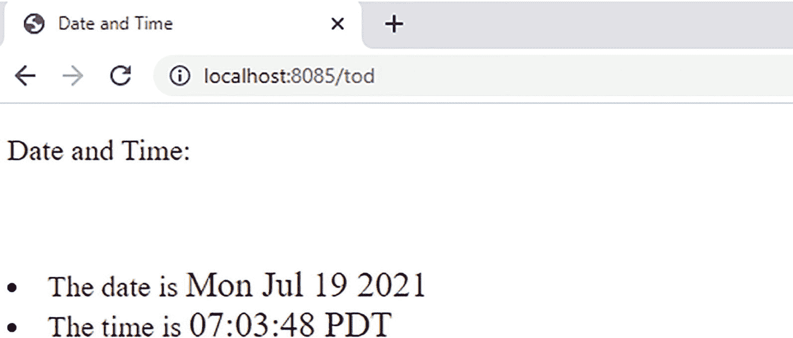

# 十六、客户端和服务器支持

`html`包提供了处理 HTML 文本的函数。Java 标准版(JSE)几乎没有类似的支持；Java 社区提供了大部分这种功能。Go `template`包提供了生成带有值插入的文本输出的模板。它支持纯文本和防黑客 HTML 文本的扩展。

## MIME 包

`mime`包提供了对 MIME 类型的支持。它包含子包:

*   `Multipart`提供 MIME 多部分解析。

*   `Quotedprintable`通过阅读器和编写器提供可打印的引用编码。

## 网络包

`net`包提供了使用 TCP/IP 和套接字级访问和 UDP 的接口。它有几个子包，但本书只介绍了`http`子包。`http`包提供了创建 HTTP 客户端和服务器的能力。它有几个常用的子程序包:

*   `Cgi`为每个请求服务器的通用网关接口(CGI)进程提供支持。

*   `Fcgi`提供对“快速”通用网关接口(CGI)服务器的支持。

*   `Cookiejar`提供对 HTTP cookies 的支持。

*   `Httputil`提供 HTTP helper 实用程序功能。

*   `Textproto`为带有文本头和文本段的协议(如 HTTP 和 SMTP)提供帮助。

## 网络包

`net`包裹很大。它为使用套接字和数据报访问 TCP/IP 网络以及选择协议(如 HTTP)提供基本服务。`net`包有多种类型和功能。它们不会在本书中列出，但可以在网上找到。下面的例子展示了如何使用 API 的一个子集(`Dial`、`Listen`、`Accept`、`Read`和`Write`)。

在我们进入 go 的 HTTP 包之前，我们应该简单讨论一下 TCP/IP 和 HTTP 与 REST 和 RPC。

*终端控制协议*(TCP)<sup>[1](#Fn1)</sup>结合*互联网协议*(IP)<sup>[2](#Fn2)</sup>是互联网的首要基础。它们一起允许在网络上的主机之间进行低级和不可靠的数据报传输或可靠的套接字/会话交换。

*超文本传输协议* (HTTP ) <sup>[3](#Fn3)</sup> 是一种流行的协议，通过 TCP 套接字传递，与*超文本标记语言* (HTML ) <sup>[4](#Fn4)</sup> (和*级联样式表* (CSS ) <sup>[5](#Fn5)</sup> 和 JavaScript 及其他 MIME 类型)相结合，创建了*万维网* (WWW

HTTP 允许多种格式的数据在服务器和客户机(通常是浏览器)之间交换。它支持许多动词，但主要是允许 GET(读取)、PUT(创建或替换)、POST(创建或附加)和 DELETE，也就是 CRUD， <sup>[7](#Fn7)</sup> 资源。

*具象状态转移* (REST，有时 ReST) <sup>[8](#Fn8)</sup> 构建于 HTTP 之上，但对其进行了限制，以提高易用性和可伸缩性。REST 不是一个实现，而是一套设计指南。它反映了 WWW 支持的最可取的品质。它将服务器操作仅限于应用于由 URL 标识的资源的 CRUD。休息做得最大限度地实现了 HATEOAS， <sup>[9](#Fn9)</sup> 这体现了 WWW 组织。大多数 RESTful APIs 都达不到这个水平。RESTful 服务是基于 RPC 的服务的替代品。Go 对这样的服务有很多支持。

*远程过程调用* (RPC) <sup>[10](#Fn10)</sup> 是使用 HTTP(或其他协议)的另一种方式，与 REST 相比，它限制更少(通常性能更好)，允许用户创建服务器提供给其客户端(几乎总是程序，而不是人)的任意操作(过程)。

*Web 服务*(WS)<sup>[11](#Fn11)</sup>RPC 的一种形式，通常通过 *SOAP* 、 <sup>[12](#Fn12)</sup> 一种基于 XML 的协议实现，使用 HTTP。相对于 RESTful 服务，这种服务已经失宠了。Go 对基于 SOAP 的 WS 几乎没有标准库支持。

Go 在`net/rpc/jsonrpc`包中有有限的标准 RPC 支持。一个更强大更受欢迎的社区选项是谷歌的 *gRPC* <sup>[13](#Fn13)</sup> 。

`net`包的 Go 的`http`和`rpc`子包允许一个人开发这些级别的程序。这本书主要讨论 REST 风格的访问。

这一切都是建立在基于底层 TCP/IP<sup>[14](#Fn14)</sup>T5】Socket<sup>[15](#Fn15)</sup>–的通信上。Go 在`net`包中也支持在这一层工作。

下面包括一个简单的 TCP 套接字客户机/服务器对。他们演示了通过套接字进行的基本通信。请注意，与进行 HTTP 通信(如本书中的其他示例所示)相比，使用套接字方法会更加复杂(需要更多代码)。下面的代码效率很低，因为每个连接只允许一个请求(这类似于 HTTP 版本 1)。它也是低效的，因为它一次读取/写入一个字节的数据。

作为演示，我们将运行一个启动服务器并发出多个请求的配置(所有请求通常在不同的机器上启动，但在这里通过多个 goroutines 进行模拟)。这个演示开始在后台以随机的时间间隔发送 10 个请求，其中有一些是重叠的，然后快速地(在任何请求丢失之前)启动一个服务器来处理它们。该演示被硬编码为对服务器使用`localhost:8080`。注意服务器处理并发请求(`nest`值有时大于 1；在示例输出中观察到三个)。

服务器分两部分工作:

1.  接受连接的长时间运行的循环。

2.  在接受的连接上处理请求的 goroutine 可以有任意数量的这样的处理器同时运行。

前面的模式是服务器请求处理的典型模式。在其他语言中，比如 Java，一个 OS 线程(通常来自一个有限的线程池)通常用于每个请求；在 Go 中，用 goroutine 代替。这可以使用 Go 实现更好的请求规模。

如清单 [16-1](#PC1) 所示，客户端发送命令，服务器发送响应。命令是带有消息结束标记的字符串(“~”不能是消息文本的一部分)。

关于`getGID()`的定义，参见`log`封装部分。

```go
var xlog = log.New(os.Stderr, "", log.Ltime+log.Lmicroseconds)

func main(){
     var wg sync.WaitGroup
     wg.Add(1)
     go SocketClientGo(&wg)
     ss := NewSocketServer()
     go func() {
          gid := getGID()
          err := ss.AcceptConnections(8080)
          if err != nil {
              xlog.Printf("%5d testSocketServer accept failed: %v\n", gid, err)
               return
          }
     }()
     wg.Wait()
     ss.Accepting = false
}

func SocketClientGo(wg *sync.WaitGroup) {
     defer wg.Done()
     gid := getGID()
     cmds := []string{TODCommand, SayingCommand}
     max := 10

     var xwg sync.WaitGroup
     for i := 0; i < max; i++ {
          xwg.Add(1)
          go func(index, max int) {
               defer xwg.Done()
               time.Sleep(time.Duration(rand.Intn(5)) * time.Second)
               sc := newSocketClient("127.0.0.1", 8080)
               xlog.Printf("%5d SocketClientGo request %d of %d\n", gid, index, max)
               resp, err := sc.GetCmd(cmds[rand.Intn(len(cmds))])
               if err != nil {
                    xlog.Printf("%5d SocketClientGo failed: %v\n", gid, err)
                    return
               }
               xlog.Printf("%5d SocketClientGo response: %s\n", gid, resp)
          }(i+1, max)
     }
     xwg.Wait()
}

// allowed commands
const (
     TODCommand    = "TOD"
     SayingCommand = "Saying"
)

var delim = byte('~')

// some saying to return
var sayings = make([]string, 0, 100)

func init(){
    sayings = append(sayings,
     `Now is the time...`,
     `I'm busy.`,
     `I pity the fool that tries to stop me!`,
     `Out wit; Out play; Out last!`,
     `It's beginning to look like TBD!`,
     )
}

// a Server
type SocketServer struct {
     Accepting bool
}

func NewSocketServer() (ss *SocketServer) {
     ss = &SocketServer{}
     ss.Accepting = true
     return
}

// Accept connection until told to stop.
func (ss *SocketServer) AcceptConnections(port int) (err error) {
     gid := getGID()
     xlog.Printf("%5d accept listening on port: %d\n", gid, port)
     listen, err := net.Listen("tcp", fmt.Sprintf("127.0.0.1:%d", port))
     if err != nil {
          return
     }
     for ss.Accepting {
          conn, err := listen.Accept()
          if err != nil {
               xlog.Printf("%5d accept failed: %v\n", gid,err)
               continue
          }
          xlog.Printf("%5d accepted connection: %#v\n", gid, conn)
          go ss.handleConnectionGo(conn)
     }
     return
}

var nesting int32

// Process each connection.
// Only one command per connection.
func (ss *SocketServer) handleConnectionGo(c net.Conn) {
     defer c.Close()
     nest := atomic.AddInt32(&nesting, 1)
     defer func(){
          atomic.AddInt32(&nesting, -1)
     }()
     gid := getGID()
     data := make([]byte, 0, 1000)
     err := readData(c, &data, delim, cap(data))
     if err != nil {
          xlog.Printf("%5d handleConnection failed: %v\n", gid, err)
          return
     }

     cmd := string(data)
     xlog.Printf("%5d handleConnection request: %s, nest: %d, conn: %#v\n", gid, cmd, nest, c)
     if strings.HasSuffix(cmd, string(delim)) {
          cmd = cmd[0 : len(cmd)-1]
     }
     xlog.Printf("%5d received command: %s\n", gid, cmd)
     time.Sleep(time.Duration(rand.Intn(500)) * time.Millisecond)  // make request take a while
     var out string
     switch cmd {
     case SayingCommand:
          out = sayings[rand.Intn(len(sayings))]
     case TODCommand:
          out = fmt.Sprintf("%s", time.Now())
     default:
          xlog.Printf("%5d handleConnection unknown request: %s\n", gid, cmd)
          out = "bad command: " + cmd
     }
     _, err = writeData(c, []byte(out+string(delim)))
     if err != nil {
          xlog.Printf("%5d %s failed: %v\n", gid, cmd, err)
     }

}

// a Client
type SocketClient struct {
     Address    string
     Port       int
     Connection net.Conn
}

func newSocketClient(address string, port int) (sc *SocketClient) {
     sc = &SocketClient{}
     sc.Address = address
     sc.Port = port
     return
}

func (sc *SocketClient) Connect() (err error) {
     gid := getGID()
     xlog.Printf("%5d attempting connection: %s:%d\n", gid, sc.Address, sc.Port)
     sc.Connection, err = net.Dial("tcp", fmt.Sprintf("%s:%d", sc.Address, sc.Port))
     if err != nil {
          return
     }
     xlog.Printf("%5d made connection: %#v\n", gid, sc.Connection)
     return
}
func (sc *SocketClient) SendCommand(cmd string) (err error) {
     gid := getGID()
     c, err := sc.Connection.Write([]byte(cmd + string(delim)))
     if err != nil {
          return
     }
     xlog.Printf("%5d sent command: %s, count=%d\n", gid, cmd, c)
     return
}
func (sc *SocketClient) ReadResponse(data *[]byte, max int) (err error) {
     err = readData(sc.Connection, data, delim, 1000)
     return
}

// send command and get response.
func (sc *SocketClient) GetCmd(cmd string) (tod string, err error) {
     err = sc.Connect()
     if err != nil {
          return
     }
       defer sc.Connection.Close()
     err = sc.SendCommand(cmd)
     data := make([]byte, 0, 1000)
     err = readData(sc.Connection, &data, delim, cap(data))
     if err != nil {
          return
     }
     tod = string(data)
     return
}

func readData(c net.Conn, data *[]byte, delim byte, max int) (err error) {
     for {
          xb := make([]byte, 1, 1)
          c, xerr := c.Read(xb)
          if xerr != nil {
               err = xerr
               return
          }
          if c > 0 {
               if len(*data) > max {
                    break
               }
               b := xb[0]
               *data = append(*data, b)
               if b == delim {
                    break
               }
          }
     }
     return
}
func writeData(c net.Conn, data []byte) (count int, err error) {
     count, err = c.Write(data)
     return
}

Listing 16-1Sample TCP/IP Socket Usage

```

这会产生以下输出(每次运行可能会有所不同)。每一行都有一个时间戳和一个 goroutine id。这使你能够相对地分辨出哪个消息来自哪个路由器，以及何时来自哪个路由器。goroutine ids 并不重要，但是它们在某个 goroutine 的每一行中都是相同的。新的 go routine 可以重用已完成的 go routine 以前的 id。请注意，请求是以明显随机的顺序发送的。

定制的记录器用于删除正常输出的日期:

```go
09:32:57.910516    20 accept listening on port: 8080
09:32:57.911512    19 SocketClientGo request 7 of 10
09:32:57.911512    19 SocketClientGo request 9 of 10
09:32:57.911512    19 SocketClientGo request 8 of 10
09:32:57.912507    13 attempting connection: 127.0.0.1:8080
09:32:57.912507    11 attempting connection: 127.0.0.1:8080
09:32:57.912507    12 attempting connection: 127.0.0.1:8080
09:32:57.914499    11 made connection: &net.TCPConn{conn:net.conn{fd:(*net.netFD)(0xc000298000)}}
09:32:57.914499    12 made connection: &net.TCPConn{conn:net.conn{fd:(*net.netFD)(0xc00021a000)}}
09:32:57.914499    20 accepted connection: &net.TCPConn{conn:net.conn{fd:(*net.netFD)(0xc0000cc000)}}
09:32:57.914499    13 made connection: &net.TCPConn{conn:net.conn{fd:(*net.netFD)(0xc000198000)}}
09:32:57.914499    12 sent command: TOD, count=4
09:32:57.914499    11 sent command: TOD, count=4
09:32:57.914499    13 sent command: Saying, count=7
09:32:57.914499    20 accepted connection: &net.TCPConn{conn:net.conn{fd:(*net.netFD)(0xc000298280)}}
09:32:57.914499    15 handleConnection request: TOD~, nest: 1, conn: &net.TCPConn{conn:net.conn{fd:(*net.netFD)(0xc0000cc000)}}
09:32:57.914499    15 received command: TOD
09:32:57.914499    20 accepted connection: &net.TCPConn{conn:net.conn{fd:(*net.netFD)(0xc000316000)}}
09:32:57.914499    51 handleConnection request: TOD~, nest: 2, conn: &net.TCPConn{conn:net.conn{fd:(*net.netFD)(0xc000298280)}}
09:32:57.914499    51 received command: TOD
09:32:57.914499    82 handleConnection request: Saying~, nest: 3, conn: &net.TCPConn{conn:net.conn{fd:(*net.netFD)(0xc000316000)}}
09:32:57.914499    82 received command: Saying
09:32:58.004647    19 SocketClientGo response: 2020-12-29 09:32:58.0046474 -0800 PST m=+0.097117101~
09:32:58.150718    19 SocketClientGo response: 2020-12-29 09:32:58.150718 -0800 PST m=+0.243187101~
09:32:58.190435    19 SocketClientGo response: I'm busy.~
09:32:58.925744    19 SocketClientGo request 1 of 10
09:32:58.925744    19 SocketClientGo request 2 of 10
09:32:58.925744    19 SocketClientGo request 5 of 10
09:32:58.925744     6 attempting connection: 127.0.0.1:8080
09:32:58.925744     5 attempting connection: 127.0.0.1:8080
09:32:58.925744     9 attempting connection: 127.0.0.1:8080
09:32:58.925744     5 made connection: &net.TCPConn{conn:net.conn{fd:(*net.netFD)(0xc00014cc80)}}
09:32:58.925744    20 accepted connection: &net.TCPConn{conn:net.conn{fd:(*net.netFD)(0xc000298780)}}
09:32:58.925744     6 made connection: &net.TCPConn{conn:net.conn{fd:(*net.netFD)(0xc000316280)}}
09:32:58.925744     9 made connection: &net.TCPConn{conn:net.conn{fd:(*net.netFD)(0xc000298500)}}
09:32:58.925744     5 sent command: Saying, count=7
09:32:58.925744     6 sent command: Saying, count=7
09:32:58.925744     9 sent command: TOD, count=4
09:32:58.925744    20 accepted connection

: &net.TCPConn{conn:net.conn{fd:(*net.netFD)(0xc000298a00)}}
09:32:58.925744    53 handleConnection request: TOD~, nest: 1, conn: &net.TCPConn{conn:net.conn{fd:(*net.netFD)(0xc000298780)}}
09:32:58.925744    53 received command: TOD
09:32:58.925744    54 handleConnection request: Saying~, nest: 2, conn: &net.TCPConn{conn:net.conn{fd:(*net.netFD)(0xc000298a00)}}
09:32:58.925744    54 received command: Saying
09:32:58.925744    20 accepted connection: &net.TCPConn{conn:net.conn{fd:(*net.netFD)(0xc00021a280)}}
09:32:58.925744    35 handleConnection request: Saying~, nest: 3, conn: &net.TCPConn{conn:net.conn{fd:(*net.netFD)(0xc00021a280)}}
09:32:58.925744    35 received command: Saying
09:32:58.954615    19 SocketClientGo response: Out wit; Out play; Out last!~
09:32:59.393099    19 SocketClientGo response: I pity the fool that tries to stop me!~
09:32:59.420974    19 SocketClientGo response: 2020-12-29 09:32:59.4209749 -0800 PST m=+1.513438801~
09:32:59.921948    19 SocketClientGo request 10 of 10
09:32:59.921948    19 SocketClientGo request 3 of 10
09:32:59.921948    14 attempting connection: 127.0.0.1:8080
09:32:59.921948     7 attempting connection: 127.0.0.1:8080
09:32:59.921948    14 made connection: &net.TCPConn{conn:net.conn{fd:(*net.netFD)(0xc0000cc280)}}
09:32:59.921948     7 made connection: &net.TCPConn{conn:net.conn{fd:(*net.netFD)(0xc000298c80)}}
09:32:59.921948    20 accepted connection: &net.TCPConn{conn:net.conn{fd:(*net.netFD)(0xc00021a500)}}
09:32:59.921948    14 sent command: Saying, count=7
09:32:59.921948     7 sent command: Saying, count=7
09:32:59.921948    56 handleConnection request: Saying~, nest: 1, conn: &net.TCPConn{conn:net.conn{fd:(*net.netFD)(0xc00021a500)}}
09:32:59.921948    56 received command: Saying
09:32:59.921948    20 accepted connection

: &net.TCPConn{conn:net.conn{fd:(*net.netFD)(0xc00021a780)}}
09:32:59.921948    36 handleConnection request: Saying~, nest: 2, conn: &net.TCPConn{conn:net.conn{fd:(*net.netFD)(0xc00021a780)}}
09:32:59.921948    36 received command: Saying
09:33:00.219828    19 SocketClientGo response: Now is the time...~
09:33:00.314614    19 SocketClientGo response: I'm busy.~
09:33:00.924919    19 SocketClientGo request 6 of 10
09:33:00.924919    10 attempting connection: 127.0.0.1:8080
09:33:00.924919    20 accepted connection: &net.TCPConn{conn:net.conn{fd:(*net.netFD)(0xc00021ac80)}}
09:33:00.924919    10 made connection: &net.TCPConn{conn:net.conn{fd:(*net.netFD)(0xc00021aa00)}}
09:33:00.924919    10 sent command: TOD, count=4
09:33:00.924919    38 handleConnection request: TOD~, nest: 1, conn: &net.TCPConn{conn:net.conn{fd:(*net.netFD)(0xc00021ac80)}}
09:33:00.924919    38 received command: TOD
09:33:01.316527    19 SocketClientGo response: 2020-12-29 09:33:01.3165274 -0800 PST m=+3.408983501~
09:33:01.911216    19 SocketClientGo request 4 of 10
09:33:01.911216     8 attempting connection: 127.0.0.1:8080
09:33:01.911216    20 accepted connection: &net.TCPConn{conn:net.conn{fd:(*net.netFD)(0xc000316780)}}
09:33:01.911216     8 made connection: &net.TCPConn{conn:net.conn{fd:(*net.netFD)(0xc000316500)}}
09:33:01.911216     8 sent command: Saying, count=7
09:33:01.911216    85 handleConnection request: Saying~, nest: 1, conn: &net.TCPConn{conn:net.conn{fd:(*net.netFD)(0xc000316780)}}
09:33:01.911216    85 received command: Saying

09:33:02.349666    19 SocketClientGo response: I'm busy.~

```

注意输出的数量和复杂性，即使对于这个简单的场景也是如此。来自日志的信息量可能会很快失控。这是来自处理许多请求的服务器程序的典型日志，尤其是在云规模上。人们经常使用专门的搜索程序，如 *Elasticsearch* 和 *Kibana* 、 <sup>[16](#Fn16)</sup> 经常结合工具如 *Fluentd* 、 <sup>[17](#Fn17)</sup> 来查看这些日志。

## HTTP 模板包

`template`包提供了安全生成 HTML 文本(根据需要添加 HTML 转义)和包含动态值的服务。`text`包中的`template`子包可以用于更简单的文本，比如电子邮件。Go 有一个默认的模板引擎。Java 没有标准的模板引擎，但是 Java 社区提供了几个。 <sup>[18](#Fn18)</sup>

模板是一个字符串，其中嵌入了一些替换内容。模板中的所有其他文本按原样输出。替换指令(又名*指令*)具有以下形式:`{{ ... }}`，其中……被替换为若干选项之一，包括条件输出或重复输出以及调用 Go 代码来生成输出。人们甚至可以格式化嵌入的模板。可能性是丰富的。全面解释模板功能超出了本书的范围。更深入的解释见 Go 包文档。

模板在某些上下文中求值，通常由结构或映射实例提供。一个例子可以很好地说明这一点:

```go
var tformat = time.RFC850

type Purchase struct {
     FirstName, LastName string
     Address string
     Phone string
     Age float32
     Male bool
     Item string
     ShipDate string
}

var purchases = []Purchase{
     {LastName:"Feigenbaum", ShipDate: time.Now().Format(tformat),
          Male:true, Item:"Go for Java Programmers"},
       //...
}

const purchaseTemplate = `
Dear {{ if .Male}}Mr.{{ else }}Ms.{{ end }} {{.LastName}},
Your purchase request for "{{ .Item }}" has been received.
It will be shipped on {{ .ShipDate }}.
Thank you for your purchase.
`

func runTemplate(p *Purchase, f *os.File, t *template.Template) (err error) {
     err = t.Execute(f, *p)
     return
}

func genTemplate(prefix string)  {
     t := template.Must(template.New("purchases").Parse(purchaseTemplate))
     for i, p := range purchases {
          f, err := os.Create(fmt.Sprintf("%s-%d.tmpl",prefix, i) )
          if err != nil {
               log.Fatalf("failed to create file, cause:", err)
          }
          err = runTemplate(&p, f, t)
          if err != nil {
               log.Fatalf("failed to run template, cause:", err)
          }
     }
}

```

这里，输入购买值提供了在各种替换中要替换的值。使用路径前缀调用 genTemplate 会生成一个文件(`/tmp/example-0.tmpl`)，其内容为:

```go
Dear Mr. Feigenbaum,
Your purchase request for "Go for Java Programmers" has been received.
It will be shipped on Friday, 07-May-21 06:19:24 PDT.
Thank you for your purchase.

```

需要注意的是，模板可以在内存中，也可以存储在外部，比如文件中。这使得它们的行为很像 Jakarta 企业版中定义的 *Java 服务器页面* <sup>[19](#Fn19)</sup> (JSP)模板。JSP 被动态转换成 Java*servlet*<sup>[20](#Fn20)</sup>然后运行。Go 模板总是被解释。这使得 Java (servlet)方式对于大量工作更有效，但是对于少量工作成本更高。

作为一个例子，这里有一个完整的 HTTP 服务器，它可以呈现一个模板。它可以很容易地扩展为呈现多个模板，比如每个请求处理程序一个模板。

假设有一个文件“tod.tmpl ”,其内容是以下类似 HTML 的文本:

```go
<!DOCTYPE HTML>
<html>
<head><title>Date and Time</title></head>
<body>
<p>Date and Time:</p>
<br><br>
<sl>
<li>The date is <big>{{ .TOD | formatDate }}</big>
<li>The time is <big>{{ .TOD | formatTime }}</big>
</sl>
</body>

</html>

```

清单 [16-2](#PC6) 显示了使用它的完整代码。

```go
package main

import (
     "fmt"
     "io/ioutil"
     "log"
     "net/http"
     "text/template"
     "time"
)

var functionMap = template.FuncMap{
     "formatDate": formatDate,
     "formatTime": formatTime,
}
var parsedTodTemplate *template.Template

func loadTemplate(path string) {
     parsedTodTemplate = template.New("tod")
     parsedTodTemplate.Funcs(functionMap)
     data, err := ioutil.ReadFile(path)
     if err != nil {
          log.Panicf("failed reading template %s: %v", path, err)
     }
     if _, err := parsedTodTemplate.Parse(string(data)); err != nil {
          log.Panicf("failed parsing template %s: %v", path, err)
     }
}
func formatDate(dt time.Time) string {
     return dt.Format("Mon Jan _2 2006")
}
func formatTime(dt time.Time) string {
     return dt.Format("15:04:05 MST")
}

type TODData struct {
     TOD time.Time
}

func processTODRequest(w http.ResponseWriter, req *http.Request) {
     var data = &TODData{time.Now()}
     parsedTodTemplate.Execute(w, data) // assume cannot fail
}

var serverPort = 8085

func timeServer() {
     loadTemplate( `C:\Temp\tod.tmpl`)
     http.HandleFunc("/tod", processTODRequest)
     spec := fmt.Sprintf(":%d", serverPort)
     if err := http.ListenAndServe(spec, nil); err != nil {
          log.Fatalf("failed to start server on port %s: %v", spec, err)
     }
     log.Println("server exited")
}

func main() {
     timeServer()
}

Listing 16-2Time Server Implementation

```

注意错误处理没有完成。

类似`http://localhost:8085/tod`的请求产生如图 [16-1](#Fig1) 所示的输出。



图 16-1

时间服务器输出

## 网。HTTP 包

`net.http`包裹很大。它为 TCP/IP 上的 HTTP 访问提供基本服务。它使得创建 HTTP 客户机和服务器，尤其是类似 REST 的服务器，变得相对容易。如前所述，结合 Go 模板，它可以使提供可变的 HTML 内容(很像 Java 中的 servlets)变得容易。静态 HTML，CSS，JS 等。文件中的内容也很容易提供。Go 1.16 增加了访问捆绑在可执行文件中的静态内容的能力；这允许将全功能的 web 服务器构建到单个可分发文件中。有关更多详细信息，请参见 Go 1.16 发行说明。

`http`包为各种 HTTP 方法和状态代码提供了常量。它有以下几个关键变量:

`var DefaultClient`–由内置的 Head、Get 和 Post 方法使用

`var DefaultServeMux`–Serve 方法在未提供覆盖时使用的 ServeMux

空空的身体

`http`包提供了这些功能。有些是不言自明的:

*   func canonical header key(s string)string–返回一个规范的头名称

*   func detect content type(data[]byte)字符串-对内容类型的有根据的猜测

*   函数错误(w ResponseWriter，错误字符串，代码 int)-返回一个 HTTP 错误

*   func Handle(模式字符串，处理程序 Handler)-注册一个请求处理程序

*   func HandleFunc(模式字符串，处理程序 func(ResponseWriter，* Request))–注册一个处理程序函数

*   func ListenAndServe(addr string，handler Handler)错误–开始接受 HTTP 请求

*   func ListenAndServeTLS(addr，certFile，keyFile string，handler Handler)错误–开始接受 HTTP 和 HTTPS 请求

*   func max bytes reader(w response writer，r io。ReadCloser，n int64) io。read closer——做一个有限的读者

*   func NotFound(w ResponseWriter，r * Request)-返回 HTTP 404

*   func ParseHTTPVersion(到字符串)(major、minor int、ok bool)

*   func ParseTime(文本字符串)(t time。时间，误差误差)

*   func proxy from environment(req * Request)(* URL。URL，错误)–返回代理 URL(如果有)

*   func Redirect(w ResponseWriter，r *Request，url string，code int)-返回重定向响应

*   功能服务(l 网络。Listener，handler Handler)错误-接受 HTTP 请求。在新的 goroutine 中处理每个

*   func serve content(w response writer，req *Request，名称字符串，modtime 时间。时间，内容 io。read seeker)–返回提供的内容(通常是文件的内容)

*   func ServeFile(w ResponseWriter，r *Request，name string)-读取并提供文件/目录

*   func ServeTLS(l net。侦听器、处理程序处理程序、证书文件、密钥文件字符串)错误–服务 HTTP 和 HTTPS

*   func SetCookie(w ResponseWriter，Cookie * Cookie)-设置一个响应 Cookie

*   func status text(code int)string–获取 HTTP 状态代码的文本

客户端支持 HTTP 客户端。它提供了这些功能。有些是不言自明的:

*   func(c * Client)CloseIdleConnections()

*   func(c * Client)Do(req * Request)(* Response，error)-发送/接收请求

*   func (c *Client) Get(url 字符串)(resp *Response，err error)-执行 Get

*   func (c *Client) Head(url 字符串)(resp *Response，err error)-Do Head

*   func (c *Client) Post(url，contentType 字符串，body io。Reader) (resp *Response，err error)-用正文发布帖子

*   func (c *Client) PostForm(url 字符串，数据 url。Values) (resp *Response，err error)-用 0+表单值执行 POST

CloseNotifier 允许在连接关闭时发出通知。

ConnState 允许观察连接。

Cookie 代表一个 HTTP cookie。

CookieJar 表示一组 cookies。

Dir 允许访问目录。

*   func (d Dir) Open(名称字符串)(文件，错误)

文件允许访问文件。

文件系统允许访问多个静态文件。它使得实现一个静态内容(比如图片、HTML、CSS 等。)服务器简单。

处理程序响应 HTTP 请求。它们提供以下功能:

*   func 文件服务器(根文件系统)处理程序

*   func NotFoundHandler()处理程序

*   func 重定向处理程序(url 字符串、int 代码)处理程序

*   func StripPrefix(前缀字符串，h 处理程序)处理程序

*   func TimeoutHandler(h Handler，dt time。持续时间，消息字符串)处理程序

HandlerFuncs 响应 HTTP 请求。它们提供以下功能:

*   func(f handler func)ServeHTTP(w response writer，r *Request)

Header 表示 HTTP 请求/响应头:

*   func (h Header) Add(键，值字符串)

*   func (h 头)Clone()头

*   func (h Header) Del(密钥字符串)

*   func (h Header) Get(key string)字符串

*   func (h Header)集合(键，值字符串)

*   func (h Header)值(密钥字符串)[]字符串

*   func (h 头)写(w io。Writer)错误

*   func (h Header) WriteSubset(w io。Writer，exclude map[string]bool)错误–写入选定的标头

Request 表示客户端请求。它提供了这些功能。许多人使用请求的字段:

*   func NewRequest(方法，url 字符串，正文 io。读者)(*请求，错误)-提出请求

*   func NewRequestWithContext(ctx 上下文。上下文、方法、url 字符串、正文 io。Reader) (*Request，error)–提出带有上下文的请求

*   func ReadRequest(b *bufio。读取器)(*请求，错误)–解析请求

*   func(r * Request)Add Cookie(c * Cookie)-添加一个 Cookie

*   func (r *Request) BasicAuth()(用户名，密码字符串，ok bool)-使用基本身份验证从请求中获取凭据

*   func (r *Request)克隆(ctx 上下文。上下文)*请求–在新的上下文中进行克隆

*   func (r *Request)上下文()上下文。语境

*   func (r *Request) Cookie(名称字符串)(*Cookie，错误)

*   func(r * Request)Cookie()[]* Cookie

*   func (r *Request)表单文件(密钥字符串)(多部分。文件，*多部分。文件头，错误)

*   func (r *Request) FormValue(密钥字符串)字符串

*   func(r * Request)multipart reader()(* multipart。阅读器，错误)

*   func (r *Request) ParseForm()错误–设置字段表单数据

*   func(r * Request)ParseMultipartForm(maxMemory int 64)错误–设置表单数据的字段

*   func(r * Request)PostFormValue(key string)string–设置字段表单数据

*   func(r * Request)proto 至少(major，minor int)bool–至少测试一个协议版本

*   func (r *Request) Referer()字符串

*   func (r *Request) SetBasicAuth(用户名，密码字符串)

*   func (r *Request) UserAgent()字符串

*   func(r * Request)with context(CTX context。上下文)*请求

*   func(r *请求)写(w io。Writer)错误

*   func (r *Request) WriteProxy(w io。Writer)错误

Response 表示服务器响应和 HTTP 操作:

*   func Get(url 字符串)(resp *Response，err error)-执行 Get 请求

*   func Head(url 字符串)(resp *Response，err error)-执行 Head 请求

*   func Post(url，contentType 字符串，body io。Reader) (resp *Response，err error)-用正文执行 POST 请求

*   func PostForm(url 字符串，数据 url。Values) (resp *Response，err error)-用表单数据执行 POST 请求

*   func ReadResponse(r *bufio。Reader，req *Request) (*Response，error)——做一个 HTTP 请求；做出回应

*   func(r * Response)Cookie()[]* Cookie

*   func(r * Response)Location()(* URL。URL，错误)

*   func(r * Response)proto minimum(major，minor int) bool

*   func (r *Response)写(w io。Writer)错误–发送响应

RoundTripper 基于不同的协议封装发送/接收事务:

*   func NewFileTransport(fs 文件系统)往返

ServeMux 解码传入的请求:

*   func NewServeMux()* ServeMux–制作解码器

*   func (mux *ServeMux) Handle(模式字符串，处理程序 Handler)-解码请求

*   func (mux *ServeMux) HandleFunc(模式字符串，处理程序 func(ResponseWriter，* Request))–解码请求

*   func (mux *ServeMux)处理程序(r *Request) (h 处理程序，模式字符串)-接收请求

*   func(mux * serve mux)serve HTTP(w response writer，r * Request)-启动 HTTP 服务器

服务器提供基本的 HTTP 服务器行为:

*   func (srv *Server) Close()错误–停止请求处理

*   func (srv *Server) ListenAndServe()错误–开始提供 HTTP

*   func(SRV * Server)ListenAndServeTLS(certFile，keyFile string)错误–开始提供 HTTP 和 HTTPS 服务

*   func(SRV * Server)registersonshutdown(f func())–注册关闭回调

*   func (srv *Server) Serve(l net。Listener)错误–开始提供 HTTP 服务

*   func (srv *Server) ServeTLS(l net。监听器，证书文件，密钥文件字符串)错误–开始提供 HTTP 和 HTTPS 服务

*   func(SRV *服务器)关闭(ctx 上下文。上下文)错误–关闭请求处理

传输提供了往返数据移动。它管理客户端和服务器之间的连接状态。它配置 TCP 连接:

*   func (t *Transport)取消请求

*   func(t *传输)Clone()*传输

*   func(t * Transport)CloseIdleConnections()

*   func(t * Transport)Register protocol(scheme string，rt round tripler)-注册一个协议处理程序

*   func (t *Transport)往返(req * Request)(*响应，错误)

清单 [16-3](#PC7) 显示了一个完整但功能较低的类似 HTTP REST 的服务器的例子。

```go
package main

import (
     "fmt"
     "io"
     "log"
     "net/http"
     "strings"
     "time"
)

func greet(w http.ResponseWriter, req *http.Request) {
     if req.Method != "GET" {
          http.Error(w, fmt.Sprintf("Method %s not supported", req.Method), 405)
          return
     }
     var name string
     if err := req.ParseForm(); err == nil {
          name = strings.TrimSpace(req.FormValue("name"))
     }
     if len(name) == 0 {
          name = "World"
     }
     w.Header().Add(http.CanonicalHeaderKey("content-type"),
          "text/plain")
     io.WriteString(w, fmt.Sprintf("Hello %s!\n", name))
}

func now(w http.ResponseWriter, req *http.Request) {
     // request checks like in greet
     w.Header().Add(http.CanonicalHeaderKey("content-type"),
          "text/plain")
     io.WriteString(w, fmt.Sprintf("%s", time.Now()))
}

func main() {
     fs := http.FileServer(http.Dir(`/temp`))

     http.HandleFunc("/greet", greet)
     http.HandleFunc("/now", now)
     http.Handle( "/static/", http.StripPrefix( "/static", fs ) )
     log.Fatal(http.ListenAndServe(":8088", nil))
}

Listing 16-3Basic Hello World, Time and File HTTP Server

```

这提供了两条路径:

1.  greet–返回所提供名称的问候语

2.  now–返回服务器的当前时间

它在端口 8080 上为他们服务。

一些样本结果如图 [16-2](#Fig2) 、 [16-3](#Fig3) 和 [16-4](#Fig4) 所示。


图 16-4

文件服务器响应 1


图 16-3

时间服务器响应


图 16-2

Hello 服务器响应

或者对于未知文件，参见图 [16-5](#Fig5) 。


图 16-5

文件服务器响应 2

但是如果使用了无效的 HTTP 方法，请参见图 [16-6](#Fig6) 。


图 16-6

错误的请求响应

处理程序(默认情况下)返回带有`text/plain`内容类型的 HTTP 200 响应。处理程序由`HandleFunc`保存在一个全局列表中，由传递给`ListenAndServer` (LnS)的`nil`值使用。如果服务器不能启动(比如说端口 8080 已经被使用了)，服务器程序就会出错结束；否则，LnS 函数不会返回。

服务器将处理传入的请求，直到被操作系统终止。每个请求都在它自己的线程中运行，所以服务器是高性能的，并且服务器可以处理许多并发请求。

`http`包提供了一个简单易用的文件服务器。其中一个已经包含在前面带有`static`路由的示例服务器代码中。如图 [16-7](#Fig7) 所示使用。


图 16-7

文件服务器示例输出；服务文本文件的内容

该特性可用于提供静态内容，如 HTTP、CSS、图像、JavaScript 等。必须注意不要共享服务器的私有数据。

作为 Go to Node.js 相似性的一个例子，考虑这个相似的(只有一个函数并且没有错误检查)等价物，它由 Node.js 引擎运行。以下是用 JavaScript 写的:

```go
const http = require('http');
const os = require('os');
var todHandler = function(req, resp) {
   resp.writeHead(200);
   resp.end(new Date().toString());
}
var server = http.createServer(todHandler);
server.listen(8080);

```

## 包 URL

`url`包是一个`net`子包，提供 URL 解析和处理。

它具有以下功能和类型:

*   func path escape(s string)string–URL 转义路径

*   func path unescape(s string)(string，error)-反转转义

*   func query scape(s string)string–URL 转义查询字符串

*   func query escape(s string)(string，error)-反转转义

URL 在 URL 上提供函数。大多数函数获取/测试部分解析的 URL:

*   func Parse(rawurl 字符串)(*url，错误)-解析任何 URL

*   func ParseRequestURI(rawurl 字符串)(*URL，错误)-解析 URL；不允许有碎片

*   func (u *URL) EscapedFragment()字符串

*   func (u *URL) EscapedPath()字符串

*   func (u *URL) Hostname()字符串

*   func (u *URL) IsAbs() bool

*   func(u * URL)Parse(ref string)(* URL，error)-在此 URL 的上下文中解析

*   func (u *URL) Port()字符串

*   func (u *URL)查询()值

*   func (u *URL)密文()字符串

*   func (u *URL) RequestURI() string

*   func(u * URL)Resolve reference(ref * URL)* URL–在此 URL 的上下文中解析

Userinfo 提供用户凭据:

*   func user(username string)* user info

*   func UserPassword(用户名，密码字符串)*Userinfo

*   func(u * userid info)password()(string，bool)

*   func(u * userid info)username()字符串

Values 提供了获取/使用路径和查询参数的函数:

*   func ParseQuery(查询字符串)(值，错误)-将查询参数解析为值

*   func (v Values) Add(key，value string)–将值添加到键值中

*   func (v 值)Del(密钥字符串)–删除密钥

*   func (v 值)Encode()字符串–URL 编码值

*   func(v Values)Get(key string)string–获取键的第一个值

*   func (v Values) Set(key，value string)–重置键值

<aside aria-label="Footnotes" class="FootnoteSection" epub:type="footnotes">Footnotes [1](#Fn1_source)

[T2`https://en.wikipedia.org/wiki/Transmission_Control_Protocol`](https://en.wikipedia.org/wiki/Transmission_Control_Protocol)

  [2](#Fn2_source)

[T2`https://en.wikipedia.org/wiki/Internet_Protocol`](https://en.wikipedia.org/wiki/Internet_Protocol)

  [3](#Fn3_source)

[T2`https://en.wikipedia.org/wiki/Hypertext_Transfer_Protocol`](https://en.wikipedia.org/wiki/Hypertext_Transfer_Protocol)

  [4](#Fn4_source)

[T2`https://en.wikipedia.org/wiki/HTML`](https://en.wikipedia.org/wiki/HTML)

  [5](#Fn5_source)

[T2`https://en.wikipedia.org/wiki/CSS`](https://en.wikipedia.org/wiki/CSS)

  [6](#Fn6_source)

[T2`https://en.wikipedia.org/wiki/World_Wide_Web`](https://en.wikipedia.org/wiki/World_Wide_Web)

  [7](#Fn7_source)

[T2`https://en.wikipedia.org/wiki/Create,_read,_update_and_delete`](https://en.wikipedia.org/wiki/Create,_read,_update_and_delete)

  [8](#Fn8_source)

[T2`https://en.wikipedia.org/wiki/Representational_state_transfer`](https://en.wikipedia.org/wiki/Representational_state_transfer)

  [9](#Fn9_source)

[T2`https://en.wikipedia.org/wiki/HATEOAS`](https://en.wikipedia.org/wiki/HATEOAS)

  [10](#Fn10_source)

[T2`https://en.wikipedia.org/wiki/Remote_procedure_call`](https://en.wikipedia.org/wiki/Remote_procedure_call)

  [11](#Fn11_source)

[T2`https://en.wikipedia.org/wiki/Web_service`](https://en.wikipedia.org/wiki/Web_service)

  [12](#Fn12_source)

[T2`https://en.wikipedia.org/wiki/SOAP`](https://en.wikipedia.org/wiki/SOAP)

  [13](#Fn13_source)

[T2`https://en.wikipedia.org/wiki/GRPC`](https://en.wikipedia.org/wiki/GRPC)

  [14](#Fn14_source)

[T2`https://en.wikipedia.org/wiki/Internet_protocol_suite`](https://en.wikipedia.org/wiki/Internet_protocol_suite)

  [15](#Fn15_source)

[T2`https://en.wikipedia.org/wiki/Network_socket`](https://en.wikipedia.org/wiki/Network_socket)

  [16](#Fn16_source)

[T2`www.elastic.co/guide/en/kibana/current/introduction.html`](http://www.elastic.co/guide/en/kibana/current/introduction.html)

  [17](#Fn17_source)

[T2`https://en.wikipedia.org/wiki/Fluentd`](https://en.wikipedia.org/wiki/Fluentd)

  [18](#Fn18_source)

这里有的描述: [`https://dzone.com/articles/template-engines-at-one-spring-boot-and-engines-se`](https://dzone.com/articles/template-engines-at-one-spring-boot-and-engines-se) 。此外，任何 JEE Java 服务器页面(JSP)引擎，如 Apache*Tomcat*([`http://tomcat.apache.org/`](http://tomcat.apache.org/))。

  [19](#Fn19_source)

[T2`https://en.wikipedia.org/wiki/Jakarta_Server_Pages`](https://en.wikipedia.org/wiki/Jakarta_Server_Pages)

  [20](#Fn20_source)

[T2`https://en.wikipedia.org/wiki/Jakarta_Servlet`](https://en.wikipedia.org/wiki/Jakarta_Servlet)

 </aside>