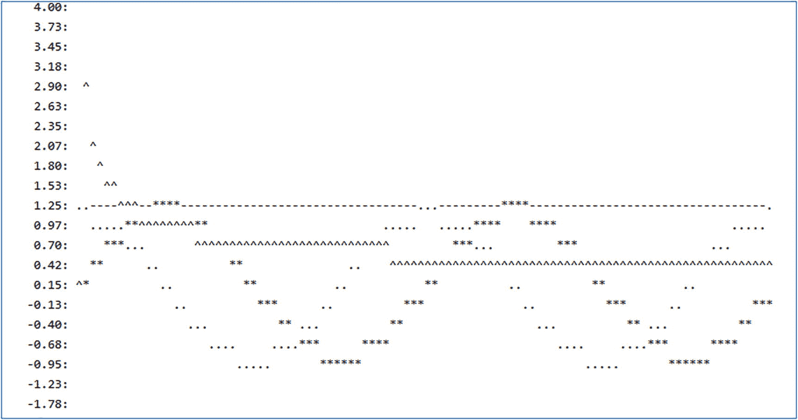

# 十七、运行时

本章介绍了几个与 Go 运行时相关的 Go 包。

## 错误包

`errors`包提供了帮助创建和选择错误的功能。存在许多社区扩展，一些插入式替代。

有一个内置的`error`类型。所有错误都实现了这个预定义的接口:

```go
type error interface {
      Error() string
}

```

这意味着任何符合这个接口的类型(例如，有`Error`方法)都可以被用作错误。这意味着可以创建许多自定义错误。许多 Go 包提供自定义错误，通常包括关于失败的补充信息。例如，考虑`os.PathError`类型:

```go
type PathError struct {
      Op string    // failed operation
      Path string  // failed on path
      Err error    // root cause, if any
}

```

所有的自定义错误都需要实现`error`接口，比如前面的错误:

```go
func (pe *PathError) Error() string {
      if pe.Err == nil {
            return fmt.Sprintf("PathError %s:%s", pe.Op, pe.Path)
      }
      return fmt.Sprintf("PathError %s:%s:%v", pe.Op, pe.Path, pe.Err.Error())
}

```

自定义错误类型可以是任何基类型，而不仅仅是结构，如字符串。例如:

```go
type MyError string

func (me MyError) Error() string {
      return string(me)
}

```

`errors`包具有以下功能:

*   func As(err error，target interface { })bool–如果是目标类型，则转换为目标类型；目标是指向接收转换错误的位置的指针。

*   func Is(err，target error)bool–测试目标类型是否为 err。

*   func New(文本字符串)错误–出错。

*   func Unwrap(err error)错误–如果可用，获取包装的错误原因；err 必须有一个`Unwrap()`方法。

通常，错误被声明为顶级值。这样可以测试它们是否相等，或者与前面的函数一起使用，防止返回错误。例如:

```go
var (
      ErrSystem = errors.New("System Error")
      ErrIO = errors.New("I/O Error")
      ErrOther = errors.New("Other Error")
     :
)

```

## 标签封装

`flag`包实现了一种简单但标准化的方法来解析命令行。通常，参数是二进制开关(又名*标志*，因此是包名)。存在许多社区扩展。

flag 包主要作为一个全局库工作，因为它假设只有一个命令行要解析。定义了各种可能的命令行值，然后解析命令行来查找这些值，并设置任何找到的值。还提供了描述参数的帮助功能。定义值的方式有几种选择。一般情况下，不要混用`Xxx`和`XxxVar`(其中 Xxx 是类型名)样式；坚持使用它们。

一些示例标志定义:

```go
var iflag int
var fflag float64
var sflag string
func init() {
      flag.IntVar(&iflag, "IntFlag", 1, "IntFlag sets ...")
      flag.Float64Var(&fflag, "FloatFlag", 1.0, "FloatFlag sets ...")
      flag.StringVar(&sflag, "StringFlag", "", "StringFlag sets ...")
}

```

This is indeed a long distance.

标志看起来像命令行中的以下选项之一:

*   `-flag`

*   `-flag=x`

*   `-flag x -`标志不能是布尔类型

`flag`包提供了这个关键变量:

`var CommandLine`–默认访问`os.Args`

`flag`包提供了这些类型:

*   error handling–控制如何处理错误的枚举

*   标志–标志的状态，包括当前值

*   标志集–标志的集合，通常每个可能的标志一个

`flag`包提供了这些功能。他们访问全局标志集:

*   func Arg(I int)string–返回第 I 个非标志参数

*   func Args()[]string–返回所有非标志参数

*   func Bool(名称字符串、值 Bool、用法字符串)* bool 使布尔标志

*   func BoolVar(p *bool，名称字符串，值 bool，用法字符串)-将 p 包装为标志

*   func Duration(名称字符串，值时间。持续时间，使用字符串)*时间。持续时间–制作持续时间标志

*   func DurationVar(p *time。持续时间、名称字符串、值时间。持续时间，用法字符串)–将 p 包装为标志

*   func Float64(名称字符串，值 Float64，用法字符串)* float 64–生成一个浮点标志

*   func Float64Var(p *float64，名称字符串，值 float64，用法字符串)-将 p 包装为标志

*   func int(名称字符串，值 Int，用法字符串)* Int–创建 Int 标志

*   func Int64(名称字符串，值 Int64，用法字符串)* int64–创建 int 64 标志

*   func Int64Var(p *int64，名称字符串，值 int64，用法字符串)–将 p 包装为标志

*   func IntVar(p *int，name string，value int，usage string)–将 p 包装为一个标志

*   func NArg()int–非标志参数的数量

*   func NFlag()int–标志参数的数量

*   func Parse()-解析命令行，并在定义所有标志后设置参数和标志

*   func Parsed()bool–测试是否已解析

*   func print defaults()–向用户描述默认值

*   函数集(名称，值字符串)错误–设置标志的值

*   函数字符串(名称字符串、值字符串、用法字符串)*字符串–创建字符串标志

*   func StringVar(p *string，名称字符串，值字符串，用法字符串)–将 p 包装为标志

*   func uint(名称字符串、值 Uint、用法字符串)* Uint–创建 Uint 标志

*   func Uint64(名称字符串，值 Uint64，用法字符串)* uint64–制作 uint 64 标志

*   func Uint64Var(p *uint64，名称字符串，值 uint64，用法字符串)-将 p 包装为标志

*   func UintVar(p *uint，名称字符串，值 uint，用法字符串)-将 p 包装为标志

*   func UnquoteUsage(flag *Flag)(名称字符串，用法字符串)-获取标志的描述

*   func Var(值 value，名称字符串，用法字符串)-制作一个通用标志

*   func Visit(fn func(* Flag))–将 f 应用于所有设置的标志

*   func visit all(fn func(* Flag))–将 f 应用于所有标志

旗帜有这样的功能:

*   func Lookup(名称字符串)* Flag–按名称获取定义的标志

一个标志集有这些功能。许多与前面描述的相同，不再重复描述:

*   func NewFlagSet(名称字符串，错误处理错误处理)*FlagSet

*   func (f *FlagSet) Arg(i int)字符串

*   func(f * flag set)args()[]字符串

*   func (f *FlagSet) Bool(名称字符串、值布尔、用法字符串)*bool

*   func(f * flag set)boor(p * bool，名称字符串，值 bool，用法字符串)

*   func (f *FlagSet) Duration(名称字符串，值时间。持续时间，使用字符串)*时间。持续时间

*   func(f * FlagSet)duration var(p * time。持续时间、名称字符串、值时间。持续时间、使用字符串)

*   func(f * flag set)error handling()error handling

*   func (f *FlagSet) Float64(名称字符串，值 Float64，用法字符串)*float64

*   func(f * FlagSet)float64 var(p * float 64，名称字符串，值 float 64，用法字符串)

*   func (f *FlagSet) Init(名称字符串，错误处理错误处理)

*   func (f *FlagSet) Int(名称字符串，值 Int，用法字符串)*int

*   func (f *FlagSet) Int64(名称字符串，值 Int64，用法字符串)*int64

*   func(f * FlagSet)int64 var(p * int 64，名称字符串，值 int 64，用法字符串)

*   func (f *FlagSet) IntVar(p *int，名称字符串，值 int，用法字符串)

*   func (f *FlagSet)查找(名称字符串)*标志

*   func (f *FlagSet) NArg() int

*   func (f *FlagSet) NFlag() int

*   func (f *FlagSet) Name()字符串

*   func (f *FlagSet)输出()io。作者

*   func (f *FlagSet)解析(arguments []string)错误

*   func (f *FlagSet) Parsed() bool

*   func (f *FlagSet) PrintDefaults()

*   func (f *FlagSet)集合(名称，值字符串)错误

*   func (f *FlagSet) SetOutput(输出 io。作家)

*   func (f *FlagSet)字符串(名称字符串、值字符串、用法字符串)*字符串

*   func(f * FlagSet)string var(p * string，名称字符串，值字符串，用法字符串)

*   func (f *FlagSet) Uint(名称字符串，值 Uint，用法字符串)*uint

*   func (f *FlagSet) Uint64(名称字符串，值 Uint64，用法字符串)*uint64

*   func(f * FlagSet)uint64 var(p * uint 64，名称字符串，值 uint 64，用法字符串)

*   func (f *FlagSet) UintVar(p *uint，name string，value uint，usage string)

*   func (f *FlagSet) Var(值值，名称字符串，用法字符串)

*   访问(fn func(*Flag))

*   func(f * flag set)visitall(fn func(* flag))

Go `flags`包固执己见。它支持受限样式的标志。不同的操作系统(OS)类型可能有不同的标志样式。尤其是通常使用正斜杠(“/”)字符而不是破折号(“-”)来引入标志的 Windows。

为了使您的程序与操作系统风格相匹配，您可能需要编写代码来以不同的方式解析命令行。`runtime.GOOS`值可用于确定操作系统类型。你可以在这里找到有帮助的社区包。

## 日志包

`log`包提供了一个简单的日志功能。存在许多社区扩展。有些是直接替换，有些则使用不同的风格。许多社区产品都使用(或表面上)这种日志功能。这个包类似于 Java*Log4J*<sup>1</sup>或者类似的日志框架。

这个包提供了包级日志功能。它还有一个*记录器*接口，具有任何代码都可以实现的类似功能。它为指向某个`io.Writer`的任何消息提供格式化的日志前缀，比如 STDOUT。详细信息，如日期和时间格式、源文件引用等。可以配置前缀字符串的。某些日志操作可能会导致死机或退出程序。

在使用 Log4J 的 Java 中，可以这样做:

```go
import ...Log4J.Logger;
static Logger log = Logger.getLogger(<myclass>.class);
:
log.trace("Program running...")
:
log.trace("Program done")

```

一个基本的 Go 日志序列是

```go
import "log"
:
log.Print("Program running...")
:
log.Print("Program done")

```

请注意，这个预定义的记录器会记录到 STDERR。

同样，如果您有一个 Logger 实例，您可以配置它:

```go
import "log"
var logger = log.New(<someWriter>, "<someLinePrefix>", <flags>)
:
logger.Print("Program running...")
:
logger.Print("Program done")

```

根据配置的不同，可能会输出如下所示的行:

```go
2021/01/01 00:00:00.123456 /x/y/x.go:100: Program running...

```

请注意，没有提供严重性。许多第三方日志记录产品添加了这一统计数据和其他统计数据。请参见下面的示例。

由于日志记录程序的创建需要一个编写器作为参数，日志记录可以针对许多目标，包括像文件这样的持久性目标。记录器的客户端(创建者)需要打开和关闭这样的目标。例如，要记录完整程序的输出:

```go
var DefaultLogger log.Logger
var DefaultLoggerTarget os.File
var DefaultLoggerTargetPath = "main.log"
:
func main() {
      var f *os.File
      if f, err := os.Create(DefaultLoggerTargetPath); err != nil {
            log.Fatalf("Cannot create log file: %s\n",
                  DefaultLoggerTargetPath)
      }
      defer f.Close()
      DefaultLoggerTarget = f
      DefaultLogger = log.New(f, "main ", log.LstdFlags)
      defer DefaultLogger.Flush()
      DefaultLogger.Println("main starting...")
      :
      DefaultLogger.Flush()
      :
      DefaultLogger.Println("main done")
}

```

注意，记录器是一个公共的顶级值，因此可以从程序中的所有函数访问它。这比将 logger 实例作为函数参数传递给程序要容易得多。此示例在程序每次运行时重新创建日志。可以使用`Open`函数(vs. `Create`)来(比方说)附加到现有的日志中。

在程序退出之前，可能不会写入日志输出。如果将创建的文件公开为公共顶级值(如示例中所做的那样)，编码人员可以对其使用`Flush`函数来强制在其他时间写入数据。

作为使用 Go 日志的一个例子，清单 17-1 展示了 Go 社区可能提供的一个简单的扩展/包装器。它提供了一个*日志记录器*接口，输出任何日志引擎都需要实现的分级日志消息。这个记录器不是等同于标准记录器的 API，因此不是一个现成的替代品。

该示例提供了一个名为 DefaultLoggerImpl 的默认引擎实现。有访问当前状态的 helper 函数，包括获取调用 goroutine 的 id；这是 Go 运行时不提供直接访问的函数。

```go
type Logger interface {
      Error(format string, args ...interface{})
      Warn(format string, args ...interface{})
      Info(format string, args ...interface{})
      Debug(format string, args ...interface{})
      Trace(format string, args ...interface{})
}

type DefaultLoggerImpl struct{
      logger log.Logger
}
func (l *DefaultLoggerImpl) output(level, format string, args ...interface{}) {
      l.logger.Printf(fmt.Sprintf("%s %s %s\n",getCallerDetails(2, "-"),level, fmt.Sprintf(format, args...)))
}
func (l *DefaultLoggerImpl) Error(format string, args ...interface{}) {
      l.output("ERROR", format, args...)
}
func (l *DefaultLoggerImpl) Warn(format string, args ...interface{}) {
      l.output("WARN ", format, args...)
}
func (l *DefaultLoggerImpl) Info(format string, args ...interface{}) {
      l.output("INFO ", format, args...)
}
func (l *DefaultLoggerImpl) Debug(format string, args ...interface{}) {
      l.output("DEBUG", format, args...)
}
func (l *DefaultLoggerImpl) Trace(format string, args ...interface{}) {
      l.output("TRACE", format, args...)
}

var DefaultLogger  *DefaultLoggerImpl

func init(){
      DefaultLogger = &DefaultLoggerImpl{}
      DefaultLogger.logger = log.New(os.Stdout, "GoBook ", log.LstdFlags|log.Lmicroseconds|log.LUTC)
}

// get details about the caller.
func getCallerDetails(level int, lead string) string {
      level++
      if pc, file, line, ok := runtime.Caller(level); ok {
            file = getName(file)
            goId := getGID()
            xlineCount := atomic.AddUint64(&lineCount, 1)
            lead = fmt.Sprintf("%7d go%-5d %08X %-40v@%4v", xlineCount, goId, pc, file, line)
      }

      return lead
}

var lineCount uint64

// Get the current goroutine id.
func getGID() (n uint64) {
      b := make([]byte, 64)
      b = b[:runtime.Stack(b, false)]
      b = bytes.TrimPrefix(b, []byte("goroutine "))
      b = b[:bytes.IndexByte(b, ' ')]
      n, _ = strconv.ParseUint(string(b), 10, 64)
      return
}

//  Get the file name part.
func getName(file string) string {
      posn := strings.Index(file, src)
      if posn >= 0 {
            file = file[posn+len(src):]
            if strings.HasSuffix(file, goExtension) {
                  file = file[0 : len(file)-len(goExtension)]
            }
      }
      return file
}

const src = "/src/"
const goExtension = ".go"

Listing 17-1Sample Logger Implementation

```

在不同的 goroutines 中进行日志记录时，可以像这样使用它，如清单 17-2 所示。

```go
DefaultLogger.Trace("Hello %s!", "World")
var wg sync.WaitGroup
for i := 0; i < 10; i++ {
      wg.Add(1)
      go func(id int) {
            defer wg.Done()
            DefaultLogger.Info("Hello from goroutine %d!", id)
            time.Sleep( time.Duration(rand.Intn(2000)) * time.Millisecond)
            DefaultLogger.Info("Goodbye from goroutine %d!", id)
      }(i)
}
wg.Wait()
DefaultLogger.Trace("Goodbye %s!", "World")

Listing 17-2Sample Logger Implementation Client

```

此示例产生如下输出:

```go
GoBook 2020/12/18 15:21:57.365337       1 go1     004D6AE7 main/main                               @ 122 TRACE Hello World!
GoBook 2020/12/18 15:21:57.366333       3 go15    004D6D97 main/main                               @ 128 INFO  Hello from goroutine 9!
GoBook 2020/12/18 15:21:57.366333       5 go9     004D6D97 main/main                               @ 128 INFO  Hello from goroutine 3!
GoBook 2020/12/18 15:21:57.366333       4 go6     004D6D97 main/main                               @ 128 INFO  Hello from goroutine 0!
GoBook 2020/12/18 15:21:57.366333       2 go7     004D6D97 main/main                               @ 128 INFO  Hello from goroutine 1!
GoBook 2020/12/18 15:21:57.366333       7 go10    004D6D97 main/main                               @ 128 INFO  Hello from goroutine 4!
GoBook 2020/12/18 15:21:57.366333       9 go14    004D6D97 main/main                               @ 128 INFO  Hello from goroutine 8!
GoBook 2020/12/18 15:21:57.366333       8 go11    004D6D97 main/main                               @ 128 INFO  Hello from goroutine 5!
GoBook 2020/12/18 15:21:57.366333      10 go12    004D6D97 main/main                               @ 128 INFO  Hello from goroutine 6!
GoBook 2020/12/18 15:21:57.366333       6 go8     004D6D97 main/main                               @ 128 INFO  Hello from goroutine 2!
GoBook 2020/12/18 15:21:57.366333      11 go13    004D6D97 main/main                               @ 128 INFO  Hello from goroutine 7!
GoBook 2020/12/18 15:21:57.426070      12 go7     004D6E84 main/main                               @ 130 INFO  Goodbye from goroutine 1!
GoBook 2020/12/18 15:21:57.447973      13 go15    004D6E84 main/main                               @ 130 INFO  Goodbye from goroutine 9!
GoBook 2020/12/18 15:21:57.447973      14 go10    004D6E84 main/main                               @ 130 INFO  Goodbye from goroutine 4!
GoBook 2020/12/18 15:21:57.792721      15 go11    004D6E84 main/main                               @ 130 INFO  Goodbye from goroutine 5!
GoBook 2020/12/18 15:21:57.822589      16 go8     004D6E84 main/main                               @ 130 INFO  Goodbye from goroutine 2!
GoBook 2020/12/18 15:21:57.917368      17 go12    004D6E84 main/main                               @ 130 INFO  Goodbye from goroutine 6!

GoBook 2020/12/18 15:21:58.674824      18 go13    004D6E84 main/main                               @ 130 INFO  Goodbye from goroutine 7!
GoBook 2020/12/18 15:21:58.684779      19 go14    004D6E84 main/main                               @ 130 INFO  Goodbye from goroutine 8!
GoBook 2020/12/18 15:21:59.228337      20 go6     004D6E84 main/main                               @ 130 INFO  Goodbye from goroutine 0!
GoBook 2020/12/18 15:21:59.254222      21 go9     004D6E84 main/main                               @ 130 INFO  Goodbye from goroutine 3!
GoBook 2020/12/18 15:21:59.254222      22 go1     004D6C2E main/main                               @ 134 TRACE Goodbye World!

```

注意不同的 go routine id(`go##`)。当查看使用多个 goroutine 的代码的跟踪时，在日志记录中显示 goroutine id 非常有帮助。否则，日志记录会显得非常混乱。

记录在创建时就被分配了行号，而不是在由 Go logger 写入控制台时被分配；因此，行号并不总是按顺序出现，因为 goroutines 并不按任何可预测的顺序运行。在单个 goroutine 中，行号通常是连续的。

可执行文件中的实际代码位置显示在(十六进制)日志调用者中。这在撞车时会有帮助。如果日志调用来自不同的包，就会显示出来。在这种情况下，所有被调用的日志都是从同一个包(`main`)和函数(`main`)中完成的。包括呼叫线路号码。

`runtime.Stack(b, false)`的结果开头像下面这段文字。这就是`getGID()`如何访问 id:

```go
goroutine 1 [running]:
:

```

注意不能保证`Stack`方法的输出在将来不会改变，因此这段代码会被废弃。

## 数学包

`math`包提供类似于`java.math`包的功能。结合 Go 的复数类型，这使得 Go 成为相对于 Java 更强大的数字处理语言。它提供了有用的常数和数学函数。常量有 E，Pi，Phi，Sqrt2，SqrtE，SqrtPi，SqrtPhi，Ln2，Log2E (1/Ln2)，Ln10，Log10E (1/Ln10)。大多数至少有 60 位数的精度。

`math`包有几个子包:

*   `big`提供了大整数(`Int`，很像`java.math.BigInteger`)、大浮点(`Float`，类似但不等同于`java.math.BigDecimal`)，以及有理(`Rat`，没有 Java 等价的)数类型。

*   `bits`提供计数、访问和改变无符号整数类型的位的函数。

*   `cmplx`(注意奇怪的名字，这是因为`complex`是保留字)为`complex`类型提供了有用的常数和数学函数。

*   `rand`提供随机数生成。

`math`包提供了这些(不言自明的)功能:

*   函数伽玛(x 浮点 64)浮点 64

*   功能海波(p，q 浮动 64)浮动 64

*   func ilgb(x float 64)int

*   func Inf(sign int)浮点 64

*   func IsInf(f float64，sign int) bool

*   func IsNaN(f float64) (is bool)

*   func J0(x float64) float64

*   功能 J1(x 浮动 64)浮动 64

*   函数 Jn(n int，x float64) float64

*   func ldxp(frac float 64，exp int) float64

*   func l gamma(x float 64)(l gamma float 64，sign int)

*   函数日志(x 浮点 64)浮点 64

*   func Log10(x float64) float64

*   func Log1p(x float64) float64

*   函数对数 2(x 浮点 64)浮点 64

*   函数日志 b(x 浮点 64)浮点 64

*   功能最大值(x，y 浮动 64)浮动 64

*   func Min(x，y 浮点 64)浮点 64

*   func Mod(x，y 浮点 64)浮点 64

*   func Modf(f 浮点 64) (int 浮点 64，frac 浮点 64)

*   func NaN() float64

*   func Nextafter(x，y float64) (r float64)

*   func Nextafter32(x，y float32) (r float32)

*   功能功率(x，y 浮点 64)浮点 64

*   func Pow10(n int) float64

*   函数余数(x，y 浮点 64)浮点 64

*   功能圆(x 浮点 64)浮点 64

*   func 往返偶数(x 浮点 64)浮点 64

*   func 信号位(x float64) bool

*   func Sin(x float64) float64

*   函数正弦余弦(x 浮点 64)(正弦余弦浮点 64)

*   func Sinh(x float64) float64

*   函数 Sqrt(x float64) float64

*   func Tan(x float64) float64

*   func Tanh(x 浮动 64)浮动 64

*   func Trunc(x float64) float64

*   func Y0(x float64) float64

*   功能 Y1(x 浮动 64)浮动 64

*   func Yn(n 整数，x 浮点)浮点 64

作为使用`math`包中函数的一个例子，清单 17-3 显示了一个简单的函数绘图示例:

```go
var ErrBadRange = errors.New("bad range")

type PlotFunc func(in float64) (out float64)

// Print (to STDOUT) the plots of one or more functions.
func PlotPrinter(xsteps, ysteps int, xmin, xmax, ymin, ymax float64,
      fs ...PlotFunc) (err error) {
      xdiff, ydiff := xmax-xmin, ymax-ymin
      if xdiff <= 0 || ydiff <= 0 {
            err = ErrBadRange
            return
      }

      xstep, ystep := xdiff/float64(xsteps), ydiff/float64(ysteps)
      plots := make([][]float64, len(fs))
      for index, xf := range fs {
            plot := make([]float64, xsteps)
            plots[index] = plot
            err = DoPlot(plot, xf, xsteps, ysteps, xmin, xmax, ymin, ymax, xstep)
            if err != nil {
                  return
            }
      }
      PrintPlot(xsteps, ysteps, ymin, ymax, ystep, plots)
      return
}

// Plot the values of the supplied function.
func DoPlot(plot []float64, f PlotFunc, xsteps, ysteps int,
          xmin, xmax, ymin, ymax, xstep float64) (err error) {
      xvalue := xmin
      for i := 0; i < xsteps; i++ {
            v := f(xvalue)
            if v < ymin || v > ymax {
                  err = ErrBadRange
                  return
            }
            xvalue += xstep
            plot[i] = v
      }
      return
}

// Print the plots of the supplied data.
func PrintPlot(xsteps, ysteps int, ymin float64, ymax float64, ystep float64,
          plots [][]float64) {
      if xsteps <= 0 || ysteps <= 0 {
            return
      }
      middle := ysteps / 2
      for yIndex := 0; yIndex < ysteps; yIndex++ {
            fmt.Printf("%8.2f: ", math.Round((ymax-float64(yIndex)*ystep)*100)/100)
            ytop, ybottom := ymax-float64(yIndex)*ystep, ymax-float64(yIndex+1)*ystep
            for xIndex := 0; xIndex < xsteps; xIndex++ {
                  pv := " "
                  if yIndex == middle {
                        pv = "-"
                  }
                  for plotIndex := 0; plotIndex < len(plots); plotIndex++ {
                        v := plots[plotIndex][xIndex]
                        if v <= ytop && v >= ybottom {
                              pv = string(markers[plotIndex%len(markers)])
                        }

                  }
                  fmt.Print(pv)
            }
            fmt.Println()
      }
      fmt.Printf("%8.2f: ", math.Round((ymax-float64(ysteps+1)*ystep)*100)/100)
}

const markers = "*.^~-=+"

Listing 17-3Sample Plotting of a Math Function Client

```

它由这个测试函数驱动:

```go
func testPlotPrint() {
      err := PlotPrinter(100, 20, 0, 4*math.Pi, -1.5, 4,
            func(in float64) float64 {
                  return math.Sin(in)
            }, func(in float64) float64 {
                  return math.Cos(in)
            }, func(in float64) float64 {
                  if in == 0 {
                        return 0
                  }
                  return math.Sqrt(in) / in
            })
      if err != nil {
            fmt.Printf("plotting failed: %v", err)
      }

}

```

注意，对于不同的示例方程，传递了三个不同的函数文字，它们符合`PlotFunc`类型。

这产生了如图 17-1 所示的输出。



图 17-1

数学函数输出的示例绘图

注意，三个情节，用的是“^”，“、和“*”作为标记，叠加在图形上。图表的中间(不是零点)用一条虚线标出。

`big`包提供了这些类型:

*   float–扩展精度浮点值

*   int–扩展(大)精度整数值

*   rat–由`int64`分子和分母组成的有理数数值

浮点类型有以下功能(大多数是不言自明的):

*   函数 NewFloat(x float64) *Float

*   func ParseFloat(s string，base int，prec uint，RoundingMode) (f *Float，b int，err error)

*   函数(z *浮点)绝对值(x *浮点)*浮点

*   func (z *Float) Add(x，y *Float) *Float

*   func(x * Float)Append(buf[]字节，fmt 字节，prec int)[]字节

*   func(x * Float)Cmp(y * Float)int–比较

*   func(z * Float)Copy(x * Float)* Float

*   func (x *Float) Float32() (float32，精度)

*   func (x *Float) Float64() (float64，精度)

*   func (x *Float)格式(s fmt。状态，格式符文)

*   func (x *Float) Int(z *Int) (*Int，Accuracy)

*   func (x *Float) Int64() (int64，精度)

*   func （x *Float） IsInf（） bool

*   func (x *Float) IsInt() bool

*   func(x * float)manexp(mant * float)(exp int)

*   func (x *Float) MinPrec() uint

*   func (x *Float)模式()舍入模式

*   func(z *浮点)Mul(x，y *浮点)*浮点

*   函数(z *浮点)负数(x *浮点)*浮点

*   func (z *Float) Parse(s string，base int) (f *Float，b int，err error)

*   func(x * float)pre()uint

*   func (z *Float) Quo(x，y *Float) *Float

*   func (x *Float) Rat(z *Rat) (*Rat，精度)

*   函数(z *Float)扫描(s fmt。ScanState，ch rune)错误

*   func (z *Float)集合(x *Float) *Float

*   func(z * Float)set Float 64(x Float 64)* Float

*   func(z *Float)setnf(bool 符号)* float

*   func(z * float)SETI(x * int)* float

*   func(z * float)setnt 64(x int 64)* float

*   func(z * float)setmanexp(mant * float，exp int) *Float

*   func (z *Float) SetMode(模式舍入模式)*Float

*   func(z * float)set rec(pre uint)* float

*   func(z * float)set rat(x * rat)* float

*   func(z * float)setstring(s string)(* float，bool)

*   func(z * float)set uint 64(x uint 64)* float

*   func (x *Float)符号()int

*   func (x *Float) Signbit() bool

*   函数(z *浮点)平方(x *浮点)*浮点

*   func (x *Float) String()字符串

*   func (z *Float) Sub(x，y *Float) *Float

*   func (x *Float)文本(格式字节，精度整数)字符串

*   func (x *Float) Uint64() (uint64，精度)

Int 类型具有以下功能(大多数是不言自明的):

*   func NewInt(x int64) *Int

*   func (z *Int) Abs(x *Int) *Int

*   func (z *Int) Add(x，y *Int) *Int

*   func (z *Int)和(x，y *Int) *Int

*   func (z *Int) AndNot(x，y *Int) *Int

*   func(x * int)append(buf[]字节，base int[]字节)

*   func (z *Int)二项式(n，k int64) *Int

*   func （x*Int） Bit（i int） uint

*   func (x *Int) BitLen() int

*   func(x * Int)Bits()[]字

*   func (x *Int)字节()[]字节

*   func(x * int)CMP(y * int)(r int)-比较

*   func(x * Int)CmpAbs(y * Int)Int–比较绝对值

*   func (z *Int) Div(x，y *Int) *Int

*   func (z *Int) DivMod(x，y，m *Int) (*Int，*Int)

*   func (z *Int) Exp(x，y，m *Int) *Int

*   func (x *Int)文件字节(buf[]字节)[]字节

*   func (x *Int)格式。状态，ch rune)

*   func (z *Int) GCD(x，y，a，b *Int) *Int

*   func (x *Int) Int64() int64

*   func (x *Int) IsInt64() bool

*   func (x *Int) IsUint64() bool

*   func (z *Int) Lsh(x *Int，n uint) *Int

*   func (z *Int) Mod(x，y *Int) *Int

*   func (z *Int)修订版本(g，n *Int) *Int

*   func (z *Int) ModSqrt(x，p *Int) *Int

*   func (z *Int) Mul(x，y *Int) *Int

*   func (z *Int) MulRange(a，b int64) *Int

*   func (z *Int) Neg(x *Int) *Int

*   func (z *Int) Not(x *Int) *Int

*   func (z *Int)或(x，y *Int) *Int

*   func (x *Int)可能是布林值(n int)

*   func (z *Int)现状(x，y *Int) *Int

*   func(z *Int)qurem(x，y，r *Int) (*Int，* int)

*   func (z *Int) Rand(rnd *rand)。边界，n * int * int

*   func (z *Int) Rem(x，y *Int) *Int

*   func (z *Int) Rsh(x *Int，n uint) *Int

*   函数(z *Int)扫描(s fmtScanState，ch rune)错误

*   func (z *Int)集合(x *Int) *Int

*   func (z *Int) SetBit(x *Int，i int，b uint) *Int

*   func(z * int)set bits(ABS[]word)* int

*   func(z * int)set bytes(buf[]byte)* int

*   func(z * int)setnt 64(x int 64)* int

*   func (z *Int) SetString(s string，base int) (*Int，bool)

*   func(z * int)set uint 64(x uint 64)* int

*   func (x *Int)符号()Int

*   func (z *Int) Sqrt(x *Int) *Int

*   func (x *Int) String()字符串

*   func (z *Int) Sub(x，y *Int) *Int

*   func (x *Int)文本(base int)字符串

*   func(x * Int)trailing zero bits()uint

*   func (x *Int) Uint64() uint64

*   func (z *Int) Xor(x，y *Int) *Int

作为使用`Int`类型的一个例子，考虑一下`N!` (N 阶乘)函数。n！定义为:

*   N < 0:未定义

*   N == 0: 1

*   N > 0: N * (N-1)！

注意 N！如清单 17-4 中所实现的，随着 N 的增加而迅速变大。即使使用小 N ( < < 100)，该值也超过了一个`uint64`(最大的机器整数)类型所能容纳的。

```go
var ErrBadArgument = errors.New("invalid argument")

func factorial(n int) (res *big.Int, err error) {
      if n < 0 || n >= 1_000 {  // limit result and time
            err = ErrBadArgument
            return   // or raise panic
      }
      res = big.NewInt(1)
      for i := 2; i <= n; i++ {
            res = res.Mul(res, big.NewInt(int64(i)))
      }
      return
}

Listing 17-4N! Function

```

顺序:

```go
fact, _ := factorial(100)
fmt.Println("Factorial(100):", fact)

```

产生以下输出:

```go
Factorial(100): 93326215443944152681699238856266700490715968264381621468592963895217599993229915608941463976156518286253697920827223758251185210916864000000000000000000000000

```

Rat 类型具有以下功能(大多数不言自明):

*   func NewRat(a，b int 64)*大鼠

*   func (z *Rat) Abs(x *Rat) *Rat

*   func (z *Rat) Add(x，y *Rat) *Rat

*   函数(x * Rat)Cmp(y * Rat)int–比较

*   func （x *Rat） Denom（） *Int

*   func (x *Rat) Float32() (f float32，精确布尔值)

*   func (x *Rat) Float64() (f float64，精确布尔值)

*   func (x *Rat) FloatString(prec int)字符串

*   func (z *Rat) GobDecode(buf []byte)错误

*   func(x * Rat)gob encode()([]字节，错误)

*   func (z *Rat) Inv(x *Rat) *Rat

*   func (x *Rat) IsInt() bool

*   func (z *Rat) Mul(x，y *Rat) *Rat

*   功能(z *Rat)阴性(x *Rat) *Rat

*   func (x *Rat) Num() *Int

*   func (z *Rat) Quo(x，y *Rat) *Rat

*   func (x *Rat) RatString()字符串

*   功能(z *Rat)扫描(s fmt。ScanState，ch rune)错误

*   func (z *Rat)集合(x *Rat) *Rat

*   func(z * Rat)set float 64(f float 64)* Rat

*   func (z *Rat) SetFrac(a，b *Int) *Rat

*   func (z *Rat) SetFrac64(a，b int64) *Rat

*   func(z * rat)SETI(x * int)* rat

*   func(z * rat)SETI 64(x int 64)* rat

*   func (z *Rat) SetString(s 字符串)(*Rat，bool)

*   S7-1200 可编程控制器

*   func (x *Rat)符号()int

*   func (x *Rat) String()字符串

*   func (z *Rat) Sub(x，y *Rat) *Rat

`cmplx`包提供了这些(不言自明的)功能:

*   功能 Abs(x complex128)浮动 64

*   函数 Acos(x complex128) complex128

*   func Acosh(x 复杂 128)复杂 128

*   函数 Asin(x complex128) complex128

*   func Asinh(x 复数 128)复数 128

*   函数 Atan(x complex128) complex128

*   函数 Atanh(x complex128) complex128

*   func Conj(x complex 128)complex 128

*   函数 Cos(x 复数 128)复数 128

*   func Cosh(x 复杂 128)复杂 128

*   函数成本(x 复合 128)复合 128

*   函数表达式(x 复杂 128)复杂 128

*   func Inf() complex128

*   func IsInf(x complex128) bool

*   func IsNaN(x complex128) bool

*   函数日志(x complex128) complex128

*   func log 10(x complex 128)complex 128

*   func NaN() complex128

*   功能相位(x 复杂 128)浮动 64

*   函数极坐标(x 复数 128) (r，θ float64)

*   函数幂(x，y 复数 128)复数 128

*   func Rect(r，θ float64)复数 128

*   函数 Sin(x 复数 128)复数 128

*   func Sinh(x 复数 128)复数 128

*   func Sqrt(x complex 128)complex 128

*   函数 Tan(x complex128) complex128

*   func Tanh(x 复杂 128)复杂 128

`rand`包提供了这些类型:

*   rand–一个随机数生成器。

*   source–随机数的 63 位种子源；在所有执行中默认为相同的值，导致重复的“随机”序列；这不同于 Java 行为。

`rand`包提供了这些功能:

*   func exppfloat 64()float 64–获取指数分布值

*   func float 32()float 32–Get[0.0，1.0]

*   func float 64()float 64–Get[0.0，1.0]

*   func Int() int

*   func Int31() int32

*   func int 31n(n int 32)int 32–Get[0，n]

*   func Int63() int64

*   func int 63n(n int 64)int 64–Get[0，n]

*   func intn(n int)int–获取[0，n]

*   func normfloat 64()float 64–获取正态分布值

*   func Perm(n int)[]int–获取[0.0，1.0]的排列

*   func Read(p []byte) (n int，err error)–将 n 个字节读入 p

*   函数种子(种子 int64)

*   func Shuffle(n int，swap func(i，j int))–混洗 n 个项目。通过交换关闭访问项目

*   func Uint32（） uint32

*   func Uint64（） uint64

请注意，不要依赖前面的生成器函数来随机生成生成器(比如通过流程开始时间)。如果需要，你必须自己做这件事。如果没有种子，Go 程序的每次执行都将重复相同的随机值序列。

Rand 类型提供了这些功能。有关解释，请参见前面的列表:

*   func New(src 源)*Rand

*   func(r * Rand)expfloat 64()float 64

*   func (r *Rand) Float32() float32

*   func (r *Rand) Float64() float64

*   func (r *Rand) Int()

*   func (r *Rand) Int31() int32

*   func(r * rand)int 31n(n int 32)int 32

*   func (r *Rand) Int63() int64

*   func(r * rand)int 63n(n int 64)int 64

*   func (r *Rand) Intn(n int) int

*   func(r * rand)standard float 64()float 64

*   func (r *Rand) Perm(n int) []int

*   func (r *Rand) Read(p []byte) (n int，err error)

*   func (r *Rand)种子(种子 int64)

*   func (r *Rand) Shuffle(n int，swap func(i，j int))

*   func (r *Rand) Uint32() uint32

*   func (r *Rand) Uint64() uint64

源类型提供以下功能:

*   func NewSource(种子 int64)源

## 操作系统支持包

`os`包以与操作系统无关的方式提供对操作系统(OS)功能的访问。这是访问这些功能的首选方式。此包包含子包:

*   `exec`提供以命令行方式启动外部流程的能力。

*   `signal`提供监视和捕获操作系统产生的信号(也称为中断)的能力。

*   `user`提供对操作系统用户和组帐户的访问。

`path`包提供了处理操作系统文件系统路径的实用函数。它有一个子包:

*   `filepath`提供实用函数来解析和处理操作系统文件路径。

`syscall`包提供了对其他包没有提供的低级操作系统功能的访问。它在某种程度上依赖于操作系统类型，因此它的功能可能不会在所有操作系统类型上工作相同。

`os`包有以下几种类型:

*   文件–表示对文件的访问

*   FileInfo–表示关于文件的元数据

*   FileMode–文件访问模式(作为位标志)

*   流程–代表外部流程

*   ProcessState–表示流程退出状态

`os`包有这些有用的常量:

*   `PathSeparator`–特定于操作系统的文件路径分隔符

*   `PathListSeparator`–特定于操作系统的外壳路径列表分隔符

`os`包具有以下有用的价值:

*   `Stdin`–用于/dev/stdin 的文件。

*   `Stdout`–标准输出文件。

*   `Stderr`–标准错误文件。

*   命令行参数的`Args`–`[]string`；与 Java 不同，参数 0 是启动程序的命令。

`os`包有这些功能。这些都是基于同名的 Unix 函数。有些函数可能无法在所有操作系统类型上工作(比如返回有用的值)，尤其是 Microsoft Windows:

*   func Chdir(目录字符串)错误–更改当前目录

*   func Chmod(名称字符串，模式文件模式)错误–更改文件模式

*   func Chown(名称字符串，uid，gid int)错误–更改文件所有者

*   func Chtimes(名称字符串，一次时间。时间，时间。时间)错误–更改文件时间

*   func Clearenv()–清除流程环境

*   func Environ()[]string–获取流程环境

*   func Executable() (string，error)-获取活动程序路径

*   func Exit(代码 int)–强制退出该进程

*   func Expand(s string，mapping func(string)string)string–替换字符串中的${var}，$vaR

*   func ExpandEnv(s string)string–使用环境替换字符串中的${var}，$vaR

*   func Get egid()int–获取有效的组 id

*   func Getenv(密钥字符串)字符串–通过密钥获取环境值

*   func Geteuid()int–获取有效的用户 id

*   func Getgid()int–获取用户的组 id

*   func Getgroups() ([]int，error)-获取用户所属的组 id

*   func Get pagesize()int–获取虚拟内存页面大小

*   func Getpid()int–获取当前进程 id

*   func Getppid()int–获取当前进程的父进程 id

*   func Getuid()int–获取用户 id

*   func Getwd()(目录字符串，err 错误)-获取工作目录

*   func Hostname()(名称字符串，err 错误)-获取系统的主机名

*   func is exist(err error)bool–测试“exists”的错误

*   func is not exist(err error)bool–测试“不存在”的错误

*   func Is path separator(c uint 8)bool–是路径分隔符

*   func is permission(err error)bool–测试“权限问题”的错误

*   func IsTimeout(err error)bool–测试“超时”错误

*   func Lchown(名称字符串，uid，gid int)错误–更改文件/链接的所有者

*   func Link(旧名称，新名称字符串)错误–在文件之间创建硬链接

*   func lookup env(key string)(string，bool)-通过 key (name)获取环境值

*   func Mkdir(名称字符串，perm FileMode)错误–创建目录

*   func MkdirAll(路径字符串，perm FileMode)错误–创建所有需要的目录

*   func Pipe() (r *File，w *File，err error)-在文件之间创建管道

*   func Readlink(名称字符串)(字符串，错误)-读取链接

*   func Remove(名称字符串)错误–移除(删除)文件或空目录

*   func RemoveAll(路径字符串)错误–删除目录树

*   func Rename(oldpath，newpath string)错误–更改文件/目录名

*   func SameFile(fi1，fi2 FileInfo)bool–测试同一文件

*   func Setenv(键，值字符串)错误–设置环境值

*   func Symlink(旧名称，新名称字符串)错误–在名称之间创建符号链接

*   func TempDir()string–获取当前的临时目录

*   func Truncate(name string，size int64)错误–扩展/缩短文件

*   func Unsetenv(密钥字符串)错误–删除环境密钥

*   func UserCacheDir() (string，error)-获取用户缓存目录

*   func UserConfigDir()(字符串，错误)-获取用户配置目录

*   func UserHomeDir() (string，error)-获取用户主目录

文件提供以下功能:

*   func Create(名称字符串)(*File，error)-创建/截断文件

*   func Open(名称字符串)(*File，error)–以默认访问权限打开文件

*   func OpenFile(name string，flag int，perm FileMode) (*File，error)-打开一个文件

*   func (f *File) Chdir()错误–使目录 f 成为当前目录

*   func (f *File) Chmod(mode FileMode)错误–更改文件模式

*   func (f *File) Chown(uid，gid int)错误–更改文件所有者

*   func (f *File) Close()错误–关闭打开的文件

*   func(f * File)Name()string–获取文件名

*   func (f *File) Read(b []byte) (n int，err error)-从文件中的当前位置读取

*   func (f *File) ReadAt(b []byte，off int64) (n int，err error)-从文件中的某个位置读取

*   func(f * File)Readdir(n int)([]FileInfo，error)-读取目录条目

*   func(f * File)Read dirnames(n int)(names[]string，err error)-读取目录名

*   func (f *File) Seek(offset int64，where int)(ret int 64，err error)-设置当前位置

*   func (f *File) Stat() (FileInfo，error)-获取文件信息

*   func (f *File) Sync()错误–刷新挂起的更改

*   func (f *File) Truncate(size int64)错误–设置文件长度

*   func(f * File)Write(b[]byte)(n int，err error)-在当前位置写入字节

*   func (f *File) WriteAt(b []byte，off int64) (n int，err error)–在该位置写入字节

*   func(f * File)WriteString(s string)(n int，err error)-写入一个字符串

FileInfo 提供了以下功能:

*   func Lstat(名称字符串)(FileInfo，error)-获取链接/文件信息

*   func Stat(名称字符串)(FileInfo，error)-获取文件信息

FileMode 提供了以下功能:

*   func(m FileMode)IsDir()bool–Test m 代表一个目录

*   func(m FileMode)is regular()bool–Test m 表示常规文件

*   func(m FileMode)Perm()FileMode–获取文件模式

流程提供以下功能:

*   func Find Process(PID int)(* Process，error)-按进程 id 查找

*   func StartProcess(name string，argv []string，attr *ProcAttr) (*Process，error)-创建并启动

*   func (p *Process) Kill()错误–终止正在运行的进程

*   func (p *Process) Release()错误–如果不使用等待，则释放资源

*   func (p *Process)信号(sig 信号)错误–向进程发送信号(中断)

*   func(p * Process)Wait()(* ProcessState，error)-等待进程结束

ProcessState 提供这些函数来访问状态:

*   func (p *ProcessState)退出代码()int

*   func (p *ProcessState)已退出()bool

*   func (p *ProcessState) Pid() int

*   func (p *ProcessState)成功()bool

*   func(p * ProcessState)system time()time。持续时间

*   func(p * ProcessState)user time()time。持续时间

`exec`包具有以下类型和功能:

*   func LookPath(文件字符串)(字符串，错误)-在 OS 路径中查找可执行文件；返回路径

*   func 命令(名称字符串，参数...string)* Cmd–发出命令

*   func CommandContext(ctx 上下文。上下文，名称字符串，参数...string)* Cmd–根据上下文制作

Cmd 类型具有以下功能:

*   func(c * Cmd)combined output()([]byte，error)-运行并获取 stdout 和 stderr

*   func (c *Cmd) Output() ([]byte，error)-运行并获取 stdout

*   func (c *Cmd) Run()错误–运行

*   func (c *Cmd) Start()错误–开始

*   func (c *Cmd) StderrPipe() (io。ReadCloser，error)–将管道连接到 stderr

*   func (c *Cmd) StdinPipe() (io。WriteCloser，error)–将管道连接到 stdin

*   func (c *Cmd) StdoutPipe() (io。ReadCloser，error)–将管道连接到 stdout

*   func (c *Cmd) Wait()错误–等待启动的命令结束

当用户或程序要求时，操作系统可以发送“信号”(异步事件通知)。一些程序可能想要检测/拦截这些信号。Go 通过通道支持这一点，只要有信号出现，通道就会发送一条消息。

这些信号总是受支持的。其他也可能是:

```go
var Interrupt Signal = syscall.SIGINT
var Kill      Signal = syscall.SIGKILL

```

`signal`包具有以下功能:

*   函数忽略(符号...os。信号)–忽略信号

*   func 被忽略(签名操作系统。信号)布尔值–如果忽略，则进行测试

*   func Notify(c chan

*   功能复位(信号...os。信号)–撤销通知操作

*   功能停止(更改

`user`包允许访问用户和用户组。并非所有操作系统类型都支持这些功能。

该组提供以下功能:

*   func LookupGroup(名称字符串)(*Group，error)-按组名查找

*   func LookupGroupId(gId 字符串)(*Group，error)-按组 id 查找

用户提供这些功能:

*   func Current() (*User，error)-获取当前用户

*   函数查找(用户名字符串)(*用户，错误)-按用户名查找

*   func LookupId(uId 字符串)(*用户，错误)-按用户 id 查找

*   func(u * User)groupid()([]string，error)-获取用户所属的组

作为使用`os`包的一个例子，下面是一个读取文件内容并以字符串形式返回的函数:

```go
func ReadFile(filePath string) (text string, err error) {
      var f *os.File
      if f, err = os.Open(filePath); err != nil {
            return
      }
      defer f.Close()  // ensure closed
      var xtext []byte // accumulate result
      buffer := make([]byte, 16*1024)
      for { // read file in chunks
            n, xerr := f.Read(buffer)
            if xerr != nil {
                  if xerr == io.EOF {
                        break // EOF is OK error
                  }
                  err = xerr
                  return
            }
            if n == 0 {
                  continue
            }

            xtext = append(xtext, buffer[0:n]...)
      }
      text = string(xtext) // want as string
      return
}

```

由...调用

```go
text, err := ReadFile(`.../words.txt`)
if err!=nil {
      fmt.Printf("got: %v" , err)
      return
}

fmt.Printf("testFile: %q" , text)

produces:testFile: "Now is the time to come to the aid of our countrymen!\r\n"

```

## 反射包

`reflect`包提供了*反射*(运行时类型和数据自省和/或创建)功能，允许处理任意类型的数据。它在概念上类似于`java.lang.reflect`包。

反射是一个复杂的主题(它可以有自己的书)，详细的用法超出了本文的范围。

在 Go 中，每个离散值(不一定是每个数组、切片或 map 元素)都有一个与之相关联的运行时类型。Go 提供了在运行时查询类型的函数。它还允许在运行时动态创建和/或更改值。在大多数情况下，被查询的值被声明为一个`interface{}`类型，因此在运行时可以是许多不同的类型:

```go
var x interface{}
:
fmt.Printf("%v is of type %T\n", x, x)

```

这会打印 x 中值的当前值和运行时类型。

通过反射通常要做的事情是测试值的类型。像`fmt.Sprintf()`这样的函数就是这样做的。考虑到

```go
var values = []interface{}{0, 0.0, 0i, "", []int{}, map[int]int{},
   func() {}, }

```

可以按如下方式测试这些类型:

```go
for _, v := range values {
      switch v := reflect.ValueOf(v); v.Kind() {
      case reflect.Int, reflect.Int8, reflect.Int16, reflect.Int32, reflect.Int64:
            fmt.Println(v.Int())
      case reflect.Float32, reflect.Float64:
            fmt.Println(v.Float())
      case reflect.String:
            fmt.Println("-", v.String() , "-")
      default:
            fmt.Printf("other type %v: %v\n", v.Kind(), v)
      }
}

```

这会产生以下结果:

```go
0
0
other type complex128: (0+0i)
-  -
other type slice: []
other type map: map[]
other type func: 0x81baf0

```

`ValueOf()`方法用于将潜在的`*T`类型解引用为`T`类型(在测试类型时`*T`和`T`被认为是不同的)。一个*种类*是值的类型的整数(枚举)形式。

`reflect`包有两种主要类型:

1.  type–表示运行时的类型；由`reflect.TypeOf(interface{})`函数返回

2.  value–表示运行时接口类型的值；由`reflect.ValueOf(interface{})`函数返回

要获得一个值的值，必须根据值的种类调用一个值方法。请求错误类型的值会导致恐慌。

## 正则表达式包

`regexp`包提供了一个*正则表达式*(重)解析器和匹配器的实现。假设读者理解 RE 的概念。Go 包文档中解释了 RE 语法和函数的细节。注意许多语言都支持 REs，但是大多数语言在工作方式上有细微的差别。Java vs. Go 就是这样。

使用这种(类重)模式，有几种重匹配的变体:

```go
Xxxx(All)?(String)?(Submatch)?(Index)?

```

何时何地出现

*   全部-匹配所有不重叠的线段

*   string–匹配一个字符串(相对于[]字节)

*   子匹配–返回模式中每个(…)的捕获组

*   index–用输入中匹配的位置增加子匹配

它提供了以下功能和类型:

*   func Match(模式字符串，b[]字节)(匹配布尔值，err 错误)

*   func MatchReader(模式字符串，r io。RuneReader)(匹配 bool，err 错误)

*   func MatchString(模式字符串，s 字符串)(匹配布尔值，err 错误)

*   func QuoteMeta(s string)字符串–引用元字符(例如*。？s 中的+)

Regexp 类型提供了正则表达式引擎:

*   func Compile(expr string)(* Regexp，error)-Compile Go regex

*   func CompilePOSIX(表达式字符串)(*Regexp，错误)-编译 POSIX regex

*   func must Compile(str string)* Regexp–编译或死机

*   func MustCompilePOSIX(str 字符串)* Regexp–编译或死机

*   func （re *Regexp） Copy（） *Regexp

*   func(re * Regexp)Expand(dst[]字节，template[]字节，src[]字节，match[]int)[]字节

*   func(re * Regexp)expand string(dst[]字节，模板字符串，src 字符串，match[]int)[]字节

*   func(re * Regexp)Find(b[]字节)[]字节

*   func(re * regexp)findall(b[]字节，n int[])字节

*   func(re * regexp)findallindex(b[]字节，n int)[]int

*   func(re * Regexp)FindAllString(s string，n int) []string

*   func(re * regexp)findall tringinindex(s string，n int)[]int

*   func(re * regexp)findalltringsubmatch(s string，n int)[]string

*   func(re * regexp)findalltringsubmatch index(s string，n int)[]int

*   func(re * regexp)findall ubmatch(b[]字节，n int[]字节)

*   func(re * regexp)findallubmatch index(b[]字节，n int)[]int

*   func(re * regexp)findindex(b[]字节)(loc []int)

*   func(re * regexp)findreaderindex(r io)。run ader(loc[]int)

*   func(re * regexp)findreaders ubmatch index(r io)。run ader[]int

*   func(re * Regexp)find string(s string)字符串

*   func(re * regexp)findstring index(s string)(loc[]int)

*   func（re *Regexp） FindStringSubmatch（s string） []string

*   func(re * regexp)findstringsubmatchindex(s string)[]int

*   func(re * Regexp)FindSubmatch(b[]byte)[][]byte

*   func(re * Regexp)FindSubmatchIndex(b[]byte)[]int

*   func (re *Regexp) LiteralPrefix()(前缀字符串，完整布尔值)-是 re 的所有前缀

*   func(re * Regexp)Longest()–修改 RE 以匹配最长的

*   func(re * regexp)match(b[]字节)bool

*   func (re *Regexp) MatchReader(r io)。-布尔

*   func(re * regexp)match string(s string)bool

*   func (re *Regexp) NumSubexp() int

*   func (re *Regexp) ReplaceAll(src，repl[]byte)[]字节

*   func(re * regexp)replace all func(src[]字节，repl func[]字节[]字节[]字节)

*   func(re * Regexp)ReplaceAllLiteral(src，repl []byte) []byte

*   func(re * Regexp)ReplaceAllLiteralString(src，repl string)字符串

*   func(re * Regexp)ReplaceAllString(src，repl string)字符串

*   func(re * regexp)replacealltringfunc(src string，repl func(string) string)字符串

*   func (re *Regexp) Split(s string，n int)[]字符串

*   func(re * regexp)subexpindex(name string)int

*   func(re * Regexp)sub expnames()[]string

## 运行时包

`runtime`包包含公开 Go 运行时系统的函数。它在角色上类似于`java.lang.System`和`java.lang.Runtime`类型。`runtime`包有几个不在本文中介绍的子包。

运行时包具有以下功能:

*   func Caller(skip int) (pc uintptr，file string，line int，ok bool)-获取呼叫者信息

*   func GC()–运行垃圾收集

*   func GOMAXPROCS(n int)int–设置 goroutine 处理器的数量

*   func GOROOT()字符串–获取 Go 安装根目录

*   func go Exit()–退出调用的 goroutine

*   func go sched()–运行另一个就绪的 goroutine

*   func num CPU()int–获取 CPU 内核的数量

*   func NumGoroutine()int–获取活动 Goroutine 计数

*   func Set finalizer(obj interface { }，finalizer interface { })–为对象设置终结器 func

*   func Version()字符串–获取 Go 版本

与 Java 中每个对象都有一个`finalize`方法不同，大多数 Go 数据没有关联的终结器。如果您有一个值需要终结(例如，垃圾收集时的资源清理)，您应该对它使用`SetFinalizer`函数，可能是在数据类型的构造函数中。

## 字符串处理包

`strconv`提供了与`string`类型相互转换(即解析和格式化)的转换函数。`fmt`包也经常被用来格式化值。

`strconv`包有这个关键常量:

`const IntSize`—`int`(以及【?? 和指针】)类型的位大小；这可能因硬件架构(32/64 位)而异。

`strconv`具有以下功能:

*   func append bool(dst[]字节，b bool[]-将布尔值附加到 dst

*   func AppendFloat(dst []byte，f float64，fmt byte，prec，bitSize int)[]byte–向 dst 追加一个浮点数

*   func AppendInt(dst []byte，i int64，base int)[]byte–向 dst 追加一个有符号整数

*   func AppendQuote(dst []byte，s string)[]byte–将带引号的 s 追加到 dst

*   func AppendQuoteRune(dst []byte，r rune)[]byte–将带引号的 r 追加到 dst

*   func append uint(dst[]字节、uint64 字节、base int[]-将未签名的整数附加到 dst

*   函数 Atoi(s string) (int，error)-将字符串解析为整数

*   func FormatBool(b bool)字符串 boolean to string

*   func FormatComplex(c complex128，fmt byte，prec，bitSize int)string–复杂到字符串

*   func FormatFloat(f float64，fmt byte，prec，bitSize int)string–浮点到字符串

*   func FormatInt(i int64，base int)string–有符号整数到 base 中的字符串

*   func format int(I uint 64，base int)string–无符号整数到 base 中的字符串

*   func is graphic(r rune)bool–如果是 Unicode 图形字符，则为 True

*   func is print(r rune)bool–如果是可打印字符，则为 True

*   function Itoa(I int)string–以 10 为基数的整数到字符串

*   func ParseBool(str string) (bool，error)-将字符串解析为布尔值

*   func ParseComplex(s string，bitSize int) (complex128，error)-将字符串解析为复杂的

*   func ParseFloat(s string，bitSize int) (float64，error)-将字符串解析为浮点型

*   func ParseInt(s string，base int，bitSize int) (i int64，err error)-将字符串解析为有符号整数

*   func ParseUint(s string，base int，bitSize int) (uint64，error)-将字符串解析为无符号整数

*   函数引号(s 字符串)-如果需要，用转义符将字符串括在引号中

*   字符串——如果需要的话，用引号将符文括起来

*   func Unquote(s string) (string，error)-删除引号和转义符

`strings`包提供了函数和类型来简化字符串的处理。注意，在 Go 中，像在 Java 中一样，字符串是不可变的，所以所有这些函数都返回新的，而不是修改过的字符串。在 Java 中，大多数函数都是`String`或`StringBuilder/Buffer`类型的方法:

*   func Compare(a，b string)int–比较 a 和 b，返回-1，0，1。替代，> =

*   func Contains(s，substr string)bool–如果 s 中的字符串

*   func ContainsAny(s，chars string)bool–如果 chars 中的任何字符在 s 中，则为 True

*   func ContainsRune(s string，r rune)bool–如果 r 在 s 中，则为 True

*   func Count(s，substr string)int–s 中 substr 的计数

*   func EqualFold(s，t string)bool–Unicode 折叠后，如果 s == t，则为 True

*   函数字段(字符串)[]字符串–在空白处分割

*   func FieldsFunc(s string，f func(rune)bool)[]string–s 在字符处拆分，其中 f 返回 true

*   func HasPrefix(s，前缀字符串)bool–如果 s 以前缀开头，则为 True

*   func HasSuffix(s，后缀字符串)bool–如果 s 以后缀结尾，则为 True

*   func Index(s，substr string)int –> = 0(如果 s 中有 substr)

*   func IndexAny(s，chars string)int –> = 0，如果 s 中的 chars 中有任何 char

*   func IndexByte(s string，c byte)int –> = 0(如果 c 在 s 中)

*   func 索引 unc(s 字符串，f func(rune)bool)int-> 0 if f true on any char

*   func IndexRune(s string，r rune)int –> = 0(如果 r 在 s 中)

*   func Join(elems []string，sep string)string–用 sep between 连接 elems 中的项目

*   func LastIndex(s，substr string)int –> = 0(如果 substr 在 s 中，从末尾算起)

*   func LastIndexAny(s，chars string)int –> = 0，如果 s 中的 chars 从末尾开始

*   func LastIndexByte(s string，c byte)int –> 0(如果 c 在 s 中，从末尾算起)

*   func LastIndexFunc(s string，f func(rune)bool)int –> = 0 如果 f 对 s 中的任何字符为 true，则从 end 开始

*   func Map(mapping func(rune) rune，s string)string–s 的字符被映射结果替换，或者如果 rune < 0，则被删除

*   func Repeat(s string，count int)string–的重复计数次数

*   func Replace(s，old，new string，n int)string–s 中出现的旧字符串最多被新字符串替换 n 次

*   func ReplaceAll(s，old，new string)string–中所有出现的旧字符串都被替换为新字符串

*   func Split(s，sep string)[]string–出现 sep 时的 Split

*   func SplitAfter(s，sep string)[]string–sep 出现后的 s split

*   func SplitAfterN(s，sep string，n int)[]string–在 sep 出现 n 次后进行拆分

*   func SplitN(s，sep string，n int)[]string–在 sep 出现 n 次时进行拆分

*   func Title(s string)string–将每个单词的首字母转换为标题大小写

*   func to lower(s string)string–转换为全部小写

*   func ToTitle(s 字符串)字符串–转换为所有标题大小写

*   func ToUpper(s string)字符串–转换为全大写

*   func Trim(s，割集字符串)字符串–删除割集中的前导/尾随字符

*   func TrimFunc(s string，f func(rune)bool)string–在 f 为真的情况下删除 s 前导/尾随字符

*   func TrimLeft(s，割集字符串)字符串–删除割集中的前导字符

*   func TrimLeftFunc(s string，f func(rune)bool)string–删除 f 为真时的 s 前导字符

*   func TrimPrefix(s，前缀字符串)字符串–从 s 中删除任何前缀

*   func TrimRight(s，割集字符串)字符串–删除割集中的尾随字符

*   func TrimRightFunc(s string，f func(rune)bool)string–删除 f 为真的 s 尾随字符

*   func TrimSpace(s string)字符串–删除 s 前导/尾随空格

*   func TrimSuffix(s，后缀字符串)字符串–从 s 中删除任何后缀

类型构建器——用于构建字符串(像 Java 的 *StringBuilder*

type Reader–用于从作为源的字符串中读取文本

构建器类型有以下方法:

*   func(b * Builder)Cap()int–当前的 Builder 容量

*   func(b * Builder)Grow(n int)–添加到构建器容量

*   func(b * Builder)Len()int–当前内容长度

*   func(b * Builder)Reset()–将长度设置为 0

*   func(b * Builder)Write(p[]byte)(int，error)-Add bytes

*   func (b *Builder) WriteByte(c byte)错误–添加一个字节

*   func(b * Builder)write Rune(r rune)(int，error)-添加一个 rune

*   func(b * Builder)WriteString(s string)(int，error)-添加一个字符串

读取器类型有以下方法:

*   func new Reader(s string)* Reader–在字符串上创建一个读取器

*   func(r * Reader)Len()int–获取未读计数

*   func(r * Reader)Read(b[]byte)(n int，err error)–将最多 n 个字节读入 b

*   func (r *Reader) ReadAt(b []byte，off int64) (n int，err error)-在位置读取

*   func (r *Reader) ReadByte() (byte，error)-读取一个字节

*   func(r * Reader)Read Rune()(ch rune，size int，err error)-读取一个 rune

*   func (r *Reader)复位(s 字符串)–设置为开始

*   func (r *Reader) Seek(offset int64，where int)(int 64，error)-设置为 position

*   func(r * Reader)Size()int 64–获取原始(总)长度

*   func (r *Reader) UnreadByte()错误–反向读取

*   func(r * Reader)un readune()错误–反向读取

*   func (r *Reader) WriteTo(w io。Writer) (n int64，err error)-复制到 Writer

## 并发和 Goroutines

`sync`包提供了互斥函数等 goroutine 同步支持。这通常用来替代 Java 中的`synchronized`语句和 select 方法。它的功能类似于`java.util.concurrent.locks`包。`atomic`子包提供了对某些数据类型的原子访问。它类似于`java.util.concurrent.atomic`包。Go 社区提供了更多的并发类型和序列化函数。

`sync`包提供了这些类型:

*   cond–提供一个条件变量；像 Java 的`Object.wait/notify{All}`对。

*   map——提供类似 Java `ConcurrentHashMap`的行为。

*   互斥体-提供对共享值的访问控制；参见`java.util.concurrent`包装。

*   rw Mutex——具有多个并发阅读器的互斥体；参见`java.util.concurrent`包装。

*   once–代码只阻塞一次；对于创建单例非常有用。

*   pool——类似于相同类型值的缓存；成员可以被自动删除。

*   wait group–用于等待多个 goroutines 退出(就像 Java 中的`Thread.join()`)。

注意，`synchronized`块可以被同一个线程重入，但不能被其他线程重入。Go 没有提供这种行为的预定义库；Go 锁将阻塞拥有它们的同一个 goroutine(死锁)。

前面的许多类型在 Java 中没有直接的相似之处，但是它们通常是近似的。通常，反过来也是正确的；许多 Java 并发函数可以在 Go 中轻松模拟。例如， *Once* 类型可以在 Java 中模拟为

```go
@FunctionalInterface
public interface Onceable {
   void doOnce(Runnable r);
}
public class Oncer implements Onceable {
   private AtomicBoolean once = new AtomicBoolean(false);
   public void doOnce(Runnable r) {
     if(!once.getAndSet(true)) {
       r.run();
     }
   }
}

```

这被用作

```go
Onceable oncer = new Oncer();
  for(var i = 0; i < N; i++) {
    oncer.doOnce(()->System.out.println("Hello World!"));
 }
}

```

在 Go 中，这是这样完成的:

```go
var once sync.Once
for i := 0; i < N; i++ {
      once.Do(func(){
            fmt.Println("Hello World!");
      })
}

```

给定:

```go
type Locker interface {
      Lock()
      Unlock()
}

```

Cond 类型有以下方法:

*   func newcomb(l 宽松)* cond 使伯爵

*   func(c * Cond)Broadcast()–Like`Object.notifyAll`

*   func (c *Cond)信号()–如`Object.notify`

*   func(c * Cond)Wait()–就像`Object.wait`

(并发)映射类型有这些方法(通常是不言自明的——load = > get；store => put):

*   func (m *Map)删除(关键接口{})

*   func (m *Map)加载(键接口{})(值接口{}，ok bool)

*   func (m *Map) LoadAndDelete(键接口{})(值接口{}，loaded bool)

*   func (m *Map) LoadOrStore(key，value interface{})(实际接口{}，加载的 bool)

*   func (m *Map) Range(f func(key，value interface { })bool)-用于键范围

*   func (m *Map)存储(键，值接口{})

互斥类型有这些方法(通常不言自明)，因此是一个`Locker`:

*   func (m *Mutex)锁()

*   func (m *Mutex)解锁()

RWMutex 类型有这些方法(通常不言自明)，因此是一个`Locker`:

*   func (rw *RWMutex)锁()

*   func (rw *RWMutex) RLock()

*   func (rw *RWMutex) RLocker()锁定程序

*   func(rw * rmutex)runlock()程式码

*   func (rw *RWMutex) Unlock()

Once 类型有这些方法(通常不言自明):

*   func(o * Once)Do(f func())–f 只调用一次

池类型有这些方法(通常不言自明):

*   func(p * Pool)Get()interface { }–获取和移除任意实例(所有实例都应该是从`New`返回的类型)

*   func(p * Pool)Put(x interface { })–(重新)添加一个实例

*   Pool 有一个成员函数值`New`,用于在找不到条目时创建条目。

WaitGroup 类型有这些方法(通常不言自明):

*   func (wg *WaitGroup) Add(delta int)

*   func(WG * wait group)Done()–与 Add(-1)相同

*   func(WG * Wait group)Wait()–等待计数变为 0

## 测试包

本节是第十七章“Go 单元测试和基准测试”的浓缩。

Java 本身没有内置的测试框架，但是有很好的社区测试框架。许多作者使用类的`main`方法作为测试用例。因为在 Go 中创建一个`main`函数开销更大(不像在 Java 中那样每个类都有)，所以这种创建测试的方法在 Go 中并不常用。类似地，由于一个包可以有许多`init()`函数，它们可以用来方便地包含测试用例，但是它们必须在代码中手动启用/禁用。

Go `testing`包提供了对 Go 代码进行类似于 *JUnit* <sup>2</sup> 的可重复测试的支持和框架。这个包是反射驱动的，有许多类型用于运行测试套件和基准，通常不被测试人员直接使用。

在 Go 中，测试套件是任何 Go 源文件，其名称的形式为 *xxxx* _test.go(其中 xxxx 是套件名称)，包含一个或多个测试函数(也称为测试用例)。测试代码通常与被测试的*代码* (CUT)放在同一个包中，所以它可以访问非公共的名字。这些类型的测试被称为“白盒” <sup>3</sup> 测试。通过将测试代码放在与 CUT 不同的包中，可以进行“黑盒” <sup>4</sup> 测试。

测试函数具有以下形式:

```go
func TestXxx(*testing.T) {
      :
}

```

其中 *Xxx* 是测试用例的名称。在一个测试套件中可以有任意数量的这样的测试用例。“go test”命令将运行它们和 CUT 并报告结果。注意，测试套件没有`main`功能。测试用例通过`T`参数与测试运行程序交互。

测试的典型结构如下

```go
func TestSomething(t *testing.T) {
      got := <run some test>
            want := <expected value>
      if got != want {
            t.Errorf("unexpected result %v (vs. %v)", got, want)
      }
}

```

像测试用例一样，基准具有一致的形式:

```go
func BenchmarkXxx(*testing.B) {
      :
}

```

其中 *Xxx* 是基准的名称。在一个测试套件中可以有任意数量的这样的基准。带有基准选项的“go test”命令(默认情况下是关闭的，因为基准通常需要很长的运行时间)将运行它们并报告结果。基准通过`B`参数与基准运行程序交互。

基准的典型结构如下

```go
func BenchmarkSomething(b *testing.B) {
      : do some setup which may take time
      b.ResetTimer()
      for i := 0; i < b.N; i++ {
            : some code to time
      }
}

```

基准跑步者将确定一个好的`N`值(通常相当大)来使用。因此，运行基准测试会花费很多时间，可能不应该在每次构建时都这样做。

关键类型是 B 和 T:

*   b–基准函数的上下文/助手

*   benchmark result–将基准结果作为字段的结构

*   PB–支持并行运行基准测试

*   测试用例功能的上下文/助手

*   TB–T 型和 B 型方法

测试包具有以下功能:

*   func AllocsPerRun(runs int，f func())(avg float 64)-获取 f 的每次调用的平均分配

*   func Short()bool–报告短选项

*   func Verbose()bool–报告详细选项

B(基准)类型具有以下功能:

*   func(c * B)clean up(f func())–在基准测试之后调用 f 进行清理

*   func (c *B)错误(参数...接口{ })–记录然后失败

*   func (c *B) Errorf(格式字符串，参数...接口{ })–格式化日志，然后失败

*   func(c * B)Fail()–标记失败

*   func(c * B)Fail now()–失败并退出

*   func(c * B)Failed()bool–测试失败

*   func (c *B)致命(参数...接口{ })–现在登录然后失败

*   func (c *B) Fatalf(格式字符串，参数...接口{ })–格式化日志，然后立即失败

*   func(c * B)Helper()–将调用者标记为帮助者(不跟踪)

*   函数(c *B)日志(参数...接口{ })–日志值

*   func (c *B) Logf(格式字符串，参数...接口{ })–格式化日志

*   func(c * B)Name()string–获取基准名称

*   func(B * B)ReportAllocs()–启用分配跟踪

*   func (b *B) ReportMetric(n float64，单位字符串)–设置报告比例

*   func(B * B)Reset timer()–重置基准计时器和计数

*   func (b *B) Run(name string，f func(B * B))bool–按顺序运行基准

*   func(B * B)Run parallel(body func(* PB))–并发运行基准

*   func (c *B)跳过(参数...接口{ })–跳过基准和日志

*   func(c * B)Skip now()–立即跳过并停止

*   func (c *B) Skipf(格式字符串，参数...接口{ })–跳过基准和格式化日志

*   func (c *B)跳过()bool–跳过测试

*   func (b *B)启动计时器()-启动计时

*   func(B * B)Stop timer()–停止计时

*   func (c *B) TempDir()字符串–获取临时目录

键入基准结果

*   func 基准(f func(b *B))基准结果–基准 f

*   func (r 基准结果)allocdistop()int 64–获取信息

*   func(r benchmark result)AllocsPerOp()int 64–获取信息

*   func(r benchmark result)MemString()string–获取信息

*   func (r 基准测试结果)NSP()int 64–获取信息

T(测试)型具有这些功能。许多与 B 型相同，不再赘述:

*   函数(c *T)清理(f func())

*   func (t *T) Deadline()(截止时间。时间，ok bool)-获取测试截止日期

*   func (c *T)错误(参数...界面{})

*   func (c *T) Errorf(字符串格式，args-我...。接口{})

*   func (c *T)失败()

*   func(c * t)fain low()

*   func (c *T)失败()布尔值

*   func (c *T)致命(参数...界面{})

*   func (c *T) Fatalf(格式字符串，参数...界面{})

*   func(c * T)Helper()–将调用方标记为帮助方；它不包含在报告中

*   函数(c *T)日志(参数...界面{})

*   func (c *T) Logf(格式字符串，参数...界面{})

*   func (c *T) Name()字符串

*   func(T * T)Parallel()–设置为与其他测试并行运行一个测试

*   func (t *T) Run(名称字符串，f func(t *T)) bool

*   func (c *T)跳过(参数...界面{})

*   func (c *T) SkipNow()

*   func (c *T) Skipf(格式字符串，参数...界面{})

*   func (c *T)跳过()布尔值

*   func (c *T) TempDir()字符串

## 时间和日期包

`time`包提供了显示和操作日期、时间和持续时间的功能。它有一个子包:

*   tzdata 提供对时区的支持，不依赖于操作系统的支持。

`time`包内置了这些时间格式(实际上是模板——实际值的格式看起来像模板):

*   `ANSIC = "Mon Jan _2 15:04:05 2006"`

*   `UnixDate = "Mon Jan _2 15:04:05 MST 2006"`

*   `RubyDate = "Mon Jan 02 15:04:05 -0700 2006"`

*   `RFC822 = "02 Jan 06 15:04 MST"`

*   `RFC822Z = "02 Jan 06 15:04 -0700"`

*   `RFC850 = "Monday, 02-Jan-06 15:04:05 MST"`

*   `RFC1123 = "Mon, 02 Jan 2006 15:04:05 MST"`

*   `RFC1123Z = "Mon, 02 Jan 2006 15:04:05 -0700"`

*   `RFC3339 = "2006-01-02T15:04:05Z07:00"`

*   `RFC3339Nano = "2006-01-02T15:04:05.999999999Z07:00"`

*   `Kitchen = "3:04PM"`

*   `Stamp = "Jan _2 15:04:05"`

*   `StampMilli = "Jan _2 15:04:05.000"`

*   `StampMicro = "Jan _2 15:04:05.000000"`

*   `StampNano = "Jan _2 15:04:05.000000000"`

注意，前面的模式不是任意的。这些值(如月份名称/缩写和日期)是关键字。例如，不能用五月代替一月，也不能用 03 代替 02。

时间以纳秒为单位进行测量，但计算机可能无法以此分辨率测量时间流逝，因此时间步长可能以多个纳秒为单位。`time`包内置了这些持续时间:

*   `Nanosecond Duration = 1`

*   `Microsecond = 1000 * Nanosecond`

*   `Millisecond = 1000 * Microsecond`

*   `Second = 1000 * Millisecond`

*   `Minute = 60 * Second`

*   `Hour = 60 * Minute`

`time`包具有以下功能和类型:

*   func After(d Duration)

*   func Sleep(d Duration)–在一段时间内睡眠/暂停调用程序

*   func Tick(d Duration)

*   类型持续时间–代表一段时间

*   类型位置–代表一个时区

*   键入 Month–枚举月份

*   类型 Ticker——包装获取 ticks 的通道；用来重复做动作

*   type Time–表示以纳秒为分辨率的时间瞬间

*   类型 Timer–定期触发一个通道

*   键入 Weekday–Enum 表示工作日

持续时间类型有以下方法(通常不言自明):

*   func ParseDuration(s 字符串)(持续时间，错误)

*   func 自(t 时间)持续时间

*   func Until(t 时间)持续时间

*   功能(持续时间)小时()浮动 64

*   func (d 持续时间)微秒()int64

*   func (d Duration)毫秒()int64

*   func (d Duration)分钟()float64

*   func (d Duration)纳秒()int64

*   func (d 持续时间)Round(m 持续时间)持续时间

*   func (d 持续时间)秒()浮点 64

*   func (d 持续时间)Truncate(m 持续时间)持续时间

类型位置

*   func FixedZone(名称字符串，偏移量整数)*位置

*   func LoadLocation(名称字符串)(*位置，错误)

键入 Ticker

*   func new Ticker(d Duration)* Ticker–制作并启动一个 Ticker

*   func (t *Ticker)重置(d 持续时间)-更改间隔

*   函数(t *Ticker)停止()

键入时间

*   函数日期(年整数、月整数、日、小时、分钟、秒、秒整数、位置*位置)时间

*   func Now()时间

*   func Parse(布局，值字符串)(时间，错误)

*   func ParseInLocation(布局，值字符串，位置*位置)(时间，错误)

*   func Unix(sec int64，nsec int64)时间–从纪元开始的时间

*   功能(时间)相加(持续时间)时间

*   func (t Time) AddDate(年整数，月整数，日整数)时间

*   (u Time) bool 后的 func (t Time)

*   func (t Time) Before(u Time) bool

*   func (t Time) Clock()(小时，分钟，秒整)

*   func (t Time) Date()(年整数，月整数，日整数)

*   func (t Time) Day() int

*   func (t 时间)等于(u 时间)bool

*   func (t Time)格式(布局字符串)字符串

*   func (t Time) Hour() int

*   func (t Time) ISOWeek() (year，week int)

*   功能(时间)在(位置*位置)时间内

*   func(t time)ice ero()bool

*   func (t 时间)Local()时间

*   func (t Time) Location() *Location

*   func (t Time) Minute() int

*   函数(时间)月()月

*   func (t Time)纳秒()整数

*   func (t 时间)Round(d 持续时间)时间

*   func (t Time) Second() int

*   功能(时间)子(时间)持续时间

*   func (t 时间)Truncate(d 持续时间)时间

*   func (t 时间)UTC()时间

*   func (t Time) Unix() int64

*   func(t Time)UnixNano()int 64–自纪元以来的时间

*   func (t Time) Weekday()

*   func (t Time) Year() int

*   func (t Time) YearDay() int

*   func (t Time) Zone() (name string，offset int)

类型计时器

*   func AfterFunc(d Duration，f func())* Timer–在持续时间之后调用 goroutine 中的 func

*   func new Timer(d Duration)* Timer–制作计时器

*   func(t * timer)reset(d duration)bool

*   func (t *Timer) Stop() bool

在 Ticker vs. Timer 上，Ticker 定期提供多个事件，而 Timer 只提供一个事件。两者都与持续时间有关。考虑这个简单版本的时钟，它每分钟输出一天中的时间:

```go
func startClock(minutes int) {
      minuteTicker := time.NewTicker(time.Minute)
      defer minuteTicker.Stop() // cleanup ticker when done
      fmt.Println("Clock running...")
      complete := make(chan bool) // notifies end
      go func() { // trigger the clock to stop eventually
            time.Sleep(time.Duration(minutes) * time.Minute)
            complete <- true
      }()
      count := 0
loop:
      for {
            select { // blocks while waiting for an event
            // ticker has a channel that fires every minute
            case tod := <-minuteTicker.C:
                  fmt.Println(tod.Format(time.RFC850))
                  count++
            case <-complete:
                  break loop
            }
      }
      fmt.Println("Clock stopped; final count:", count)
}

```

在某些`main`中使用 startClock(5)运行，结果如下:

```go
Clock running...
Friday, 07-May-21 14:16:07 PDT
Friday, 07-May-21 14:17:07 PDT
Friday, 07-May-21 14:18:07 PDT
Friday, 07-May-21 14:19:07 PDT
Friday, 07-May-21 14:20:07 PDT
Clock stopped; final count: 5

```

相比之下，计时器会在完成后触发一个功能。定时器由`Tick()`功能创建。`timer()`函数在超时前返回:

```go
func timer(seconds int, f func(t time.Time)) {
      ticks := time.Tick(time.Duration(seconds) * time.Second)
      go func() {
            // only iterates once as only one value sent before closure
            for t := range ticks {
                  f(t)
            }
      }()
}

```

这由`main`中的以下代码驱动:

```go
var wg sync.WaitGroup
wg.Add(1)
start := time.Now()
fmt.Println("Running...")
timer(5, func(t time.Time) {
      defer wg.Done()
      trigger := time.Now()
      fmt.Println("Trigger difference:", trigger.Sub(start))
})
wg.Wait()
fmt.Println("Done")

```

产生以下输出:

```go
Running...
Trigger difference: 5.0041177s
Done

```

<aside aria-label="Footnotes" class="FootnoteSection" epub:type="footnotes">Footnotes 1

[`https://en.wikipedia.org/wiki/Log4j`](https://en.wikipedia.org/wiki/Log4j)

  2

[`https://en.wikipedia.org/wiki/JUnit`](https://en.wikipedia.org/wiki/JUnit)

  3

[`https://en.wikipedia.org/wiki/White-box_testing`](https://en.wikipedia.org/wiki/White-box_testing) 。无意使用种族含义，这些只是传统的名字。

  4

[`https://en.wikipedia.org/wiki/Black-box_testing`](https://en.wikipedia.org/wiki/Black-box_testing) 。无意使用种族含义，这些只是传统的名字。

 </aside>