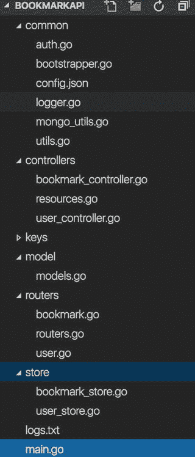

# 7.构建 HTTP 服务器

Go 是一种通用编程语言，可用于构建各种应用程序。说到 web 编程，Go 是构建后端 API 的一个很好的技术栈。Go 可能不是构建传统 web 应用程序的理想选择，在传统 web 应用程序中，web 应用程序使用服务器端模板执行 UI 呈现。当您为各种系统(包括 web 前端、移动应用程序和许多现代应用程序场景)构建支持后端系统的 RESTful APIs 时，Go 是最好的堆栈。一些现有的技术栈适合构建轻量级 RESTful APIs，但是当 HTTP 请求具有 CPU 密集型任务并且 API 在分布式环境中与其他后端系统通信时，这些系统最终会失败。Go 是构建大规模可伸缩后端系统和 RESTful APIs 的理想技术栈。在本章中，您将学习如何构建 HTTP 服务器来构建您的后端 API。

带有大量可扩展性的标准库包`net/http`，为在 Go 中编写 web 应用程序提供了基础层。如果您想为您的 Go web 应用程序使用服务器端模板，您可以利用标准库包`html/template`来呈现用户界面。在 Go 中，只需使用标准的库包，就可以构建全功能的 web 应用和 RESTful APIs，因此对于大多数 web 编程场景，尤其是构建 RESTful 服务，都不需要 web 框架。在大多数用例中，使用标准库包；每当您需要额外的功能时，请使用扩展标准库包的第三方库。

简而言之，web 编程基于请求-响应范例，其中客户端向 web 服务器发送 HTTP 请求，请求在 web 服务器上被处理，然后它向客户端发回 HTTP 响应。为了以这种方式处理 HTTP 请求和发送 HTTP 响应，包`net/http`提供了两个主要组件:

*   ServeMux 是一个 HTTP 请求多路复用器(HTTP 请求路由器)，它将传入的 HTTP 请求的统一资源标识符(URIs)与预定义的 URI 模式列表进行比较，然后执行为 URI 模式配置的相关处理程序。struct type `http.ServeMux`提供了一个作为 HTTP 请求多路复用器的实现。
*   处理程序负责将消息头和消息体写入 HTTP 响应。在包`net/http`中，`Handler`是一个接口，因此当您编写 HTTP 应用程序时，它提供了更高级别的可扩展性。因为处理程序实现只是寻找一个具体类型的`Handler`接口，所以您可以提供自己的实现来服务 HTTP 请求。

包`net/http`是为可扩展性和可组合性而设计的，所以通过扩展`net/http`提供的功能，它为您编写 web 应用程序提供了很大的灵活性。Go 社区提供了很多第三方包来扩展包`net/http`，可以用于你的 Go web 应用。

## 7-1.创建自定义 HTTP 处理程序

### 问题

如何为 HTTP 服务器创建服务于 HTTP 请求的定制处理程序？

### 解决办法

HTTP 处理程序是通过提供`http.Handler`接口的实现来创建的。

### 它是如何工作的

在 Go 中，如果你能提供一个`http.Handler`接口的实现，任何对象都可以是 HTTP 处理程序的实现。下面是`http`包中`Handler`接口的定义:

```go
type Handler interface {
        ServeHTTP(ResponseWriter, *Request)
}

```

接口`http.Handler`有一个方法`ServeHTTP`，它有两个参数:一个接口类型`http.ResponseWriter`和一个指向结构类型`http.Request`的指针。方法`ServeHTTP`应该用于将报头和数据写入`ResponseWriter`。

让我们通过向 struct 类型提供方法`ServeHTTP`来创建一个定制的处理程序:

```go
type textHandler struct {
        responseText string
}

func (th *textHandler) ServeHTTP(w http.ResponseWriter, r *http.Request) {
        fmt.Fprintf(w, th.responseText)
}

```

声明了一个结构类型`textHandler`，它有一个字段`responseText`，将用于向`ResponseWriter`写入数据。方法`ServeHTTP`被附加到`textHandler`上，因此它是接口`http.Handler`的一个实现。通过将 struct type `textHandler`配置为带有`ServeMux`的处理程序，可以为 HTTP 请求提供服务。清单 [7-1](#Par15) 展示了一个示例 HTTP 服务器，它使用两个定制处理程序来服务 HTTP 请求。

```go
package main

import (
        "fmt"
        "log"
        "net/http"
)

type textHandler struct {go get gopkg.in/mgo.v2
        responseText string
}

func (th *textHandler) ServeHTTP(w http.ResponseWriter, r *http.Request) {
        fmt.Fprintf(w, th.responseText)
}

type indexHandler struct {
}

func (ih *indexHandler) ServeHTTP(w http.ResponseWriter, r *http.Request) {
        w.Header().Set(
                "Content-Type",
                "text/html",
        )
        html :=
                `<doctype html>
        <html>
        <head>
                <title>Hello Gopher</title>
        </head>
        <body>
                <b>Hello Gopher!</b>
        <p>
          <a href="/welcome">Welcome</a> |  <a href="/message">Message</a>
        </p>
        </body>
</html>`
        fmt.Fprintf(w, html)

}

func main() {
        mux := http.NewServeMux()
        mux.Handle("/", &indexHandler{})

        thWelcome := &textHandler{"Welcome to Go Web Programming"}
        mux.Handle("/welcome", thWelcome)

        thMessage := &textHandler{"net/http package is used to build web apps"}
        mux.Handle("/message", thMessage)

        log.Println("Listening...")
        http.ListenAndServe(":8080", mux)
}

Listing 7-1.HTTP Server with Custom Handlers

```

HTTP 服务器使用两种处理程序实现:`textHandler`和`indexHandler`；两者都是通过提供方法`ServeHTTP`的实现来实现`http.Handler`接口的结构类型。`textHandler`的方法`ServeHTTP`使用函数`fmt.Fprintf`将通过其属性访问的文本字符串写入`ResponseWriter`。

```go
func (th *textHandler) ServeHTTP(w http.ResponseWriter, r *http.Request) {
        fmt.Fprintf(w, th.responseText)
}

```

对于`indexHandler`，方法`ServeHTTP`声明一个 HTML 字符串，并将其写入`ResponseWriter`。

```go
func (ih *indexHandler) ServeHTTP(w http.ResponseWriter, r *http.Request) {
        w.Header().Set(
                "Content-Type",
                "text/html",
        )
        html :=
                `<doctype html>
        <html>
        <head>
                <title>Hello Gopher</title>
        </head>
        <body>
                <b>Hello Gophe!</b>
        <p>
          <a href="/welcome">Welcome</a> |  <a href="/message">Message</a>
        </p>
        </body>
</html>`
        fmt.Fprintf(w, html)

}

```

在函数`main`中，`ServeMux`的对象被创建，然后通过提供统一资源定位符(URL)模式及其相应的处理程序值来配置 HTTP 请求多路复用器。

```go
func main() {
        mux := http.NewServeMux()
        mux.Handle("/", &indexHandler{})

        thWelcome := &textHandler{"Welcome to Go Web Programming"}
        mux.Handle("/welcome", thWelcome)

        thMessage := &textHandler{"net/http package is used to build web apps"}
        mux.Handle("/message", thMessage)

        log.Println("Listening...")
        http.ListenAndServe(":8080", mux)
}

```

`ServeMux`的功能`Handle`允许您向相关的处理程序注册一个 URL 模式。在这里，URL `"/"`被映射为一个`indexHandler`值作为处理程序，URL`"/welcome"`和`"/message"`被映射为`textHandler`值作为处理 HTTP 请求的处理程序。因为您已经实现了一个带有`ServeMux`值的 HTTP 请求多路复用器，它使用了两个定制的处理程序来处理 HTTP 请求，所以现在您可以启动您的 HTTP 服务器了。函数`ListenAndServe`使用给定的地址和处理程序启动 HTTP 服务器。

```go
http.ListenAndServe(":8080", mux)

```

函数`ListenAndServe`的第一个参数是 HTTP 服务器在给定传输控制协议(TCP)网络地址监听的地址，第二个参数是`http.Handler`接口的实现。这里你给了一个`ServeMux`值作为处理程序。结构类型`ServeMux`也实现了方法`ServeHTTP`，因此它可以作为调用函数`ListenAndServe`的处理程序。通常，您提供一个`ServeMux`值作为调用函数`ListenAndServe`的第二个参数。我们将在本章后面更详细地讨论这一点。

函数`http.ListenAndServe`通过使用给定的参数创建结构类型`http.Server`的一个实例，调用它的(`http.Server`值)`ListenAndServe`方法监听 TCP 网络地址，然后用一个处理程序调用方法`Serve`(属于`http.Server`值)来处理传入连接的请求。`http.Server`定义了运行 HTTP 服务器的参数。

让我们运行程序来启动一个 HTTP 服务器，该服务器将在端口号 8080 进行侦听。图 [7-1](#Fig1) 显示了 HTTP 服务器对`"/"`请求的响应。


图 7-1。

Server response for the request to `"/"`

图 [7-2](#Fig2) 显示了 HTTP 服务器对`"/welcome"`请求的响应。


图 7-2。

Server response for the request to `"/welcome"`

图 [7-3](#Fig3) 显示了 HTTP 服务器对`"/message"`请求的响应。


图 7-3。

Server response for the request to `"/message"`

## 7-2.使用适配器将普通函数用作处理程序

### 问题

为 HTTP 请求创建定制的处理程序将是一项单调乏味的工作。如何使用适配器将普通函数用作 HTTP 处理程序，从而不需要创建自定义处理程序类型？

### 解决办法

通过使用 func 类型`http.HandlerFunc`，您可以使用普通函数作为 HTTP 处理程序。`HandlerFunc`有一个接口`http.Handler`的实现，因此它可以被用作 HTTP 处理程序。您可以提供带有适当签名的普通函数，作为`HandlerFunc`的参数，将其用作 HTTP 处理程序。在这里，func type `HandlerFunc`作为普通函数的适配器，用作 HTTP 处理程序。

### 它是如何工作的

`HandlerFunc`是一个适配器，允许您使用普通函数作为 HTTP 处理程序。下面是`http`包中`HandlerFunc`类型的声明:

```go
type HandlerFunc func(ResponseWriter, *Request)

```

如果`fn`是一个具有适当签名(`func(ResponseWriter, *Request)`)的函数，`HandlerFunc(fn)`是一个调用`fn`的处理程序。清单 [7-2](#Par34) 展示了一个示例 HTTP 服务器，它使用`HandlerFunc`来使用普通函数作为 HTTP 处理程序。

```go
package main

import (
        "fmt"
        "log"
        "net/http"
)

func index(w http.ResponseWriter, r *http.Request) {
        w.Header().Set(
                "Content-Type",
                "text/html",
        )
        html :=
                `<doctype html>
        <html>
        <head>
                <title>Hello Gopher</title>
        </head>
        <body>
                <b>Hello Gopher!</b>
        <p>
            <a href="/welcome">Welcome</a> |  <a href="/message">Message</a>
        </p>
        </body>
</html>`
        fmt.Fprintf(w, html)
}

func welcome(w http.ResponseWriter, r *http.Request) {
        fmt.Fprintf(w, "Welcome to Go Web Programming")
}
func message(w http.ResponseWriter, r *http.Request) {
        fmt.Fprintf(w, "net/http package is used to build web apps")
}

func main() {
        mux := http.NewServeMux()
        mux.Handle("/", http.HandlerFunc(index))
        mux.Handle("/welcome", http.HandlerFunc(welcome))
        mux.Handle("/message", http.HandlerFunc(message))        

        log.Println("Listening...")
        http.ListenAndServe(":8080", mux)
}

Listing 7-2.HTTP Server That Uses Normal Functions as HTTP Handlers

```

这里用签名`func(ResponseWriter, *Request)`声明函数，通过将这些函数提供给`HandlerFunc`来将它们用作 HTTP 处理程序。

```go
mux := http.NewServeMux()
mux.Handle("/", http.HandlerFunc(index))
mux.Handle("/welcome", http.HandlerFunc(welcome))
mux.Handle("/message", http.HandlerFunc(message))        

```

将这种方法与清单 [7-1、](#Par91)中编写的程序进行比较，其中您创建了一个结构类型并提供了一个方法`ServeHTTP`来实现接口`http.Handler`，这种方法更容易，因为您可以简单地使用普通函数作为 HTTP 处理程序。

## 7-3.使用普通函数作为 HTTP 处理程序。HandleFunc

### 问题

如何在不显式调用`http.HandlerFunc`类型的情况下使用普通函数作为 HTTP 处理程序？

### 解决办法

`ServeMux`提供了一个方法`HandleFunc`，允许你注册一个普通函数作为给定 URI 模式的处理程序，而不需要显式调用 func 类型`http.HandlerFunc`。

### 它是如何工作的

`ServeMux`的方法`HandleFunc`是一个 helper 函数，内部调用`ServeMux`的方法`Handle`，其中给定的处理函数用于调用`http.HandlerFunc`来提供`http.Handler`的实现。下面是包`http`中函数`HandleFunc`的源代码:

```go
func (mux *ServeMux) HandleFunc(pattern string, handler func(ResponseWriter, *Request)) {
        mux.Handle(pattern, HandlerFunc(handler))
}

```

清单 [7-3](#Par43) 展示了一个示例 HTTP 服务器，它使用`ServeMux`的`HandleFunc`来使用普通函数作为 HTTP 处理程序，而没有显式使用`HandlerFunc`。

```go
package main

import (
        "fmt"
        "log"
        "net/http"
)

func index(w http.ResponseWriter, r *http.Request) {
        w.Header().Set(
                "Content-Type",
                "text/html",
        )
        html :=
                `<doctype html>
        <html>
        <head>
                <title>Hello Gopher</title>
        </head>
        <body>
                <b>Hello Gopher!</b>
        <p>
            <a href="/welcome">Welcome</a> |  <a href="/message">Message</a>
        </p>
        </body>
</html>`
        fmt.Fprintf(w, html)
}

func welcome(w http.ResponseWriter, r *http.Request) {
        fmt.Fprintf(w, "Welcome to Go Web Programming")
}
func message(w http.ResponseWriter, r *http.Request) {
        fmt.Fprintf(w, "net/http package is used to build web apps")
}

func main() {
        mux := http.NewServeMux()
        mux.HandleFunc("/", index)
        mux.HandleFunc("/welcome", welcome)
        mux.HandleFunc("/message", message)
        log.Println("Listening...")
        http.ListenAndServe(":8080", mux)
}

Listing 7-3.HTTP Server That Uses HandleFunc of ServeMux

```

`HandleFunc`只是一个助手函数，它通过提供`http.HandlerFunc`作为处理程序来调用`ServeMux`的函数`Handle`。

## 7-4.使用默认 ServeMux 值

### 问题

如何使用包`http,`提供的默认`ServeMux`值作为`ServeMux,`，当使用默认`ServeMux`值时，如何注册处理函数？

### 解决办法

包`http`提供了一个名为`DefaultServeMux`的默认`ServeMux`值，它可以用作 HTTP 请求多路复用器，这样您就不需要从代码中创建一个`ServeMux`。当使用`DefaultServeMux`作为`ServeMux`值时，可以使用函数`http.HandleFunc`配置 HTTP 路由，该函数将给定模式的处理函数注册到`DefaultServeMux`中。

### 它是如何工作的

默认情况下，包`http`提供了一个名为`DefaultServeMux`的`ServeMux`实例。当您调用函数`http.ListenAndServe`来运行您的 HTTP 服务器时，您可以提供一个`nil`值作为第二个参数的自变量(一个`http.Handler`的实现)。

```go
http.ListenAndServe(":8080", nil)

```

如果您提供一个`nil`值，包`http`将把`DefaultServeMux`作为`ServeMux`值。当使用`DefaultServeMux`作为`ServeMux`值时，可以使用函数`http.HandleFunc`为给定的 URL 模式注册一个处理函数。在函数`http.HandleFunc`内部，调用`DefaultServeMux`的函数`HandleFunc`。然后`ServeMux`的`HandleFunc`通过使用给定的处理函数提供`http.HandlerFunc`调用来调用`ServeMux`的函数`Handle`。

清单 [7-4](#Par51) 展示了一个示例 HTTP 服务器，它使用`DefaultServeMux`作为`ServeMux`值，并使用`http.HandleFunc`注册一个处理函数。

```go
package main

import (
        "fmt"
        "log"
        "net/http"
)

func index(w http.ResponseWriter, r *http.Request) {
        w.Header().Set(
                "Content-Type",
                "text/html",
        )
        html :=
                `<doctype html>
        <html>
        <head>
                <title>Hello Gopher</title>
        </head>
        <body>
                <b>Hello Gopher!</b>
        <p>
            <a href="/welcome">Welcome</a> |  <a href="/message">Message</a>
        </p>
        </body>
</html>`
        fmt.Fprintf(w, html)
}

func welcome(w http.ResponseWriter, r *http.Request) {
        fmt.Fprintf(w, "Welcome to Go Web Programming")
}
func message(w http.ResponseWriter, r *http.Request) {
        fmt.Fprintf(w, "net/http package is used to build web apps")
}

func main() {
        http.HandleFunc("/", index)
        http.HandleFunc("/welcome", welcome)
        http.HandleFunc("/message", message)
        log.Println("Listening...")
        http.ListenAndServe(":8080", nil)
}

Listing 7-4.HTTP Server That Uses DefaultServeMux and http.HandleFunc

```

函数`http.HandleFunc`用于向`DefaultServeMux.`注册一个处理函数

## 7-5.自定义 http。计算机网络服务器

### 问题

如何定制用于运行 HTTP 服务器的`http.Server`的值？

### 解决办法

要定制`http.Server`并使用它来运行 HTTP 服务器，用所需的值创建一个`http.Server`的实例，然后调用它的方法`ListenAndServe`。

### 它是如何工作的

在前面的食谱中，您已经使用功能`http.ListenAndServe`运行了一个 HTTP 服务器。当您调用函数`http.ListenAndServe`时，它通过提供地址的字符串值和`http.Handler`值在内部创建`http.Server`的实例，并使用`http.Server`值运行服务器。因为`http.Server`的实例是从函数`http.ListenAndServe`内部创建的，所以您不能自定义`http.Server`的值。`http.Server`定义了运行 HTTP 服务器的参数。如果你想定制`http.Server`值，你可以从你的程序中显式的创建一个`http.Server`的实例，然后调用它的方法`ListenAndServe`。

清单 [7-5](#Par57) 展示了一个定制`http.Server`并调用其方法`ListenAndServe`来运行 HTTP 服务器的示例 HTTP 服务器。

```go
package main

import (
        "fmt"
        "log"
        "net/http"
        "time"
)

func index(w http.ResponseWriter, r *http.Request) {
        fmt.Fprintf(w, "Welcome to Go Web Programming")
}

func main() {

        http.HandleFunc("/", index)

        server := &http.Server{
                Addr:           ":8080",
                ReadTimeout:    60 * time.Second,
                WriteTimeout:   60 * time.Second,                
        }

        log.Println("Listening...")
        server.ListenAndServe()
}

Listing 7-5.HTTP Server That Uses the Method ListenAndServe of http.Server

```

这个例子定制了用于运行 HTTP 服务器的`http.Server`的字段`ReadTimeout`和`WriteTimeout`。

## 7-6.编写 HTTP 中间件

### 问题

如何编写一个 HTTP 中间件函数，用一段可插入的代码来包装 HTTP 处理程序，从而为 HTTP 应用程序提供共享行为？

### 解决办法

要编写 HTTP 中间件函数，请编写带有签名`func(http.Handler) http.Handler`的函数，这样 HTTP 中间件函数就可以接受一个处理程序作为参数值，并且可以在中间件函数内部提供一段可插入的代码。因为它返回`http.Handler`，中间件函数可以作为`Handler`向 HTTP 请求多路复用器注册。

### 它是如何工作的

HTTP 中间件是包装 web 应用程序的 HTTP 处理程序的可插入和自包含的代码。这些类似于典型的 HTTP 处理程序，但是它们包装了另一个 HTTP 处理程序，通常是普通的应用程序处理程序，为 web 应用程序提供共享行为。它作为 HTTP 请求处理周期中的另一层，注入一些可插入的代码来执行共享行为，如身份验证和授权、日志记录、缓存等。

下面是编写 HTTP 中间件的基本模式:

```go
func middlewareHandler(next http.Handler) http.Handler {
  return http.HandlerFunc(func(w http.ResponseWriter, r *http.Request) {
    // Middleware logic goes here before executing application handler
    next.ServeHTTP(w, r)
   // Middleware logic goes here after executing application handler
  })
}

```

这里，中间件函数接受一个`http.Handler`值并返回一个`http.Handler`值。因为中间件函数返回`http.Handler`，所以它可以通过将应用程序处理程序包装为中间件函数的一个参数，注册为一个带有`http.ServeMux`的`Handler`。要从中间件调用给定处理程序的逻辑，调用它的方法`ServeHTTP`。

```go
next.ServeHTTP(w, r)

```

中间件逻辑可以在执行应用处理程序之前和之后执行。在执行给定的`Handler`(句柄获取为参数值)前写中间件逻辑，在调用`ServeHTTP`前写，在执行参数值`Handler`后调用`ServeHTTP`执行中间件逻辑后写。

清单 [7-6](#Par68) 展示了一个示例 HTTP 服务器，它用一个名为`loggingHandler.`的中间件函数包装应用程序处理程序

```go
package main

import (
        "fmt"
        "log"
        "net/http"
        "time"
)

// loggingHandler is an HTTP Middleware that logs HTTP requests.
func loggingHandler(next http.Handler) http.Handler {
        return http.HandlerFunc(func(w http.ResponseWriter, r *http.Request) {
                // Middleware logic before executing given Handler
                start := time.Now()
                log.Printf("Started %s %s", r.Method, r.URL.Path)
                next.ServeHTTP(w, r)
                // Middleware logic after executing given Handler
                log.Printf("Completed %s in %v", r.URL.Path, time.Since(start))
        })
}

func index(w http.ResponseWriter, r *http.Request) {
        w.Header().Set(
                "Content-Type",
                "text/html",
        )
        html :=
                `<doctype html>
        <html>
        <head>
                <title>Hello Gopher</title>
        </head>
        <body>
                <b>Hello Gopher!</b>
        <p>
            <a href="/welcome">Welcome</a> |  <a href="/message">Message</a>
        </p>
        </body>
</html>`
        fmt.Fprintf(w, html)
}

func welcome(w http.ResponseWriter, r *http.Request) {
        fmt.Fprintf(w, "Welcome to Go Web Programming")
}
func message(w http.ResponseWriter, r *http.Request) {
        fmt.Fprintf(w, "net/http package is used to build web apps")
}

func main() {
        http.Handle("/", loggingHandler(http.HandlerFunc(index)))
        http.Handle("/welcome", loggingHandler(http.HandlerFunc(welcome)))
        http.Handle("/message", loggingHandler(http.HandlerFunc(message)))
        log.Println("Listening...")
        http.ListenAndServe(":8080", nil)
}

Listing 7-6.HTTP Middleware That Wraps Application Handlers

```

名为`loggingHandler`的 HTTP 中间件用于记录所有 HTTP 请求及其响应时间。函数`loggingHandler`接受一个`http.Handler`值，因此您可以将应用程序处理程序作为参数传递给中间件函数，并且可以将中间件处理程序注册到`ServeMux`，因为它返回`http.Handler`。

```go
http.Handle("/", loggingHandler(http.HandlerFunc(index)))
http.Handle("/welcome", loggingHandler(http.HandlerFunc(welcome)))
http.Handle("/message", loggingHandler(http.HandlerFunc(message)))

```

因为中间件函数的参数类型是`http.Handler`，通过使用`http.HandlerFunc`调用中间件，应用处理函数被转换为`http.Handler`。您可以用中间件函数链来包装您的应用程序处理程序，因为您用`signature func(http.Hanlder) http.Handler`编写中间件函数。

让我们运行应用程序并导航到所有已配置的 URL 模式。您应该会看到 HTTP 中间件提供的日志消息，如下所示:

```go
2016/08/05 15:34:29 Started GET /
2016/08/05 15:34:29 Completed / in 5.0039ms
2016/08/05 15:34:34 Started GET /welcome
2016/08/05 15:34:34 Completed /welcome in 9.0082ms
2016/08/05 15:34:40 Started GET /message
2016/08/05 15:34:40 Completed /message in 6.0077ms

```

## 7-7.用 Go 和 MongoDB 编写 RESTful API

### 问题

您希望在 Go 中使用 MongoDB 作为持久性存储来编写 RESTful APIs。

### 解决办法

标准库包`http`提供了构建 RESTful APIs 的所有必要组件。包`http`是为可扩展性而设计的，因此当您编写 HTTP 应用程序时，您可以使用第三方包和您自己的定制包来扩展包的功能。包`mgo`是使用 MongoDB 最流行的包，用于 REST API 示例的数据持久化。

### 它是如何工作的

让我们构建一个 REST API 示例来演示如何用 Go 和 MongoDB 构建一个 RESTful API。虽然包`http`足以构建 web 应用程序，但我们希望使用第三方包`Gorilla mux` ( `github.com/gorilla/mux`)作为 HTTP 请求多路复用器，而不是`http.ServeMux`。包`mux`为指定 HTTP 路由提供了丰富的功能，这对于指定 RESTful 端点很有用。例如，`http.ServeMux`不支持为 URL 模式指定 HTTP 动词，这对于定义 RESTful 端点是必不可少的，但是包`mux`为定义应用程序的路由提供了很大的灵活性，包括为 URL 模式指定 HTTP 动词。第三方包`mgo`用于在 MongoDB 数据库上执行持久化，这是一个流行的 NoSQL 数据库。

#### 应用程序的目录结构

我们将 REST API 应用程序组织成多个包。图 [7-4](#Fig4) 显示了用于 REST API 应用程序的高级目录结构。


图 7-4。

Directory structure of the REST API application

图 [7-5](#Fig5) 显示了 REST API 应用程序完整版本的目录结构和相关文件。



图 7-5。

Directory structure and associated files of the completed application

除了目录`keys`，其他目录都代表 Go 包。`keys`目录包含用于签署 JSON web 令牌(JWT)及其验证的密钥。这用于通过 JWT 对 API 进行认证。

REST API 应用程序被分成以下几个包:

*   `Common`:包`common`提供实用函数，为应用提供初始化逻辑。
*   `Controllers`:包`controllers`为应用程序提供 HTTP 处理函数。
*   `Store`:包`store`用 MongoDB 数据库提供持久化逻辑。
*   `model`:包`model`描述了应用的数据模型。
*   `routers`:包`routers`为 REST API 实现 HTTP 请求路由器。

书中的示例代码主要关注名为`Bookmark`的实体，并讨论构建 REST API 的基本部分。REST API 应用程序的完整版本，包括 JWT 认证、日志等等，可以从本书的代码库中获得，代码库位于 [`https://github.com/shijuvar/go-recipes`](https://github.com/shijuvar/go-recipes) 。

#### 数据模型

包`model`为 REST API 应用程序提供了数据模型。清单 7-7 展示了 REST API 示例的数据模型。

```go
package model

import (
        "time"

        "gopkg.in/mgo.v2/bson"
)

// Bookmark type represents the metadata of a bookmark.

type Bookmark struct {
                ID          bson.ObjectId `bson:"_id,omitempty"`
                Name        string        `json:"name"`
                Description string        `json:"description"`
                Location    string        `json:"location"`
                Priority    int           `json:"priority"` // Priority (1 -5)
                CreatedBy   string        `json:"createdby"`
                CreatedOn   time.Time     `json:"createdon,omitempty"`
                Tags        []string      `json:"tags,omitempty"`
        }

Listing 7-7.Data Model in models.go

```

类型`Bookmark`代表应用程序中书签的元数据。该模型被设计为与 MongoDB 一起工作，因此字段类型`ID`被指定为`bson.ObjectId`。示例应用程序允许用户添加、编辑、删除和查看书签的元数据，这些元数据可以用优先级和标签来组织。

#### 资源模型

上一步定义了要使用的应用程序的数据模型，即 NoSQL 数据库 MongoDB。既然您已经对数据库进行了数据建模，那么让我们为 REST APIs 定义资源模型。资源建模定义了一个 REST API，它向客户端应用程序提供 API 的端点。这可以利用 URIs、使用各种 HTTP 方法的 API 操作等等。根据 Roy Fielding 关于 REST 的论文，“REST 中信息的关键抽象是资源。任何可以命名的信息都可以是资源:文档或图像、时态服务(例如，“洛杉矶今天的天气”)、其他资源的集合、非虚拟对象(例如人)等等。换句话说，任何可能成为作者超文本参考目标的概念都必须符合资源的定义。资源是到一组实体的概念性映射，而不是在任何特定时间点对应于该映射的实体。

这里您定义了一个名为“`/bookmarks`”的资源，它代表了一个书签实体的集合。通过在资源"`/bookmarks`"上使用 HTTP Post，您可以创建一个新的资源。URI " `/bookmarks/{id}`"可以用来表示单个书签实体。通过在“`/bookmarks/{id}`”上使用 HTTP Get，可以检索单个书签的数据。表 [7-1](#Tab1) 显示了针对书签实体设计的资源模型。

表 7-1。

Resource Model for the Bookmark Entity

<colgroup><col> <col> <col></colgroup> 
| 上呼吸道感染 | HTTP 动词 | 功能 |
| --- | --- | --- |
| `/bookmarks` | 邮政 | 创建新书签 |
| `/bookmarks/{id}` | 放 | 更新给定 ID 的现有书签 |
| `/bookmarks` | 得到 | 获取所有书签 |
| `/bookmarks/{id}` | 得到 | 获取给定 ID 的单个书签 |
| `/bookmarks/users/{id}` | 得到 | 获取与单个用户关联的所有书签 |
| `/bookmarks/{id}` | 删除 | 删除给定 ID 的现有书签 |

#### 将 REST API 资源配置到 HTTP 复用器中

让我们将 REST API 的资源映射到 HTTP 请求多路复用器中。包`mux`被用作这个应用程序的 HTTP 请求多路复用器。以下命令安装软件包`mux:`

```go
go get github.com/gorilla/mux

```

要使用包`mux`，您必须将`github.com/gorilla/mux`添加到导入列表中。

```go
import " github.com/gorilla/mux "

```

清单 [7-8](#Par97) 显示了函数`SetBookmarkRoutes`，它将资源端点和`Bookmark`实体的相应应用程序处理程序注册到 HTTP 请求多路复用器中。在这里，您希望在单独的函数中组织每个实体的多路复用器配置，以便您可以轻松地维护应用程序的 HTTP 路由。如果您想为`User`实体添加一个多路复用器配置，您可以在另一个函数中组织它。这些函数最终从`routers.go`的函数`InitRoutes`中调用。应用处理程序被组织到包`controllers`中。

```go
package routers

import (
        "github.com/gorilla/mux"

        "github.com/shijuvar/go-recipes/ch07/bookmarkapi/controllers"
)

// SetBookmarkRoutes registers routes for bookmark entity.
func SetBookmarkRoutes(router *mux.Router) *mux.Router {
        router.HandleFunc("/bookmarks", controllers.CreateBookmark).Methods("POST")

        router.HandleFunc("/bookmarks/{id}", controllers.UpdateBookmark).Methods("PUT")

        router.HandleFunc("/bookmarks", controllers.GetBookmarks).Methods("GET")

        router.HandleFunc("/bookmarks/{id}", controllers.GetBookmarkByID).Methods("GET")

        router.HandleFunc("/bookmarks/users/{id}", controllers.GetBookmarksByUser).Methods("GET")

        router.HandleFunc("/bookmarks/{id}", controllers.DeleteBookmark).Methods("DELETE")

        return router
}

Listing 7-8.Configuration for the HTTP Request Multiplexer in routers/bookmark.go

```

类型`mux.Router`用于注册 HTTP 路由及其相应的处理函数。它实现了接口`http.Handler`，因此它与包`http`的类型`ServeMux`兼容。函数`HandleFunc`向 URL 路径的匹配器注册一个新的路由。该功能的工作方式类似于`http.ServeMux`的功能`HandleFunc`。从`routers.go`的函数 I `nitRoutes`中调用函数`SetBookmarkRoutes`，如清单 [7-9](#Par99) 所示。

```go
package routers

import (
        "github.com/gorilla/mux"
)

// InitRoutes registers all routes for the application.
func InitRoutes() *mux.Router {
        router := mux.NewRouter().StrictSlash(false)
        // Routes for the Bookmark entity
        router = SetBookmarkRoutes(router)

        // Call other router configurations        
        return router
}

Listing 7-9.Initializing Routes in routers/routers.go

```

通过调用函数`mux.NewRouter`创建一个新的`mux.router`实例。从包`main`的`main.go`中调用函数`InitRoutes`,以配置应用程序的路由，供 HTTP 服务器使用。

#### 管理 mgo。会议

CChapter [6](6.html) 讨论了如何使用包`mgo`处理 MongoDB 数据库。当包`mgo`用于 MongoDB 时，首先通过调用`mgo.Dial`或`mgo.DialWithInfo`获得一个`mgo.Session`值。`mgo.Session`实例用于对 MongoDB 集合执行 CRUD 操作。但是，不建议在应用程序中对所有 CRUD 操作使用全局`mgo.Session`值。使用`mgo.Session`值的一个良好实践是使用从全局`mgo.Session`值复制的`mgo.Session`值用于数据持久性会话。当您编写 web 应用程序时，一个好的实践是为每个 HTTP 请求生命周期使用全局`mgo.Session`值的复制值。类型`mgo.Session`提供函数`Copy`，该函数可用于创建`mgo.Session`值的副本。您还可以使用函数`Clone`，该函数提供了`mgo.Session`值的克隆版本，以制作`mgo.Session`的副本，从而为数据持久性会话执行 CRUD 操作。复制和克隆的会话都将重用来自全局`mgo.Session`的同一个连接池，该连接池是使用`Dial`或`DialWithInfo`获得的。函数`Clone`就像`Copy`一样工作，但是也重用了与原始会话相同的套接字。REST API 示例使用函数`Copy`生成一个复制的`mgo.Session`值，该值将在单个 HTTP 请求生命周期中使用。

清单 [7-10](#Par103) 显示了包`common`中`mongo_utils.go`的源代码，它提供了使用 MongoDB 的帮助函数，包括一个名为`DataStore`的结构类型，该结构类型提供了用于每个 HTTP 请求生命周期的全局`mgo.Session`的副本。

```go
package common

import (
        "log"
        "time"

        "gopkg.in/mgo.v2"
)

var session *mgo.Session

// GetSession returns a MongoDB Session
func getSession() *mgo.Session {
        if session == nil {
                var err error
                session, err = mgo.DialWithInfo(&mgo.DialInfo{
                        Addrs:    []string{AppConfig.MongoDBHost},
                        Username: AppConfig.DBUser,
                        Password: AppConfig.DBPwd,
                        Timeout:  60 * time.Second,
                })
                if err != nil {
                        log.Fatalf("[GetSession]: %s\n", err)
                }
        }
        return session
}
func createDBSession() {
        var err error
        session, err = mgo.DialWithInfo(&mgo.DialInfo{
                Addrs:    []string{AppConfig.MongoDBHost},
                Username: AppConfig.DBUser,
                Password: AppConfig.DBPwd,
                Timeout:  60 * time.Second,
        })
        if err != nil {
                log.Fatalf("[createDbSession]: %s\n", err)
        }
}

// DataStore for MongoDB
type DataStore struct {
        MongoSession *mgo.Session
}

// Close closes an mgo.Session value.
// Used to add defer statements for closing the copied session.
func (ds *DataStore) Close() {
        ds.MongoSession.Close()
}

// Collection returns mgo.collection for the given name
func (ds *DataStore) Collection(name string) *mgo.Collection {
        return ds.MongoSession.DB(AppConfig.Database).C(name)
}

// NewDataStore creates a new DataStore object to be used for each HTTP request.
func NewDataStore() *DataStore {
        session := getSession().Copy()
        dataStore := &DataStore{
                MongoSession: session,
        }
        return dataStore
}

Listing 7-10.Helper Functions for mgo.Session in common/mongo_utils.go

```

函数`createDBSession`创建一个全局`mgo.Session`值，在运行 HTTP 服务器之前，这个函数将被立即调用。函数`getSession`返回全局`mgo.Session`值。通过创建`mgo.Session`的副本，从应用程序处理程序创建结构类型`DataStore`的实例，以与 MongoDB 数据库一起工作。函数`NewDataStore`通过提供全局`mgo.Session`值的副本来创建`DataStore`的新实例。

```go
func NewDataStore() *DataStore {
        session := getSession().Copy()
        dataStore := &DataStore{
                MongoSession: session,
        }
        return dataStore
}

```

#### JSON 资源的模型

示例 REST API 应用程序是一个基于 JSON 的 REST API，其中 JSON 格式用于在 HTTP 请求和响应中发送和接收数据。为了满足 JSON API 规范( [`http://jsonapi.org/`](http://jsonapi.org/) )，让我们定义用于 HTTP 请求和 HTTP 响应的数据模型。这里您定义了 JSON 表示的模型，其中元素名`"data"`被定义为 HTTP 请求和 HTTP 响应主体中所有 JSON 表示的根。清单 [7-11](#Par107) 展示了 JSON 表示的数据模型。

```go
package controllers

import (
        "github.com/shijuvar/go-recipes/ch07/bookmarkapi/model"
)
//Models for JSON resources
type (        
        // BookmarkResource for Post and Put - /bookmarks
        // For Get - /bookmarks/id
        BookmarkResource struct {
                Data model.Bookmark `json:"data"`
        }
        // BookmarksResource for Get - /bookmarks
        BookmarksResource struct {
                Data []model.Bookmark `json:"data"`
        }
)

Listing 7-11.Data Models for JSON Resources in controllers/resources.go

```

应用程序处理程序使用该类型从`http.Request`的主体接收数据，并将数据写入`http.ResponseWriter`。

#### 书签资源的 HTTP 处理程序

以下是为`Bookmarks`资源配置的路线:

```go
router.HandleFunc("/bookmarks", controllers.CreateBookmark).Methods("POST")
router.HandleFunc("/bookmarks/{id}", controllers.UpdateBookmark).Methods("PUT")
router.HandleFunc("/bookmarks", controllers.GetBookmarks).Methods("GET")
router.HandleFunc("/bookmarks/{id}", controllers.GetBookmarkByID).Methods("GET")
router.HandleFunc("/bookmarks/users/{id}", controllers.GetBookmarksByUser).Methods("GET")
router.HandleFunc("/bookmarks/{id}", controllers.DeleteBookmark).Methods("DELETE")

```

`Bookmarks`资源的 HTTP 处理函数是用`bookmark_controller.go`编写的，它被组织到包`controllers`中。清单 [7-12](#Par112) 显示了为`Bookmarks`资源提供 HTTP 请求的处理函数。

```go
package controllers

import (
        "encoding/json"
        "net/http"

        "github.com/gorilla/mux"
        "gopkg.in/mgo.v2"
        "gopkg.in/mgo.v2/bson"

        "github.com/shijuvar/go-recipes/ch07/bookmarkapi/common"
        "github.com/shijuvar/go-recipes/ch07/bookmarkapi/store"
)

// CreateBookmark insert a new Bookmark.
// Handler for HTTP Post - "/bookmarks
func CreateBookmark(w http.ResponseWriter, r *http.Request) {
        var dataResource BookmarkResource
        // Decode the incoming Bookmark json
        err := json.NewDecoder(r.Body).Decode(&dataResource)
        if err != nil {
                common.DisplayAppError(
                        w,
                        err,
                        "Invalid Bookmark data",
                        500,
                )
                return
        }
        bookmark := &dataResource.Data
        // Creates a new DataStore value to work with MongoDB store.
        dataStore := common.NewDataStore()
        // Add to the mgo.Session.Close()
        defer dataStore.Close()
        // Get the mgo.Collection for "bookmarks"
        col := dataStore.Collection("bookmarks")
        // Creates an instance of BookmarkStore
        bookmarkStore := store.BookmarkStore{C: col}
        // Insert a bookmark document
        err = bookmarkStore.Create(bookmark)
        if err != nil {
                common.DisplayAppError(
                        w,
                        err,
                        "Invalid Bookmark data",
                        500,
                )
                return
        }

        j, err := json.Marshal(BookmarkResource{Data: *bookmark})
        // If error has occurred,
        // Send JSON response using helper function common.DisplayAppError
        if err != nil {
                common.DisplayAppError(
                        w,
                        err,
                        "An unexpected error has occurred",
                        500,
                )
                return
        }
        w.Header().Set("Content-Type", "application/json")
        w.WriteHeader(http.StatusCreated)
        // Write the JSON data to the ResponseWriter
        w.Write(j)

}

// GetBookmarks returns all Bookmark documents
// Handler for HTTP Get - "/Bookmarks"
func GetBookmarks(w http.ResponseWriter, r *http.Request) {
        dataStore := common.NewDataStore()
        defer dataStore.Close()
        col := dataStore.Collection("bookmarks")
        bookmarkStore := store.BookmarkStore{C: col}
        bookmarks := bookmarkStore.GetAll()
        j, err := json.Marshal(BookmarksResource{Data: bookmarks})
        if err != nil {
                common.DisplayAppError(
                        w,
                        err,
                        "An unexpected error has occurred",
                        500,
                )
                return
        }
        w.WriteHeader(http.StatusOK)
        w.Header().Set("Content-Type", "application/json")
        w.Write(j)
}

// GetBookmarkByID returns a single bookmark document by id
// Handler for HTTP Get - "/Bookmarks/{id}"
func GetBookmarkByID(w http.ResponseWriter, r *http.Request) {
        // Get id from the incoming url
        vars := mux.Vars(r)
        id := vars["id"]

        dataStore := common.NewDataStore()
        defer dataStore.Close()
        col := dataStore.Collection("bookmarks")
        bookmarkStore := store.BookmarkStore{C: col}

        bookmark, err := bookmarkStore.GetByID(id)
        if err != nil {
                if err == mgo.ErrNotFound {
                        w.WriteHeader(http.StatusNoContent)

                } else {
                        common.DisplayAppError(
                                w,
                                err,
                                "An unexpected error has occurred",
                                500,
                        )

                }
                return
        }
        j, err := json.Marshal(bookmark)
        if err != nil {
                common.DisplayAppError(
                        w,
                        err,
                        "An unexpected error has occurred",
                        500,
                )
                return
        }
        w.Header().Set("Content-Type", "application/json")
        w.WriteHeader(http.StatusOK)
        w.Write(j)
}

// GetBookmarksByUser returns all Bookmarks created by a User
// Handler for HTTP Get - "/Bookmarks/users/{id}"
func GetBookmarksByUser(w http.ResponseWriter, r *http.Request) {
        // Get id from the incoming url
        vars := mux.Vars(r)
        user := vars["id"]
        dataStore := common.NewDataStore()
        defer dataStore.Close()
        col := dataStore.Collection("bookmarks")
        bookmarkStore := store.BookmarkStore{C: col}
        bookmarks := bookmarkStore.GetByUser(user)
        j, err := json.Marshal(BookmarksResource{Data: bookmarks})
        if err != nil {
                common.DisplayAppError(
                        w,
                        err,
                        "An unexpected error has occurred",
                        500,
                )
                return
        }
        w.WriteHeader(http.StatusOK)
        w.Header().Set("Content-Type", "application/json")
        w.Write(j)
}

// UpdateBookmark update an existing Bookmark document
// Handler for HTTP Put - "/Bookmarks/{id}"
func UpdateBookmark(w http.ResponseWriter, r *http.Request) {
        // Get id from the incoming url
        vars := mux.Vars(r)
        id := bson.ObjectIdHex(vars["id"])
        var dataResource BookmarkResource
        // Decode the incoming Bookmark json
        err := json.NewDecoder(r.Body).Decode(&dataResource)
        if err != nil {
                common.DisplayAppError(
                        w,
                        err,
                        "Invalid Bookmark data",
                        500,
                )
                return
        }
        bookmark := dataResource.Data
        bookmark.ID = id
        dataStore := common.NewDataStore()
        defer dataStore.Close()
        col := dataStore.Collection("bookmarks")
        bookmarkStore := store.BookmarkStore{C: col}
        // Update an existing Bookmark document
        if err := bookmarkStore.Update(bookmark); err != nil {
                common.DisplayAppError(
                        w,
                        err,
                        "An unexpected error has occurred",
                        500,
                )
                return
        }
        w.WriteHeader(http.StatusNoContent)

}

// DeleteBookmark deletes an existing Bookmark document
// Handler for HTTP Delete - "/Bookmarks/{id}"
func DeleteBookmark(w http.ResponseWriter, r *http.Request) {
        vars := mux.Vars(r)
        id := vars["id"]
        dataStore := common.NewDataStore()
        defer dataStore.Close()
        col := dataStore.Collection("bookmarks")
        bookmarkStore := store.BookmarkStore{C: col}
        // Delete an existing Bookmark document
        err := bookmarkStore.Delete(id)
        if err != nil {
                common.DisplayAppError(
                        w,
                        err,
                        "An unexpected error has occurred",
                        500,
                )
                return
        }
        w.WriteHeader(http.StatusNoContent)
}

Listing 7-12.HTTP Handler Functions for Bookmarks Resource in controllers/bookmark_controller.go

```

HTTP Post 和 HTTP Put 的 HTTP 处理函数对来自请求体的 JSON 数据进行解码，并将其解析到为 JSON 资源创建的模型中。在这里，它被解析成结构类型`BookmarkResource`。这里是`controllers`包装`resources.go`中写的`BookmarkResource`声明。

```go
BookmarkResource struct {
        Data model.Bookmark `json:"data"`
}

```

通过访问`BookmarkResource`的属性`Data`，传入的数据被映射到域模型`model.Bookmark`，并使用它的值执行数据持久性逻辑。

```go
var dataResource BookmarkResource
// Decode the incoming Bookmark json

err := json.NewDecoder(r.Body).Decode(&dataResource)

bookmark := &dataResource.Data

```

结构类型`common.DataStore`用于维护全局`mgo.Session`值的复制版本，在单个 HTTP 请求生命周期中使用。`DataStore`的方法`Collection`返回一个`mgo.Collection`值。`mgo.Collection`值用于创建`store.BookmarkStore`的实例。包`store`的结构类型`BookmarkStore`提供了针对数据模型`Bookmark`的持久性逻辑，该数据模型针对名为`"bookmarks"`的 MongoDB 集合工作。

```go
dataStore := common.NewDataStore()
// Add to the mgo.Session.Close()
defer dataStore.Close()
// Get the mgo.Collection for "bookmarks"
col := dataStore.Collection("bookmarks")
// Creates an instance of BookmarkStore
bookmarkStore := store.BookmarkStore{C: col}

```

`BookmarkStore`的方法用于对 MongoDB 数据库执行 CRUD 操作。`BookmarkStore`的函数`Create`用于向 MongoDB 集合中插入一个新文档。

```go
// Insert a bookmark document
err=bookmarkStore.Create(bookmark)

```

如果在执行了`BookmarkStore`的持久化逻辑之后，返回的`error`值是`nil`，那么一个适当的 HTTP 响应被发送到 HTTP 客户端。下面是从 HTTP Post 的处理函数发送到`"/bookmarks"`的 HTTP 响应:

```go
j, err := json.Marshal(BookmarkResource{Data: *bookmark})

w.Header().Set("Content-Type", "application/json")
w.WriteHeader(http.StatusCreated)
// Write the JSON data to the ResponseWriter
w.Write(j)

```

这里，使用`model.Bookmark`的值创建一个结构类型`BookmarkResource`，并使用`json.Marshal`将其编码到 JSON 中。如果从处理函数接收到任何`error`值，将使用一个助手函数`common.DisplayAppError`以 JSON 格式发送 HTTP 错误消息。

```go
// Insert a bookmark document
err = bookmarkStore.Create(bookmark)
if err != nil {
        common.DisplayAppError(
                w,
                err,
                "Invalid Bookmark data",
                500,
        )
        return
}

```

下面是助手函数`DisplayAppError`的实现:

```go
// DisplayAppError provides app specific error in JSON
func DisplayAppError(w http.ResponseWriter, handlerError error, message string, code int) {
        errObj := appError{
                Error:      handlerError.Error(),
                Message:    message,
                HTTPStatus: code,
        }        
        w.Header().Set("Content-Type", "application/json; charset=utf-8")
        w.WriteHeader(code)
        if j, err := json.Marshal(errorResource{Data: errObj}); err == nil {
                w.Write(j)
        }
}

```

HTTP Put、Get 和 Delete 的处理函数从 HTTP 请求的 URL 的路由变量中检索值。包`mux`提供了一个函数`Vars`，它返回当前请求的路由变量，作为类型为`map[string]string`的集合的键/值对。下面的代码块检索路由变量`"id"`的值。

```go
vars := mux.Vars(r)
id := vars["id"]

```

#### MongoDB 的数据持久性

`bookmark_controller.go`的 HTTP 处理函数使用数据持久化逻辑的结构类型`BookmarkStore`对名为`"bookmarks"`的 MongoDB 集合执行 CRUD 操作。清单 [7-13](#Par130) 显示了`BookmarkStore`提供的数据持久逻辑。

```go
package store

import (
        "time"

        "gopkg.in/mgo.v2"
        "gopkg.in/mgo.v2/bson"

        "github.com/shijuvar/go-recipes/ch07/bookmarkapi/model"
)

// BookmarkStore provides CRUD operations against the collection "bookmarks".
type BookmarkStore struct {
        C *mgo.Collection
}

// Create inserts the value of struct Bookmark into collection.
func (store BookmarkStore) Create(b *model.Bookmark) error {
        // Assign a new bson.ObjectId
        b.ID = bson.NewObjectId()
        b.CreatedOn = time.Now()
        err := store.C.Insert(b)
        return err
}

// Update modifies an existing document of a collection.
func (store BookmarkStore) Update(b model.Bookmark) error {
        // partial update on MogoDB
        err := store.C.Update(bson.M{"_id": b.ID},
                bson.M{"$set": bson.M{
                        "name":        b.Name,
                        "description": b.Description,
                        "location":    b.Location,
                        "priority":    b.Priority,
                        "tags":        b.Tags,
                }})
        return err
}

// Delete removes an existing document from the collection.
func (store BookmarkStore) Delete(id string) error {
        err := store.C.Remove(bson.M{"_id": bson.ObjectIdHex(id)})
        return err
}

// GetAll returns all documents from the collection.
func (store BookmarkStore) GetAll() []model.Bookmark {
        var b []model.Bookmark
        iter := store.C.Find(nil).Sort("priority", "-createdon").Iter()
        result := model.Bookmark{}
        for iter.Next(&result) {
                b = append(b, result)
        }
        return b
}

// GetByUser returns all documents from the collection.
func (store BookmarkStore) GetByUser(user string) []model.Bookmark {
        var b []model.Bookmark
        iter := store.C.Find(bson.M{"createdby": user}).Sort("priority", "-createdon").Iter()
        result := model.Bookmark{}
        for iter.Next(&result) {
                b = append(b, result)
        }
        return b
}

// GetByID returns a single document from the collection.
func (store BookmarkStore) GetByID(id string) (model.Bookmark, error) {
        var b model.Bookmark
        err := store.C.FindId(bson.ObjectIdHex(id)).One(&b)
        return b, err
}

Listing 7-13.Data Persistence Logic in store/bookmark_store.go

```

#### 运行 HTTP 服务器

REST API 的 HTTP 服务器从`main.go`开始创建和运行。清单 [7-14](#Par132) 显示了`main.go.`的来源

```go
package main

import (
        "log"
        "net/http"

        "github.com/shijuvar/go-recipes/ch07/bookmarkapi/common"
        "github.com/shijuvar/go-recipes/ch07/bookmarkapi/routers"
)

// Entry point of the program
func main() {

        // Calls startup logic
        common.StartUp()
        // Get the mux router object
        router := routers.InitRoutes()
        // Create the Server
        server := &http.Server{
                Addr:    common.AppConfig.Server,
                Handler: router,
        }
        log.Println("Listening...")
        // Running the HTTP Server
        server.ListenAndServe()
}

Listing 7-14.Running HTTP Server in main.go

```

在函数`main`内部，使用函数`common.StartUp`执行一些启动逻辑。在运行 HTTP 服务器之前，对`common.StartUp`的调用执行几个必需的函数。这包括读取应用程序配置文件并将值加载到 struct 实例中，使用函数`mgo.DialWithInfo`连接到 MongoDB 数据库，获得一个`mgo.Session`值，等等。包`common`提供了运行 HTTP 服务器之前所需的启动逻辑。通过调用返回`mux.Router`的`routers.InitRoutes`来创建`http.Handler`值。`mux.Router`有一个接口`http.Handler`的实现，因此它被用作 HTTP 服务器的处理程序。

#### 测试 REST API 服务器

让我们运行 HTTP 服务器并测试书签资源的一些 API 端点。Postman ( [`https://www.getpostman.com/`](https://www.getpostman.com/) )用于测试 API 端点。图 [7-6](#Fig6) 显示了对`"/bookmarks"`的 HTTP Post 请求。


图 7-6。

Sending HTTP Post to `"/bookmarks"`

图 [7-7](#Fig7) 显示了 API 服务器对 HTTP Post 到`"/bookmarks"`的响应。它显示了新创建的资源的 HTTP 状态代码 201 和 JSON。


图 7-7。

HTTP Response for the HTTP Post to `"/bookmarks"`

让我们再向服务器发送一个 HTTP Post 请求，并测试 HTTP Get 请求。图 [7-8](#Fig8) 显示了对`"/bookmarks"`的 HTTP Get 请求的响应。它显示了所有书签资源的 JSON 数据。


图 7-8。

HTTP Response for the HTTP Get to `"/bookmarks"`

图 [7-9](#Fig9) 显示了对`"/bookmarks/{id}"`的 HTTP Get 请求的响应。它显示了给定书签 ID 的单个书签资源的 JSON 数据。


图 7-9。

HTTP Response for the HTTP Get request to `"/bookmarks/{id}"`

图 [7-10](#Fig10) 显示了对`"/bookmarks/users/{id}"`的 HTTP Get 请求的响应。它显示了与给定用户 ID 的用户相关联的所有书签资源的 JSON 数据。


图 7-10。

HTTP Response for the HTTP Get request to `"/bookmarks/users/{id}"`

REST API 应用程序的完整版本可从本书的代码库中获得，地址为 [`https://github.com/shijuvar/go-recipes`](https://github.com/shijuvar/go-recipes) 。