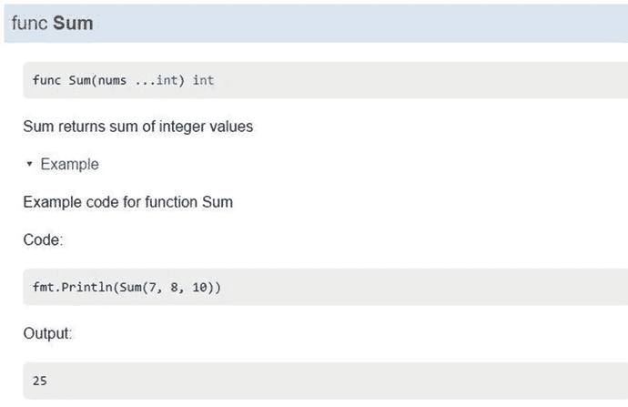
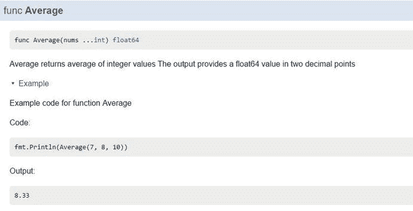
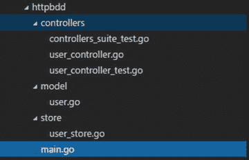

# 八、测试 Go 应用

软件工程是一个进化过程，在这个过程中，你将应用程序作为一个进化系统来开发，并且不断地修改和重构应用程序。您应该能够随时修改应用程序的功能并重构其代码，而不会破坏应用程序的任何部分。当您将应用程序开发为一个进化产品并修改应用程序代码时，不应该破坏应用程序的任何部分。您可能需要采用一些良好的工程实践来确保您的应用程序的质量。自动化测试是一项重要的工程实践，可以用来确保软件系统的质量。在自动化测试过程中，您针对应用程序中最小的可测试软件(称为单元)编写单元测试，以确定每个单元的功能是否完全符合您的预期。在本章中，你将学习如何在 Go 中编写单元测试。

## 8-1.编写单元测试

### 问题

你如何编写单元测试来确保你的 Go 包如你所愿的那样运行？

### 解决办法

标准库包`testing`为编写 Go 包的单元测试提供支持。命令运行用包`testing`编写的单元测试。

### 它是如何工作的

包`testing`为编写单元测试提供了所有必要的支持，旨在与运行单元测试的`go test`命令一起使用。`go test`命令通过查看函数中的以下模式来识别单元测试函数:

```go
func TestXxx(*testing.T)

```

您编写的单元测试函数带有前缀`Test`，后跟一个以大写字母开头的字母数字字符串。要编写单元测试函数，您必须创建一个测试套件文件，其名称以`_test.go`结尾，包含带有签名`func TestXxx(*testing.T)`的单元测试函数。您通常将测试套件文件放在被测试的同一个包中。当您使用`go build`或`go install`构建包时，它不包括测试套件文件，当您使用`go test`运行单元测试时，它包括测试套件文件。

要获得运行`go test`的帮助，请运行以下命令:

```go
go help test

```

要获得关于`go test`命令使用的各种标志的帮助，请运行以下命令:

```go
go help testflag

```

清单 [8-1](#Par12) 展示了一个示例包，稍后您将为其编写一个单元测试。

```go
package calc

import "math"

// Sum returns sum of integer values
func Sum(nums ...int) int {
        result := 0
        for _, v := range nums {
                result += v
        }
        return result
}

// Average returns average of integer values
// The output provides a float64 value in two decimal points
func Average(nums ...int) float64 {
        sum := 0
        for _, v := range nums {
                sum += v
        }
        result := float64(sum) / float64(len(nums))
        pow := math.Pow(10, float64(2))
        digit := pow * result
        round := math.Floor(digit)
        return round / pow

}

Listing 8-1.Package calc with Two Utility Functions in calc.go

```

列表 [8-2](#Par14) 显示了测试包`calc`中函数`Sum`和`Average`行为的单元测试。

```go
package calc

import "testing"

// Test case for the Sum function
func TestSum(t *testing.T) {
        input, expected := []int{7, 8, 10}, 25
        result := Sum(input...)
        if result != expected {

                t.Errorf("Result: %d, Expected: %d", result, expected)
        }

}

// Test case for the Sum function
func TestAverage(t *testing.T) {
        input, expected := []int{7, 8, 10}, 8.33
        result := Average(input...)
        if result != expected {

                t.Errorf("Result: %f, Expected: %f", result, expected)
        }
}

Listing 8-2.Unit Tests for Package calc in calc_test.go

```

编写了两个测试用例来验证包`calc`中函数的行为。单元测试函数的名称以前缀`Test`开始，后面是一个以大写字母开始的字符串。在单元测试函数中，函数的输出值验证期望值，并调用方法`Errorf`来通知失败。为了发出测试用例失败的信号，你可以调用`Error`、`Fail`或者`testing.T`类型的相关方法。`Error`和`Fail`方法发出测试用例失败的信号，但是它将继续执行剩余的单元测试。如果您想在测试用例失败时停止执行，您可以调用类型`testing.T`的方法`FailNow`或`Fatal`。方法`FailNow`调用方法`Fail`并停止执行。`Fatal`相当于`Log`后跟`FailNow`。在这些单元测试功能中，方法`Errorf`被用于发出测试用例失败的信号。

```go
if result != expected {

        t.Errorf("Result: %d, Expected: %d", result, expected)
}

```

#### 运行单元测试

要运行单元测试，从您的`package`目录运行`go test`命令:

```go
go test

```

您应该会看到类似如下的输出:

```go
PASS
ok      github.com/shijuvar/go-recipes/ch08/calc        0.233s

```

这个测试的输出不是很有描述性。当您执行单元测试时，`verbose (-v)`标志提供了描述性的信息。

```go
go test –v

```

这将产生类似于以下内容的输出:

```go
=== RUN   TestSum
--- PASS: TestSum (0.00s)
=== RUN   TestAverage
--- PASS: TestAverage (0.00s)
PASS
ok      github.com/shijuvar/go-recipes/ch08/calc        0.121s

```

请注意，单元测试是按顺序执行的。在这些测试中，它首先执行测试函数`TestSum`，在完成执行后，它接着执行测试函数`TestAverage`。

#### 测试覆盖率

当您运行单元测试时，您可以测量由测试用例执行的测试量。`go test`命令提供了一个覆盖率`(-cover)`标志，帮助你获得针对你的代码编写的测试用例的覆盖率。让我们运行带有覆盖率标志的单元测试来确定包`calc`的测试覆盖率:

```go
go test –v –cover

```

您应该会看到类似如下的输出:

```go
=== RUN   TestSum
--- PASS: TestSum (0.00s)
=== RUN   TestAverage
--- PASS: TestAverage (0.00s)
PASS
coverage: 100.0% of statements
ok      github.com/shijuvar/go-recipes/ch08/calc        0.139s

```

这个测试输出显示包`calc`有 100%的测试覆盖率。

## 8-2.跳过长期运行的测试

### 问题

在运行测试时，您希望能够灵活地跳过一些单元测试。在运行单元测试时，如何跳过一些单元测试的执行？

### 解决办法

`go test`命令允许您传递一个简短的`(-short)`标志，让您在执行过程中跳过一些单元测试。在单元测试函数中，您可以通过调用包`testing`中的函数`Short`来检查是否提供了短标志，如果您想跳过这些测试，可以通过调用`testing.T`类型的函数`Skip`来跳过测试的执行。

### 它是如何工作的

当您执行单元测试时，您可能需要跳过其中的一些。有时，您可能想要阻止某些单元测试在某些用例中执行。例如，您可能想跳过一些耗时的单元测试。另一个示例场景是，一些单元测试可能依赖于在这些测试执行期间不可用的配置文件或环境变量，因此您可以跳过这些测试的执行，而不是让它们失败。

类型`testing.T`提供了一个可以用来跳过单元测试的方法`Skip`。为了跳过那些单元测试，您可以通过向`go test`命令提供一个短的`(-short)`标志来给出一个信号。清单 [8-3](#Par35) 显示了三个单元测试函数，其中如果你给`go test`命令提供一个短的`(-short)`标志，在测试执行过程中会跳过一个测试。

```go
package calc

import (
        "testing"
        "time"
)

// Test case for the Sum function
func TestSum(t *testing.T) {
        input, expected := []int{7, 8, 10}, 25
        result := Sum(input...)
        if result != expected {

                t.Errorf("Result: %d, Expected: %d", result, expected)
        }

}

// Test case for the Sum function
func TestAverage(t *testing.T) {
        input, expected := []int{7, 8, 10}, 8.33
        result := Average(input...)
        if result != expected {

                t.Errorf("Result: %f, Expected: %f", result, expected)
        }
}

// TestLongRun is a time-consuming test
func TestLongRun(t *testing.T) {
        // Checks whether the short flag is provided
        if testing.Short() {
                t.Skip("Skipping test in short mode")
        }
        // Long running implementation goes here
        time.Sleep(5 * time.Second)
}

Listing 8-3.Unit Tests in Which One Test is Skipped in Execution

```

在这些单元测试中，如果您可以为`go test`命令提供一个短标志，那么您可以跳过函数`TestLongRun`的测试执行。函数`testing.Short`用于识别是否提供了短标志。如果是，通过调用函数`Skip`跳过单元测试的执行。当您调用函数`Skip`时，您可以提供一个字符串值。

```go
// Checks whether the short flag is provided
           if testing.Short() {
        t.Skip("Skipping test in short mode")
}

```

如果不提供短标志，函数`TestLongRun`将作为正常的单元测试运行。让我们通过提供短标志来运行测试:

```go
go test -v -short

```

您应该会看到类似如下的输出:

```go
=== RUN   TestSum
--- PASS: TestSum (0.00s)
=== RUN   TestAverage
--- PASS: TestAverage (0.00s)
=== RUN   TestLongRun

--- SKIP: TestLongRun (0.00s)

        calc_test.go:36: Skipping test in short mode

PASS
ok      github.com/shijuvar/go-recipes/ch08/calc        0.241s

```

测试输出显示单元测试函数`TestLongRun`在执行过程中被跳过。现在让我们在不提供短标志的情况下运行测试:

```go
go test -v

```

这将产生类似于以下内容的输出:

```go
=== RUN   TestSum
--- PASS: TestSum (0.00s)
=== RUN   TestAverage
--- PASS: TestAverage (0.00s)
=== RUN   TestLongRun

--- PASS: TestLongRun (5.00s)

PASS
ok      github.com/shijuvar/go-recipes/ch08/calc        5.212s

```

测试输出显示函数`TestLongRun`正常运行。

## 8-3.编写基准测试

### 问题

如何通过编写测试来对 Go 代码进行基准测试？

### 解决办法

包`testing`允许你为基准 Go 函数编写测试。为了编写基准，编写模式为`func BenchmarkXxx(*testing.B)`的函数，当`go test`命令的`-bench`标志被提供时，这些函数被执行。

### 它是如何工作的

当您使用`go test`命令运行测试时，您可以传递`-bench`标志来执行 bechmark 测试，其中具有模式`func BenchmarkXxx(*testing.B)`的函数被视为基准。您在`_test.go`文件中编写基准函数。清单 [8-4](#Par50) 显示了对软件包`calc`功能的基准测试(参见清单 [8-1](#Par12) )。

```go
package calc

import "testing"

// Test case for function Sum
func TestSum(t *testing.T) {
        input, expected := []int{7, 8, 10}, 25
        result := Sum(input...)
        if result != expected {

                t.Errorf("Result: %d, Expected: %d", result, expected)
        }

}

// Test case for function Average
func TestAverage(t *testing.T) {
        input, expected := []int{7, 8, 10}, 8.33
        result := Average(input...)
        if result != expected {

                t.Errorf("Result: %f, Expected: %f", result, expected)
        }
}

// Benchmark for function Sum
func BenchmarkSum(b *testing.B) {
        for i := 0; i < b.N; i++ {
                Sum(7, 8, 10)
        }
}

// Benchmark for function Average
func BenchmarkAverage(b *testing.B) {
        for i := 0; i < b.N; i++ {
                Average(7, 8, 10)
        }
}

Listing 8-4.Unit Tests with Benchmarks in Package calc

```

编写了两个基准测试来测试包`calc`中函数的性能。您必须使用循环结构运行目标代码`b.N`次，以便以可靠的方式执行要进行基准测试的函数。在执行基准测试期间，`b.N`的值将被调整。基准测试为您提供了每个循环的可靠响应时间。当您向`go test`命令提供`-bench`标志时，您需要提供一个正则表达式来指示要执行哪些基准测试。要运行所有基准，使用`-bench .`或`-bench=.`

让我们通过提供`-bench .`来运行测试

```go
go test -v -bench .

```

您应该会看到类似如下的输出:

```go
=== RUN   TestSum
--- PASS: TestSum (0.00s)
=== RUN   TestAverage
--- PASS: TestAverage (0.00s)
BenchmarkSum-4          100000000               23.1 ns/op
BenchmarkAverage-4      10000000               224 ns/op
PASS
ok      github.com/shijuvar/go-recipes/ch08/calc        4.985s

```

## 8-4.并行运行单元测试

### 问题

如何并行执行单元测试？

### 解决办法

您可以通过调用类型为`testing.T`的方法`Parallel`来并行运行单元测试。在单元测试函数内部，对方法`Parallel`的调用表明这个测试将与其他并行测试并行运行。

### 它是如何工作的

默认情况下，单元测试按顺序执行。如果您想并行运行一个单元测试来加速执行，那么在编写测试逻辑之前调用测试函数内部的方法`Parallel`。方法`Parallel`表明这个单元测试将与其他并行测试并行运行。您可以为任何想要并行运行的单元测试函数调用方法`Parallel`。

清单 [8-5](#Par60) 提供了几个并行运行的单元测试。

```go
package calc

import (
        "testing"
        "time"
)

// Test case for the function Sum to be executed in parallel
func TestSumInParallel(t *testing.T) {
        t.Parallel()
        // Delaying 1 second for the sake of demonstration
        time.Sleep(1 * time.Second)
        input, expected := []int{7, 8, 10}, 25
        result := Sum(input...)
        if result != expected {

                t.Errorf("Result: %d, Expected: %d", result, expected)
        }

}

// Test case for the function Sum to be executed in parallel
func TestAverageInParallel(t *testing.T) {
        t.Parallel()
        // Delaying 1 second for the sake of demonstration
        time.Sleep(2 * time.Second)
        input, expected := []int{7, 8, 10}, 8.33
        result := Average(input...)
        if result != expected {

                t.Errorf("Result: %f, Expected: %f", result, expected)
        }
}

Listing 8-5.Unit Tests to Be Run in Parallel

```

在测试函数内部，方法`Parallel`作为第一个代码语句被调用，以表示该测试将并行运行，这样并行测试的执行将不会等待测试函数的完成，而是与其他并行测试并行运行。

```go
t.Parallel()

```

如果您编写混合了并行测试和普通测试的单元测试函数，它将顺序执行普通测试，并与其他并行测试并行执行并行测试。用`go test`命令运行测试:

```go
go test -v  

```

您应该会看到类似如下的输出:

```go
=== RUN   TestSumInParallel
=== RUN   TestAverageInParallel
--- PASS: TestSumInParallel (1.00s)
--- PASS: TestAverageInParallel (2.00s)
PASS
ok      github.com/shijuvar/go-recipes/ch08/calc        2.296s

```

输出显示`TestSumInParallel`和`TestAverageInParallel`正在并行运行，并且没有等待一个测试完成就运行另一个测试。

## 8-5.编写用于验证示例代码的测试

### 问题

如何编写测试来验证示例代码？

### 解决办法

包`testing`提供了对编写测试来验证示例代码的支持。要编写示例函数，请使用以前缀`Example`开头的名称来声明函数。

### 它是如何工作的

示例函数验证为包、类型和函数编写的示例代码。示例函数也可以在由`godoc`工具生成的 Go 文档中找到。当您使用`godoc`工具生成 Go 文档时，示例函数将作为 Go 包和各种类型的示例代码。示例函数以前缀`Example`开头的名称声明。下面是用于声明包示例的命名约定，一个函数`F`，一个类型`T`，以及类型`T`上的方法`M`:

```go
func Example()    // Example test for package
func ExampleF()   // Example test for function F
func ExampleT()   // Example test for type T
func ExampleT_M() // Example test for M on type T

```

在示例函数中，通常包含一个以`Output:`开头的结束行注释。当使用`go test`命令执行测试功能时，它将给定输出与功能输出进行比较。清单 [8-6](#Par73) 展示了包`calc`中的示例函数。

```go
package calc

import "fmt"

// Example code for function Sum
func ExampleSum() {
        fmt.Println(Sum(7, 8, 10))
        // Output: 25
}

// Example code for function Average
func ExampleAverage() {
        fmt.Println(Average(7, 8, 10))
        // Output: 8.33
}

Listing 8-6.Example Functions for Package calc

```

编写函数`Sum`示例代码的约定是`ExampleSum`，函数`Average`的约定是`ExampleAverage`。在示例测试函数中，提供了一个以`Output:`开头的总结行注释。行注释的输出与函数的标准输出进行比较。在示例函数`ExampleSum`中，行注释的输出与对`Sum`的函数调用的输出进行比较。

让我们用`go test`命令运行示例函数:

```go
go test -v

```

您应该会看到类似如下的输出:

```go
=== RUN   ExampleSum
--- PASS: ExampleSum (0.00s)
=== RUN   ExampleAverage
--- PASS: ExampleAverage (0.00s)
PASS
ok      github.com/shijuvar/go-recipes/ch08/calc        0.165s

```

示例测试功能将作为示例代码出现在由`godoc`工具生成的文档中。图 [8-1](#Fig1) 显示了函数`Sum`的文档，其中包括取自测试函数`ExampleSum`的示例代码。



图 8-1。

Documentation for function `Sum` generated by `godoc` tool

图 [8-2](#Fig2) 显示了函数`Average`的文档，其中包括取自测试函数`ExampleAverage`的示例代码。



图 8-2。

Documentation for function `Average` generated by `godoc` tool

## 8-6.测试 HTTP 应用程序

### 问题

如何为 HTTP 应用程序编写测试？

### 解决办法

标准库包`net/http/httptest`提供了测试 HTTP 应用程序的工具。

### 它是如何工作的

包`httptest`为测试 HTTP 应用程序提供支持。为了测试 HTTP 应用程序，包`httptest`提供了`ResponseRecorder`和`Server`结构类型。

`ResponseRecorder`是`http.ResponseWriter`的实现，它记录 HTTP 响应以检查单元测试中的响应。您可以通过使用记录处理函数中`http.ResponseWriter`突变的`ResponseRecorder`来验证`http.ResponseWriter`在测试中的行为。当您使用`ResponseRecorder`测试您的 HTTP 应用程序时，您不需要使用 HTTP 服务器。通过调用包`httptest`的函数`NewRecorder`创建一个`ResponseRecorder`实例。

```go
w := httptest.NewRecorder()

```

`Server`是一个测试 HTTP 服务器，它监听本地环回接口(127.0.0.1)上系统选择的端口，用于端到端 HTTP 测试。这允许您通过从 HTTP 客户端向测试服务器发送 HTTP 请求，使用 HTTP 服务器测试您的 HTTP 应用程序。通过提供一个`http.Handler`的实例，调用包`httptest`的函数`NewServer`来创建测试 HTTP 服务器。

```go
server := httptest.NewServer(r) // r is an instance of http.Handler

```

#### HTTP API 服务器

清单 [8-7](#Par89) 展示了一个例子 HTTP API 服务器，它是为稍后用包`httptest`编写单元测试而创建的。

```go
package main

import (
        "encoding/json"
        "net/http"

        "github.com/gorilla/mux"
)

// User model
type User struct {
        FirstName string `json:"firstname"`
        LastName  string `json:"lastname"`
        Email     string `json:"email"`
}

// getUsers serves requests for Http Get to "/users"
func getUsers(w http.ResponseWriter, r *http.Request) {
        data := []User{
                User{
                        FirstName: "Shiju",
                        LastName:  "Varghese",
                        Email:     "shiju@xyz.com",
                },

                User{
                        FirstName: "Irene",
                        LastName:  "Rose",
                        Email:     "irene@xyz.com",
                },
        }
        users, err := json.Marshal(data)
        if err != nil {
                w.WriteHeader(http.StatusInternalServerError)
                return
        }
        w.Header().Set("Content-Type", "application/json")
        w.WriteHeader(http.StatusOK)
        w.Write(users)
}

func main() {
        r := mux.NewRouter()
        r.HandleFunc("/users", getUsers).Methods("GET")
        http.ListenAndServe(":8080", r)
}

Listing 8-7.Example HTTP Server in main.go

```

清单 [8-7](#Par89) 创建了一个简单的带有单个端点的 HTTP 服务器:HTTP Get to `"/users"`返回一个集合`User`实体。

#### 使用 ResponseRecorder 测试 HTTP 应用程序

清单 [8-8](#Par92) 显示了用`ResponseRecorder`测试在清单 [8-7](#Par89) 中创建的 HTTP 服务器的测试。

```go
package main

import (
        "net/http"
        "net/http/httptest"
        "testing"

        "github.com/gorilla/mux"
)

// TestGetUsers test HTTP Get to "/users" using ResponseRecorder
func TestGetUsers(t *testing.T) {
        r := mux.NewRouter()
        r.HandleFunc("/users", getUsers).Methods("GET")
        req, err := http.NewRequest("GET", "/users", nil)
        if err != nil {
                t.Error(err)
        }
        w := httptest.NewRecorder()

        r.ServeHTTP(w, req)
        if w.Code != 200 {
                t.Errorf("HTTP Status expected: 200, got: %d", w.Code)
        }
}

Listing 8-8.Testing HTTP API Server Using ResponseRecorder in main_test.go

```

在`TestGetUsers`中，HTTP 多路复用器被配置用于测试`"/users"`上的 HTTP Get 请求。

```go
r := mux.NewRouter()
r.HandleFunc("/users", getUsers).Methods("GET")   

```

使用`http.NewRequest` to 来调用`"/users"`上的 HTTP Get 的处理程序的方法`ServeHTTP`来创建 HTTP 请求对象。一个`nil`值作为 HTTP 请求主体的参数被提供给函数`NewRequest`，因为它是一个 HTTP Get 请求。您可以为 HTTP 请求正文提供一个值，以便在 HTTP Posts 上创建 HTTP 请求对象。

```go
req, err := http.NewRequest("GET", "/users", nil)
if err != nil {
        t.Error(err)
}

```

使用`httptest.NewRecorder`创建一个`ResponseRecorder`对象，以记录返回的 HTTP 响应，供以后在测试中检查。

```go
w := httptest.NewRecorder()

```

HTTP 处理程序的方法`ServeHTTP`通过提供`ResponseRecorder`和`Request`对象来调用`"/users"`上的 HTTP Get 请求。这将调用处理函数`getUsers`。

```go
r.ServeHTTP(w, req)

```

`ResponseRecorder`对象记录返回的 HTTP 响应(处理函数中`http.ResponseWriter`的变化),以便于检查。您可以看到 HTTP 响应返回了 HTTP 状态代码 200。

```go
if w.Code != 200 {
     t.Errorf("HTTP Status expected: 200, got: %d", w.Code)
}

```

让我们用`go test`命令运行测试:

```go
go test -v

```

您应该会看到类似如下的输出:

```go
=== RUN   TestGetUsers
--- PASS: TestGetUsers (0.00s)
PASS
ok      github.com/shijuvar/go-recipes/ch08/httptest    0.353s

```

#### 使用服务器测试 HTTP 应用程序

在清单 [8-8](#Par92) 中，您使用`ResponseRecorder`编写了测试来检查 HTTP 响应的值。这种类型足以检查 HTTP 响应的行为。包`httptest`还提供了一个类型`Server`,允许您创建一个用于测试的 HTTP 服务器，这样您就可以通过 HTTP 管道运行您的测试，方法是使用 HTTP 客户端向测试 HTTP 服务器发送 HTTP 请求。清单 [8-9](#Par108) 显示了一个带有测试`Server`的测试，用于测试清单 [8-7](#Par89) 中创建的 HTTP API 服务器。

```go
package main

import (
        "fmt"
        "net/http"
        "net/http/httptest"
        "testing"

        "github.com/gorilla/mux"
)

// TestGetUsersWithServer test HTTP Get to "/users" using Server
func TestGetUsersWithServer(t *testing.T) {
        r := mux.NewRouter()
        r.HandleFunc("/users", getUsers).Methods("GET")
        server := httptest.NewServer(r)
        defer server.Close()
        usersURL := fmt.Sprintf("%s/users", server.URL)
        request, err := http.NewRequest("GET", usersURL, nil)

        res, err := http.DefaultClient.Do(request)

        if err != nil {
                t.Error(err)
        }

        if res.StatusCode != 200 {
                t.Errorf("HTTP Status expected: 200, got: %d", res.StatusCode)
        }
}

Listing 8-9.Testing HTTP API Server Using Server in main_test.go

```

在测试函数`TestGetUsersWithServer`中，HTTP 多路复用器被配置用于测试`"/users"`上的 HTTP Get 请求。

```go
r := mux.NewRouter()
r.HandleFunc("/users", getUsers).Methods("GET")   

```

通过调用函数`httptest.NewServer`创建测试 HTTP 服务器。函数`NewServer`启动并返回一个新的 HTTP 服务器。`Server`的方法`Close`被添加到延迟函数列表中，以在测试完成时关闭测试`Server`。

```go
server := httptest.NewServer(r)
defer server.Close()

```

使用函数`http.NewRequest`创建 HTTP 请求，并使用 HTTP 客户端对象的方法`Do`发送 HTTP 请求。一个`nil`值作为 HTTP 请求主体的参数被提供给函数`NewRequest`，因为它是一个 HTTP Get 请求。使用`http.DefaultClient`创建 HTTP 客户端，然后调用方法`Do`向测试服务器发送 HTTP 请求，测试服务器返回 HTTP 响应。

```go
usersURL:= fmt.Sprintf("%s/users", server.URL)
request, err := http.NewRequest("GET", usersURL, nil)
res, err := http.DefaultClient.Do(request)

```

您会看到 HTTP 响应返回 HTTP 状态代码 200。

```go
    if res.StatusCode != 200 {
        t.Errorf("HTTP Status expected: 200, got: %d", res.StatusCode)
    }

```

让我们用`go test`命令运行测试:

```go
go test -v

```

您应该会看到类似如下的输出:

```go
=== RUN   TestGetUsersWithServer
--- PASS: TestGetUsersWithServer (0.01s)
PASS
ok      github.com/shijuvar/go-recipes/ch08/httptest    0.355s

```

## 8-7.编写 BDD 风格的测试

### 问题

如何在 Go 中编写行为驱动开发(BDD)风格的测试？

### 解决办法

第三方包`Ginkgo`是一个 BDD 风格的 Go 测试框架，允许你编写基于 BDD 的测试。`Ginkgo`最好与`Gomega`匹配器库配对。

### 它是如何工作的

BDD 是从测试驱动开发(TDD)演变而来的软件开发过程。在 BDD 中，应用程序是通过描述其行为来指定和设计的。BDD 强调行为而不是测试。`Ginkgo`是一个 BDD 风格的测试框架，建立在标准库包之上`testing. Ginkgo`通常与`Gomega`一起使用，作为测试断言的匹配器库。

#### 构建可测试的 HTTP API 服务器

让我们构建一个可测试的 HTTP API 服务器，为应用程序编写 BDD 风格的测试。在 BDD 中，您通常在编写产品代码之前先编写规范(BDD 风格的测试),但是为了便于演示，这里您先编写应用程序代码，然后再编写规范。当您编写测试时，最重要的事情是您的应用程序代码应该是可测试的，以便您可以独立地隔离应用程序的各个组件，并编写测试来验证其行为。

图 [8-3](#Fig3) 显示了 HTTP API 应用程序的目录结构。要运行后面显示的示例代码，您需要创建这个目录结构，并确保文件创建在正确的目录中。这个目录结构必须在`GOPATH/src`的子目录中。



图 8-3。

Directory structure of the HTTP API application

包`controllers`由处理函数和测试组成。包`model`定义了应用程序的数据模型。它还为持久化存储定义了一个接口，以便您可以为应用程序代码和测试使用不同的接口实现。包`store`通过实现包`model.`中定义的接口来提供持久存储的具体实现

清单 [8-10](#Par128) 显示了`model`包中`user.go`的来源。

```go
package model

import "errors"

// ErrorEmailExists is an error value for duplicate email id
var ErrorEmailExists = errors.New("Email Id is exists")

// User model
type User struct {
        FirstName string `json:"firstname"`
        LastName  string `json:"lastname"`
        Email     string `json:"email"`
}

// UserStore provides a contract for Data Store for User entity
type UserStore interface {
        GetUsers() []User
        AddUser(User) error
}

Listing 8-10.Data Model and Interface for Persistent Store in model/user.go

```

包`model`声明了一个名为`User`的数据模型，并提供了一个名为`UserStore`的接口，该接口为`User`实体提供了持久存储的契约。包`store`通过将`User`值保存到 MongoDB 数据库中，提供了接口`UserStore`的实现。

清单 [8-11](#Par131) 显示了`store`包中`user_store.go`的来源。

```go
package store

import (
        "log"
        "time"

        "gopkg.in/mgo.v2"
        "gopkg.in/mgo.v2/bson"

        "github.com/shijuvar/go-recipes/ch08/httpbdd/model"
)

// MongoDB Session
var mgoSession *mgo.Session

// Create a MongoDB Session
func createDBSession() {
        var err error
        mgoSession, err = mgo.DialWithInfo(&mgo.DialInfo{
                Addrs:   []string{"127.0.0.1"},
                Timeout: 60 * time.Second,
        })
        if err != nil {
                log.Fatalf("[createDbSession]: %s\n", err)
        }
}

// Initializes the MongoDB Session
func init() {
        createDBSession()
}

// MongoUserStore provides persistence logic for "users" collection.
type MongoUserStore struct{}

// AddUser insert new User
func (store *MongoUserStore) AddUser(user model.User) error {
        session := mgoSession.Copy()
        defer session.Close()
        userCol := session.DB("userdb").C("users")
        // Check whether email id exists or not
        var existUser model.User
        err := userCol.Find(bson.M{"email": user.Email}).One(&existUser)
        if err != nil {
                if err == mgo.ErrNotFound { // Email is unique
                }
        }
        if (model.User{}) != existUser {
                return model.ErrorEmailExists
        }
        err = userCol.Insert(user)
        return err
}

// GetUsers returns all documents from the collection.
func (store *MongoUserStore) GetUsers() []model.User {
        session := mgoSession.Copy()
        defer session.Close()
        userCol := session.DB("userdb").C("users")
        var users []model.User
        iter := userCol.Find(nil).Iter()
        result := model.User{}
        for iter.Next(&result) {
                users = append(users, result)
        }
        return users
}

Listing 8-11.Implementation of UserStore to Persist Data into MongoDB in store/user_store.go

```

Struct type `MongoUserStore`是接口`UserStore`的具体实现，它将数据保存到 MongoDB 数据库中。在`AddUser`功能中，您可以检查新用户的电子邮件 ID 是否唯一。这是我们的应用程序的一个行为，当您为处理函数编写规范时，将会对它进行测试。

清单 [8-12](#Par134) 显示了为 HTTP API 应用程序提供处理函数的包`controllers`中`user_controller.go`的源代码。

```go
package controllers

import (
        "encoding/json"
        "log"
        "net/http"

        "github.com/shijuvar/go-recipes/ch08/httpbdd/model"
)

// GetUsers serves requests for Http Get to "/users"
func GetUsers(store model.UserStore) http.Handler {
        return http.HandlerFunc(func(w http.ResponseWriter, r *http.Request) {
                data := store.GetUsers()
                users, err := json.Marshal(data)
                if err != nil {
                        w.WriteHeader(http.StatusInternalServerError)
                        return
                }
                w.Header().Set("Content-Type", "application/json")
                w.WriteHeader(http.StatusOK)
                w.Write(users)
        })

}

// CreateUser serves requests for Http Post to "/users"
func CreateUser(store model.UserStore) http.Handler {
        return http.HandlerFunc(func(w http.ResponseWriter, r *http.Request) {
                var user model.User
                // Decode the incoming User json
                err := json.NewDecoder(r.Body).Decode(&user)
                if err != nil {
                        log.Fatalf("[Controllers.CreateUser]: %s\n", err)
                        w.WriteHeader(http.StatusInternalServerError)
                        return
                }
                // Insert User entity into User Store
                err = store.AddUser(user)
                if err != nil {
                        if err == model.ErrorEmailExists {
                                w.WriteHeader(http.StatusBadRequest)
                        } else {
                                w.WriteHeader(http.StatusInternalServerError)
                        }
                        return
                }
                w.WriteHeader(http.StatusCreated)
        })
}

Listing 8-12.Handler Functions in controllers/user_controller.go

```

包`controllers`为 HTTP API 提供了处理函数。示例 HTTP API 有两个端点:HTTP Get on `"/users"`和 HTTP Post on `"/users"`。处理函数`GetUsers`服务于 HTTP Get on `"/users"`的 HTTP 请求，处理函数`CreateUser`服务于 HTTP Post on `"/users"`的 HTTP 请求。处理函数是为了更好的可测试性而编写的。它们接受接口`UserStore`的实现作为持久存储，但是它们不依赖于任何具体的实现。因此，您可以为您的应用程序提供持久存储，以将数据持久存储到真实世界的数据库中，并且当您编写测试时，您可以通过提供接口`UserStore`的实现来提供持久存储的模拟实现。因为应用程序处理程序依赖于接口`UserStore`，所以在应用程序代码和测试中可以有不同的实现。

清单 [8-13](#Par137) 显示了配置 HTTP 多路复用器和创建 HTTP API 服务器的`main.go`的源代码。

```go
package main

import (
        "net/http"

        "github.com/gorilla/mux"

        "github.com/shijuvar/go-recipes/ch08/httpbdd/controllers"
        "github.com/shijuvar/go-recipes/ch08/httpbdd/store"
)

func setUserRoutes() *mux.Router {
        r := mux.NewRouter()
        userStore := &store.MongoUserStore{}
        r.Handle("/users", controllers.CreateUser(userStore)).Methods("POST")
        r.Handle("/users", controllers.GetUsers(userStore)).Methods("GET")
        return r
}

func main() {
        http.ListenAndServe(":8080", setUserRoutes())
}

Listing 8-13.HTTP API Server in main.go

```

通过提供一个`MongoUserStore`实例作为处理函数的参数，应用程序处理程序被配置成一个 HTTP 多路复用器。

```go
userStore := &store.MongoUserStore{}
r.Handle("/users", controllers.CreateUser(userStore)).Methods("POST")
r.Handle("/users", controllers.GetUsers(userStore)).Methods("GET")

```

#### 为 HTTP API 服务器编写 BDD 风格的测试

第三方包 [`Ginkgo`](http://github.com/onsi/ginkgo) 及其首选匹配器库`Gomega`用于指定和验证测试用例中的行为。

##### 安装[银杏](http://github.com/onsi/ginkgo)和戈美加

要安装`Ginkgo`和`Gomega`，运行以下命令:

```go
go get github.com/onsi/ginkgo/ginkgo
go get github.com/onsi/gomega  

```

当你安装软件包`ginkgo`时，它也会在你的`GOBIN`位置安装一个名为`ginkgo`的可执行程序，该程序可以用于引导测试套件文件和运行测试。`GOBIN`是`go install`命令安装 Go 二进制文件的目录。`GOBIN`的默认位置是`$GOPATH/bin`。如果您想更改默认位置，可以通过配置一个名为`GOBIN`的环境变量来实现。

要使用`Ginkgo`和`Gomega`，您必须将这些包添加到导入列表中:

```go
import (

    "github.com/onsi/ginkgo"
    "github.com/onsi/gomega"
)

```

##### 引导测试套件文件

要用`Ginkgo`为一个包编写测试，首先要创建一个测试套件文件。让我们从您编写测试套件文件和规范的`controllers`目录运行下面的命令。

```go
ginkgo bootstrap

```

这将生成一个名为`controllers_suite_test.go`的文件，其中包含清单 [8-14](#Par149) 中所示的代码。

```go
package controllers_test

import (
        . "github.com/onsi/ginkgo"
        . "github.com/onsi/gomega"

        "testing"
)

func TestControllers(t *testing.T) {
        RegisterFailHandler(Fail)
        RunSpecs(t, "Controllers Suite")
}

Listing 8-14.Test Suite File controllers_suite_test.go in controllers_test Package

```

生成的名为`controllers_suite_test.go`的测试套件文件将被组织到一个名为`controllers_test`的包中，就像您从包`controllers`中生成测试套件文件一样。在这里，您将测试和应用程序代码组织在同一个目录中，但是在不同的包中。Go 允许你组织`controllers`目录下的`controllers`和`controllers_test`包。这将把您的测试与应用程序代码隔离开来，因为您将应用程序代码和测试组织到不同的包中。如果您想将测试套件文件和测试的包名改为`controllers`，您可以这样做，并且`Ginkgo`可以使用它。

在测试套件`controllers_suite_test.go`中，您执行以下操作:

*   使用点(`.`)导入来导入包`ginkgo`和`gomega`。这允许您调用导出的`ginkgo`和`gomega`包的标识符，而无需使用限定符。
*   连接`Ginkgo`和`Gomega. Gomega`的`RegisterFailHandler(Fail)`语句被用作`Ginkgo`的匹配器库。
*   `RunSpecs(t, "Controllers Suite")`语句告诉`Ginkgo`启动测试套件。如果你的任何一个规格失败，`Ginkgo`将自动使`testing.T`失败。

注意，除了`ginkgo bootstrap`生成的代码，你不需要写任何额外的代码。这个测试套件文件足以运行您在下一步中编写的同一个包中的所有规范。

##### 向套件添加规格

您刚刚创建了名为`controllers_suite_test.go`的测试套件文件。要运行您的测试套件，您需要添加一个测试文件来运行规范。您可以使用`ginkgo generate`命令生成一个测试文件。

```go
ginkgo generate user_controller

```

这将生成一个名为`user_controller_test.go`的测试文件。清单 [8-15](#Par159) 显示了由`ginkgo`命令行工具生成的代码。

```go
package controllers_test

import (
    . "github.com/onsi/ginkgo"
    . "github.com/onsi/gomega"
)

var _ = Describe("UserController", func() {

})

Listing 8-15.Test File user_controller_test.go Generated by ginkgo

```

规范是使用银杏的`Describe`函数写在顶级描述容器中的。`Ginkgo`使用`var _ =`来评估顶层的`Describe`函数，而不需要`init`函数。

##### 在测试文件中编写规格

生成的测试文件`user_controller_test.go`现在只包含一个顶层`Describe`容器。让我们在测试文件中编写规范来测试 HTTP API 服务器。让我们在编写规范之前定义基本的用户故事。

1.  允许用户查看用户实体列表。
2.  让用户创建新的用户实体。
3.  用户实体的电子邮件 Id 应该是唯一的。

现在，让我们根据这些用户故事在测试文件中编写规范。清单 [8-16](#Par166) 显示了用`user_controller_test.go`编写的针对 HTTP API 服务器的 BDD 风格测试的规范。

```go
package controllers_test

import (
        "encoding/json"
        "net/http"
        "net/http/httptest"
        "strings"

        "github.com/shijuvar/go-recipes/ch08/httpbdd/controllers"
        "github.com/shijuvar/go-recipes/ch08/httpbdd/model"

        "github.com/gorilla/mux"
        . "github.com/onsi/ginkgo"
        . "github.com/onsi/gomega"
)

var _ = Describe("UserController", func() {
        var r *mux.Router
        var w *httptest.ResponseRecorder
        var store *FakeUserStore
        BeforeEach(func() {
                r = mux.NewRouter()
                store = newFakeUserStore()
        })

        // Specs for HTTP Get to "/users"
        Describe("Get list of Users", func() {
                Context("Get all Users from data store", func() {
                        It("Should get list of Users", func() {
                                r.Handle("/users", controllers.GetUsers(store)).Methods("GET")
                                req, err := http.NewRequest("GET", "/users", nil)
                                Expect(err).NotTo(HaveOccurred())
                                w = httptest.NewRecorder()
                                r.ServeHTTP(w, req)
                                Expect(w.Code).To(Equal(200))
                                var users []model.User
                                json.Unmarshal(w.Body.Bytes(), &users)
                                // Verifying mocked data of 2 users
                                Expect(len(users)).To(Equal(2))
                        })
                })
        })

        // Specs for HTTP Post to "/users"
        Describe("Post a new User", func() {
                Context("Provide a valid User data", func() {
                        It("Should create a new User and get HTTP Status: 201", func() {
                                r.Handle("/users", controllers.CreateUser(store)).Methods("POST")
                                userJson := `{"firstname": "Alex", "lastname": "John", "email": "alex@xyz.com"}`

                                req, err := http.NewRequest(
                                        "POST",
                                        "/users",
                                        strings.NewReader(userJson),
                                )
                                Expect(err).NotTo(HaveOccurred())
                                w = httptest.NewRecorder()
                                r.ServeHTTP(w, req)
                                Expect(w.Code).To(Equal(201))
                        })
                })
                Context("Provide a User data that contains duplicate email id", func() {
                        It("Should get HTTP Status: 400", func() {
                                r.Handle("/users", controllers.CreateUser(store)).Methods("POST")
                                userJson := `{"firstname": "Shiju", "lastname": "Varghese", "email": "shiju@xyz.com"}`

                                req, err := http.NewRequest(
                                        "POST",
                                        "/users",
                                        strings.NewReader(userJson),
                                )
                                Expect(err).NotTo(HaveOccurred())
                                w = httptest.NewRecorder()
                                r.ServeHTTP(w, req)
                                Expect(w.Code).To(Equal(400))
                        })
                })
        })
})

// FakeUserStore provides a mocked implementation of interface model.UserStore
type FakeUserStore struct {
        userStore []model.User
}

// GetUsers returns all users
func (store *FakeUserStore) GetUsers() []model.User {
        return store.userStore
}

// AddUser inserts a User
func (store *FakeUserStore) AddUser(user model.User) error {
        // Check whether email exists
        for _, u := range store.userStore {
                if u.Email == user.Email {
                        return model.ErrorEmailExists
                }
        }
        store.userStore = append(store.userStore, user)
        return nil
}

// newFakeUserStore provides two dummy data for Users
func newFakeUserStore() *FakeUserStore {
        store := &FakeUserStore{}
        store.AddUser(model.User{
                FirstName: "Shiju",
                LastName:  "Varghese",
                Email:     "shiju@xyz.com",
        })

        store.AddUser(model.User{
                FirstName: "Irene",
                LastName:  "Rose",
                Email:     "irene@xyz.com",
        })
        return store
}

Listing 8-16.Specs in user_controller_test.go

```

清单 [8-16](#Par166) 针对 HTTP API 服务器的处理函数(参见清单 [8-12](#Par134) )提供了 BDD 风格的测试。处理函数依赖于接口`model.UserStore`，它提供了持久存储的契约。下面是在`"/users"`上服务 HTTP Get 请求的处理函数`GetUsers`:

```go
func GetUsers(store model.UserStore) http.Handler {
        return http.HandlerFunc(func(w http.ResponseWriter, r *http.Request) {
                data := store.GetUsers()
                users, err := json.Marshal(data)
                if err != nil {
                        w.WriteHeader(http.StatusInternalServerError)
                        return
                }
                w.Header().Set("Content-Type", "application/json")
                w.WriteHeader(http.StatusOK)
                w.Write(users)
        })

}

```

为了测试处理函数，你必须提供一个接口`model.UserStore`的实现。应用程序代码提供了一个`store.MongoUserStore`值作为接口`model.UserStore`的实现，该接口将数据保存到 MongoDB 数据库中。当您编写测试时，您不需要将数据持久化到现实世界的数据库中；相反，您可以为持久化存储提供一个模拟实现。因为处理函数仅仅依赖于接口`model.UserStore`而不是任何具体的实现，所以通过提供接口`model.UserStore`的实现，你可以很容易地提供一个模拟实现来使用持久存储。结构类型`FakeUserStore`提供了接口`model.UserStore`的模拟实现。

```go
type FakeUserStore struct {
        userStore []model.User
}

// GetUsers returns all users
func (store *FakeUserStore) GetUsers() []model.User {
        return store.userStore
}

// AddUser inserts a User
func (store *FakeUserStore) AddUser(user model.User) error {
        // Check whether email exists
        for _, u := range store.userStore {
                if u.Email == user.Email {
                        return model.ErrorEmailExists
                }
        }
        store.userStore = append(store.userStore, user)
        return nil
}

// newFakeUserStore provides two dummy data for Users
func newFakeUserStore() *FakeUserStore {
        store := &FakeUserStore{}
        store.AddUser(model.User{
                FirstName: "Shiju",
                LastName:  "Varghese",
                Email:     "shiju@xyz.com",
        })

        store.AddUser(model.User{
                FirstName: "Irene",
                LastName:  "Rose",
                Email:     "irene@xyz.com",
        })
        return store
}

```

函数`newFakeUserStore`提供了一个带有两个虚拟`User`数据的`FakeUserStore`实例。

当你写规范时，块`Describe`、`Context`和`It`被用来指定行为。一个`Describe`块用于描述代码的单个行为，它被用作`Context`和`It`块的容器。`Context`块用于指定单个行为下的不同上下文。您可以在一个`Describe`块中写入多个`Context`块。`It`块用于在`Describe`或`Context`容器中写入单独的规格。

`BeforeEach`程序块在每个`It`程序块之前运行。该块用于在运行每个规范之前编写逻辑。这里它被用来创建`mux.Router`和`FakeUserStore`的实例。

```go
var r *mux.Router
var w *httptest.ResponseRecorder
var store *FakeUserStore
BeforeEach(func() {
        r = mux.NewRouter()
        store = newFakeUserStore()
})

```

`mux.Router`和`FakeUserStore`的值用于配置`It`块中的 HTTP 请求多路复用器。

```go
r.Handle("/users", controllers.GetUsers(store)).Methods("GET")

```

我们来总结一下`user_controller_test.go`的规格:

*   在`Describe`块中指定了两个单独的行为:`"users"`上的“获取用户列表”和“发布新用户”。
*   在`Describe`块中，`Context`块用于定义个体行为下的上下文。
*   各个规格写在`Describe`和`Context`容器内的`It`块中。
*   在“获取用户列表”行为中，指定了一个上下文“从数据存储中获取所有用户”。这个上下文映射了 HTTP Get 在`"/users"`端点上的功能。在这个上下文中，指定了一个`It`块“应该获取用户列表”。这将检查返回的 HTTP 响应的状态代码是否为 200。由`FakeUserStore`提供的持久存储提供了两个用户的虚拟数据，以便您可以检查返回的 HTTP 响应是否有两个用户。
*   在“发布新用户”行为中，在`Context`块中定义了两个上下文:“提供有效的用户数据”和“提供包含重复电子邮件 id 的用户数据”。这些上下文映射了`"/users"`端点上 HTTP Post 的功能。如果您提供有效的`User`数据，这应该能够创建一个新用户。如果您用重复的电子邮件 ID 提供`User`数据，您应该会得到一个错误。您为一个重复的用户提供一个现有的电子邮件 id，以测试上下文“提供一个包含重复电子邮件 ID 的用户数据”的行为。为该规范提供的电子邮件 ID 已经添加到持久存储库`FakeUserStore`中，所以当您执行该规范时，应该会得到 HTTP 错误响应。这些规格在`It`模块中指定。

您可以使用`go test`命令或`ginkgo`命令运行规范。让我们使用`go test`命令运行规范:

```go
go test -v

```

您应该会看到类似如下的输出:

```go
=== RUN   TestControllers
Running Suite: Controllers Suite
================================
Random Seed: 1473153169
Will run 3 of 3 specs

+++
Ran 3 of 3 Specs in 0.026 seconds
SUCCESS! -- 3 Passed | 0 Failed | 0 Pending | 0 Skipped --- PASS: TestControllers (0.03s)
PASS
ok      github.com/shijuvar/go-recipes/ch08/httpbdd/controllers 0.624s

```

您也可以使用`ginkgo`命令来运行规范:

```go
ginkgo test -v

```

这应该会产生如下所示的输出:

```go
Running Suite: Controllers Suite
================================
Random Seed: 1473153225
Will run 3 of 3 specs

UserController Get list of Users Get all Users from data store
  Should get list of Users
  D:/go/src/github.com/shijuvar/go-recipes/ch08/httpbdd/controllers/user_controller_test.go:40
+
------------------------------
UserController Post a new User Provide a valid User data
  Should create a new User and get HTTP Status: 201
  D:/go/src/github.com/shijuvar/go-recipes/ch08/httpbdd/controllers/user_controller_test.go:60
+
------------------------------
UserController Post a new User Provide a User data that contains duplicate email id
  Should get HTTP Status: 400
  D:/go/src/github.com/shijuvar/go-recipes/ch08/httpbdd/controllers/user_controller_test.go:76
+
Ran 3 of 3 Specs in 0.070 seconds
SUCCESS! -- 3 Passed | 0 Failed | 0 Pending | 0 Skipped PASS

Ginkgo ran 1 suite in 4.6781235s
Test Suite Passed

```