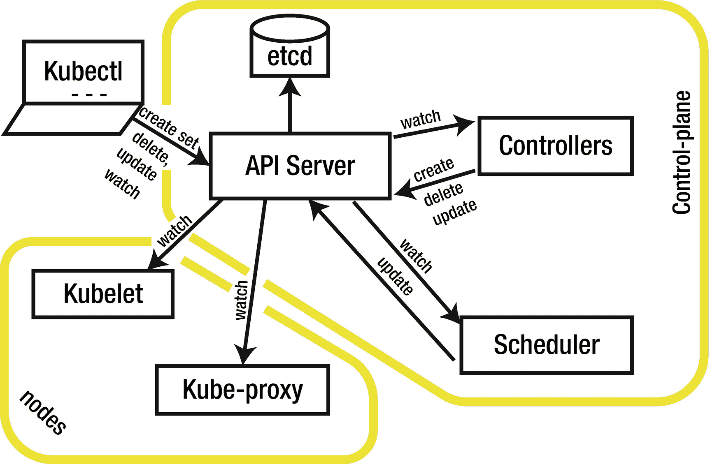
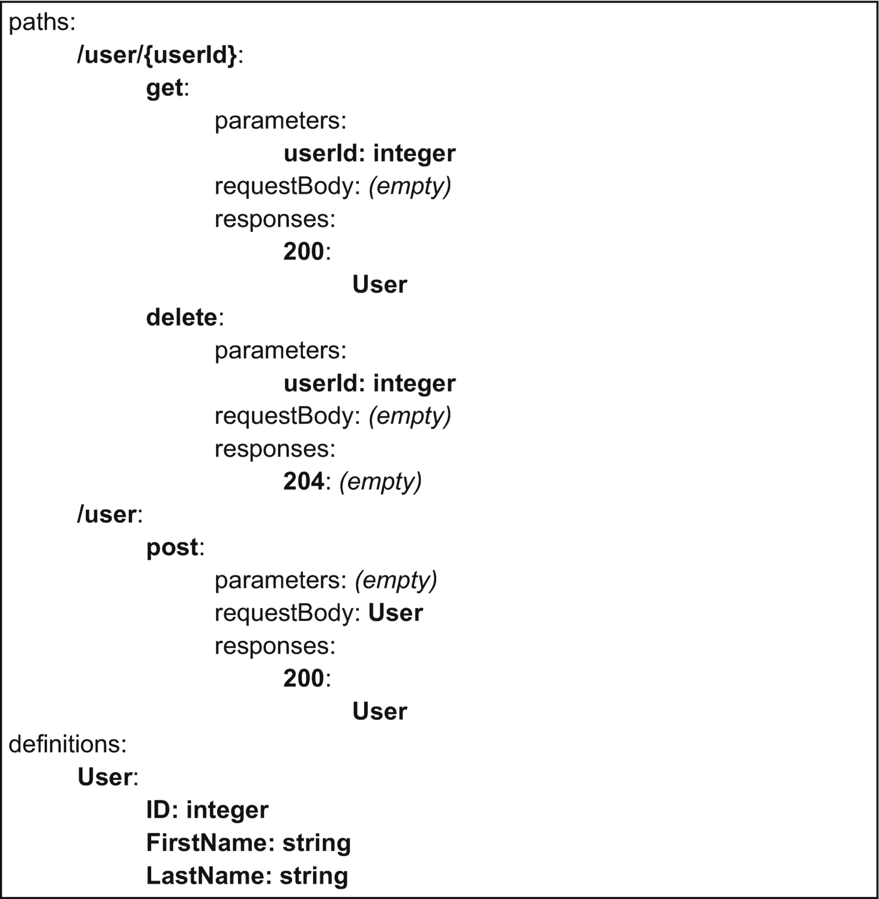
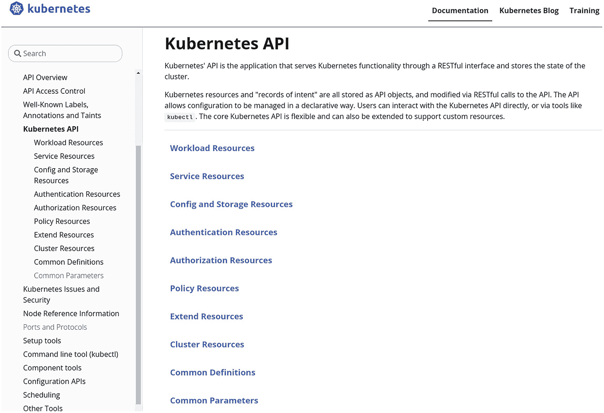
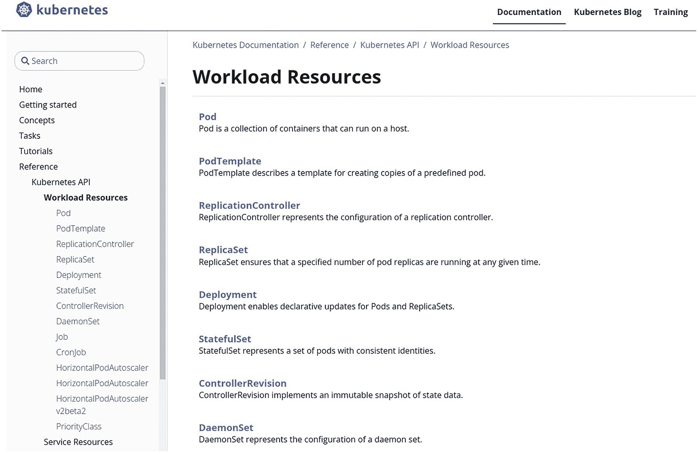
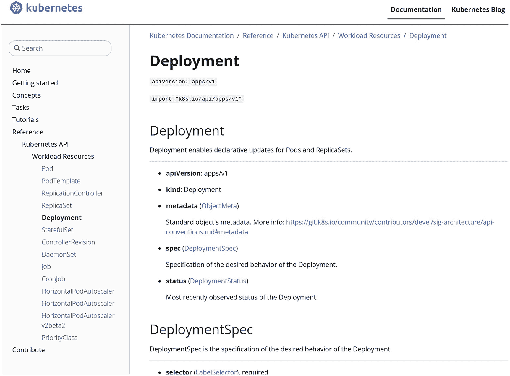
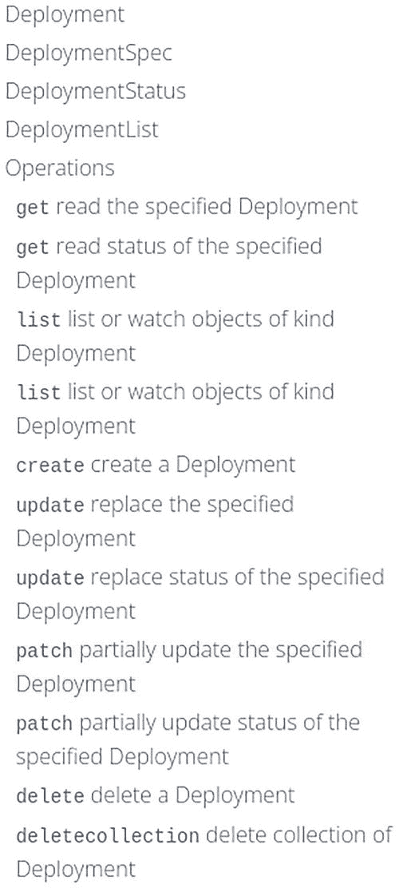
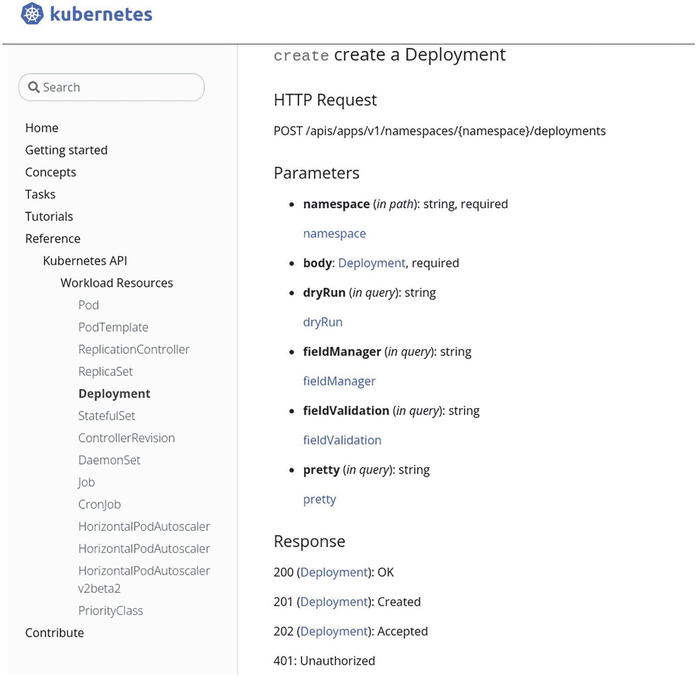
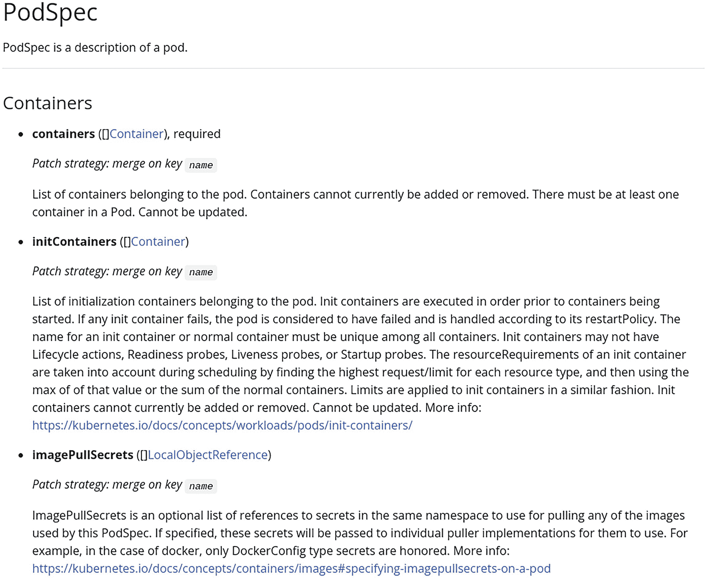

# 1. Kubernetes API 简介

Kubernetes 是一个以声明式模式运行容器编排的平台。描述 Kubernetes 平台构建方式的方法数不胜数。本书专注于使用该平台进行编程。

Kubernetes 平台的入口是 API。本章通过强调 Kubernetes API 的核心作用来探讨其架构。然后，重点介绍 Kubernetes API 的 HTTP REST 特性，以及为组织其管理的众多资源而添加的扩展。

最后，你将学会如何高效地浏览参考文档，以便每天都能从中提取最大量的有用信息。


## Kubernetes 平台概览

在流程的一端，用户声明用于构建应用部署的高级资源：`Deployments`、`Ingresses` 等。

在中间，控制器被激活，将这些资源转化为低级资源（`Pods`），而调度器则将这些资源分配到各个节点。在流程的另一端，节点代理负责将低级资源部署到节点上。

Kubernetes 平台（通常称为控制平面）的主要元素在图 1-1 中高亮显示，并在下文进行描述：

1.  **API 服务器** – 这是控制平面的核心点；用户及控制平面的各个组件通过此 API 进行创建、获取、删除、更新和监视资源等操作。
2.  **`etcd` 数据库** – 仅可由 API 服务器访问，用于持久化存储与资源相关的数据。
3.  **控制器管理器** – 运行各类控制器，将用户声明的高级资源转换为待部署到节点上的低级资源。控制器连接到 API 服务器，监视高级资源，并创建、删除和更新低级资源，以满足高级资源中声明的规范。
4.  **调度器** – 将低级资源分配到各个节点上。调度器连接到 API 服务器，以监视未分配的资源，并将它们关联到相应节点。
5.  **Kubelet** – 这是一个运行在集群所有节点上的代理，每个代理管理分配到其所在节点的工作负载。`kubelet` 连接到 API 服务器，以监视分配到其节点上的 Pods 资源，并使用本地容器运行时部署相关联的容器。
6.  **Kube proxy** – 这是一个运行在集群所有节点上的代理，每个代理管理分配到其所在节点的网络配置。`kube proxy` 连接到 API 服务器，以监视 Service 资源，并在其节点上配置相关的网络规则。



Kubernetes 架构的流程图。控制平面包含一个 API 服务器，它与控制器和调度器双向连接。它在控制平面内与 `etcd` 有一条单独连接，并与节点上的 Kubelet 和 Kube-proxy 连接。

**图 1-1** Kubernetes 架构

## OpenAPI 规范

Kubernetes API 是一个 HTTP REST API。Kubernetes 团队以 OpenAPI 格式提供了该 API 的规范，v2 格式位于 `https://github.com/kubernetes/kubernetes/tree/master/api/openapi-spec`，或在 Kubernetes v1.24 中，v3 格式位于 `https://github.com/kubernetes/kubernetes/tree/master/api/openapi-spec/v3`。

这些规范也可以通过 API 服务器在路径 `/openapi/v2` 和 `/openapi/v3` 上进行访问。

OpenAPI 规范由多个部分组成，其中主要包括路径列表和定义列表。路径是您请求此 API 时使用的 URL，针对每个路径，规范会给出不同的操作，例如 `get`、`delete` 或 `post`。然后，对于每个操作，规范会指明请求的参数和体格式，以及可能的响应码和相应的响应体格式。

请求和响应的参数及体可以是简单类型，或者更常见的是包含数据的结构。定义列表包含了用于构建操作请求和响应参数及体的数据结构。

图 1-2 是一个用户 API 规范的简化视图。该 API 可以接受两个不同的路径：`/user/{userId}` 和 `/user`。第一个路径 `/user/{userId}` 可以接受两个操作，分别是 `get` 和 `delete`，用于根据用户 ID 获取特定用户的信息；以及根据用户 ID 删除特定用户的信息。第二个路径 `/user` 可以接受一个操作 `post`，用于根据提供的信息添加新用户。

在此 API 中，给出了一个 `User` 结构的定义，描述了用户的信息：其 ID、名字和姓氏。此数据结构用于第一个路径上 `get` 操作的响应体，以及第二个路径上 `post` 操作的请求体中。



一段伪代码。子标题路径包括 get、delete 和 post 操作。第二个子标题定义指示了用户 ID、名字和姓氏。

**图 1-2** 简化的用户 API 规范

## 动词与种类

Kubernetes API 在此规范的基础上增加了两个概念：**Kubernetes API 动词** 和 **Kubernetes 种类**。

Kubernetes API 动词直接映射到 OpenAPI 规范中的操作。定义的动词包括 `get`、`create`、`update`、`patch`、`delete`、`list`、`watch` 和 `deletecollection`。它们与 HTTP 动词的对应关系见表 1-1。

**表 1-1** Kubernetes API 动词与 HTTP 动词的对应关系

| Kubernetes API 动词 | HTTP 动词 |
| --- | --- |
| `get` | GET |
| `create` | POST |
| `update` | PUT |
| `patch` | PATCH |
| `delete` | DELETE |
| `list` | GET |
| `watch` | GET |
| `deletecollection` | DELETE |

Kubernetes 种类是 OpenAPI 规范中定义的一个子集。当向 Kubernetes API 发起请求时，数据结构会通过请求和响应的体进行交换。这些结构共享公共字段 `apiVersion` 和 `kind`，以帮助请求的参与者识别这些结构。

如果您想让您的用户 API 管理这个种类概念，`User` 结构将包含两个额外字段 `apiVersion` 和 `kind`——例如，值分别为 `v1` 和 `User`。要判断 Kubernetes OpenAPI 规范中的某个定义是否为一个 Kubernetes 种类，您可以查看该定义的 `x-kubernetes-group-version-kind` 字段。如果此字段已定义，则该定义就是一个种类，并且它会提供 `apiVersion` 和 `kind` 字段的值。


## 组-版本-资源

Kubernetes API 是一个 REST API，因此它管理着*资源*，而管理这些资源的路径遵循 REST 命名约定——即使用复数名称来标识资源，并对这些资源进行分组。

由于 Kubernetes API 管理着数百种资源，它们被分组在一起；又因为 API 会不断演进，资源也有了版本。出于这些原因，每个资源都属于特定的*组*和*版本*，并且每个资源都由一个“组-版本-资源”唯一标识，通常被称为 `GVR`。

要查找 Kubernetes API 中的各种资源，你可以浏览 OpenAPI 规范来提取不同的路径。传统资源（例如 `pods` 或 `nodes`）在 Kubernetes API 早期就已引入，它们都属于 `core` 组和 `v1` 版本。

管理集群范围传统资源的路径遵循格式 `/api/v1/<复数资源名称>`——例如，使用 `/api/v1/nodes` 来管理 `nodes`。请注意，`core` 组并未在路径中体现。要管理特定命名空间中的资源，路径格式为 `/api/v1/namespaces/<命名空间名称>/<复数资源名称>`——例如，使用 `/api/v1/namespaces/default/pods` 来管理 `default` 命名空间中的 `pods`。

较新的资源可通过遵循以下格式的路径访问：`/apis/<组>/<版本>/<复数资源名称>` 或 `/apis/<组>/<版本>/namespaces/<命名空间名称>/<复数资源名称>`。

总结一下，访问资源的各种路径格式如下：

* `/api/v1/<复数名称>` – 用于访问非命名空间的传统资源

  例如：`/api/v1/nodes` 用于访问非命名空间的 `nodes` 资源

  或者

* 用于跨集群访问命名空间的传统资源

  例如：`/api/v1/pods` 用于访问所有命名空间中的 `pods`

* `/api/v1/namespaces/<ns>/<复数名称>` – 用于访问特定命名空间中的传统命名空间资源

  例如：`/api/v1/namespaces/default/pods` 用于访问 `default` 命名空间中的 `pods`

* `/apis/<组>/<版本>/<复数名称>` – 用于访问特定组和版本中的非命名空间资源

  例如：`/apis/storage.k8s.io/v1/storageclasses` 用于访问非命名空间的 `storageclasses`（组 `storage.k8s.io`，版本 `v1`）

  或者

* 用于跨集群访问命名空间资源

  例如：`/apis/apps/v1/deployments` 用于访问所有命名空间中的 `deployments`

* `/apis/<组>/<版本>/namespaces/<ns>/<复数名称>` – 用于访问特定命名空间中的命名空间资源

  例如：`/apis/apps/v1/namespaces/default/deployments` 用于访问 `default` 命名空间中的 `deployments`（组 `apps`，版本 `v1`）

## 子资源

遵循 REST API 约定，资源可以拥有子资源。子资源是从属于另一个资源的资源，可以通过在资源名称后指定其名称来访问，如下所示：

* `/api/v1/<复数>/<资源名称>/<子资源>`

  例如：`/api/v1/nodes/node1/status`

* `/api/v1/namespaces/<ns>/<复数>/<资源名称>/<子资源>`

  例如：`/api/v1/namespaces/ns1/pods/pod1/status`

* `/apis/<组>/<版本>/<复数>/<资源名称>/<子资源>`

  例如：`/apis/storage.k8s.io/v1/volumeattachments/volatt1/status`

* `/apis/<组>/<版本>/namespaces/<ns>/<复数>/<名称>/<子资源>`

  例如：`/apis/apps/v1/namespaces/ns1/deployments/dep1/status`

大多数 Kubernetes 资源都有一个 `status` 子资源。在编写 operator 时，你会看到 operator 需要更新 `status` 子资源，以便能够指示 operator 观察到的该资源的状态。可以在 `status` 子资源上执行的操作有 `get`、`patch` 和 `update`。Pod 拥有更多子资源，包括 `attach`、`binding`、`eviction`、`exec`、`log`、`portforward` 和 `proxy`。这些子资源对于获取特定运行中 Pod 的信息，或在运行中的 Pod 上执行某些特定操作等非常有用。

可以进行扩缩容的资源（例如 deployments、replicasets 等）都有一个 `scale` 子资源。可以在 `scale` 子资源上执行的操作有 `get`、`patch` 和 `update`。

## 官方 API 参考文档

API 的官方参考文档可以在 [`https://kubernetes.io/docs/reference/kubernetes-api/`](https://kubernetes.io/docs/reference/kubernetes-api/) 找到。API 管理的资源首先按类别（即工作负载、存储等）分组，对于每个类别，你可以获得一个资源名称列表及其简短描述（图 1-3）。

注意这些类别并非 Kubernetes API 定义的一部分，而是用于该网站，以帮助新手用户在众多可用资源中找到方向。



Kubernetes 网页的截图包含三个标签：文档、Kubernetes 博客和培训。文档标签被选中。文本显示“关于 Kubernetes API”。

图 1-3

按类别分组的 Kubernetes 资源

准确地说，显示的名称并非 REST 意义上的资源名称，而是关联的主要种类，如图 1-4 所示。例如，在管理 *Pods* 时，REST 路径中使用的资源名称是 `pods`（即小写复数形式），而在 HTTP 请求期间用于交换 *Pods* 信息的定义被称为 `Pod`（即大写单数形式）。请注意，其他种类也可以与同一资源关联。在本章的示例中，`PodList` 种类（用于交换 *Pod 列表* 信息）也存在。



Kubernetes 网页的截图包含三个标签：文档、Kubernetes 博客和培训。文档标签被选中。它展示了 8 个工作负载资源，包括 Pod、Pod 模板、Replication Controller 和 Deployment。

图 1-4

特定类别的资源及其简短描述


### 部署文档

我们来探索一下**Deployment**的参考页面，地址为：[`https://kubernetes.io/docs/reference/kubernetes-api/workload-resources/deployment-v1/`](https://kubernetes.io/docs/reference/kubernetes-api/workload-resources/deployment-v1/)。该页面的标题**Deployment**是与图 1-5 中所示的 `deployments` 资源相关的主要种类（kind）。



一张 Kubernetes 网页的截图，包含两个标签页，分别标记为文档和 Kubernetes 博客。文档标签页被选中。它展示了部署信息和部署规范。

图 1-5

Deployment 文档页面

页眉中指示的 `apiVersion` 可以帮助你编写 `Deployment` 资源的 YAML 清单，因为你需要为 Kubernetes 清单中的每个资源指定 `apiVersion` 和 `kind`。

在这种情况下，你知道部署清单将以如下内容开头：

```
apiVersion: apps/v1
kind: Deployment
```

下一行页眉指示了编写 Go 代码时要使用的 `import`。在第 3 章中，你将看到如何在 Go 中描述资源时使用此导入。


一个虚线矩形包含文本 O B J。

在页眉之后，描述了一个结构定义列表，也可以从图 1-6 中 Deployment 文档页面的目录中访问。第一个是资源的主要种类（kind），其后可选地跟随一些结构定义，这些结构定义用于第一个种类的字段中。



一张部署目录的截图，包含一个操作列表。它高亮显示了“patch：部分更新指定的部署”。

图 1-6

Deployment 文档页面的目录

例如，`Deployment` 种类包含一个类型为 `DeploymentSpec` 的 `spec` 字段，该字段将在后文描述。请注意，`DeploymentSpec` 不是一个在 HTTP 请求期间直接交换的结构，因此，它不是一个种类（kind），并且不包含 `kind` 或 `apiVersion` 字段。

在主要种类及其相关定义之后，会显示与该资源相关的其他种类。在此例中，是 `DeploymentList` 种类。

### 操作文档

API 文档中关于资源的下一项内容是可能对该资源或其子资源执行的操作列表，这些内容也可以从目录页面访问（见图 1-6）。通过检查用于“创建 Deployment”的 `create` 操作的详细信息，如图 1-7 所示，你可以看到要使用的 HTTP 请求动词和路径、请求期间要传递的参数以及可能的响应。用于该请求的 HTTP 动词是 `POST`，路径是 `/apis/apps/v1/namespaces/{namespace}/deployments`。



一张 Kubernetes 网页的截图。右侧窗格包含创建部署的详细信息：HTTP 请求、参数和响应。左侧窗格包含一个选项列表，其中包括工作负载资源。

图 1-7

“创建” Deployment 操作的详细信息

路径中的 `{namespace}` 部分表示一个*路径*参数，需要将其替换为你想要在其中创建部署的命名空间名称。你可以指定*查询*参数：`dryRun`、`fieldManager`、`fieldValidation` 和 `pretty`。这些参数将按照 `path?dryRun=All` 格式跟在路径之后。

请求体必须是一个 `Deployment` 种类。当你使用 `kubectl` 时，你编写的*Kubernetes 清单*就包含了这个请求体。在第 3 章中，你将看到如何在 Go 中构建这个请求体。可能的 HTTP 响应状态码有：200、201、202 和 401；对于 2xx 状态码，响应体将包含一个 `Deployment` 种类。

### Pod 文档

某些结构包含许多字段。对于它们，Kubernetes API 文档会对字段进行分类。一个例子是 `Pod` 资源的文档。

[Pod 资源的文档页面](https://kubernetes.io/docs/reference/kubernetes-api/workload-resources/pod-v1/) 首先包含主要种类 `Pod` 的描述，接着是 `PodSpec` 结构的描述。`PodSpec` 结构包含大约 40 个字段。为了帮助你理解这些字段之间的关系并简化探索，它们被分门别类。`PodSpec` 字段的类别如下：*Containers*、*Volumes*、*Scheduling*、*Lifecycle* 等。

此外，对于包含嵌套字段的字段，其描述通常以内联方式显示，以避免在结构描述之间来回跳转。然而，对于复杂结构，其描述会在页面后续部分给出，并且在字段名称旁边会有一个链接以便轻松访问。

对于 `Spec` 和 `Status` 结构，情况总是如此，因为它们几乎在所有资源中都非常常见。此外，对于 `Pod` 种类中使用的一些结构也是如此——例如 `Container`、`EphemeralContainer`、`LifecycleHandler`、`NodeAffinity` 等。

某些在多个资源中使用的结构会被放置在*通用定义*部分，并且在字段名称旁边会有一个链接以便轻松访问。在图 1-8 中，你可以看到 `PodSpec` 结构描述中的 *Containers* 类别。



一张 Pod 规范的截图，描绘了包含 3 个子标题的容器：1. 容器。2. 初始化容器。3. 镜像拉取密钥。

图 1-8

`PodSpec` 结构文档的摘录

你还可以看到，`containers` 和 `initContainers` 字段与 `Container` 类型相同，后者将在页面稍后部分描述，并且可以通过链接访问。`imagePullSecrets` 字段的类型是 `LocalObjectReference`，它在*通用定义*部分中描述，并且也可以通过链接访问。

### 文档的单页版本

API 参考文档还有另一个版本，它呈现在单个页面上。此版本涵盖了由某个 Kubernetes 版本提供的所有资源版本（而不仅仅是最新版本）。此版本（如果你愿意，可以更改路径的最后部分以导航到其他 Kubernetes 版本）可以在以下 URL 找到：

[`https://kubernetes.io/docs/reference/generated/kubernetes-api/v1.24/`](https://kubernetes.io/docs/reference/generated/kubernetes-api/v1.24/)

## 总结

在本章中，你已经能够发现 Kubernetes 平台的架构，并且了解到 API 服务器扮演着核心角色。Kubernetes API 是一个 HTTP REST API，其资源被分类到各种带版本号的组中。

种类（Kinds）是用于在 API 服务器和客户端之间交换数据的特定结构。你可以使用 Kubernetes 官方网站，以人类可读的形式浏览 API 规范，从而发现各种资源和种类的结构、每个资源和子资源可用的不同操作及其关联的动词。


