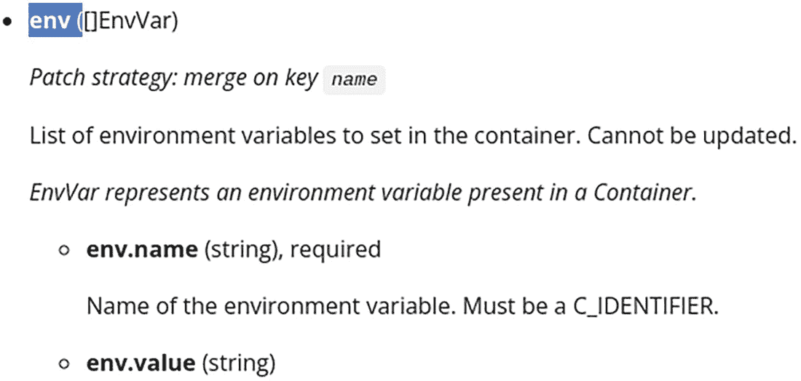

# 2. Kubernetes API 操作

前一章介绍了 Kubernetes API 遵循 REST 原则，使用户能够操作资源。

在本章中，你将学习如何通过直接发起 HTTP 请求来执行各种操作。在日常工作中，你可能不需要直接与 HTTP 层交互，但理解 API 在这一层面的工作原理是非常重要的，这样你才能更好地理解如何使用更高级的库来调用它。

## 检查请求

在开始编写自己的 HTTP 请求之前，你可以使用 `kubectl` 检查执行 `kubectl` 命令时使用了哪些请求。这可以通过在命令后添加详细输出标志 `-v` 并将值设置为大于或等于 `6` 来实现。表 2-1 显示了每个级别展示的信息。

例如，如果你想了解获取所有命名空间的 Pod 时调用了哪个 URL，可以使用以下命令：

```
$ kubectl get pods --all-namespaces -v6
loader.go:372] Config loaded from file:  /home/user/.kube/config
round_trippers.go:553] GET https://192.168.1.194:6443/api/v1/pods?limit=500 200 OK in 745 milliseconds
```

在命令的输出中，你可以看到使用的路径是 `/api/v1/pods`。或者，当获取特定命名空间中的 Pod 时，你可以看到使用的路径是 `/api/v1/namespaces/default/pods`：

```
$ kubectl get pods --namespace default -v6
loader.go:372] Config loaded from file:  /home/user/.kube/config
round_trippers.go:553] GET https://192.168.1.194:6443/api/v1/namespaces/default/pods?limit=500 200 OK in 138 milliseconds
```

表 2-1

详细级别

| 级别 | 方法和 URL | 请求时序 | 事件时序 | 请求头 | 响应状态 | 响应头 | Curl 命令 | 主体长度 |
| --- | --- | --- | --- | --- | --- | --- | --- | --- |
| `-v 6` | 是 | 是 | – | – | – | – | – | 0 |
| `-v 7` | 是 | – | – | 是 | 是 | – | – | 0 |
| `-v 8` | 是 | – | – | 是 | 是 | 是 | - | ≤ 1024 |
| `-v 9` | 是 | 是 | 是 | – | – | 是 | 是 | ≤ 10240 |
| `-v 10` | 是 | 是 | 是 | – | – | 是 | 是 | ∞ |

## 发起请求

本节将探讨你可以对 Kubernetes 资源执行的所有可能操作。

### 使用 `kubectl` 作为代理

你必须通过认证才能向集群的 Kubernetes API 发起请求，除非你的集群接受未经认证的请求，但这种情况不太可能。

一种发送经过身份验证的 HTTP 请求的方法是使用 `kubectl` 作为代理来处理身份验证。为此，可以使用 `kubectl proxy` 命令：

```
$ kubectl proxy
Starting to serve on 127.0.0.1:8001
```

现在，你可以在一个新的终端中运行你的 HTTP 请求，而无需任何身份验证。接下来，定义一个 `HOST` 变量来访问该代理：

```
$ HOST=http://127.0.0.1:8001
```

## 创建资源

您可以通过首先创建一个描述此资源的 Kubernetes 清单来创建新资源——例如，要创建一个 Pod，你可以编写：

```
$ cat > pod.yaml <<EOF
apiVersion: v1
kind: Pod
metadata:
name: nginx
spec:
containers:
- image: nginx
name: nginx
EOF
```

然后，你需要将资源描述作为 POST 请求的主体传递（注意，因为正在使用 `--data-binary` 标志，所以 `-X POST` 标志可以省略）。例如，要创建一个 Pod 资源，请使用：

```
$ curl $HOST/api/v1/namespaces/project1/pods
-H "Content-Type: application/yaml"
--data-binary @pod.yaml
```

这等同于运行以下 `kubectl` 命令：

```
$ kubectl create --namespace project1 -f pod.yaml -o json
```

请注意，命名空间未在 `pod.yaml` 文件中指明。如果你添加了它，则必须在 YAML 文件和路径中指定相同的命名空间，否则你会收到错误——也就是说，所提供对象的命名空间与请求中发送的命名空间不匹配。

### 获取资源信息

你可以使用 GET 请求来获取特定资源的信息，并在路径中将其名称作为参数传递（如果是命名空间范围的资源，还需要传递其命名空间）。在此示例中，你将请求 `project1` 命名空间中名为 `nginx` 的 `pod` 的信息：

```
$ curl -X GET
$HOST/api/v1/namespaces/project1/pods/nginx
```

这将使用与此资源关联的类型作为结构，以 JSON 格式返回资源信息；在此示例中，它是一个 `Pod` 类型。这等同于运行以下 `kubectl` 命令：

```
$ kubectl get pods --namespace project1 nginx -o json
```

## 获取资源列表

对于命名空间范围的资源，你可以获取集群范围内或特定命名空间中的资源列表。对于非命名空间范围的资源，你可以获取资源列表。无论哪种情况，你都将使用 GET 请求。

#### 集群范围

要获取集群范围内（针对命名空间范围或非命名空间范围的资源）的资源列表，例如，对于 Pod 资源，请使用以下命令：

```
$ curl $HOST/api/v1/pods
```

这将使用 `PodList` 类型，返回所有命名空间中 Pod 列表的信息。这等同于运行以下 `kubectl` 命令：

```
$ kubectl get pods --all-namespaces -o json
```

#### 在特定命名空间中

要获取特定命名空间中的资源列表，你需要在路径中指明命名空间；例如，对于 Pod 资源，请使用以下命令：

```
$ curl $HOST/api/v1/namespaces/project1/pods
```

这将使用 `PodList` 类型，返回 `project1` 命名空间中 Pod 列表的信息。这等同于运行以下 `kubectl` 命令：

```
$ kubectl get pods --namespace project1 -o json
```

## 过滤列表结果

当执行 *list* 请求时，你会获得该类型、在指定命名空间或集群范围内的完整资源列表，具体取决于你的请求。

你可能希望过滤结果。在 Kubernetes 中过滤资源最常用的方法是使用 *标签*。为此，资源需要定义标签；然后，在 *list* 请求期间，你可以定义一些 *标签选择器*。还可以通过使用 *字段选择器*，基于有限的字段集来过滤资源。


### 使用标签选择器

所有 Kubernetes 资源都可以定义标签。例如，在创建 Pod 时，你可以通过 `kubectl` 定义一些标签：

```
$ kubectl run nginx1 --image nginx --labels mylabel=foo
$ kubectl run nginx2 --image nginx --labels mylabel=bar
```

这会产生在资源元数据部分定义了标签的 Pod：

```
$ kubectl get pods nginx1 -o yaml
apiVersion: v1
kind: Pod
metadata:
labels:
mylabel: foo
name: nginx1
[...]
$ kubectl get pods nginx2 -o yaml
apiVersion: v1
kind: Pod
metadata:
labels:
mylabel: bar
name: nginx2
[...]
```

现在，当执行 *列表* 请求时，你可以通过 `labelSelector` 查询参数定义一些 *标签选择器* 来过滤这些资源，该参数可以包含一个逗号分隔的选择器列表。

-   选择所有定义了特定标签的资源，无论其值如何；例如，`mylabel` 标签：

```
$ curl $HOST/api/v1/namespaces/default/pods?labelSelector=mylabel
```

-   选择所有未定义特定标签的资源；例如，`mylabel` 标签：

```
$ curl $HOST/api/v1/namespaces/default/pods?labelSelector=\!mylabel
```

注意标签名称前的感叹号 (`!`)——这里使用了反斜杠字符 (`\`)，因为感叹号是 shell 的特殊字符。

-   选择所有定义了标签并具有特定值的资源；例如，`mylabel` 的值为 `foo`：

```
$ curl $HOST/api/v1/namespaces/default/pods?labelSelector=mylabel==foo
```

或

```
$ curl $HOST/api/v1/namespaces/default/pods?labelSelector=mylabel=foo
```

-   选择所有定义了标签但值不同于某个特定值的资源；例如，标签 `mylabel` 的值不等于 `foo`：

```
$ curl $HOST/api/v1/namespaces/default/pods?labelSelector=mylabel\!=foo
```

注意等号 (`=`) 之前的感叹号 (`!`)——这里使用了反斜杠字符 (`\`)，因为感叹号是 shell 的特殊字符。

-   选择所有定义了标签且其值属于某个值集合的资源；例如，标签 `mylabel` 的值为 `foo` 或 `baz`：

```
$ curl $HOST/api/v1/namespaces/default/pods?labelSelector=mylabel+in+(foo,baz)
```

注意 URL 中用于编码空格的加号 (`+`)。原始选择器为：`mylabel in (foo,baz)`。

-   选择所有定义了标签且其值不属于某个值集合的资源；例如，标签 `mylabel` 的值不是 `foo` 或 `baz`：

```
$ curl $HOST/api/v1/namespaces/default/pods?labelSelector=mylabel+notin+(foo,baz)
```

注意 URL 中用于编码空格的加号 (`+`)。原始选择器为：`mylabel not in (foo,baz)`。

你可以通过逗号分隔多个选择器来组合它们。这将充当 *AND* 运算符。例如，要选择所有定义了 `mylabel` 标签 *并且* `otherlabel` 标签等于 `bar` 的资源，你可以使用以下标签选择器：

```
$ curl $HOST/api/v1/namespaces/default/pods?labelSelector=mylabel,otherlabel==bar
```

### 使用字段选择器

你可以使用一组有限的字段来过滤资源。对于所有资源，你可以按 `metadata.name` 字段过滤；对于所有命名空间资源，你可以按 `metadata.namespace` 字段过滤。

以下是 Kubernetes 1.23 中可用于过滤的额外字段列表，具体取决于资源：

`core.event:`
- `involvedObject.apiVersion`
- `involvedObject.fieldPath`
- `involvedObject.kind`
- `involvedObject.name`
- `involvedObject.namespace`
- `involvedObject.resourceVersion`
- `involvedObject.uid`
- `reason`
- `reportingComponent`
- `source`
- `type`

`core.namespace:`
- `status.phase`

`core.node:`
- `spec.unschedulable`

`core.pod:`
- `spec.nodeName`
- `spec.restartPolicy`
- `spec.schedulerName`
- `spec.serviceAccountName`
- `status.nominatedNodeName`
- `status.phase`
- `status.podIP`

`core.replicationcontroller:`
- `status.replicas`

`core.secret:`
- `type`

`apps.replicaset:`
- `status.replicas`

`batch.job:`
- `status.successful`

`certificates.certificatesigningrequest:`
- `spec.signerName`

现在，当执行 *列表* 请求时，你可以通过 `fieldSelector` 参数指示一些 *字段选择器* 来过滤这些资源，该参数可以包含一个逗号分隔的选择器列表。

-   选择所有某个字段具有特定值的资源；例如，字段 `status.phase` 的值为 `Running`：

```
$ curl $HOST/api/v1/namespaces/default/pods?fieldSelector=status.phase==Running
```

或

```
$ curl $HOST/api/v1/namespaces/default/pods?fieldSelector=status.phase=Running
```

-   选择所有某个字段的值不同于某个特定值的资源；例如，字段 `status.phase` 的值不是 `Running`：

```
$ curl $HOST/api/v1/namespaces/default/pods?fieldSelector=status.phase\!=Running
```

注意等号 (`=`) 之前的感叹号 (`!`)——这里使用了反斜杠字符 (`\`)，因为感叹号是 shell 的特殊字符。

你可以通过逗号分隔多个选择器来组合它们。这将充当 *AND* 运算符。例如，要选择所有 *phase* 等于 `Running` 并且 *重启策略* 不是 `Always` 的 Pod，你可以使用这个字段选择器：

```
$ curl $HOST/api/v1/namespaces/default/pods?fieldSelector=status.phase==Running,spec.restartPolicy\!=Always
```

## 删除资源

要删除一个资源，你需要在路径中指定其名称（以及命名空间资源的命名空间），并使用 `DELETE` 请求。例如，要删除一个 Pod，使用以下命令：

```
$ curl -X DELETE $HOST/api/v1/namespaces/project1/pods/nginx
```

这将返回已删除资源的 JSON 格式信息，并使用与该资源关联的 kind——在本例中，是 `Pod` kind。

这等同于运行 `kubectl` 命令（不同之处在于你无法获取已删除资源的信息，只能通过 `-o name` 标志获取其名称）：

```
$ kubectl delete pods --namespace project1 nginx
```

## 删除资源集合

也可以使用 `DELETE` 请求删除特定命名空间中给定资源的一个集合；对于命名空间资源，需要在路径中指明命名空间：

```
$ curl -X DELETE $HOST/api/v1/namespaces/project1/pods
```

这将返回已删除资源的 JSON 格式信息，并使用与该资源关联的 List kind；在这个例子中，是 `PodList` kind。

这等同于运行 `kubectl` 命令（不同之处在于你无法获取已删除资源的信息，只能通过 `-o name` 标志获取其名称）：

```
$ kubectl delete pods --namespace project1 --all
```

请注意，无法像使用 `kubectl` 命令那样，通过单个请求删除所有命名空间中某一种特定 kind 的所有资源：`kubectl delete pods --all-namespaces --all`。


## 更新资源

你可以使用 `PUT` 请求来替换特定资源的全部信息，只需在请求路径中指定资源名称（对于命名空间资源还需指定命名空间），并在请求体中提供新的资源信息。

举例说明，你可以先使用以下命令定义一个新的 Deployment：

```
$ cat > deploy.yaml <<EOF
apiVersion: apps/v1
kind: Deployment
metadata:
name: nginx
spec:
selector:
matchLabels:
app: nginx
template:
metadata:
labels:
app: nginx
spec:
containers:
- image: nginx
name: nginx
EOF
```

然后，可以使用以下命令在集群中创建这个 Deployment：

```
$ curl $HOST/apis/apps/v1/namespaces/project1/deployments \
-H "Content-Type: application/yaml" \
--data-binary @deploy.yaml
```

接下来，你可以为该 Deployment 创建一个更新后的清单文件；例如，使用以下命令更新容器的镜像（这将把镜像名称 `nginx` 替换为 `nginx:latest`）：

```
$ cat deploy.yaml | sed 's/image: nginx/image: nginx:latest/' > deploy2.yaml
```

最后，你可以使用以下请求将更新后的 Deployment 应用到集群中：

```
$ curl -X PUT $HOST/apis/apps/v1/namespaces/project1/deployments/nginx \
-H "Content-Type: application/yaml" \
--data-binary @deploy2.yaml
```

这相当于执行 `kubectl` 命令：

```
$ kubectl replace --namespace project1 -f deploy2.yaml -o json
```

### 管理更新资源时的冲突

如果使用上述技术更新资源时，在您创建资源到更新资源之间，有其他参与者对该资源进行了修改，那么您更新时，其他参与者的修改将会丢失。

为避免这种冲突风险，您可以先读取资源信息（使用 `GET` 请求）找到资源元数据中 `resourceVersion` 字段的值，然后在您要更新的资源规格中指明这个 `resourceVersion`。

通过使用这个 `resourceVersion` 发送 `PUT` 请求，API 服务器会比较接收到的资源与当前资源的 `resourceVersion` 值。如果值不同（因为在此期间有其他参与者修改了资源），API 服务器将回复一个错误：`Operation cannot be fulfilled on [...]: the object has been modified; please apply your changes to the latest version and try again`。

举例说明，我们先创建这个 Deployment（如果之前小节已创建，请务必先将其删除）：

```
$ curl $HOST/apis/apps/v1/namespaces/project1/deployments \
-H "Content-Type: application/yaml" \
--data-binary @deploy.yaml
```

您会收到一个响应，其中包含了您所创建资源的 `resourceVersion`；在本例中，它为 `668867`：

```
{
"kind": "Deployment",
"apiVersion": "apps/v1",
"metadata": {
"name": "nginx",
"namespace": "project1",
"uid": "99d3a1eb-176c-40de-89ec-74313169fe60",
"resourceVersion": "668867",
"generation": 1,
[...]
}
```

等待几秒后，您可以执行一个 `GET` 请求来获取最新版本，并将收到如下响应：

```
$ curl $HOST/apis/apps/v1/namespaces/project1/deployments/nginx
{
"kind": "Deployment",
"apiVersion": "apps/v1",
"metadata": {
"name": "nginx",
"namespace": "project1",
"uid": "99d3a1eb-176c-40de-89ec-74313169fe60",
"resourceVersion": "668908",
"generation": 1,
[...]
}
```

您可以看到 `resourceVersion` 已经自增，现在为 `668908`。这是因为 Deployment 控制器自行更新了资源。

现在，如果您将第一次收到的版本号添加到您的 YAML 清单中并尝试更新该 Deployment，您将收到一个错误，指示检测到冲突：

```
$ cat > deploy2.yaml <<EOF
apiVersion: apps/v1
kind: Deployment
metadata:
name: nginx
resourceVersion: "668867"
spec:
selector:
matchLabels:
app: nginx
template:
metadata:
labels:
app: nginx
spec:
containers:
- image: nginx
name: nginx
EOF
$ curl -X PUT $HOST/apis/apps/v1/namespaces/project1/deployments/nginx \
-H "Content-Type: application/yaml" \
--data-binary @deploy2.yaml
{
"kind": "Status",
"apiVersion": "v1",
"metadata": {
},
"status": "Failure",
"message": "Operation cannot be fulfilled on deployments.apps \"nginx\": the object has been modified; please apply your changes to the latest version and try again",
"reason": "Conflict",
"details": {
"name": "nginx",
"group": "apps",
"kind": "deployments"
},
"code": 409
}
```

现在，如果您使用以下命令将 YAML 清单更新为最新的 `resourceVersion`，并再次运行 `PUT` 命令，操作将成功：

```
$ sed -i 's/668867/668908/' deploy2.yaml
$ curl -X PUT $HOST/apis/apps/v1/namespaces/project1/deployments/nginx \
-H "Content-Type: application/yaml" \
--data-binary @deploy2.yaml
{
"kind": "Deployment",
"apiVersion": "apps/v1",
"metadata": {
"name": "nginx",
"namespace": "project1",
"uid": "99d3a1eb-176c-40de-89ec-74313169fe60",
"resourceVersion": "671623",
"generation": 2,
[...]
}
```

### 使用策略合并补丁更新资源

修改资源时，可以不发送其完整描述，而是通过使用 *补丁* 仅发送您想要修改的部分。

这可以通过 `PATCH` 请求实现，请求内容类型为 `application/strategic-merge-patch+json`，并在请求路径中指定资源名称（对于命名空间资源还需指定命名空间），在请求体中提供补丁信息。

补丁信息是 YAML 清单的一个片段，仅包含您想要更新的字段。这样做时，您在路径中指定的字段将被更新，而未在补丁中指定的字段将保持不变。

举例说明，您可以先使用以下命令创建一个包含补丁信息的文件：

```
$ cat > deploy-patch.json <<EOF
{
"spec":{
"template":{
"spec":{
"containers":[{
"name":"nginx",
"image":"nginx:alpine"
}]
}}}}
EOF
```

然后，您可以使用以下请求将此补丁应用到资源：

注意要使用特定的 `Content-Type` 头部——`application/strategic-merge-patch+json`。

```
$ curl -X PATCH $HOST/apis/apps/v1/namespaces/project1/deployments/nginx \
-H "Content-Type: application/strategic-merge-patch+json" \
--data-binary @deploy-patch.json
```

这相当于执行 `kubectl` 命令：

```
$ kubectl patch deployment nginx --namespace project1 \
--patch-file deploy-patch.json \
--type=strategic \
-o json
```

当一个字段是单值（可以是像字符串这样的简单值，也可以是包含多个字段的对象）时，补丁中的值会替换现有的值。

请注意，如果补丁中不包含某个字段，原始值不会被删除，而是保持不变。您可以为某个字段指定 `null` 值，以将其从结果中删除。


#### 修补数组字段

当字段包含值数组时，其行为与单值字段不同。

默认行为取决于 Kubernetes API 规范中为该字段定义的*修补策略*。例如，您可以在图 2-1 中看到，`container`结构的`env`字段在键`name`上具有`Merge`的修补策略。修补策略的另一个可能值是`Replace`。



*图 2-1* 容器中`env`字段的修补策略

当字段的修补策略为`Replace`时，生成的数组就是补丁中包含的数组，原始数组中的值将不被考虑。

当字段的修补策略在特定键上为`Merge`时，原始数组和补丁数组将被合并。补丁数组中包含但原始数组中不存在的元素将被添加到结果中，而同时存在于原始数组和补丁数组中的元素将采用补丁元素的值（如果元素的*键*具有相同的值，则它们在原始数组和补丁中被视为相同）。

请注意，存在于原始数组中但补丁中不存在的元素将保持不变。

为了说明，考虑一个现有的部署，其容器定义了以下环境变量，以及一个定义了这些值的补丁：

```
Original              Patch
env:                  env:
- name: key1        - name: key1
value: value1       value: value1bis
- name: key2        - name: key3
value: value2       value: value3
```

将此补丁应用到现有部署后，生成的环境变量列表将如下所示：

```
Result for Merge strategy
env:
- name: key1
value: value1bis
- name: key2
value: value2
- name: key3
value: value3
```

#### 特殊指令

可以通过在补丁信息中使用特殊*指令*来覆盖这些默认行为。

##### `replace` 指令

可以对对象或数组使用`replace`指令。当与对象一起使用时，原始对象将被补丁对象替换。这意味着本次结果中将不包含补丁中未出现的字段；并且该对象的数组将完全与补丁中的数组相同，不会发生合并操作。

要为对象声明此指令，您需要向该对象添加一个值为`replace`的`$patch`字段。例如，以下补丁将用仅包含`runAsNonRoot`字段的`securityContext`替换`nginx`容器的`securityContext`：

```
{
"spec":{
"template":{
"spec":{
"containers":[{
"name":"nginx",
"securityContext": {
"$patch": "replace",
"runAsNonRoot": false
}}]}}}}
```

当与数组一起使用时，原始数组将被补丁数组替换。

要为数组声明此指令，您需要向该数组添加一个对象，该对象包含一个值为`replace`的`$patch`字段。例如，以下补丁会将容器`nginx`的环境变量设置为单个变量`key1`，无论之前定义了多少个变量。

```
{
"spec":{
"template":{
"spec":{
"containers":[{
"name":"nginx",
"env": [
{ "$patch": "replace"},
{ "name": "key1", "value": "value1" }
]
}]}}}}
```

##### `delete` 指令

可以对对象或数组中的对象元素使用`delete`指令。对对象使用此指令类似于将该对象的值声明为`null`。例如，此补丁将从容器`nginx`中删除`securityContext`字段：

```
{
"spec":{
"template":{
"spec":{
"containers":[{
"name":"nginx",
"securityContext": {
"$patch": "delete"
}
}]}}}}
```

要从列表中删除一个元素，您需要将指令添加到要*删除*的元素上。您需要指明键字段（为`Merge`修补策略指定的键）。例如，您可以使用以下补丁删除名为`key1`的环境变量：

```
{
"spec":{
"template":{
"spec":{
"containers":[
{
"name":"nginx",
"env": [{
"name": "key1",
"$patch": "delete"
}]
}]}}}}
```

##### `deleteFromPrimitiveList` 指令

`delete`指令仅可用于从数组中删除对象。您可以使用`deleteFromPrimitiveList`指令，通过将包含数组的字段名加上前缀`$deleteFromPrimitiveList/`来从数组中删除原始（基本）类型的元素。例如，要从`nginx`容器的`args`列表中删除`--debug`参数，您可以使用以下补丁：

```
{
"spec":{
"template":{
"spec":{
"containers":[
{
"name":"nginx",
"$deleteFromPrimitiveList/args": [
"--debug"
]
}]}}}}
```

请注意，此指令在 Kubernetes 1.24 及更早版本中无法正常工作，因为它保留的是指定的值，而不是仅保留其他值。

##### `setElementOrder` 指令

`setElementOrder`指令可用于通过将包含要排序数组的字段名加上前缀`$setElementOrder/`来将数组元素按不同顺序排序。例如，要重新排序部署的`initContainers`，您可以使用此补丁：

```
{
"spec":{
"template":{
"spec":{
"$setElementOrder/initContainers":[
{ "name": "init2"},
{ "name": "init1"}
]}}}}
```


### 在服务端应用资源

正如你在前几节中所看到的，你可以更新资源，但在发生冲突时，你需要编写特定的指令来说明如何解决冲突。Kubernetes API 在 Kubernetes 1.16 中引入了服务端应用作为 Beta 功能，并且自 Kubernetes 1.22 起已成为稳定功能。

服务端应用操作类似于 `Update` 命令，不同之处在于，即使集群中不存在该资源，你也可以使用此命令，并且在执行命令时必须提供一个*字段管理器*。

服务端应用操作可以使用 PATCH 请求执行，其内容类型为 `application/apply-patch+yaml`，在路径中指定名称（以及命名空间资源的命名空间），在请求体中指定补丁信息。

Kubernetes API 则会在资源的专用字段（`.metadata.managedFields`）中保存对该资源执行的应用操作列表。

对于每个已保存的应用操作，它设置的每个字段都被标记为由操作期间提供的字段管理器“拥有”。如果一个应用操作更新了由另一个字段管理器拥有的字段（因为之前对该字段执行过应用操作），就会引发一个*冲突*。

可以*强制*执行一个应用操作，以便用新值建立冲突字段，并将这些字段的所有权转移给新的字段管理器。所有权设置在对象或基本元素以及数组元素中。

例如，一个字段管理器可以为容器定义一组环境变量，而另一个字段管理器可以为同一个 Pod 的同一个容器定义另一组环境变量。每个字段管理器拥有自己的环境变量。如果第一个字段管理器通过移除其部分环境变量来执行新的应用操作，这些变量将从总列表中删除，但另一个字段管理器的环境变量将不受影响。

为了说明这个示例，你可以为 Deployment 创建以下 YAML 清单，该 Deployment 为 Pod 的容器定义了三个环境变量：

```
#### deploy.yaml
apiVersion: apps/v1
kind: Deployment
metadata:
name: nginx
spec:
selector:
matchLabels:
app: nginx
template:
metadata:
labels:
app: nginx
spec:
containers:
- image: nginx
name: nginx
env:
- name: key1
value: value1
- name: key2
value: value2
- name: key3
value: value3
```

然后，你可以使用服务端应用操作来应用此清单（注意，内容类型头设置为 `application/apply-patch+yaml`，查询参数 `fieldManager` 设置为 `manager1`）：

```
$ curl -X PATCH
$HOST/apis/apps/v1/namespaces/project1/deployments/nginx?fieldManager=manager1
-H
"Content-Type: application/apply-patch+yaml"
--data-binary @deploy.yaml
```

此命令将创建 Deployment。你可以检查使用此命令创建的 Deployment 资源的 `.metadata.managedFields`（使用 `jq` 获取 JSON 的缩进格式）：

```
$ kubectl get deploy nginx -o jsonpath={.metadata.managedFields} | jq
[{
"apiVersion": "apps/v1",
"fieldsType": "FieldsV1",
"fieldsV1": {
"f:spec": {
"f:template": {
"f:spec": {
"f:containers": {
"k:{\"name\":\"nginx\"}": {
".": {},        ➊
"f:image": {},  ➋
"f:name": {}    ➌
"f:env": {
"k:{\"name\":\"key1\"}": {
".": {}, "f:name": {}, "f:value": {} ➍
},
"k:{\"name\":\"key2\"}": {
".": {}, "f:name": {}, "f:value": {} ➎
},
"k:{\"name\":\"key3\"}": {
".": {}, "f:name": {}, "f:value": {} ➏
}}}}}}}},
"manager": "manager1",  ➐
"operation": "Apply",   ➑
"time": "2022-07-14T16:46:48Z"
},
{
"apiVersion": "apps/v1",
"fieldsType": "FieldsV1",
"fieldsV1": {
"f:status": {
"f:availableReplicas": {},
"f:observedGeneration": {},
"f:readyReplicas": {},
"f:replicas": {},
"f:updatedReplicas": {}
}
},
"manager": "kube-controller-manager", ➒
"operation": "Update",                ➓
"subresource": "status",
"time": "2022-07-14T16:46:52Z"
}]
```

你可以在 `managedFields`（为清晰起见已缩写）中看到，你的操作已被管理器 `manager1` ➐ 保存为 `Apply` 操作 ➑；并且该管理器拥有名称为 `nginx` ➊ 的 `container` 元素——字段 `image` ➋、`name` ➌，以及名称为 `key1` ➍、`key2` ➎ 和 `key3` ➏ 的 `env` 元素。

*管理器*是用于编辑资源的任何程序；例如，与 edit 或 apply 命令一起使用的 `kubectl`，或管理这些资源的控制器或操作器。你还可以看到，第二个类型为 Update ➓ 的操作已被保存，并由 `kube-controller-manager` ➒ 拥有，因为 Deployment 控制器在你创建 Deployment 资源时在资源的状态中设置了一些值。

现在，第二个管理器 `manager2` 想要更新环境变量 `key2`。它可以通过创建以下文件并运行命令来实现（注意，`force` 查询参数设置为 `true`）：

```
-- patch.yaml
apiVersion: apps/v1
kind: Deployment
metadata:
name: nginx
spec:
template:
spec:
containers:
- name: nginx
env:
- name: key2
value: value2bis
$ curl -X PATCH
"$HOST/apis/apps/v1/namespaces/project1/deployments/nginx?fieldManager=manager2&force=true"
-H "Content-Type: application/apply-patch+yaml"
--data-binary @patch.yaml
```

通过此操作，`manager2` ➌ 现在拥有 `container` 的 `nginx` 元素 ➊ 和 `env` 的 `key2` 元素 ➋。

```
{
"apiVersion": "apps/v1",
"fieldsType": "FieldsV1",
"fieldsV1": {
"f:spec": {
"f:template": {
"f:spec": {
"f:containers": {
"k:{\"name\":\"nginx\"}": {
".": {}, ➊
"f:env": {
"k:{\"name\":\"key2\"}": {
".": {}, "f:name": {}, "f:value": {} ➋
}
},
"f:name": {}
}}}}}},
"manager": "manager2", ➌
"operation": "Apply",
"time": "2022-06-15T17:21:16Z"
},
```

最后，第一个管理器 `manager1` 决定只保留 `key1` 环境变量，从初始清单中移除环境变量 `key2` 和 `key3`。为此，它将创建以下补丁并运行命令（注意，`force` 查询参数未指定）：

```
-- patch2.yaml
apiVersion: apps/v1
kind: Deployment
metadata:
name: nginx
spec:
selector:
matchLabels:
app: nginx
template:
metadata:
labels:
app: nginx
spec:
containers:
- image: nginx
name: nginx
env:
- name: key1
value: value1
$ curl -X PATCH
"$HOST/apis/apps/v1/namespaces/project1/deployments/nginx?fieldManager=manager1"
-H "Content-Type: application/apply-patch+yaml"
--data-binary @patch2.yaml
```

你可以在生成的 Deployment 中看到以下内容属实：

* `key2` 仍然存在，因为它由 `manager2` 拥有。
* `key3` 不再存在，因为它由 `manager1` 拥有。

```
$ kubectl get deployments.apps nginx -o yaml
[...]
spec:
containers:
- env:
- name: key1
value: value1
- name: key2
value: value2bis
image: nginx
name: nginx
[...]
```


### 监听资源

Kubernetes API 允许你*监听*资源。这意味着你的请求不会立即终止，而是成为一个长时间运行的请求，它会发送一个 JSON 流作为响应，并在监听到的资源发生变化时向该流中添加 JSON 对象。JSON 流是由换行符分隔的一系列 JSON 对象，例如：

```
{ "type": "ADDED", "object": ... }
{ "type": "DELETED", "object": ... }
```

用于监听资源的请求与列出资源的请求类似，只是添加了一个 `watch` 参数作为 `query` 参数。例如，要监听 `project1` 命名空间的 Pod，你可以发送以下请求：

```
$ curl "$HOST/api/v1/namespaces/project1/pods?watch=true"
```

流的每个 JSON 对象在 Kubernetes 术语中被称为一个*Watch Event*，它包含两个字段：`type` 和 `object`。`type` 的值可以是 `ADDED`、`MODIFIED`、`DELETED`、`BOOKMARK` 或 `ERROR`。每种类型对应的对象描述如表 2-2 所示。

表 2-2

每种 Watch Event 类型的对象描述

| 类型值 | 对象描述 |
| --- | --- |
| `ADDEDMODIFIED` | 资源的新状态，使用其种类（例如 `Pod`）。 |
| `DELETED` | 资源被删除前的状态，使用其种类（例如 `Pod`）。 |
| `BOOKMARK` | 资源版本，使用其种类（例如 `Pod`），仅设置 `resourceVersion` 字段。本章稍后将说明此类型的使用场景。 |
| `ERROR` | 描述错误的对象。 |

执行此请求后，你会立即收到一系列 `ADDED` 类型的 JSON 对象，描述请求时集群中存在的所有资源；随后，当集群中的资源被创建、修改或删除时，会收到其他事件。这相当于运行 `kubectl` 命令，区别在于不会给出 `type` 字段，而是直接给出对象内容：

```
$ kubectl get pods --namespace project1 --watch -o json
```

### 在监听会话期间进行过滤

通过使用标签选择器或字段选择器，可以过滤 *监听* 请求返回的结果，使用与前面 过滤列表结果 一节中讨论的相同的 `labelSelectors` 和 `fieldSelectors`。

### 列出资源后进行监听

你可以先运行一个 *列表* 请求以获取当前存在的资源列表，然后再运行一个 *监听* 请求来获取这些资源的修改，而不是在 *监听* 响应中获取请求时存在的资源。这样做存在一个风险：在 *列表* 请求和 *监听* 请求开始之间可能会发生一些修改，而你可能不会收到关于这些修改的通知。

针对这种情况，你可以使用 *列表* 请求返回的 `resourceVersion` 值来指定要从哪个时间点开始你的 *监听* 请求。（注意：你需要从 *List* 结构中获取 `resourceVersion`，而不是从某个条目中获取）。

例如，你可以先使用以下命令获取 Pod 列表：

```
$ curl $HOST/api/v1/pods
{
"kind": "PodList",
"apiVersion": "v1",
"metadata": {
"resourceVersion": "2433789"
},
"items": [ ... ]
}
```

作为对这个首次请求的响应，你会得到一个 `resourceVersion` 和请求时 `items` 字段中存在的资源列表。然后，你可以通过指定这个 `resourceVersion` 来执行 *监听* 请求：

```
$ curl "$HOST/api/v1/namespaces/default/pods?watch=true&resourceVersion=2433789"
```

结果，你不会立即在响应体中收到描述集群中现有资源的数据；只有当某些资源被修改、添加或删除时，你才会收到数据。

### 重启 *监听* 请求

*监听* 请求可能会中断，你可能希望从处理过程中收到的最后一次修改（或之前的某次修改）处重新开始。

为此，*监听* 响应中 `DELETE`、`ADDED` 或 `MODIFIED` 类型的 JSON 对象所包含的每个资源都带有一个 `resourceVersion`，你可以使用它来执行一个新的 *监听* 请求，从指定修改之后开始。例如，你可以启动一个在几次修改后中断的 *监听* 请求：

```
$ curl "$HOST/api/v1/namespaces/default/pods?watch=true"
{"type":"ADDED","object":{
"kind":"Pod","apiVersion":"v1","metadata":{
"resourceVersion":"2435623", ...}, ...}}
{"type":"ADDED","object":{
"kind":"Pod","apiVersion":"v1","metadata":{
"resourceVersion":"2354893", ...}, ...}}
{"type":"MODIFIED","object":{
"kind":"Pod","apiVersion":"v1","metadata":{
"resourceVersion":"2436655", ...}, ...}}
{"type":"DELETED","object":{
"kind":"Pod","apiVersion":"v1","metadata":{
"resourceVersion":"2436677", ...}, ...}}
```

然后，你可以从之前请求中的任意时间点开始，或在最新修改之后开始，来重启 *监听* 请求：

```
$ curl "$HOST/api/v1/namespaces/default/pods?watch=true&resourceVersion=2436677"
```

或者从之前的某次修改之后开始。这样，你会再次收到最新的修改：

```
$ curl "$HOST/api/v1/namespaces/default/pods?watch=true&resourceVersion=2436655"
{"type":"DELETED","object":{
"kind":"Pod","apiVersion":"v1","metadata":{
"resourceVersion":"2436677", ...}, ...}}
```


### 允许使用书签高效重启 `watch` 请求

如前文所述，可以通过使用标签或字段选择器对资源子集执行 `watch` 会话。例如，以下请求将监视带有特定标签 `mylabel`（其值等于 `foo`）的 Pod：

```
$ curl "$HOST/api/v1/namespaces/project1/pods?labelSelector=mylabel==foo&watch=true"
```

通过此请求，你将仅接收到与你选择器匹配的 Pod 的事件，而不会接收到同一命名空间中不匹配的其他 Pod 的事件。

当重启 `watch` 请求时，你可以使用与选择器匹配的 Pod 的 `resourceVersion`；但是，在此 Pod 之后，其他 Pod 上可能发生了大量事件。在你基于此 *旧的* `resourceVersion` 重启 `watch` 时，API 服务器必须过滤所有在此期间创建的事件。

同样，由于 API 服务器仅在有限时间内缓存这些事件，与最新版本相比，旧的 `resourceVersion` 不可用的风险更高。

为此，你可以使用 `allowWatchBookmarks` 参数，请求 API 服务器定期发送包含最新 `resourceVersion` 的 `BOOKMARK` 事件；这些资源版本可能与你选择的范围无关。

`BOOKMARK` 事件可能包含一个与你请求类型相同的对象（例如，如果你在监视 Pod，则包含 Pod 类型），但该对象仅包含 `resourceVersion` 字段。

```
{"type":"BOOKMARK",
"object":{
"kind":"Pod",
"apiVersion":"v1",
"metadata":{
"resourceVersion":"2525115",
"creationTimestamp":null
},
"spec":{
"containers":null
},
"status":{}
}
}
```

为了说明，这里有一个小实验。首先创建两个 Pod，并使用一个仅匹配第一个 Pod 的选择器来监视它们。你将收到一个匹配 Pod 的 `ADDED` 事件，稍后，你应该会收到一个 `BOOKMARK` 事件（但无法保证）。如果在此期间命名空间的 Pod 没有任何活动，那么 `resourceVersion` 应该保持不变。

```
$ kubectl run nginx1 --image nginx --labels mylabel=foo
$ kubectl run nginx2 --image nginx --labels mylabel=bar
$ curl "$HOST/api/v1/namespaces/default/pods?labelSelector=mylabel==foo&watch=true&allowWatchBookmarks=true"
{"type":"ADDED","object":{
"kind":"Pod","apiVersion":"v1","metadata":{
"name":"nginx1","resourceVersion":"2520070", ...}, ...}}
{"type":"BOOKMARK","object":{
"kind":"Pod","apiVersion":"v1","metadata":{
"resourceVersion":"2520070", ...}, ...}}
```

在另一个终端中，让我们使用以下命令删除不匹配的 Pod `nginx2`：

```
$ kubectl delete pods nginx2
```

你不应收到任何与此更改相关的事件，因为该 Pod 与请求选择器不匹配，但稍后，你应该会收到一个新的 `BOOKMARK` 事件——这次携带一个新的 `resourceVersion`：

```
{"type":"BOOKMARK","object":{
"kind":"Pod","apiVersion":"v1","metadata":{
"resourceVersion":"2532566", ...}, ...}}
```

此时，你可以从第一个终端停止 `watch` 请求。

接下来，你可以对命名空间中的 Pod 进行一些修改——例如，删除 `nginx1` Pod 并重新创建 `nginx2` Pod：

```
$ kubectl delete pods nginx1
$ kubectl run nginx2 --image nginx --labels mylabel=bar
```

现在，你可以使用 `resourceVersion`（`2532566`）重启 `watch` 请求，从而在请求停止时继续：

```
curl "$HOST/api/v1/namespaces/default/pods?labelSelector=mylabel==foo&watch=true&allowWatchBookmarks=true&resourceVersion=2532566"
```

结果显示，你将收到删除 `nginx1` Pod 时发送的关于其修改和删除的事件。你没有丢失任何事件，并且使用了最新的 `resourceVersion`，这对 API 服务器来说效率更高。

### 分页结果

当你执行 `list` 请求时，结果可能包含许多元素。在这种情况下，最好通过多次请求对结果进行分页，每个响应将发送有限数量的元素。

针对这种情况，需要使用 `limit` 和 `continue` 查询参数。第一个 `list` 请求需要指定 `limit` 参数来指示返回的最大元素数量。响应将在 `List` 结构体的元数据中包含一个 `continue` 字段，该字段包含一个不透明令牌，用于在下一个请求中获取下一个数据块。

```
$ curl "$HOST/api/v1/pods?limit=1"
{
"kind": "PodList",
"apiVersion": "v1",
"metadata": {
"resourceVersion": "2931316",
"continue": "xxx",
"remainingItemCount": 10
},
"items": [{ ... }]
}
$ curl "$HOST/api/v1/pods?limit=1&continue=xxx"
{
"kind": "PodList",
"apiVersion": "v1",
"metadata": {
"resourceVersion": "2931316",
"continue": "yyy",
"remainingItemCount": 9
},
"items": [{ ... }]
}
```

请注意，你不必为每个数据块使用相同的 `limit` 值。你可以将第一个请求的 `limit` 设为 `1`，第二个请求设为 `4`，第三个请求设为 `6`。

#### 完整列表的一致性

请注意，在两个响应的 `List` 结构体中的 `resourceVersion` 是相同的（例如，示例中的 `"resourceVersion": "2931316"`）。当你运行第一个请求时，完整响应会在服务器上缓存，并且保证后续数据块的结果一致，无论你何时发出后续请求，以及在此期间资源是否被修改。在此期间创建、修改或删除的资源不会影响后续数据块的结果。

尽管如此，缓存有可能在你完成所有请求之前过期。在这种情况下，你将收到一个错误响应，其中包含状态码 `410` 和一个新的 `continue` 值。因此，你有两个选择：

1.  启动一个新的不带 `continue` 参数的 `List` 请求，从头开始完整的列表会话。
2.  使用返回的 `continue` 值发起一个新请求，但这会导致结果不一致——即自返回第一个数据块以来被添加、修改或删除的资源将影响后续响应。

#### 检测最后一个数据块

从响应的元数据中可以看到，`remainingItemCount` 指示完成完整响应所剩余的元素数量。但请注意，此信息仅对不带选择器（*标签*或*字段*选择器）的请求可用。

当执行不带选择器的分页 `List` 请求时，服务器能够知道完整列表中的元素数量，并且能够在每次请求后指示剩余元素的数量。当发送完整列表的最后元素时，服务器也能够通过回复 `List` 结构体元数据中的空 `continue` 字段来指示这是最后一个数据块。

当执行带选择器的分页 `List` 请求时，服务器无法预先知道完整列表中的元素数量。因此，它不会在请求后发送剩余元素的数量，并且即使下一个数据块为空，它也会发送一个非空的 `continue` 值。

你需要检查返回的列表是否为空，或者包含的元素是否少于 `limit` 字段中请求的数量，以便检测最后一个数据块。

## 以各种格式获取结果

Kubernetes API 可以以多种格式返回数据。你可以通过在 HTTP 请求中指定 `Accept` 头来请求你希望接收的格式。


### 以表格形式获取结果

`kubectl` 客户端（以及其他客户端）会以表格格式显示资源列表。当执行 `List` 请求时，你可以要求 API 服务器通过使用 `Accept` 头信息来指定特定格式，从而提供构建此表格表示所需的信息：

```
$ curl $HOST/api/v1/pods
-H 'Accept: application/json;as=Table;g=meta.k8s.io;v=v1'
{
"kind": "Table",
"apiVersion": "meta.k8s.io/v1",
"metadata": {
"resourceVersion": "2995797"
},
"columnDefinitions": [ { ... }, { ... }, { ... } ],
"rows": [ { ... }, { ... } ]
}
```

这有助于客户端以表格形式展示任何资源（包括自定义资源）的信息，因为自定义资源定义会包含在哪个列中显示资源的哪个字段的信息。

对于任何请求的资源，响应的 `kind` 始终是 `Table`。第一个字段 `columnDefinitions` 描述了表格的每一列，第二个字段 `rows` 给出了结果中每个资源的列值。

#### 列定义

列定义包含 `name`（名称）、`type`（类型）、`format`（格式）、`description`（描述）和 `priority`（优先级）字段。`name` 旨在作为列的标题。`type` 是该列的 OpenAPI 类型定义（例如 `integer`、`number`、`string` 或 `boolean`）。

可选的 `format` 是列类型的 OpenAPI 修饰符，提供有关格式的更多信息。`integer` 类型的格式为 `int32` 和 `int64`，`number` 类型的格式为 `float` 和 `double`，`string` 类型的格式为 `byte`、`binary`、`data`、`date-time`、`password` 和 `name`。`name` 格式值不属于 OpenAPI 规范，而是 Kubernetes API 特有的。它向客户端指示包含资源名称的主列。

`priority` 字段是一个整数，指示某列相对于其他列的重要性。当空间有限时，可以省略优先级值较高的列。

#### 行数据

一行包含 `cells`（单元格）、`conditions`（条件）和 `object`（对象）字段。

`cells` 字段是一个与 `columnDefinitions` 数组长度相同的数组，包含当前行所显示资源的值。数组每个元素的 JSON 类型和可选格式由相应列定义的 `type` 和 `format` 推断得出。

`conditions` 字段给出了显示该行的特定属性。截至 Kubernetes 1.23，唯一定义的值是 `'Completed'`，表示该行显示的资源已运行完毕，可以在视觉上降低其优先级。

`object` 字段默认包含此列中显示资源的元数据。你可以向 `List` 请求添加 `includeObject` 查询参数，以要求不包含对象信息（`?includeObject=None`），或包含完整的对象信息（`?includeObject=Object`）。此查询参数的默认值是 `Metadata`，即仅需要资源的元数据。例如，使用以下命令可以在行数据中不返回对象信息：

```
$ curl $HOST/api/v1/pods?includeObject=None
-H 'Accept: application/json;as=Table;g=meta.k8s.io;v=v1'
```

### 使用 YAML 格式

在之前的创建资源一节中，你已了解可以使用 YAML 格式，并通过 `Content-Type: application/yaml` 头信息来描述要创建的资源。如果未指定此头信息，则需要使用 JSON 格式来描述资源。

也可以使用 `Accept: application/yaml` 头信息以 YAML 格式获取请求的响应。这对于 `Get` 和 `List` 请求有效，也可以用于创建或更新资源并返回其新值的请求。例如，要以 YAML 格式获取所有 Pod 的列表，请使用：

```
$ curl $HOST/api/v1/pods -H 'Accept: application/yaml'
kind: PodList
metadata:
resourceVersion: "3009983"
items:
[...]
```

或者，要创建一个新的 Pod 并以 YAML 格式获取所创建的 Pod，请使用：

```
$ curl $HOST/api/v1/namespaces/default/pods
-H "Content-Type: application/yaml"
-H 'Accept: application/yaml'
--data-binary @pod.yaml
```

请注意，无法以 YAML 格式获取 `Watch` 请求的结果。

### 使用 Protobuf 格式

Protobuf 格式也可用于向 API 服务器发送数据或从中接收数据。为此，你需要在 `Content-Type` 或 `Accept` 头中使用类型 `application/vnd.kubernetes.protobuf`。

Kubernetes 团队[不鼓励](https://github.com/kubernetes/client-go/issues/76)在 Kubernetes 控制平面之外使用 Protobuf 格式，因为他们不保证 Protobuf 消息能像 JSON 消息一样稳定。

如果你决定使用 Protobuf 格式，需要知道 API 服务器不会交换纯 Protobuf 数据，而是会添加一个头部来检查 Kubernetes 版本之间的兼容性。

[apimachinery](https://github.com/kubernetes/apimachinery) 库包含 Go 代码，可帮助开发者以各种格式（包括 Protobuf）序列化数据。第 5 章描述了如何使用此库。

## 结论

本章讨论了如何运行 `kubectl` 以帮助理解其底层执行的 HTTP 请求。然后，详细展示了如何使用各种 HTTP 操作来创建、更新、应用、删除、获取、列出和监视资源。最后，本章描述了如何以几种格式（JSON、YAML 和 Protobuf，或表格形式）获取这些操作的结果。

