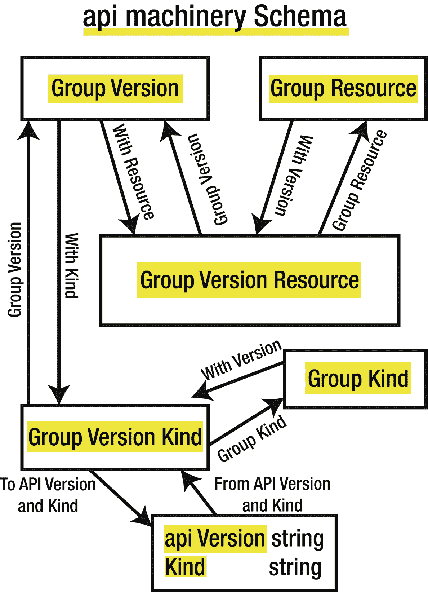

# 5. API Machinery

前面章节探讨了 Kubernetes API 在 HTTP 层面的工作原理。它们还探讨了 Kubernetes API 库，该库以 Go 语言定义了由 Kubernetes API 提供的资源。

本章探讨 Kubernetes API Machinery 库，该库提供了用于处理遵循 Kubernetes API 对象约定的 API 对象的实用工具。这些约定包括：

*   API 对象嵌入一个公共元数据结构 `TypeMeta`，包含两个字段：`APIVersion` 和 `Kind`。
*   API 对象在单独的包中提供。
*   API 对象是版本化的。
*   提供了用于在不同版本之间进行转换的转换函数。

API Machinery 将提供以下实用工具：

*   一个 `Scheme` 抽象，用于：
    *   将 API 对象注册为 GVK（Group-Version-Kinds）
    *   在不同版本的 API 对象之间进行转换
    *   序列化/反序列化 API 对象
*   一个 `RESTMapper`，用于映射 API 对象（基于嵌入的 `APIVersion` 和 `Kind`）和资源名称（按 REST 含义）。

本章详细介绍了 API Machinery 提供的函数。

## Schema 包

`API Machinery` 库的 `schema` 包定义了用于处理组（Group）、版本（Version）、种类（Kind）和资源（Resource）的有用结构和函数。

```go
import (
"k8s.io/apimachinery/pkg/runtime/schema"
)
```

定义了 `GroupVersionResource`、`GroupVersionKind`、`GroupVersion`、`GroupResource` 和 `GroupKind` 等结构，并提供了在它们之间转换的方法。

此外，还提供了 `GroupVersionKind` 与 `(apiVersion, kind)` 之间的转换函数：`ToAPIVersionAndKind` 和 `FromAPIVersionAndKind`。



一个模型图描述了 API Machinery 的 schema。1. 组版本。2. 组资源。3. 组版本资源。4. 组版本种类。5. 组种类。6. API 版本种类。1 和 3 之间的箭头表示 with resource 和 group version。2 和 3 之间表示 with version 和 group resource。1 和 4 之间表示 with kind 和 group version。4 和 5 之间表示 with version 和 group kind。

图 5-1

GVK 和 GVR 相关结构与方法

## Scheme

`Scheme` 是一个抽象，用于将 API 对象注册为 `Group-Version-Kinds`，在不同版本的 API 对象之间进行转换，以及序列化/反序列化 API 对象。`Scheme` 是由 API Machinery 在 `runtime` 包中提供的一个结构。该结构的所有字段都是未导出的。


### 初始化

`Scheme`结构体可以通过`NewScheme`函数初始化：

```go
import (
"k8s.io/apimachinery/pkg/runtime"
)
Scheme := runtime.NewScheme()
```

结构体初始化后，可以通过`AddKnownTypes`方法注册新的 API 对象：

```go
func (s *Scheme) AddKnownTypes(gv schema.GroupVersion, types ...Object)
```

例如，要将`Pod`和`ConfigMap`对象注册到`core/v1`组，可以这样写：

```go
import (
corev1 "k8s.io/api/core/v1"
"k8s.io/apimachinery/pkg/runtime"
"k8s.io/apimachinery/pkg/runtime/schema"
)
Scheme := runtime.NewScheme()
func init() {
Scheme.AddKnownTypes(
schema.GroupVersion{
Group:   "",
Version: "v1",
},
&corev1.Pod{},
&corev1.ConfigMap{},
)
}
```

这样做之后，API Machinery 就能知道，执行与`pods`相关的请求时应使用`Group-Version-Kind`为`core-v1-Pod`的`corev1.Pod`结构体，执行与`configmaps`相关的请求时应使用`core-v1-ConfigMap`的`corev1.ConfigMap`结构体。

如所示，API 对象可以版本化。你可以为不同版本注册同一类对象。例如，使用以下代码为`Deployment`对象添加`v1`和`v1beta1`版本：

```go
import (
appsv1 "k8s.io/api/apps/v1"
appsv1beta1 "k8s.io/api/apps/v1beta1"
"k8s.io/apimachinery/pkg/runtime"
"k8s.io/apimachinery/pkg/runtime/schema"
)
Scheme := runtime.NewScheme()
func init() {
Scheme.AddKnownTypes(
schema.GroupVersion{
Group:   "apps",
Version: "v1",
},
&appsv1.Deployment{},
)
Scheme.AddKnownTypes(
schema.GroupVersion{
Group:   "apps",
Version: "v1beta1",
},
&appsv1beta1.Deployment{},
)
}
```

建议在程序执行的最开始就初始化`Scheme`结构体并添加已知类型——例如，使用`init`函数。

### 映射

初始化之后，你可以使用结构体上的各种方法来映射`Group-Version-Kind`和 Go 类型：

- `KnownTypes(gv schema.GroupVersion) map[string]reflect.Type` —— 获取为特定`Group-Version`注册的所有 Go 类型。例如，对于`apps/v1`：

- `VersionsForGroupKind(gk schema.GroupKind) []schema.GroupVersion` —— 获取为特定`Kind`注册的所有`Group-Version`。例如，对于`Deployment`：

```go
types := Scheme.KnownTypes(schema.GroupVersion{
Group:   "apps",
Version: "v1",
})
// -> ["Deployment": appsv1.Deployment]
```

- `ObjectKinds(obj Object) ([]schema.GroupVersionKind, bool, error)` —— 获取给定对象的所有可能的`Group-Version-Kind`。例如，对于一个`appsv1.Deployment`：

```go
groupVersions := Scheme.VersionsForGroupKind(
schema.GroupKind{
Group: "apps",
Kind:  "Deployment",
})
// -> ["apps/v1" "apps/v1beta1"]
```

- `New(kind schema.GroupVersionKind) (Object, error)` —— 根据给定的`Group-Version-Kind`构建一个对象：

```go
gvks, notVersioned, err := Scheme.ObjectKinds(&appsv1.Deployment{})
// -> ["apps/v1 Deployment"]
```

- 该方法返回一个`runtime.Object`类型的值，该类型是所有 API 对象实现的接口。值的具体类型将是映射该`Group-Version-Kind`的对象——此处为`appsv1.Deployment`。

```go
obj, err := Scheme.New(schema.GroupVersionKind{
Group:   "apps",
Version: "v1",
Kind:    "Deployment",
})
```

### 转换

`Scheme`结构体按`Group-Version`注册`Kind`。通过向`Scheme`提供同一 Group 下不同 Version 的`Kind`之间的转换函数，就可以在同一个 Group 的任何`Kind`之间进行转换。

可以定义两种层次的转换函数：*转换函数*和*生成的转换函数*。转换函数是手动编写的函数，而生成的转换函数是使用`conversion-gen`工具生成的。

在两版本之间进行转换时，如果存在手动编写的转换函数，它将优先于生成的转换函数。

#### 添加转换函数

以下两个方法用于添加`a`和`b`之间的转换函数，`a`和`b`是属于同一 Group 的两个对象类型。

```go
AddConversionFunc(
a, b interface{},
fn conversion.ConversionFunc,
) error
AddGeneratedConversionFunc(
a, b interface{},
fn conversion.ConversionFunc,
) error
```

`a`和`b`的值必须是指向结构体的指针，可以是空指针。转换函数的签名定义如下：

```go
type ConversionFunc func(
a, b interface{},
scope Scope,
) error
```

以下是一个示例，演示如何在`apps/v1`和`apps/v1beta1`的`Deployment`之间添加转换函数：

```go
Scheme.AddConversionFunc(
(*appsv1.Deployment)(nil),
(*appsv1beta1.Deployment)(nil),
func(a, b interface{}, scope conversion.Scope) error{
v1deploy := a.(*appsv1.Deployment)
v1beta1deploy := b.(*appsv1beta1.Deployment)
// 在此处进行转换
return nil
})
```

关于向 Scheme 注册已知类型，建议也是在程序执行的最开始注册转换函数——例如，使用`init`函数。

#### 执行转换

一旦注册了转换函数，就可以使用`Convert`函数在同一`Kind`的两个版本之间进行转换。

```go
Convert(in, out interface{}, context interface{}) error
```

以下示例定义了一个`v1.Deployment`，然后将其转换为`v1beta1`版本：

```go
v1deployment := appsv1.Deployment{
[...]
}
v1deployment.SetName("myname")
var v1beta1Deployment appsv1beta1.Deployment
scheme.Convert(&v1deployment, &v1beta1Deployment, nil)
```

### 序列化

API Machinery 库的包提供了多种格式的序列化器：JSON、YAML 和 Protobuf。这些序列化器实现了`Serializer`接口，该接口嵌入了`Encoder`和`Decoder`接口。首先，你将看到如何实例化不同格式的序列化器，然后是如何使用它们来编码和解码 API 对象。

#### JSON 和 YAML 序列化器

`json`包提供了用于 JSON 和 YAML 格式的序列化器。

```go
import (
"k8s.io/apimachinery/pkg/runtime/serializer/json"
)
```

`NewSerializerWithOptions`函数用于创建一个新的序列化器。

```go
NewSerializerWithOptions(
meta      MetaFactory,
creater   runtime.ObjectCreater,
typer     runtime.ObjectTyper,
options   SerializerOptions,
) *Serializer
```

通过`options`，可以选择使用 JSON 还是 YAML 序列化器（`Yaml`字段）、选择 JSON 输出的可读格式（`Pretty`字段）以及检查 JSON 和 YAML 中的重复字段（`Strict`字段）。

```go
type SerializerOptions struct {
Yaml     bool
Pretty   bool
Strict   bool
}
```

`Scheme`可以用作`creator`和`typer`，因为它实现了这两个接口。`SimpleMetaFactory`结构体可以用作`meta`。

```go
serializer := jsonserializer.NewSerializerWithOptions(
jsonserializer.SimpleMetaFactory{},
Scheme,
Scheme,
jsonserializer.SerializerOptions{
Yaml: false, // 或 true 表示 YAML 序列化器
Pretty: true, // 或 false 表示单行 JSON
Strict: false, // 或 true 检查重复字段
},
)
```

#### Protobuf 序列化器

`protobuf`包提供了用于 Protobuf 格式的序列化器。

```go
import (
"k8s.io/apimachinery/pkg/runtime/serializer/protobuf"
)
```

`NewSerializer`函数用于创建一个新的序列化器。

```go
NewSerializer(
creater     runtime.ObjectCreater,
typer     runtime.ObjectTyper,
) *Serializer
```

`Scheme`可以用作`creator`和`typer`，因为它实现了这两个接口。

```go
serializer := protobuf.NewSerializer(Scheme, Scheme)
```


### 编码与解码

各种序列化器实现了`Serializer`接口，该接口嵌入了`Decoder`和`Encoder`接口，并定义了`Encode`和`Decode`方法。

- `Encode(obj Object, w io.Writer) error` – `Encode`函数接收一个 API 对象作为参数，对该对象进行编码，并使用写入器输出结果。
- `Decode(data []byte, defaults *schema.GroupVersionKind, into Object) (Object, *schema.GroupVersionKind, error)` – 此函数接收一个字节数组作为参数，并尝试解码其内容。如需解码的内容未指定`apiVersion`和`Kind`，则将使用默认的`GroupVersionKind` (GVK)。
- 如果`into`对象不为空，且其具体类型与内容 GVK（无论是初始的，还是`defaults`中的）匹配，则结果将被放入该`into`对象。无论如何，结果都将作为`Object`返回，应用于它的 GVK 将作为`GroupVersionKind`结构返回。

```go
func Decode(
    data []byte,
    defaults *schema.GroupVersionKind,
    into Object,
) (
    Object,
    *schema.GroupVersionKind,
    error,
)
```

## RESTMapper

API Machinery 提供了`RESTMapper`的概念，用于映射 REST 资源和`Kind`之间的关系。

```go
import (
    "k8s.io/apimachinery/pkg/api/meta"
)
```

`RESTMapping`类型提供了使用`RESTMapper`进行映射的结果：

```go
type RESTMapping struct {
    Resource            schema.GroupVersionResource
    GroupVersionKind    schema.GroupVersionKind
    Scope               RESTScope
}
```

如第 1 章所述，GVR（Group-Version-Resource，或简称为`Resource`）用于构建发送请求的路径。例如，要获取所有命名空间中的部署列表，你将使用路径`/apis/apps/v1/deployments`，其中`apps`是 Group，`v1`是 Version，`deployments`是（复数形式的）`Resource`名称。因此，由 API 管理的资源可以通过其 GVR 唯一标识。

在向此路径发起请求时，通常需要交换数据，无论是创建或更新资源的请求，还是获取或列出资源的响应。这种交换数据的格式称为与该资源关联的`Kind`（或`GroupVersionKind`）。

`RESTMapping`结构将`Resource`及其关联的`GroupVersionKind`联系起来。API Machinery 提供了`RESTMapper`接口，以及一个默认实现`DefaultRESTMapper`。

```go
type RESTMapper interface {
    RESTMapping(gk schema.GroupKind, versions ...string) (*RESTMapping, error)
    RESTMappings(gk schema.GroupKind, versions ...string) ([]*RESTMapping, error)
    KindFor(resource schema.GroupVersionResource) (schema.GroupVersionKind, error)
    KindsFor(resource schema.GroupVersionResource) ([]schema.GroupVersionKind, error)
    ResourceFor(input schema.GroupVersionResource) (schema.GroupVersionResource, error)
    ResourcesFor(input schema.GroupVersionResource) ([]schema.GroupVersionResource, error)
    ResourceSingularizer(resource string) (singular string, err error)
}
```

### Kind 到 Resource 的映射

`RESTMapping`和`RESTMappings`方法根据给定的`Group`和`Kind`，返回一个`RESTMapping`结构元素或数组。一个可选的版本列表用于指示首选版本。

`RESTMappings`方法返回所有匹配项，`RESTMapping`方法返回单个匹配项，如有多个匹配项则返回错误。返回的`RESTMapping`元素将包含完整的`Kind`（包括版本）和完整的`Resource`。

总而言之，这些方法用于将`Kind`映射到`Resource`。

### Resource 到 Kind 的映射

`KindFor`和`KindsFor`方法根据一个*部分*的 Group-Version-Resource，返回一个`GroupVersionKind`元素或数组。部分意味着你可以省略 group、version，或两者都省略。资源名称可以是资源的单数或复数形式。

`KindsFor`方法返回所有匹配项，`KindFor`方法返回单个匹配项，如有多个匹配项则返回错误。

总而言之，这些方法用于将`Resource`映射到`Kind`。

### 查找资源

`ResourceFor`和`ResourcesFor`方法根据一个*部分*的 Group-Version-Resource，返回一个`GroupVersionResource`元素或数组。部分意味着你可以省略 group、version，或两者都省略。资源名称可以是资源的单数或复数形式。

`ResourcesFor`方法返回所有匹配项，`ResourceFor`方法返回单个匹配项，如有多个匹配项则返回错误。

总而言之，这些方法用于根据单数或复数资源名称查找完整的资源。

### DefaultRESTMapper 实现

API Machinery 提供了一个`RESTMapper`的默认实现。

- `NewDefaultRESTMapper(defaultGroupVersions []schema.GroupVersion) *DefaultRESTMapper` – 此工厂方法用于构建一个新的`DefaultRESTMapper`，它接受一个默认 Group-Version 列表，当提供的 GVR 不完整时，将使用该列表查找 Resource 或 Kind。
- `Add(kind schema.GroupVersionKind, scope RESTScope)` – 此方法用于添加`Kind`和`Resource`之间的映射。资源名称将根据 Kind 通过获取小写单词并使其复数化来推断（对于以“s”结尾的单词添加“es”，对于以“y”结尾的单词将末尾“y”替换为“ies”，对于其他单词添加“s”）。
- `AddSpecific(kind schema.GroupVersionKind, plural, singular schema.GroupVersionResource, scope RESTScope)` – 此方法用于通过显式指定单数和复数名称来添加`Kind`和`Resource`之间的映射。

创建`DefaultRESTMapper`实例后，你可以通过调用同名接口中定义的方法，将其用作`RESTMapper`。

## 总结

本章探讨了 API Machinery，介绍了用于在 Go 语言和 JSON 或 YAML 之间序列化资源，以及在多个版本之间转换资源的`Scheme`抽象。本章还涵盖了`RESTMapper`接口，以帮助在资源和种类之间进行映射。

下一章将介绍 Client-go 库，这是一个高级库，开发者可以用它来调用 Kubernetes API，而无需处理 HTTP 调用。


