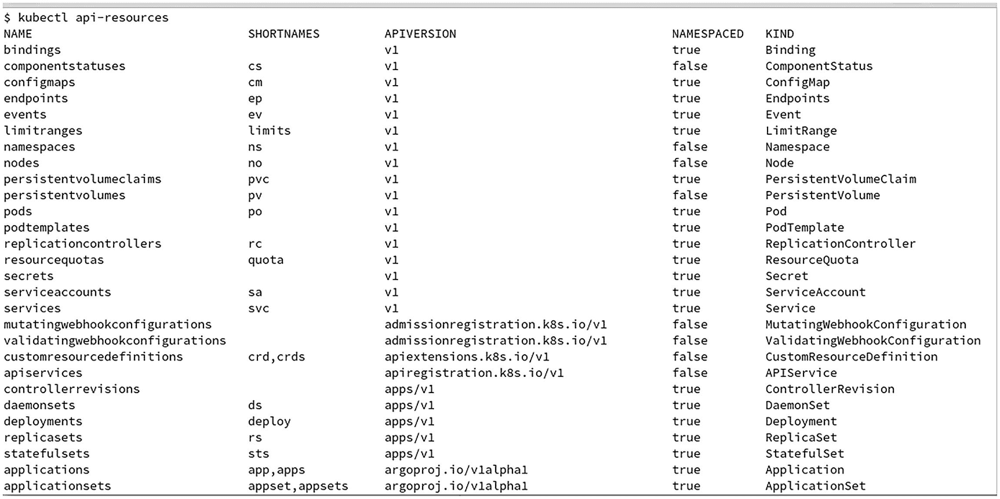

# 6. `Client-go` 库

前几章探讨了 *Kubernetes API 库*（一组用于操作 Kubernetes API 对象的 Go 结构体）和 *API Machinery 库*（提供了用于处理遵循 Kubernetes API 对象约定的 API 对象的工具）。具体来说，你已经看到 API Machinery 提供了 `Scheme` 和 `RESTMapper` 抽象。

本章将探讨 `Client-go` 库，它是一个高级库，开发人员可以使用它通过 Go 语言与 Kubernetes API 进行交互。`Client-go` 库汇集了 Kubernetes API 和 API Machinery 库，提供了一个预配置了 Kubernetes API 对象的 `Scheme` 和一个用于 Kubernetes API 的 `RESTMapper` 实现。它还提供了一组客户端，用于以简单的方式对 Kubernetes API 的资源执行操作。

要使用此库，你需要从其中导入以 `k8s.io/client-go` 为前缀的包。例如，要使用 `kubernetes` 包，请使用以下代码：

```go
import (
"k8s.io/client-go/kubernetes"
)
```

你还需要下载一个版本的 `Client-go` 库。为此，你可以使用 `go get` 命令来获取你想要使用的版本：

```bash
$ go get k8s.io/client-go@v0.24.4
```

`Client-go` 库的版本与 Kubernetes 的版本保持一致——版本 0.24.4 对应于服务器的版本 1.24.4。

Kubernetes 是向后兼容的，因此你可以将旧版本的 `Client-go` 与新版本的集群一起使用，但你很可能希望获取一个新版本，以便能够使用当前的功能，因为只有错误修复会被移植到以前的 client-go 版本中，新功能则不会。

## 连接到集群

在连接到 Kubernetes API 服务器之前，第一步是要拥有连接所需的配置——即服务器的地址、其凭据、连接参数等。

`rest` 包提供了一个 `rest.Config` 结构体，其中包含了应用程序连接到 *REST* API 服务器所需的所有配置信息。

### 集群内配置

默认情况下，运行在 Kubernetes Pod 上的容器包含了连接到 API 服务器所需的所有信息：

-   Pod 使用的 `ServiceAccount` 提供的*令牌*和*根证书*位于此目录中：`/var/run/secrets/kubernetes.io/serviceaccount/`。
-   注意，可以通过在 Pod 使用的 `ServiceAccount` 中设置 `automountServiceAccountToken: false`，或直接在 Pod 的规格说明中设置，来禁用此行为。
-   `kubelet` 在容器环境中定义的环境变量 `KUBERNETES_SERVICE_HOST` 和 `KUBERNETES_SERVICE_PORT`，指定了联系 API 服务器的主机和端口。

当应用程序专门设计为在 Pod 的容器内运行时，你可以利用上述信息，使用以下函数来创建一个合适的 `rest.Config` 结构体：

```go
import "k8s.io/client-go/rest"
func InClusterConfig() (*Config, error)
```

### 集群外配置

Kubernetes 工具通常依赖于 `kubeconfig` 文件——即包含一个或多个 Kubernetes 集群的连接配置的文件。

你可以通过使用 `clientcmd` 包中的以下函数之一，基于此 `kubeconfig` 文件的内容来构建一个 `rest.Config` 结构体。

#### 从内存中的 Kubeconfig 文件构建

`RESTConfigFromKubeConfig` 函数可用于从 `kubeconfig` 文件的内容（作为字节数组）构建一个 `rest.Config` 结构体。

```go
func RESTConfigFromKubeConfig(
configBytes []byte,
) (*rest.Config, error)
```

如果 `kubeconfig` 文件包含多个*上下文*，则会使用当前上下文，而忽略其他上下文。例如，你可以先读取 `kubeconfig` 文件的内容，然后使用以下函数：

```go
import "k8s.io/client-go/tools/clientcmd"
configBytes, err := os.ReadFile(
"/home/user/.kube/config",
)
if err != nil {
return err
}
config, err := clientcmd.RESTConfigFromKubeConfig(
configBytes,
)
if err != nil {
return err
}
```

#### 从磁盘上的 Kubeconfig 文件构建

`BuildConfigFromFlags` 函数可用于从 API 服务器的 URL、基于 `kubeconfig` 文件的路径（两者皆可）来构建一个 `rest.Config` 结构体。

```go
func BuildConfigFromFlags(
masterUrl,
kubeconfigPath string,
) (*rest.Config, error)
```

以下代码允许你获取一个 `rest.Config` 结构体：

```go
import "k8s.io/client-go/tools/clientcmd"
config, err := clientcmd.BuildConfigFromFlags(
"",
"/home/user/.kube/config",
)
```

以下代码从 `kubeconfig` 获取配置，并覆盖 API 服务器的 URL：

```go
config, err := clientcmd.BuildConfigFromFlags(
"https://192.168.1.10:6443",
"/home/user/.kube/config",
)
```

#### 从个性化的 Kubeconfig 文件构建

前面的函数在内部使用了一个 `api.Config` 结构体，该结构体表示 `kubeconfig` 文件中的数据（不要与包含 *REST* HTTP 连接参数的 `rest.Config` 结构体混淆）。

如果你需要操作这个中间数据，可以使用 `BuildConfigFromKubeconfigGetter` 函数，它接受一个 `kubeconfigGetter` 函数作为参数，该函数本身会返回一个 `api.Config` 结构体。

```go
BuildConfigFromKubeconfigGetter(
masterUrl string,
kubeconfigGetter KubeconfigGetter,
) (*rest.Config, error)
type KubeconfigGetter
func() (*api.Config, error)
```

例如，以下代码将从 `kubeconfigGetter` 函数中使用 `clientcmd.Load` 或 `clientcmd.LoadFromFile` 函数来加载 `kubeconfig` 文件：

```go
import (
"k8s.io/client-go/tools/clientcmd"
"k8s.io/client-go/tools/clientcmd/api"
)
config, err :=
clientcmd.BuildConfigFromKubeconfigGetter(
"",
func() (*api.Config, error) {
apiConfig, err := clientcmd.LoadFromFile(
"/home/user/.kube/config",
)
if err != nil {
return nil, nil
}
// TODO: 操作 apiConfig
return apiConfig, nil
},
)
```

#### 从多个 Kubeconfig 文件构建

`kubectl` 工具默认使用 `$HOME/.kube/config kubeconfig` 文件，并且你可以使用 `KUBECONFIG` 环境变量指定另一个 `kubeconfig` 文件的路径。

不仅如此，你可以在此环境变量中指定一个 `kubeconfig` 文件路径列表，这些 `kubeconfig` 文件将在使用前被*合并*为一个。你可以通过以下函数获得相同的行为：`NewNonInteractiveDeferredLoadingClientConfig`。

```go
func NewNonInteractiveDeferredLoadingClientConfig(
loader ClientConfigLoader,
overrides *ConfigOverrides,
) ClientConfig
```

`clientcmd.ClientConfigLoadingRules` 类型实现了 `ClientConfigLoader` 接口，你可以使用以下函数获取此类型的值：

```go
func NewDefaultClientConfigLoadingRules()
*ClientConfigLoadingRules
```

如果存在 `KUBECONFIG` 环境变量，此函数将获取其值以获取要合并的 `kubeconfig` 文件列表，否则将回退使用位于 `$HOME/.kube/config` 的默认 `kubeconfig` 文件。

使用以下代码创建 `rest.Config` 结构体，你的程序将具有与之前描述的 `kubectl` 相同的行为：

```go
import (
"k8s.io/client-go/tools/clientcmd"
)
config, err :=
clientcmd.NewNonInteractiveDeferredLoadingClientConfig(
clientcmd.NewDefaultClientConfigLoadingRules(),
nil,
).ClientConfig()
```


#### 使用 CLI 标志覆盖 kubeconfig

如前所述，此函数的第二个参数 `NewNonInteractiveDeferredLoadingClientConfig` 是一个 `ConfigOverrides` 结构体。该结构体包含一些值，用于覆盖合并 `kubeconfig` 文件后结果中的某些字段。

你可以自行设置此结构体中的特定值，或者，如果你正在使用 `spf13/pflag` 库（即 [github.com/spf13/pflag](http://github.com/spf13/pflag)）创建一个 CLI，则可以使用以下代码自动为你的 CLI 声明默认标志，并将它们绑定到 `ConfigOverrides` 结构体：

```go
import (
"github.com/spf13/pflag"
"k8s.io/client-go/tools/clientcmd"
)
var (
flags pflag.FlagSet
overrides clientcmd.ConfigOverrides
of = clientcmd.RecommendedConfigOverrideFlags("")
)
clientcmd.BindOverrideFlags(&overrides, &flags, of)
flags.Parse(os.Args[1:])
config, err :=
clientcmd.NewNonInteractiveDeferredLoadingClientConfig(
clientcmd.NewDefaultClientConfigLoadingRules(),
&overrides,
).ClientConfig()
```

请注意，在调用 `RecommendedConfigOverrideFlags` 函数时，你可以为添加的标志声明一个前缀。

## 获取 Clientset

Kubernetes 包提供了创建 `kubernetes.Clientset` 类型 clientset 的函数。

-   `func NewForConfig(c *rest.Config) (*Clientset, error)` – `NewForConfig` 函数使用由前面章节所述方法之一构建的 `rest.Config`，返回一个 `Clientset`。

-   `func NewForConfigOrDie(c *rest.Config) *Clientset` – 此函数与上一个类似，但在出错时会触发 panic，而不是返回错误。此函数可用于硬编码配置，对于这些配置，你希望断言其有效性。

-   `NewForConfigAndClient` 函数使用提供的 `rest.Config` 和提供的 `http.Client` 返回一个 `Clientset`。

-   之前的函数 `NewForConfig` 使用通过 `rest.HTTPClientFor` 函数构建的默认 HTTP 客户端。如果你想在构建 `Clientset` 之前个性化 HTTP 客户端，可以使用此函数。

```go
NewForConfigAndClient(
c *rest.Config,
httpClient *http.Client,
) (*Clientset, error)
```

## 使用 Clientset

`kubernetes.Clientset` 类型实现了 `kubernetes.Interface` 接口，定义如下：

```go
type Interface interface {
Discovery() discovery.DiscoveryInterface
[...]
AppsV1()          appsv1.AppsV1Interface
AppsV1beta1()     appsv1beta1.AppsV1beta1Interface
AppsV1beta2()     appsv1beta2.AppsV1beta2Interface
[...]
CoreV1()           corev1.CoreV1Interface
[...]
}
```

第一个方法 `Discovery()` 提供了一个接口，该接口提供了一些方法，用于发现集群中可用的组、版本和资源，以及资源的首选版本。此接口还提供对服务器版本以及 OpenAPI v2 和 v3 定义的访问。这在 Discovery 客户端部分有详细说明。

除了 `Discovery()` 方法之外，`kubernetes.Interface` 由一系列方法组成，每个方法对应 Kubernetes API 定义的一个组/版本。当你看到此接口的定义时，可以理解 `Clientset` 是一组客户端，每个客户端专用于其自身的组/版本。

每个方法返回一个值，该值实现特定于该组/版本的接口。例如，`kubernetes.Interface` 的 `CoreV1()` 方法返回一个值，该值实现了 `corev1.CoreV1Interface` 接口，定义如下：

```go
type CoreV1Interface interface {
RESTClient() rest.Interface
ComponentStatusesGetter
ConfigMapsGetter
EndpointsGetter
[...]
}
```

此 `CoreV1Interface` 接口中的第一个方法是 `RESTClient() rest.Interface`，用于获取特定组/版本的 `REST` 客户端。此底层客户端将由组/版本客户端内部使用，你可以使用此 `REST` 客户端来构建此接口的其它方法 `CoreV1Interface` 未原生提供的请求。

由 `REST` 客户端实现的 `rest.Interface` 接口定义如下：

```go
type Interface interface {
GetRateLimiter()            flowcontrol.RateLimiter
Verb(verb string)           *Request
Post()                      *Request
Put()                       *Request
Patch(pt types.PatchType)   *Request
Get()                       *Request
Delete()                    *Request
APIVersion()                schema.GroupVersion
}
```

如你所见，此接口提供了一系列方法——`Verb`、`Post`、`Put`、`Patch`、`Get` 和 `Delete`——它们返回一个带有特定 HTTP 动词的 `Request` 对象。这在“如何使用这些 `Request` 对象完成操作”部分有进一步说明。

`CoreV1Interface` 中的其他方法用于获取组/版本中每个资源的特定方法。例如，嵌入的 `ConfigMapsGetter` 接口定义如下：

```go
type ConfigMapsGetter interface {
ConfigMaps(namespace string) ConfigMapInterface
}
```

然后，`ConfigMapInterface` 接口由 `ConfigMaps` 方法返回，定义如下：

```go
type ConfigMapInterface interface {
Create(
ctx context.Context,
configMap *v1.ConfigMap,
opts metav1.CreateOptions,
) (*v1.ConfigMap, error)
Update(
ctx context.Context,
configMap *v1.ConfigMap,
opts metav1.UpdateOptions,
) (*v1.ConfigMap, error)
Delete(
ctx context.Context,
name string,
opts metav1.DeleteOptions,
) error
[...]
}
```

你可以看到，此接口提供了一系列方法，每个方法对应一个 *Kubernetes API 动词*。

每个与操作相关的方法都将一个 Option 结构体作为参数，该结构体以操作名称命名：`CreateOptions`、`UpdateOptions`、`DeleteOptions` 等。这些结构体及相关常量定义在包 `k8s.io/apimachinery/pkg/apis/meta/v1` 中。

最后，要对组-版本的资源执行操作，你可以按照以下模式进行链式调用（适用于命名空间资源），其中 `namespace` 可以是空字符串以表示集群范围的操作：

```go
clientset.
GroupVersion().
NamespacedResource(namespace).
Operation(ctx, options)
```

而对于非命名空间资源，模式如下：

```go
clientset.
GroupVersion().
NonNamespacedResource().
Operation(ctx, options)
```

例如，使用以下代码*列出*命名空间 `project1` 中 *core/v1* 组/版本的 *Pods*：

```go
podList, err := clientset.
CoreV1().
Pods("project1").
List(ctx, metav1.ListOptions{})
```

要获取*所有*命名空间中的 *pods* *列表*，你需要指定一个空的命名空间名称：

```go
podList, err := clientset.
CoreV1().
Pods("").
List(ctx, metav1.ListOptions{})
```

要获取节点列表（节点是非命名空间资源），请使用以下代码：

```go
nodesList, err := clientset.
CoreV1().
Nodes().
List(ctx, metav1.ListOptions{})
```

以下部分将使用 *Pod* 资源详细描述各种操作。在处理非命名空间资源时，你可以应用相同的示例，只需移除命名空间参数即可。

## 检查请求

如果你想知道调用 client-go 方法时执行了哪些 HTTP 请求，可以为你的程序启用日志记录。Client-go 库使用 `klog` 库（[`github.com/kubernetes/klog`](https://github.com/kubernetes/klog)），你可以使用以下代码为你的命令启用日志标志：

```go
import (
"flag"
"k8s.io/klog/v2"
)
func main() {
klog.InitFlags(nil)
flag.Parse()
[...]
}
```

现在，你可以使用 `-v <level>` 标志运行你的程序——例如，`-v 6` 获取每个请求所调用的 URL。关于定义的日志级别的更多细节，请参见表 2-1。


## 创建资源

要在集群中创建一个新资源，首先需要使用专用的 `Kind` 结构在内存中声明该资源，然后使用对应资源的 `Create` 方法。例如，使用以下代码在 `project1` 命名空间中创建一个名为 `nginx-pod` 的 `Pod`：

```
wantedPod := corev1.Pod{
Spec: corev1.PodSpec{
Containers: []corev1.Container{
{
Name:  "nginx",
Image: "nginx",
},
},
},
}
wantedPod.SetName("nginx-pod")
createdPod, err := clientset.
CoreV1().
Pods("project1").
Create(ctx, &wantedPod, v1.CreateOptions{})
```

声明 `CreateOptions` 结构时，用于创建资源的各种选项如下：

*   `DryRun` – 指示应在 API 服务器端执行哪些操作。唯一可用的值是 `metav1.DryRunAll`，表示执行除将资源持久化到存储之外的所有操作。
*   使用此选项，你可以通过命令获取本应在集群中创建的确切对象（而无需真正创建它），并检查在此创建过程中是否会发生错误。
*   `FieldManager` – 指示此操作字段管理器的名称。此信息将用于后续的服务器端 Apply 操作。
*   `FieldValidation` – 指示当结构中存在重复或未知字段时，服务器应如何响应。以下是可能的值：
    *   `metav1.FieldValidationIgnore` 忽略所有重复或未知字段
    *   `metav1.FieldValidationWarn` 当存在重复或未知字段时发出警告
    *   `metav1.FieldValidationStrict` 当存在重复或未知字段时操作失败
*   请注意，使用此方法将无法定义重复或未知字段，因为你正在使用结构来定义对象。

如果发生错误，你可以使用 `k8s.io/apimachinery/pkg/api/errors` 包中定义的函数来测试其类型。所有可能的错误在“错误与状态”部分有定义，以下是 `Create` 操作特有的可能错误：

*   `IsAlreadyExists` – 此函数指示请求是否因为集群中已存在同名资源而失败
*   `IsNotFound` – 此函数指示你请求中指定的命名空间是否不存在
*   `IsInvalid` – 此函数指示传入结构的数据是否无效

```
if errors.IsAlreadyExists(err) {
// ...
}
```

### 获取资源信息

要获取集群中特定资源的信息，可以使用要获取信息资源的 `Get` 方法。例如，要获取 `project1` 命名空间中名为 `nginx-pod` 的 `pod` 的信息：

```
pod, err := clientset.
CoreV1().
Pods("project1").
Get(ctx, "nginx-pod", metav1.GetOptions{})
```

在获取资源信息时，用于声明 `GetOptions` 结构的各种选项如下：

*   `ResourceVersion` – 请求一个不早于指定版本的资源版本。
*   如果 `ResourceVersion` 为 “0”，表示返回资源的任何版本。通常你会收到资源的最新版本，但这并不保证；由于分区或缓存过期，在*高可用*集群上可能会收到较旧的版本。
*   如果未设置该选项，则保证你会收到资源的最新版本。

`Get` 操作特有的可能错误是：

*   `IsNotFound` – 此函数指示你请求中指定的命名空间不存在，或者具有指定名称的资源不存在。

## 获取资源列表

要获取集群中的资源列表，可以使用要列出资源的 `List` 方法。例如，使用以下代码列出 `project1` 命名空间中的 Pod：

```
podList, err := clientset.
CoreV1().
Pods("project1").
List(ctx, metav1.ListOptions{})
```

或者，要获取所有命名空间中的 Pod 列表，使用：

```
podList, err := clientset.
CoreV1().
Pods("").
List(ctx, metav1.ListOptions{})
```

在列出资源时，用于声明 `ListOptions` 结构的各种选项如下：

*   `LabelSelector, FieldSelector` – 用于按标签或字段过滤列表。这些选项在“过滤列表结果”部分有详细说明。
*   `Watch, AllowWatchBookmarks` – 用于运行 Watch 操作。这些选项在“监视资源”部分有详细说明。
*   `ResourceVersion, ResourceVersionMatch` – 指示你想要获取的资源列表的版本。
*   请注意，当收到 `List` 操作的响应时，列表元素本身会指示一个 `ResourceVersion` 值，列表中的每个元素也都有各自的 `ResourceVersion` 值。在选项中指定的 `ResourceVersion` 指的是列表的 `ResourceVersion`。
*   对于不带分页的 `List` 操作（有关其他情况下这些选项的行为，请参考“分页结果”和“监视资源”部分）：
    *   当未设置 `ResourceVersionMatch` 时，行为与 `Get` 操作相同：
        *   `ResourceVersion` 表示应返回一个不早于指定版本的列表。
        *   如果 `ResourceVersion` 为 “0”，则表示需要返回列表的任何版本。通常你会收到列表的最新版本，但这并不保证；由于分区或缓存过期，在*高可用*集群上可能会收到较旧的版本。
        *   如果未设置该选项，则保证你会收到列表的最新版本。
    *   当 `ResourceVersionMatch` 设置为 `metav1.ResourceVersionMatchExact` 时，`ResourceVersion` 值指示你想要获取的列表的确切版本。
        *   将 `ResourceVersion` 设置为 “0” 或未定义它是无效的。
    *   当 `ResourceVersionMatch` 设置为 `metav1.ResourceVersionMatchNotOlderThan` 时，`ResourceVersion` 指示你将获得一个不早于指定版本的列表。
        *   如果 `ResourceVersion` 为 “0”，则表示返回列表的任何版本。通常你会收到列表的最新版本，但这并不保证；由于分区或缓存过期，在*高可用*集群上可能会收到较旧的版本。
        *   未定义 `ResourceVersion` 是无效的。
*   `TimeoutSeconds` – 将请求的持续时间限制为指定的秒数。
*   `Limit, Continue` – 用于对列表结果进行分页。这些选项在第 2 章的“分页结果”部分有详细说明。

以下是 `List` 操作特有的可能错误：

*   `IsResourceExpired` – 此函数指示指定的 `ResourceVersion` 和设置为 `metav1.ResourceVersionMatchExact` 的 `ResourceVersionMatch` 已过期。

请注意，如果你为 `List` 操作指定了一个不存在的命名空间，你将不会收到 `NotFound` 错误。

## 过滤列表结果

如第 2 章的“过滤列表结果”部分所述，可以使用标签选择器和字段选择器来过滤 `List` 操作的结果。本节展示如何使用 API Machinery 库中的 `fields` 和 `labels` 包来创建一个适用于 `LabelSelector` 和 `FieldSelector` 选项的字符串。


### 使用 Labels 包设置 LabelSelector

以下是使用 API Machinery 库中 `labels` 包所需的导入信息。

```go
import (
"k8s.io/apimachinery/pkg/labels"
)
```

该包提供了多种构建和验证 `LabelsSelector` 字符串的方法：使用 Requirements（需求条件）、解析 `labelSelector` 字符串，或使用一组键值对。

#### 使用 Requirements

首先，你需要使用以下代码创建一个 `labels.Selector` 对象：

```go
labelsSelector := labels.NewSelector()
```

然后，你可以使用 `labels.NewRequirement` 函数创建 `Requirement` 对象：

```go
func NewRequirement(
key string,
op selection.Operator,
vals []string,
opts ...field.PathOption,
) (*Requirement, error)
```

`op` 可能取值的常量定义在 `selection` 包中（即 `k8s.io/apimachinery/pkg/selection`）。`vals` 字符串数组中的值数量取决于操作类型：

*   `selection.In` / `selection.NotIn` – 与 `key` 关联的值必须等于 (`In`) / 必须不等于 (`NotIn`) `vals` 中定义的某个值。
*   `vals` 必须非空。

*   `selection.Equals` / `selection.DoubleEquals` / `selection.NotEquals` – 与 `key` 关联的值必须等于 (`Equals`, `DoubleEquals`) 或必须不等于 (`NotEquals`) `vals` 中定义的值。
*   `vals` 必须包含一个单一值。

*   `selection.Exists` / `selection.DoesNotExist` – `key` 必须已定义 (`Exists`) 或必须未定义 (`DoesNotExist`)。
*   `vals` 必须为空。

*   `selection.Gt` / `selection.Lt` – 与 `key` 关联的值必须大于 (`Gt`) 或小于 (`Lt`) `vals` 中定义的值。
*   `vals` 必须包含一个代表整数的单一值。

例如，要要求键 `mykey` 的值等于 `value1`，你可以用以下方式声明一个 `Requirement`：

```go
req1, err := labels.NewRequirement(
"mykey",
selection.Equals,
[]string{"value1"},
)
```

定义好 `Requirement` 之后，你可以使用选择器上的 `Add` 方法将需求条件添加到选择器中：

```go
labelsSelector = labelsSelector.Add(*req1, *req2)
```

最后，你可以通过以下方式获取要传递给 `LabelSelector` 选项的 `String`：

```go
s := labelsSelector.String()
```

#### 解析 LabelSelector 字符串

如果你已经有了一个描述标签选择器的字符串，你可以使用 `Parse` 函数检查其有效性。`Parse` 函数会验证该字符串并返回一个 `LabelSelector` 对象。你可以使用此 `LabelSelector` 对象的 `String` 方法来获取经 `Parse` 函数验证过的字符串。

例如，以下代码将解析、验证并返回标签选择器 `"mykey = value1, count < 5"` 的规范形式：

```go
selector, err := labels.Parse(
"mykey = value1, count < 5",
)
if err != nil {
return err
}
s := selector.String()
// s = "mykey=value1,count<5"
```

#### 使用一组键值对

当你只想对一个或多个需求条件使用 `Equal` 操作时，可以使用 `ValidatedSelectorFromSet` 函数：

```go
func ValidatedSelectorFromSet(
ls Set
) (Selector, error)
```

在这种情况下，`Set` 将定义你想要检查相等性的键值对集合。

例如，以下代码将声明一个标签选择器，要求键 `key1` 等于 `value1`，键 `key2` 等于 `value2`：

```go
set := labels.Set{
"key1": "value1",
"key2": "value2",
}
selector, err = labels.ValidatedSelectorFromSet(set)
s = selector.String()
// s = "key1=value1,key2=value2"
```

### 使用 Fields 包设置 FieldSelector

以下是使用 API Machinery 库中 `fields` 包所需的代码。

```go
import (
"k8s.io/apimachinery/pkg/fields"
)
```

该包提供了多种构建和验证 `FieldSelector` 字符串的方法：组合单项选择器、解析 `fieldSelector` 字符串，或使用一组键值对。

#### 组合单项选择器

你可以使用 `OneTermEqualSelector` 和 `OneTermNotEqualSelector` 函数创建单项选择器，然后使用 `AndSelectors` 函数组合这些选择器以构建一个完整的字段选择器。

```go
func OneTermEqualSelector(
k, v string,
) Selector
func OneTermNotEqualSelector(
k, v string,
) Selector
func AndSelectors(
selectors ...Selector,
) Selector
```

例如，以下代码构建了一个字段选择器，其中包含对字段 `status.Phase` 的 `Equal` 条件和对字段 `spec.restartPolicy` 的 `NotEqual` 条件：

```go
fselector = fields.AndSelectors(
fields.OneTermEqualSelector(
"status.Phase",
"Running",
),
fields.OneTermNotEqualSelector(
"spec.restartPolicy",
"Always",
),
)
fs = fselector.String()
```

#### 解析 FieldSelector 字符串

如果你已经有了一个描述字段选择器的字符串，你可以使用 `ParseSelector` 或 `ParseSelectorOrDie` 函数检查其有效性。`ParseSelector` 函数会验证该字符串并返回一个 `fields.Selector` 对象。你可以使用此 `fields.Selector` 对象的 `String` 方法来获取经 `ParseSelector` 函数验证过的字符串。

例如，以下代码将解析、验证并返回字段选择器 `"status.Phase = Running, spec.restartPolicy != Always"` 的规范形式：

```go
selector, err := fields.ParseSelector(
"status.Phase=Running, spec.restartPolicy!=Always",
)
if err != nil {
return err
}
s := selector.String()
// s = "spec.restartPolicy!=Always,status.Phase=Running"
```

#### 使用一组键值对

当你只想对一个或多个单项选择器使用 `Equal` 操作时，可以使用 `SelectorFromSet` 函数。

```go
func SelectorFromSet(ls Set) Selector
```

在这种情况下，`Set` 将定义你想要检查相等性的键值对集合。

例如，以下代码将声明一个字段选择器，要求键 `key1` 等于 `value1`，键 `key2` 等于 `value2`：

```go
set := fields.Set{
"field1": "value1",
"field2": "value2",
}
selector = fields.SelectorFromSet(set)
s = selector.String()
// s = "key1=value1,key2=value2"
```


## 删除资源

要从集群中删除资源，可以对要删除的资源使用 `Delete` 方法。例如，要从 `project1` 命名空间中删除名为 `nginx-pod` 的 `Pod`，请使用：

```
err = clientset.
CoreV1().
Pods("project1").
Delete(ctx, "nginx-pod", metav1.DeleteOptions{})
```

请注意，操作终止时并不能保证资源已被删除。`Delete` 操作不会立即删除资源，而是将资源标记为待删除（通过设置 `.metadata.deletionTimestamp` 字段），删除操作将异步进行。

删除资源时，可在 `DeleteOptions` 结构中声明的不同选项如下：

- `OrphanDependents` – 此字段已弃用，建议使用 `PropagationPolicy`。`PropagationPolicy` – 指示是否以及如何进行垃圾回收。另请参阅第 3 章的 "OwnerReferences" 部分。可接受的值为：
  - `metav1.DeletePropagationOrphan` – 向 Kubernetes API 指示孤立正在删除的资源所拥有的资源，这样它们不会被垃圾回收器删除。
- `metav1.DeletePropagationBackground` – 向 Kubernetes API 指示在所有者资源被标记为删除后立即从 `Delete` 操作返回，无需等待拥有的资源被垃圾回收器删除。
- `metav1.DeletePropagationForeground` – 向 Kubernetes API 指示在所有者资源以及设置了 `BlockOwnerDeletion` 为 `true` 的拥有资源被删除后才从 `Delete` 操作返回。Kubernetes API 不会等待其他拥有资源被删除。
- `DryRun` – 指示应在 API 服务器端执行哪些操作。唯一可用的值是 `metav1.DryRunAll`，表示执行所有操作，但不包括将资源持久化到存储的操作。使用此选项，您可以获取命令结果，而无需真正删除资源，并检查在此删除过程中是否会发生错误。
- `GracePeriodSeconds` – 此值仅在删除 Pod 时有用。指示在 Pod 被删除前的持续秒数。
  - 该值必须是一个指向非负整数的指针。值为零表示立即删除。如果此值为 nil，将使用 Pod 的默认宽限期，如 Pod 规范中的 `TerminationGracePeriodSeconds` 字段所示。
  - 您可以使用 `metav1.NewDeleteOptions` 函数创建一个包含已定义 `GracePeriodSeconds` 的 `DeleteOptions` 结构：

```
err = clientset.
CoreV1().
Pods("project1").
Delete(ctx,
"nginx-pod",
*metav1.NewDeleteOptions(5),
)
```

- `Preconditions` – 删除对象时，您可能希望确保删除的是预期对象。`Preconditions` 字段允许您指明期望删除的资源，可以通过以下方式：
  - 指定 UID，这样如果预期资源被删除并且另一个同名资源被创建，删除操作将失败，产生 `Conflict` 错误。您可以使用 `metav1.NewPreconditionDeleteOptions` 函数创建一个包含设置了 UID 的 `Preconditions` 的 `DeleteOptions` 结构：

```
uid := createdPod.GetUID()
err = clientset.
CoreV1().
Pods("project1").
Delete(ctx,
"nginx-pod",
*metav1.NewPreconditionDeleteOptions(
string(uid),
),
)
if errors.IsConflict(err) {
[...]
}
```

- 指定 `ResourceVersion`，这样如果资源在此期间被更新，删除操作将失败，并产生 Conflict 错误。您可以使用 `metav1.NewRVDeletionPrecondition` 函数创建一个包含设置了 `ResourceVersion` 的 `Preconditions` 的 `DeleteOptions` 结构：

```
rv := createdPod.GetResourceVersion()
err = clientset.
CoreV1().
Pods("project1").
Delete(ctx,
"nginx-pod",
*metav1.NewRVDeletionPrecondition(
rv,
),
)
if errors.IsConflict(err) {
[...]
}
```

以下是 `Delete` 操作特有的可能错误：

- `IsNotFound` – 此函数表示您在请求中指定的资源或命名空间不存在。
- `IsConflict` – 此函数表示请求失败，因为未满足前提条件（UID 或 `ResourceVersion`）。

## 删除资源集合

要从集群中删除资源集合，可以对要删除的资源使用 `DeleteCollection` 方法。例如，从 `project1` 命名空间中删除 Pod 集合：

```
err = clientset.
CoreV1().
Pods("project1").
DeleteCollection(
ctx,
metav1.DeleteOptions{},
metav1.ListOptions{},
)
```

必须向该函数提供两组选项：

- `DeleteOptions`，指示对每个对象执行 `Delete` 操作的选项，如 "删除资源" 部分所述。
- `ListOptions`，细化要删除的资源集合，如 "获取资源列表" 部分所述。

## 更新资源

要更新集群中的资源，可以对要更新的资源使用 `Update` 方法。例如，使用以下代码更新 `project1` 命名空间中的 `Deployment`：

```
updatedDep, err := clientset.
AppsV1().
Deployments("project1").
Update(
ctx,
myDep,
metav1.UpdateOptions{},
)
```

更新资源时，可在 `UpdateOptions` 结构中声明的各种选项与 "创建资源" 部分中 `CreateOptions` 的选项相同。

`Update` 操作特有的可能错误是：

- `IsInvalid` – 此函数表示传递给结构的数据无效。
- `IsConflict` – 此函数表示结构中包含的 `ResourceVersion`（此处为 `myDep`）比集群中的版本更旧。更多信息请参阅第 2 章的 "更新资源以管理冲突" 部分。


### 使用战略性合并补丁更新资源

你在第 2 章的“使用战略性合并补丁更新资源”部分已经了解了如何使用战略性合并补丁来修补资源。总而言之，你需要：

- 使用 `Patch` 操作
- 为 `content-type` 请求头指定一个特定值
- 在请求体中仅传入你想要修改的字段

使用 Client-go 库，你可以对你想要修补的资源调用 `Patch` 方法。

```go
Patch(
ctx context.Context,
name string,
pt types.PatchType,
data []byte,
opts metav1.PatchOptions,
subresources ...string,
) (result *v1.Deployment, err error)
```

`patch` 类型指示你是想使用 `StrategicMerge` 补丁（`types.StrategicMergePatchType`）还是合并补丁（`types.MergePatchType`）。这些常量定义在 `k8s.io/apimachinery/pkg/types` 包中。

`data` 字段包含你想要应用到资源上的补丁数据。你可以像第 2 章那样直接编写这些补丁数据，或者使用 `controller-runtime library` 中的以下函数来帮助你构建此补丁。该库将在第 10 章进行更深入的探讨。

```go
import "sigs.k8s.io/controller-runtime/pkg/client"
func StrategicMergeFrom(
obj Object,
opts ...MergeFromOption,
) Patch
```

`StrategicMergeFrom` 函数接受一个类型为 `Object` 的第一个参数，该参数代表任意 Kubernetes 对象。你需要通过此参数传入你想要修补的对象，*在*任何更改之前。

该函数随后接受一系列选项。目前唯一可接受的选项是 `client.MergeFromWithOptimisticLock{}` 值。该值要求库将 `ResourceVersion` 添加到补丁数据中，这样服务器就能检查你想要更新的资源版本是否是最新的。

使用 `StrategicMergeFrom` 函数创建 `Patch` 对象后，你可以创建要修补对象的深拷贝，然后对其进行修改。当完成对象更新后，你可以使用 `Patch` 对象专用的 `Data` 方法来构建补丁数据。

例如，要为包含乐观锁 `ResourceVersion` 的 `Deployment` 构建补丁数据，你可以使用以下代码（`createdDep` 是一个反映已创建 `Deployment` 的 `Deployment` 结构体）：

```go
patch := client.StrategicMergeFrom(
createdDep,
pkgclient.MergeFromWithOptimisticLock{},
)
updatedDep := createdDep.DeepCopy()
updatedDep.Spec.Replicas = pointer.Int32(2)
patchData, err := patch.Data(updatedDep)
// patchData = []byte(`{
//   "metadata":{"resourceVersion":"4807923"},
//   "spec":{"replicas":2}
// }`)
patchedDep, err := clientset.
AppsV1().Deployments("project1").Patch(
ctx,
"dep1",
patch.Type(),
patchData,
metav1.PatchOptions{},
)
```

请注意，如果你更倾向于执行*合并补丁*，也可以使用 `MergeFrom` 和 `MergeFromWithOptions` 函数。

`Patch` 对象的 `Type` 方法可用于获取补丁类型，而不必使用 `type` 包中的常量。你可以在调用修补操作时传递 `PatchOptions`。可能的选项包括：

- `DryRun` – 指示应在 API 服务器端执行哪些操作。唯一可用的值是 `metav1.DryRunAll`，表示执行所有操作，但不会将资源持久化到存储中。
- `Force` – 此选项仅可用于 *Apply* 补丁请求，并且在处理 `StrategicMergePatch` 或 `MergePatch` 请求时必须取消设置。
- `FieldManager` – 指示此操作的字段管理器名称。此信息将用于将来的服务器端 *Apply* 操作。对于 `StrategicMergePatch` 或 `MergePatch` 请求，此选项是可选的。
- `FieldValidation` – 指示当结构体中出现重复或未知字段时服务器应如何反应。以下是可能的值：
  - `metav1.FieldValidationIgnore` – 忽略所有重复或未知字段
  - `metav1.FieldValidationWarn` – 出现重复或未知字段时发出警告
  - `metav1.FieldValidationStrict` – 出现重复或未知字段时操作失败

请注意，`Patch` 操作接受一个 `subresources` 参数。此参数可用于修补 `Patch` 方法所作用资源的子资源。例如，要修补 Deployment 的状态，你可以使用值 `"status"` 作为 subresources 参数。

特定于 `MergePatch` 操作的可能错误包括：

- `IsInvalid` – 此函数指示作为补丁传入的数据是否无效。
- `IsConflict` – 此函数指示合并到补丁中的 `ResourceVersion`（如果在构建补丁数据时使用了乐观锁）是否是比集群中更旧的版本。更多信息请参见第 2 章的“更新资源并管理冲突”部分。


## 使用 Patch 进行服务端应用

第 2 章的“服务端应用资源”部分描述了服务端应用 Patch 的工作原理。概括来说，我们需要：

-   使用 `Patch` 操作
-   为 `content-type` 头部指定一个特定值
-   在请求体中仅传入你想要修改的字段
-   提供一个 `fieldManager` 名称

使用客户端库，你可以对要补丁的资源使用 `Patch` 方法。请注意，你也可以使用 `Apply` 方法；请参考下一节“使用 Apply 进行服务端应用”。

```
Patch(
ctx context.Context,
name string,
pt types.PatchType,
data []byte,
opts metav1.PatchOptions,
subresources ...string,
) (result *v1.Deployment, err error)
```

`Patch` 类型指示了补丁的类型，在这种情况下是 `types.ApplyPatchType`，定义在 `k8s.io/apimachinery/pkg/types` 包中。

`data` 字段包含你要应用于资源的补丁。你可以使用 `client.Apply` 值来构建此数据。该值实现了 `client.Patch` 接口，提供了 `Type` 和 `Data` 方法。

请注意，你需要在你想要补丁的资源结构中设置 `APIVersion` 和 `Kind` 字段。同时请注意，此 `Apply` 操作也可用于创建资源。

`Patch` 操作接受一个 `subresources` 参数。此参数可用于补丁应用了 `Patch` 方法的资源的子资源。例如，要补丁一个 `Deployment` 的 `Status`，你可以对子资源参数使用值 `"status"`。

```
import "sigs.k8s.io/controller-runtime/pkg/client"
wantedDep := appsv1.Deployment{
Spec: appsv1.DeploymentSpec{
Replicas: pointer.Int32(1),
[...]
}
wantedDep.SetName("dep1")
wantedDep.APIVersion, wantedDep.Kind =
appsv1.SchemeGroupVersion.
WithKind("Deployment").
ToAPIVersionAndKind()
patch := client.Apply
patchData, err := patch.Data(&wantedDep)
patchedDep, err := clientset.
AppsV1().Deployments("project1").Patch(
ctx,
"dep1",
patch.Type(),
patchData,
metav1.PatchOptions{
FieldManager: "my-program",
},
)
```

你可以在调用 `Patch` 操作时传入 `PatchOptions`。以下为可能的选项：

-   `DryRun` – 指示应在 API 服务端执行哪些操作。唯一可用的值是 `metav1.DryRunAll`，表示执行除将资源持久化到存储之外的所有操作。
-   `Force` – 此选项指示*强制应用*请求。这意味着此请求的字段管理器将获取由其他字段管理器拥有的冲突字段。
-   `FieldManager` – 指示此操作的字段管理器的名称。此选项对于*应用 Patch* 请求是强制性的。
-   `FieldValidation` – 指示当结构中存在重复或未知字段时，服务器应如何响应。可能的值有：
    -   `metav1.FieldValidationIgnore` – 忽略所有重复或未知字段
    -   `metav1.FieldValidationWarn` – 当存在重复或未知字段时发出警告
    -   `metav1.FieldValidationStrict` – 当存在重复或未知字段时操作失败

以下是特定于 `ApplyPatch` 操作的可能错误：

-   `IsInvalid` – 此函数指示作为补丁传入的数据是否无效。
-   `IsConflict` – 此函数指示补丁修改的某些字段是否因为被另一个字段管理器拥有而发生冲突。要解决此冲突，你可以使用 `Force` 选项，以便这些字段将由本次操作的字段管理器获取。

### 使用应用配置进行服务端应用

上一节展示了如何通过使用 `Patch` 方法来执行服务端*应用*操作。其缺点在于数据必须以 JSON 格式传递，这容易出错。

从 1.21 版本开始，客户端库 `Clientset` 提供了一种 `Apply` 方法，可以使用类型化的结构来执行服务端*应用*操作。以下是 `Apply` 方法的签名：

```
Apply(
ctx context.Context,
deployment *acappsv1.DeploymentApplyConfiguration,
opts metav1.ApplyOptions,
) (result *v1.Deployment, err error)
```

`ApplyOptions` 结构定义了以下选项：

-   `DryRun` – 指示应在 API 服务端执行哪些操作。唯一可用的值是 `metav1.DryRunAll`，表示执行除将资源持久化到存储之外的所有操作。
-   `Force` – 此调用方将重新获取由其他管理器拥有的冲突字段。
-   `FieldManager` – 这是执行 `Apply` 操作的*管理器*的名称。此值是必需的。

`Apply` 的这个签名与 `Create` 或 `Update` 操作的签名类似，不同之处在于它期望一个 `DeploymentApplyConfiguration` 对象，而不是 `Deployment` 对象。

如第 2 章的“服务端应用资源”部分所述，`Apply` 操作允许多个*管理器*在同一个资源上工作，每个管理器拥有资源规范中的一组值。

因此，为此操作传入的数据不会定义所有字段，而只定义该*管理器*所*负责*的字段。有些字段在资源定义的结构中是必需的；无法将这些结构用于 `Apply` 操作。

客户端库在 `applyconfigurations` 目录中引入了名为*应用配置*的新结构，所有字段都是可选的，使用指针。此目录包含 Kubernetes API 所有原生资源的生成源代码，其结构与 API 相同。例如，要访问定义用于应用 `apps/v1` 组的 `Deployment` 的数据所需的结构，你需要导入以下包：

```
import (
acappsv1 "k8s.io/client-go/applyconfigurations/apps/v1"
)
```

请注意，出于与你想为从 Kubernetes API 库导入的包定义别名相同的原因（因为大多数包都命名为 `v1`），在导入这些包时，你也将希望使用别名。本书使用与 API 库相同的系统，在别名前加上前缀 `ac` 以指示其来自 `applyconfigurations` 目录。

客户端库提供了两种构建 `ApplyConfiguration` 的方式：从零开始，或从现有资源构建。


#### 从头构建 ApplyConfiguration

构建 `ApplyConfiguration` 的第一种方法是从头开始构建。你首先需要使用必填字段初始化该结构：`kind`、`apiVersion`、`name` 以及 `namespace`（如果资源是命名空间级别的）；这可以通过相关包提供的辅助函数来完成。例如，对于一个 `Deployment` 资源：

```
deploy1Config := acappsv1.Deployment(
"deploy1",
"default",
)
```

此函数的实现使用了以下代码：

```
func Deployment(
name string,
namespace string,
) *DeploymentApplyConfiguration {
b := &DeploymentApplyConfiguration{}
b.WithName(name)
b.WithNamespace(namespace)
b.WithKind("Deployment")
b.WithAPIVersion("apps/v1")
return b
}
```

然后，你可以指定你想要管理的字段。提供了 `With*Field*()` 形式的辅助函数来设置特定字段。例如，如果你的程序只负责设置 deployment 的副本数量，代码将如下所示：

```
deploy1Config.WithSpec(acappsv1.DeploymentSpec())
deploy1Config.Spec.WithReplicas(2)
```

最后，你可以调用 `Apply` 方法。完整代码如下：

```
import (
acappsv1 "k8s.io/client-go/applyconfigurations/apps/v1"
)
deploy1Config := acappsv1.Deployment(
"deploy1",
"default",
)
deploy1Config.WithSpec(acappsv1.DeploymentSpec())
deploy1Config.Spec.WithReplicas(2)
result, err := clientset.AppsV1().
Deployments("default").Apply(
ctx,
deploy1Config,
metav1.ApplyOptions{
FieldManager: "my-manager",
Force:        true,
},
)
```

#### 从现有资源构建 ApplyConfiguration

构建 `ApplyConfiguration` 的第二种方法是从集群中的现有资源开始。有时程序无法在一个地方构建完整的 `ApplyConfiguration`。例如，设想你的程序在一个地方负责为一个 `Deployment` 定义一个具有特定镜像的容器，而在另一个地方负责设置副本数量。

如果程序首先定义了容器及其镜像，它将被标记为容器及其镜像的所有者。然后，如果程序构建一个 `ApplyConfiguration` 并仅设置副本数量，而不指定容器及其镜像，则服务器端的 `Apply` 操作将尝试删除该容器。这是因为程序指定了此容器的所有者，但它在 `ApplyConfiguration` 中不再指定该容器。

一种可能性是为程序的不同部分使用不同的管理器名称。但是，如果你想保持单一的管理器名称，`applyconfigurations` 目录中的包提供了一个 `Extract*Resource()` 辅助函数来帮助你解决这种情况。

这些函数将获取从集群中读取的资源（通过 `Get` 或 `List` 操作）作为参数，并构建一个仅包含由指定 `fieldManager` 所拥有字段的 `ApplyConfiguration`。例如，`ExtractDeployment` 辅助函数的签名是：

```
ExtractDeployment(
deployment *apiappsv1.Deployment,
fieldManager string,
) (*DeploymentApplyConfiguration, error)
```

首先是从集群中读取 deployment，然后从中提取 `ApplyConfiguration`。此时，它将包含程序管理的所有字段（容器及其镜像和副本）。然后，你可以指定唯一想要修改的字段——在此示例中为副本：

```
gotDeploy1, err := clientset.AppsV1().
Deployments("default").Get(
ctx,
"deploy1",
metav1.GetOptions{},
)
if err != nil {
return err
}
deploy1Config, err := acappsv1.ExtractDeployment(
gotDeploy1,
"my-manager",
)
if err != nil {
return err
}
if deploy1Config.Spec == nil {
deploy1Config.WithSpec(acappsv1.DeploymentSpec())
}
deploy1Config.Spec.WithReplicas(2)
result, err := clientset.AppsV1().
Deployments("default").Apply(
ctx,
deploy1Config,
metav1.ApplyOptions{
FieldManager: "my-manager",
Force:        true,
},
)
```

## 监控资源

第 2 章的“监控资源”部分描述了 Kubernetes API 如何*监控*资源。使用 Client-go 库，你可以为你想要监控的资源使用 `Watch` 方法。

```
Watch(
ctx context.Context,
opts metav1.ListOptions,
) (watch.Interface, error)
```

此 `Watch` 方法返回一个实现 `watch.Interface` 接口的对象，并提供以下方法：

```
import "k8s.io/apimachinery/pkg/watch"
type Interface interface {
ResultChan() <-chan Event
Stop()
}
```

`ResultChan` 方法返回一个 Go 通道（你只能读取），你将能够通过它接收所有事件。

`Stop` 方法将停止 `Watch` 操作并关闭通过 `ResultChan` 接收到的通道。

通过通道接收到的 `watch.Event` 对象定义如下：

```
type Event struct {
Type EventType
Object runtime.Object
}
```

`Type` 字段可以取第 2 章表 2-2 中描述的值，并且你可以在 `watch` 包中找到这些不同值的常量：`watch.Added`、`watch.Modified`、`watch.Deleted`、`watch.Bookmark` 和 `watch.Error`。

`Object` 字段实现了 `runtime.Object` 接口，其具体类型可以根据 `Type` 的值而有所不同。

对于除 `Error` 之外的 `Type`，`Object` 的具体类型将是你正在监控的资源类型（例如，如果你正在监控 *deployments*，则为 `Deployment` 类型）。

对于 `Error` 类型，具体类型通常是 `metav1.Status`，但根据你正在监控的资源，它可能是其他任何类型。以下是一个监控 Deployments 的代码示例：

```
import "k8s.io/apimachinery/pkg/watch"
watcher, err := clientset.AppsV1().
Deployments("project1").
Watch(
ctx,
metav1.ListOptions{},
)
if err != nil {
return err
}
for ev := range watcher.ResultChan() {
switch v := ev.Object.(type) {
case *appsv1.Deployment:
fmt.Printf("%s %s\n", ev.Type, v.GetName())
case *metav1.Status:
fmt.Printf("%s\n", v.Status)
watcher.Stop()
}
}
```

在监控资源时，需要在 `ListOptions` 结构中声明的各种选项如下：

- `LabelSelector`、`FieldSelector` —— 用于按标签或字段过滤被监控的元素。这些选项在“过滤列表结果”部分有详细说明。
- `Watch`、`AllowWatchBookmarks` —— `Watch` 选项表示正在运行一个 *Watch* 操作。在执行 `Watch` 方法时会自动设置此选项；你无需显式设置。
- `AllowWatchBookmarks` 选项要求服务器定期返回 *书签*。书签的使用在第 2 章的“允许书签以高效重启 *Watch* 请求”部分有描述。
- `ResourceVersion`、`ResourceVersionMatch` —— 这表示你想要从哪个版本的资源 `List` 开始 `Watch` 操作。
- 请注意，当收到 `List` 操作的响应时，列表元素本身会指示一个 `ResourceVersion` 值，列表中每个元素也会有自己的 *ResourceVersion* 值。在 Options 中指示的 `ResourceVersion` 指的是列表的 `ResourceVersion`。
- `ResourceVersionMatch` 选项不用于 `Watch` 操作。对于 `Watch` 操作，执行以下操作：
  - 当未设置 `ResourceVersion` 时，API 将从最新的资源列表开始 `Watch` 操作。通道首先接收 `ADDED` 事件以声明资源的初始状态，然后当集群中发生更改时，会接收其他事件。


*   当 `ResourceVersion` 设置为特定版本时，API 将从资源列表的指定版本开始 `Watch` 操作。通道**不会**接收 `ADDED` 事件来声明资源的初始状态，而只会在该版本之后集群发生更改时接收事件（这些事件可能发生在指定版本与您运行 `Watch` 操作的时间之间）。

*   一个用例是监视特定资源的删除。为此，您可以：
    1.  列出资源，包括您要删除的资源，并保存收到的 `List` 的 `ResourceVersion`。
    2.  对资源执行 `Delete` 操作（删除是异步的，因此操作终止时资源可能不会被删除）。
    3.  通过指定在步骤 1 中收到的 `ResourceVersion` 启动 `Watch` 操作。即使删除发生在步骤 2 和步骤 3 之间，您也保证会收到 `DELETED` 事件。

*   当 `ResourceVersion` 设置为 `“0”` 时，API 将从**任意**资源列表开始 `Watch` 操作。通道首先接收 `ADDED` 事件以声明资源的初始状态，随后在该初始状态之后集群发生更改时接收其他事件。

*   使用此语义时需特别小心，因为 `Watch` 操作通常将从最新版本开始；但也可以从较旧的版本开始。

*   `TimeoutSeconds` – 这会将请求的持续时间限制在指定的秒数内。

*   `Limit`、`Continue` – 这用于对 `List` 操作的结果进行分页。`Watch` 操作不支持这些选项。

请注意，如果您为 `Watch` 操作指定一个不存在的命名空间，您将不会收到 `NotFound` 错误。

还需注意，如果您指定了一个过期的 `ResourceVersion`，在调用 `Watch` 方法时不会收到错误，但会收到一个 `ERROR` 事件，其中包含一个 `metav1.Status` 对象，该对象指示值为 `metav1.StatusReasonExpired` 的 `Reason`。

`metav1.Status` 是用于构建通过使用 `Clientset` 的调用返回的错误的基础对象。您将在“错误和状态”部分中了解更多信息。

## 错误和状态

正如第 1 章所示，Kubernetes API 定义了用于与调用者交换数据的 `Kinds`。目前，您应认为 `Kinds` 与资源相关，要么是资源单数名称的 `Kind`（例如 `Pod`），要么是资源列表的 `Kind`（例如 `PodList`）。当 API 操作既不返回资源也不返回资源列表时，它会使用一个通用的 `Kind`（`metav1.Status`）来指示操作的状态。

### `metav1.Status` 结构的定义

`metav1.Status` 结构定义如下：

*   `Status` – 这指示操作的状态，可以是 `metav1.StatusSuccess` 或 `metav1.StatusFailure`。
*   `Message` – 这是对操作状态的人类可读的自由格式描述。
*   `Code` – 这指示操作为其返回的 HTTP 状态码。
*   `Reason` – 这指示操作处于 `Failure` 状态的原因。`Reason` 与给定的 HTTP 状态码相关。定义的 `Reasons` 有：
    *   `StatusReasonBadRequest` (400) – 此请求本身无效。这与 `StatusReasonInvalid` 不同，后者表示 API 调用可能成功，但数据无效。回复 `StatusReasonBadRequest` 的请求永远无法成功，无论数据如何。
    *   `StatusReasonUnauthorized` (401) – 授权凭据缺失、不完整或无效。
    *   `StatusReasonForbidden` (403) – 授权凭据有效，但对该资源的操作被这些凭据禁止。
    *   `StatusReasonNotFound` (404) – 找不到请求的资源。
    *   `StatusReasonMethodNotAllowed` (405) – 在资源上请求的操作不被允许，因为它未实现。回复 `StatusReasonMethodNotAllowed` 的请求永远无法成功，无论数据如何。
    *   `StatusReasonNotAcceptable` (406) – 客户端在 `Accept` 头中指示的任何 `Accept` 类型均不可用。回复 `StatusReasonNotAcceptable` 的请求永远无法成功，无论数据如何。
    *   `StatusReasonAlreadyExists` (409) – 正在创建的资源已存在。
    *   `StatusReasonConflict` (409) – 由于冲突（例如，操作尝试使用较旧的资源版本来更新资源，或 `Delete` 操作中的前提条件未得到满足），请求无法完成。
    *   `StatusReasonGone` (410) – 项目不再可用。
    *   `StatusReasonExpired` (410) – 内容已过期且不再可用——例如，使用过期的资源版本执行 `List` 或 `Watch` 操作时。
    *   `StatusReasonRequestEntityTooLarge` (413) – 请求实体太大。
    *   `StatusReasonUnsupportedMediaType` (415) – 不支持此资源在 `Content-Type` 头中指示的内容类型。回复 `StatusReasonUnsupportedMediaType` 的请求永远无法成功，无论数据如何。
    *   `StatusReasonInvalid` (422) – 为 `Create` 或 `Update` 操作发送的数据无效。`Causes` 字段列举了数据中的无效字段。
    *   `StatusReasonTooManyRequests` (429) – 客户端应至少等待 `Details` 字段中的 `RetryAfterSeconds` 字段指定的秒数，然后再执行操作。
    *   `StatusReasonUnknown` (500) – 服务器未指示任何失败原因。
    *   `StatusReasonServerTimeout` (500) – 服务器可达且能理解请求，但无法在合理时间内完成操作。客户端应在 `Details` 字段中的 `RetryAfterSeconds` 字段指定的秒数后重试请求。
    *   `StatusReasonInternalError` (500) – 发生内部错误；这是意料之外的，调用的结果未知。
    *   `StatusReasonServiceUnavailable` (503) – 请求有效，但所请求的服务当前不可用。一段时间后重试请求可能会成功。
    *   `StatusReasonTimeout` (504) – 无法在请求中指定的超时时间内完成操作。如果指定了 `Details` 字段中的 `RetryAfterSeconds` 字段，客户端应等待该秒数后再执行操作。
*   `Details` – 根据 `Reason` 字段，这可能包含有关原因的更多详细信息。
*   `Details` 字段的类型 `StatusDetails` 定义如下：

```go
type Status struct {
  Status      string
  Message     string
  Reason      StatusReason
  Details     *StatusDetails
  Code        int32
}
```

*   `Name`、`Group`、`Kind` 和 `UID` 字段指示（如果指定）哪个资源受到了失败的影响。
*   `RetryAfterSeconds` 字段（如果指定）指示客户端在再次执行操作之前应等待多少秒。
*   `Causes` 字段列举了失败的原因。当执行 `Create` 或 `Update` 操作导致失败且原因为 `StatusReasonInvalid` 时，`Causes` 字段会列举无效字段以及每个字段的错误类型。
*   `Causes` 字段的 `StatusCause` 类型定义如下：

```go
type StatusDetails struct {
  Name              string
  Group             string
  Kind              string
  UID               types.UID
  Causes            []StatusCause
  RetryAfterSeconds int32
}
```

```go
type StatusCause struct {
  Type       CauseType
  Message    string
  Field      string
}
```


### 客户端集操作返回的错误

本章前面介绍了`Clientset`提供的各种操作，这些操作通常返回一个`error`，并且你可以使用`errors`包中的函数来检测错误的原因——例如，使用`IsAlreadyExists`函数。

这些错误的具体类型是`errors.StatusError`，定义如下：

```
type StatusError struct {
ErrStatus metav1.Status
}
```

可以看出，该类型仅包含本章前面已探讨过的`metav1.Status`结构体。为此`StatusError`类型提供了函数，用于访问底层的`Status`。

*   `Is<ReasonValue>(err error) bool` – 针对本节前面枚举的每个`Reason`值都有一个对应函数，用于指示该错误是否属于特定状态。
*   `FromObject(obj runtime.Object) error` – 当你在执行`Watch`操作期间接收到`metav1.Status`时，可以使用此函数构建一个`StatusError`对象。
*   `(e *StatusError) Status() metav1.Status` – 返回底层的`Status`。
*   `ReasonForError(err error) metav1.StatusReason` – 返回底层`Status`的`Reason`。
*   `HasStatusCause(err error, name metav1.CauseType) bool` – 指示某个错误是否具有给定`CauseType`声明的特定原因。
*   `StatusCause(err error, name metav1.CauseType) (metav1.StatusCause, bool)` – 若存在，则返回给定`causeType`的原因，否则返回 false。
*   `SuggestsClientDelay(err error) (int, bool)` – 指示错误是否表明`Status`中的`RetryAfterSeconds`字段有值，并返回该值本身。

### RESTClient

前面在“使用客户端集”部分提到，你可以为 Kubernetes API 的每个组/版本获取一个`REST`客户端。例如，以下代码返回`Core/v1`组的 REST 客户端：

```
restClient := clientset.CoreV1().RESTClient()
```

`restClient`对象实现了`rest.Interface`接口，其定义如下：

```
type Interface interface {
GetRateLimiter()           flowcontrol.RateLimiter
Verb(verb string)          *Request
Post()                     *Request
Put()                      *Request
Patch(pt types.PatchType)  *Request
Get()                      *Request
Delete()                   *Request
APIVersion()                schema.GroupVersion
}
```

在此接口中，你可以看到通用方法`Verb`，以及辅助方法`Post`、`Put`、`Patch`、`Get`和`Delete`，它们返回一个`Request`对象。

### 构建请求

`Request`结构体仅包含私有字段，并提供了一些方法来个性化 Request。如第一章[#533908_1_En_1_Chapter.xhtml]所示，Kubernetes 资源或子资源的路径形式如下（某些段可能根据操作和资源而缺失）：

```
/apis/<group>/<version>/
namespaces/<namespace>/<resource>/
<name>/<subresource>
```

以下方法可用于构建此路径。请注意，`<group>`和`<version>`段是固定的，因为 REST 客户端是针对特定组和版本的。

*   `Namespace(namespace string) *Request; NamespaceIfScoped(namespace string, scoped bool) *Request` – 这些方法用于指示要查询的资源所属的命名空间。仅当请求标记为 scoped 时，`NamespaceIfScoped`才会添加命名空间部分。
*   `Resource(resource string) *Request` – 指示要查询的资源。
*   `Name(resourceName string) *Request` – 指示要查询的资源名称。
*   `SubResource(subresources ...string) *Request` – 指示要查询资源的子资源。
*   `Prefix(segments ...string) *Request; Suffix(segments ...string) *Request` – 在请求路径的开头或末尾添加路径段。前缀段将添加到“namespace”段之前。后缀段将添加到子资源段之后。重复调用这些方法会在现有前缀和后缀的基础上进行添加。
*   `AbsPath(segments ...string) *Request` – 使用提供的段重置前缀。

以下方法通过查询参数、请求体和标头完成请求的构建：

*   `Param(paramName, s string) *Request` – 使用提供的名称和值添加一个查询参数。
*   `VersionedParams(obj runtime.Object, codec runtime.ParameterCodec) *Request` – 添加从对象`obj`中提取的一系列参数。`obj`的具体类型通常是`ListOptions`、`GetOptions`、`DeleteOptions`、`CreateOptions`、`PatchOptions`、`ApplyOptions`、`UpdateOptions`或`TableOptions`之一。`codec`通常是 client-go 库中`scheme`包提供的参数编解码器：`scheme.ParameterCodec`。
*   `SpecificallyVersionedParams(obj runtime.Object, codec runtime.ParameterCodec, version schema.GroupVersion) *Request` – 与`VersionedParams`不同，该方法中对象将使用 REST 客户端的组和版本来编码。而使用`SpecificallyVersionedParams`，你可以指定特定的组和版本。
*   `SetHeader(key string, values ...string) *Request` – 为请求的指定标头设置值。如果该键对应的标头已定义，则会被覆盖。
*   `Body(obj interface{}) *Request` – 基于`obj`设置请求的请求体内容。`obj`可以是不同的类型：
    *   `string` – 将读取指定名称的文件，并将其内容用作请求体
    *   `[]byte` – 数据将直接用作请求体
    *   `io.Reader` – 从读取器中读取的数据将用作请求体
    *   `runtime.Object` – 对象将被序列化，结果用作请求体。`Content-Type`标头将被设置为指示对象序列化的类型（json，yaml 等）。

还有其他方法可用于配置请求的技术属性：

*   `BackOff(manager BackoffManager) *Request` – 为请求设置一个退避管理器。默认的退避管理器是`rest`包提供的`rest.NoBackoff`管理器，它在请求失败后不会等待，直接执行新请求。
*   `rest`包还提供了另一个退避管理器`rest.URLBackoff`，当服务器之前回复过 5xx 错误时，它在重试新请求之前会等待一段时间。
*   你可以使用以下代码构建并使用一个`rest.URLBackoff`对象：

```
    request.BackOff(&rest.URLBackoff{
    Backoff: flowcontrol.NewBackOffWithJitter(
    1*time.Second,
    30*time.Second,
    0.1,
    ),
    })
```


- 如果持续调用`Kubernetes API`时遇到连续`5xx`错误，`RESTClient`会在请求之间增加指数级延迟：初始`1 秒`，然后`2 秒`、`4 秒`，以此类推，延迟上限为`30 秒`，并额外增加最多`10%`的抖动（jitter），直到服务器返回非`5xx`状态码。
- 若不想添加抖动，可以使用以下代码：
```
    request.BackOff(&rest.URLBackoff{
    Backoff: flowcontrol.NewBackOff(
    1*time.Second,
    30*time.Second,
    ),
    })
```
- 注意，除了使用此代码为每次请求声明指数退避外，还可以通过设置环境变量`KUBE_CLIENT_BACKOFF_BASE=1`和`KUBE_CLIENT_BACKOFF_DURATION=30`，在使用`client-go`库运行程序时为所有请求实现类似行为（但不添加抖动）。
- `BackOff()`接收的参数为接口，你可以通过实现`rest.BackoffManager`接口来编写自定义的退避管理器：
```
    type BackoffManager interface {
    UpdateBackoff(
    actualUrl *url.URL,
    err error,
    responseCode int,
    )
    CalculateBackoff(
    actualUrl *url.URL,
    ) time.Duration
    Sleep(d time.Duration)
    }
```
- 例如，实现一个针对`5xx`错误的线性退避（适用于仅调用单个主机的情况）：
```
    type MyLinearBackOff struct {
    next time.Duration
    }
    func (o *MyLinearBackOff) UpdateBackoff(
    actualUrl *url.URL,
    err error,
    responseCode int,
    ) {
    if responseCode > 499 {
    o.next += 1 * time.Second
    return
    }
    o.next = 0
    }
    func (o *MyLinearBackOff) CalculateBackoff(
    actualUrl *url.URL,
    ) time.Duration {
    return o.next
    }
    func (o *MyLinearBackOff) Sleep(
    d time.Duration,
    ) {
    time.Sleep(d)
    }
```
- `Throttle(limiter flowcontrol.RateLimiter) *Request` — 限流功能会限制`RESTClient`每秒可执行的请求数。
- 默认情况下，使用**令牌桶速率限制器**（Token Bucket Rate Limiter），其`QPS`为`5`次/秒，突发流量（Burst）为`10`。
- 这意味着`RESTClient`每秒最多可发起`5`个请求，外加一个可随时使用的`10`个请求的额外配额（桶）。桶会以`QPS`的速率重新填充，本例中每秒填充`5`个令牌，桶的最大容量保持为`10`。
- 你可以通过以下代码构建并使用`flowcontrol.tokenBucketRateLimiter`对象：
```
    request.Throttle(
    flowcontrol.NewTokenBucketRateLimiter(5.0, 10),
    )
```
- 在此示例中，请求将使用速率为`5.0`次/秒（`QPS`）且突发流量为`10`的令牌桶速率限制器。
- 注意，你可以通过设置用于创建`RESTClient`的`Config`中的`QPS`和`Burst`，为所有请求获得相同的行为。
- 请求的默认速率限制器继承自用于创建`clientset`的`Config`。你可以通过在`Config`中设置速率限制器来更改所有请求的速率限制器。
- `MaxRetries(maxRetries int) *Request` — 指定当请求收到包含 `Retry-After` 头部和 `429` 状态码（*Too Many Requests*）的响应时，`RESTClient`将执行的重试次数。
- 默认值为`10`，表示在返回错误之前，请求最多会被执行`11`次。
- `Timeout(d time.Duration) *Request` — 指定`RESTClient`在返回错误之前等待请求响应的秒数。请求的默认超时时间继承自用于构建`clientset`的`HTTPClient`。
- `WarningHandler(handler WarningHandler) *Request` — `API`服务器可以使用特定头部（`Warning`头部）为请求返回警告。默认情况下，警告会被记录，并且`rest`包提供了几个内置的处理器实现：
    - `WarningLogger{}` — 记录警告（默认行为）。
    - `NoWarning{}` — 抑制警告。
    - `NewWarningWriter()` — 将警告写入指定的写入器。可指定选项：
        - `Deduplicate` — 设为`true`时，每条警告仅写入一次。
        - `Color` — 设为`true`时，以黄色显示警告。
- 你可以通过实现`WarningHandler`接口来编写自定义的警告处理器：
```
    type WarningHandler interface {
    HandleWarningHeader(
    code int,
    agent string,
    text string,
    )
    }
```
- 注意，你可以通过调用以下全局函数，为所有客户端的所有请求设置默认的`Warning Handler`：
```
rest.SetDefaultWarningHandler(l WarningHandler)
```

### 执行请求

构建好`Request`后，即可执行它。`Request`对象上的以下方法可供使用：

- `Do(ctx context.Context) Result` — 执行请求并返回`Result`对象。下一节将介绍如何利用此`Result`对象。
- `Watch(ctx context.Context) (watch.Interface, error)` — 对请求的地址执行**Watch**操作，并返回一个实现`watch.Interface`接口的对象，用于接收事件。可参阅本章“监控资源”部分了解如何使用返回的对象。
- `Stream(ctx context.Context) (io.ReadCloser, error)` — 执行请求并通过`ReadCloser`流式传输结果正文。
- `DoRaw(ctx context.Context) ([]byte, error)` — 执行请求并以字节数组形式返回结果。

### 利用 Result

在`Request`上执行`Do()`方法时，该方法会返回一个`Result`对象。

`Result`结构体没有公共字段。以下方法可用于获取结果信息：

- `Into(obj runtime.Object) error` — 如果可能，将结果正文内容解码并存储到对象中。传入参数的具体类型必须与正文中定义的类型匹配。同时返回执行请求的错误。
- `Error() error` — 返回执行请求的错误。此方法在请求不返回任何正文内容时非常有用。
- `Get() (runtime.Object, error)` — 解码并将结果正文内容作为对象返回。返回对象的具体类型将与正文中定义的类型匹配。同时返回执行请求的错误。
- `Raw() ([]byte, error)` — 以字节数组形式返回正文，以及执行请求的错误。
- `StatusCode(statusCode *int) Result` — 将状态码存储到传入参数中，并返回`Result`，以便方法可以链式调用。
- `WasCreated(wasCreated \*bool) Result` — 存储一个布尔值，指示请求创建的资源是否已成功创建，并返回`Result`，以便方法可以链式调用。
- `Warnings() []net.WarningHeader` — 返回`Result`中包含的警告列表。


### 以表格形式获取结果

你在第 2 章的“以表格形式获取结果”一节中已经看到，可以将`List`请求的结果以列和行的列表形式获取，从而以表格形式展示信息。为此，你需要执行一个`List`操作并指定一个特定的`Accept`头。

以下是使用`RESTClient`以表格形式列出`project1`命名空间下 Pod 的代码：

- ➊ 获取`core/v1`组的`RESTClient`
- ➋ 指定要列出资源的命名空间（此处为`project1`）
- ➌ 指定要列出的资源（此处为`pods`）
- ➍ 设置所需的头信息以获取表格形式的结果
- ➎ 准备一个`metav1.Table`类型的变量来存储请求结果
- ➏ 执行请求
- ➐ 将结果存入`metav1.Table`对象
- ➑ 遍历返回的列定义以显示表头
- ➒ 遍历返回的表格行以显示包含特定 Pod 信息的数据行
- ➓ 遍历行中的单元格以显示它们

```
import (
metav1 "k8s.io/apimachinery/pkg/apis/meta/v1"
)
restClient := clientset.CoreV1().RESTClient() ➊
req := restClient.Get().
Namespace("project1").          ➋
Resource("pods").               ➌
SetHeader(                    ➍
"Accept",
fmt.Sprintf(
"application/json;as=Table;v=%s;g=%s",
metav1.SchemeGroupVersion.Version,
metav1.GroupName
))
var result metav1.Table          ➎
err = req.Do(ctx).               ➏
Into(&result)               ➐
if err != nil {
return err
}
for _, colDef := range result.ColumnDefinitions {     ➑
// 显示表头
}
for _, row := range result.Rows {          ➒
for _, cell := range row.Cells {          ➓
// 显示单元格
}
}
```

## 发现客户端

Kubernetes API 提供了用于发现 API 所提供的资源的端点。`kubectl` 使用这些端点来显示 `kubectl api-resources` 命令的结果（图 6-1）。



一张屏幕截图展示了 kubectl API 资源列表。列标签分别为名称、短名称、API 版本、命名空间范围和种类。

**图 6-1** `kubectl api-resources`

该客户端可以通过调用 `Clientset` 上的 `Discovery()` 方法获取（有关如何获取 `Clientset` 的信息，请参见第 6 章的“获取 Clientset”小节），或使用 `discovery` 包提供的函数获取。

```
import "k8s.io/client-go/discovery"
```

所有这些函数都需要一个 `rest.Config` 作为参数。你可以在第 6 章的“连接到集群”小节中看到如何获取这样一个 `rest.Config` 对象。

- `NewDiscoveryClientForConfig(`  
  `c *rest.Config,`  
  `) (*DiscoveryClient, error)`  
  – 使用提供的 `rest.Config` 返回一个 `DiscoveryClient`
- `NewDiscoveryClientForConfigOrDie(`  
  `c *rest.Config,`  
  `) *DiscoveryClient`  
  – 与上一个类似，但在出错时会触发 panic，而不是返回错误。此函数可用于硬编码配置，我们希望断言其有效性。
- `NewDiscoveryClientForConfigAndClient(`  
  `c *rest.Config,`  
  `httpClient *http.Client,`  
  `) (*DiscoveryClient, error)`  
  – 使用提供的 `rest.Config` 和 `httpClient` 返回一个 `DiscoveryClient`。
- 上一个函数 `NewDiscoveryClientForConfig` 使用由 `rest.HTTPClientFor` 函数构建的默认 HTTP 客户端。如果你想在构建 `DiscoveryClient` 之前自定义 HTTP 客户端，可以使用此函数代替。

## RESTMapper

你在第 5 章的“RESTMapper”一节中已经看到，API Machinery 提供了 RESTMapper 的概念，用于在 REST 资源和 Kubernetes 种类之间进行映射。

API Machinery 还提供了 RESTMapper 的默认实现 `DefaultRESTMapper`，但需要手动添加组/版本/种类。

Client-go 库提供了 RESTMapper 的几种实现，利用发现客户端来提供组/版本/种类和资源的列表。

### PriorityRESTMapper

`PriorityRESTMapper` 借助发现客户端获取 Kubernetes API 提供的所有组，并处理可能属于特定组的多个版本以及每个组的首选版本，从而返回首选版本。

通过调用 `restmapper.NewDiscoveryRESTMapper` 函数可以获取 `restmapper.PriorityRESTMapper` 对象：

```
import "k8s.io/client-go/restmapper"
func NewDiscoveryRESTMapper(
groupResources []*APIGroupResources,
) meta.RESTMapper
```

`groupResources` 参数可以使用 `restmapper.GetAPIGroupResources` 函数构建：

```
func GetAPIGroupResources(
cl discovery.DiscoveryInterface,
) ([]*APIGroupResources, error)
```

以下是构建 `PriorityRESTMapper` 所需的代码：

```
import "k8s.io/client-go/restmapper"
discoveryClient := clientset.Discovery()
apiGroupResources, err :=
restmapper.GetAPIGroupResources(
discoveryClient,
)
if err != nil {
return err
}
restMapper := restmapper.NewDiscoveryRESTMapper(
apiGroupResources,
)
```

现在你可以使用第 5 章“RESTMapper”节中定义的 RESTMapper。

### DeferredDiscoveryRESTMapper

`DeferredDiscoveryRESTMapper` 在内部使用 `PriorityRESTMapper`，但会等到第一个请求时才初始化 RESTMapper。

```
func NewDeferredDiscoveryRESTMapper(
cl discovery.CachedDiscoveryInterface,
) *DeferredDiscoveryRESTMapper
```

函数 `NewDeferredDiscoveryRESTMapper` 用于构建此类 RESTMapper，它接收一个实现了 `discovery.CachedDiscoveryInterface` 接口的对象，以获取缓存发现客户端。

Client-go 库提供了该接口的一个实现，由 `memory.NewMemCacheClient` 函数返回。

```
func NewMemCacheClient(
delegate discovery.DiscoveryInterface,
) discovery.CachedDiscoveryInterface
```

以下是构建 `DeferredDiscoveryRESTMapper` 所需的代码：

```
import "k8s.io/client-go/restmapper"
discoveryClient := clientset.Discovery()
defRestMapper :=
restmapper.NewDeferredDiscoveryRESTMapper(
memory.NewMemCacheClient(discoveryClient),
)
```

现在你可以使用第 5 章“RESTMapper”节中定义的 RESTMapper。

## 总结

在本章中，你学习了如何连接到集群以及如何获取 `Clientset`。它是一个客户端集合，每个组-版本对应一个客户端，你可以使用它在资源上执行操作（获取、列出、创建等）。

你还学习了 REST 客户端（`Clientset` 内部使用），开发人员可以使用它来构建更具体的请求。最后，本章涵盖了发现客户端，用于以动态方式发现 Kubernetes API 提供的资源。

下一章将介绍如何使用 Client-go 库提供的客户端伪造实现来测试使用该库编写的应用程序。


