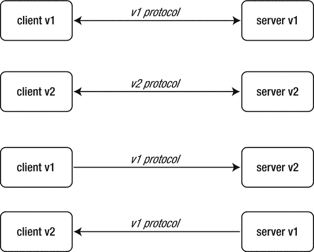
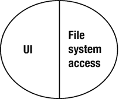
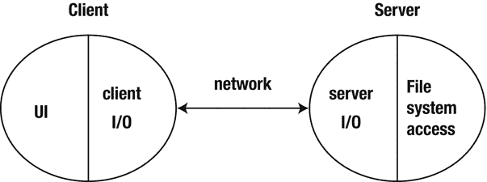
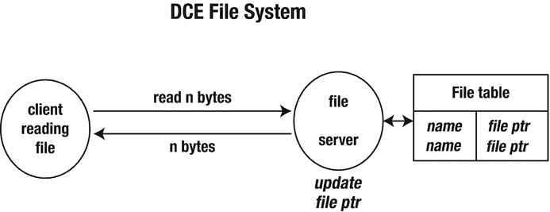
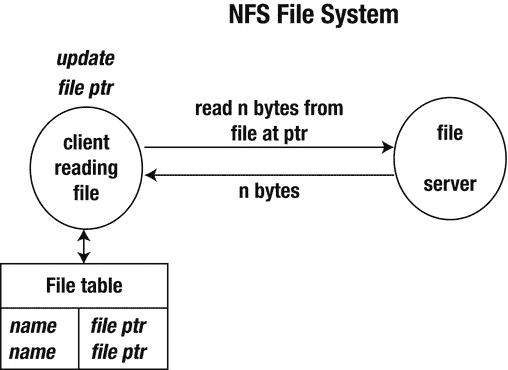
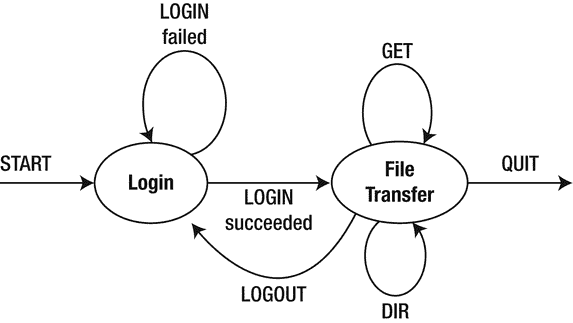

# 五、应用层协议

客户端和服务器需要通过消息交换信息。TCP 和 UDP 提供了实现这一点的传输机制。这两个过程还需要有一个合适的协议，这样消息交换才能有意义地进行。协议通过指定消息、数据类型、编码格式等，定义了分布式应用程序的两个组件之间可以进行何种类型的对话。本章着眼于这个过程中涉及的一些问题，并给出一个简单的客户机-服务器应用程序的完整例子。

## 协议设计

在设计协议时，有许多可能性和问题需要决定。一些问题包括:

*   是广播还是点对点？广播可以是 UDP、本地多播或更具实验性的 MBONE。点对点可以是 TCP 或 UDP。
*   是有状态还是无状态？一方维护另一方的状态合理吗？一方维护另一方的状态通常更简单，但是如果某个东西崩溃了会发生什么呢？
*   传输协议可靠还是不可靠？可靠的往往比较慢，但是这样你就不用那么担心丢失消息了。
*   需要回复吗？如果需要回复，如何处理丢失的回复？可以使用超时。
*   您想要什么数据格式？上一章讨论了几种可能性。
*   你的交流是突发性的还是源源不断的？以太网和互联网最擅长突发流量。视频流尤其是语音流需要稳定的流。如果需要，您如何管理服务质量(QoS)？
*   是否有多个流需要同步？数据是否需要与任何东西同步，比如视频和语音？
*   您是在构建一个独立的应用程序还是一个供他人使用的库？所需文件的标准可能会有所不同。

## 你为什么要担心？

据报道，亚马逊首席执行官杰夫·贝索斯在 2002 年发表了以下声明:

*   所有团队将从此通过服务接口公开他们的数据和功能。
*   团队必须通过这些接口相互交流。
*   不允许其他形式的进程间通信:不允许直接链接，不允许直接读取另一个团队的数据存储，不允许共享内存模型，不允许任何后门。唯一允许的通信是通过网络上的服务接口调用。
*   他们用什么技术并不重要。HTTP、Corba、Pubsub、自定义协议——都没关系。贝佐斯不在乎。
*   所有的服务接口，无一例外，都必须从头开始被设计成可外部化的。也就是说，团队必须计划和设计能够向外部世界的开发人员公开接口。没有例外。
*   不这么做的人都会被开除。

(来源:Rip Rowan 关于 Steve Yegge 在 [`https://plus.google.com/+RipRowan/posts/eVeouesvaVX`](https://plus.google.com/+RipRowan/posts/eVeouesvaVX) 发帖的博客)。)贝佐斯所做的是围绕服务架构引导世界上最成功的互联网公司之一，接口必须足够清晰，所有的通信都必须通过这些接口进行，不能有混乱或错误。

## 版本控制

客户机-服务器系统中使用的协议会随着时间的推移而发展，随着系统的扩展而变化。这就产生了兼容性问题:第 2 版客户机将发出第 1 版服务器无法理解的请求，而第 2 版服务器将发送第 1 版客户机无法理解的回复。

理想情况下，每一方都应该能够理解来自自己版本和所有早期版本的消息。它应该能够以旧式响应格式编写对旧式查询的回复。见图 [5-1](#Fig1) 。



图 5-1。

Compatibility versus version control

如果协议变化太大，可能会失去与早期版本格式对话的能力。在这种情况下，您需要能够确保不存在早期版本的副本，这通常是不可能的。

协议设置的一部分应该包括版本信息。

### 网络

网络是一个系统经历多个不同版本的好例子。底层 HTTP 协议以出色的方式管理版本控制，即使它已经经历了四个版本。大多数服务器/浏览器支持最新版本，但也支持早期版本。截至 2017 年 1 月，最新版本的 HTTP/2 似乎占网络流量的 11%多一点，而 HTTP/1.1 几乎占了其余的所有份额。每个请求中都给出了版本，如以下`GET`请求所示:

<colgroup><col> <col></colgroup> 
| 请求 | 版本 |
| --- | --- |
| `GET /` | 1.0 之前 |
| `GET / HTTP/1.0` | HTTP 1.0 |
| `GET / HTTP/1.1` | HTTP 1.1 |
| `GET / HTTP/1.1`连接:升级，http 2-设置升级:h2c | HTTP 2 |

HTTP/2 是二进制格式，与早期版本不兼容。然而，有一种协商机制可以发送一个带有 HTTP/2 升级字段的 HTTP/1.1 请求。如果客户端接受，就可以进行升级。如果客户端不理解升级参数，连接将继续使用 HTTP/1.1。

虽然 HTTP 最初是为 HTML 设计的，但它可以承载任何内容。如果我们只看 HTML，它已经经历了大量的版本，有时很少尝试确保版本之间的兼容性:

*   HTML5，它放弃了点修订之间的任何版本信令
*   HTML 版本 1-4(各不相同)，其中“浏览器大战”中的版本尤其成问题
*   不同浏览器识别的非标准标签
*   非 HTML 文档通常需要可能不存在的内容处理程序；你的浏览器有 Flash 的处理程序吗？
*   对文档内容的处理不一致(例如，一些样式表内容会使一些浏览器崩溃)
*   对 JavaScript 的不同支持(以及不同版本的 JavaScript)
*   不同的 Java 运行时引擎
*   许多页面不符合任何 HTML 版本(例如，有语法错误)

HTML5(实际上还有许多早期版本)是一个不做版本控制的极好例子。撰写本文时的最新修订版是修订版 5。在此版本中，引入了新功能来帮助 Web 应用程序作者，引入了基于对流行创作实践的研究的新元素。不仅添加了一些新功能，而且一些旧功能(应该不会再使用了)也被删除，不再工作。HTML5 文档没有办法表明它使用的是哪个版本。

## 消息格式

在上一章中，我们讨论了表示通过网络发送的数据的一些可能性。现在我们向上看一层，看可能包含这种数据的消息。

*   客户端和服务器将交换具有不同含义的消息:
    *   登录请求
    *   登录回复
    *   获取记录请求
    *   记录数据回复
*   客户端将准备一个请求，这个请求必须被服务器理解。
*   服务器将准备一个必须被客户端理解的回复。

通常，消息的第一部分是消息类型。

*   客户端到服务器:

    ```go
    LOGIN <name> <passwd>
    GET <subject> grade

    ```

*   服务器到客户端:

    ```go
    LOGIN succeeded
    GRADE <subject> <grade>

    ```

消息类型可以是字符串或整数。比如 HTTP 用 404 这样的整数表示“没有找到”(虽然这些整数都写成字符串)。从客户端到服务器的消息是不相交的，反之亦然。从客户端到服务器的`LOGIN`消息与从服务器到客户端的`LOGIN`消息是不同的消息，并且它们可能在协议中起补充作用。

## 数据格式

消息有两种主要的格式选择:字节编码或字符编码。

### 字节格式

在字节格式中:

*   消息的第一部分通常是一个字节，用于区分消息类型。
*   消息处理程序检查第一个字节以区分消息类型，然后执行切换以选择适合该类型的处理程序。
*   消息中的其他字节包含符合预定义格式的消息内容(如前一章所述)。

优点是紧凑，因此速度快。缺点是由数据的不透明性引起的:可能更难发现错误，更难调试，并且需要特殊目的的解码功能。有许多字节编码格式的例子，包括 DNS 和 NFS 等主要协议，以及 Skype 等最新协议。当然，如果您的协议没有公开指定，那么字节格式也会使其他人更难对其进行逆向工程！

字节格式服务器的伪代码如下:

```go
handleClient(conn) {
    while (true) {
        byte b = conn.readByte()
        switch (b) {
            case MSG_1: ...
            case MSG_2: ...
            ...
        }
    }
}

```

Go 对管理字节流有基本的支持。接口`io.ReaderWriter`有这些方法:

```go
Read(b []byte) (n int, err error)Write(b []byte) (n int, err error)

```

这些方法由 TCPConn 和 UDPConn 实现。

### 字符格式

在这种模式下，所有内容都尽可能以字符形式发送。例如，整数 234 将作为，比如说，三个字符`2`、`3`和`4`发送，而不是作为一个字节 234 发送。固有的二进制数据可以进行 Base64 编码，将其转换为 7 位格式，然后作为 ASCII 字符发送，如前一章所述。

以字符格式:

*   消息是一行或多行的序列。消息第一行的开头通常是代表消息类型的单词。
*   字符串处理函数可用于解码消息类型和数据。
*   第一行和后续行的剩余部分包含数据。
*   面向行的函数和面向行的约定用于管理这一点。

伪代码如下:

```go
handleClient() {
    line = conn.readLine()
    if (line.startsWith(...) {
        ...
    } else if (line.startsWith(...) {
        ...
    }
}

```

字符格式更容易设置和调试。例如，您可以使用`telnet`在任何端口上连接到服务器，并向该服务器发送客户端请求。没有像`telnet`这样简单的工具向客户端发送服务器响应，但是您可以使用像`tcpdump`或`wireshark`这样的工具来窥探 TCP 流量，并立即查看客户端向服务器发送了什么，以及从服务器接收了什么。

在 Go 中对管理字符流没有相同级别的支持。字符集和字符编码有一些重要的问题，我们将在后面的章节中探讨这些问题。

如果我们只是假设一切都是 ASCII，就像从前一样，那么字符格式就很容易处理。这一级的主要复杂性是不同操作系统中“换行符”的不同状态。UNIX 使用单个字符`\n`。Windows 和其他(更正确地说)使用对`\r\n`。在互联网上，这一对`\r\n`最为常见。UNIX 系统只需要注意不要假设`\n`。

## 简单的例子

这个例子处理一个目录浏览协议，它基本上是 FTP 的一个简化版本，但是甚至没有文件传输部分。我们只考虑列出一个目录名，列出一个目录的内容，并更改当前目录——当然，所有这些都在服务器端。这是一个创建客户机-服务器应用程序所有组件的完整实例。这是一个简单的程序，包括双向消息，以及消息协议的设计。

### 独立的应用程序

看一个简单的非客户机-服务器程序，它允许您列出目录中的文件，并更改和打印服务器上的目录名。我们省略了复制文件，因为这增加了程序的长度，却没有引入重要的概念。为简单起见，所有文件名都假定为 7 位 ASCII 码。如果我们先看一个独立的应用程序，它将如图 [5-2](#Fig2) 所示。



图 5-2。

The standalone application

伪代码如下所示:

```go
read line from user
while not eof do
  if line == dir
    list directory // local function call
  else

  if line == cd <directory>
    change directory // local function call
  else

  if line == pwd
    print directory // local function call
  else

  if line == quit
    quit
  else
    complain

  read line from user

```

非分布式应用程序将通过本地函数调用简单地链接 UI 和文件访问代码。

### 客户端-服务器应用程序

在客户机-服务器的情况下，客户机位于用户端，与其他地方的服务器通信。这个程序的某些方面只属于表示端，比如从用户那里获取命令。一些是从客户端到服务器的消息；有些只是在服务器端。见图 [5-3](#Fig3)



图 5-3。

The client-server situation

### 客户端

对于一个简单的目录浏览器，假设所有的目录和文件都在服务器端，我们只将文件信息从服务器传输到客户机。客户端(包括表示方面)将成为:

```go
read line from user
while not eof do
  if line == dir
    list directory // network call to server

  else

  if line == cd <directory>
    change directory // network call to server

  else

  if line == pwd
    print directory // network call to server

  else

  if line == quit
    quit
  else
    complain

  read line from user

```

其中调用`list` `directory`、`change directory`和`print directory`现在都涉及到对服务器的网络调用。细节尚未显示，将在稍后讨论。

### 可选演示方面

GUI 程序将允许目录内容显示为列表，以便选择文件和对它们执行诸如更改目录之类的操作。客户端将由与图形对象上发生的各种事件相关联的动作来控制。伪代码可能如下所示:

```go
change dir button:
  if there is a selected file
    change directory // remote call to server

  if successful
    update directory label
    list directory // remote call to server

    update directory list

```

从不同 ui 调用的函数应该是相同的——改变表示不应该改变网络代码。

### 服务器端

服务器端独立于客户端使用的任何表示。所有客户端都是一样的:

```go
while read command from client
  if command == dir
    send list directory // local call on server

  else

  if command == cd <directory>
    change directory // local call on server

  else

  if command == pwd
    send print directory // local call on server

  else

```

### 礼仪:非正式

<colgroup><col> <col></colgroup> 
| 客户请求 | 服务器响应 |
| --- | --- |
| `dir` | 发送文件列表 |
| `cd <directory>` | 更改`dir`失败时发送错误，成功时发送`ok` |
| `pwd` | 发送当前目录 |
| `quit` | 放弃 |

### 文本协议

这是一个简单的协议。我们需要发送的最复杂的数据结构是一个目录列表的字符串数组。在这种情况下，我们不需要上一章的重载序列化技术。在这种情况下，我们可以使用简单的文本格式。

但是即使我们使协议变得简单，我们仍然必须详细地指定它。我们选择以下消息格式:

*   所有消息都是 7 位 US-ASCII 格式。
*   这些消息区分大小写。
*   每条消息由一系列行组成。
*   每条消息第一行的第一个词描述了消息类型。所有其他字都是消息数据。
*   所有单词都由一个空格分隔。
*   每一行都以 CR-LF 结尾。

上面所做的一些选择在现实生活的协议中比较弱。例如:

*   消息类型可以不区分大小写。这只需要在解码前将消息类型字符串映射为小写。
*   单词之间可以留任意数量的空白。这只是增加了一点复杂性，压缩空白。
*   像`\`这样的连续字符可以用来在几行上断开长行。这开始使处理变得更加复杂。
*   仅仅一个`\n`就可以作为行终止符，`\r\n`也可以。这使得识别行尾有点困难。

所有这些变化都存在于真实的协议中。累积起来，它们使得字符串处理比这种情况更复杂。

<colgroup><col> <col></colgroup> 
| 客户请求 | 服务器响应 |
| --- | --- |
| `send "DIR"` | 发送文件列表，每行一个，以空行结束 |
| `send "CD <directory>"` | 更改`dir`如果失败发送`"ERROR"`如果成功发送`"OK"` |
| `send "PWD"` | 发送当前工作目录 |

我们还应该指定运输工具:

*   所有消息都通过从客户端到服务器建立的 TCP 连接发送。

### 服务器代码

服务器是`FTPServer.go`:

```go
/* FTP Server
 */
package main

import (
        "fmt"
        "net"
        "os"
)

const (
        DIR = "DIR"
        CD  = "CD"
        PWD = "PWD"
)

func main() {

        service := "0.0.0.0:1202"
        tcpAddr, err := net.ResolveTCPAddr("tcp", service)
        checkError(err)

        listener, err := net.ListenTCP("tcp", tcpAddr)
        checkError(err)

        for {
                conn, err := listener.Accept()
                if err != nil {
                        continue
                }
                go handleClient(conn)

        }
}

func handleClient(conn net.Conn) {
        defer conn.Close()

        var buf [512]byte
        for {
                n, err := conn.Read(buf[0:])
                if err != nil {
                        conn.Close()
                        return
                }

                s := string(buf[0:n])
                // decode request
                if s[0:2] == CD {
                        chdir(conn, s[3:])
                } else if s[0:3] == DIR {
                        dirList(conn)
                } else if s[0:3] == PWD {
                        pwd(conn)
                }

        }
}

func chdir(conn net.Conn, s string) {
        if os.Chdir(s) == nil {
                conn.Write([]byte("OK"))
        } else {
                conn.Write([]byte("ERROR"))
        }
}

func pwd(conn net.Conn) {
        s, err := os.Getwd()
        if err != nil {
                conn.Write([]byte(""))
                return
        }
        conn.Write([]byte(s))
}

func dirList(conn net.Conn) {
        // send a blank line on termination
        defer conn.Write([]byte("\r\n"))

        dir, err := os.Open(".")
        if err != nil {
                return
        }

        names, err := dir.Readdirnames(-1)

        if err != nil {
                return
        }
        for _, nm := range names {
                conn.Write([]byte(nm + "\r\n"))
        }
}

func checkError(err error) {
        if err != nil {
                fmt.Println("Fatal error ", err.Error())
                os.Exit(1)
        }
}

```

### 客户代码

命令行客户端是`FTPClient.go`:

```go
/* FTPClient
 */
package main

import (
        "bufio"
        "bytes"
        "fmt"
        "net"
        "os"
        "strings"
)

// strings used by the user interface
const (
        uiDir  = "dir"
        uiCd   = "cd"
        uiPwd  = "pwd"
        uiQuit = "quit"
)

// strings used across the network
const (
        DIR = "DIR"
        CD  = "CD"
        PWD = "PWD"
)

func main() {
        if len(os.Args) != 2 {

                fmt.Println("Usage: ", os.Args[0], "host")
                os.Exit(1)
        }

        host := os.Args[1]

        conn, err := net.Dial("tcp", host+":1202")
        checkError(err)

        reader := bufio.NewReader(os.Stdin)
        for {
                line, err := reader.ReadString('\n')
                // lose trailing whitespace
                line = strings.TrimRight(line, " \t\r\n")
                if err != nil {
                        break
                }

                // split into command + arg
                strs := strings.SplitN(line, " ", 2)
                // decode user request
                switch strs[0] {
                case uiDir:
                        dirRequest(conn)
                case uiCd:
                        if len(strs) != 2 {
                                fmt.Println("cd <dir>")
                                continue
                        }
                        fmt.Println("CD \"", strs[1], "\"")
                        cdRequest(conn, strs[1])
                case uiPwd:
                        pwdRequest(conn)
                case uiQuit:
                        conn.Close()
                        os.Exit(0)
                default:
                        fmt.Println("Unknown command")
                }
        }
}

func dirRequest(conn net.Conn) {
        conn.Write([]byte(DIR + " "))

        var buf [512]byte
        result := bytes.NewBuffer(nil)
        for {
                // read till we hit a blank line
                n, _ := conn.Read(buf[0:])
                result.Write(buf[0:n])
                length := result.Len()
                contents := result.Bytes()
                if string(contents[length-4:]) == "\r\n\r\n" {
                        fmt.Println(string(contents[0 : length-4]))
                        return
                }
        }
}

func cdRequest(conn net.Conn, dir string) {
        conn.Write([]byte(CD + " " + dir))
        var response [512]byte
        n, _ := conn.Read(response[0:])
        s := string(response[0:n])
        if s != "OK" {
                fmt.Println("Failed to change dir")
        }
}

func pwdRequest(conn net.Conn) {
        conn.Write([]byte(PWD))
        var response [512]byte
        n, _ := conn.Read(response[0:])
        s := string(response[0:n])
        fmt.Println("Current dir \"" + s + "\"")
}

func checkError(err error) {
        if err != nil {
                fmt.Println("Fatal error ", err.Error())
                os.Exit(1)
        }
}

```

### 文本换行软件包

`textproto`包包含的功能旨在简化类似于 HTTP 和 SNMP 的文本协议的管理。

这些格式对于在多行上延续的单个逻辑行有一些鲜为人知的规则，例如:“如果延续行以空格或水平制表符开始，则 HTTP/1.1 头字段值可以折叠到多行上”(HTTP1.1 规范)。允许像这样的行的格式可以使用`ReadContinuedLine()`函数读取，除了像`ReadLine()`这样更简单的函数。

这些协议还通过以三位数代码开头的行(如`404`)来表示状态值。这些可以使用`ReadCodeLine()`读取。他们也有关键的价值线，如`Content-Type: image/gif`。这样的线可以通过`ReadMIMEHeader()`读入一张地图。

## 状态信息

应用程序通常使用状态信息来简化正在发生的事情。例如:

*   保持指向当前文件位置的文件指针。
*   保持当前鼠标位置。
*   保持当前的客户价值。

在分布式系统中，这种状态信息可以保存在客户机、服务器或两者中。

重要的一点是，一个进程保存的状态信息是关于它自己的还是关于另一个进程的。一个进程可以根据自己的需要保存尽可能多的状态信息，而不会引起任何问题。如果它需要保存另一个进程的状态信息，那么问题就出现了。该进程对另一个进程的状态的实际了解可能变得不正确。这可能是由于消息丢失(在 UDP 中)、更新失败或软件错误造成的。

读取文件就是一个例子。在单进程应用程序中，文件处理代码作为应用程序的一部分运行。它维护一个打开文件的表以及每个文件的位置。每次读取或写入完成时，该文件位置都会更新。在分布式系统中，这个简单的模型不成立。见图 [5-4](#Fig4) 。



图 5-4。

The DCE file system

在图 [5-4](#Fig4) 所示的 DCE 文件系统中，文件服务器跟踪客户端打开的文件以及客户端文件指针的位置。如果消息可能丢失(但 DCE 使用 TCP)，这些可能会失去同步。如果客户机崩溃，服务器最终必须在客户机的文件表上超时并删除它们。

在 NFS，服务器不保持这种状态。客户知道。从客户端到达服务器的每个文件访问必须在客户端给出的适当点打开文件，以便执行操作。见图 [5-5](#Fig5) 。



图 5-5。

The NFS file system

如果服务器维护有关客户机的信息，那么它必须能够在客户机崩溃时恢复。如果信息没有被保存，那么在每一次交易中，客户端必须传输足够的信息以使服务器正常工作。

如果连接不可靠，必须进行额外的处理，以确保两者不会失去同步。典型的例子是银行账户交易，其中消息丢失。交易服务器可能需要成为客户机-服务器系统的一部分。

### 应用程序状态转换图

状态转换图跟踪应用程序的当前状态以及使其进入新状态的更改。

前面的例子基本上只有一种状态:文件传输。如果我们添加一个登录机制，这将增加一个额外的状态，称为登录，应用程序将需要在登录和文件传输之间改变状态，如图 [5-6](#Fig6) 所示。



图 5-6。

The state-transition diagram

这种状态变化也可以表示为表格:

<colgroup><col> <col> <col></colgroup> 
| 初速电流状态 | 过渡 | 次状态 |
| --- | --- | --- |
| `login` | `login failed` | `login` |
| `login succeeded` | `file transfer` |
| `file transfer` | `dir` | `file transfer` |
| `get` | `file transfer` |
| `logout` | `login` |
| `quit` | `-` |

### 客户端状态转换图

客户端状态图必须跟在应用程序图后面。不过它有更多的细节:它先写，然后读:

<colgroup><col> <col> <col> <col></colgroup> 
| 初速电流状态 | 写 | 阅读 | 次状态 |
| --- | --- | --- | --- |
| `login` | `LOGIN name password` | `FAILED` | `login` |
| `OK` | `file transfer` |
| `file transfer` | `CD dir` | `OK` | `file transfer` |
| `FAILED` | `file transfer` |
| `GET filename` | `#lines + contents` | `file transfer` |
| `FAILED` | `file transfer` |
| `DIR` | `File names + blank line` | `file transfer` |
| `blank line (Error)` | `file transfer` |
| `quit` | `none` | `quit` |

### 服务器状态转换图

服务器状态图也必须跟在应用程序图后面。它还有更多细节:它先读，然后写:

<colgroup><col> <col> <col> <col></colgroup> 
| 初速电流状态 | 阅读 | 写 | 次状态 |
| --- | --- | --- | --- |
| `login` | `LOGIN name password` | `FAILED` | `login` |
| `OK` | `file transfer` |
| `file transfer` | `CD dir` | `SUCCEEDED` | `file transfer` |
| `FAILED` | `file transfer` |
| `GET filename` | `#lines + contents` | `file transfer` |
| `FAILED` | `file transfer` |
| `DIR` | `filenames + blank line` | `file transfer` |
| `blank line (failed)` | `file transfer` |
| `quit` | `none` | `login` |

### 服务器伪代码

以下是服务器伪代码:

```go
state = login
while true
    read line
    switch (state)
        case login:
            get NAME from line
            get PASSWORD from line
            if NAME and PASSWORD verified
                write SUCCEEDED
                state = file_transfer
            else
                write FAILED
                state = login
        case file_transfer:
            if line.startsWith CD
                get DIR from line
                if chdir DIR okay
                    write SUCCEEDED
                    state = file_transfer

                else
                    write FAILED
                    state = file_transfer
            ...

```

我们没有给出这个服务器或客户端的实际代码，因为它非常简单。

## 结论

构建任何应用程序都需要在开始编写代码之前做出设计决策。与独立系统相比，使用分布式应用程序，您可以做出更大范围的决策。本章考虑了其中的一些方面，并演示了最终的代码可能是什么样子。我们只触及了协议设计的元素。有许多正式和非正式的模型。IETF(互联网工程任务组)在其 RFC(请求注解)中为其协议规范创建了标准格式，迟早，每个网络工程师都需要与 RFC 一起工作。